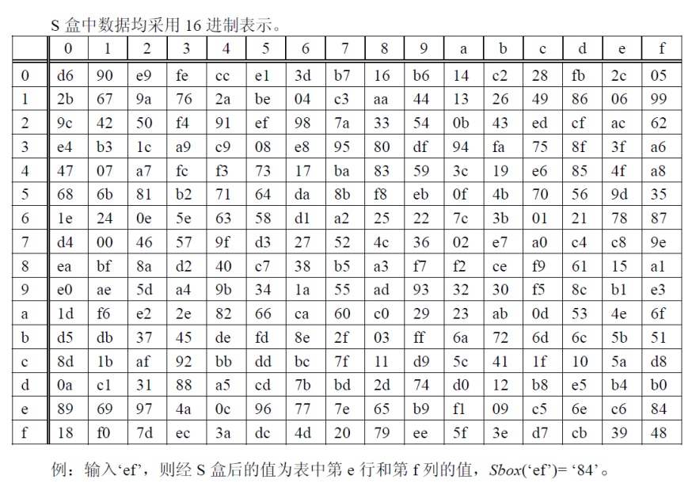
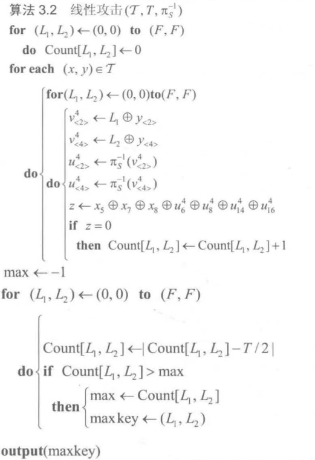
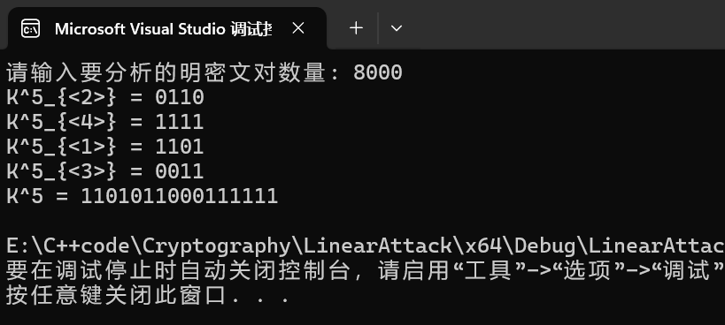
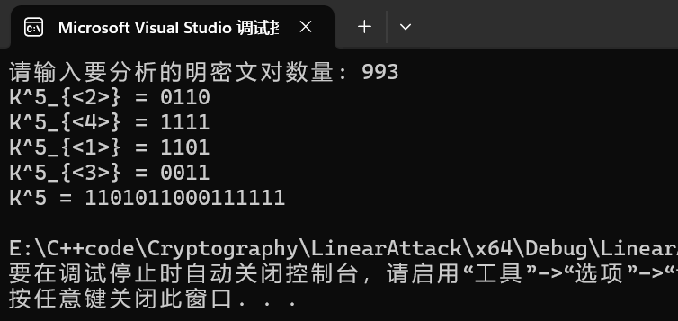
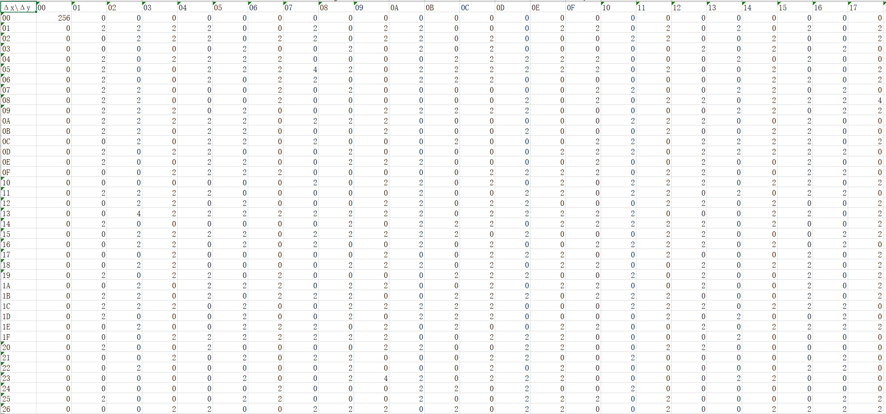

# 第二次报告

<center> 姓名：胡博浩	学号：2212998	专业：信息安全 </center>

## 题目

> 1. 请利用线性密码分析确定 SPN 分组加密算法的(轮)密钥；
>
> 2. 请计算国密分组加密算法 SM4 的 SBox 差分分布表。



## 问题一

### 基本原理

线性密码分析是一种强大的密码分析技术，主要用于分析块密码。线性密码分析的核心思想是寻找明文、密文和密钥之间的线性关系。这种关系通常表现为一个线性方程，涉及明文、密文和密钥的某些比特的异或和。

线性密码分析是一种已知明文攻击手段，其中攻击者掌握了一系列使用相同但未知的密钥 K 加密的明文-密文对。在这样的攻击中，针对每一个明文-密文对，攻击者会尝试所有可能的候选密钥来解密最后一轮的加密结果。对于每个候选密钥，攻击者计算一个选定线性逼近表达式的结果 z，该表达式是一个随机变量。如果这个随机变量 z 呈现出非随机分布——例如，它以显著偏离 1/2 的概率取值为 0——那么可以推测出相应的候选密钥很可能是实际使用的加密密钥。此外，这种偏差 ε 的绝对值越大，表明对应的候选密钥是正确密钥的可能性也就越高。通过这种方式，线性密码分析利用统计学上的异常来识别潜在的正确密钥。

### 步骤

#### 1. 准备数据集

为了执行 SPN 结构的线性密码分析，我们需要准备大量的数据集。这些数据集由使用同一密钥加密的明文及其对应的密文组成。

鉴于所需数据量庞大，我们采取了随机生成明文的方法，并通过 SPN 加密算法对这些随机生成的明文进行加密处理。随后，将每一对明文和密文保存到一个名为 `dataset.txt` 的新文件中，以便于后续调用。

```c++
#include <bitset>
#include <fstream>
#include <iostream>
#include <random>
#include <string>
#include <vector>
using namespace std;

// SPN类定义（保持不变）
class SPN {};

// 生成数据集
void generateDataset(int numPairs, const string& outputFile) {
    // 创建SPN实例
    SPN spn(4, 4, 4,
        { 0xE, 0x4, 0xD, 0x1, 0x2, 0xF, 0xB, 0x8, 0x3, 0xA, 0x6, 0xC, 0x5, 0x9, 0x0, 0x7 },
        { 1, 5, 9, 13, 2, 6, 10, 14, 3, 7, 11, 15, 4, 8, 12, 16 });
    // 设置固定的密钥
    spn.setKey("00111010100101001101011000111111");
    // 设置随机数生成器
    random_device rd;
    mt19937 gen(rd());
    uniform_int_distribution<> dis(0, 1);

    ofstream file(outputFile);
    if (!file.is_open()) {
        cerr << "无法打开文件: " << outputFile << endl;
        return;
    }
    // 生成明密文对并写入文件
    for (int i = 0; i < numPairs; ++i) {
        // 生成随机明文
        string plaintext(16, '0');
        for (char& c : plaintext) {
            c = dis(gen) ? '1' : '0';
        }
        // 加密并写入文件
        file << plaintext << "\n" << spn.encrypt(plaintext) << "\n";
    }

    file.close();
    cout << "已生成 " << numPairs << " 对明密文对，并保存到 " << outputFile << endl;
}

int main() {
    generateDataset(16000, "dataset.txt");
    return 0;
}
```

**代码基本上和上次编程相同，仅仅是多了数据集生成的部分。** 对于明密文对的数量，我选择 **生成 16000 对**，确保数量足够多。

至此，数据集生成完毕，可以直接利用这些数据进行分析。

#### 2. 线性密码分析

在对 SPN 进行线性密码分析时，关键在于找到 S-Box 的有效线性逼近。

##### （1）基本线性分析链

以教材中提供的 SPN 结构为例，我们可以使用以下线性分析链来推导 K2 和 K4：

$$
z = x_5 \oplus x_7 \oplus x_8 \oplus u^4_6 \oplus u^4_8 \oplus u^4_{14} \oplus u^4_{16}
$$

这个线性逼近允许我们分析并推导出第五轮密钥 $K_5$ 中的 8 个比特（K^5_{<2>}和 K^5_{<4>}）。

##### （2）扩展线性分析

为了恢复完整的 $K_5$ 密钥，我们通过查找资料发现了 **额外的线性逼近链**：

$$
z_2 = x_1 \oplus x_2 \oplus x_4 \oplus u_{1}^{4} \oplus u_{5}^{4} \oplus u_{9}^{4} \oplus u_{13}^{4}
$$

$$
z_3 = x_9 \oplus x_{10} \oplus x_{12} \oplus u_{3}^{4} \oplus u_{7}^{4} \oplus u_{11}^{4} \oplus u_{15}^{4}
$$

这两个新的线性逼近链使我们能够扩展分析范围至 K^5_{<1>}和 K^5_{<3>}。

##### （3）组合分析方法

为了更有效地利用这些线性逼近，我们 **引入了一个新的组合变量**：

$$
z^* = z_2 + z_3
$$

通过使用这个组合变量 $z^*$，我们可以获取更多关于 $K_5$ 的信息，从而逐步接近完整密钥的恢复。

##### （4）算法实现

算法的核心思想基于教材中提供的伪代码（如图所示），并进行了必要的扩展和优化。



根据该伪代码可以编写出如下线性攻击算法：

```c++
#include <iostream>
#include <fstream>
#include <vector>
#include <cmath>
#include <algorithm>
#include <iomanip>
#include <bitset>
#include <numeric>

using namespace std;

const int S_BOX[16] = { 14, 4, 13, 1, 2, 15, 11, 8, 3, 10, 6, 12, 5, 9, 0, 7 };
int S_BOX_INV[16];
int COUNT_24[16][16] = { 0 };
int COUNT_13[16][16] = { 0 };

// 初始化S盒的逆
void initSBoxInverse() {
    for (int i = 0; i < 16; i++) S_BOX_INV[S_BOX[i]] = i;
}

// 4位整数与4位二进制数组之间的转换
void intToBinary(int* bin, int num) {
    for (int i = 3; i >= 0; i--) {
        bin[i] = num & 1;
        num >>= 1;
    }
}

int binaryToInt(const int* bin, int size) {
    return accumulate(bin, bin + size, 0, [](int x, int y) { return (x << 1) + y; });
}

// 线性分析函数，用于求解K2和K4
void linearAnalysis24(const string& pt, const string& ct) {
    int k1[4], k2[4], mid[16] = { 0 }, out[16] = { 0 };

    for (int i = 0; i < 16; i++) {
        for (int j = 0; j < 16; j++) {
            intToBinary(k1, i);
            intToBinary(k2, j);

            for (int k = 0; k < 4; k++) {
                mid[4 + k] = k1[k] ^ (ct[4 + k] - '0');
                mid[12 + k] = k2[k] ^ (ct[12 + k] - '0');
            }

            intToBinary(out + 4, S_BOX_INV[binaryToInt(mid + 4, 4)]);
            intToBinary(out + 12, S_BOX_INV[binaryToInt(mid + 12, 4)]);

            int z = (pt[4] - '0') ^ (pt[6] - '0') ^ (pt[7] - '0') ^ out[5] ^ out[7] ^ out[13] ^ out[15];
            if (z == 0) COUNT_24[i][j]++;
        }
    }
}

// 线性分析函数，用于求解K1和K3
void linearAnalysis13(const string& pt, const string& ct, int K2, int K4) {
    int k1[4], k2[4], mid[16] = { 0 }, out[16] = { 0 }, K2_bin[4], K4_bin[4];

    intToBinary(K2_bin, K2);
    intToBinary(K4_bin, K4);

    for (int k = 0; k < 4; k++) {
        mid[4 + k] = K2_bin[k] ^ (ct[4 + k] - '0');
        mid[12 + k] = K4_bin[k] ^ (ct[12 + k] - '0');
    }

    intToBinary(out + 4, S_BOX_INV[binaryToInt(mid + 4, 4)]);
    intToBinary(out + 12, S_BOX_INV[binaryToInt(mid + 12, 4)]);

    for (int i = 0; i < 16; i++) {
        for (int j = 0; j < 16; j++) {
            intToBinary(k1, i);
            intToBinary(k2, j);

            for (int k = 0; k < 4; k++) {
                mid[k] = k1[k] ^ (ct[k] - '0');
                mid[8 + k] = k2[k] ^ (ct[8 + k] - '0');
            }

            intToBinary(out, S_BOX_INV[binaryToInt(mid, 4)]);
            intToBinary(out + 8, S_BOX_INV[binaryToInt(mid + 8, 4)]);

            int z2 = (pt[0] - '0') ^ (pt[1] - '0') ^ (pt[3] - '0') ^ out[0] ^ out[4] ^ out[8] ^ out[12];
            int z3 = (pt[8] - '0') ^ (pt[9] - '0') ^ (pt[11] - '0') ^ out[2] ^ out[6] ^ out[10] ^ out[14];

            COUNT_13[i][j] += abs(z2) + abs(z3);
        }
    }
}

// 寻找最可能的密钥
pair<int, int> findMaxKey(int numPairs, int Count[16][16]) {
    int maxCount = -1, maxKey1 = 0, maxKey2 = 0;
    for (int i = 0; i < 16; i++) {
        for (int j = 0; j < 16; j++) {
            Count[i][j] = abs(Count[i][j] - numPairs / 2);
            if (Count[i][j] > maxCount) {
                maxCount = Count[i][j];
                maxKey1 = i;
                maxKey2 = j;
            }
        }
    }
    return { maxKey1, maxKey2 };
}

int main() {
    initSBoxInverse();

    int numPairs;
    cout << "请输入要分析的明密文对数量: ";
    cin >> numPairs;

    ifstream inputFile("dataset.txt");
    if (!inputFile.is_open()) {
        cerr << "打开文件失败" << endl;
        return 1;
    }

    string pt, ct;

    // 读取明密文对并进行K2和K4的线性分析
    for (int i = 0; i < numPairs; i++) {
        inputFile >> pt >> ct;
        linearAnalysis24(pt, ct);
    }
    // 求解K2和K4
    pair<int, int> keys24 = findMaxKey(numPairs, COUNT_24);
    int K2 = keys24.first, K4 = keys24.second;

    cout << "K^5_{<2>} = " << setfill('0') << setw(4) << bitset<4>(K2) << endl;
    cout << "K^5_{<4>} = " << setfill('0') << setw(4) << bitset<4>(K4) << endl;

    // 重新读取文件并利用K2和K4进行K1和K3的线性分析
    inputFile.clear();
    inputFile.seekg(0);
    for (int i = 0; i < numPairs; i++) {
        inputFile >> pt >> ct;
        linearAnalysis13(pt, ct, K2, K4);
    }
    // 求解K1和K3
    pair<int, int> keys13 = findMaxKey(numPairs, COUNT_13);
    int K1 = keys13.first, K3 = keys13.second;

    cout << "K^5_{<1>} = " << setfill('0') << setw(4) << bitset<4>(K1) << endl;
    cout << "K^5_{<3>} = " << setfill('0') << setw(4) << bitset<4>(K3) << endl;

    // 输出完整的K5密钥
    int K5 = (K1 << 12) | (K2 << 8) | (K3 << 4) | K4;
    cout << "K^5 = " << setfill('0') << setw(16) << bitset<16>(K5) << endl;

    return 0;
}
```

##### （5）代码流程

1. 初始化阶段：
   - 定义常量和全局变量（S_BOX, S_BOX_INV, COUNT_24, COUNT_13）
   - 实现辅助函数（initSBoxInverse, intToBinary, binaryToInt）

2. 主函数流程：
   a. 初始化 S 盒的逆（调用 initSBoxInverse()）
   b. 用户输入要分析的明密文对数量
   c. 打开并读取数据文件（"dataset.txt"）

3. 第一轮线性分析（求解 K2 和 K4）：
   - 循环读取每对明密文
   - 对每对明密文调用 linearAnalysis24() 函数
   - 使用 findMaxKey() 函数找出最可能的 K2 和 K4
   - 输出 K^5_{<2>} 和 K^5_{<4>} 的 4 位二进制值

4. 第二轮线性分析（求解 K1 和 K3）：
   - **重置文件指针到文件开头**
   - 再次循环读取每对明密文
   - 对每对明密文调用 linearAnalysis13() 函数，**传入已求得的 K2 和 K4**
   - 使用 findMaxKey() 函数找出最可能的 K1 和 K3
   - 输出 K^5_{<1>} 和 K^5_{<3>} 的 4 位二进制值

5. 结果输出：
   - 组合 K1, K2, K3, K4 形成完整的 16 位 K5 密钥
   - 输出完整的 K5 密钥的二进制表示

6. 核心分析函数：
   a. linearAnalysis24():
      - 遍历可能的 K2 和 K4 组合
      - 进行 S 盒逆运算和异或操作
      - 计算线性近似表达式 z
      - 更新 COUNT_24 数组

   b. linearAnalysis13():
      - **使用已知的 K2 和 K4 进行部分解密**
      - 遍历可能的 K1 和 K3 组合
      - 进行 S 盒逆运算和异或操作
      - 计算线性近似表达式 z2 和 z3
      - 更新 COUNT_13 数组

   c. findMaxKey():
      - 遍历 Count 数组（COUNT_24 或 COUNT_13）
      - 计算每个密钥组合的偏差
      - 找出偏差最大的密钥组合

#### 3. 得出结果

线性攻击所需的明密文对的数量，可以通过 $$ T = \frac{c}{\varepsilon^2} $$ 得出，其中，`c` 表示一个常数，`ε` 表示偏差，`T` 为所需的明-密文对的数量。在本题中，对于我们选取的随机变量 `z`，通过线性逼近表，计算可得 `ε = -1/32`，选取 `T = 8000` 即可。



也可以尝试减少检测的对数，经过测试，针对这份数据集，**最少只需要 993 次** 即可得出正确结果：



需要注意的是，**1 和 3 的结果基于 2 和 4**，也就是说如果 1 和 3 算错了、2 和 4 必错；另外，**算法效率非常高**，尤其是在数据集 993 对时 **几乎秒出结果**。

## 问题二

### 1. 原理说明

差分密码分析是一种密码学攻击方法，它通过研究加密函数输入和输出之间的差异（差分）来分析密码系统的安全性。对于一个给定的 S-盒 $S: \{0,1\}^n \rightarrow \{0,1\}^n$，差分分布表描述了输入差分 $\Delta X$ 和输出差分 $\Delta Y$ 之间的关系。

形式化定义如下：

- 输入对：$x, x' \in \{0,1\}^n$

- 输入差分：$\Delta X = x \oplus x'$

- 输出：$y = S(x), y' = S(x')$

- 输出差分：$\Delta Y = y \oplus y'$

DDT 中的每个元素 $DDT[\Delta X][\Delta Y]$ 表示在给定输入差分 $\Delta X$ 下，产生输出差分 $\Delta Y$ 的次数。

### 2. 计算步骤

- 初始化一个 256x256 的二维数组 `diff_table`，所有元素设置为 0。
- 对于每一个可能的输入差分 $\Delta X$ (0 到 255):
  - 遍历每一个可能的输入值 $x$ (0 到 255):
    - 计算另一个输入值：$x' = x \oplus \Delta X$
    - 使用 S-盒 得到两个输出值：$y = S(x)$, $y' = S(x')$
    - 计算输出差分：$\Delta Y = y \oplus y'$
    - 增加计数：`diff_table[ΔX][ΔY] += 1`
- 最后得到的 `diff_table` 就是 SBox 的差分分布表。

### 3. 代码实现

以下是 Python 代码实现，用于计算 SM4 S-盒的差分分布表，并将其保存为 Excel 文件（`.xlsx` 格式）。

为什么不用 C++呢，主要是表格保存比较复杂，而且如果想要保存为 `.xlsx` 这样便于查看的格式还需要另外安装库……

```python
import openpyxl

# SM4 S-box
sbox = [
    0xd6, 0x90, 0xe9, 0xfe, 0xcc, 0xe1, 0x3d, 0xb7, 0x16, 0xb6, 0x14, 0xc2, 0x28, 0xfb, 0x2c, 0x05,
    0x2b, 0x67, 0x9a, 0x76, 0x2a, 0xbe, 0x04, 0xc3, 0xaa, 0x44, 0x13, 0x26, 0x49, 0x86, 0x06, 0x99,
    0x9c, 0x42, 0x50, 0xf4, 0x91, 0xef, 0x98, 0x7a, 0x33, 0x54, 0x0b, 0x43, 0xed, 0xcf, 0xac, 0x62,
    0xe4, 0xb3, 0x1c, 0xa9, 0xc9, 0x08, 0xe8, 0x95, 0x80, 0xdf, 0x94, 0xfa, 0x75, 0x8f, 0x3f, 0xa6,
    0x47, 0x07, 0xa7, 0xfc, 0xf3, 0x73, 0x17, 0xba, 0x83, 0x59, 0x3c, 0x19, 0xe6, 0x85, 0x4f, 0xa8,
    0x68, 0x6b, 0x81, 0xb2, 0x71, 0x64, 0xda, 0x8b, 0xf8, 0xeb, 0x0f, 0x4b, 0x70, 0x56, 0x9d, 0x35,
    0x1e, 0x24, 0x0e, 0x5e, 0x63, 0x58, 0xd1, 0xa2, 0x25, 0x22, 0x7c, 0x3b, 0x01, 0x21, 0x78, 0x87,
    0xd4, 0x00, 0x46, 0x57, 0x9f, 0xd3, 0x27, 0x52, 0x4e, 0x36, 0x02, 0xe7, 0xa0, 0xc4, 0xc8, 0x9e,
    0xea, 0xbf, 0x8a, 0xd2, 0x40, 0xc7, 0x38, 0xb5, 0xa3, 0xf7, 0xf2, 0xce, 0xf9, 0x61, 0x15, 0xa1,
    0xe0, 0xae, 0x5d, 0xa4, 0x9b, 0x34, 0x1a, 0x55, 0xad, 0x93, 0x32, 0x30, 0xf5, 0x8c, 0xb1, 0xe3,
    0x1d, 0xf6, 0xe2, 0x2e, 0x82, 0x66, 0xca, 0x60, 0xc0, 0x29, 0x23, 0xab, 0x0d, 0x53, 0x4e, 0x6f,
    0xd5, 0xdb, 0x37, 0x45, 0xde, 0xfd, 0x8e, 0x2f, 0x03, 0xff, 0x6a, 0x72, 0x6d, 0x6c, 0x5b, 0x51,
    0x8d, 0x1b, 0xaf, 0x92, 0xbb, 0xdd, 0xbc, 0x7f, 0x11, 0xd9, 0x5c, 0x41, 0x1f, 0x10, 0x5a, 0xd8,
    0x0a, 0xc1, 0x31, 0x88, 0xa5, 0xcd, 0x7b, 0xbd, 0x2d, 0x74, 0xd0, 0x12, 0xb8, 0xe5, 0xb4, 0xb0,
    0x89, 0x69, 0x97, 0x4a, 0x0c, 0x96, 0x77, 0x7e, 0x65, 0xb9, 0xf1, 0x09, 0xc5, 0x6e, 0xc6, 0x84,
    0x18, 0xf0, 0x7d, 0xec, 0x3a, 0xdc, 0x4d, 0x20, 0x79, 0xee, 0x5f, 0x3e, 0xd7, 0xcb, 0x39, 0x48
]

# 创建差分分布表
diff_table = [[0 for _ in range(256)] for _ in range(256)]

# 计算差分分布
for delta_x in range(256):
    for x in range(256):
        delta_y = sbox[x] ^ sbox[x ^ delta_x]
        diff_table[delta_x][delta_y] += 1

# 创建一个新的工作簿
wb = openpyxl.Workbook()
ws = wb.active

# 写入表头
header = ['Δx\\Δy'] + [f'{i:02X}' for i in range(256)]
ws.append(header)

# 写入表格内容
for i, row in enumerate(diff_table):
    ws.append([f'{i:02X}'] + row)

# 保存为 .xlsx 文件
wb.save('sm4_sbox_diff_table.xlsx')

print("差分分布表已保存到 sm4_sbox_diff_table.xlsx 文件中。")
```

### 4. 结果展示

执行上述代码后，SM4 S-盒的差分分布表将被保存在 `sm4_sbox_diff_table.xlsx` 文件中。部分结果如下：


