<div align='center'>
<b> <font face='微软雅黑' size='6'> 恶意代码分析与防治技术课程实验报告 </font> </b>
</div>


<div align='center'>
<b> <font font face='微软雅黑' size='6'> 实验一 </font> </b>
</div>


<div>
<font face='宋体' size='6'>&nbsp;&nbsp;&nbsp;&nbsp;&nbsp; 学 院：网络空间安全学院 </font> <br>
<font face='宋体' size='6'>&nbsp;&nbsp;&nbsp;&nbsp;&nbsp; 专 业：信息安全专业 </font> <br>
<font face='宋体' size='6'>&nbsp;&nbsp;&nbsp;&nbsp;&nbsp; 学 号：2212998 </font> <br>
<font face='宋体' size='6'>&nbsp;&nbsp;&nbsp;&nbsp;&nbsp; 姓 名：胡博浩 </font> <br>
<font face='宋体' size='6'>&nbsp;&nbsp;&nbsp;&nbsp;&nbsp; 班 级：信息安全 </font> <br>
</div>

## 一、实验目的

---

1. 完成教材上 lab1-01 至 Lab1-04 的题目, 编写 Yara 引擎规则。
2. 根据理论课要求提交所有样本在 VIrusTotal 和 MicroSoft Defender AntiVirus 上的的分析结果。

## 二、实验原理

---

### （一）PE 文件格式

PE 文件是 Windows 操作系统下使用的一种可执行文件格式，广泛用于应用程序、动态链接库等。PE 文件包括以下关键部分：

1. **DOS 头**：这是 PE 文件最开始的部分，主要用于兼容早期的 MS-DOS 系统。在现代操作系统中，DOS 头通常只是起到兼容性作用，不会执行。它包含了一个重要的字段——`e_lfanew`，该字段指向真正的 PE 文件头位置。
2. **PE 文件头**：紧随 DOS 头之后，PE 头定义了文件的整体结构，包括文件类型、机器类型、节表的位置等关键信息。
3. **可选头**：尽管名称为“可选”，但它在大多数 PE 文件中是必需的。该部分包含了很多关键信息，包括程序的入口点、文件加载到内存中的基地址、堆栈和堆的大小、子系统类型、文件对齐信息等。
4. **节表**：描述了文件中的各个节区，如代码节、数据节、资源节等。每个节区有其虚拟地址、大小、权限等信息，这些节区在程序加载到内存时会映射到不同的内存区域。
5. **导入表与导出表**：
   - **导入表**：描述了程序在运行时所依赖的外部 DLL 文件及其函数。这部分允许程序在执行时调用外部库的功能。
   - **导出表**：列出了该 PE 文件导出的函数或变量，使得其他程序或模块可以引用。
6. **重定位表**：用于当程序被加载到不同于预期的内存地址时，修改程序中的地址引用。它确保程序能够正确运行，无论加载地址是否变化。

### （二）加壳

加壳是指将可执行文件（通常是 PE 文件）通过加密或压缩技术进行封装，使其不直接以原始形式暴露出来。

然而，恶意软件也经常利用加壳技术来躲避杀毒软件和安全分析工具的检测。这些恶意程序通过加壳隐藏其真正的代码，使得静态分析难以进行，同时可能使用多层加壳或自定义的壳程序，进一步提高分析的复杂性。

### （三）加壳的分析与破解

尽管加壳增加了分析难度，但通过工具和手动分析，仍然可以破解加壳文件。以下是一些常用的解壳技术：

1. **静态分析工具**：例如 PEiD、Exeinfo PE 可以识别文件是否被加壳，并尝试提取出壳后的代码。
2. **动态调试工具**：例如 OllyDbg、x64dbg 等，可以在程序运行时中断壳的解压或解密过程，进而还原出原始代码。

加壳程序增加了逆向工程的难度，但通过深入分析和利用工具，仍可以有效地对其进行解壳和分析。

## 三、实验过程

---

我将使用 `DIE`、`exeinfoPE`、`Resource Hacker`、`UPX` 等工具来对 Lab1 的 PE 文件进行查看，分析各个样本的特征。

### （一）完成 Lab1-01 至 Lab1-04 的题目

#### 1.Lab01-01

**这个实验使用 `Lab01-01.exe` 和 `Lab01-01.dll` 文件，使用本章描述的工具和技术来获取关于这些文件的信息.**

>Q1.将文件上传至 [`VirusTotal`](https://www.VirusTotal.com/) 进行分析并查看报告。文件匹配到了已有的反病毒软件特征吗？  

将 `Lab01-01.dll` 和 `Lab01-01.exe` 反别上传，结果如下图所示：

**EXE 结果**:

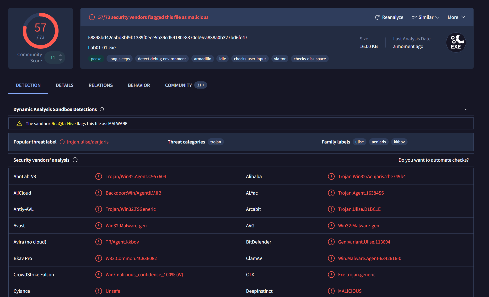

**DLL 结果**:

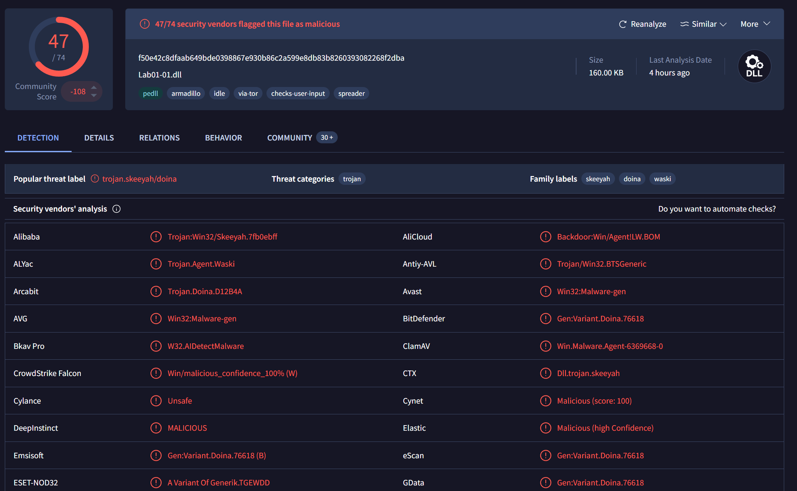

可以看到许多公司的分析结果，均被大部分安全厂商和沙盒标记为病毒。因此可以肯定是 **危险的病毒**。

>Q2.这些文件是什么时候编译的？

使用 DIE 工具打开 `.exe` 和 `.dll` 文件。对于每个文件，观察 IMAGE_NT_HEADERS-> IMAGE_FILE_ HEADER-> Time Date Stamp 字段，这个字段显示了文件的编译时间，如以下两张图所示：

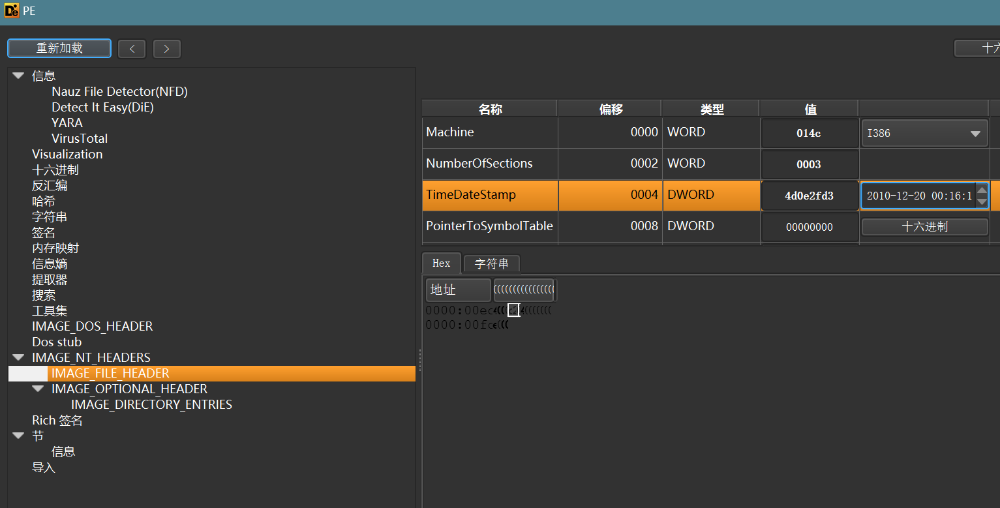

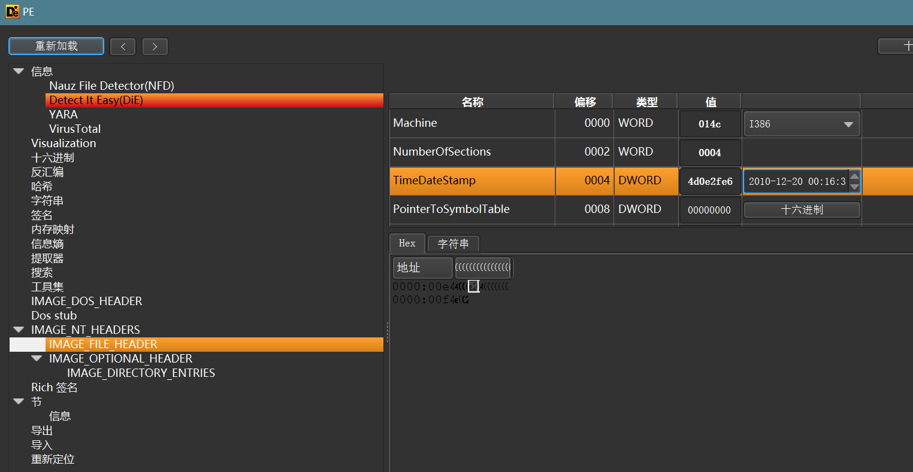

可以看到这两个文件都是在 **2010 年 12 月 20 日** 被编译的，前后只差了 2 秒钟，说明很有可能是由同一作者在同一时间创建了这些文件。因为 DLL 动态链接库文件无法运行自己，故而 **.exe 文件应该是用来使用或安装.dll 文件的**。


>Q3.这两个文件中是否存在迹象说明它们是否被加壳或混淆了？如果是，这些迹象在哪里？

使用 `ExeinfoPE` 和 `DIE` 分别对 `exe` 和 `dll` 文件查壳，结果如下，两个工具均显示无壳、并且 `exe` 和 `dll` 文件是由 Visual Studio6.0 编写。

**EXE：**

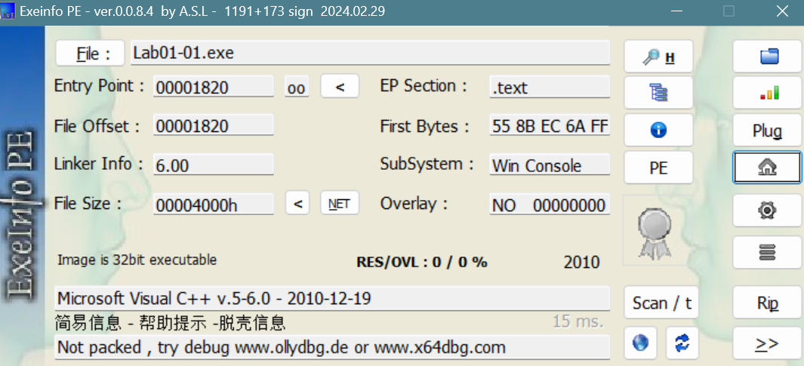


**DLL:**

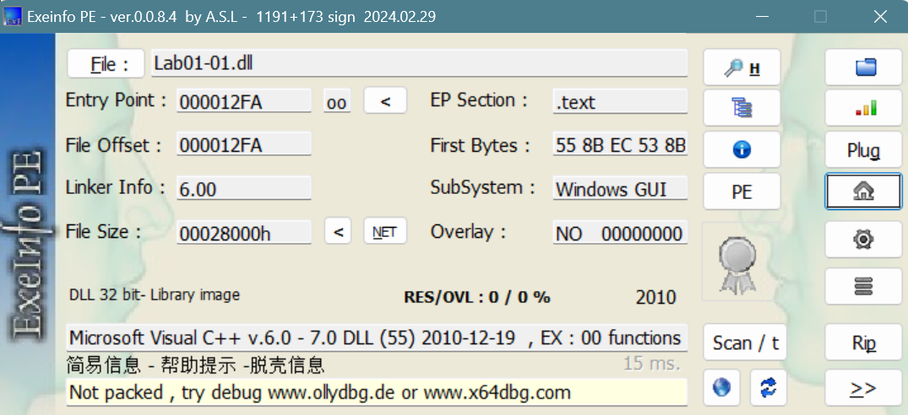

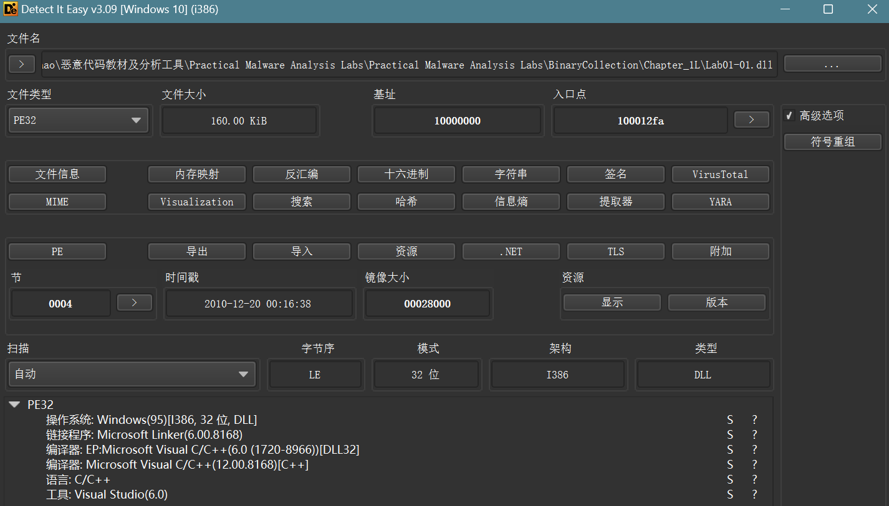

同时，查看文件的分节信息，虚拟大小并没有比原始数据大很多、而且导入表函数较少、也都有着适当大小的良好组织的文件节。**说明这些文件并没有被加壳**。

**EXE：**

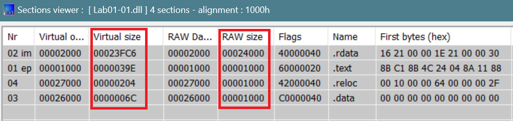

**DLL：**

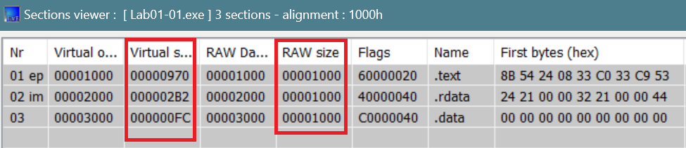


>Q4.是否有导入函数显示出了这个恶意代码是做什么的？如果是，是哪些导入函数？

使用 `ExeinfoPE` 对 `.exe` 和 `.dll` 文件的导入表进行查看。

**EXE：**

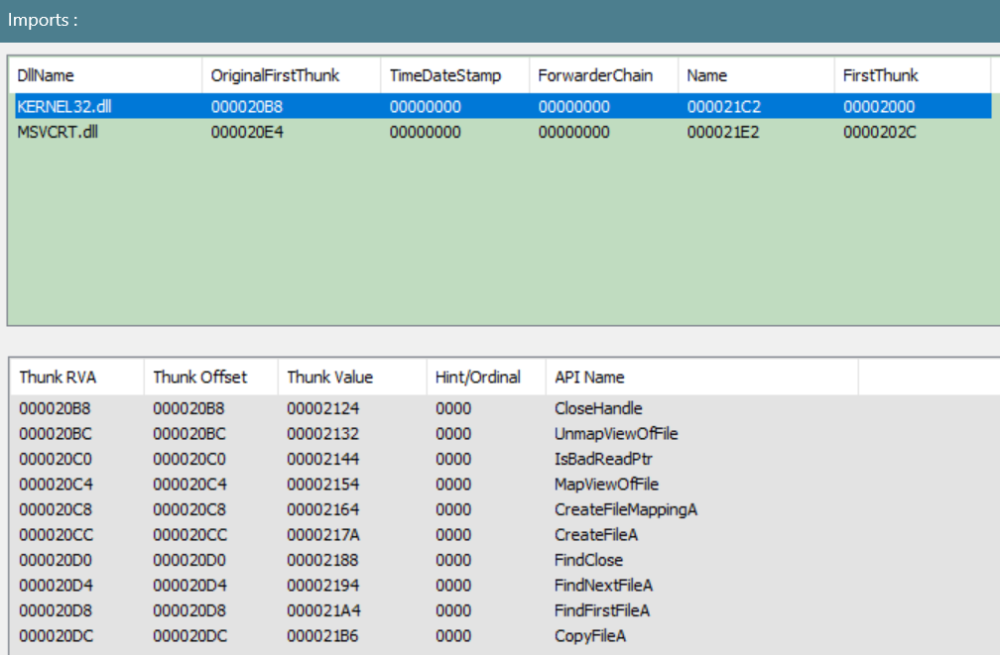

可以看到一些打开与操作文件的函数以及 `FindFirstFileA、FindNextFileA和CopyFileA` 等，这些函数意味着，恶意代码可以 **对文件进行搜索、打开、复制和修改等操作**，同时.exe 字符串说明，恶意代码正在 **寻找搜索目标系统上的可执行文件**。

**DLL：**

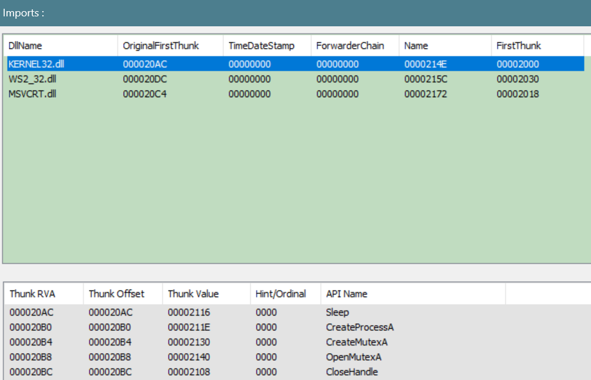

可以看到 `CreateProcessA` 和 `Sleep` 两个函数，这两个函数普遍使用在 **后门程序** 中。另外 `WS2_32.dll` 则提供了 **联网** 功能。

>Q5.是否有任何其他文件或基于主机的迹象，让你可以在受感染系统上查找？

**EXE：**

通过 `DIE` 检查字符串，发现 `kerne132.dll、kernel32.dll、C:\windows\system32\kerne132.dll、C:\Windows\System32\Kernel32.dll`。用数字 1 代替了字母 1，猜测是为了模仿系统文件 kernel32.dll 的恶意文件，因此 **kerne132.dll 可以用来在主机作为恶意代码感染的线索进行搜索**。

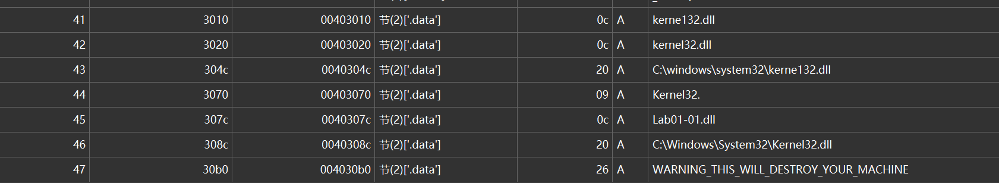

**DLL：**

通过 `DIE` 检查字符串，除了已知的 `CreateProcessA` 和 `Sleep`，我们还注意到 `exec、sleep、127.26.152.13`。

**猜测 127.26.152.13 是攻击者的 ip 地址，exec 用于通过网络给后门程序传送命令，再利用 CreateProcess 函数运行某个程序，而 sleep 可能用于让后门程序进入休眠模式。**

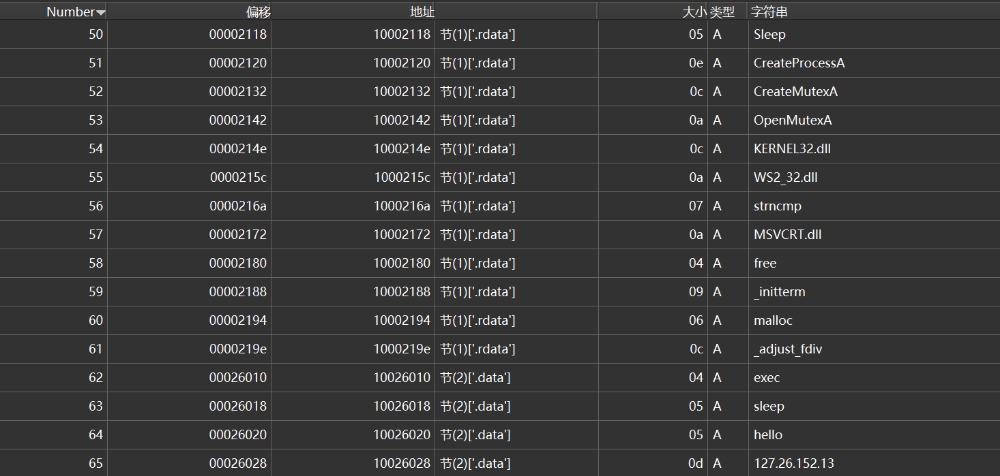

>Q6.是否有基于网络的迹象，可以用来发现受感染机器上的这个恶意代码？


根据前面的分析，**`WS2_32.dll` 提供了联网功能；`127.26.152.13` 是攻击者的 ip 地址；`exec` 用于通过网络给后门程序传送命令；`CreateProcess` 函数运行某个程序；而 `sleep` 可能用于让后门程序进入休眠模式。**

>Q7.你猜这些文件的目的是什么？

**根据上述的分析，可以推断出该样本的行为: Lab01-01.exe 负责安装和运行 Lab01-01.dll ，把该 dll 伪装成 kerne132.dll 放入 C:\windows\system32\kerne132.dll 中，之后启动与后门地址 127.26.152.13 的会话，使其拥有本机的命令运行权限， 通过 exec 来启动子进程，完成某些工作，并使用 sleep 来使其进入休眠模式，达到后门攻击的效果。**

#### 2.lab01-02

**分析 `Lab01-02.exe` 文件.**


>Q1.将 `Lab01-02.exe` 文件上传至 [`VirusTotal`](https://www.VirusTotal.com/) 进行分析并查看报告。文件匹配到了己有的反病毒软件特征吗？


上传可执行文件后的结果如下图所示：

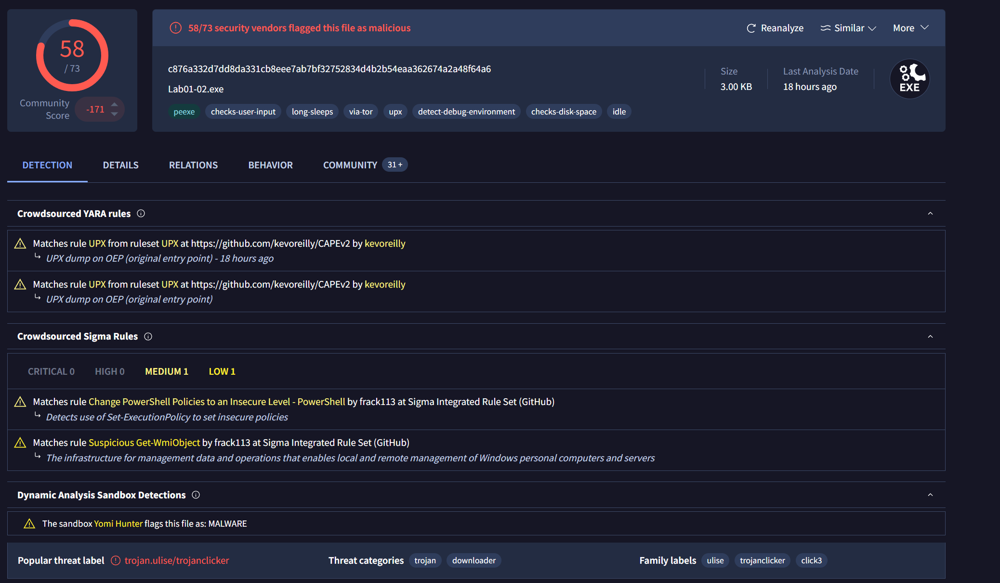

可以看到 **有 58 个安全厂商将其标记为恶意程序**。

>Q2.是否有这个文件被加壳或混淆的任何迹象？如果是这样，这些迹象是什么？如果该文件被加壳，请进行脱壳，如果可能的话。

同样使用 `ExeinfoPE` 和 `DIE` 查壳，结果如下；同时查看节区信息，出现 UPX 字段，说明 **加了 `UPX` 壳、版本应该为 3.04**。

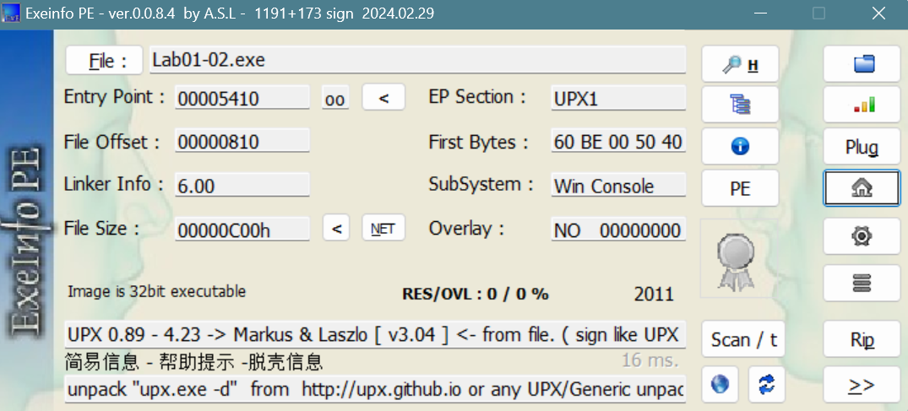

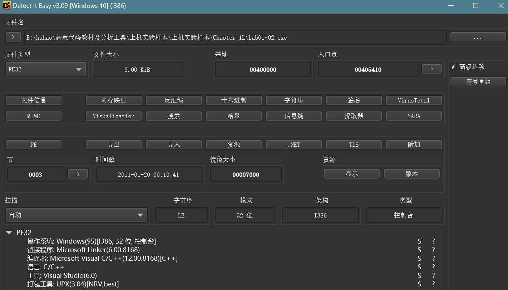


对于 UPX 壳，直接使用 UPX 工具即可脱壳

```cmd
upx -d File
```

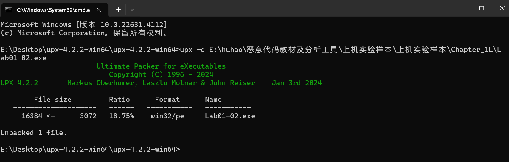

脱壳后再次通过 `ExeinfoPE` 和 `DIE` 查程序信息，可以看出来此时没有加壳或者混淆的痕迹了，说明脱壳成功。


>Q3.有没有任何导入函数能够暗示出这个程序的功能？如果是，是哪些导入函数，它们会告诉你什么？

使用 `ExeinfoPE` 查看导入表，发现 `CreateServiceA，StartServiceCtrlDispatcherA，InternetOpenUrlA，InternetOpenA`，猜测该病毒会 **进行联网、打开网页**。


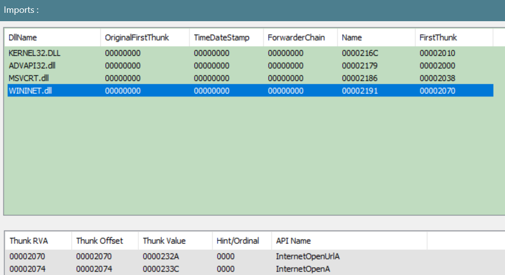

>Q4.哪些基于主机或基于网络的迹象可以被用来确定被这个恶意代码所感染的机器？

通过 `DIE` 查看字符串，发现**`http://www.malwareanalysisbook.com`，可能是 `InterneOpenURL` 函数中所打开的 `URL`；`HGL345` 可能是攻击者的信息；`Malservice` 字符串可能是``CreateServiceA`函数所创建的服务名称；`Internet Explorer 8.0`应该是打开的浏览器**。

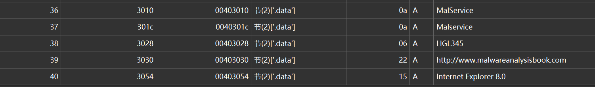

所以可以通过 **`http://www.malwareanalysisbook.com` 网址、`HGL345` 关键字符、`Malservice` 服务、`Internet Explorer 8.0` 浏览器**，来检查恶意代码感染的主机。

#### 3.lab01-03

**分析 `Lab01-03.exe` 文件.**

>Q1.将 `Lab01-03.exe` 文件上传至 [`VirusTotal`](https://www.VirusTotal.com/) 进行分析并查看报告。文件匹配到了已有的反病毒软件特征吗？

上传可执行文件后的结果如下图所示：

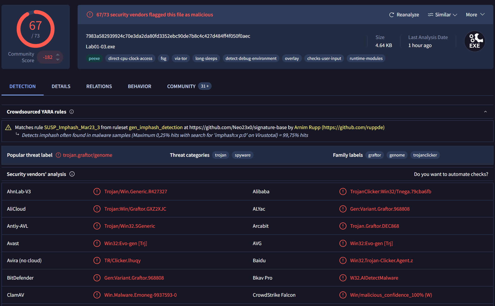

可以看到 **有 67 个安全厂商将其标记为病毒**。

>Q2.是否有这个文件被加壳或混淆的任何迹象？如果是这样，这些迹象是什么？如果该文件被加壳，请进行脱壳，如果可能的话。

同样使用 `ExeinfoPE` 和 `DIE` 查壳，但是只能发现存在壳、不知道是什么壳。

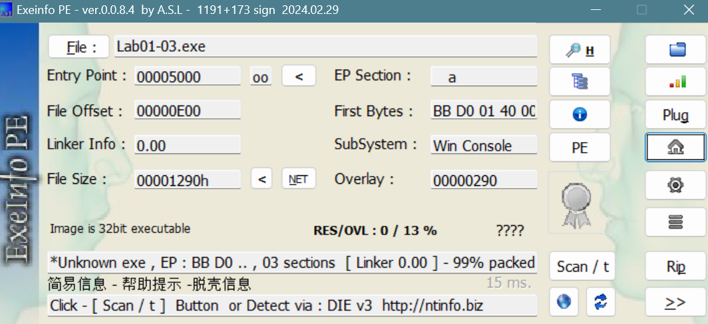

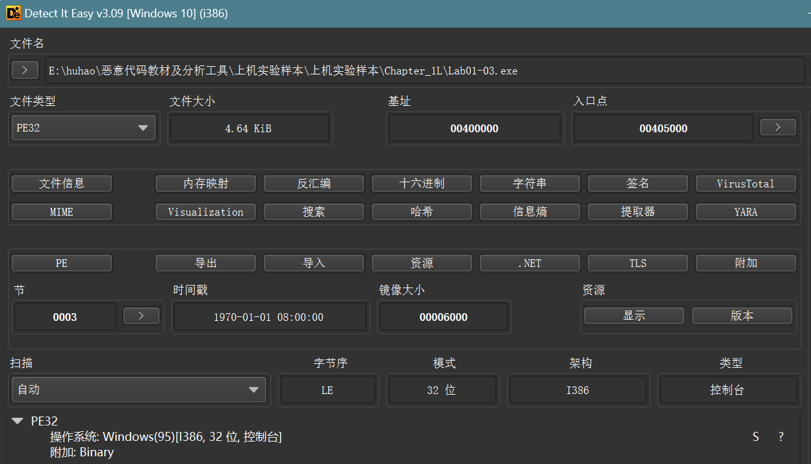

估计应该是老古董壳，遂使用老版查壳工具 `StudyPE+` 和 `pestudio` 查看，发现 **是 FSGv1.00 的壳**

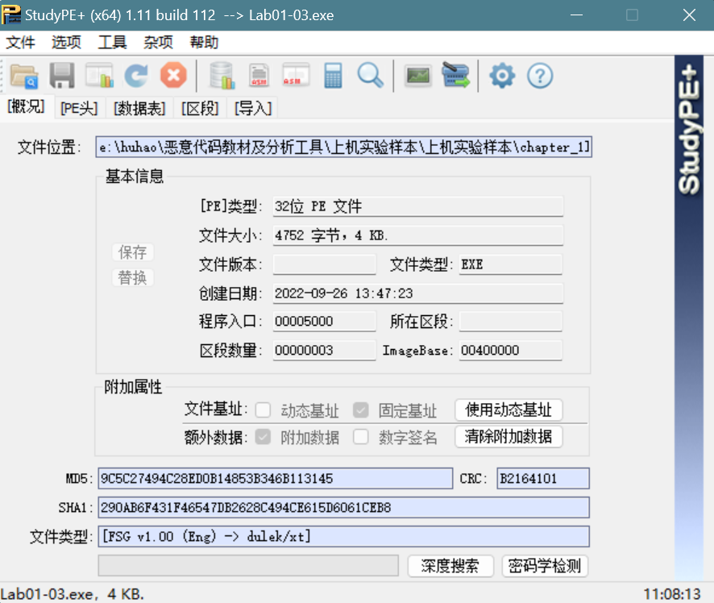

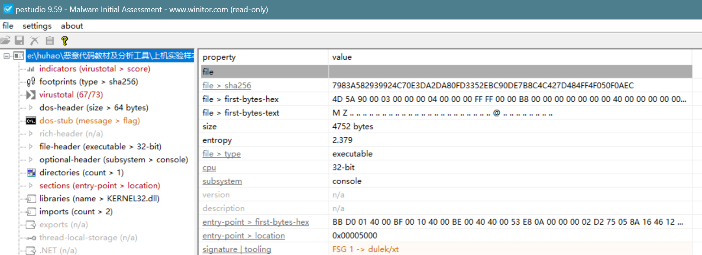

对于这种算是比较常见的壳，我们可以直接使用通用脱壳工具来脱壳，也避免了手动脱壳时病毒的危险。

我随便使用了一个工具 `XVolkolak 0.22` 脱壳，成功脱壳，生成了 `Lab01-03.unp.exe`

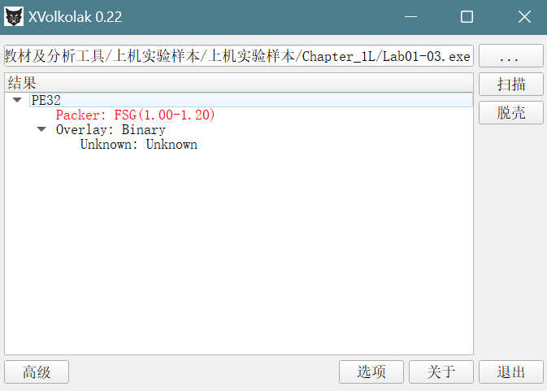

再次使用 DIE 查看，发现无壳

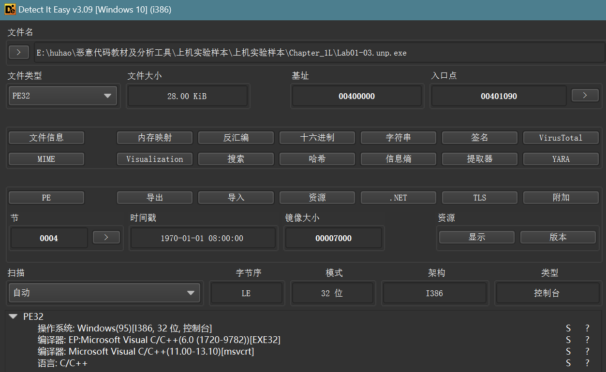

>Q3.有没有任何导入函数能够暗示出这个程序的功能？如果是，是哪些导入函数，它们会告诉你什么？

使用 `ExeinfoPE` 查看导入表，发现 OLE32.dDLL，这里面的函数用于提供 COM 的核心功能和接口，因此可以猜测 **该病毒可能是创建 COM 对象, 然后对其进行操作, 修改系统对象、或者隐藏自身**。

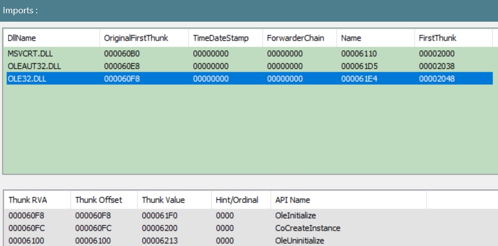

>Q4.有哪些基于主机或基于网络的迹象，可以被用来确定被这个恶意代码所感染的机器？

使用 `DIE` 查看字符串，发现 **可疑网址 `http://www.malwareanalysisbook.com/ad.html`、以及一些奇怪的字符 `ole32.vd、}OLEAUTLA、_getmas`，** 这些可以作为特征进行检查。

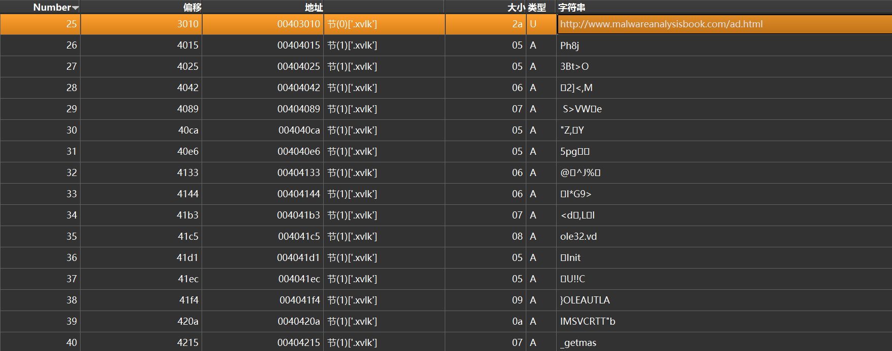

#### 4.lab01-04

**分析 `Lab01-04.exe` 文件.**

>Q1.将 `Lab01-04.exe` 文件上传至 [`VirusTotal`](https://www.VirusTotal.com/) 进行分析并查看报告。文件匹配到了已有的反病毒软件特征吗？

上传可执行文件后的结果如下图所示：

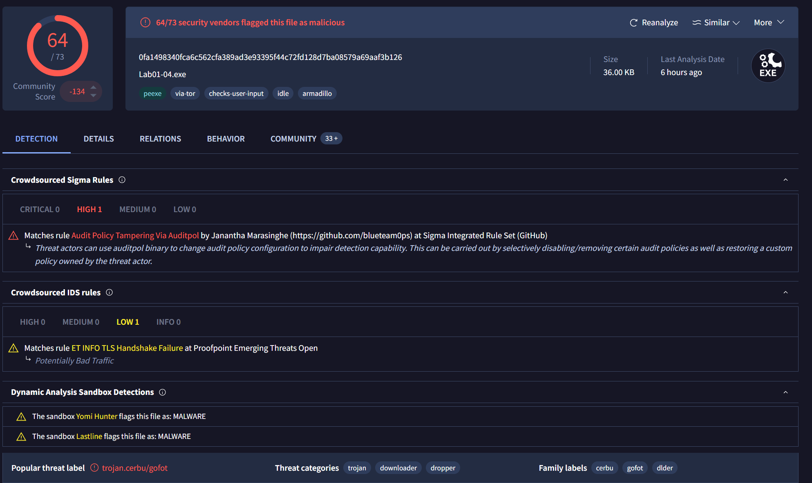

可以看到 **有 64 个安全厂商将其标记为病毒**，而且结果表明这个程序是 **与下载器相关的**。

>Q2.是否有这个文件被加壳或混淆的任何迹象？如果是这样，这些迹象是什么？如果该文件被加壳，请进行脱壳，如果可能的话。

使用 `ExeinfoPE` 和 `DIE` 查看，发现无壳

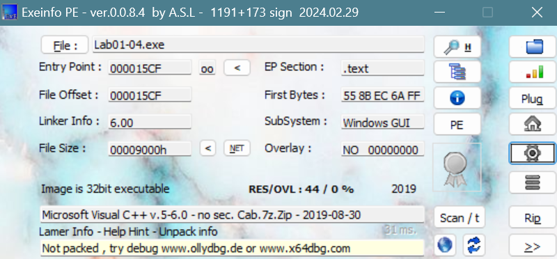

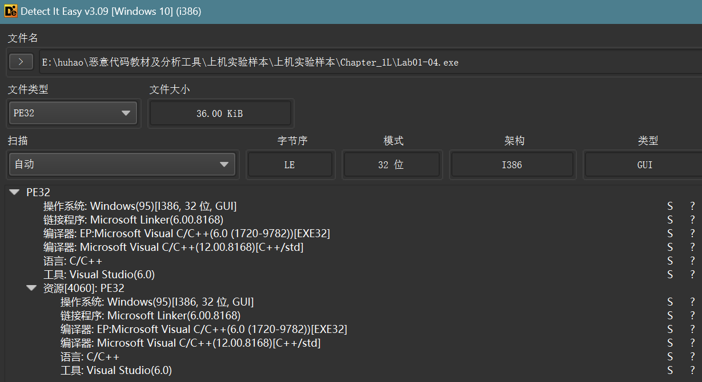

并且查看节表信息，PE 头部分组织良好、虚拟大小和原始数据大小基本一致，因此没有迹象显示这个文件是加壳或混淆的。

>Q3.这个文件是什么时候被编译的？

使用 `DIE` 查看文件头信息，发现文件是在 **2019 年 8 月** 编译的，如下图所示：

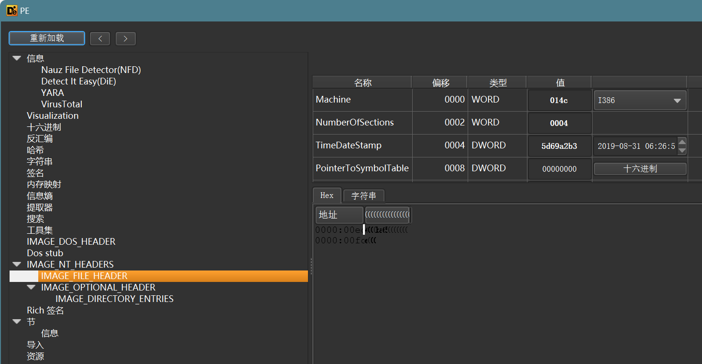


但是考虑到文件的实际创建时间，这个编译时间 **很有可能是伪造的**，所以 **还不能确定** 这个文件到底是何时被编译的。

>Q4.有没有任何导入函数能够暗示出这个程序的功能？如果是，是哪些导入函数，它们会告诉你什么？

查看导入表，发现诸多可能被恶意代码利用的函数 `MoveFileA、CreateRemoteThread、OpenProcess、FindResourceA` 等，如下图所示：

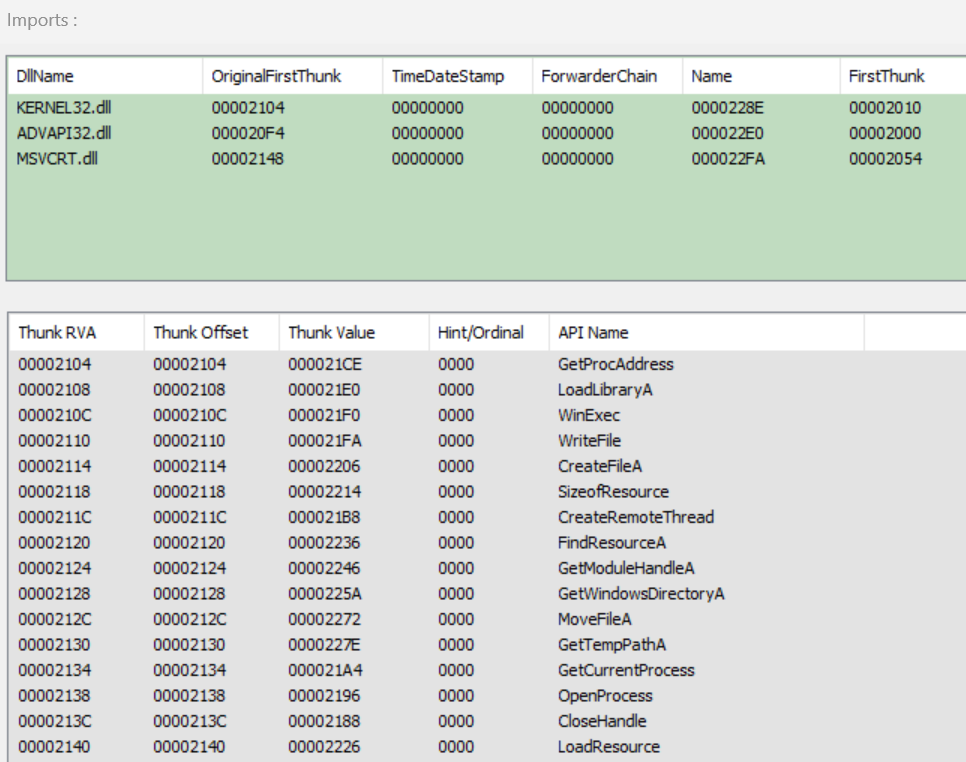

从 `advapi32.dll` 导入的函数可以看出，程序做了一些与权限有关的事情，试图访问使用了特殊权限进行保护的文件。从 `kernel32.dll` 的导入函数可以看出这个程序从资源节中装载数据 (`LoadResourceA`、`FindResourceA` 和 `SizeofResource`），并写一个文件到磁盘上(`CreateFileA` 和 `WriteFile`），接着执行一个磁盘上的文件(`WinExec`）。而且它调用了 `GetwindowsDirectoryA` 函数，将文件写入到了系统目录。

推测 **该恶意代码连接远程主机进行下载，并且复制拷贝了下载下来的文件，而这些文件极有可能是恶意代码**。


>Q5.有哪些基于主机或基于网络的迹象，可以被用来确定被这个恶意代码所感染的机器？

查看字符串，发现 `\system32\wupdmgrd.exe`、`http://www.practicalmalwareanalysis.com/updater.exe` 网址，如下图所示：

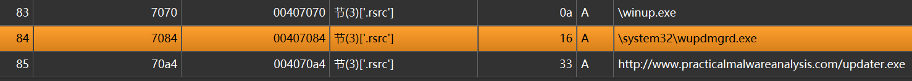

`http://www.practicalmalwareanalysis.com/updater.exe` 可能是保存下载恶意代码的网络位置。`\system32\wupdmgrd.exe` 是 Windows 升级管理器，结合 `GetwindowsDirectory` 函数调用，这表明恶意代码在 `C:\Windows\System32\wupdmgr.exe` 位置创建或者修改了一个文件。`URLDownloadToFile` 则间接印证了下载器的功能。

>Q6.这个文件在资源段中包含一个资源。使用 `Resource Hacker` 工具来检查资源，然后抽取资源。从资源中你能发现什么吗？

可以看到资源段中 **还有一个可执行文件**（101:1033），观察到字符串！This program cannot be run in DOS mode，这个字符串是在所有 PE 文件处的 DOS 头部中都会包含错误消息，因此推断这一资源其实是在 Lab01-04.exe 资源节中存储的另一个可执行文件。

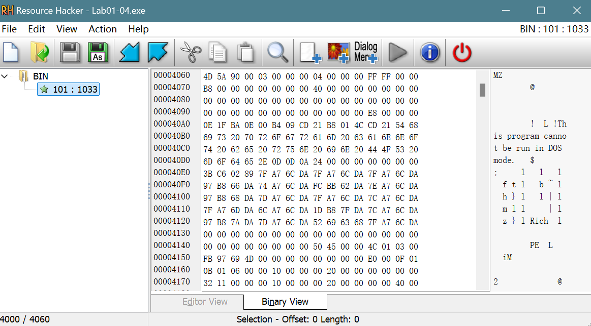

右键 101：1033，选择 Save Resource to a BIN filee 保存，查看导入表，可以看到嵌入文件在 **访问一些网络函数**。

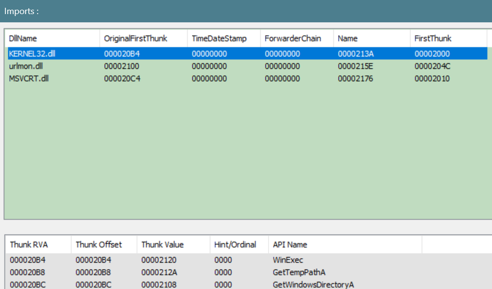

调用 `GetWindowsDiretoryA`、`URLDownloadToFileA`，以通过 URL 下载恶意文件；调用 `WinExec` 函数，执行下载到的文件。

### （二）yara 编写与分析

通过上文对实验分析样本的分析，我们可以发现，上述文件均适配 `filesize<10MB and uint16(0)==0x5A4D and` 

`uint16(uint16(0x3C))==0x00004550` 的匹配规则，故将其作为“全局规则”。

```yara
private rule isMZ_PE {
    meta:
        description = "It is a PE file"
    condition:
        filesize <10MB and uint16(0) == 0x5A4D and uint32(uint32(0x3C)) == 0x00004550
        // 文件大小小于10MB，文件头的前两个字节为MZ，PE头的偏移地址处的四个字节为PE标志
}
```

#### 1. Lab01-01

- Lab01-01.exe

    通过上述分析将 `Lab01-01.dll、kerne132.dll、FindNextFile和C:\\windows\\system32\\kerne132.dll` 作为匹配规则。

```yara
rule Lab01_01_exe {
    meta:
        description = "It may like Lab01-01.exe"
    strings:
        $string1 = "Lab01-01.dll"
        $string2 = "kerne132.dll"
        $string3 = "C:\\windows\\system32\\kerne132.dll"
    condition:
        isMZ_PE and all of them
}
```

- Lab01-01.dll

    通过上述分析将 `127.26.152.13、exec、sleep、hello和WS2_32.dll` 作为匹配规则。

```yara
rule Lab01_01_dll {
    meta:
        description = "It may like Lab01-01.dll"
    strings: 
        $string1 = "127.26.152.13"
        $string2 = "exec" 
        $string3 = "sleep"
        $string4 = "hello"
        $string5 = "WS2_32.dll"
    condition:
        isMZ_PE and all of them
}
```

#### 2. Lab01-02

- Lab01-02.exe

    由于是对脱壳前的文件进行检查，直接使用 `DIE` 查看脱壳前程序的字符串，将 `HGL345、MalService和InternetOpen` 作为匹配规则。而对于可疑网址，直接使用 `十六进制机器码`。

```yara
rule Lab01_02_exe {
    meta:
        description = "It may like Lab01-02.exe"
    strings:
        $string1 = "HGL345"
        $string2 = "MalService" 
        $string3 = {68 74 74 70 3A 2F 2F 77 FF B7 BF DD 00 2E 6D 1E 77 61 72 65 61 6E 07 79 73 69 73 62 6F 6F 6B 2E 63 6F FF DB DB 6F 6D}
        $string4 = "InternetOpen"
    condition:
        isMZ_PE and all of them
}
```

#### 3. Lab01-03

- Lab01-03.exe

    由于是对脱壳前的文件进行检查，直接使用 `DIE` 查看脱壳前程序的字符串，将 `ole32.vd、}OLEAUTLA和_getmas` 作为匹配规则。

```yara
rule Lab01_03_exe {
    meta:
        description = "It may like Lab01-03.exe"
    strings:
        $string1 = "ole32.vd"
        $string2 = "}OLEAUTLA" 
        $string3 = "_getmas"
    condition:
        isMZ_PE and all of them
}
```

#### 4. Lab01-04

- Lab01-04.exe

    通过上述分析，将 `\\winup.exe、\\system32\\wupdmgr.exe和http://www.practicalmalwareanalysis.com/updater.exe` 作为检测规则。

```yara
rule Lab01_04_exe {
    meta:
        description = "It may like Lab01-04.exe"
    strings:
        $string1 = "\\winup.exe"
        $string2 = "\\system32\\wupdmgr.exe"
        $string3 = "http://www.practicalmalwareanalysis.com/updater.exe"
    condition:
        isMZ_PE and all of them
}
```

#### 5. 运行

把上述 Yara 规则保存为 `lab1.yar`, 然后执行检查，可以看到，五个文件均被检出。**Yara 规则编写成功！**

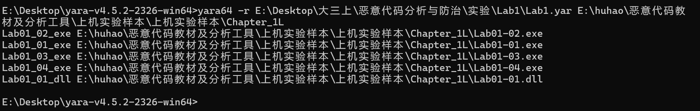

#### 6. 测试执行效率

接下来测试规则的执行效率，我选择编写一个 python 脚本、执行扫描和时间统计，代码如下：

```python
import os
import time

# 获取程序开始时间
start_time = time.time()

os.system(r"E:\Desktop\yara-v4.5.2-2326-win64\yara64.exe -r E:\Desktop\大三上\恶意代码分析与防治\实验\Lab1\Lab1.yar E:\huhao")

# 获取程序结束时间
end_time = time.time()

# 计算并输出程序运行时间
elapsed_time = end_time - start_time
print(f"程序运行时间: {elapsed_time} 秒")
```

运行结果如下，我这个 **文件夹大小为 1.00GB、有 1162 个文件，运行时间 1.07s**。

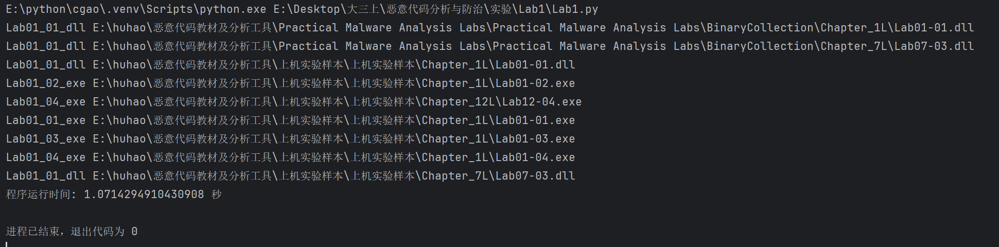

通常来说，高效的 YARA 规则条件，只包含简单的字符串匹配条件、简单的正则表达式条件等，而效率较低的 yara 规则通常包括复杂的逻辑条件、大型字符串、深度递归以及复杂的正则表达式等。在本次实验中，通过以下三个方法优化了性能，因而效率较高。

> - 定义全局规则，缩小检查范围。
> - 选择筛选条件时，尽可能是有代表性的，从而减少条件的数量。
> - 条件尽可能简单，而且不使用 nocase 这种大小写不区分的修饰符降低效率。

#### 7. 探讨如何优化 Yara

结合理论课所讲知识和实验中亲自对比，我总结出了以下规律：

1. 当检查特征字符串时如果使用全局搜索效率会很低，而指定地址或地址范围时 Yara 条件执行效率会变高；
2. 使用通配符或正则表达式比简单的字符串匹配性能低；
3. 对于 16 进制字符串匹配，??的效率比 [...] 效率更高 ⼀ 点；
4. 遇到大文件，可以分批处理。

### （三）在 VirusTotal 和 Microsoft Defender AntiVirus 上的的分析结果

由于前面在 `VirusTotal` 的分析结果已给出，这里只给出 `Microsoft Defender AntiVirus` 上的分析结果。

打开 Microsoft Defender 反病毒，执行自定义扫描，结果如下，发现了 5 个威胁，每个样本对应一个：

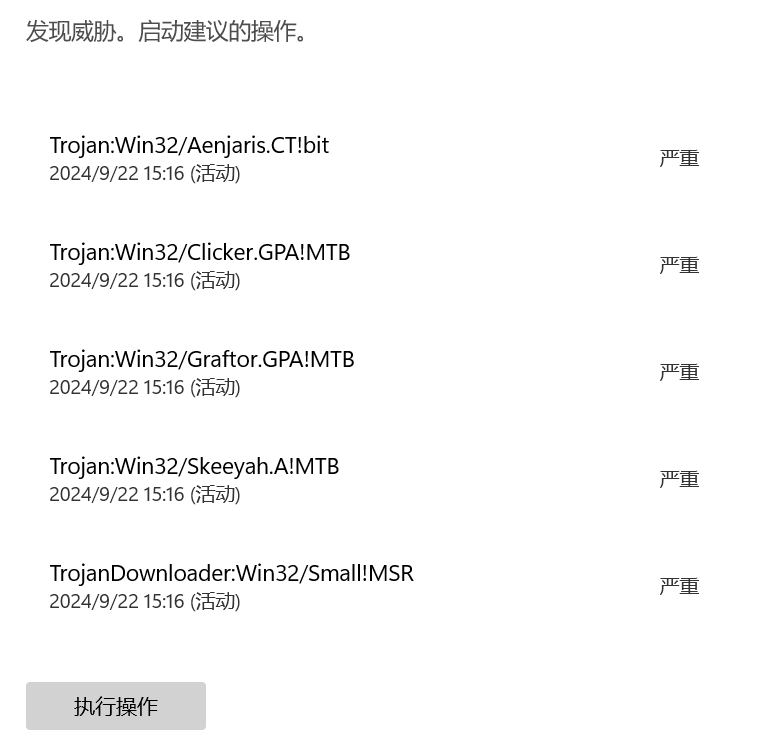

查看详细信息，其他三个都是报 **特洛伊木马**、描述为 **这个程序很危险，而且执行来自攻击者的命令**。而 Lab01-02.exe 还显示了 **upx 加壳信息**；Lab01-04.exe 则表明会 **下载其他程序**。

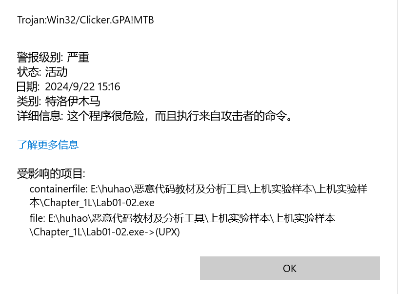

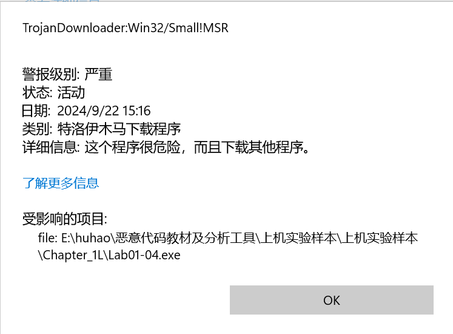

## 四、实验结论及心得体会

---

这次实验是我在恶意代码与防治分析方面的初次实践，由于本身是 `CTF逆向手`，结合竞赛中的经验以及课堂理论和实验操作，使我对恶意代码的分析有了更深入的理解。

1.通过实验，我对如何判断文件是否被加壳有了更全面的认识。不再仅仅依赖 `DIE` 等工具的提示，而是学会了通过对比 PE 文件中各节（如.text 节）的虚拟大小和原始数据大小来判断是否存在加壳。

2.在分析恶意代码时，我学会了通过导入表中的特定函数来推断恶意代码的功能。例如，某些导入的函数往往与恶意行为（如文件操作、网络连接等）密切相关。并且也对 [`VirusTotal`](https://www.VirusTotal.com/) 和 `Miscrosoft Defender antivirus` 等平台的强大功能有了直观的体会。

3.初步学会了编写 `yara` 规则，并使用 yara 进行病毒文件的检索。同时也如何优化执行效率进行了探讨。
