<div align='center'>
<b> <font face='微软雅黑' size='6'> 恶意代码分析与防治技术课程实验报告 </font> </b>
</div>


<div align='center'>
<b> <font font face='微软雅黑' size='6'> 实验十三 </font> </b>
</div>


<div>
<font face='宋体' size='6'>&nbsp;&nbsp;&nbsp;&nbsp; 学 院：网络空间安全学院 </font> <br>
<font face='宋体' size='6'>&nbsp;&nbsp;&nbsp;&nbsp; 专 业：信息安全 </font> <br>
<font face='宋体' size='6'>&nbsp;&nbsp;&nbsp;&nbsp; 学 号：2212998 </font> <br>
<font face='宋体' size='6'>&nbsp;&nbsp;&nbsp;&nbsp; 姓 名：胡博浩 </font> <br>
<font face='宋体' size='6'>&nbsp;&nbsp;&nbsp;&nbsp; 班 级：信息安全 </font> <br>
</div>


## 一、实验目的

---

1. 完成教材上 lab13 的实验内容。
2. 在样本分析结果的基础上，编写样本的 Yara 检测规则。
3. 尝试编写 IDA Python 脚本来辅助样本分析。

## 二、实验原理

---

在信息安全的领域中，加密算法扮演着至关重要的角色，它广泛应用于数据保护、通信安全以及身份验证等多个方面。在对抗恶意代码的过程中，开发者常常借助加密技术来隐蔽攻击代码或数据，从而规避传统安全检测。

### 常见加密算法

加密算法大体可以分为三类：对称加密算法、非对称加密算法和哈希函数。它们各自具有不同的工作原理和适用场景，在恶意代码分析中的作用也各有千秋。

#### 对称加密算法

对称加密算法的特点是加密和解密过程共用同一密钥。这种算法的优势在于处理速度快，适合处理大量数据。然而，密钥的安全性是其最大的挑战。以下是一些常见的对称加密算法：

- **AES**：作为目前最广泛应用的对称加密算法，AES 支持 128 位、192 位和 256 位密钥长度。它以高安全性和高效率著称，被众多安全通信协议所采用。
- **DES**：DES 是一种较早广泛使用的对称加密算法，采用 56 位密钥长度。由于其密钥长度较短，易受暴力破解攻击，现已逐渐被 AES 取代，不再被视为安全选择。

在恶意软件中，攻击者可能会利用对称加密算法来加密攻击载荷、配置文件或其他敏感信息。由于其高效的加密能力，分析人员需要借助密钥提取或破解技术来解密这些数据。

#### 非对称加密算法

非对称加密算法使用一对密钥进行加密和解密，其中公钥负责加密，私钥负责解密。这种算法的优势在于能够在无需共享密钥的情况下实现安全的数据交换。

RSA 是最著名的非对称加密算法，其安全性基于大数质因数分解的难题。公钥和私钥通过大质数的乘积生成，解密过程需要使用私钥。

非对称加密算法常用于保护通信过程中的数据，如 SSL/TLS 协议中的数字证书、电子邮件加密等。在恶意软件分析中，攻击者可能会使用非对称加密来保护其通信数据或控制命令，确保只有授权用户才能解密并获取信息。

#### 哈希函数

哈希函数并非传统意义上的加密算法，它将数据转换为固定长度的“摘要”，用于验证数据完整性。哈希函数在恶意软件分析中主要用于文件完整性检查、数字签名和数据校验。以下是一些常见的哈希算法：

- **MD5**：MD5 是一种广泛应用的哈希算法，能将任意长度的数据映射为 128 位的哈希值。尽管 MD5 存在碰撞漏洞，但在某些场合仍被使用。
- **SHA**：SHA 系列算法由美国国家安全局设计，包括 SHA-1、SHA-256、SHA-512 等版本，适用于不同的安全需求。SHA 系列算法比 MD5 更为安全，尤其在防止碰撞攻击的场景中得到了广泛应用。

在恶意软件分析中，哈希值用于验证文件完整性，判断文件是否被篡改，或帮助分析人员识别已知的恶意文件。

### 自定义加密算法

为了规避常规安全检测工具，恶意软件开发者常采用自定义加密算法来隐藏恶意代码或数据。这些算法通常不是公开标准，而是开发者根据需求定制的加密方案。自定义加密往往基于已知算法（如 AES、DES 等），但通过修改算法部分或增加复杂度，使其难以被传统工具识别。自定义加密算法的常见特点包括：

- **多重加密策略**：恶意软件可能结合使用对称和非对称加密算法，或采用多种算法组合，增加破解难度。
- **动态密钥生成**：恶意软件可能通过动态生成密钥来对抗静态分析，例如基于系统环境、用户输入或其他变化数据生成密钥。
- **混淆与变形**：通过对原有加密算法进行变形或添加混淆层，提高分析难度。混淆手段可能包括加密模式变化、异或操作等。

破解这些自定义加密算法，通常需要进行深入的逆向工程，分析加密算法的实现代码，揭示其结构和模式。

### 解密方法

在恶意代码分析中，解密是恢复加密数据的关键步骤。解密方法主要分为密钥获取和密码破解两大类。

#### 密钥获取

若分析人员能够获取加密算法使用的密钥，即可直接解密。密钥获取方式包括：

- **逆向工程**：分析恶意软件的二进制文件，寻找密钥或密钥生成算法。
- **内存分析**：利用调试工具或内存转储提取内存中的密钥。某些恶意软件会在运行时内存中存储密钥。
- **配置文件或静态资源**：有时恶意软件会在配置文件或资源中明文存储密钥，分析人员可直接提取。

#### 密码破解

如果密钥无法获得，分析人员可以尝试使用密码破解技术来解密数据。常见的密码破解方法包括：

- **暴力破解**：通过尝试所有可能的密钥组合来解密数据。暴力破解对于密钥长度较短的加密算法有效，但对于较长的密钥，这种方法计算量极大，难以实现。
- **字典攻击**：利用常见密码或常用字符串的字典来进行破解，这种方法比暴力破解更有效，尤其是在密码弱或基于简单算法时。
- **密码分析**：分析加密算法本身的结构和弱点，利用已知的加密漏洞进行解密。例如，针对 RSA 的攻击可能利用数学上的质因数分解问题来破解密钥。

## 三、实验过程

---

### （一）完成 Lab13 的题目

#### 1. Lab13-1

**分析恶意代码文件 Lab13-01.exe**。

##### （1）初步静态分析

首先利用 `DIE` 工具检查样本的加壳状态：

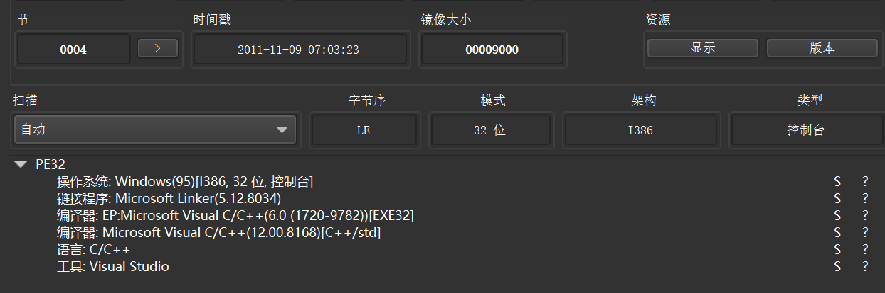

分析结果显示样本未加壳，且开发环境为 Visual Studio。

随后，我检查了样本的导入表，发现了一些关键的函数：

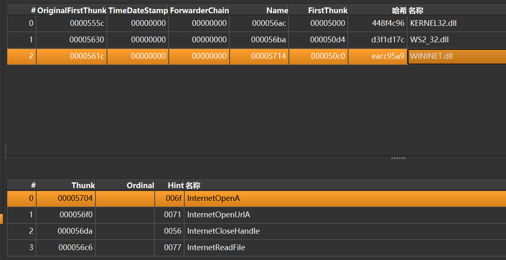

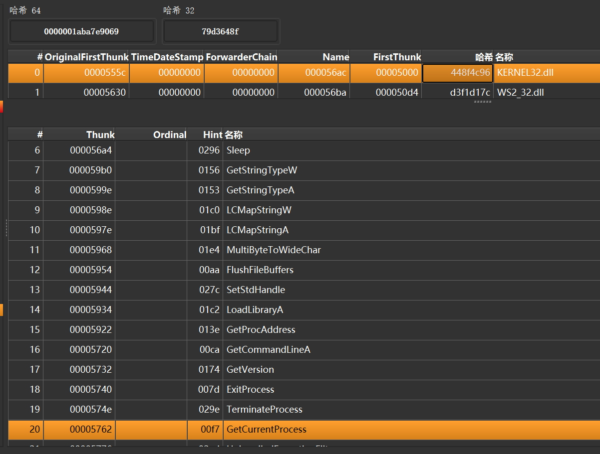

特别地，我们注意到了 `WININET.dll` 中的函数，这些函数与网络操作密切相关，例如 `InternetOpenUrlA` 用于打开远程 URL 资源，`InternetReadFile` 用于从网络读取文件等。

此外，我们还发现了 `Sleep` 和 `GetCurrentProcess` 函数，这可能与程序的休眠行为和获取当前进程信息有关。

基于这些发现，我们初步推测该样本可能具有网络资源请求的功能。

进一步地，我们检查了样本的资源节，发现了一些异常的 ASCII 字符串：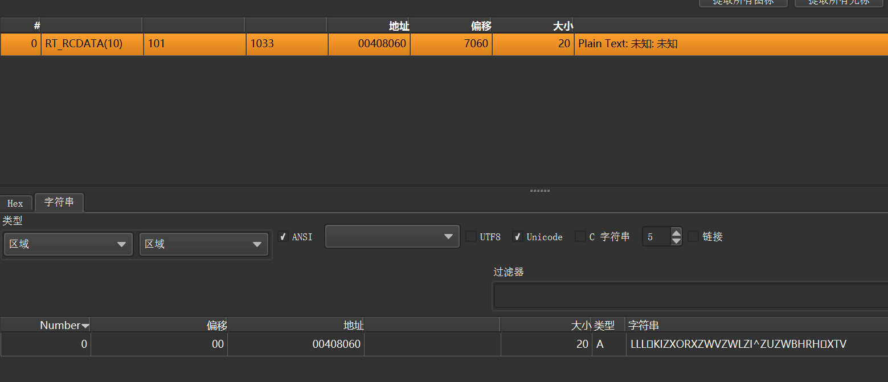

这些字符串与我们之前的猜测相符，可能与密钥信息有关。

因此，我们先把资源节提取出来，先使用 ResourceHacker 打开：

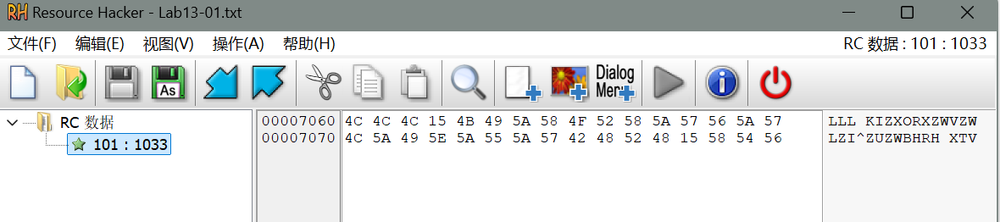

然后右键保存 binzyuan，默认命名为 RC 数据 101。

最后，我们查看了样本中的字符串信息：

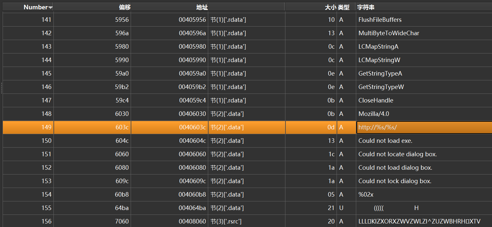

其中最明显的是 `Mozilla/4.0`，这是火狐浏览器的用户代理字符串，进一步支持了样本具有网络恶意行为的假设。同时，我们还发现了形如 `http://%s/%s/` 的模式，这可能是用于访问特定网站的占位符。由于没有发现具体的网址，我们推测这些信息可能被加密了。

此外，我们还发现了可能用于 Base64 编码的字符串：

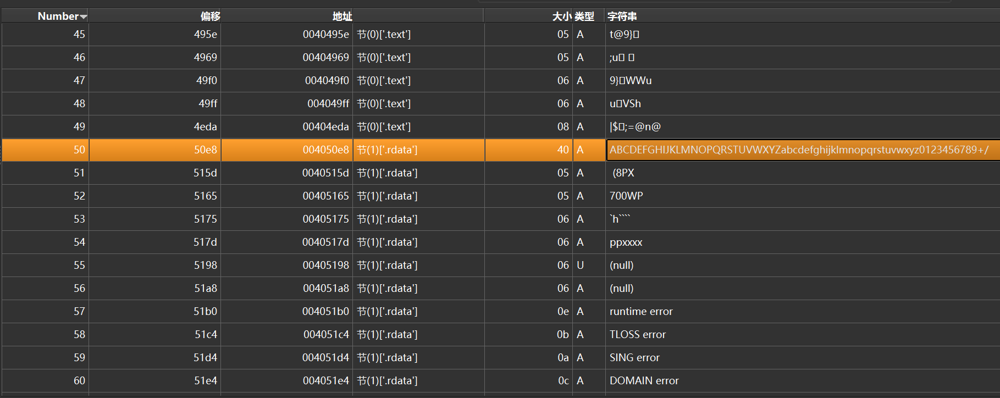

这些字符串包含了 Base64 编码中使用的字符集，这表明样本中可能存在数据加密或解密的操作，这与我们之前的推测相吻合。

##### （2）综合行为分析

鉴于我们已经确定样本具有网络功能，我们决定使用 Wireshark 工具来捕获网络流量，以便进一步分析其行为。

我们首先启动了 Wireshark，并准备好捕获网络数据包：
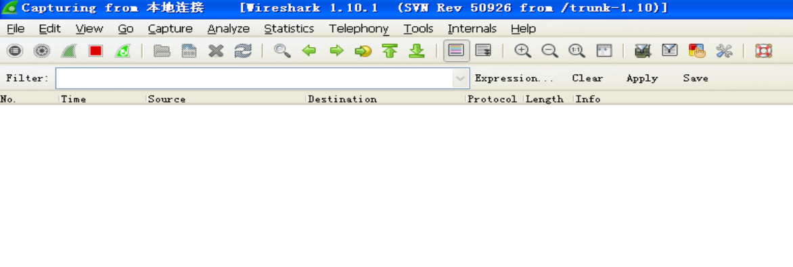

然后保存快照，最后双击运行病毒，结果如下：

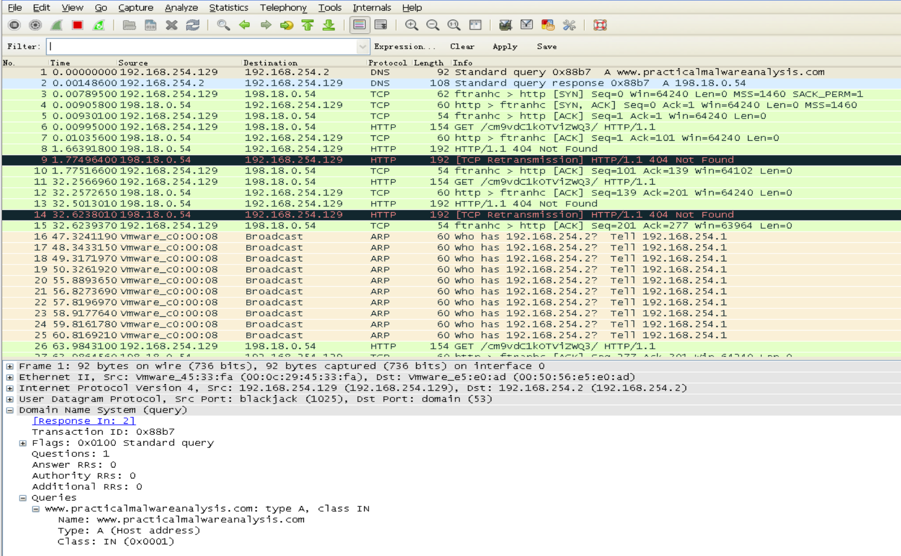

通过分析捕获的数据，我们观察到了以下关键行为：

1. **HTTP GET 请求：**

	样本发起了一个 HTTP GET 请求，请求资源标识符为 `aG9zdG5hbWUtZm9v`，其具体含义尚不明确。

2. **访问特定网址：**

	样本访问了一个彩蛋网址，域名为 `www.practicalmalwareanalysis.com`。

由于该 URL 并未在字符串分析中出现，结合我们之前发现的可能用于 Base64 编码的字符集，我们有理由推测样本在网络通信中使用了加密技术。

##### （3）深入分析

通过使用 IDA 进行分析，我们深入查看了程序的 `main` 函数反编译代码：

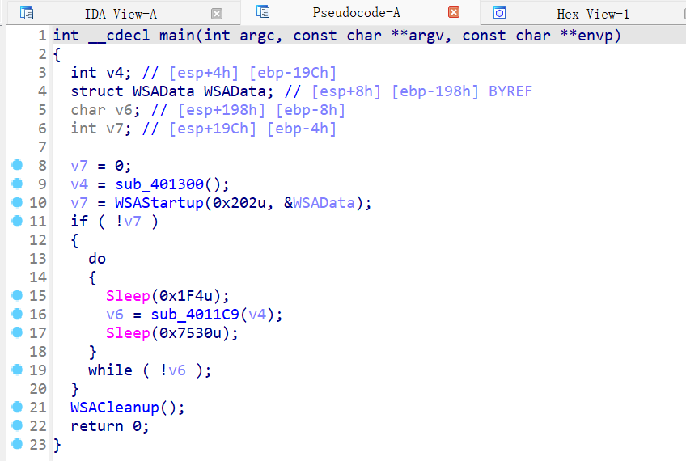

`main` 函数作为程序的入口点，执行以下操作：

**初始化和网络启动：**

- 函数定义了几个局部变量：`v4`, `WSAData`, `v6`, 和 `v7`。
- `v4` 被赋值为 `sub_401300()` 函数的返回值，这个函数的具体作用不在代码段中显示，但可能与网络活动或某种初始化设置有关。
- `v7` 被用来存储 `WSAStartup` 函数的返回值，用于初始化 Winsock 库，版本号为 0x202（即 2.2 版本）。

**循环网络活动检测：**

- 代码进入一个循环，只要 `WSAStartup` 成功（`v7` 为 0），循环就会继续。
- 在循环中，首先调用 `Sleep(0x1F4u)`，使程序等待 500 毫秒，可能是为了潜伏起来，或者是考虑网络延迟等的影响。
- 然后 `v6` 被赋值为 `sub_4011C9(v4)` 函数的返回值，这个函数的具体行为也未知，但它接收 `v4` 作为参数，并且也很可能与网络通信或某种状态检测有关。
- 接着再次调用 `Sleep(0x7530u)`，使程序等待 30000 毫秒（或 30 秒）。
- 循环继续，直到 `v6` 为非零值，这可能表示某种条件被满足或检测到了某种事件。

**清理并结束：**

- 循环结束后，调用 `WSACleanup` 函数，这是网络编程中常见的清理函数，用于终止 Winsock 库的使用。

因此，`main` 函数进行网络环境配置，然后调用 `sub_401300` 和 `sub_4011C9` 两个函数。

所以我们先查看 `sub_401300` 函数：

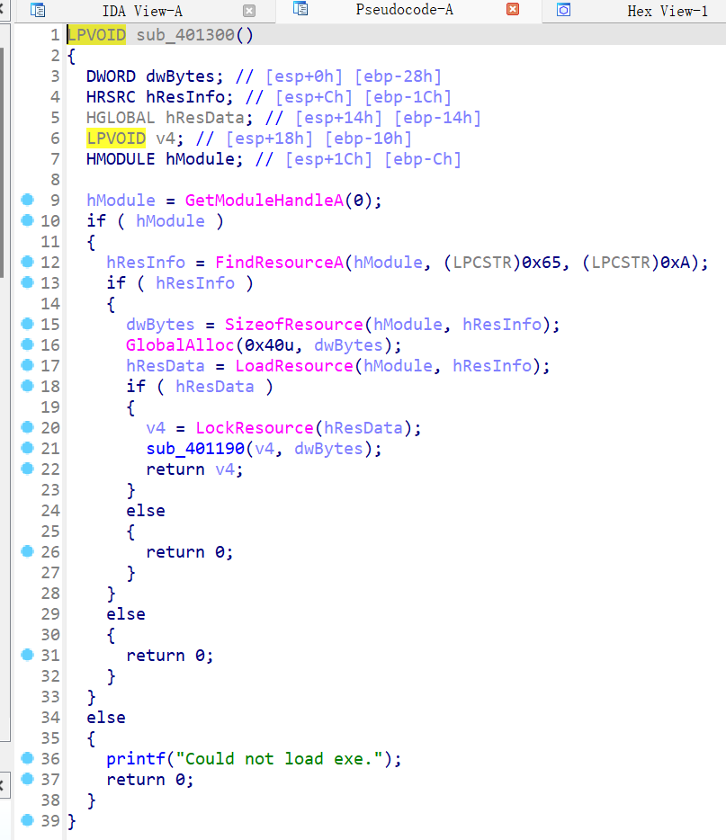

`sub_401300` 函数负责资源的获取和解密：

**获取模块句柄：**

使用 `GetModuleHandleA(0)` 获取当前进程的模块句柄（`hModule`）。当参数为 0 时，此函数返回调用进程的模块句柄。

**资源查找与加载：**

- 如果成功获取模块句柄（`hModule` 不为 NULL），则继续执行。
- 使用 `FindResourceA` 函数查找模块中的资源。这里使用的资源标识符是 0x65 和 0xA，分别代表资源名称和类型。如果找到资源，`hResInfo` 会包含资源的句柄。这里它要寻找的资源节就应该是我们之前定位到的 `RCData101.res`。
- 当找到资源后，使用 `SizeofResource` 获取资源的大小（`dwBytes`）。接着使用 `GlobalAlloc(0x40u, dwBytes)` 分配内存。
- 使用 `LoadResource` 加载找到的资源到内存中，得到资源数据的句柄（`hResData`）。
- 如果资源数据成功加载（`hResData` 不为 NULL），则使用 `LockResource` 锁定资源，获取指向资源数据的指针（`v1`）。

**资源处理：**

- 调用 `sub_401190(v1, dwBytes)`，传递资源数据的指针和大小。由于我们之前推测过资源节可能是一个解密的关键，因此它可能是用来处理资源数据。

**错误处理与返回：**

- 如果任何步骤失败（如未能获取模块句柄、未找到资源、未能加载资源），函数将打印错误消息（如果模块句柄获取失败）并返回 NULL。
- 成功处理资源后，函数返回指向资源数据的指针。

很明显它是在进行程序自身的模块中查找、加载并处理资源。然后交给更为重要的 `sub_401190`。

因此我们查看 `sub_401190` 函数的内容：

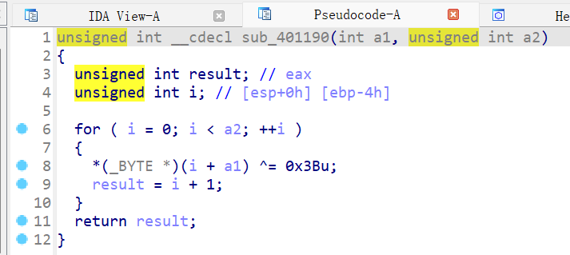

`sub_401190` 函数执行对数据的简单 XOR 解密：

函数接收两个参数：`a1`（一个整数，就是传递的资源数据，代表后面要对这个资源数据进行操作了）和 `a2`（一个无符号整数，表示要处理的数据长度）。

函数内部定义了一个循环，从 0 开始，直到小于 `a2`（即处理的数据长度）。

数据操作：

- 在循环内，函数执行了一个异或（XOR）操作。具体来说，它取地址 `a1` 开始的每个字节（`*(_BYTE *)(i + a1)`），并将其与 0x3B（十进制数 59）进行异或操作。
- 这个操作实际上是对从地址 `a1`（即资源节开始）的 `a2` 长度的数据进行简单的加密或解密。异或操作是一种常见的简单加密方法，如果再次应用相同的操作，可以恢复原始数据。

返回结果：

- 在循环的每一步，`result` 被设置为当前索引加 1（`i + 1`）。因此，当循环结束时，`result` 将等于 `a2`。
- 函数最终返回 `result`，即处理的数据长度。

因此我们知道这个病毒利用 `sub_401190` 将资源节的每个字节与固定值 0x3B 进行异或，从而改变原始数据的值。这样异或的操作在恶意软件中也常见，用于隐藏其有效载荷或配置信息。

于是我们将之前提取到的资源节文件加载到 010 Editor 中：

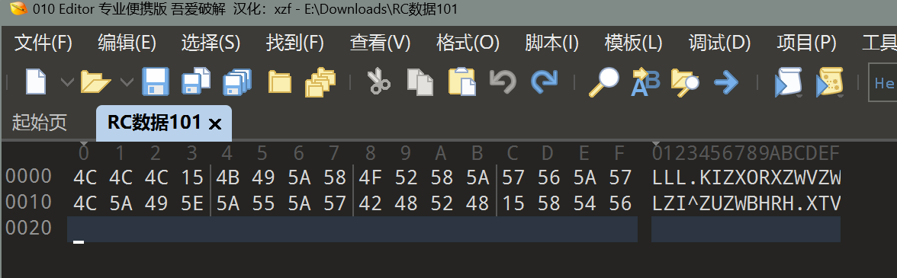

使用其自带的二进制异或功能，并选择操作数为 3B、十六进制：
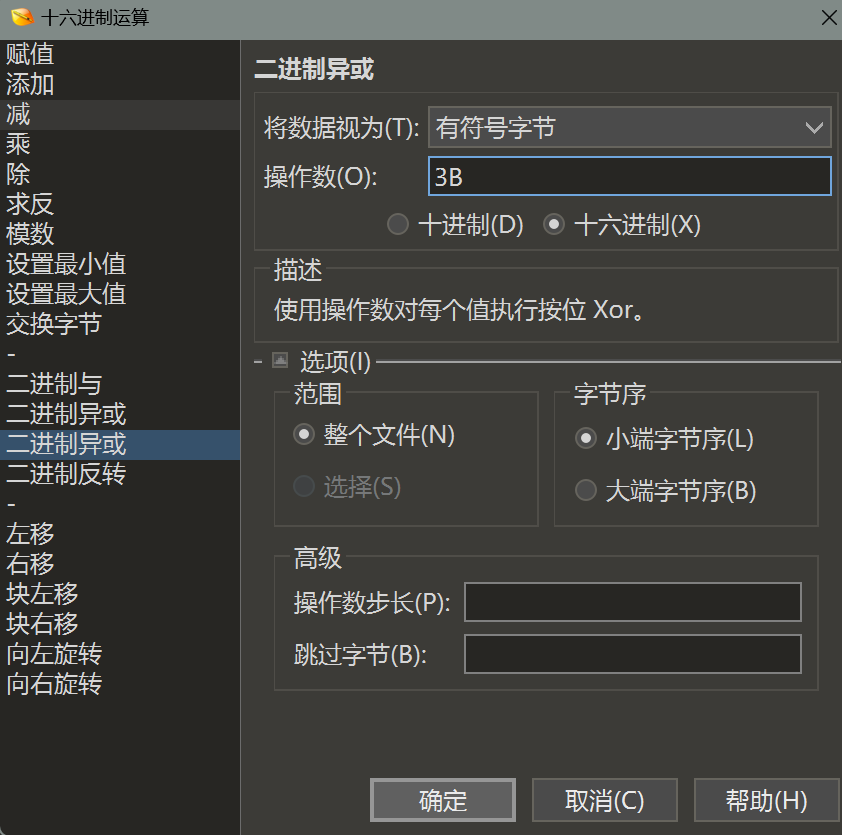

解密后结果如下：
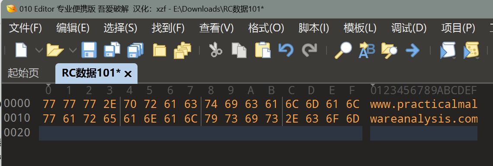

看到之前中文乱码对应的 ASCII 码结果就是 `www.practicalmalwareanalysis.com`，符合行为分析中的推测！

然后我们回忆起来了 `main` 函数还调用了 `sub_4011C9`，它对 `sub_401190` 解密后的结果即 `www.practicalmalwareanalysis.com` 进行了操作。观察其反汇编：

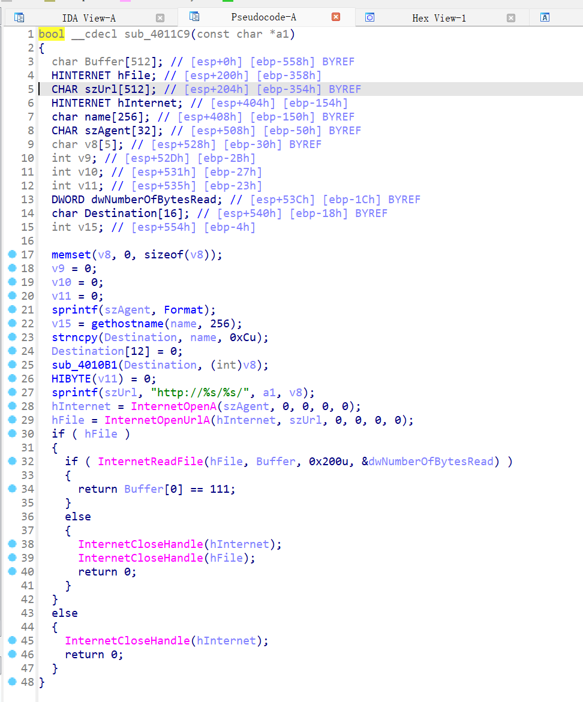

看到一些重要的信息：

- **网络代理设置和主机名获取**：
	- 使用 `sprintf` 设置用户代理字符串 `szAgent`（"Mozilla/4.0"，和我们动态分析 Netcat 的结果相同，设置用户代理。）通常这是为了伪装流量，伪装为自合法的浏览器。
	- 使用 `gethostname` 获取本机的主机名，并存储在 `name` 中。标识和跟踪受感染的机器。
	- `strncpy` 将主机名的前 12 个字符复制到 `v13`，并在其后设置一个空字符作为结束标志。

- **URL 构造和网络连接**
	- 调用 `sub_4010B1` 函数，对 `v13` 和 `v8` 进行处理。我们稍后查看 `sub_4010B1`。
	- 使用 `sprintf` 构造一个 URL，该 URL 似乎包含了函数参数 `a1` 和一些通过 `v8` 获取的数据。其中 `a1` 就是 `www.practicalmalwareanalysis.com`。而 HTTP 字符就是静态分析发现的占位符 `http://%s/%s/`。
- **读取网络数据：**
	- 如果 `InternetOpenUrlA` 成功，它将尝试使用 `InternetReadFile` 读取数据到 `Buffer` 中。
	- `InternetReadFile` 的结果存储在 `v15` 中，同时读取的字节数存储在 `dwNumberOfBytesRead` 中。
- **检查条件并返回结果：**
	- 如果 `InternetReadFile` 成功（`v15` 为真），函数检查 `Buffer` 的第一个字符是否等于 111（ASCII 码 0）。如果是返回 true；否则，关闭网络句柄并返回 false。
	- 如果 `InternetOpenUrlA` 失败，也会关闭网络句柄并返回 false。

`sub_4011C9` 函数是用于从网络上读取数据，并检查读取到的数据是否符合某个特定条件（即 Buffer 的第一个字符是否为'o'）。这个函数可能是网络通信或数据检索的一部分，用于确定是否已经接收到了特定的数据或命令。并且可以知道 `sub_4010B1` 应该是其处理数据段核心部分，过去看看：

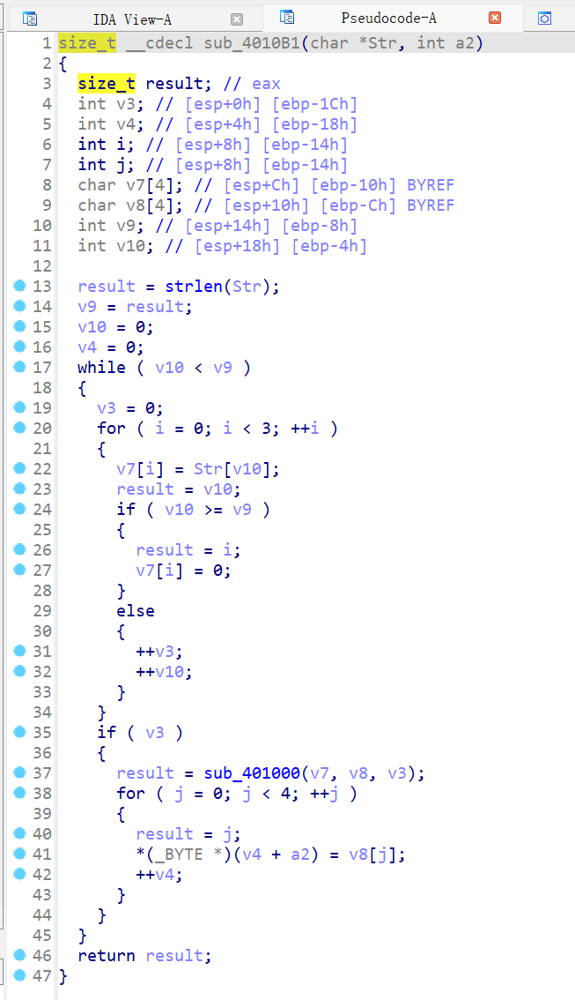

能看到函数的处理逻辑，实际上比较复杂，但还是能够明显看出它是一个 Base64 的编码逻辑，将输入的字符串目标转换为 Base64 格式。具体而言它包括以下部分：

- **初始化和字符串长度获取**
- **循环处理字符串**
- **分组处理数据：** 对输入字符串进行某种分组处理，每次处理最多 3 个字符。和 Base64 编码中的一个 4 字符编码单元相对应。如果输入字符串不够 3 个 character，一般会使用'='来填充，构造编码单元。
- **调用另一个函数并更新结果：** 进一步调用使 `sub_401000` 函数将每个 3 字符组转换为 4 个 Base64 编码字符。

因此它辅助使用了 `sub_401000`，过去看看：

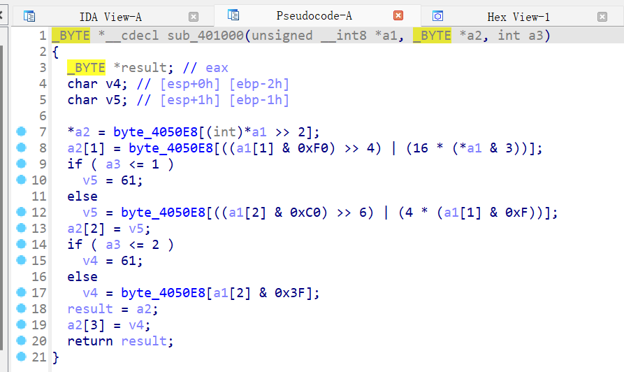

看到了其反汇编，就是在辅助进行 Base64 编码。解析其具体内容为：

- **Base64 编码的实现：** Base64 编码通过读取原始数据的每 3 个字节，然后将它们转换为 4 个 Base64 字符来工作。这种转换使用了一个特定的 64 字符的字母表。
- 处理输入数据：
	- 函数接收三个参数：`a1`（输入数据的指针），`a2`（输出数据的指针），`a3`（输入数据的长度）。
	- 函数首先将 `a1` 指向的第一个字节右移 2 位，然后使用这个值作为索引从 `byte_4050E8` 数组中获取一个字符，存储到 `a2` 指向的位置。
	- 接着它处理第二个 Base64 字符。这涉及到获取 `a1` 第一个字节的低 2 位和第二个字节的高 4 位，合并这些位并使用结果作为索引来从 `byte_4050E8` 数组中获取第二个字符。
	- 三和四也都类似，使用等号（`=`），这是 Base64 编码用于填充的特殊字符。

因此我们可知此函数实现了 Base64 编码的核心逻辑，将输入的每 3 个字节转换为 4 个 Base64 字符。它处理边界情况，如输入数据不足 3 个字节时的填充（使用等号）。`byte_4050E8` 数组似乎是 Base64 编码所使用的 64 字符字母表。这个函数是 Base64 编码过程中的一个关键步骤，处理单个 3 字节到 4 字节的转换。

查看一下 `byte_4050E8`，它就是静态分析的 `ABCDEFGHIJKLMNOPQRSTUVWXYZabcdefghijklmnopqrstuvwxyz0123456789+/`：

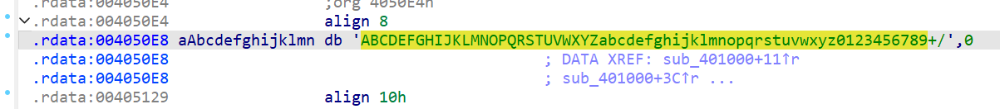

基于此，我们可以回到 `sub_4011C9` 分析的时候，发现更多之前没有意识到的线索。

`sub_4011C9` 函数似乎负责与远程服务器的通信，过程中使用了 Base64 编码来格式化或隐藏传输的数据。以下是该函数的执行步骤：

1. **代理和主机名设置：** 设置 HTTP 请求的用户代理，可能用于伪装流量，使其看起来像是来自合法的浏览器。获取并处理本地主机名，可能是为了标识和跟踪受感染的机器。
2. **Base64 编码：** 通过 `sub_4010B1` 函数，将处理后的主机名进行 Base64 编码。这可能用于确保主机名在 HTTP 请求中的传输不会因特殊字符或者是作为一种简单的混淆技术。
3. **构造 URL 并发起请求：** 构建包含编码后主机名的 URL，并尝试打开该 URL。此步骤可能是为了与 C&C 服务器通信，检查更新或发送心跳信号。
4. **网络请求和响应处理：** 读取从 URL 接收的数据，检查第一个字节是否为 111（ASCII 中的'o'）。这可能是对从 C&C 服务器接收的特定信号的检查。
5. **清理网络资源：** 关闭所有网络句柄，结束网络通信，这是标准的网络编程做法，用于避免资源泄露。

综合以上分析，`sub_4011C9` 函数的作用似乎是为了执行与远程服务器的加密通信，并根据服务器的响应来决定后续的行为。通过 Base64 编码，恶意软件可能在不引起注意的情况下传输数据。

因此我们可以得出结论，病毒通过将资源节中的 `RCData101` 进行异或解密得到域名，通过将主机名通过 Base64 编码（降低被怀疑的可能性），构造 URL 和远程主机进行加密通信。并由远程服务器的命令决定其是否退出结束生命。

##### （4）问题解答

> Q1. 比较恶意代码中的字符串 （字符串命令的输出）与动态分析提供的有用信息，基于这些比较，哪些元素可能被加密？

网络中出现两个恶意代码中不存在的字符串（当 `strings` 命令运行时，并没有字符串输出）。一个字符串是域名 `www.practicalmalwareanalysis.com`，另外一个是 GET 请求路径，它看起来像 `aG9zdG5hbWUtZm9v`。


> Q2. 使用 IDA PrO 搜索恶意代码中宇符串‘xor’，以此来查找潜在的加密，你发现了哪些加密类型？

之前忽视了这个步骤，在这里补上。

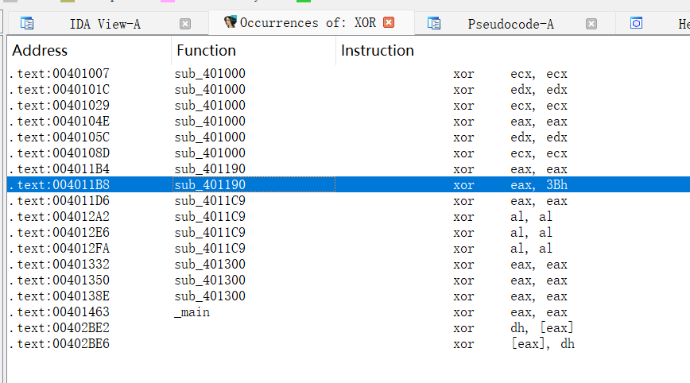

可以发现，地址 004011B8 处的 `xor` 指令是 `sub_401190` 函数中一个单字节 XOR 加密循环的指令。


> Q3. 恶意代码使用什么密钥加密，加密了什么内容？

单字节 XOR 加密使用字节 0x3B。用 101 索引原始的数据源解密的 XOR 加密缓冲区的内容是 `www.practicalmalwareanalysis.com`。

> Q4. 使用静态工具 `FindCrypt2`、`Krypto ANALyzer(KANAL）` 以及 `IDA` 熵插件识别一些其他类型的加密机制，你发现了什么？

用插件 PEiD KANAL 和 IDA 熵，可识别出恶意代码使用标准的 Base64 编码字符串：`ABCDEFGHIJKLMNOPQRSTUVWXYZabcdefghijklmnopqrstuvwxyz0123456789+/`。

> Q5. 什么类型的加密被恶意代码用来发送部分网络流量？

标准的 Base64 编码用来创建 GET 请求字符串。

> Q6. Base64 编码函数在反汇编的何处？

Base64 加密函数从 0x004010B1 处开始，在 `sub_4010B1`，这个函数对字符串进行处理，3 位一组，是 base64 编码的特征。

> Q7. 恶意代码发送的 Base64 加密数据的最大长度是什么？加密了什么内容？

Base64 加密前，`Lab13-01.exe` 复制最大 12 个字节的主机名，使得 GET 请求的字符串的最大字符个数是 16，加密的内容为请求的字符串。

> Q8. 恶意代码中，你是否在 Base64 加密数据中看到了填充字符（= 或者 ==）？

发现了！并且触发条件是如果主机名小于 12 个字节且不能被 3 整除，则可能使用填充字符。

> Q9. 这个恶意代码做了什么？

恶意代码用加密的主机名作为标识符，不过它将主机名通过 Base64 加密，然后发送一个特定的通信信号，当接收到一个特定的回应后则终止，从而让攻击者知道该主机在运行。

#### 2. Lab13-2

**分析恶意代码文件 Lab13-02.exe**。

##### （1）初步静态分析

同样首先利用 `DIE` 工具检查样本的加壳状态：

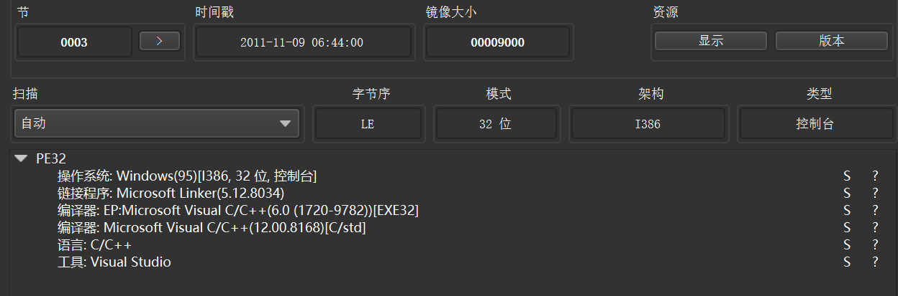

分析结果显示该样本未加壳，且开发环境为 Visual Studio。

随后，我们查看了样本的导入表，发现了一些关键的函数：

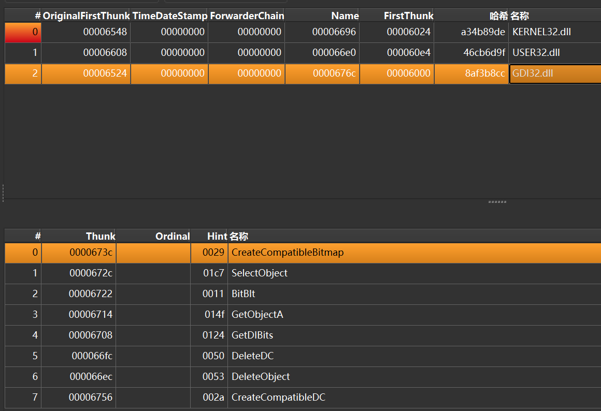


特别地，我们注意到了 `GDI32.dll` 中的函数，这些函数与图形设备接口（GDI）编程密切相关，如 `CreateCompatibleBitmap`、`DeleteDC` 和 `CreateCompatibleDC`，它们通常用于处理图形和绘图操作。

我们还发现了 `GetTickCount`，这很可能用于记录时间；`CreateFile` 表明样本具有创建文件的能力；`WriteFile` 则表明样本不仅创建文件，还可能向文件中写入数据；`GetTickCount` 的使用表明样本访问了系统时间。

最后，我们查看了样本中的字符串信息：

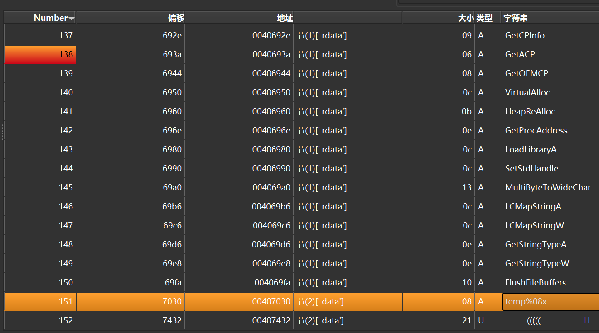

我们发现了一个可疑的字符串 `temp%08x`，它可能是某种临时文件的名称。此外，还观察到了与字节运算相关的字符串。

##### （2）综合行为分析

为了进一步分析样本的行为，我们使用 Procmon 设置了如下过滤器：

```assembly
Process Name is Lab13-02.exe
```

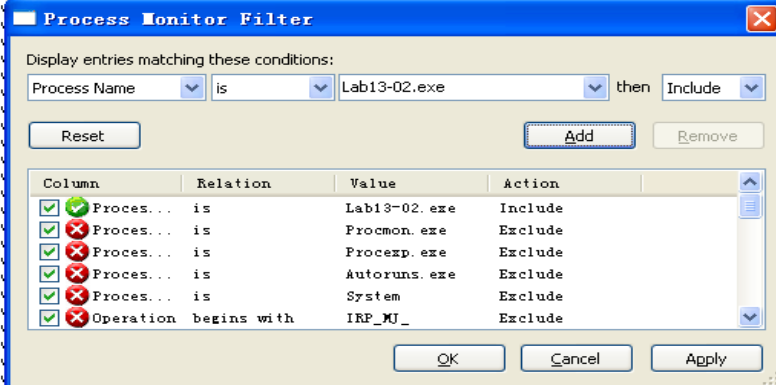

运行恶意代码后，我们观察到以下行为：


样本在原始目录下以固定的时间间隔创建了一些新的文件，这些文件大小相同（5743KB），并且文件似乎包含一些随机的数据。文件名以 `temp` 开头，并以一些随机的字符结束，均在 `temp` 后面跟着 8 个字母或数字。

我们还可以通过 Procmon 来查看更详细的信息：

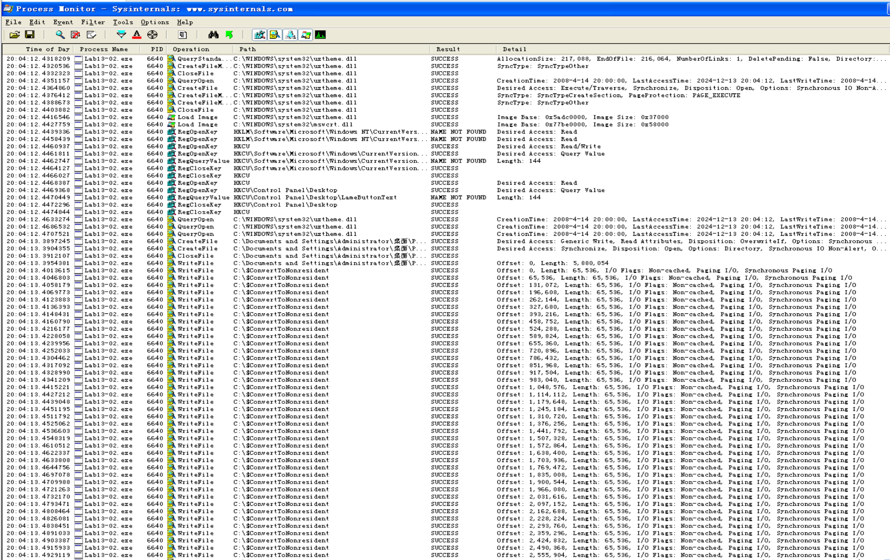

样本每隔一段时间执行 `CreateFile` 然后 `WriteFile`，在与 `LAB13-02.EXE` 同目录下创建以 `temp` 开头的文件。

##### （3）深入分析

我们首先利用 PEiD KANAL 插件、IDA 的 FindCrypt2 插件以及 IDA 熵插件进行线索搜寻：

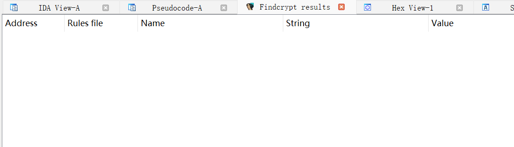

这些工具未能发现显著线索。然而，进一步搜索 `xor` 指令时，我们获得了意外发现：

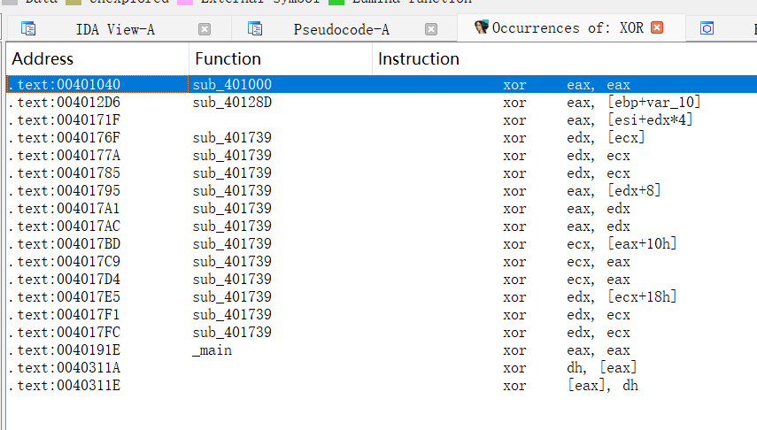

在 `sub_401739` 中发现大量 `xor` 指令，且这些指令并非用于清零寄存器，表明该函数可能涉及加密操作。

接下来从 `main` 函数的分析开始：

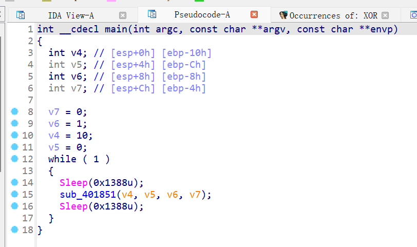

`main` 函数初始化了几个整型变量，随后进入一个无限循环，每次循环暂停 5 秒，调用 `sub_401851` 函数，再暂停 5 秒。这种行为显示程序具有定时执行的特性。

`main` 函数中调用了 `sub_401851` 函数，我们进一步分析它：

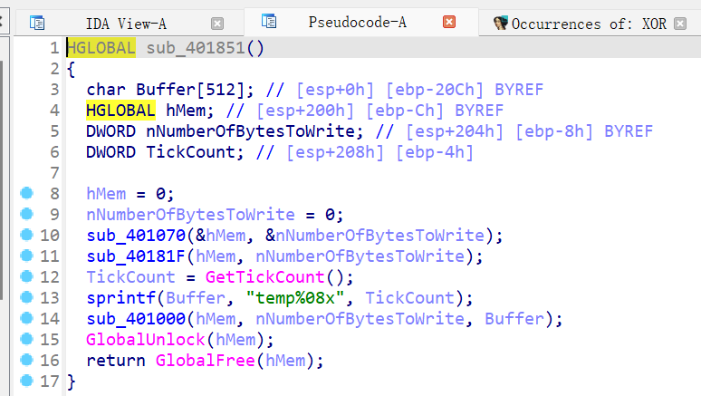

该函数执行以下操作：

1. **变量初始化：** 初始化用于存储内存句柄和字节数的变量。
2. **调用 `sub_401070`：** 生成某种数据，可能是屏幕截图，并存储于全局内存中。
3. **调用 `sub_40181F`：** 对生成的数据进行处理，可能是加密或混淆。
4. **获取系统时间戳：** 生成基于系统时间的字符串，用作文件名。
5. **调用 `sub_401000`：** 将全局内存中的数据写入以时间戳命名的文件。
6. **释放资源：** 解锁并释放全局内存。

接下来，我们分别分析这三个函数的内容：

**分析 `sub_401070`：**

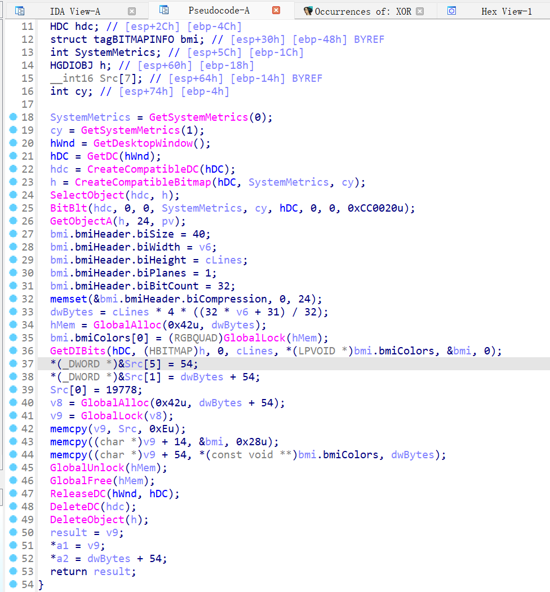

此函数可能用于捕获屏幕截图并存储为位图格式：

1. **获取屏幕尺寸：** 调用 `GetSystemMetrics` 获取屏幕宽度和高度。
2. **创建设备上下文和位图：** 创建一个与桌面窗口兼容的设备上下文，并创建一个同样尺寸的位图。
3. **捕获屏幕内容：** 使用 `BitBlt` 函数将屏幕内容复制到位图中。
4. **提取位图数据：** 通过 `GetDIBits` 函数获取设备无关位图（DIB）的数据。
5. **内存分配和拷贝：** 分配两块内存，一块用于存储 DIB 数据，另一块用于存储将要写入文件的完整位图文件数据（包括位图文件头和 DIB 数据）。
6. **返回数据：** 返回包含完整位图数据的内存块的指针和数据大小。

**分析 `sub_401000`：**

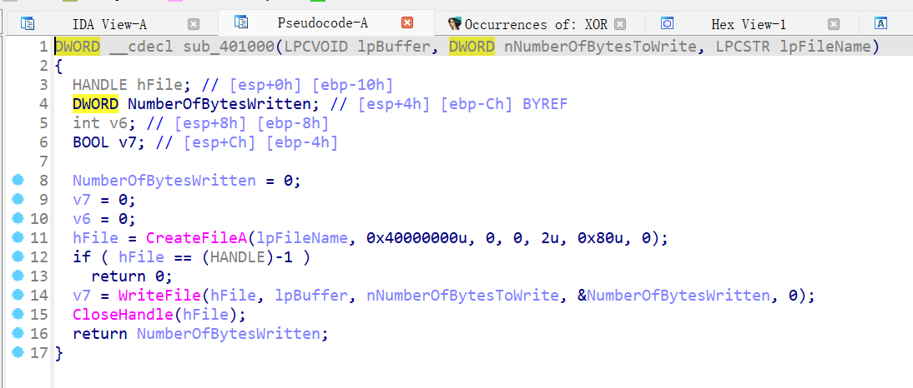

该函数处理文件 I/O：

1. **创建文件：** 使用 `CreateFileA` 创建一个新文件或打开一个现有文件。
2. **写入数据：** 将 `lpBuffer` 指向的数据写入文件。
3. **关闭文件：** 写入完成后关闭文件句柄。
4. **返回写入字节数：** 返回实际写入的字节数。

**分析 `sub_40181F`：**

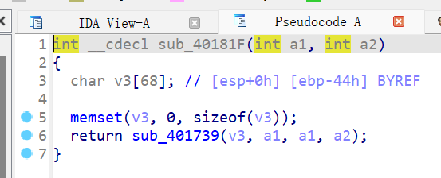

该函数看起来是一个中间函数，它初始化了一个数组，并调用了 `sub_401739`，可能用于数据转换或加密。

**分析 `sub_401739`：**

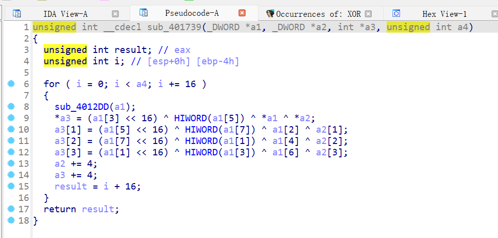

`sub_401739` 函数执行以下操作：

1. **数据处理循环：** 通过一个循环，处理 `a1` 和 `a2` 指向的数据块。
2. **调用 `sub_4012DD`：** 在每个循环迭代中调用 `sub_4012DD`，它可能执行某种加密或哈希函数。
3. **数据混淆：** 使用^（异或操作）和位移操作来混淆或加密数据。
4. **结果返回：** 返回操作后的数据。

在 `sub_401739` 内部，还调用了 `sub_4012DD` 函数：

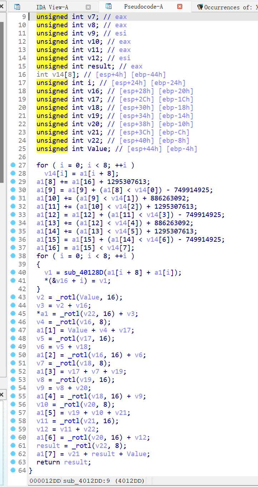

此函数似乎执行复杂的位操作和数学运算，很可能是自定义的加密或哈希算法的一部分：

1. **变量初始化和操作：** 对 `a1` 指向的数据执行一系列加法、旋转和异或操作。
2. **加密/哈希循环：** 对数据执行复杂的变换，这些变换可能包括循环左移（`_rotl`）和其他数学运算，以生成加密或哈希后的数据。

综合这些函数，`Lab13-02.exe` 看起来是一个定时捕获屏幕截图，并将其以某种方式加密或混淆后写入一个文件的程序。这种行为可能属于某种监视软件或恶意软件。

恶意代码反复抓取用户的桌面，并将加密版本的抓屏信息写入到一个文件。这样解释了我们之前不断看到的 ProcMon 中 `WriteFile` 的操作了。

接下来，我们尝试一点刺激的，即使用 OllyDBG 解密，得到加密前的原文件。

首先将程序载入 OllyDBG：

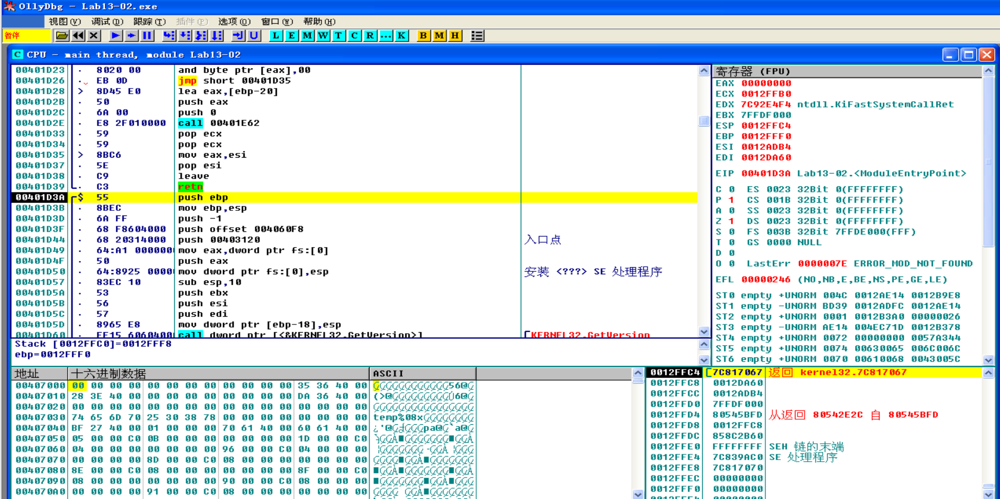

由于我们已经知道加密函数位于 `sub_401880`，我们在此处下断点：

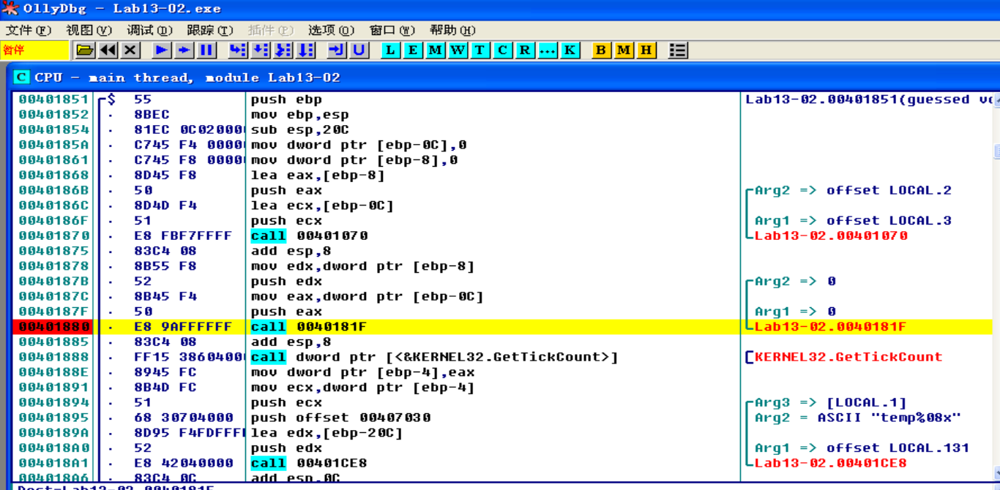

然后进入函数 `40181F`，在开头直接汇编成 `ret` 指令，让它什么也不做。这样便可以得到未加密的数据：

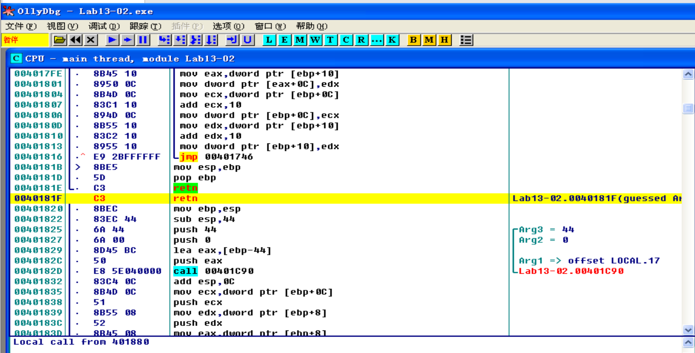

然后保存修改后的文件为 `Lab13-02-d.exe`：


运行它，发现生成的 `temp` 文件不再被加密。直接打开 `tmp` 文件，可以看到这是一个屏幕截图：

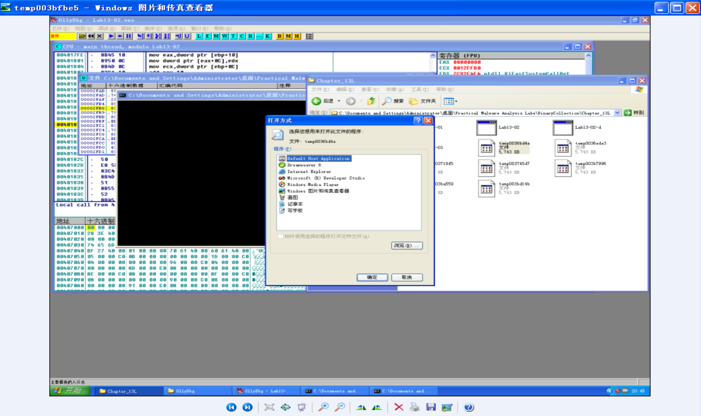

如图所示，能看到刚才被偷拍的地方了……

##### （4）问题解答

> Q1. 使用动态分析，确定恶意代码创建了什么？

`Lab13-02.exe` 在当前目录下每隔一段时间就创建一个较大且看似随机的文件。它们的名字具有以 `temp` 开始，以不同的 8 个十六进制数字结束的共同点。

> Q2. 使用静态分析技术，例如 `xor` 指令搜索、`FindCrypt2`、`KANAL` 以及 `IDA` 熵插件，查找潜在的加密，你发现了什么？

`XOR` 搜索技术在 `sub_401570` 和 `sub_401739` 中识别了加密相关的函数。其他三种推荐技术并没有发现什么。

> Q3. 基于问题 1 的回答，哪些导入函数将是寻找加密函数比较好的一个证据？

`WriteFile` 调用之前可能会发现加密函数。


> Q4. 加密函数在反汇编的何处？

加密函数是 `sub_40181F`。


> Q5. 从加密函数追溯原始的加密内容，原始加密内容是什么？

原内容是屏幕截图。

> Q6. 你是否能够找到加密算法？如果没有，你如何解密这些内容？

加密算法是不标准算法，并且不容易识别，最简单的方法是通过解密工具解密流量。

> Q7. 使用解密工具，你是否能够恢复加密文件中的一个文件到原始文件？

已经还原了。详见上面。

#### 3. Lab13-3

**分析恶意代码文件 Lab13-03.exe**。

##### （1）初步静态分析

我们首先运用 `DIE` 工具来检查样本是否加壳：

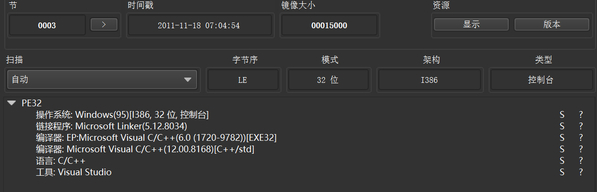

结果显示样本未加壳，且开发工具为 Visual Studio。

接下来，我们查看样本的导入表，发现了一些关键的导入函数：

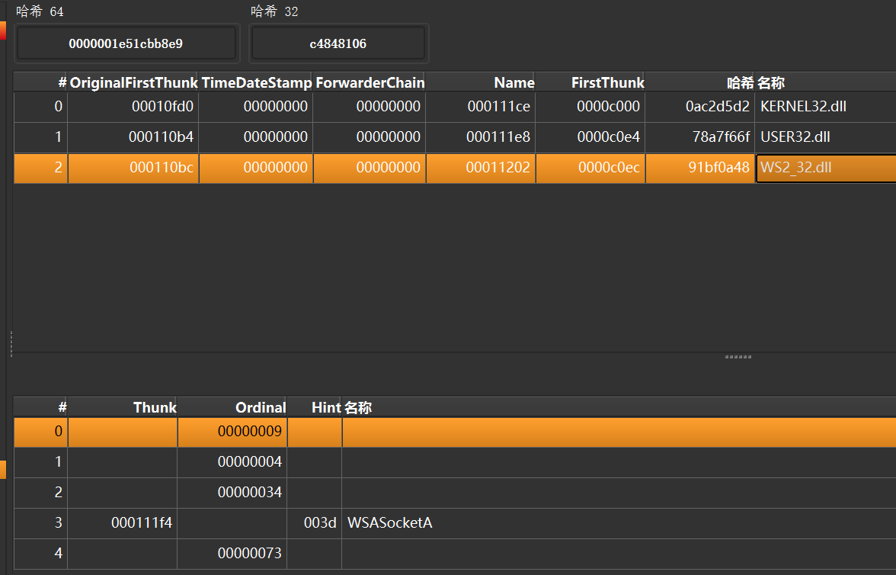

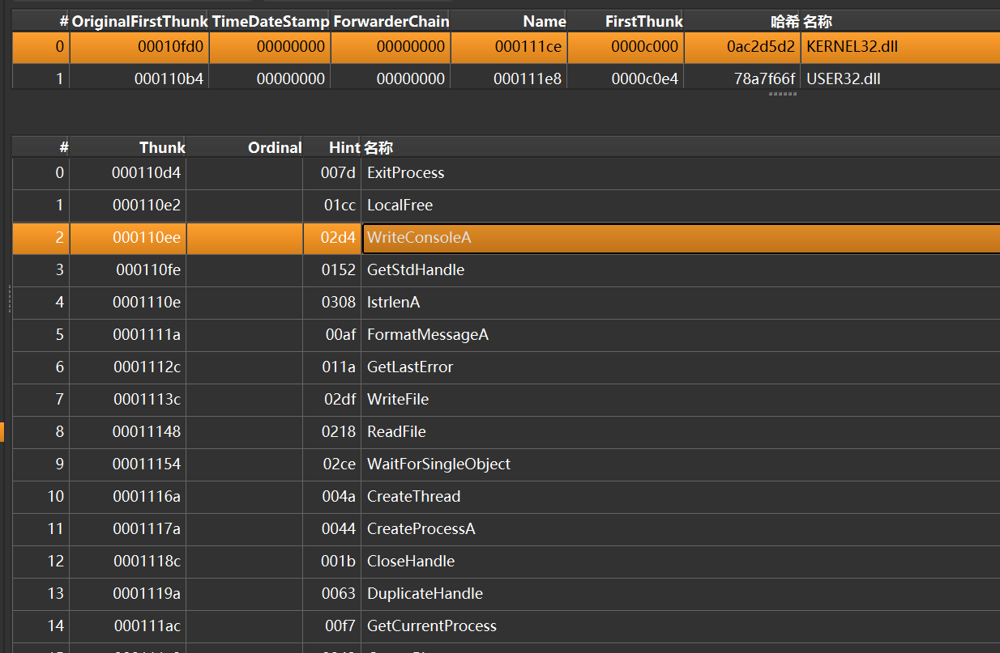

特别地，`WS2_32.dll` 中的函数如 `WSASocket` 等，是 Windows Socket 编程中常用的，这提示我们样本可能涉及网络行为。

我们还看到了 `WriteConsoleA`，这是向控制台写入信息的函数；`FormatMessageA` 和 `GetLastError` 可能用于格式化错误信息；`ReadConsole` 用于从控制台输入缓冲区读取字符；`WriteFile` 和 `ReadFile` 分别用于文件的写入和读取，表明样本将对文件进行操作；`WaitForSingleObject` 通常用于多线程编程中，使当前线程阻塞等待另一个线程，这暗示样本可能包含多线程操作。

然后使用 PEiD 插件 KANAL 查看其是否具有现代加密算法：

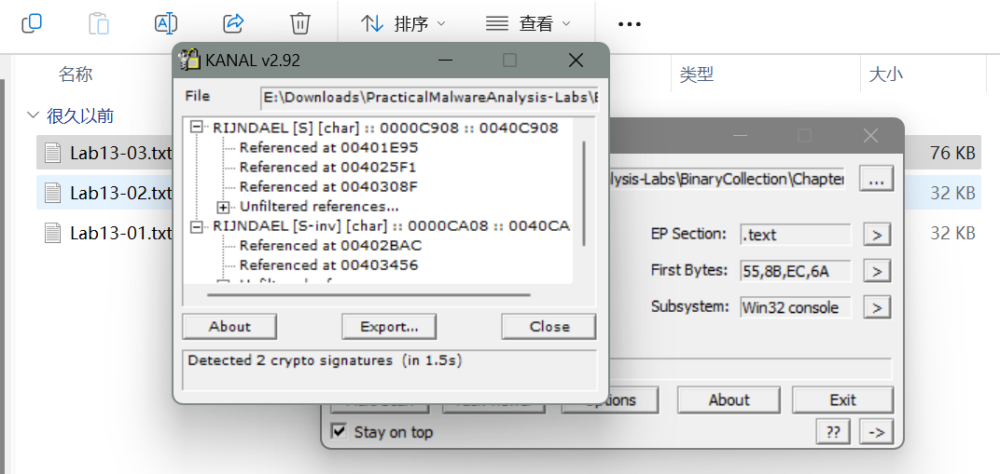

我们发现样本使用了 AES 加密算法。

最后，我们查看样本中的字符串信息：

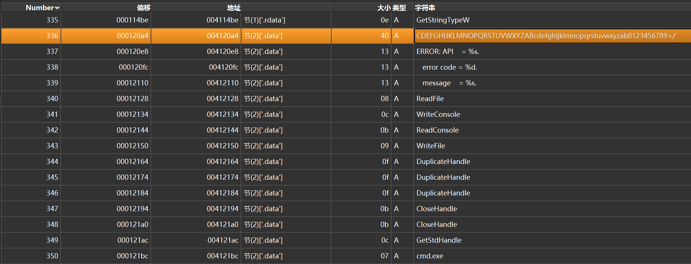

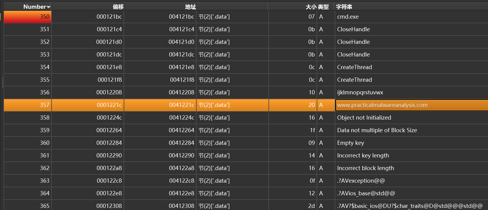

我们发现了 Base64 编码的特征字符串“CDEFGHIJKLMNOPORSTUVWXYZABcdefghijklmnopqrstuvwxyzab0123456789+/”，与 Lab03-01 中的类似，表明样本中存在 Base64 编码行为。但这种编码方式并不常见，因为通常 AB 和 ab 会放在开头，而这里却以 C 和 c 开始。

我们还看到了“ERROR: API”和“error code”等字符串，这可能与 `FormatMessageA` 和 `GetLastError` 有关，用于输出错误信息。此外，我们再次看到了彩蛋域名 `www.practicalmalwareanalysis.com`，但这次它并未被加密，这让我们好奇 Base64 编码的内容究竟是什么。同时，我们还发现了一些奇怪的字符。

##### （2）综合行为分析

鉴于字符串中出现了网址，我们使用 Wireshark 来监控其网络活动。

首先启动 Wireshark 并开始捕获：

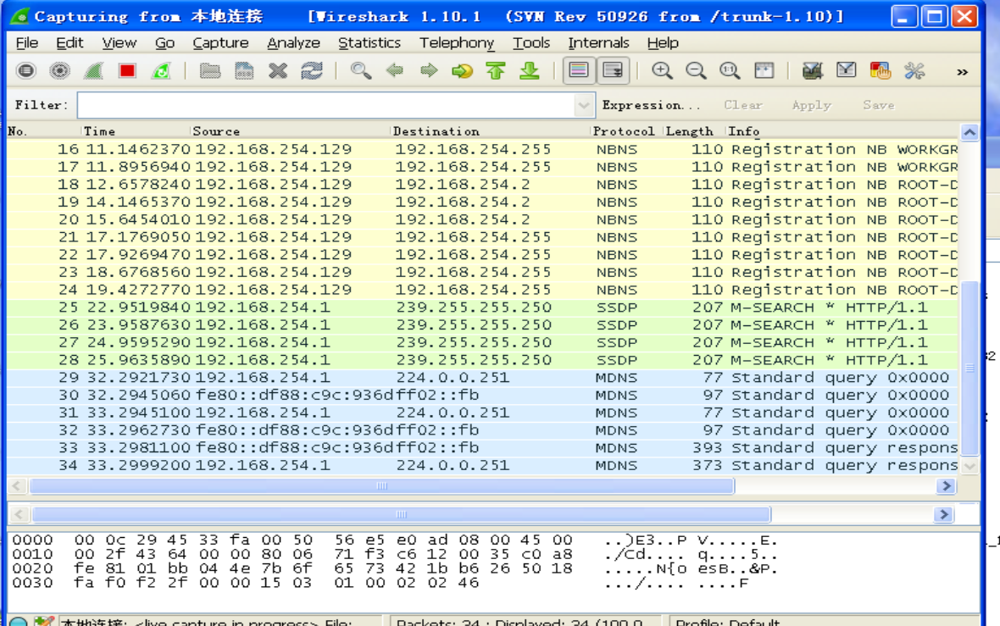

然后运行恶意代码，观察到以下网络行为：

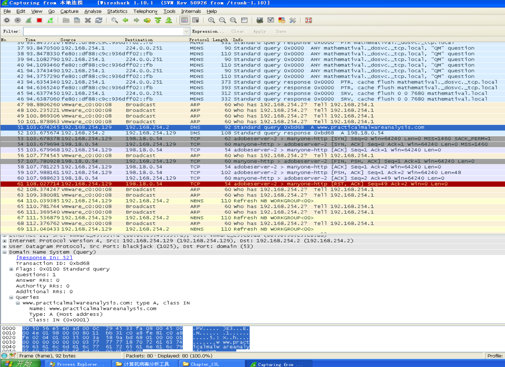

样本向 `www.practicalmalwareanalysis.com` 发送了请求。这进一步证实了我们的猜测，样本确实涉及网络通信行为。

##### （3）深入分析

我们将样本 `Lab13-03.exe` 加载到 IDA 中，并开始检查 `XOR` 指令：

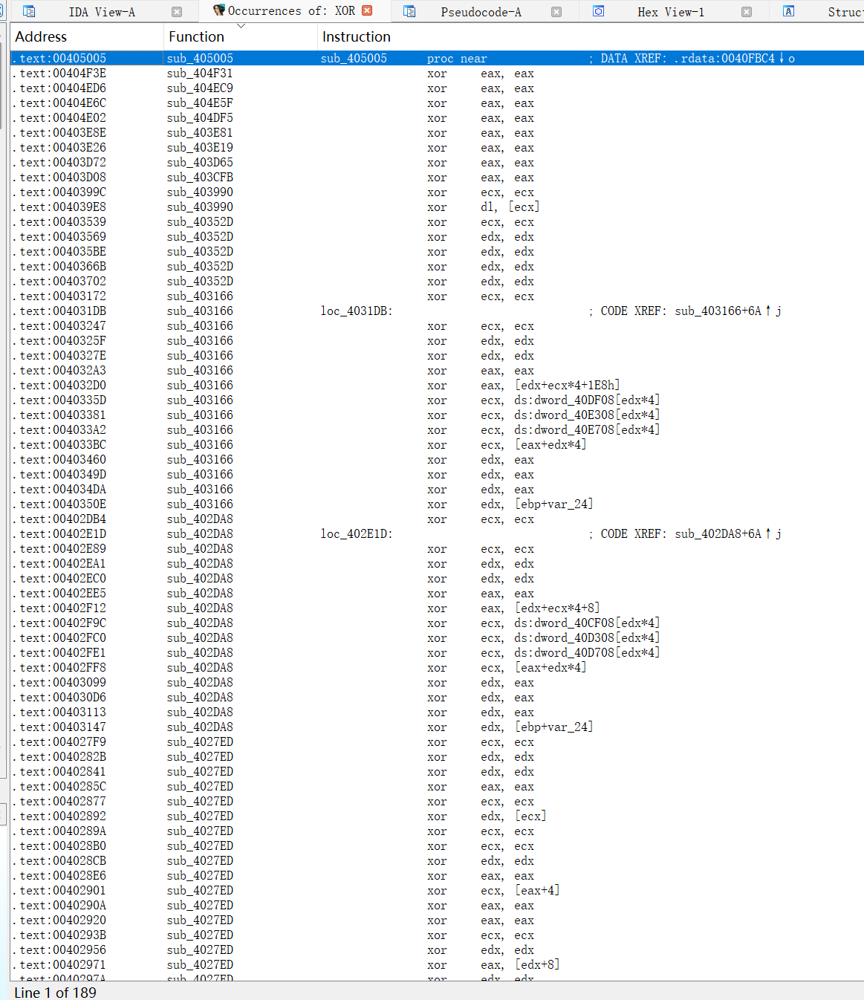

显结果显示，样本中 `XOR` 指令的使用非常频繁。我们排除了与寄存器清零和库函数相关的 `XOR` 指令，最终发现了一些可疑的特殊 `XOR` 指令。

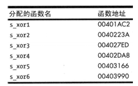

我们对这些可疑的 `XOR` 指令进行了重命名，并准备逐一进行深入分析。

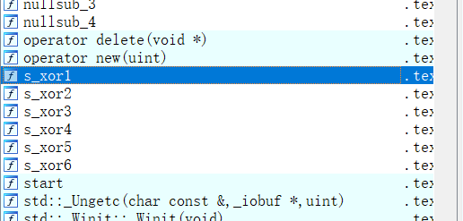

接着，我们使用 IDA 显示熵值的插件，发现在 `rdata` 数据段的 `0x0040C900` 处出现了一些特征，这与 AES 加密中使用的 S-box 区域相同，确认样本确实使用了 AES 加密：

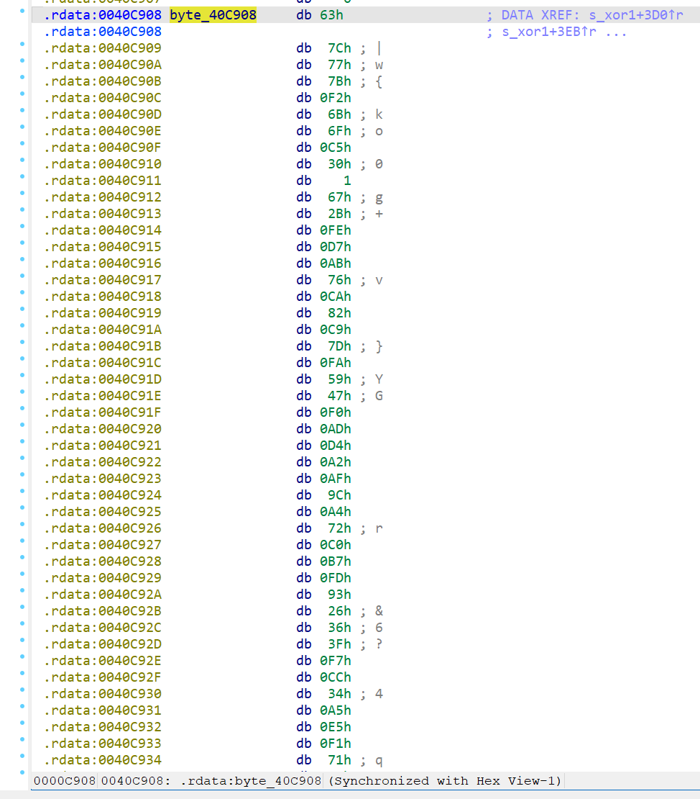

然后，我们利用 IDAPro 的插件 FindCrypt2 进行进一步查找：

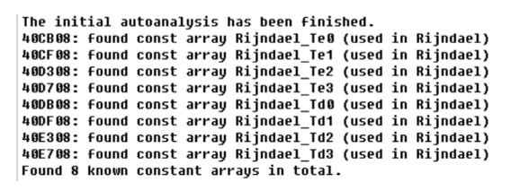

发现在 8 个地方出现了 AES 算法使用的变量。

经过进一步分析，这 8 处出现了两种组合：3 和 5 以及 2 和 4，前 4 个地方使用 2 和 4 进行加密；后 4 个地方使用 3 和 5 进行解密：

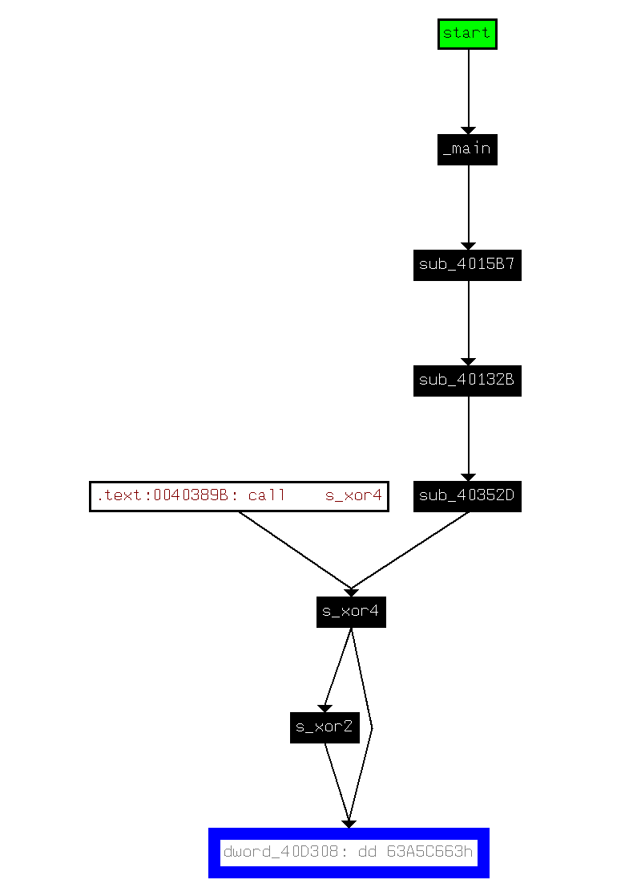

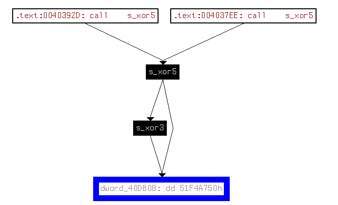

我们查看了 `s_xor6` 函数：

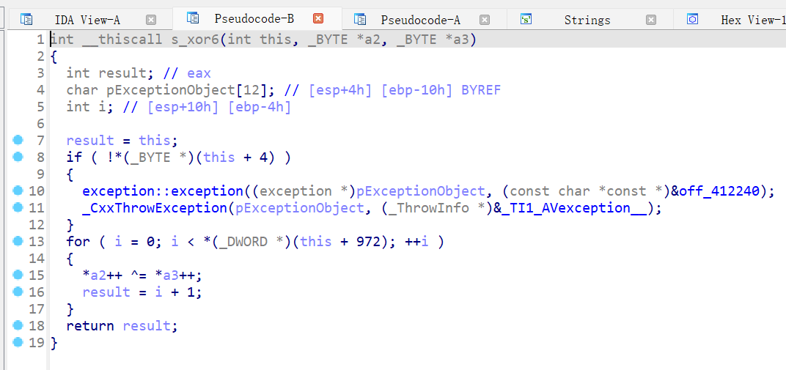

发现里面确实使用了异或操作来加密。

经过分析，我们识别出 `xor2` 和 `xor4` 函数主要用于 AES 加密过程，而 `xor3` 和 `xor6` 函数则用于 AES 解密过程。以下是对这些函数的具体分析：

- **AES 加密函数**：`xor2` 和 `xor4` 被标识为处理 AES 加密的相关函数。这表明它们在加密数据时使用 XOR 操作，这是 AES 算法中的一个典型步骤。
- **AES 解密函数**：另一方面，`xor3` 和 `xor6` 被识别为处理 AES 解密的函数。这暗示这些函数在解密过程中使用 XOR 操作来恢复原始数据。
- **特定函数分析 `xor6`**：具体来说，`xor6` 函数的分析显示，它是一个循环处理函数，涉及 XOR 操作。此函数接受两个参数，都是指针。第一个参数指向待转换的原始缓冲区，而第二个参数指向用于异或操作的数据源。

为了查看 `s_xor6` 是否与其他函数相关联，我们查看了它的交叉引用，发现是函数 `sub_40352D`：

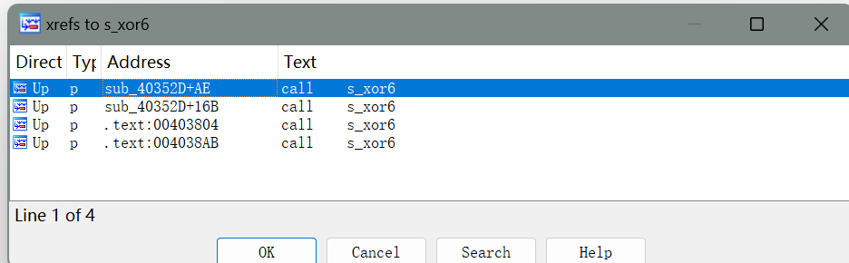

 我们查看 `sub_40352D` 的交叉引用图：

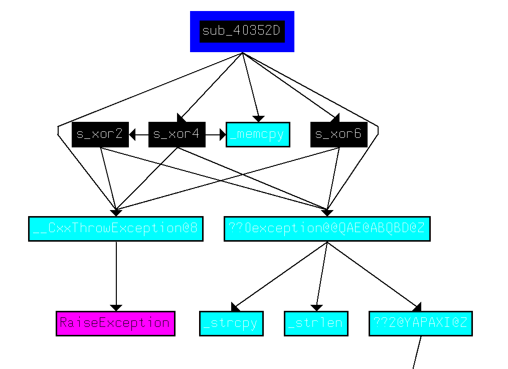

从图中我们确实可以看出 `s_xor6` 和 `s_xor2` 以及 `s_xor4` 相关，但尽管有了 `s_xor3` 和 `s_xor5` 与 AES 解密相关的证据，这两个函数和其他函数的关系并不是那么清晰。

可以看到，尽管我们已经确认了 `xor3` 和 `xor5` 与 AES 解密有关，但是它们与这三个函数之间的关系似乎并不清晰。当我们关注 `xor5` 时，发现它被两个函数调用，但是这两个位置似乎没有被识别为函数。因此我们可以得出结论，当 AES 代码链接到恶意代码时，并未使用解密。

我们将 `0x00403745` 命名为 `AES_decrypt`，将 `0x0040352D` 命名为 `AES_encrypt`：

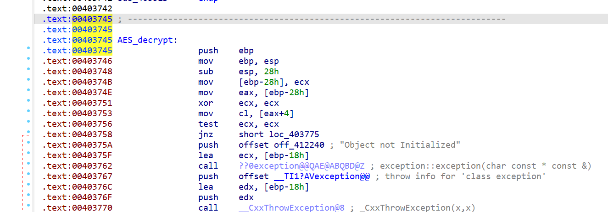

然后重新创建一个图，查看从这两个函数开始调用的所有函数：

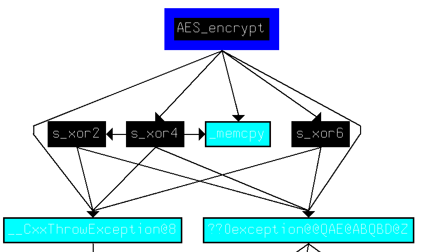


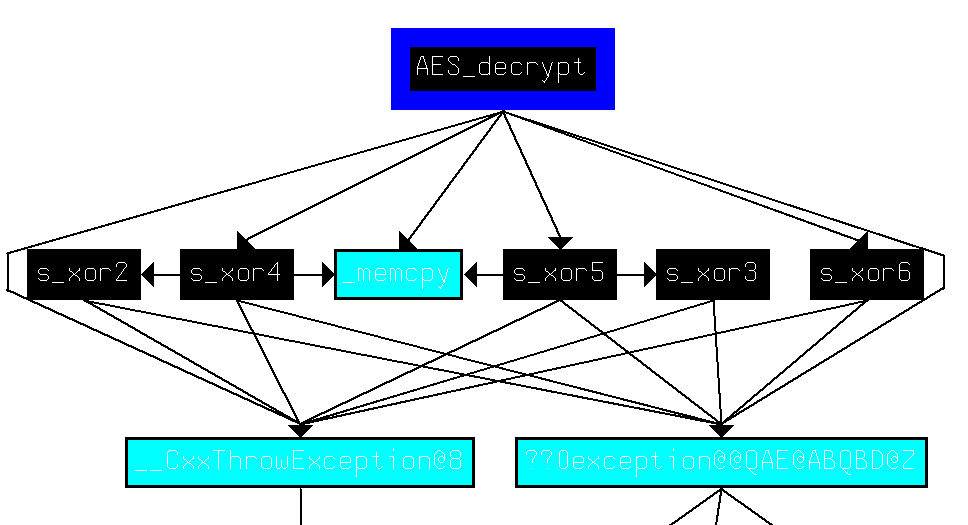

回过头来看 `main` 函数的调用，它调用了 `s_xor1`：

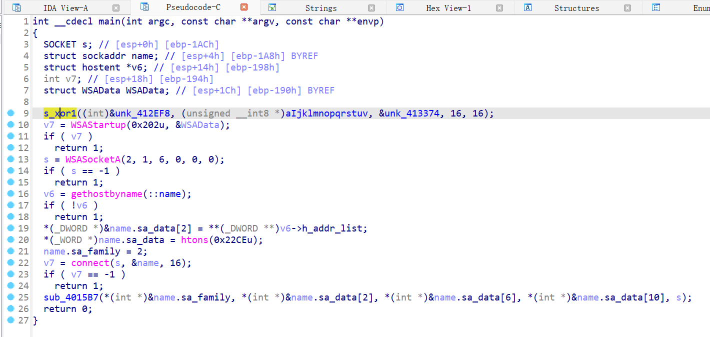

并且其加密参数是字符串 `ijklmnopqrstuvwx`，它用于 AES 加密。

接着我们查看 `xor1` 函数，它虽然不是直接执行 AES 算法的部分，却在处理与加密相关的初始设置和判断中发挥着关键作用：

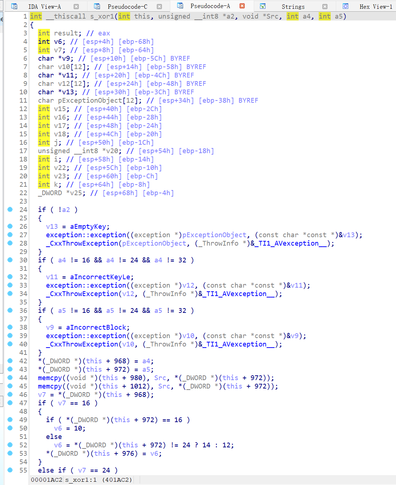

- `xor1` 的功能和角色：`xor1` 在加密过程中主要负责密钥的校验和一些初步判断。如果密钥为空或长度不符合要求，`xor1` 将识别这些情况。
- `xor1` 与其他函数的关系：通过分析 `xor1` 的调用关系，我们注意到在 `xor1` 被调用之前，地址 `412EF8` 的函数先被执行。这个函数将一个偏移量传递给 `xor1`，并且在加密操作之前被加载到 `ECX` 寄存器，这表明它可能是一个 C++对象，或者更具体地，是一个 AES 加密器实例。
- 参数传递和判断逻辑：`xor1` 接收了这个偏移量（我们称之为 `arg0`）作为参数。如果 `xor1` 完成了对密钥的判断，而且密钥为空，会发出相应的提示。因此，可以推断 `arg0` 实际上是加密过程中使用的密钥。
- 在主函数中的参数设置：在 `main` 函数中，`xor1` 的参数在地址 `0x401895` 处被设置。此处设置的字符串将用于后续的加密过程。

因此 `xor1` 函数在加密流程中扮演着准备和校验的角色，确保密钥的有效性和正确性。

在地址 `0040132B` 处，程序调用了加密函数。这个调用发生在读取文件之前，并且在加密过程之后，程序完成了写文件的操作：

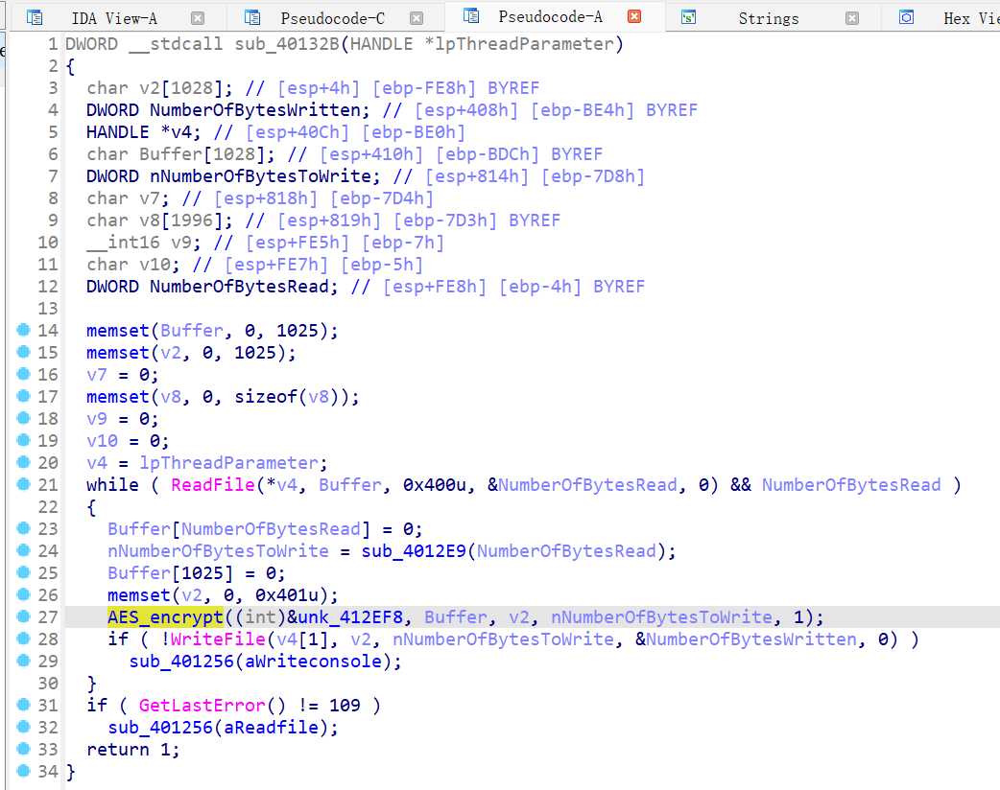

`xor1` 函数仅在程序启动时被调用一次，其主要作用是设置加密密钥。另外 Base64 编码也参与了加密过程。

接下来寻找 Base64 自定义加密的踪迹，我们发现其字符串位于：

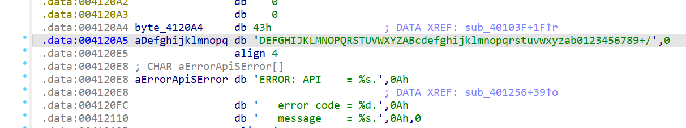

查找函数对其引用，发现在 `sub_40103F` 中：

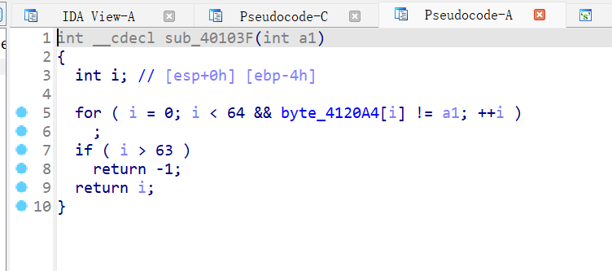

这个函数又被 `sub_401082` 调用，查看代码：

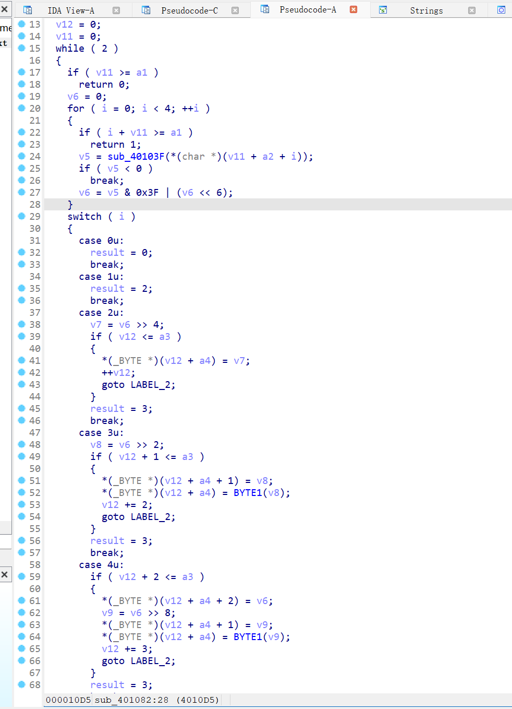

这个函数是一个自定义的 Base64 解码函数，并且可以看到位于 `ReadFile` 和 `WriteFile` 之间的解码函数 `0x0040147C` 也调用了它。

在解密前我们需要先确定加密函数与解密函数之间的关系，根据分析可知 AES 加密函数被 `0x0040132B` 开始的函数使用，我们查看这个函数：

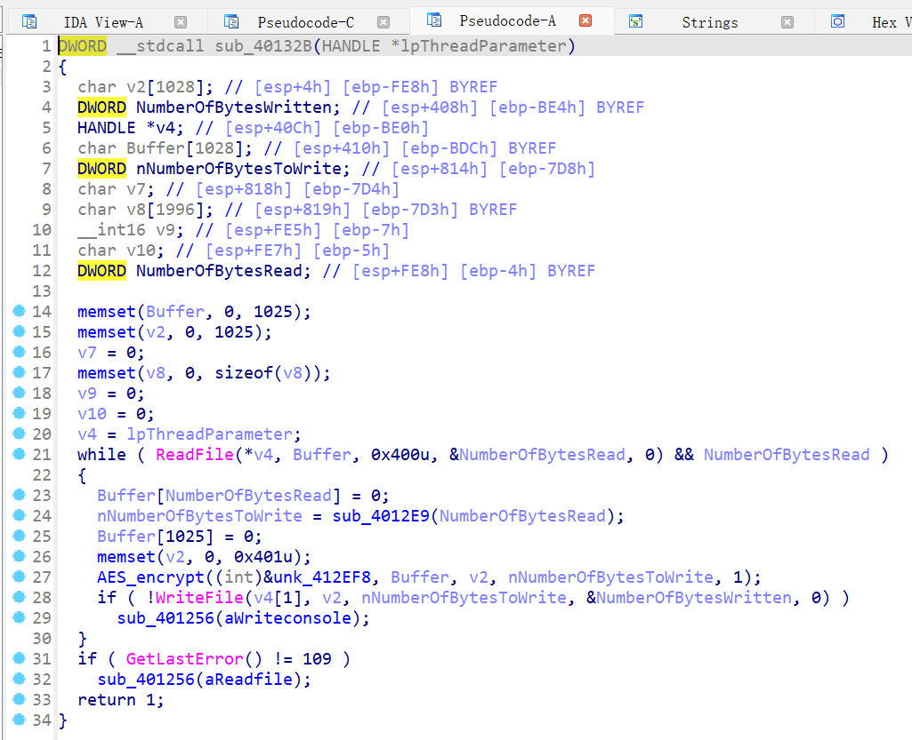

这是一个线程的开始，因此我们将其重命名为 `aes_thread`。

自定义的 Base64 加密函数（`0x00401082`）也在一个它们宿主线程启动的函数（`0x0040147C`）中使用。利用一个假想的结论：Base64 线程读取远程套机字的内容作为输入，经过函数解密后，它再将结果发送作为命令 shell 的输入。可以得出跟踪输入与跟踪 AES 线程的输入非常相似。

到此我们可以给出结论：自定义的 Base64 加密函数，位于地址 `0x00401082`，被用在一个由宿主线程启动的函数（位于 `0x0040147C`）中。

- Base64 加密函数的应用场景：此 Base64 加密函数在特定线程启动的函数中得到应用，这表明它在程序的某个特定操作中起着关键作用。
- 假设的工作流程：假设 Base64 线程负责读取远程套接字的内容。这些内容被作为输入传递到 Base64 函数进行解密。解密后的数据随后被发送到命令 shell，作为其输入。
- 输入跟踪的相似性：通过比较这个流程与追踪 AES 线程的输入，我们发现两者非常相似。这种相似性可能表明程序中的不同加密部分在数据处理上有着一致的模式或目的。

因此程序使用自定义的 Base64 函数处理远程套接字的内容，并且这个处理过程与 AES 加密线程的工作流程有着显著的相似性。

而 Base64 解密算法可用以下代码概述：

```python
import string
import base64
S=""
tab="CDEFGHIJKLMNOPORSTUVWXYZABcdefghiklmnopqrstuvwxyzab0123456789+/"
b64='ABCDEFGHIJKLMNOPORSTUVWXYZabcdefghiklmnopqrstuvwxyz0123456789+/
ciphertext = 'BInaEi=='
for ch in ciphertext:
    if (ch in tab):
    	s += b64[string.find(tab,str(ch))]
    elif(ch=='='):
    	S +='='
print base64.decodestring(s)
```

关于 AES 解密算法，我们可以使用如下书中参考代码：

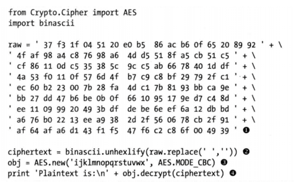

##### （4）问题解答

> Q1. 比较恶意代码的输出字符串和动态分析提供的信息，通过这些比较，你发现哪些元素可能被加密？

动态分析可能找出一些看似随机的加密内容。程序的输出中没有可以识别的字符串，所以也没有什么东西暗示使用了加密。

> Q2. 使用静态分析搜索字符串 xor 来查找潜在的加密。通过这种方法，你发现什么类型的加密？

通过使用插件和分析，`Xor` 指令发现了 6 个可能与加密相关的单独函数，但是加密的类型一开始并不明显。


> Q3. 使用静态工具，如 `FindCrypt2`、`KANAL` 以及 `IDA` 熵插件识别一些其他类型的加密机制。发现的结果与搜索字符 XOR 结果比较如何？

这三种技术都识别出了高级加密标准 AES 算法(Rijndael 算法），它与识别的 6 个 `XOR` 函数相关。IDA 熵插件也能识别一个自定义的 Base64 索引字符串，这表明没有明显的证据与 `xor` 指令相关。

> Q4. 恶意代码使用哪两种加密技术？

恶意代码使用 AES 和自定义的 Base64 加密。

> Q5. 对于每一种加密技术，它们的密钥是什么？

AES 的密钥是 `ijklmnopqrstuvwx`，自定义的 Base64 加密的索引字符串是：`CDEFGHIJKLMNOPQRSTUVWXYZABcdefghijklmnopqrstuvwxyzab0123456789+/`。

> Q6. 对于加密算法，它的密钥足够可靠吗？另外你必须知道什么？

对于自定义 Base64 加密的实现，索引字符串已经足够了。但是对于 AES，实现解密可能需要密钥之外的变量。如果使用密钥生成算法，则包括密钥生成算法、密钥大小、操作模式，如果需要还包括向量的初始化等。

> Q7. 恶意代码做了什么？

恶意代码使用以自定义 Base64 加密算法加密传入命令和以 AES 加密传出 shell 命令响应来建立反连命令 shell。

> Q8. 构造代码来解密动态分析过程中生成的一些内容，解密后的内容是什么？

上文已经分析，这里不再赘述。

### （二）yara 编写与分析

#### 1. yara 编写

本次 Yara 规则的编写基于上述的病毒分析和实验问题，主要是基于静态分析的字符串和 IDA 分析结果。

```yara
private rule isMZ_PE {
    meta:
        description = "It is a PE file"
    condition:
        filesize <10MB and uint16(0) == 0x5A4D and uint32(uint32(0x3C)) == 0x00004550
        // 文件大小小于10MB，文件头的前两个字节为MZ，PE头的偏移地址处的四个字节为PE标志
}

// Lab13-01
rule Lab13_01_exe {
    meta:
        description = "It may like Lab13_01_exe"
    strings:
        $s1 = "Mozilla/4.0"
        $s2 = "http://%s/%s/"
        $s3 = "ABCDEFGHIJKLMNOPQRSTUVWXYZabcdefghijklmnopqrstuvwxyz0123456789+/"
    condition:
        isMZ_PE and all of them
}

// Lab13-02
rule Lab13_02_exe {
    meta:
        description = "It may like Lab13_02_exe"
    strings:
        $s1 = "temp%08x"
        $s2 = "GDI32.dll"
        $s3 = "GetTickCount"
    condition:
        isMZ_PE and all of them
}

// Lab13-03
rule Lab13_03_exe {
    meta:
        description = "It may like Lab13_03_exe"
    strings:
        $s1 = "CDEFGHIJKLMNOPQRSTUVWXYZABcdefghijklmnopqrstuvwxyzab0123456789+/"
        $s2 = "ijklmnopqrstuvwx"
        $s3 = "www.practicalmalwareanalysis.com"
        $s4 = "cmd.exe"
    condition:
        isMZ_PE and all of them
}
```

#### 2. 运行

把上述 Yara 规则保存为 `lab10.yar`, 然后执行检查，可以看到，样本被检出。**Yara 规则编写成功！**

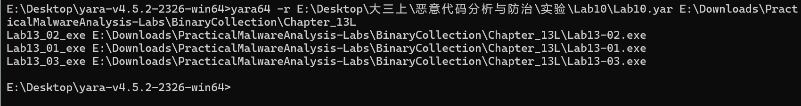

#### 3. 测试执行效率

接下来测试规则的执行效率，我选择编写一个 python 脚本、执行扫描和时间统计，代码如下：

```python
import os
import time

# 获取程序开始时间
start_time = time.time()

os.system(r"E:\Desktop\yara-v4.5.2-2326-win64\yara64.exe -r E:\Desktop\大三上\恶意代码分析与防治\实验\Lab10\Lab10.yar E:\Downloads")

# 获取程序结束时间
end_time = time.time()

# 计算并输出程序运行时间
elapsed_time = end_time - start_time
print(f"程序运行时间: {elapsed_time} 秒")
```

选择的文件夹为 E:\Downloads，这个文件夹大小为 2.12GB，有 461 个文件、114 个文件夹：

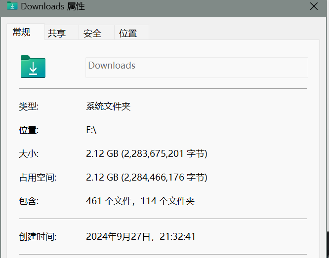

运行结果如下，如图所示运行时间为 2.64s，说明效率较高。

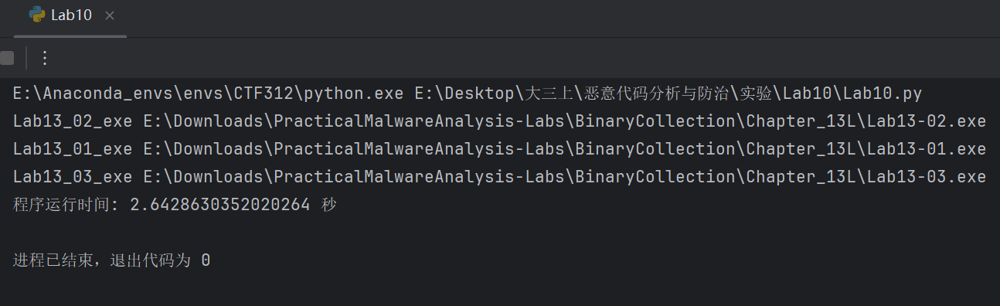

### （三）IDA python 脚本编写

#### 1. IDA python 脚本编写

为了简化安全审计和逆向工程的工作，我编写了三个脚本来辅助分析：

##### 脚本一

```python
import idaapi
import idautils
import idc

# 检查指令是否是 'jmp' 或 'call' 且操作数为寄存器类型
def is_jump_or_call_with_register(ea):
    """
    检查给定地址的助记符是否为 'jmp' 或 'call' 且操作数为寄存器类型
    """
    mnemonic = idc.print_insn_mnem(ea)
    if mnemonic not in ['jmp', 'call']:
        return False
    opnd_type = idc.get_operand_type(ea, 0)
    # 确保操作数是寄存器类型
    return opnd_type in [idaapi.o_reg, idaapi.o_phrase, idaapi.o_displ]

# 检查函数是否为库函数
def is_library_function(func_ea):
    """
    检查给定地址的函数是否为库函数
    """
    flags = idc.get_func_attr(func_ea, idc.FUNCATTR_FLAGS)
    return flags & idaapi.FUNC_LIB

# 标记不安全的函数调用并设置颜色
def judge_audit(addr):
    """
    对不安全的函数调用进行标注，并设置背景颜色
    """
    idc.set_cmt(addr, "### AUDIT HERE ###", 0)  # 添加注释
    idc.set_color(addr, idc.CIC_ITEM, 0x0000ff)  # 设置指令背景颜色

# 标记不安全函数的调用
def flag_calls(danger_funcs):
    """
    查找并标记程序中所有不安全函数的调用
    """
    count = 0
    for func in danger_funcs:
        faddr = idc.get_name_ea_simple(func)
        if faddr != idaapi.BADADDR:
            # 获取对该函数的所有交叉引用
            cross_refs = idautils.CodeRefsTo(faddr, 0)
            for addr in cross_refs:
                count += 1
                print("%s[%d] calls 0x%08x" % (func, count, addr))
                judge_audit(addr)

# 主函数
def main():
    # 遍历所有函数，排除库函数
    for func in idautils.Functions():
        if is_library_function(func):
            continue

        # 遍历函数中的所有指令
        ea = func
        func_end = idc.find_func_end(func)
        while ea != idaapi.BADADDR and ea < func_end:
            # 如果是跳转或调用且操作数是寄存器类型
            if is_jump_or_call_with_register(ea):
                print("Address: 0x{:X}, Instruction: {}".format(ea, idc.generate_disasm_line(ea, 0)))
            # 继续处理下一条指令
            ea = idc.next_head(ea)

    # 识别并标记不安全函数调用
    print("-------------------------------")
    danger_funcs = ["DllEntryPoint", "printf", "strcpy", "GetModuleFileNameExA", "Thread32Next"]
    flag_calls(danger_funcs)
    print("-------------------------------")

if __name__ == '__main__':
    main()
```

该脚本主要有两个功能：

1. **动态跳转或调用检测**，即检测汇编指令是否是 `jmp` 或 `call`，并且操作数为寄存器类型。

2. **查找和标记危险函数调用**，并为每个调用添加注释、设置背景颜色。（主要用来漏洞挖掘）

##### 脚本二

本次实验中由于所有恶意样本都出现需要解密的地方，因此编写如下脚本，进行一些简单的解密操作。

具体来说，这段代码对字符串中的每一个字符都与一个特定字符进行异或操作。

```python
import idaapi
import idc
import idautils

def log_message(message):
    """Log messages to the IDA output window."""
    print(f"[XOR Decoder]: {message}")

def xor_decode_le(data, operand):
    """
    Perform XOR decoding for little-endian data.
    Each byte is XOR-ed with the operand (0x41).
    """
    decoded_data = bytearray()
    for byte in data:
        decoded_data.append(byte ^ operand)
    return decoded_data

def save_to_file(filename, data):
    """Save the decoded data to a file."""
    try:
        with open(filename, "wb") as f:
            f.write(data)
        log_message(f"Decoded data saved to: {filename}")
    except Exception as e:
        log_message(f"Failed to save data to file: {e}")

def main():
    # Known parameters for the section
    start_ea = 0x00006084  # start address
    size = 0x6000         # Size of the section (in bytes)
    
    # Define the XOR operand (41 in hex)
    xor_operand = 0x41
    log_message(f"Using XOR operand: {hex(xor_operand)}")

    # Read the resource section content
    log_message(f"Reading section from {hex(start_ea)} with size {size} bytes...")
    encoded_data = idaapi.get_bytes(start_ea, size)
    if not encoded_data:
        log_message("Failed to read section content!")
        return

    # Decode the content
    log_message("Decoding the section...")
    decoded_data = xor_decode_le(encoded_data, xor_operand)

    # Save the decoded content to a file
    output_filename = "decoded.txt"
    save_to_file(output_filename, decoded_data)

    log_message("XOR decoding completed.")

if __name__ == "__main__":
    main()
```

##### 脚本三

本次实验中涉及的病毒具有复杂的调整行为比如 Lab13-03 的函数非常复杂，所以编写一个查找并跟踪参数传递的函数。

```python
import idaapi
import idc
import idautils

def find_mov_esi(addr):
    """
    在给定地址addr的上下文中，向前遍历指令，找到最近的一条mov指令，
    并将值赋给esi寄存器。如果是，则打印找到的参数值。
    """
    while addr != idaapi.BADADDR:
        insn = idc.get_insn_at(addr)
        if insn is None:
            break
        mnemonic = idc.print_insn_mnem(insn)
        if mnemonic == "mov":
            # 获取操作数
            operands = idc.print_operands(insn)
            # 检查是否将值赋给esi寄存器
            if "esi" in operands:
                # 提取并打印参数值
                esi_value = idc.get_operand_value(insn, 0) if "esi" in operands else idc.get_operand_value(insn, 1)
                print(f"Found mov to esi at {idc.get_func_name(addr)}+{addr-idc.get_func_attr(addr, idc.FUNCATTR_START)}: {esi_value}")
                break
        addr = idc.prev_head(addr)  # 向前移动到上一条指令
```

#### 2. 运行

下面我以脚本一为例进行展示，执行该 IDApython 脚本：

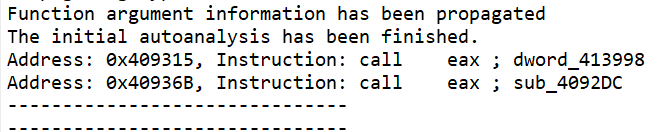

可以看到控制台输出了 `call`，说明脚本编写成功！

## 四、实验结论及心得体会

---

本次实验为我提供了深入理解和实践恶意代码分析及加密解密技术的宝贵机会。实验的核心任务是针对 Lab13 中的三个恶意代码样本进行剖析，通过静态分析工具（如 IDA Pro）和动态分析手段的巧妙结合，我成功地识别并解密了样本中运用的多种加密算法。在探索病毒加密技术的过程中，我识别出了 Base64 和 AES 等常见加密技术的影子，并凭借先前知识和工具的熟练运用，成功解锁了加密数据并精准定位了关键代码。

在细致的分析过程中，我充分利用了 IDA Pro 的“字符串”模块、反汇编视图、图形视图等高级功能，对病毒的核心机制进行了深度挖掘。基于这些分析，我编写了 Yara 规则，并成功检测到病毒样本的独特特征，这一成果不仅验证了规则的实用性，也展现了其在病毒检测中的优异性能。此外，我还专为此次实验开发了 IDAPython 脚本，用以辅助完成分析中的重复性任务。这些脚本的编写与应用显著提升了分析效率，并深化了我对逆向工程和脚本编程的认识。

总体而言，实验目标的达成令人满意。通过将理论与实践紧密结合，我不只学会了多种分析技巧，更在恶意代码分析的征途上，提升了自己的综合实力。
