<div align='center'>
<b> <font face='微软雅黑' size='6'> 恶意代码分析与防治技术课程实验报告 </font> </b>
</div>


<div align='center'>
<b> <font font face='微软雅黑' size='6'> 实验十四 </font> </b>
</div>


<div>
<font face='宋体' size='6'>&nbsp;&nbsp;&nbsp;&nbsp; 学 院：网络空间安全学院 </font> <br>
<font face='宋体' size='6'>&nbsp;&nbsp;&nbsp;&nbsp; 专 业：信息安全 </font> <br>
<font face='宋体' size='6'>&nbsp;&nbsp;&nbsp;&nbsp; 学 号：2212998 </font> <br>
<font face='宋体' size='6'>&nbsp;&nbsp;&nbsp;&nbsp; 姓 名：胡博浩 </font> <br>
<font face='宋体' size='6'>&nbsp;&nbsp;&nbsp;&nbsp; 班 级：信息安全 </font> <br>
</div>


## 一、实验目的

---

1. 完成教材上 lab14 的实验内容。
2. 在样本分析结果的基础上，编写样本的 Yara 检测规则。
3. 尝试编写 IDA Python 脚本来辅助样本分析。

## 二、实验原理

---

### 网络应对策略

恶意代码的传播与执行，在很大程度上依赖于网络通信。因此，实施有效的网络应对措施是防止恶意软件扩散、减轻攻击影响、保护网络安全的关键。以下是我们常用的几种策略：

1. **流量监控与分析**

	流量监控与分析是识别恶意活动的第一道防线。通过部署入侵检测系统（IDS）和入侵防御系统（IPS），我们可以实时监测网络中的异常行为。这些系统会对网络流量的模式进行分析，包括传输协议、端口、数据包大小等，以识别是否存在恶意行为。同时，防火墙的使用可以阻止未经授权的网络访问，降低恶意代码传播的风险。

2. **通信阻断**

	切断恶意代码与远程 C&C 服务器的通信至关重要。我们可以通过封堵特定的 IP 地址、域名或恶意通信协议来实现这一目标。特别是在应对 DGA 攻击时，及时识别并阻断可疑域名，能够有效切断恶意代码的通信链路。

### 安全调查在线攻击者

调查在线攻击者的活动需采取谨慎且精确的方法，确保调查过程既不暴露调查者身份，又能收集充足证据。具体方法如下：

1. **沙箱分析**

	沙箱分析在隔离环境中执行恶意代码，观察其行为，如文件操作和网络请求，从而揭示恶意软件的特征和攻击方式。

2. **网络取证技术**

	网络取证技术通过分析日志、数据包捕获和网络流量数据，追踪攻击者的 IP 地址和使用的协议，以确定攻击来源。

3. **法律与伦理遵从**

	在进行调查过程中，严格遵守相关法律和伦理规范至关重要。所有调查活动都应合法合规，避免侵犯隐私或造成不必要的损害。

### 动态与静态分析技术相结合

为了全面深入地分析恶意代码，我们必须将动态分析与静态分析相结合。这两种方法各具优势，联合使用能为我们提供更加全面的信息。

1. **静态分析**

	静态分析在不执行代码的情况下，对其结构和依赖关系进行分析，揭示潜在的功能特点。

2. **动态分析**

	动态分析在受控环境中执行恶意软件，实时监控其行为，这对于理解其运行时特性具有重要意义。

### 掌握攻击者意图

了解攻击者的意图有助于揭示恶意代码的攻击目标和目的，从而为防御策略提供指导。通过分析恶意代码的行为模式和攻击策略，安全专家可以推断出攻击者的动机和背景。

1. **行为模式分析**

	恶意代码的行为模式反映了攻击者的目标，研究这些模式有助于我们采取针对性的防御措施。

2. **攻击策略评估**

	评估攻击策略有助于我们理解攻击者的技术能力和动机，为制定防护措施提供依据。

### 恶意代码的网络特征

了解恶意代码的网络特征对于防范和应对恶意软件攻击至关重要。常见的恶意代码网络特征包括：

1. **C&C 服务器通信**

	恶意代码通常通过 C&C 服务器通信来接收指令，分析这些通信有助于揭露并阻断恶意活动。

2. **非正常网络流量**

	恶意软件产生的异常流量，如流量突变或使用非常规端口，是检测的关键指标。

3. **数据渗透**

	通过监控网络流量，我们可以检测恶意软件窃取数据的行为，并采取相应的拦截措施。

4. **DoS/DDoS 攻击**

	利用流量分析，我们可以识别并防范 DoS/DDoS 攻击，确保系统资源不受耗尽。

综上所述，通过综合运用流量监控、通信阻断、沙箱分析、网络取证等多种手段，我们能够有效应对恶意软件的网络特征，确保网络环境的安全稳定。

## 三、实验过程

---

### （一）完成 Lab14 的题目

#### 1. Lab14-1

**分析恶意代码文件 Lab14-01.exe。这个程序对你的系统无害**。

##### （1）初步静态分析

我们首先利用 `DIE` 工具来检查样本是否加壳：

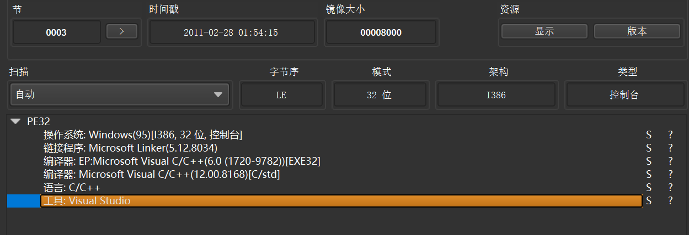

检查结果显示样本未加壳。

随后，我们查看了样本的导入表，发现了一些关键的导入函数：

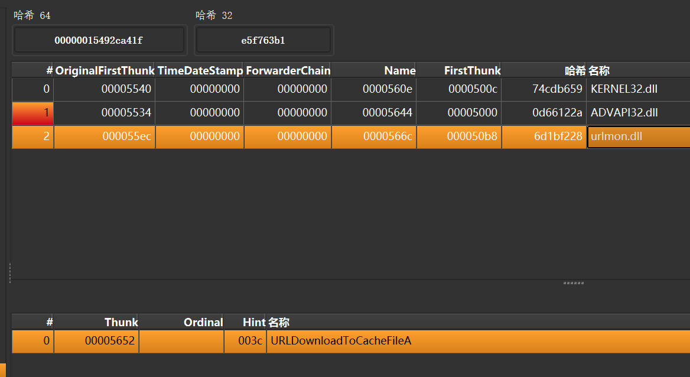

特别地，我们注意到了 `urlmon.dll` 中的 `URLDownloadToCacheFileA` 函数，该函数用于从 URL 下载文件到本地缓存。这提示我们样本可能会进行网络下载行为。

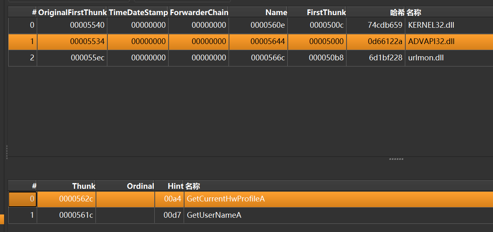

我们还看到了 `ADVAPI32.dll` 中的函数，如 `GetUserNameA` 和 `GetCurrentHwProfileA`，这些函数用于获取当前用户的用户名和硬件配置文件信息。这可能表明恶意代码可能会尝试利用当前用户权限或某些应用程序执行恶意行为。

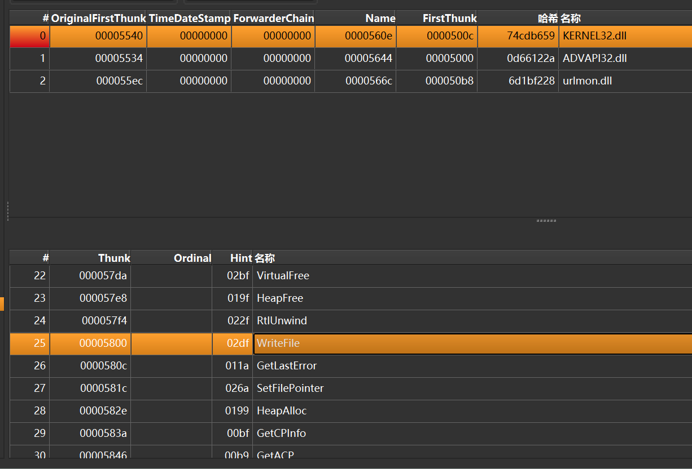

最后，我们还发现了 `WriteFile` 函数，这表明恶意代码可能会创建或写入文件。

在查看样本中的字符串信息时，我们发现了以下内容：

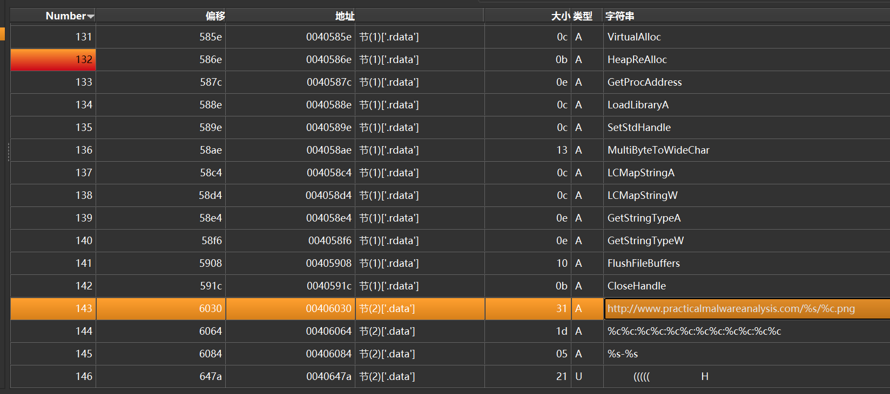

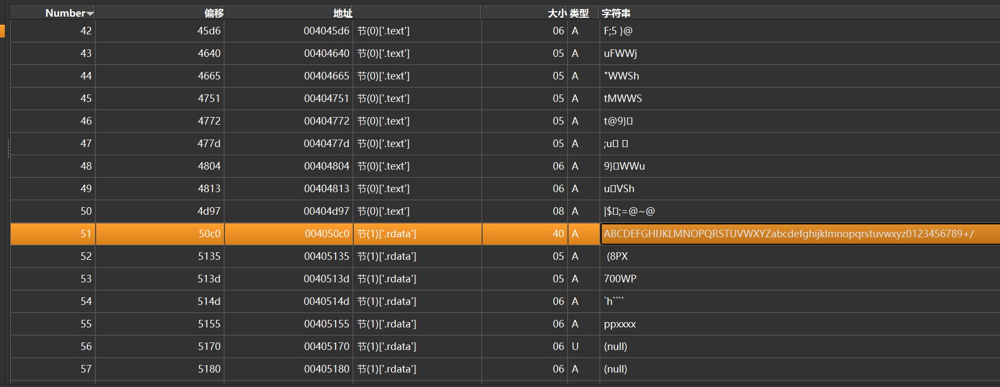

我们发现了一个字符串 `http://www.practicalmalwareanalysis.com/%s/%c.png`，这表明恶意代码可能进行了网络活动，结合之前发现的 URL 下载行为，推测其可能是在下载请求该 PNG 文件资源。

此外，我们还发现了字符串 `ABCDEFGHIJKLMNOPQRSTUVWXYZabcdefghijklmnopqrstuvwxyz0123456789+/`，这是明显的 Base64 编码。这表明恶意代码可能使用了 Base64 编解码技术。

##### （2）综合行为分析

鉴于样本具有网络行为，我们使用 Wireshark 进行抓包分析。

首先保存快照，并启动 Wireshark：

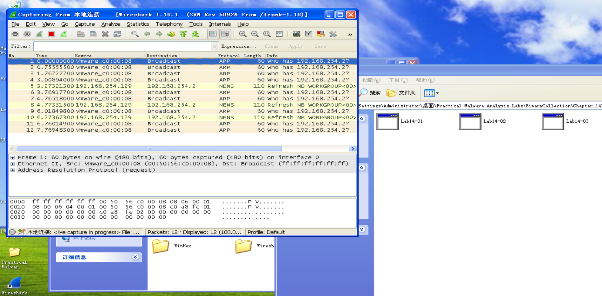

然后运行恶意样本，并返回 Wireshark 查看结果：

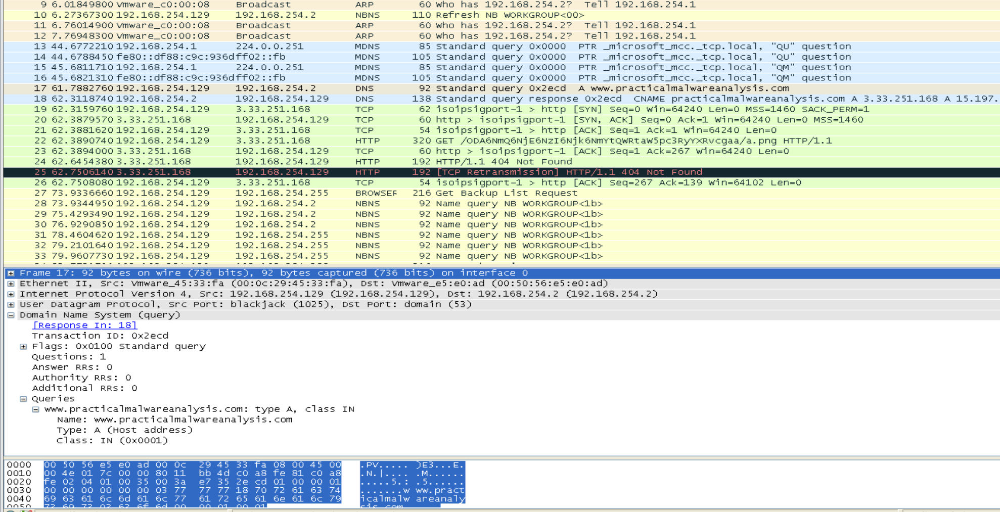

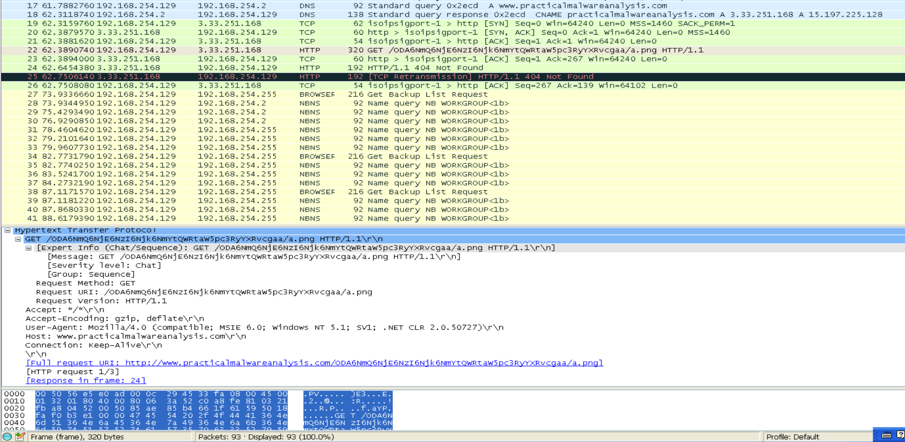

我们观察到样本尝试使用 GET 请求，通过 HTTP 1.1 协议请求某个图片。请求的主域名是彩蛋网址 `practicalmalwareanalysis.com`，并且使用了 Keep-Alive 方法，即一次连接多次请求。

然后我也尝试在不同的虚拟机中运行，这里刚好我之前也配置好了 Win10 的虚拟机。

同样配置好快照，并打开 wireshark：

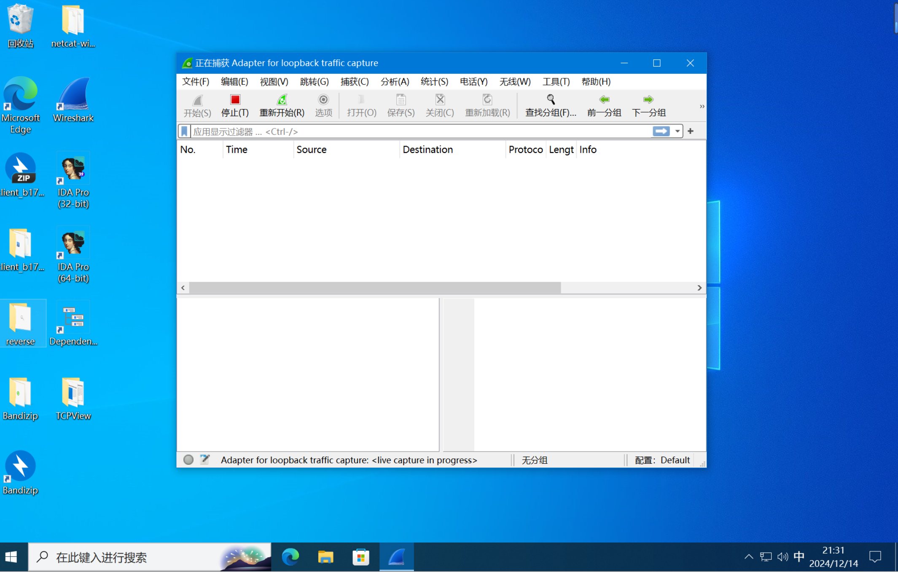

接着双击运行恶意样本，并返回 wireshark 查看结果。这里上面错了，应该是捕获 Ethernet0、而不是本地回环地址……

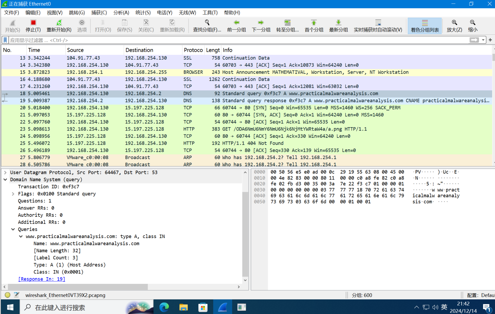

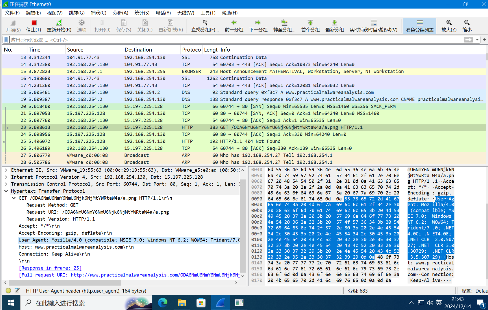

经过仔细比对，我们发现在 Win10 中运行的 UserAgent 字段与 WinXP 中的不同，这表明该字符串不是硬编码的，也不是从多个可选字符串中选择的。最后我们验证了它代表正常的浏览器行为。因此可以推测病毒可能使用了 COM API 的相关接口，来动态获取浏览器的 User Agent。

##### （3）深入分析

我们直接在 IDA 中加载恶意样本，并定位到 Main 函数进行反汇编分析：

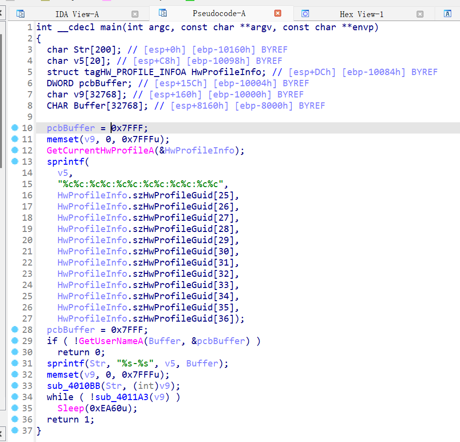

在 Main 函数中，我们观察到以下关键操作：

(a) **硬件配置文件信息获取：** 使用 `GetCurrentHwProfileA` 函数获取当前硬件配置文件信息（`HwProfileInfo`）。

(b) **字符串格式化：** 根据硬件配置文件信息，使用 `sprintf` 函数生成一个字符串（`v5`）。

(c) **用户名获取：** 调用 `GetUserNameA` 函数获取当前用户的用户名（`Buffer`）。

(d) **二次字符串格式化：** 再次使用 `sprintf` 将用户名和之前的字符串合并为一个新字符串（`v4`）。

(e) **数据处理：** 调用 `sub_4010BB` 函数，可能对字符串 `v4` 进行某种处理。

(f) **循环检查与延时：** 进入一个无限循环，不断调用 `sub_4011A3`，直到其返回一个非零值。在每次循环中使用 `Sleep` 函数进行延时。

(g) **结果返回：** 如果 `GetUserNameA` 成功，函数返回 1。如果 `GetUserNameA` 失败，函数返回 0。

在 `main` 函数中调用了两个关键函数：`sub_4010BB` 和 `sub_4011A3`。我们首先查看 `sub_4010BB`：

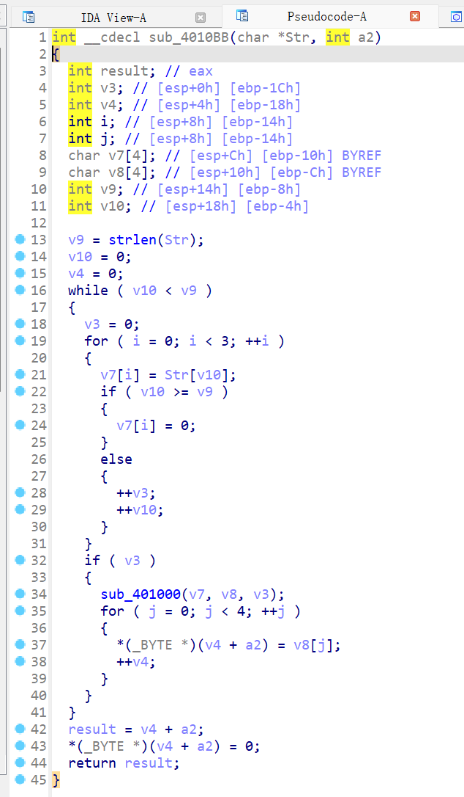

该函数执行以下操作：

(a) **初始化变量：** 函数接收两个参数：一个字符指针 `a1` 和一个整型 `a2`。初始化 `v9` 为 `a1` 的长度。初始化 `v10` 和 `v4` 为 0，用于迭代和索引。

(b) **主循环处理：** 使用 `v10` 遍历 `a1`。在内部循环中，分组处理 `a1` 中的每三个字符（存储在 `v7` 中）。

(c) **字符处理：** 对于 `v7` 中的每个字符组，调用 `sub_401000` 函数进行处理，结果存储在 `v8` 中。处理行为很可能是 Base64 编码！

(d) **更新结果：** 将 `v8` 中的内容复制到 `a2` 指向的位置。更新 `v4` 的值，用于确定下一次复制的位置。

(e) **返回处理：** 在最后的位置放置一个空字符（'\0'），表示字符串的结束。返回处理后字符串的新位置。

由此可知，该函数进行某种形式的数据转换或编码，将输入字符串 `a1` 的内容转换或处理后，存储到由 `a2` 指定的位置。具体的转换逻辑依赖于 `sub_401000` 函数的实现，很可能和 Base64 有关。

接下来，我们查看 `sub_401000`：

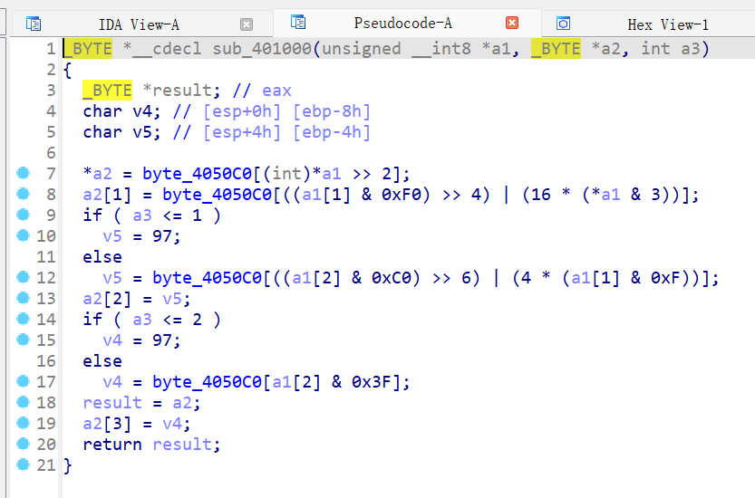

该函数明显处理 Base64 编码，将 3 个字节的数据转换为 4 个编码字符。不足 3 个则用 ASCII 码 97 的“a”填充。这不是标准的 Base64 编码。

查看其中的编码表 `byte_4050C0`：

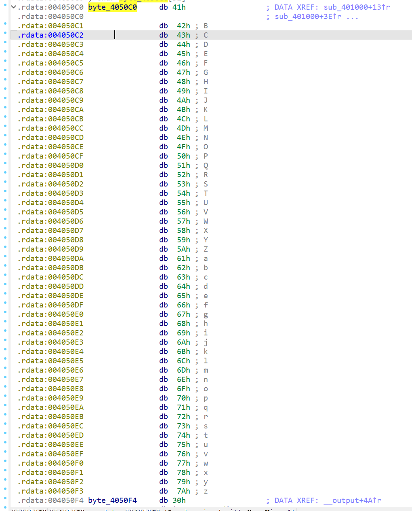

可以看到 IDA 并没有正确识别，我们手动整理好，结果如下：

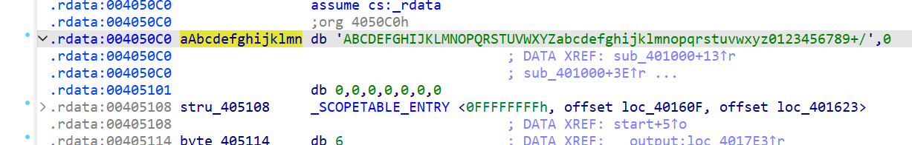

可以看到这个数组是一个明显的 Base64 查看表。不过它不是标准的 Base64 编码。

明确这些功能后，接下来查看 `main` 函数调用的 `sub_4011A3`：

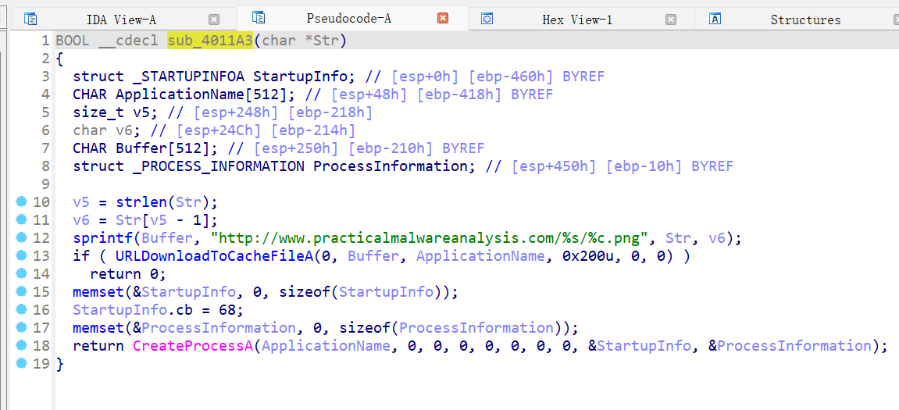

该函数执行以下操作：

(a) **初始化变量和处理字符串：** 其中 `aHttpWww_practi` 就是”<http://www.practicalmalwareanalysis.com>”。经过一系列操作后构建了含有 png 的编码字符串 URL。

(b) **下载操作：** 调用 `URLDownloadToCacheFileA` 函数，尝试下载 `v7` 指向的 URL 内容到 `ApplicationName` 指向的位置。`URLDownloadToCacheFileA` 证明了其使用了 COM 接口函数，下载的内容就是 PNG 资源。如果下载失败，函数返回 0。

(c) **进程创建：** 如果下载成功，初始化 `StartupInfo` 和 `ProcessInformation` 结构体。调用 `CreateProcessA` 创建一个新进程，使用 `ApplicationName` 指向的程序。

至此，我们已经分析得出了大部分的病毒功能。综合来看，这个恶意代码的主要目的是下载并执行其他代码。它通过收集硬件 GUID 和用户名信息，利用非标准的 Base64 编码生成特定的网络信令，这些信令难以通过网络特征被检测。下载的文件名和内容可能因用户和系统环境的不同而变化，增加了恶意行为的隐蔽性。分析者在开发针对此恶意代码的特征时，需要注意到这些动态变化的元素，避免仅关注显而易见的特征，如通常以'a.png'结尾的文件名。

##### （4）网络特征

接下来我们针对 URL 以外的网络特征，将静态的 User-Agent 字段、编码 User-Agent 的静态字符，以及编码 Shell 提示符的长度和字符限制作为检测目标。

我们可以书写以下两种正则表达式模式：

1. **表达式中包含以字符 6 和字符 t 结尾的四字符组的模式。**

	由于恶意代码使用了 Base64 编码，我们关注的是特定模式的网络通信特征，通过正则表达式来实现。我们可以使用如下正则表达式串来将含有静态字符的 URI 第一部分作为目标：

	```css
	/\/[A-Z0-9a-z+\/]{3}6[A-Z0-9a-z+\/]{3}6[A-Z0-9a-z+\/]{3}6[A-Z0-9a-z+\/]{3}6[A-Z0-9a-z+\/]{3}6[A-Z0-9a-z+\/]{3}t([A-Z0-9a-z+\/]{4}){1,}\//
	```

	着眼于识别由’6’和’t’字符结尾的四字符组合，构建相应的正则表达式以匹配这一模式。它可以被简化为如下形式：

	```css
	/\/Ω{3}6Ω{3}6Ω{3}6Ω{3}6Ω{3}6Ω{3}t(Ω{4}){1,}\//
	```

	或者是：

	```css
	/\/ΩΩΩ6ΩΩΩ6ΩΩΩ6ΩΩΩ6ΩΩΩ6ΩΩΩt(ΩΩΩΩ){1,}\//
	```

2. **以至少 25 个字符的 Base64 表达式为目标，文件名是单字符后跟一个.png 的模式。**

	目标是捕捉长度至少为 25 个字符的 Base64 编码字符串，特别是那些以单个字符开头并以“.png”结尾的文件名。

	```css
	/\/[A-Z0-9a-z+\/]{24,}\([A-Z0-9a-z+\/]\)\/\1.png/
	```

	可以将其简化为：

	```css
	/\/Ω{24,}\(Ω\)\/\1.png/
	```

利用这两种正则表达式模式，我们可以创建两个 Snort 规则。第一个规则针对 Base64 编码模式的网络通信，第二个规则关注特定文件名模式的网络请求。

第一个规则：

```css
alert tcp $HOME_NET any -> $EXTERNAL_NET $HTTP_PORTS (msg:"PM14.1.1 Colons and dash"; urilen:>32; content:"GET|20|/"; depth:5; pcre:"/GET\x20\/[A-Z0-9a-z+\/]{3}6[A-Z0-9a-z+\/]{3}6[A-Z0-9a-z+\/]{3}6[A-Z0-9a-z+\/]{3}6[A-Z0-9a-z+\/]{3}6[A-Z0-9a-z+\/]{3}t([A-Z0-9a-z+\/]{4}){1,}\//"; sid:20001411; rev:1;)
```

第二个规则：

```css
alert tcp $HOME_NET any -> $EXTERNAL_NET $HTTP_PORTS (msg:"PM14.1.2 Base64 and png"; urilen:>32; uricontent:".png"; pcre:"/\/[A-Z0-9a-z+\/]{24,}([A-Z0-9a-z+\/])\/\1.png/"; sid:20001412; rev:1;)
```

综上所述，我们可以得出以下结论：

1. **核心功能**：
   
   该恶意软件的主要功能是下载并执行附加代码，这可能包括更多的恶意组件。这种能力使其成为一种有效载体，用于在目标系统上部署进一步的恶意活动或窃取敏感信息。
   
2. **隐蔽性策略**：
   
   恶意软件通过收集系统信息，如硬件 GUID 和用户名，并运用特殊的编码方式（如非标准的 Base64 编码）生成网络请求。这种策略有效地隐藏了其通信模式，使得恶意活动不易被常规网络监控工具发现，从而提高了其隐蔽性。
   
3. **动态特征应对**：
   
   在分析和防御此类恶意软件时，必须考虑到其特征的动态变化。例如，文件名和内容可能会因系统环境和用户而异，这要求防御措施不能仅依赖于那些显而易见的特征，如固定的文件扩展名或容易识别的网络请求模式。相反，应开发更灵活的特征检测方法，以适应这些变化。

这种类型的恶意软件对网络安全构成了严重威胁，因为它不仅能够绕过传统的安全防护措施，还能够根据环境变化调整其行为，使得检测和防御变得更加困难。因此，需要不断地更新和改进安全策略，以应对这些不断演变的威胁。

##### （5）问题解答

> Q1. 恶意代码使用了哪些网络库? 它们的优势是什么?

恶意代码使用了 `URLDownloadToCacheFileA` 这个 Windows 的 COM 接口函数。这样的 COM 接口能保证 HTTP 请求中的大部分内容都来自 Windows 内部，因此无法有效地使用网络特征来进行针对性的检测。


> Q2. 用于构建网络信令的信息源元素是什么，什么样的条件会引起信令的改变?

信息源元素包含主机 GUID 的一部分和与登录用户相关的用户名。GUID 在任何主机操作系统中都是唯一的，信令中使用了 GUID 的 6 个字节，因此也应该是相对唯一的。而用户名则会根据登录系统的用户而变化。所以我们才会看到不同的虚拟机操作系统上的动态分析结果不同。


> Q3. 为什么攻击者可能对嵌入在网络信令中的信息感兴趣?

攻击者可能想跟踪运行下载器的特定主机，以及针对特定的用户。

> Q4. 恶意代码是否使用了标准的 Base64 编码? 如果不是，编码是如何不寻常的?

它没有使用标准的 Base64 编码，因为它在填充时，使用 `a` 代替等号(`=`)作为填充符号。

> Q5. 恶意代码的主要目的是什么?

这个恶意代码下载并运行其他代码。

> Q6. 使用网络特征可能有效探测到恶意代码通信中的什么元素?

恶意代码通信中可以作为检测目标的元素包括域名、冒号以及 Base64 解码后出现的破折号，以及 URI 的 Base64 编码最后一个字符是作为 PNG 文件名单字符的事实。

> Q7. 分析者尝试为这个恶意代码开发一个特征时，可能会犯什么错误?

防御者如果没有意识到操作系统决定着这些元素，则他们可能会尝试将 URI 以外的元素作为目标。多数情况下，Base64 编码字符串以 `a` 结尾，它通常使文件名显示为 `.png`。然而，如果用户名长度是 3 的倍数，那么最后一个字符和文件名都取决于编码用户名的最后一个字符。这种情况下，文件名是不可预测的。

> Q8. 哪些特征集可能检测到这个恶意代码 (以及新的变种)?

推荐的特征集详见分析过程。在恶意代码进行格式化字符串时，中间使用的是冒号(`:`)进行分割，那么这个就可以作为一个特征，但是在使用这个的时候需要注意的是他会进行一个编码，在编码之后会变为 `6`，因为有破折号的使用，所以第 6 个四字符组是以 `t` 结尾。根据以上的分析，可以得到以下的 Snort 规则：

```css
alert tcp $HOME_NET any -> $EXTERNAL_NET $HTTP_PORTS (msg:"PM14.1.1 Colons and dash"; urilen:>32; content:"GET|20|/"; depth:5; pcre:"/GET\x20\/[A-Za-z0-9+\/]{3}6[A-Za-z0-9+\/]{3}6[A-Za-z0-9+\/]{3}6[A-Za-z0-9+\/]{3}6[A-Za-z0-9+\/]{3}6[A-Za-z0-9+\/]{3}t([A-Za-z0-9+\/]{4}){1,}\//"; sid:20001411; rev:1;)
```

这个规则只包含了开头的关于 GET 字符串的内容。还有一个 Snort 规则为：

```css
alert tcp $HOME_NET any -> $EXTERNAL_NET $HTTP_PORTS (msg:"PM14.1.1 Base64 and png"; urilen:>32; uricontent:".png"; pcre:"/\/[A-Za-z0-9+\/]{24,}([A-Za-z0-9+\/])\/\1\.png/"; sid:20001412; rev:1;)
```

#### 2. Lab14-2

**分析恶意代码文件 Lab14-02.exe 中的恶意代码。为了阻止恶意代码破坏你的系统，恶意代码已经被配置向个硬编码的回环地址发送信令，但是你可以假想这是一个硬编码的外部地址。**。

##### （1）初步静态分析

我们首先使用 `DIE` 工具来检查恶意样本是否加壳：

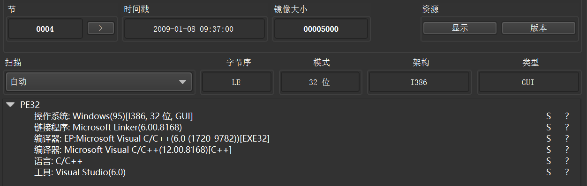

检查结果显示样本未加壳，且开发环境为 Visual Studio 6.0。

接下来，我们查看样本的导入表，发现了一些关键的导入函数：

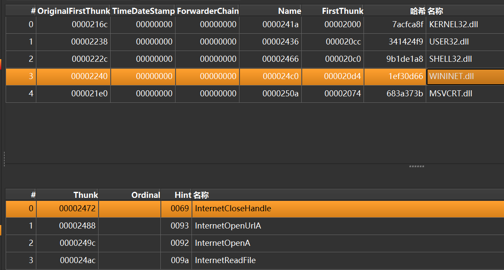

特别地，我们注意到了 `WININET.dll` 中的函数，如 `InternetOpenUrlA` 和 `InternetReadFile`，这些函数与网络操作密切相关，表明样本可能会进行网络文件的读取活动。

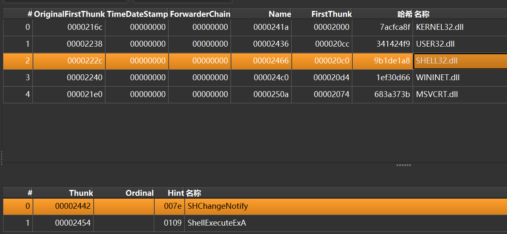

继续分析，样本还导入了 `SHELL32.dll`，包含 `SHChangeNotify` 和 `ShellExecuteExA` 等与 Shell 相关的函数。

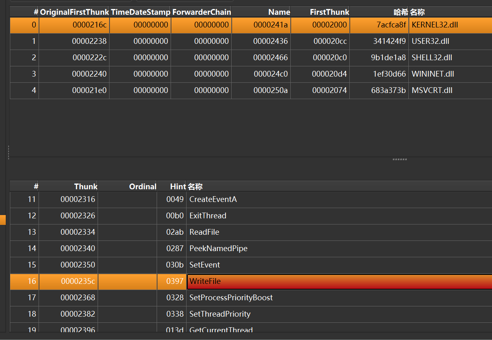

此外，我们还发现了 `WriteFile` 函数，这表明恶意代码可能会创建或写入文件。

在查看样本中的字符串信息时，我们发现了以下内容：

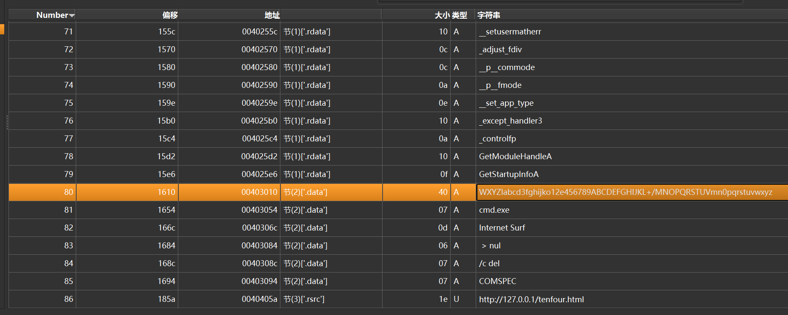

我们发现了一些重要的指示性字符串：

- `WXZYlabcd3fghijko12e456789ABCDEFGHIJKL+/MNOPQRSTUVmn0pqrstuvxyz`：明显的 Base64 编码痕迹。
- `/c del`：可能表示恶意代码在命令行中执行删除操作。
- `Internet Surf`：可能涉及网络冲浪行为。
- `http://127.0.0.1/tenfour.html`：地址中的 `tenfour` 可能是 `14` 的替代拼写，用于躲避检测，表明样本可能在本地回环创建了网页。

结合之前遇到的 Base64 编码分析，我们推测样本可能连接远程主机，使用远程命令操作的恶意 shell。

我们还观察到样本具有资源节，因此查看了资源节信息：

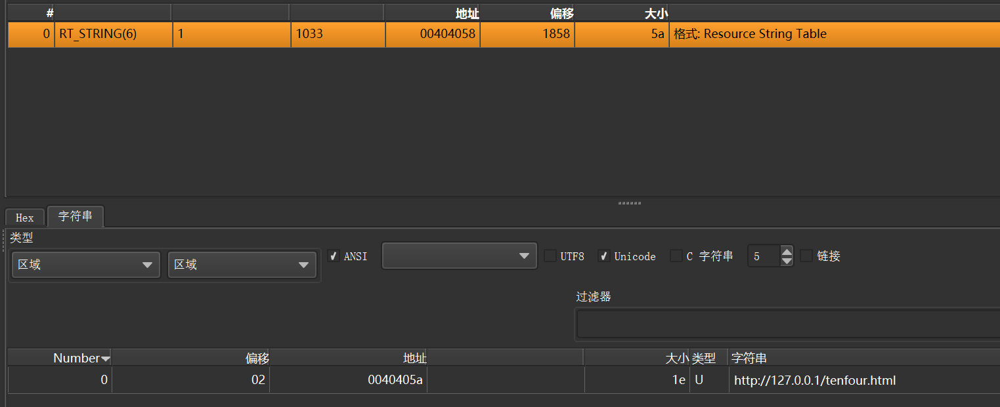

可以看到网络资源的地址 `http://127.0.0.1/tenfour.html`，与前面字符串分析相吻合。

##### （2）综合行为分析

鉴于样本具有网络行为，我们使用 Wireshark 进行抓包分析。

首先保存快照，并启动 Wireshark：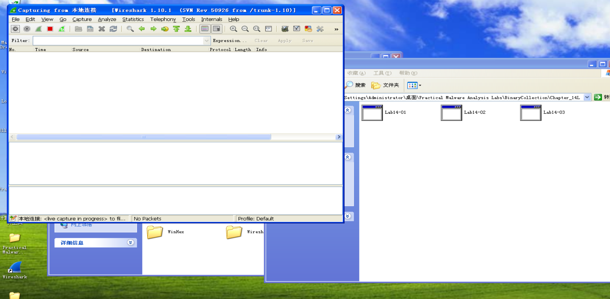

然后运行恶意样本，并返回 Wireshark 查看结果：

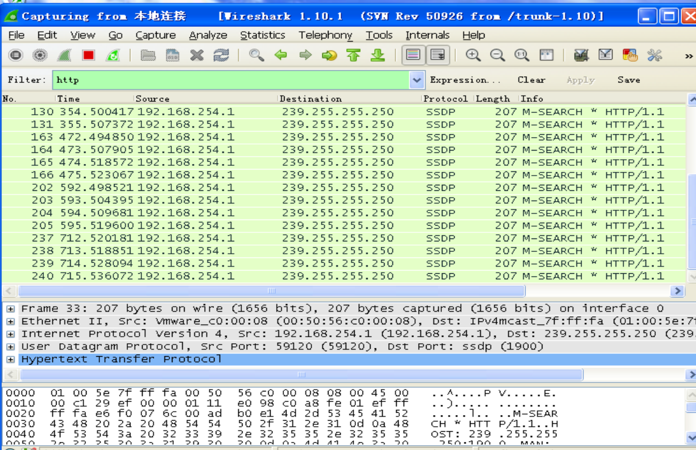

发现没有捕获到任何 HTTP 相关的数据包。

接着，我尝试配置 ApateDNS 为本地回环，并使用 netcat 监听 80 端口：

```assembly
nc -l -p80
```

结果如下所示：

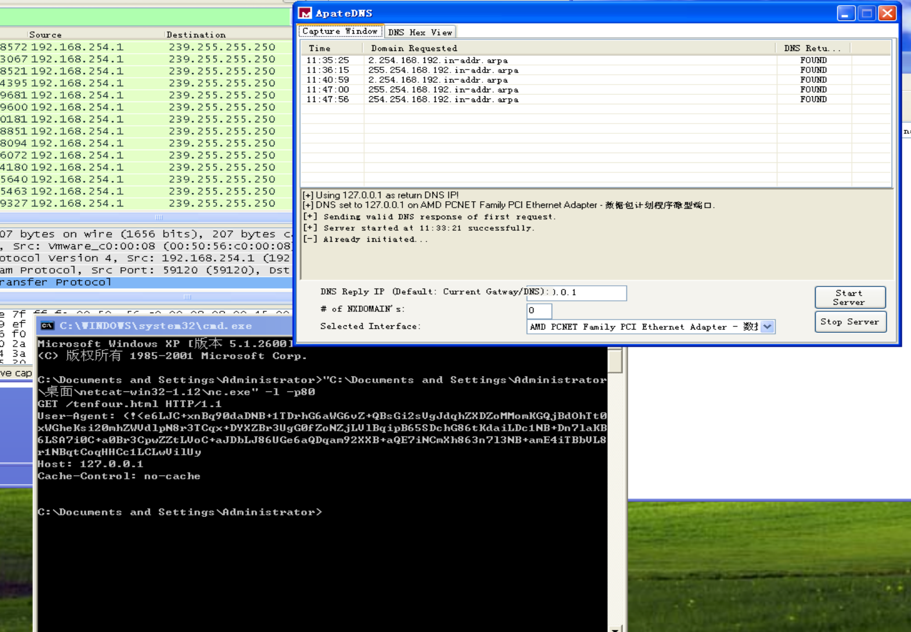

可以看到 ApateDNS 没有有效信息，而 netcat 捕获到了一个数据包。分析显示，病毒试图通过 Base64 加密的 UserAgent 请求 `tenfour` 页面，通过本地回环。

根据书上参考答案所述，我了解到第二个信令出现了失败，需要使用 INetSim 等更为强大的服务器工具。

我也使用 ProcessMonitor 监听，然后查看进程树，结果如下：

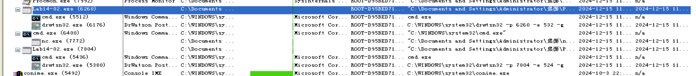

可以看到恶意程序确实创建了两个进程：`cmd.exe` 和 `drwtsn32.exe`，符合书上所述。

接着我设置如下过滤器：

```css
Process Name is Lab14-02.exe
```

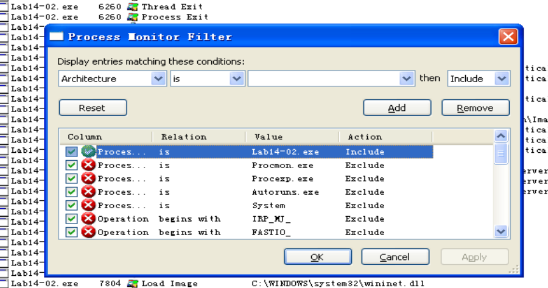

并查看网络总结信息：

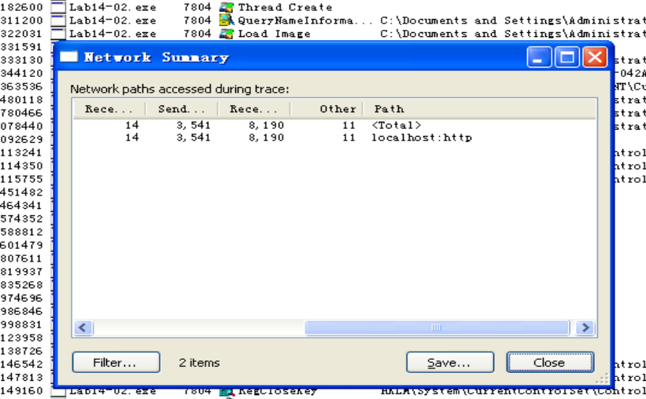

可以发现网络相关的信息包括 Total 和 localhost：http 两个路径。

我们查看 localhost：http 的信息：

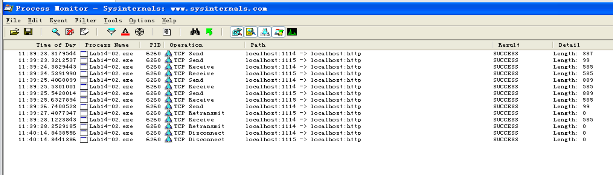

可以看到恶意样本进行了 TCP 相关的操作，路径包括 `localhost:1114 -> localhost:http` 和 `localhost:1115 -> localhost:http`。

因此，这个特殊的恶意代码使用了两个线程，它们都发出一个 HTTP 请求到同一个服务器。如果其中一个线程没有获得响应，整个进程将退出。

这是理论上的第二个信令：

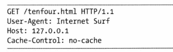

在多次动态实验后也没有发现内容产生变化。但我用 Win10 尝试后就不一样了。证明更改主机或者用户将会改变最初编码信令的内容。这或许是在说明：即用于编码信令的信息来源依赖于特定主机的信息。

##### （3）深入分析

接下来打开 IDA 对其进行分析。IDA 载入后，我们发现了许多重要的函数和控制流，下面将依次进行分析：

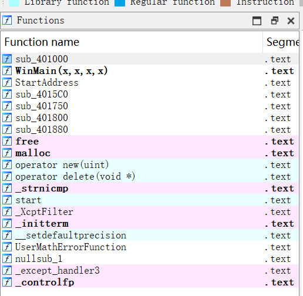

首先查看主函数 WinMain：

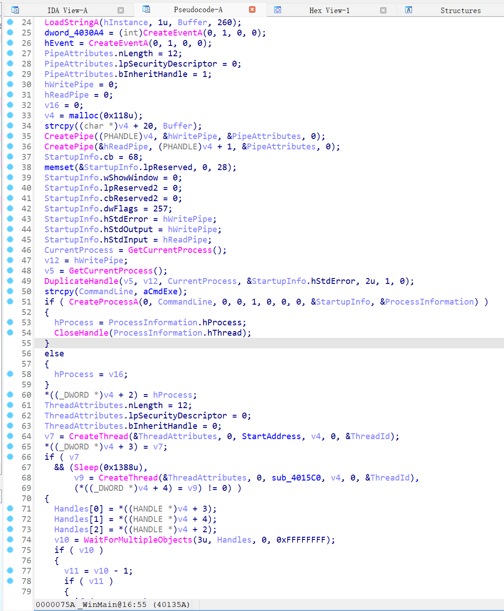

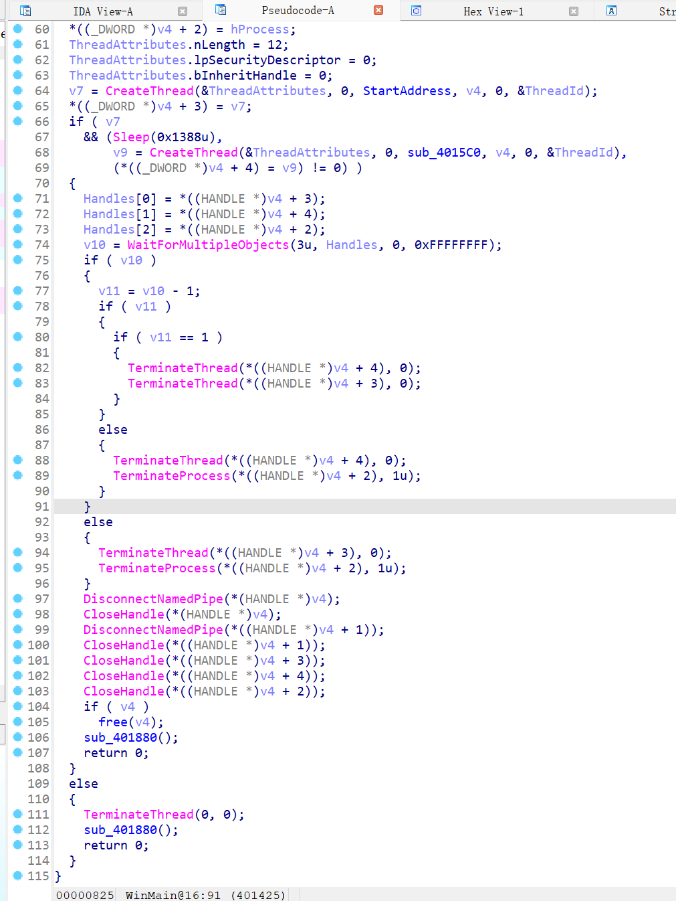

在 WinMain 函数中，我们观察到以下关键操作：

a) **初始化和资源配置：** 函数开始时加载字符串资源，创建事件对象，并设置管道的安全属性。分配内存用于存储管道句柄并创建两个管道。

b) **创建和配置子进程：** 初始化 `StartupInfo` 结构体并配置标准输入输出流指向管道。通过 `CreateProcessA` 创建子进程（`cmd.exe`）并获取其句柄。

c) **线程创建和管理：** 创建两个线程，每个线程都执行特定的函数。如果任一线程创建失败，则终止线程并执行清理操作。一个用于读取管道数据并发送网络请求的 `StartAddress`，另一个用于接收网络请求并写入管道的 `sub_4015C0`。

d) **线程和进程监控：** 使用 `WaitForMultipleObjects` 监控线程和进程的状态。根据监控结果，终止线程和进程。

e) **资源清理：** 断开并关闭管道，释放内存，关闭线程和进程句柄。调用 `sub_401880` 来执行自删除操作。

总体而言，该函数创建并管理子进程和线程，以执行未明确指定的任务。它通过管道与子进程通信，并监控相关线程的状态，确保按预定逻辑运行。这种行为模式可能用于执行恶意活动，如通过子进程和线程运行不受控的代码，同时保持对这些活动的监控和控制。特别是使用 cmd.exe 作为子进程，可能意味着代码执行了某些命令行操作，这在恶意软件中较为常见。结合之前的“/c del”也可以分析发现这一点。

接着查看 StartAddress 函数：

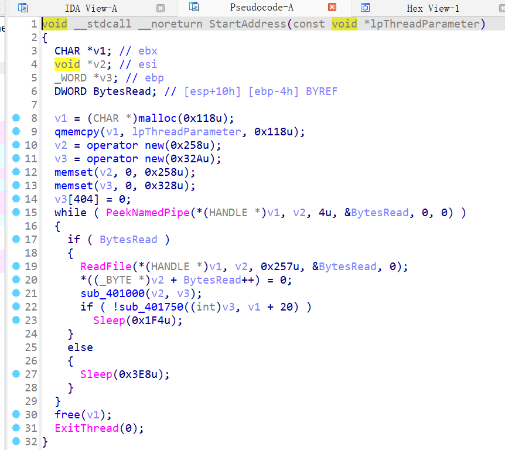

该函数的主要目的似乎是从一个管道中读取数据，并对这些数据进行处理和分析。具体操作如下：

a) **内存分配与初始化：** 函数开始时分配两块内存区域，并将 `lpThreadParameter` 的内容复制到第一块内存。对两块新分配的内存执行清零操作。

b) **管道通信处理：** 通过 `PeekNamedPipe` 检查管道中是否有可读数据。如果有数据可读，使用 `ReadFile` 从管道读取数据到内存中。

c) **数据处理和分析：** 读取的数据经过 `sub_401000` 函数处理后存储在第二块内存中。调用 `sub_401750` 函数对处理后的数据进行进一步分析或操作。根据 `sub_401750` 函数的返回值，决定是否休眠。

d) **线程终止：** 如果管道中没有更多数据可读，释放分配的内存并退出线程。

此类行为可能用于处理从外部或其他恶意组件接收的数据。例如，它可能用于解析命令和控制消息或执行数据窃取操作。这种行为在网络攻击和恶意软件中很常见，尤其是在需要远程控制或数据窃取的场景中。

然后查看 sub_4015C0 函数：

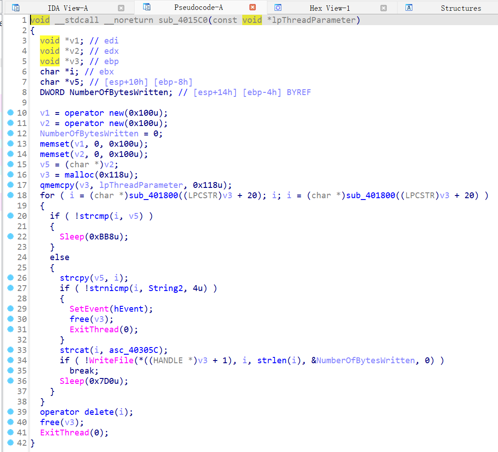

此函数的主要目的是从指定的 URL 定期下载数据，并将其写入文件。具体分析如下：

a) **内存分配与初始化：** 分配两块内存区域 `v1` 和 `v2`，并将它们清零。将 `lpThreadParameter` 指向的数据复制到新分配的内存 `v3`。

b) **循环处理网络数据：** 使 `sub_401800`(`LPCSTR` v3 + 20)。

c) **特定字符串的检查：** 如果下载的数据以特定字符串开始，触发事件并退出线程。

d) **写入文件并休眠：** 将下载的数据追加到一个字符串后，写入到文件。休眠一定时间后继续循环。

e) **资源释放与线程终止：** 如果写入文件失败或循环结束，则释放分配的资源并退出线程。 

该函数常用于维持与控制服务器的通信或执行基于网络的指令。写入操作可能用于记录信息或准备后 续操作所需的数据。

继续查看 sub_401880 函数：

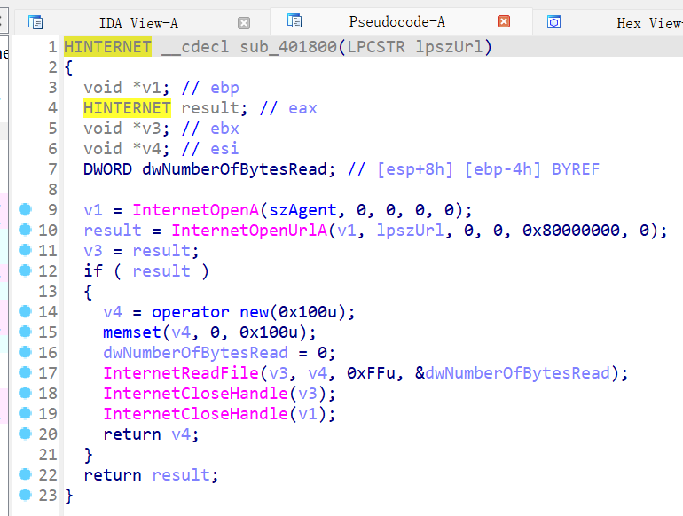

此函数的主要作用是动态构建并执行一个命令，具体操作如下： 

a) **获取文件路径并构建命令：** 函数首先获取当前模块的文件名，并转换为短路径格式。读取特定的环境变量内容，并构建包含文件路径的命令字符串。

b) **设置执行信息：** 初始化 `SHELLEXECUTEINFOA` 结构体，设置执行参数，包括文件和参数路径。设定执行动作为“打开”。

c) **调整进程和线程优先级：** 提升当前进程和线程的优先级。

d) **执行命令并调整优先级：** 使用 `ShellExecuteExA` 执行构建的命令。如果执行成功，对启动的进程进行优先级和性能调整。

该函数可能用于启动额外的进程或脚本，以执行更复杂的任务，如下载更多恶意内容或执行系统命令 。特别是 ShellExecuteExA 的使用指出该函数可能用于执行外部程序或脚本，这是恶意软件常用的技术之一。

之后查看 sub_401000 函数：

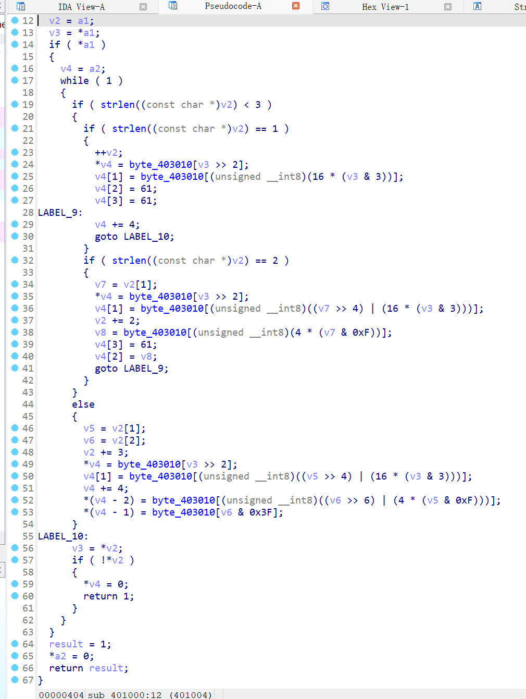

该函数显然是一个自定义的 Base64 编码实现。具体分析如下： 

a) **Base64 编码过程：** 函数接收一个指向数据的指针 `a1` 和一个结果存储位置 `a2`。检查输入数据，对其进行 Base64 编码转换。

b) **处理不同长度的数据：** 根据输入数据的长度，分别处理长度为 1、2 和 3 以上的情况。使用 `byte_403010` 查找表来获取相应的 Base64 字符。

c) **填充和终止处理：** 对于长度不足 3 的数据，使用‘=’字符进行填充。循环处理直到输入数据结束。

它对输入的数据进行 Base64 编码，并将编 码后的结果存储在指定位置。从这里的填充字符也可以看到属于非标准的 Base64 编码。

我们查看其使用的编码表 byte_403010：

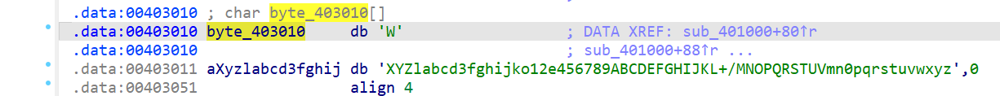

可以看到 IDA 没有正确识别，但是可以辨认为 `WXYZlabcd3fghijko12e456789ABCDEFGHIJKL+/MNOPQRSTUVmn0pqrstuvwxyz`。这并不是标准的 base64 编码表，也和我们之前基本静态分析中看到的字符串相符。

接着我们继续查看 sub_401750 函数：

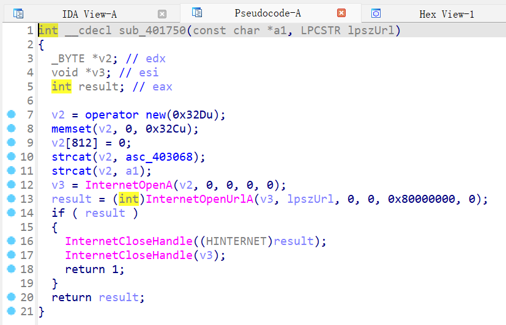

此函数的目的是通过互联网打开指定的 URL。具体分析如下：

a) **内存分配与字符串构建：** 函数开始时分配内存，并初始化为零。构建字符串，包括一个固定的部分（`asc_403068`）和 `a1` 参数指向的数据。

b) **网络连接初始化：** 使用 `InternetOpenA` 函数打开一个互联网会话，使用先前构建的字符串作为用户代理。

c) **打开 URL 并处理：** 调用 `InternetOpenUrlA` 打开指定的 URL (`lpszUrl`)。如果成功打开 URL，关闭相关的互联网句柄。

该函数用于联系远程服务器以获取指令、上传数据或下载额外的恶意代码。同时能注意到它滥用 HTT P 的 User-Agent 字段，用于传递数据。

最后我们查看 sub_401800 函数：

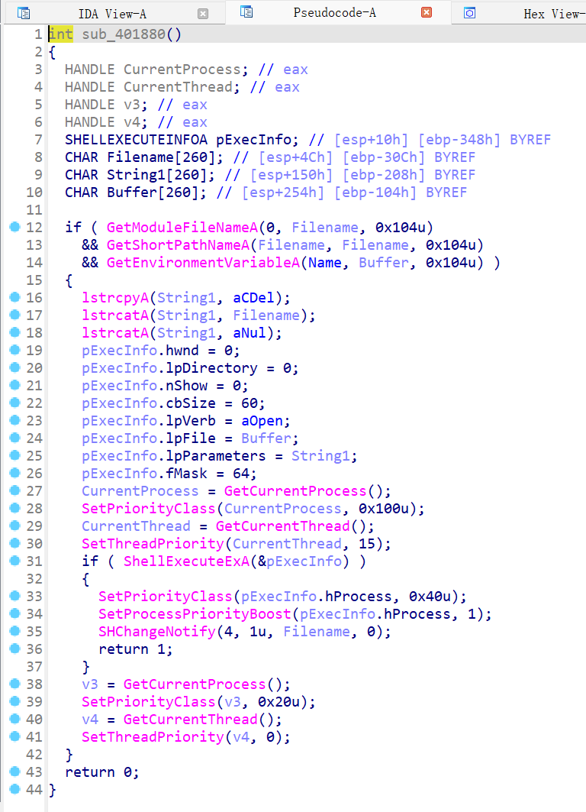

此函数的目的是从指定的 URL 下载数据。具体分析如下：

a) **网络会话初始化：** 使用 `InternetOpenA` 函数初始化互联网会话，使用预定义的用户代理 `szAgent`。

b) **打开指定 URL：** 调用 `InternetOpenUrlA` 打开参数 `lpszUrl` 指定的 URL。

c) **读取网络数据：** 如果成功打开 URL，分配内存并清零。使用 `InternetReadFile` 从打开的 URL 中读取数据。

d) **清理资源并返回数据：** 关闭所有打开的互联网句柄。返回读取的数据指针。

它通过建立互联网会话和打开特定的 URL 实现这一点。读取的数据被存储在新分配的内存区域中。

经过深入分析，我们可以得出以下结论：

1. **后门程序设计：**
   - 恶意代码是一个精心设计的后门程序，其核心功能是通过创建管道与 `cmd.exe` 子进程进行双向通信，从而允许远程攻击者执行命令并接收输出。

2. **关键线程和通信：**
   - 在 `WinMain` 函数中，程序设置了管道，创建了 `StartAddress` 和 `sub_4015C0` 两个关键线程以实现数据传输和命令执行。这两个线程的设置显示了恶意代码在数据传输和命令执行方面的复杂性。

3. **编码和网络通信：**
   - `StartAddress` 线程负责从管道读取数据（即 `cmd.exe` 的输出），然后使用自定义的 Base64 编码（实现于 `sub_401000` 函数）对数据进行编码，最后通过 `sub_401750` 函数发送到一个预设的 URL。
   - `sub_4015C0` 线程从 URL 接收未编码的命令，然后将其写入管道以供 `cmd.exe` 执行。

4. **WinINet 库和 User-Agent：**
   - 恶意代码使用 WinINet 库进行网络通信，利用硬编码的 User-Agent 字段，这可能成为检测的一个点。由于操作系统处理 cookies 和缓存，这使得网络通信更加隐蔽，但也留下了可能被检测的痕迹。

5. **编码方案和自删除功能：**
   - 基于自定义 Base64 的编码方案难以用标准工具解码，但传入命令未编码，可能被网络防御系统检测。
   - 包含自删除功能（`sub_401880`），表明一次性使用设计，以减少被发现的风险。

总体来看，这个恶意代码展示了高度的隐蔽性和灵活性，使其成为一个危险且难以检测的网络威胁。其主要功能是通过创建管道与 `cmd.exe` 的子进程通信，从而允许远程攻击者执行命令并接收输出。在 `WinMain` 函数中，程序首先设置了管道来与 `cmd.exe` 的子进程进行双向通信。接着，它创建了两个关键线程：`StartAddress` 和 `sub_4015C0`。`StartAddress` 负责从管道读取数据（即 `cmd.exe` 的输出），然后使用自定义的 Base64 编码（实现于 `sub_401000` 函数）对数据进行编码，最后通过 `sub_401750` 函数发送到一个硬编码的 URL，这个 URL 存储在 PE 文件的字符串资源节中，提供了攻击者在不重新编译恶意代码的情况下改变命令与控制服务器的能力。而 `sub_4015C0` 负责从同一个 URL 接收命令，这些命令未经编码，然后将其写入管道以供 `cmd.exe` 执行。

值得注意的是，该恶意代码使用了 WinINet 库进行网络通信，这意味着一些元素如 cookies 和缓存由操作系统处理，但也意味着它必须使用硬编码的 User-Agent 字段，这可能成为检测的一个点。此外，恶意代码的编码方案虽然基于 Base64，但使用了自定义字母表，这使得标准 Base64 解码工具无法解码其通信内容。程序设计上的一个缺点是，虽然它对传出信息（即从受害者机器发出的数据）进行了编码，但传入的命令（即从控制服务器接收的指令）并未进行编码，这可能使得网络防御系统能够检测到异常流量。最后，程序包含自删除功能，通过 `sub_401880` 实现，这表明该恶意代码可能被设计为一次性使用，以减少被发现的风险。

##### （4）问题解答

> Q1. 恶意代码编写时直接使用 IP 地址的好处和坏处各是什么?

- **好处：** 使用静态 IP 地址可以让攻击者更容易地管理其系统，因为它允许攻击者通过简单地更改 DNS 记录来动态地重定向僵尸主机。此外，对于防御者来说，针对特定 IP 的防御措施可能比处理大量变化的域名更为简单有效。
- **坏处：** 然而，这也使得基于 IP 的攻击更难被追踪或阻止，因为固定的 IP 地址不易改变，从而增加了被识别的可能性。相比之下，如果采用动态分配的 IP 或者频繁更换 IP 的方式，则可以在一定程度上提高隐蔽性。

> Q2. 这个恶意代码使用哪些网络库? 使用这些库的好处和坏处是什么?

- **使用的库：** WinINet
- **优点：** WinINet 提供了对 HTTP 协议的良好支持，并且能够自动处理一些复杂的细节（如 cookies 和缓存），这对于开发者来说简化了开发过程。
- **缺点：** 但是，它要求开发者必须提供一个硬编码的 User-Agent 字段以及其他可选头部信息，这可能导致安全性降低；同时，相较于更底层的 Winsock API，WinINet 在某些高级功能上的支持可能不够灵活。

> Q3. 恶意代码信令中 URL 的信息源是什么? 这个信息源提供了哪些优势?

- **信息源：** PE 文件中的字符串资源节包含了用于命令与控制(C&C)通信的 URL。
- **优势：** 通过这种方式，攻击者可以在不重新编译整个程序的情况下快速调整目标服务器的位置，从而增强了灵活性并减少了被发现的风险。


> Q4. 恶意代码利用了 HTTP 协议的哪个方面，来完成它的目的?

攻击者滥用了 HTTP 请求中的 User-Agent 字段来传递信息。他们创建了一个专门用于发送信息的线程以及另一个负责接收响应的线程。


> Q5. 在恶意代码的初始信令中传输的是哪种信息?

初始阶段发送的是经过编码后的 shell 命令提示符。

> Q6. 这个恶意代码通信信道的设计存在什么缺点?

 虽然对传出数据进行了加密处理，但却没有对传入指令采取同样的保护措施。另外，由于依赖于特定的 User-Agent 值来区分不同的通信端点，这种模式很容易被检测到并成为攻击特征分析的目标。

> Q7. 恶意代码的编码方案是标准的吗?

采用的是 Base64 编码，不过使用了自定义字符集进行替换以增加混淆度。

> Q8. 通信是如何被终止的?

当收到关键字 "exit" 时，恶意软件将会尝试自我删除以销毁证据。

> Q9. 这个恶意代码的目的是什么? 在攻击者的工具中，它可能会起到什么作用?

此段代码旨在为远程攻击者提供一个小型且难以察觉的后门入口，使他们能够执行任意 shell 命令而无需担心常规的安全检查手段。考虑到其自毁特性，这表明该工具可能是一次性使用的组件之一，在完成特定任务后即被移除，以此减少留下痕迹的可能性。

#### 3. Lab14-3

**这个实验建立在 Lab14-1 之上。想象一下，攻击者尝试使用这个恶意代码来提高他的技术。分析文件 Lab14-03.exe 中找到的恶意代码。**。

##### （1）初步静态分析

我们首先运用 `DIE` 工具来检查样本是否加壳：

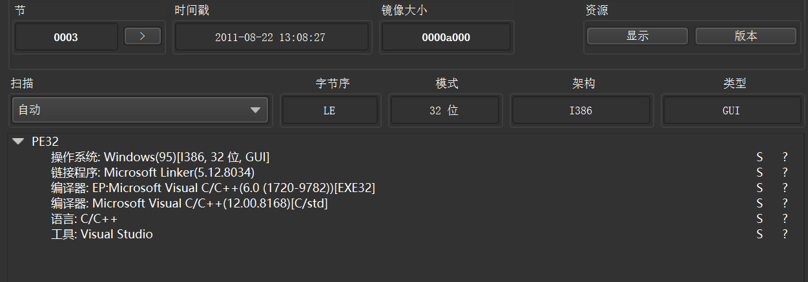

检查结果显示该样本未加壳，且开发环境为 Visual Studio。

接下来，我们查看样本的导入表，发现了一些关键的导入函数：

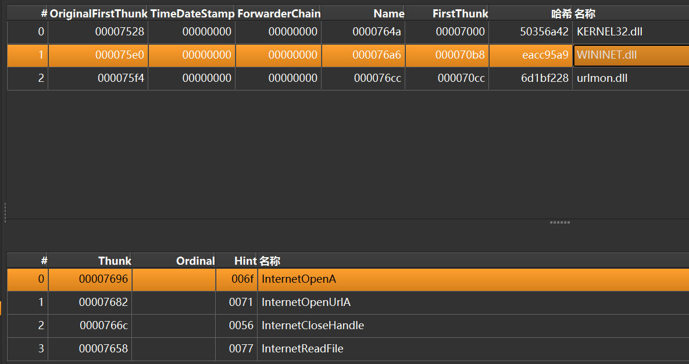

样本导入了 `WININET.dll`，其中包括一系列以 `Internet` 开头的函数，如 `InternetOpenUrlA`、`InternetReadFile` 等，这些函数通常用于打开网络 URL 和读取网络文件。

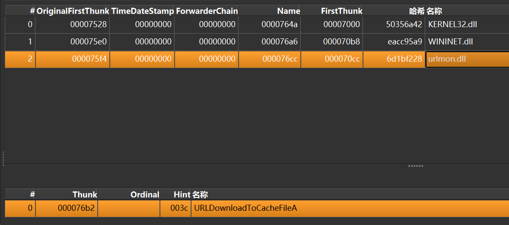

样本还导入了 `urlmon.dll`，其中包括 `URLDownloadToCacheFileA` 函数，该函数用于将文件下载到本地缓存。

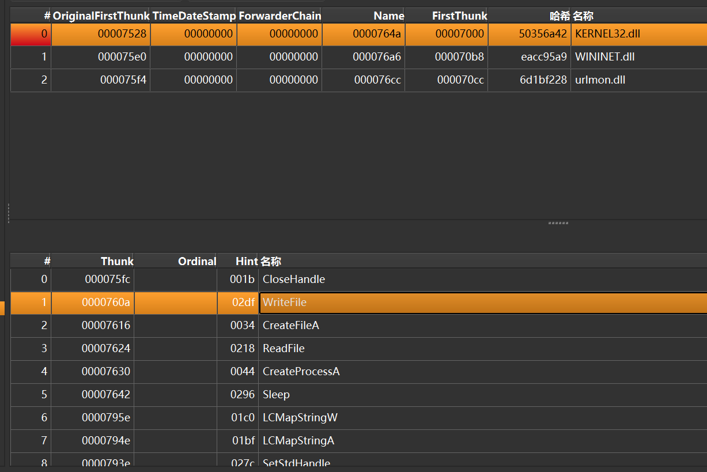

此外，我们还发现了 `WriteFile` 函数，这表明恶意代码可能会创建或写入文件。

在查看样本中的字符串信息时，我们发现了以下内容：

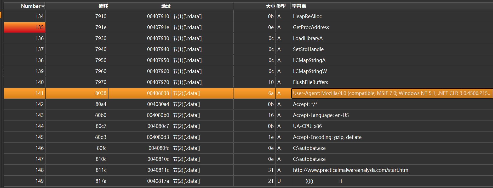

我们发现了一些重要的字符串：

- `User-Agent: Mozilla/4.0 (compatible; MSIE 7.0; Windows NT 5.1; .NET CLR 3.0.4506.2152; .NET CLR 3.5.30729)`：这是 HTTP 请求头部的 UserAgent 字段，表明样本可能模拟浏览器请求。
- `Accept` 包括 `Language` 为 `en-US`，即美国英文。`CPU` 定位为 `x86` 架构。
- `autobat.exe`：可能指的是自动化的批处理任务。
- `http://www.practicalmalwareanalysis.com/start.htm`：彩蛋网址下的某个特定页面。

我们还发现了与 Base64 编码相似的字符串：

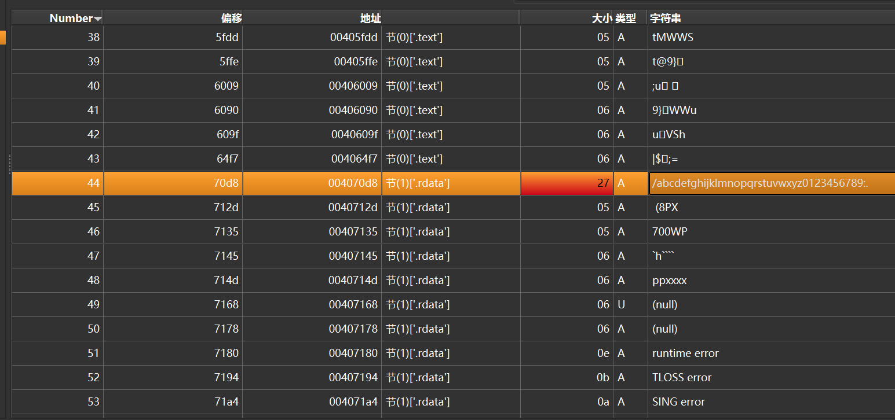

字符串“/abcdefghijklmnopqrstuvwxyz0123456789:.”与 Base64 编码相似，表明样本可能使用了 Base64 加密。

##### （2）综合行为分析

鉴于样本具有网络行为，我们使用 Wireshark 进行抓包分析。

首先保存快照，并启动 Wireshark：

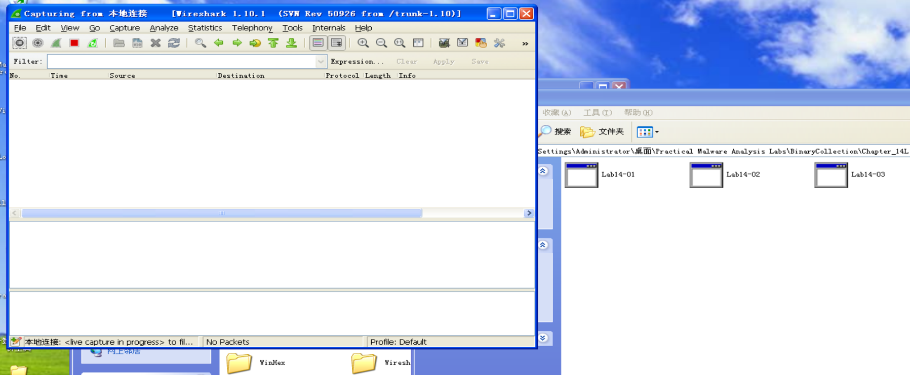

然后运行恶意样本，并返回 Wireshark 查看结果：

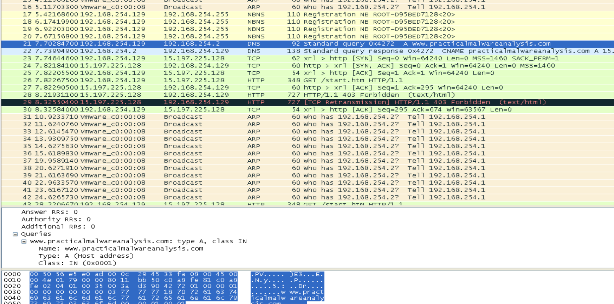

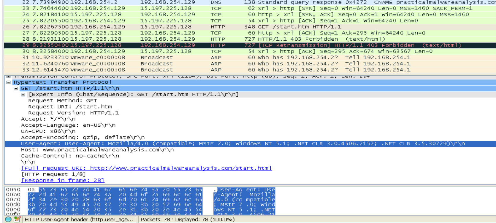

在 Wireshark 中，我们捕获到了样本的 GET 请求，请求的主域名是彩蛋网址 `practicalmalwareanalysis.com`。值得注意的是，对于 `User-Agent` 字段的重复，这可能是由于恶意代码编写者忽略了 `InternetOpenA` 会包含头部的标题。因此，这个特征可以作为一个有效的检测点。

##### （3）深入分析

接下来，我们将通过结合 IDA 进行更加深入的分析。我们将重点分析几个关键函数，并通过解析它们的作用来帮助我们更清晰地理解恶意代码的行为和特征。通过这些分析，我们能够揭示恶意代码的运行机制以及其潜在的危害。

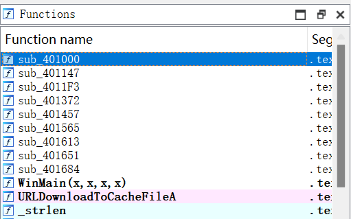

首先，查看 `sub_401000` 函数的反汇编代码，具体内容如下：

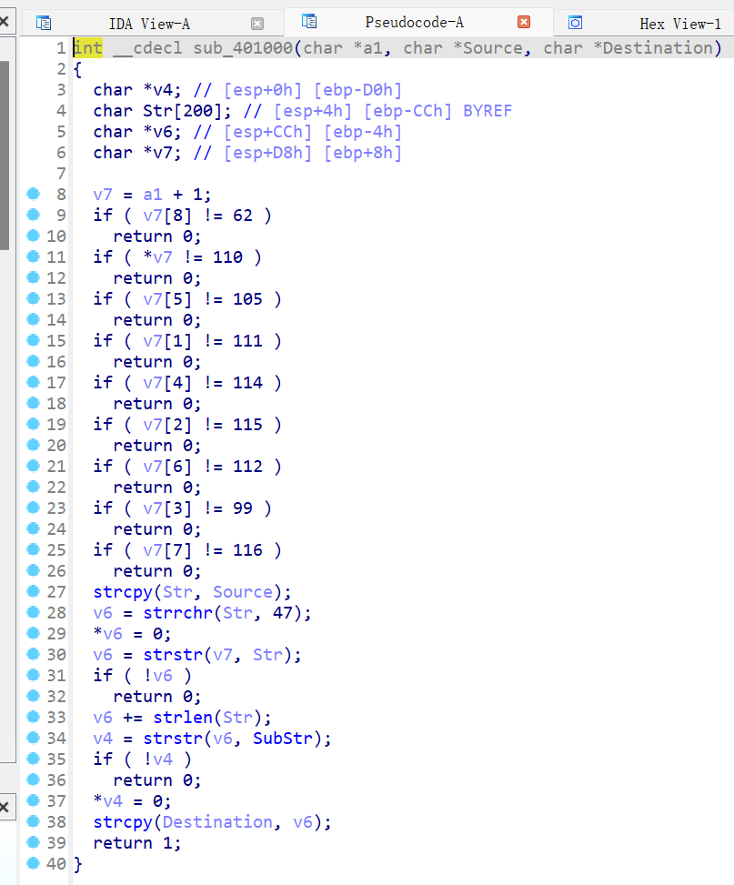

该函数的主要操作较为简单，但其功能却十分关键，具体可以分为以下几个步骤：

- **字符串检查与处理：**
  - 函数首先检查传入的 `a1` 指针后所指向的字符串是否符合特定的字符模式。在本函数的上下文中，实际上是在检查标签中的命令。
  - 检查过程包括固定位置的字符比较以及顺序的确认，旨在确保字符串符合预期格式。
- **路径和关键字搜索：**
  - 函数将 `a2` 中的字符串复制到局部变量，并在其中搜索特定字符（如 `'/'`）。这种操作表明该函数在构造特定的 URL 路径。
  - 当找到 `'/'` 的位置时，它会截断字符串，并利用 `a1` 中的字符串执行进一步的搜索。这一过程表明，它是在构造用于远程通信的 URL。
- **提取与复制字符串：**
  - 如果在构造 URL 时找到匹配项，函数会搜索一个名为 `a96` 的关键字，并在其出现位置处截断字符串。
  - 最后，将截断后的字符串复制到 `a3` 中。这一部分的作用是提取并恢复被隐藏或混淆的命令参数。

通过这些操作，`sub_401000` 函数能够从复杂的字符串或数据结构中提取有效命令，或者从被混淆的数据中恢复关键信息，进而构建一个特定的 URL。显然，这一机制可能用于恶意软件的命令获取和配置恢复。

接下来，我们查看 `sub_401147` 函数：

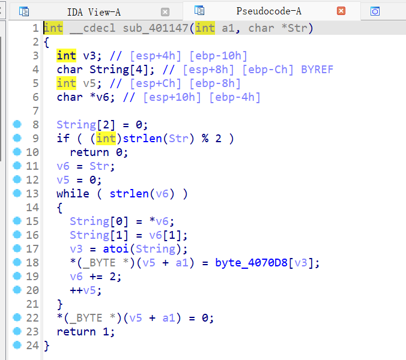

该函数的核心功能包括：

- **字符串长度检查：**

  函数首先检查 `a2` 指向的字符串长度是否为偶数。如果不是偶数，函数会立即返回 0。这是为了确保待处理字符串的格式符合预期。

- **字符串处理与转换：**

  如果字符串长度为偶数，函数会遍历该字符串，每次处理两个字符。每对字符会被转换为一个整数，这个整数通过调用 `atoi` 函数得到。

- **查找表转换：**

  - 函数使用转换得到的整数作为索引，从 `byte_4070D8` 查找表中获取相应的值。该查找表实际上是一个 Base64 编码表。通过查找表的映射关系，函数将编码后的值恢复为原始数据。

  - 将解码后的结果复制到 `a1` 指向的内存位置。

通过这些操作，`sub_401147` 函数实现了 Base64 编码的解码过程。这表明，恶意代码在传输过程中可能通过 Base64 编码隐藏了真实的数据或命令，`sub_401147` 函数的作用是将这些混淆的命令恢复成可执行的内容。

继续分析 `sub_4011F3` 函数：

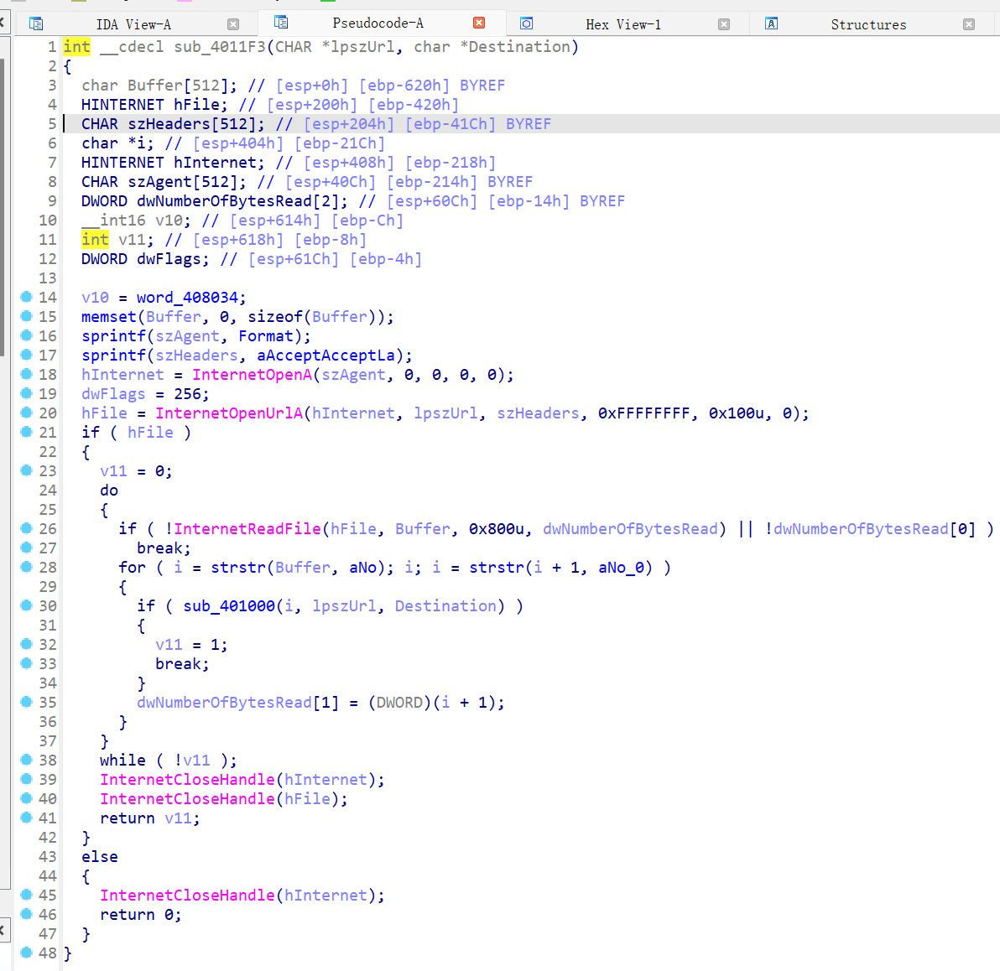

该函数的核心功能可以分为以下几部分：

- **网络连接初始化：**

  - 函数首先调用 `InternetOpenA` 来初始化一个互联网会话，并设置用户代理和头部信息。通过分析静态数据，发现用户代理字段包含了 `"Mozilla"` 和 `"Accept: AcceptLanguage"` 等信息。这些字段通常用于伪装成正常的网络请求，但在恶意软件中，这些字段可能被滥用来掩盖其恶意性质。

  - 接着，函数使用 `InternetOpenUrlA` 打开一个指定的 URL。这表明恶意代码将会从指定的远程服务器下载数据。

- **读取网络数据：**

  函数使用 `InternetReadFile` 从已打开的 URL 中读取数据。

- **数据处理与分析：**

  - 在读取的数据中，函数会搜索特定的字符串，实际上是在寻找 HTML 页面中的 `<script>` 标签。它试图从网页的 HTML 内容中提取命令或配置数据。

  - 对于每个找到的匹配项，函数会调用 `sub_401000` 函数进行进一步的处理。这意味着该函数的作用是从网页中提取嵌入的恶意命令或配置，继而通过 `sub_401000` 恢复这些命令。

- **资源清理与返回：**

  在完成数据处理后，函数会关闭所有打开的互联网句柄，并根据处理结果返回 1 或 0。

`sub_4011F3` 函数的目的是从远程服务器下载指定内容并分析其中的命令或配置信息。它通过从远程服务器提取的指令控制恶意软件的行为，实现动态更新和远程控制。

接着，我们分析 `sub_401372` 函数：

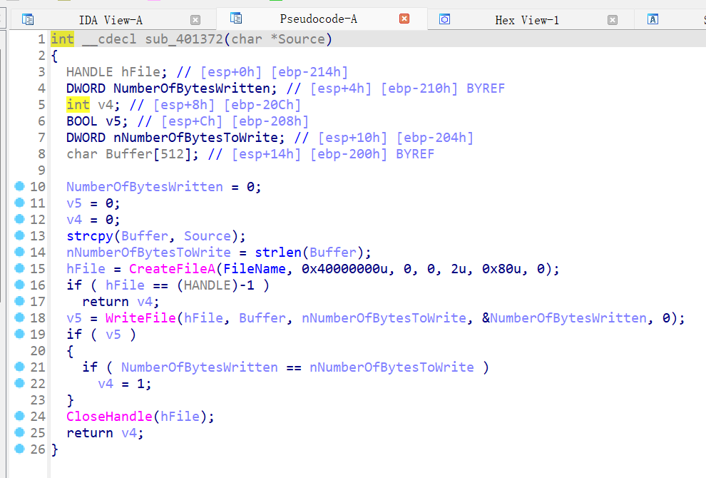

该函数主要执行以下操作：

- **文件写入准备：**

  - 函数会将 `a1` 指向的字符串复制到局部变量 `Buffer` 中，并计算字符串的长度。

  - 随后，使用 `CreateFileA` 打开或创建名为 `C:\autobat.exe` 的文件。如果文件成功打开，它将准备将数据写入该文件。

- **写入操作：**

  如果文件成功创建或打开，函数会使用 `WriteFile` 将 `Buffer` 中的数据写入到 `C:\autobat.exe` 中。

`sub_401372` 函数的主要作用是将字符串数据写入到 `C:\autobat.exe` 文件中。这可能是恶意软件的一部分，用来将网络上下载的恶意文件存储到本地，并为后续执行做好准备。

我们再来看 `sub_401457` 函数：

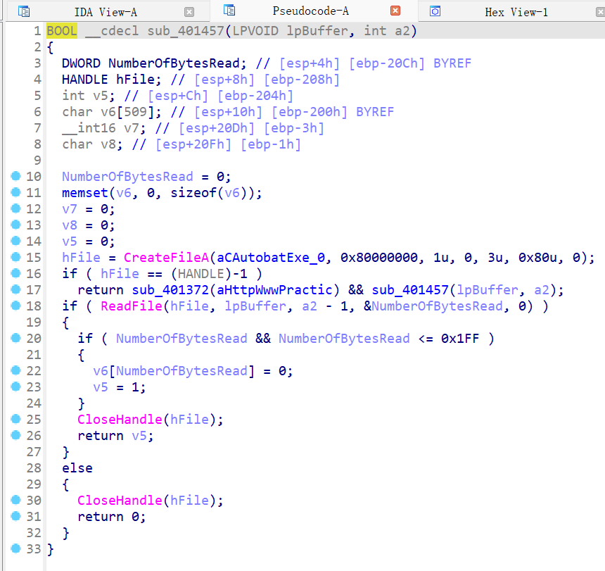

此函数的功能如下：

- **文件读取准备：**

  函数使用 `CreateFileA` 打开 `C:\autobat.exe` 文件。

- **文件读取操作：**

  - 如果文件成功打开，函数会使用 `ReadFile` 从文件中读取数据到 `lpBuffer` 缓冲区。

  - 函数会检查读取的字节数，确保它们符合预期。

- **错误处理与递归调用：**

  如果文件打开失败，函数会尝试通过调用 `sub_401372` 来重新下载文件，并递归地重新尝试读取。

`sub_401457` 的目的是从本地文件 `C:\autobat.exe` 中读取数据。如果文件无法读取，它会通过重试机制重新从网络获取文件。这种行为显示了恶意软件的自恢复能力，能够确保恶意文件始终处于有效状态。

接下来是 `sub_401565` 函数：

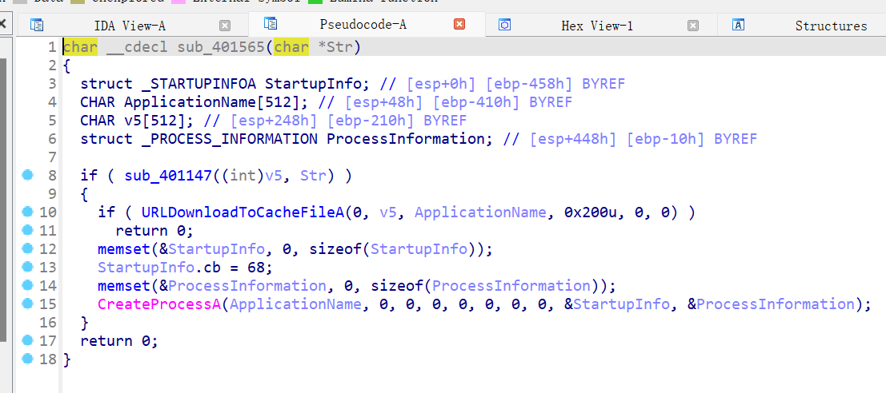

该函数的核心操作如下：

- **预处理与下载操作：**

  - 函数首先调用 `sub_401147` 解析 `a1` 指向的字符串，并将结果存储在局部变量 `v5` 中。实际上，它从先前下载的文件中提取命令参数，进行解码处理。

  - 然后，函数使用 `URLDownloadToCacheFileA` 从解码后的 URL 下载文件，并将其缓存到指定位置。

- **子进程创建：**

  如果文件下载成功，函数会使用 `CreateProcessA` 创建一个新的子进程，执行下载的文件。

`sub_401565` 函数的目的是从远程服务器下载文件并执行它。它实现了恶意软件的动态更新机制，能够远程下载新的恶意文件并在受害者的系统上执行。

分析 `sub_401613` 函数：

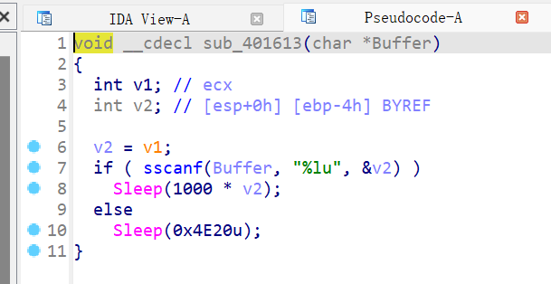

`sub_401613` 函数的功能相对简单，可以概括为：

- 解析 `Buffer` 中的命令参数，获取时间间隔信息。
- 根据提取的时间，调用 `Sleep` 函数使程序暂停执行相应的时间。

这表明恶意代码通过这个函数来控制下载命令之间的间隔，避免过于频繁的网络请求被检测到，同时也减少了网络流量的异常波动。

分析 `sub_401651` 函数：

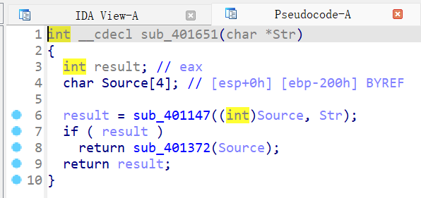

`sub_401651` 函数的作用是根据远程服务器的指令执行相应操作：

- 它会通过 `sub_401147` 解析远程命令。
- 如果命令有效且非空，调用 `sub_401372` 将数据写入到 `C:\autobat.exe` 文件中。

分析 `sub_401684` 函数：

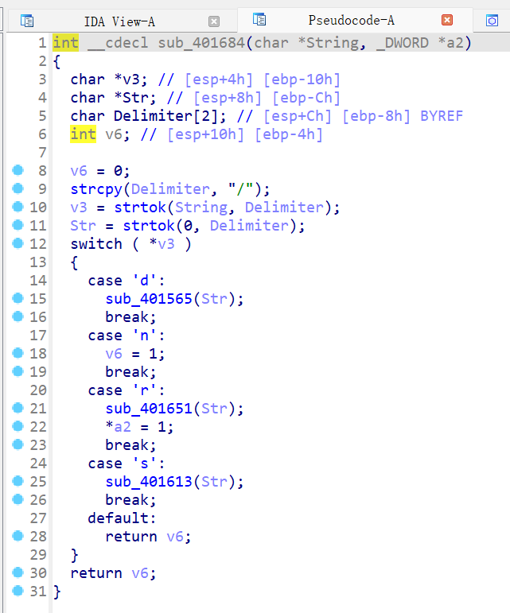

`sub_401684` 函数根据解析后的远程指令执行不同的操作：

- 如果指令是 `d`，调用 `sub_401565` 下载并执行文件。
- 如果指令是 `n`，程序退出。
- 如果指令是 `r`，执行重定向操作。
- 如果指令是 `s`，程序进入休眠状态。

分析 `WinMain` 函数：

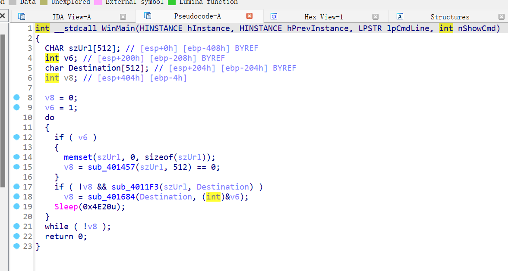

`WinMain` 函数是恶意软件的主入口，它负责周期性地检查和执行远程指令。它的功能可以总结为：

- 通过调用 `sub_401457` 检查本地配置文件。
- 如果文件不存在，尝试从远程下载配置文件。
- 使用 `sub_4011F3` 从远程响应中提取命令。
- 根据命令的首字符，通过 `sub_401684` 执行相应操作（下载文件、休眠、重定向等）。
- 程序以一个循环的形式不断执行，定期检查远程命令，直到接收到退出指令。

通过对这些函数的深入分析，我们可以总结出恶意软件的核心功能：

- **动态命令获取与执行：** 恶意软件通过定期从远程服务器下载配置文件，提取命令并执行不同的操作。指令可以包括下载新的恶意软件、修改本地配置、进入休眠状态以避免被检测，或退出程序。
- **隐蔽性与混淆：** 恶意软件通过复杂的编码方式（如 Base64）和隐藏命令的策略来增强其隐蔽性，使得它能够逃避传统的安全监控和检测。
- **自恢复与持久性：** 恶意软件具备自恢复功能，如果检测到配置文件丢失或被修改，它会尝试从远程服务器重新下载恶意组件。
- **灵活性与适应性：** 恶意软件能够根据远程攻击者的指令灵活调整行为，具有高度的适应性。

总的来说，这个恶意软件通过不断检查并下载配置文件来获取命令，这些命令被隐藏在看似合法的 Web 页面中的 `""` 标签里。它能够根据从这些页面中提取的命令执行各种操作，如下载并执行新的恶意软件、修改自己的配置文件、休眠以避免检测，或者完全退出。这种设计使得恶意软件能够动态地接收和执行来自攻击者的指令，同时难以被传统的网络监控工具检测到。通过使用非标准的编码方法和隐藏命令的策略，它提高了其隐蔽性和灵活性，使得检测和防御变得更加困难。

##### （4）问题解答

> Q1. 在初始信令中硬编码元素是什么?什么元素能够用于创建一个好的网络特征?

在初始信令中，硬编码的元素包括 **Accept**、**Accept-Language**、**UA-CPU**、**Accept-Encoding** 和 **User-Agent**。这些头部字段通常用于指定客户端接收的内容类型、语言偏好、计算平台等信息。然而，恶意代码在这些字段中可能会做出一些特殊的修改，比如错误地添加了一个额外的 `User-Agent` 字段，导致出现重复字符串：“User-Agent: User-Agent: Mozilla...” 这类异常会被网络安全分析人员注意到，并且为构造有效的检测特征提供了机会。

针对这种重复的 **User-Agent** 头部，可以构造特征来进行检测，特别是在恶意流量中观察到类似的异常格式时。通过识别这种重复的 **User-Agent** 字段，可以帮助防御者识别并检测出恶意代码。

> Q2. 初始信令中的什么元素可能不利于可持久使用的网络特征?

在恶意代码的初始信令中，**硬编码的域名** 和 **URL 路径** 可能会影响网络特征的持久性。特别是当配置文件不可用时，恶意代码会采用硬编码的域名和 URL 路径。这些硬编码的 URL 虽然能够在短期内构建检测特征，但一旦配置文件被重新下载或更改，恶意代码的 URL 路径可能会发生变化，从而影响检测效果。因此，单独依赖硬编码的 URL 并不理想。

一种更有效的检测方式是将硬编码的 URL 与 **动态 URL 链接** 相结合。因为恶意代码的配置文件通常会包含动态变化的 URL 地址，并且随着命令的不同而变化，这些 URL 是临时的，且更难以预测和固化。因此，结合硬编码元素与动态的 URL 路径，可以提高检测的效果和准确性。


> Q3. 恶意代码是如何获得命令的? 本章中的什么例子用了类似的方法? 这种技术的优点是什么?

恶意代码通过从 Web 页面中 **noscript 标签** 的特定组件来获取命令。这与本章中提到的 **注释域** 例子类似。恶意代码将其命令嵌入到合法网页中的 `noscript` 标签内，该标签通常用于不支持 JavaScript 的浏览器中。恶意代码通过发送 HTTP 请求访问网页，并从返回的网页内容中提取命令。

这种方法的优点在于它能够在看似正常的 Web 流量中隐藏恶意命令，攻击者可以利用合法的 Web 内容进行信令传递，这使得恶意流量与合法流量非常难以区分。防御者通常会把 `noscript` 标签作为合法网页的一部分进行分析，而忽略了其中潜在的恶意内容。

> Q4. 当恶意代码接收到输入时，在输入上执行什么检查可以决定它是否是一个有用的命令?攻击者如何隐藏恶意代码正在寻找的命令列表?

恶意代码在接收到输入时，会执行一系列的检查来确认该输入是否为有效的命令。这些检查包括：

- **URL 模式**：命令的 URL 路径必须是完整的，并且以 `96` 结尾。命令的结构通常是 `/<command>/<parameter>96`，其中 `<command>` 是命令名，`<parameter>` 是命令的参数。
- **域名匹配**：恶意代码会检查命令中包含的域名是否与原始请求的域名匹配，以确保这是一个合法的命令。
- **命令的第一个字母**：命令的第一个字母会被匹配到对应的动作。攻击者通过简单地更改命令的第一个字母（例如使用 `soft` 或 `seller`）来隐藏命令，从而使防御者难以识别实际命令。

攻击者通过这种方式，可以通过调整命令字符串中的第一个字母来隐蔽命令。例如，恶意代码可能会误判 `soft` 为休眠命令，从而混淆防御系统的检测。这种方式使得恶意代码可以在不修改恶意程序的情况下使用多个相似命令。

> Q5. 什么类型的编码用于命令参数? 它与 Base64 编码有什么不同? 它提供的优点和缺点各是什么?

在恶意代码中，命令的参数并未使用标准的 Base64 编码，而是采用了 **自定义编码方式**。这种编码方式通过偶数个数字来表示字符，每一对数字代表一个字符的索引，字符集为：`abcdefghijklmnopqrstuvwxyz0123456789:.`。在 URL 中，这种编码通过去除尾部的 `96` 字符进行传输。

与 **Base64 编码** 相比，这种自定义编码方式有以下特点：

- 优点：
 	- **非标准化**：由于它不是常见的标准编码，防御者通常不容易直接解码，需要逆向工程分析。
 	- **简洁性**：这种编码方案相对简单且不需要额外的解码库，攻击者可以轻松实现并在代码中集成。
- 缺点：
 	- **识别性强**：虽然这种编码不是标准的 Base64，但它在 URL 中通常有固定的模式，比如总是以特定字符开始，并且每对字符的组合方式较为简单，容易被安全检测工具识别。
 	- **可疑流量**：当大量请求使用这种编码传输时，可能会产生一致性的模式，从而引起安全防护系统的警觉。

> Q6. 这个恶意代码会接收哪些命令?

该恶意代码接收并执行以下几种命令：

1. **quit**：退出程序。
2. **download**：从指定 URL 下载并执行可执行文件。
3. **sleep**：使恶意代码暂停执行，休眠指定的秒数。
4. **redirect**：修改配置文件并改变信令 URL，实现攻击者的远程控制。

这些命令的功能各异，其中 **download** 和 **redirect** 命令可以动态改变恶意代码的行为，允许攻击者远程控制和更新恶意代码。

> Q7. 这个恶意代码的目的是什么?

这个恶意代码的主要目的是作为 **下载器**，它能够从远程服务器下载并执行其他恶意软件。它具有 Web 控制的优点，攻击者可以通过简单的网页请求远程控制并更新恶意代码，保持恶意软件的持续有效性。此外，它能够通过动态配置文件和远程指令来适应不同的攻击场景，使得防御者很难通过固定的特征进行有效检测。

> Q8. 本章介绍了用独立的特征，来针对不同位置代码的想法，以增加网络特征的鲁棒性。那么在这个恶意代码中，可以针对哪些区段的代码，或是配置文件，来提取网络特征?

在这个恶意代码中，可以提取以下几个关键的网络特征来增加检测的鲁棒性：

1. **硬编码的域名和路径**：可以根据恶意代码中的静态 URL 和域名来提取特征，尽管这些 URL 可能会被动态修改，但它们仍然可以提供一种检测方法。
2. **信令中的静态组件**：如重复的 **User-Agent** 字段、**Accept** 头部等字段，这些静态元素可以作为检测的特征。
3. **命令识别特征**：通过识别恶意代码中的命令参数（如 `sleep`、`download`、`quit` 等），可以提取出有用的网络特征。
4. **动态 URL 路径**：通过观察 URL 路径的变化，可以提取出与恶意行为相关的特征，尤其是包含 `96` 结尾的路径。

> Q9. 什么样的网络特征集应该被用于检测恶意代码?

根据分析，可以利用以下网络特征集来检测恶意代码：

- `User-Agent` 中重复的字符串。
- `Accept` 等相关的 HTTP 头部特征。
- 特定的 URL 路径和参数模式。

1. **异常的 User-Agent 字段**：例如 **User-Agent** 字段中出现重复的 `User-Agent`，这种异常可以通过以下 Snort 规则来检测：

	```css
	alert tcp $HOME_NET any -> $EXTERNAL_NET $HTTP_PORTS (msg:"PM14.3.1 Specific User-Agent with duplicate header"; content:"User-Agent|3a20|User-Agent|3a20|Mozilla/4.0|20|(compatible\;|20|MSIE|20|7.0\;|20|Windows|20|NT|20|5.1\;|20|.NET|20|CLR|20|3.0.4506.2152\;|20|.NET|20|CLR|20|3.5.30729)"; http_header; sid:20001431;rev:1;)
	```

2. **检测 `sleep` 命令**：当恶意代码接收到 `sleep` 命令时，它会暂停一段时间。可以使用以下 Snort 规则来检测这种行为：

	```css
	alert tcp $EXTERNAL_NET $HTTP_PORTS -> $HOME_NET any (msg:"PM14.3.4 Sleep Command"; content:96'"; pcre:"/\/s[^\/]{0,15}\/[0-9]{2,10}96'/"; sid:20001434; rev:1;)
	```

通过结合这些特征，可以有效提高恶意代码的检测能力，并增强网络安全防御。

### （二）yara 编写与分析

#### 1. yara 编写

本次 Yara 规则的编写基于上述的病毒分析和实验问题，主要是基于静态分析的字符串和 IDA 分析结果。

```yara
private rule isMZ_PE {
    meta:
        description = "It is a PE file"
    condition:
        filesize <10MB and uint16(0) == 0x5A4D and uint32(uint32(0x3C)) == 0x00004550
        // 文件大小小于10MB，文件头的前两个字节为MZ，PE头的偏移地址处的四个字节为PE标志
}

// Lab14-01
rule Lab14_01_exe {
    meta:
        description = "It may like Lab14_01_exe"
    strings:
        $s1 = "http://www.practicalmalwareanalysis.com/%s/%c.png"
        $s2 = "ABCDEFGHIJKLMNOPQRSTUVWXYZabcdefghijklmnopqrstuvwxyz0123456789+/"
        $s3 = "%c%c:%c%c:%c%c:%c%c:%c%c:%c%c"
        $s4 = "%s-%s"
    condition:
        isMZ_PE and all of them
}

// Lab14-02
rule Lab14_02_exe {
    meta:
        description = "It may like Lab14_02_exe"
    strings:
        $s1 = "WXYZlabcd3fghijko12e456789ABCDEFGHIJKL+/MNOPQRSTUVmn0pqrstuvwxyz"
        $s2 = "http://127.0.0.1/tenfour.html" wide
        $s3 = "cmd.exe"
        $s4 = "Internet Surf"
        $s5 = "/c del "
    condition:
        isMZ_PE and all of them
}

// Lab14-03
rule Lab14_03_exe {
    meta:
        description = "It may like Lab14_03_exe"
    strings:
        $s1 = "http://www.practicalmalwareanalysis.com/start.htm"
        $s2 = "C:\\autobat.exe"
        $s3 = "/abcdefghijklmnopqrstuvwxyz0123456789:."
        $s4 = "User-Agent: Mozilla/4.0 (compatible; MSIE 7.0; Windows NT 5.1; .NET CLR 3.0.4506.2152; .NET CLR 3.5.30729)"
    condition:
        isMZ_PE and all of them
}
```

#### 2. 运行

把上述 Yara 规则保存为 `lab11.yar`, 然后执行检查，可以看到，样本被检出。**Yara 规则编写成功！**

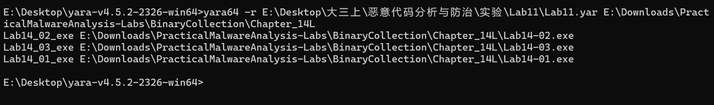

#### 3. 测试执行效率

接下来测试规则的执行效率，我选择编写一个 python 脚本、执行扫描和时间统计，代码如下：

```python
import os
import time

# 获取程序开始时间
start_time = time.time()

os.system(r"E:\Desktop\yara-v4.5.2-2326-win64\yara64.exe -r E:\Desktop\大三上\恶意代码分析与防治\实验\Lab11\Lab11.yar E:\Downloads")

# 获取程序结束时间
end_time = time.time()

# 计算并输出程序运行时间
elapsed_time = end_time - start_time
print(f"程序运行时间: {elapsed_time} 秒")
```

选择的文件夹为 E:\Downloads，这个文件夹大小为 2.12GB，有 461 个文件、114 个文件夹：

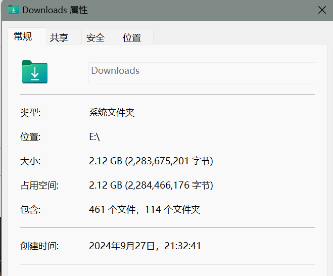

运行结果如下，如图所示运行时间为 2.55s，说明效率较高。

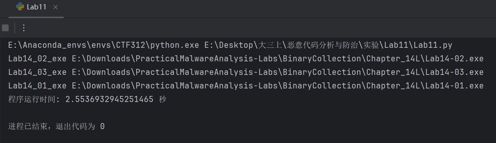

### （三）IDA python 脚本编写

#### 1. IDA python 脚本编写

为了简化安全审计和逆向工程的工作，我编写了三个脚本来辅助分析：

##### 脚本一

```python
import idaapi
import idautils
import idc

# 检查指令是否是 'jmp' 或 'call' 且操作数为寄存器类型
def is_jump_or_call_with_register(ea):
    """
    检查给定地址的助记符是否为 'jmp' 或 'call' 且操作数为寄存器类型
    """
    mnemonic = idc.print_insn_mnem(ea)
    if mnemonic not in ['jmp', 'call']:
        return False
    opnd_type = idc.get_operand_type(ea, 0)
    # 确保操作数是寄存器类型
    return opnd_type in [idaapi.o_reg, idaapi.o_phrase, idaapi.o_displ]

# 检查函数是否为库函数
def is_library_function(func_ea):
    """
    检查给定地址的函数是否为库函数
    """
    flags = idc.get_func_attr(func_ea, idc.FUNCATTR_FLAGS)
    return flags & idaapi.FUNC_LIB

# 标记不安全的函数调用并设置颜色
def judge_audit(addr):
    """
    对不安全的函数调用进行标注，并设置背景颜色
    """
    idc.set_cmt(addr, "### AUDIT HERE ###", 0)  # 添加注释
    idc.set_color(addr, idc.CIC_ITEM, 0x0000ff)  # 设置指令背景颜色

# 标记不安全函数的调用
def flag_calls(danger_funcs):
    """
    查找并标记程序中所有不安全函数的调用
    """
    count = 0
    for func in danger_funcs:
        faddr = idc.get_name_ea_simple(func)
        if faddr != idaapi.BADADDR:
            # 获取对该函数的所有交叉引用
            cross_refs = idautils.CodeRefsTo(faddr, 0)
            for addr in cross_refs:
                count += 1
                print("%s[%d] calls 0x%08x" % (func, count, addr))
                judge_audit(addr)

# 主函数
def main():
    # 遍历所有函数，排除库函数
    for func in idautils.Functions():
        if is_library_function(func):
            continue

        # 遍历函数中的所有指令
        ea = func
        func_end = idc.find_func_end(func)
        while ea != idaapi.BADADDR and ea < func_end:
            # 如果是跳转或调用且操作数是寄存器类型
            if is_jump_or_call_with_register(ea):
                print("Address: 0x{:X}, Instruction: {}".format(ea, idc.generate_disasm_line(ea, 0)))
            # 继续处理下一条指令
            ea = idc.next_head(ea)

    # 识别并标记不安全函数调用
    print("-------------------------------")
    danger_funcs = ["DllEntryPoint", "printf", "strcpy", "GetModuleFileNameExA", "Thread32Next"]
    flag_calls(danger_funcs)
    print("-------------------------------")

if __name__ == '__main__':
    main()
```

该脚本主要有两个功能：

1. **动态跳转或调用检测**，即检测汇编指令是否是 `jmp` 或 `call`，并且操作数为寄存器类型。

2. **查找和标记危险函数调用**，并为每个调用添加注释、设置背景颜色。（主要用来漏洞挖掘）

##### 脚本二

本次实验中由于出现需要 base64 解密的地方，因此编写如下脚本，用于对 base64 加密的内容进行解密：

```python
import string, base64
result = ""
tab = "XYZlabcd3fghijko12e456789ABCDEFGHIJKL+/MNOPQRSTUVmn0pqrstuvwxyz"
standardBase64 =
"ABCDEFGHIJKLMNOPQRSTUVWXYZabcdefghijklmnopqrstuvwxyz0123456789+/"
text = "e6LJC+xnBq90daDNB+1TDrhG6aUG6p9LC/iNBqsGi2sVgJdqhZXDZoMMomKGoqxUE7"
for i in text:
	if i in tab:
		s += standardBase64[string.find (tab, str (ch))]
	elif i == '=':
		s += '='
print(base64.decodestring(a))
```

##### 脚本三

本次实验中涉及的病毒具有复杂的调整行为比如每个程序的函数都非常复杂，所以编写一个查找并跟踪参数传递的函数。

```python
import idaapi
import idc
import idautils

def find_mov_esi(addr):
    """
    在给定地址addr的上下文中，向前遍历指令，找到最近的一条mov指令，
    并将值赋给esi寄存器。如果是，则打印找到的参数值。
    """
    while addr != idaapi.BADADDR:
        insn = idc.get_insn_at(addr)
        if insn is None:
            break
        mnemonic = idc.print_insn_mnem(insn)
        if mnemonic == "mov":
            # 获取操作数
            operands = idc.print_operands(insn)
            # 检查是否将值赋给esi寄存器
            if "esi" in operands:
                # 提取并打印参数值
                esi_value = idc.get_operand_value(insn, 0) if "esi" in operands else idc.get_operand_value(insn, 1)
                print(f"Found mov to esi at {idc.get_func_name(addr)}+{addr-idc.get_func_attr(addr, idc.FUNCATTR_START)}: {esi_value}")
                break
        addr = idc.prev_head(addr)  # 向前移动到上一条指令
```

#### 2. 运行

下面我以代码一为例对 Lab14-02.exe 进行测试，执行该 IDApython 脚本：

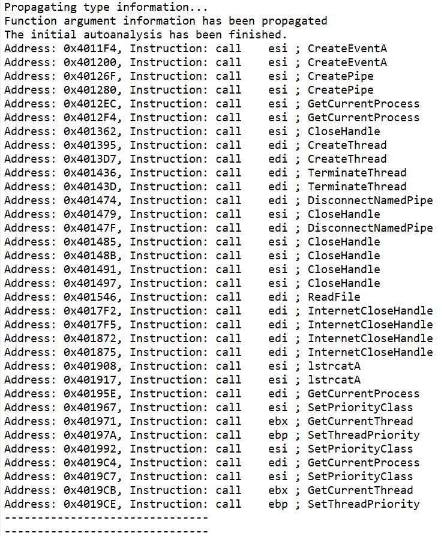

可以看到控制台输出了 `call`，说明脚本编写成功！

## 四、实验结论及心得体会

---

通过本次实验，我深入分析了多个恶意代码样本，结合静态分析工具和动态分析技术，对它们的行为和网络特征进行了全面的剖析。实验中，我重点关注了病毒的网络行为，如 C&C 服务器通信、数据渗透、流量隐藏等，以及病毒利用的密码学技术（如 Base64 编码和 AES 加密）。这些网络特征和加密手段不仅让我更好地理解了恶意软件的传播和隐匿策略，也让我对网络安全的复杂性有了更深的认知。

在分析过程中，我通过 IDA 的 String 模块和 Yara 规则对病毒样本进行检测，取得了良好的效果。通过编写 IDAPython 脚本，我成功实现了辅助分析功能，这使得我在恶意代码分析中能更高效地提取有用信息。通过这些实践，我的分析能力和工具应用能力得到了显著提升。

此外，本次实验让我更加深刻地体会到网络安全的多层次性和挑战性。网络应对措施、攻击者调查、行为分析等环节都环环相扣，涉及的知识广泛且复杂。通过这个实验，我不仅加深了对网络安全技术的理解，也感受到了这场与恶意攻击者对抗的智慧较量的激烈与重要。这种跨学科的知识融合让我认识到，网络安全不仅仅是单纯的技术问题，更是一种持续的学习和适应过程，必须不断提升自己的技术和思维能力，才能应对不断变化的威胁。
