

<b>恶意代码分析与防治技术课程实验报告</b>

<b>实验二</b>

&nbsp;&nbsp;&nbsp;&nbsp;&nbsp;学 院：网络空间安全学院 
&nbsp;&nbsp;&nbsp;&nbsp;&nbsp;专 业：信息安全专业 
&nbsp;&nbsp;&nbsp;&nbsp;&nbsp;学 号：2212998 
&nbsp;&nbsp;&nbsp;&nbsp;&nbsp;姓 名：胡博浩 
&nbsp;&nbsp;&nbsp;&nbsp;&nbsp;班 级：信息安全 

## 一、实验目的

---

1. 虚拟机的安装和配置过程；
2. 静态分析工具的功能和安装过程；
3. 动态分析工具的功能和安装过程。

## 二、实验原理

---

在这个实验中，我们采用了虚拟化软件（例如`VMware`）来创建一个虚拟机。虚拟机是一个隔离的操作系统环境，可以在其中运行另一个操作系统（如`Windows10`）。这使得我们可以在同一台物理计算机上同时运行多个独立的操作系统实例，以便进行安全的恶意代码分析。

通过使用虚拟化技术，我们能够在一个受控的环境中执行和观察恶意代码的行为，而不会直接影响到宿主机系统的稳定性和安全性。这种技术为我们提供了一个安全、隔离的测试平台，有助于更深入地了解和分析各种恶意软件和攻击手段，从而更好地制定防御策略。

## 三、实验过程

---

### （一）安装VMvare虚拟化软件

我已经安装过了VMware17.5.1，这里我只是对其进行升级。

由于现在需要注册`Broadcom`账号，这里我主要参考了[VMware Workstation Pro 个人免费版下载及安装指南 - 系统极客 (sysgeek.cn)](https://www.sysgeek.cn/install-vmware-workstation-pro/)教程，直接通过`VMware`更新服务器下载。

一路傻瓜式安装，最终安装成功，结果如下：

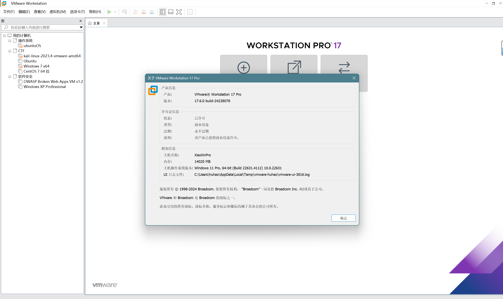

### （二）安装windows10操作系统

#### 1.首先下载windows10的iso镜像文件：

这里选择到`南开大学正版化平台`下载`Windows10中文专业版64位iso文件`以及`激活客户端`：

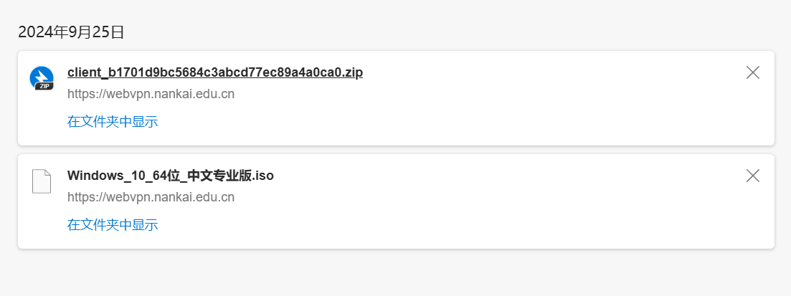

#### 2.在[`VMware`](https://so.csdn.net/so/search?q=VMware&spm=1001.2101.3001.7020)中配置镜像文件：

这里参考[VMware虚拟机Windows 10安装使用教程（非常详细）从零基础入门到精通，看完这一篇就够了-CSDN博客](https://blog.csdn.net/heike_Ch/article/details/140047605)教程，只有在选择磁盘类型时选择推荐的NVMe：

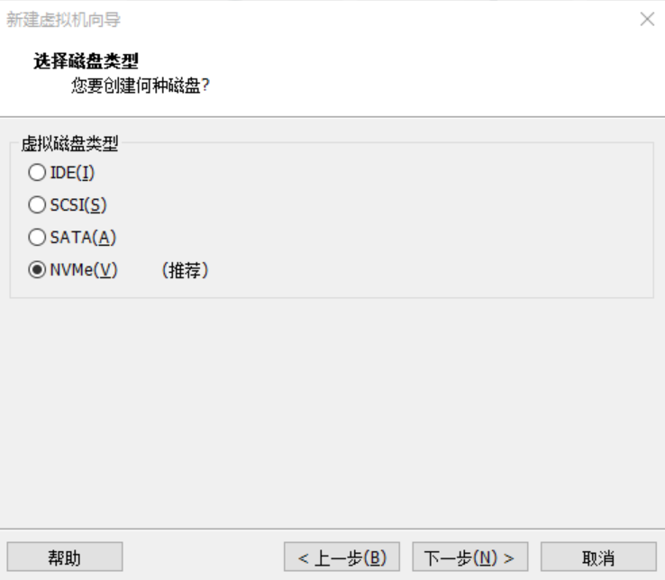

最终配置如下：

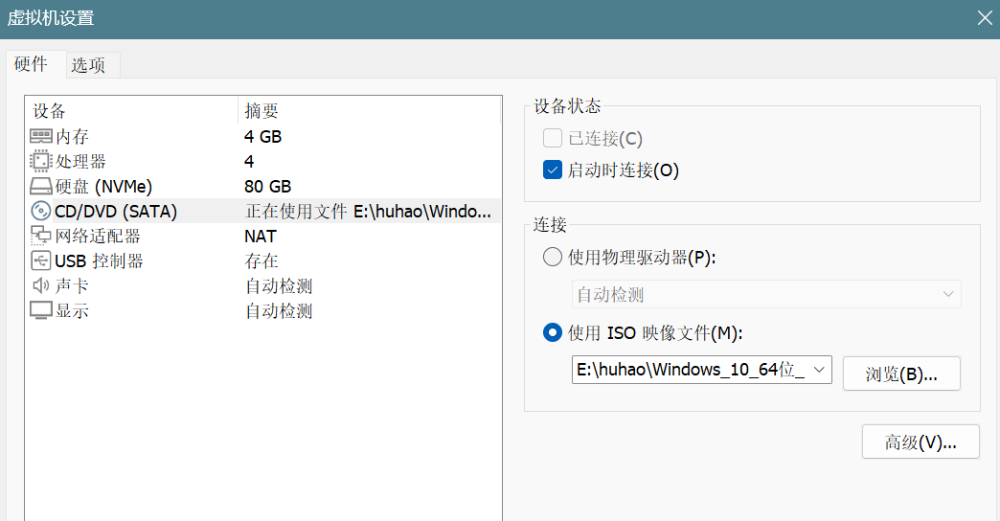

#### 3.进入windows10安装界面以及安装VMtools

同样也是参考[VMware虚拟机Windows 10安装使用教程（非常详细）从零基础入门到精通，看完这一篇就够了-CSDN博客](https://blog.csdn.net/heike_Ch/article/details/140047605)教程，由于和我安装的系统不完全相同，我还参考了[正版软件管理平台 (nankai.edu.cn)](https://webvpn.nankai.edu.cn/https/77726476706e69737468656265737421f3f60f92263e635177468ca88d1b203b/product.html?id=65)教程，最终成功配置完毕：

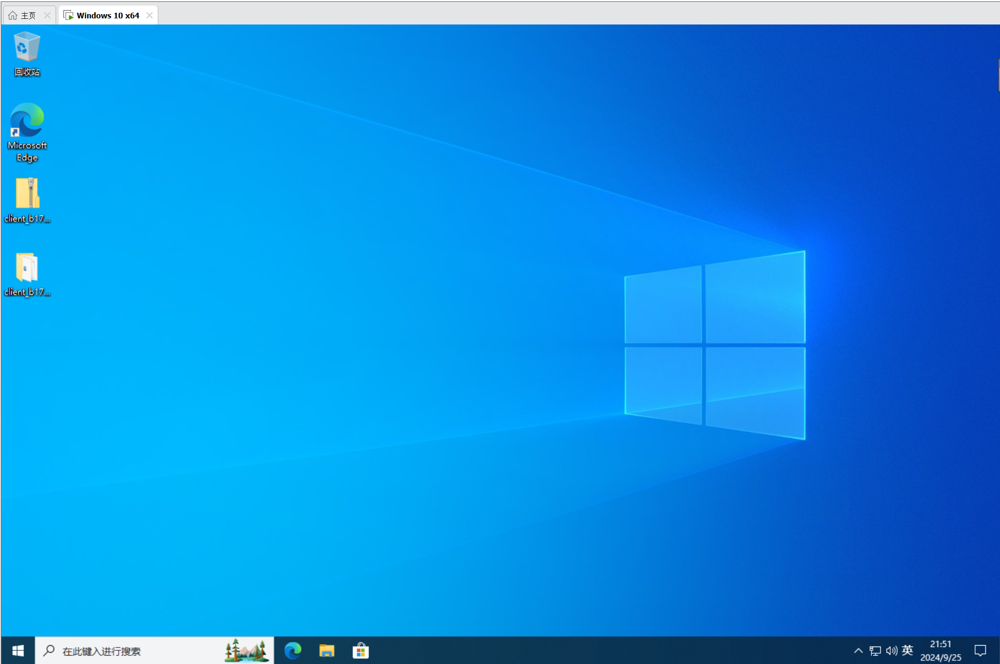

### （三）安装静态分析工具及其功能

#### 1.首先收集工具的安装包或者安装程序

具体网址如下，基本都是官网或者吾爱破解论坛。这里由于`dependency walker`不支持`Windows10`，转而使用`Dependencies`这个github开源软件。

>   -   strings:[Strings - Sysinternals | Microsoft Learn](https://learn.microsoft.com/en-us/sysinternals/downloads/strings)
>   -   PEView:[WJR Software - PEview (PE/COFF file viewer),... (wjradburn.com)](http://wjradburn.com/software/)
>   -   **[Dependencies](https://github.com/lucasg/Dependencies)**:[Windows 查看 exe 依赖的 dll 的方法 - 知乎 (zhihu.com)](https://zhuanlan.zhihu.com/p/395557318)
>   -   IDA:https://down.52pojie.cn/Tools/Disassemblers/IDA.txt

#### 2.安装并介绍功能

打开已经创建好的Windows10虚拟机，开始安装。由于安装过程比较简单，故文中不过多赘述，仅展示根目录的文件内容或工具的运行截图。

##### (1)strings：

`strings`是一个用于从二进制文件中提取可打印字符串的工具，其主要功能包括：

>   -   搜索和提取ASCII和UNICODE字符串。
>   -   查找隐藏信息，如恶意软件标识。
>   -   分析程序功能，识别代码中的关键信息。
>   -   辅助反汇编工作，帮助理解代码。
>   -   提供参数选项以定制搜索，如指定最小字符串长度、输出格式等。

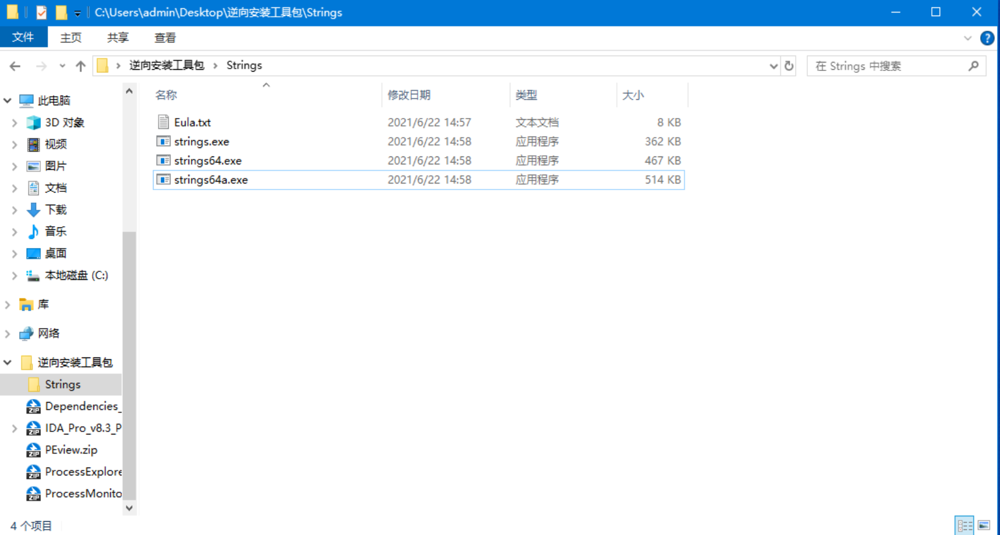

##### (2)PEView：

`PEview`是一款功能强大的命令行交互式解析器，用于解析32位的Portable Executable (PE) 文件和Component Object File Format (COFF) 文件。其主要功能包括：

>   -   **文件解析**：PEview能够解析各种类型的PE文件，如EXE、DLL、OBJ、LIB、DBG等，以及COFF文件。这使得用户可以方便地查看和分析这些文件的结构。
>   -   **结构和内容查看**：用户可以通过PEview轻松查看PE文件的结构和内容，包括文件头、区段、目录等。这有助于用户快速了解文件的基本组成和结构。
>
>   -   **详细信息显示**：PEview提供了丰富的详细信息展示功能，包括但不限于：
>       - **头部信息**：显示文件的元数据和结构信息，帮助用户了解文件的基本属性。
>       - **区段信息**：详细列出文件的各个区段，如.text、.data等，让用户了解各个区段的功能和用途。
>       - **目录信息**：提供对文件中各种目录结构的访问，如导入表、导出表等，方便用户查找和分析依赖关系和导出的函数。
>       - **导入表**：列出文件所依赖的其他模块和函数，帮助用户了解文件的依赖关系。
>       - **导出表**：显示文件导出的函数和符号，让用户了解文件提供的接口。
>       - **资源信息**：展示文件内包含的资源，如图标、字符串等，帮助用户了解文件的资源使用情况。
>
>   -   **内置功能**：PEview内置了多种结构查询和转换功能，便于用户对文件进行深入分析。这些功能可以帮助用户更全面地了解文件的内部结构和特性。

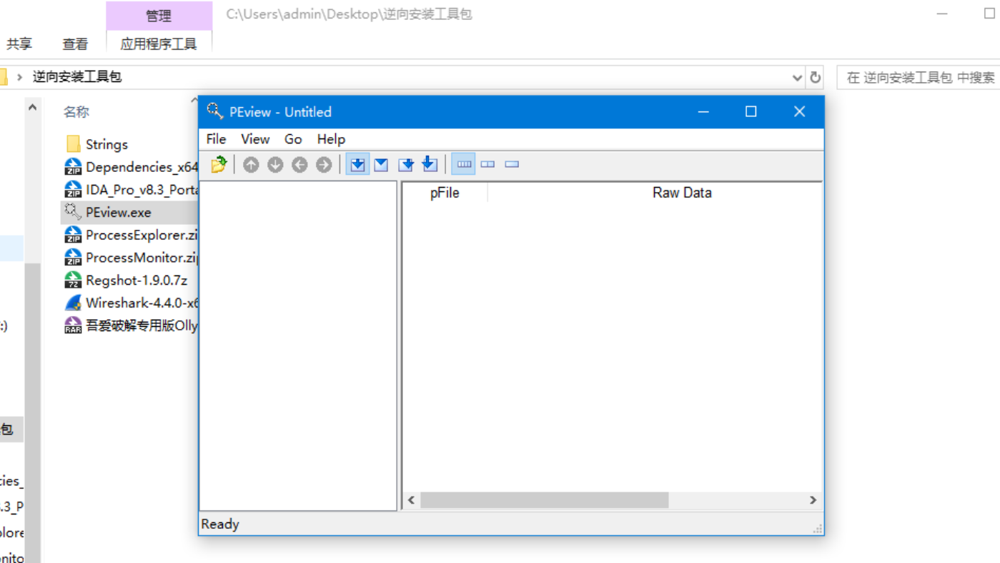

##### (3)dependencies：

Dependencies是一款针对Windows平台的开源工具，具备以下功能：

>   -   列出.exe或.dll文件的所有依赖DLL。
>   -   显示每个DLL的完整路径、导出函数及其地址。
>   -   提供依赖树视图，便于理解复杂的依赖关系。
>   -   生成兼容性报告，帮助识别潜在问题。
>   -   支持命令行和插件，适用于自动化和功能扩展。

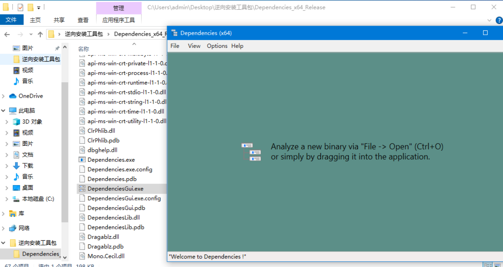

##### (4)IDA：

IDA Pro 是一款功能强大的逆向工程工具，具备多种特点和功能：

>   -   **交互式反汇编**：用户可与反汇编代码进行互动，如设置断点、跟踪执行流程及修改代码。
>   -   **可编程性**：支持使用内置脚本语言（IDC）或Python脚本自动化分析任务。
>   -   **可扩展性**：通过插件扩展功能，社区提供众多插件。
>   -   **多处理器支持**：支持Intel x86、x64、ARM、MIPS、PowerPC等多种架构，能分析不同平台可执行文件。
>   -   **跨平台**：可在Windows、Linux和macOS等多个操作系统上运行。
>   -   **病毒和恶意软件分析**：在安全研究领域广泛用于分析病毒、木马等恶意软件。
>   -   **功能丰富**：包括结构查询转换、代码交叉引用、图形化流程图以及反编译高级语言视图等功能。

IDA Pro 是逆向工程师和程序员进行软件分析、程序行为理解、漏洞寻找和恶意软件分析的重要工具，因其强大的功能和灵活性而在全球范围内广泛使用。

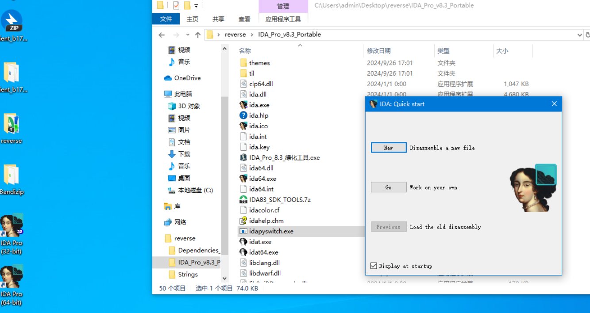

### （四）安装动态分析工具及其功能

#### 1.首先收集工具的安装包或者安装程序

具体网址如下，基本都是官网或者吾爱破解论坛。

>   -   ollyDBG:https://down.52pojie.cn/Tools/Debuggers/%E5%90%BE%E7%88%B1%E7%A0%B4%E8%A7%A3%E4%B8%93%E7%94%A8%E7%89%88Ollydbg.rar
>   -   Process Monitor:[Process Monitor - Sysinternals | Microsoft Learn](https://learn.microsoft.com/en-us/sysinternals/downloads/procmon)
>   -   Process Explorer:[Process Explorer - Sysinternals | Microsoft Learn](https://learn.microsoft.com/en-us/sysinternals/downloads/process-explorer)
>   -   RegShot:[regshot download | SourceForge.net](https://sourceforge.net/projects/regshot/)
>   -   WireShark:[Wireshark · Go Deep](https://www.wireshark.org/)

#### 2.安装并介绍功能

打开已经创建好的Windows10虚拟机，开始安装。由于安装过程比较简单，故文中不过多赘述，仅展示根目录的文件内容或工具的运行截图。

##### (1)ollyDBG：

OllyDbg 是一款广受欢迎的动态分析工具，专为调试和逆向工程而设计。其主要特性包括：

>   -   能够动态追踪程序的运行过程。
>   -   作为用户模式下的调试器，提供灵活的调试环境。
>   -   支持插件扩展功能，可根据需求定制工具。
>   -   提供多种窗口，如反汇编、寄存器、信息、数据和堆栈等，方便用户查看和分析。
>   -   广泛应用于病毒和恶意软件的分析工作。
>   -   支持解析32位程序，具备断点设置和单步执行等功能，帮助用户精确控制程序的执行流程。

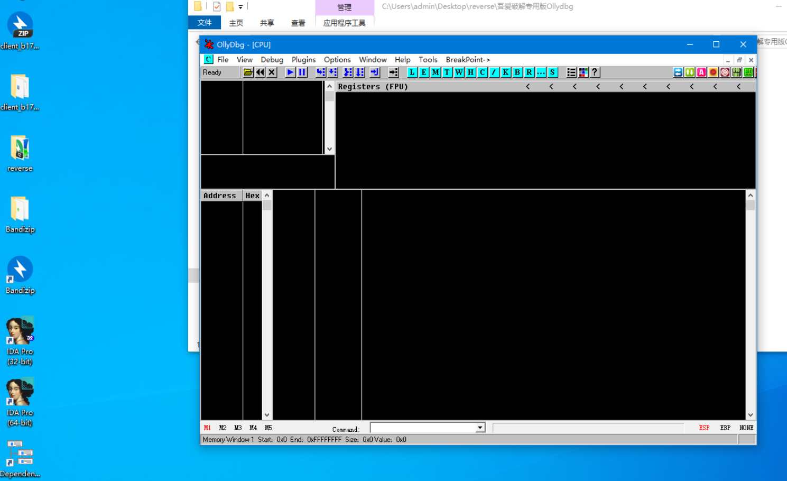

##### (2)Process Monitor：

Process Monitor 是一款高级监控工具，专门用于实时跟踪和分析 Windows 系统中的文件系统、注册表以及进程/线程活动。它集成了Filemon和Regmon的功能，并具备以下特性：

>   - 实时监控和过滤操作。
>   - 显示详细的事件属性，如会话ID和用户名。
>   - 提供准确的进程信息。
>   - 显示每个操作的完整线程堆栈，支持符号解析。
>   - 能够将监控数据记录到文件中。

在恶意软件分析中，Process Monitor 常用于追踪和识别可疑的文件和注册表活动。

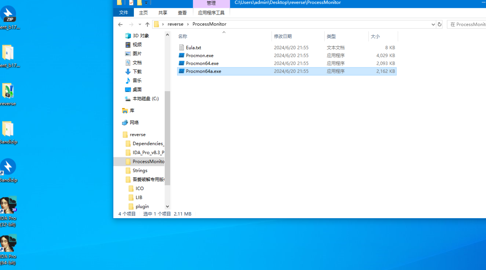

##### (3)Process Explorer：

Process Explorer是一款功能强大的工具，专门用于监控和分析Windows系统以及运行在其上的应用程序。它具备以下关键特性：

>   -   **详细的进程与线程信息**：此工具能够显示每个进程及其相关线程的详尽信息，帮助用户深入了解系统的运行状态。
>   -   **DLL模块加载情况及依赖关系展示**：Process Explorer可以清晰地列出每个进程所加载的动态链接库（DLL）模块，并展示这些模块之间的依赖关系，这对于理解程序行为至关重要。
>
>   -   **函数导出与调用分析**：该工具还能列出各个模块导出的函数以及它们被哪些其他函数调用，这有助于开发者和分析师追踪代码执行流程。
>
>   -   **全面支持64位Windows**：Process Explorer完全兼容64位版本的Windows操作系统，确保在现代计算环境中同样高效工作。
>
>   -   **诊断模块加载与执行问题**：对于遇到模块加载失败或执行异常的问题，Process Explorer提供了强大的诊断能力，帮助用户快速定位问题根源。
>
>   -   **便捷的界面功能**：为了提高用户体验，Process Explorer配备了颜色编码和搜索功能，这使得用户能够迅速识别特定的进程或信息，并轻松地进行定位。

Process Explorer是一个全面的系统监控工具，适用于开发人员、IT管理员以及任何需要深入洞察Windows系统内部工作机制的用户。

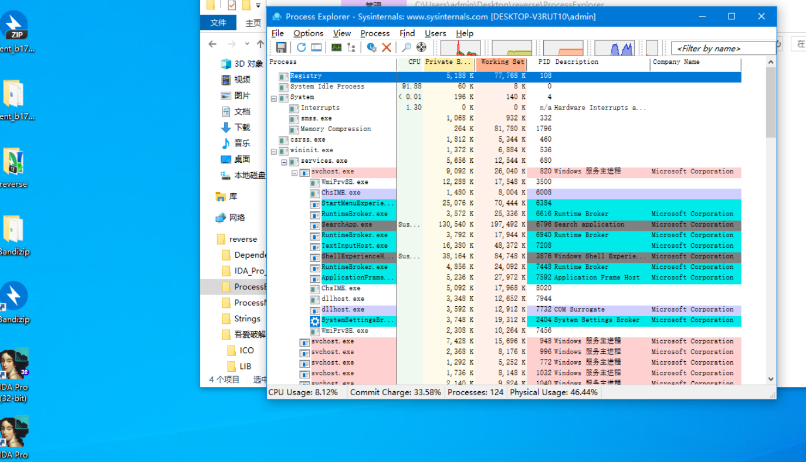

##### (4)RegShot：

RegShot 是一款高效的注册表和文件系统比较工具，其主要功能包括：

>   -   在操作前后捕获系统的快照。
>   -   通过比较这些快照来识别出系统中的变化。
>   -   准确地追踪由特定操作引起的注册表和文件系统的变动。

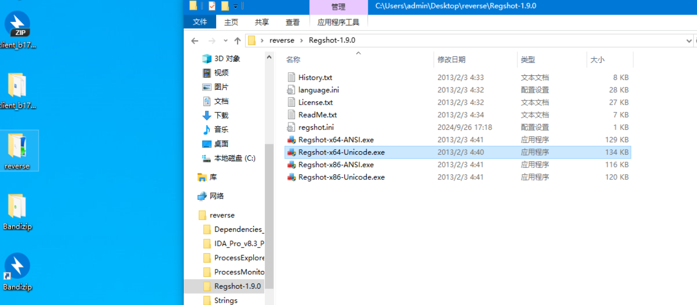

##### (5)WireShark：

Wireshark 是一个广泛使用的网络协议分析工具，它能够捕获和分析网络上的数据包。其主要功能包括：

>   -   实时捕获网络流量，便于监控和分析数据传输情况。
>   -   解析并展示数据包的详细信息，帮助用户理解数据交换的具体过程。
>   -   支持多种网络协议，确保可以处理各种类型的网络通信。
>   -   提供强大的过滤和搜索功能，使用户能够快速找到感兴趣的数据包。
>   -   兼容Windows、Linux和macOS操作系统，具有广泛的适用性。

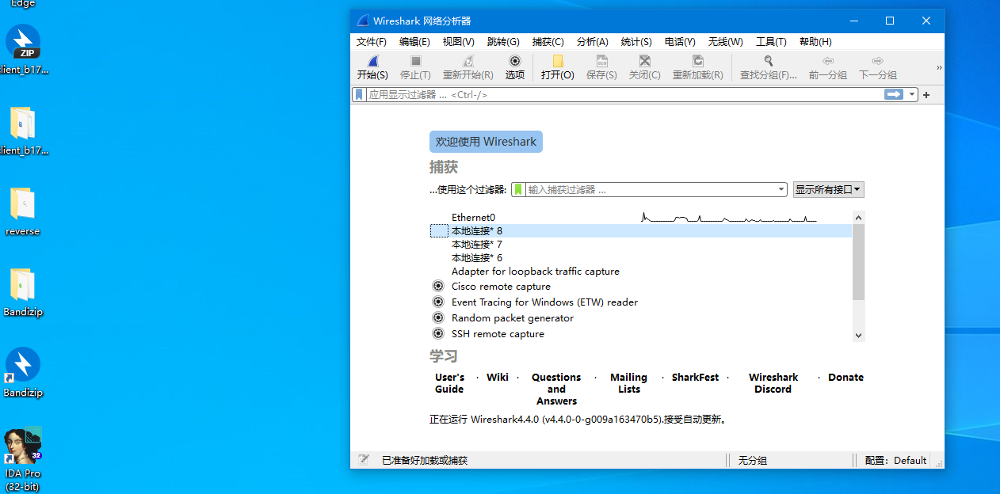

## 四、实验结论及心得体会

---

**实验结论：**

1. 成功搭建了用于恶意代码分析的虚拟机环境，并熟练掌握了其安装与配置方法。
2. 学习并掌握了重要的静态和动态分析工具，为深入剖析恶意代码提供了坚实的技术支持。
3. 本次实验为后续的恶意代码分析和网络安全研究奠定了坚实基础。

**心得体会：**

这次实验是我在恶意代码与防治分析方面的第二次实践，由于本身是`CTF逆向手`，结合竞赛中的经验以及课堂理论和实验操作，使我对虚拟机有了更深入的理解。其次，成功创建了自己的病毒分析环境，进一步了解了多种静态与动态分析工具，掌握了这些工具的使用技巧。通过本次实验，深刻体会到安全性在恶意代码分析中的重要性，以及在实际操作中如何避免恶意代码对真实系统造成损害。
