<div align='center'>
<b> <font face='微软雅黑' size='6'> 恶意代码分析与防治技术课程实验报告 </font> </b>
</div>


<div align='center'>
<b> <font font face='微软雅黑' size='6'> 实验三 </font> </b>
</div>


<div>
<font face='宋体' size='6'>&nbsp;&nbsp;&nbsp;&nbsp;&nbsp; 学 院：网络空间安全学院 </font> <br>
<font face='宋体' size='6'>&nbsp;&nbsp;&nbsp;&nbsp;&nbsp; 专 业：信息安全专业 </font> <br>
<font face='宋体' size='6'>&nbsp;&nbsp;&nbsp;&nbsp;&nbsp; 学 号：2212998 </font> <br>
<font face='宋体' size='6'>&nbsp;&nbsp;&nbsp;&nbsp;&nbsp; 姓 名：胡博浩 </font> <br>
<font face='宋体' size='6'>&nbsp;&nbsp;&nbsp;&nbsp;&nbsp; 班 级：信息安全 </font> <br>
</div>

## 一、实验目的

---

1. 完成课本 lab3（3-1 至 3-4）的实验内容 。
2. 编写 Yara 引擎规则，并测试规则的执行效率。

## 二、实验原理

---

动态分析恶意软件是一种有效的技术手段，它通过执行恶意代码并实时监控其在操作系统中的活动来进行分析。与静态分析不同，动态分析涉及代码的执行过程，以便更全面地了解恶意软件的行为和特性。其主要包括以下几个关键步骤：

1. **执行恶意代码**：在封闭的实验环境中（如隔离的虚拟机或沙盒）执行恶意代码，以确保不对实体计算机系统构成威胁。
2. **行为监控**：实时监控和记录恶意代码的行为，包括文件系统的变动、网络活动、系统级调用、注册表的修改以及新进程的创建等。
3. **数据搜集**：搜集与恶意代码行为相关的大量数据，如系统调用日志、网络通信数据包、内存内容快照等，为后续分析提供基础。
4. **行为模式识别**：分析收集到的数据，识别出恶意代码的行为模式，以揭示其目的和功能，如信息窃取、自我复制或执行其他恶意行为。
5. **环境仿真**：模拟特定的系统环境，观察恶意代码在不同环境下的行为差异，以更全面地理解其表现。
6. **与恶意代码互动**：在必要且安全的情况下，尝试与恶意代码进行互动，以进一步探究其功能和特性。这一过程需要极为谨慎，以防止对实验环境以外的系统造成损害。

## 三、实验过程

---

### （一）完成 Lab3-1 至 Lab3-4 的题目

#### 1.Lab3-1

**使用动态分析基础技术来分析在 `Lab03-01.exe` 文件中发现的恶意代码。**

> Q1.找出这个恶意代码的导入函数与字符串列表?


首先通过静态分析技术，使用 `PEiD` 查看文件，结果如下，可以看出这个 exe 经过 `PEncrypt` 加壳处理：

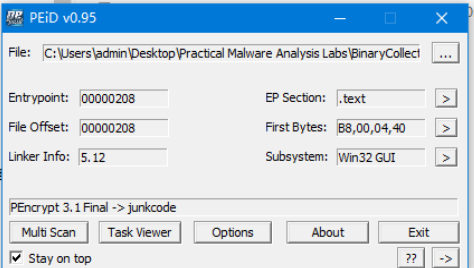

使用 `PEView` 观察这个文件，如下图所示，由于未进行脱壳，导入函数不完整，只有一个 `Exitprocess`：


下面使用 `Strings` 查看文件的字符串，可以看到一些诸如 **`WinVMX32`、`VideoDriver`、`vmx32to64.exe`、注册表位置、注册表键值、`url` 等信息**。如下图所示。

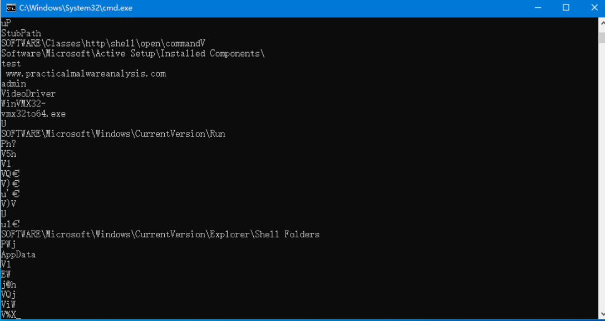

> Q2.这个恶意代码在主机上的感染迹象特征是什么？

由于该样本经过加壳处理，静态分析无法获取有效的信息，因此我们进行动态分析。

首先为虚拟机保存快照，然后设置 `ApateDNS` 的 `DNS Reply IP` 为 `127.0.0.1` 并启动。

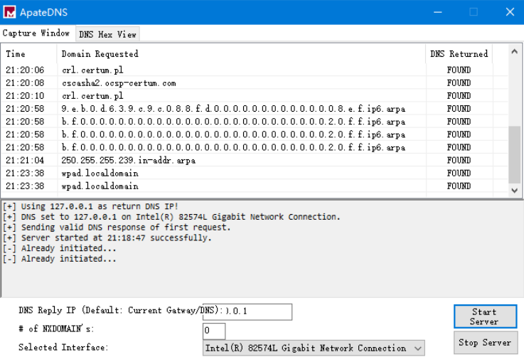

之后先打开 `Process Monitor` 清除所有事件，并启动 `Process Explorer`。

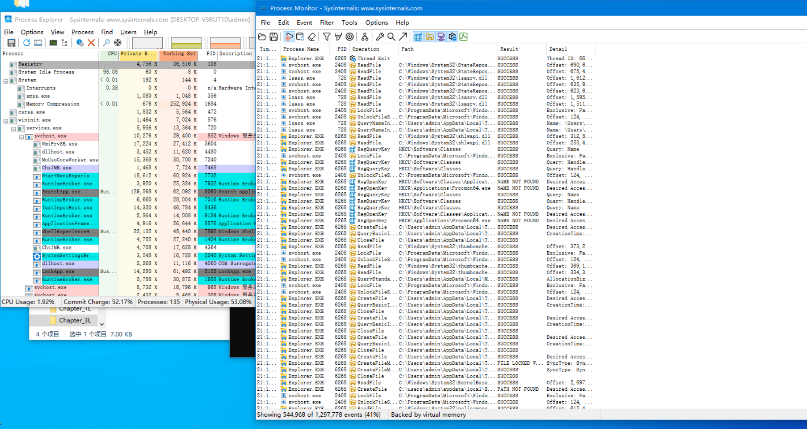

接着打开 netcat，开启两个 cmd，分别执行如下命令：

```assembly
nc -l -p 403
nc -l -p 80
```

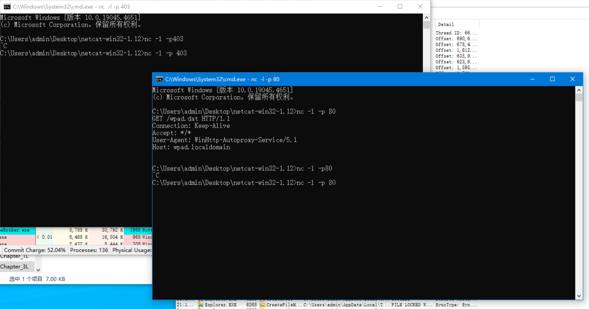

最后打开 `wireshark`，执行 `Lab3-1.exe`。

***这里我使用的是 win10 虚拟机，恶意样本无法运行，遂改用 winXP 虚拟机进行实验。***

步骤同上，在 `processExplorer` 中可以看到恶意代码运行时的信息：

**Handle：**

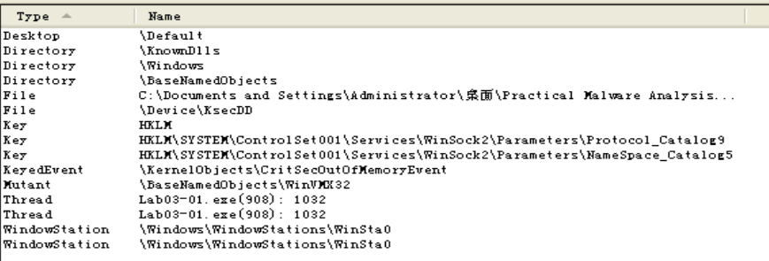

**DLL：**

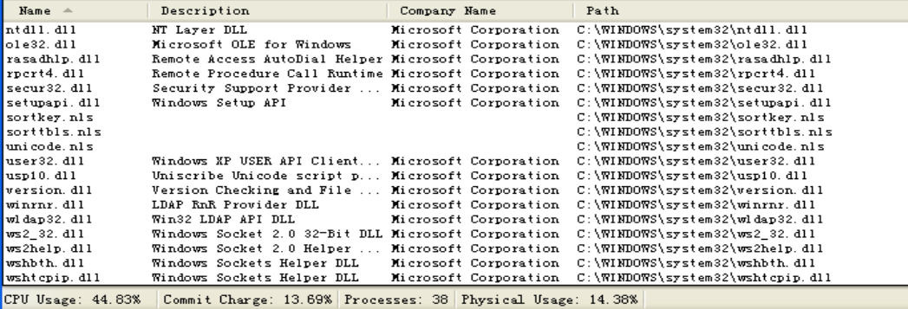

可以发现该恶意代码创建了一个名为 `WinVMX32` 的互斥量，并且使用了一些具有联网功能的 DLL，如 `ws2_32.dll` 和 `wshtcpip.dll`。

为了寻找更多信息，我们使用 `process Monitor` 设置过滤器，以观察该样本是否修改了系统或者注册表。

具体条件如下，分别是进程名、写文件操作和写注册表操作，以此定位恶意代码的行为：

```shell
ProcessName is Lab03-01.exe
Operation is WriteFile
Operation is RegSetValue
```

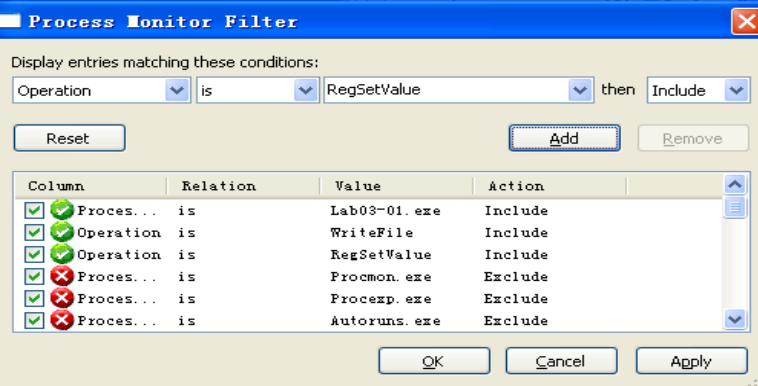

筛选后结果如下：

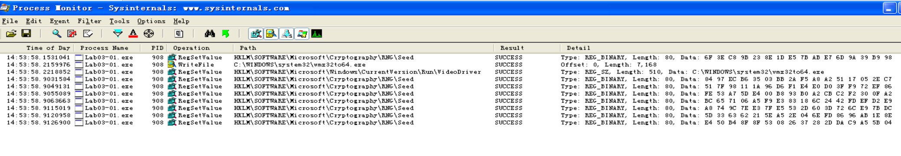

其中若干个以 `seed` 结尾的均为无效噪声，重点关注 2 和 3：

第二条是文件写入操作，点击查看相关操作记录，可以看到，文件向 `C:\WINDOWS\system32\vmx32to64.exe` 中写入了 7168 字节。

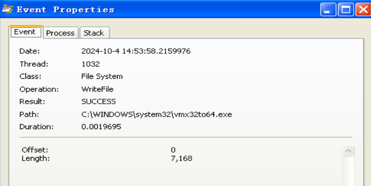

按照给定的路径可以找到该文件，对比两者的大小，发现完全一致；并且查看文件哈希值，也完全相同。**说明该样本复制了自身到系统的上述位置，而且由于写死了复制的文件名，可以作为主机被感染的迹象。**

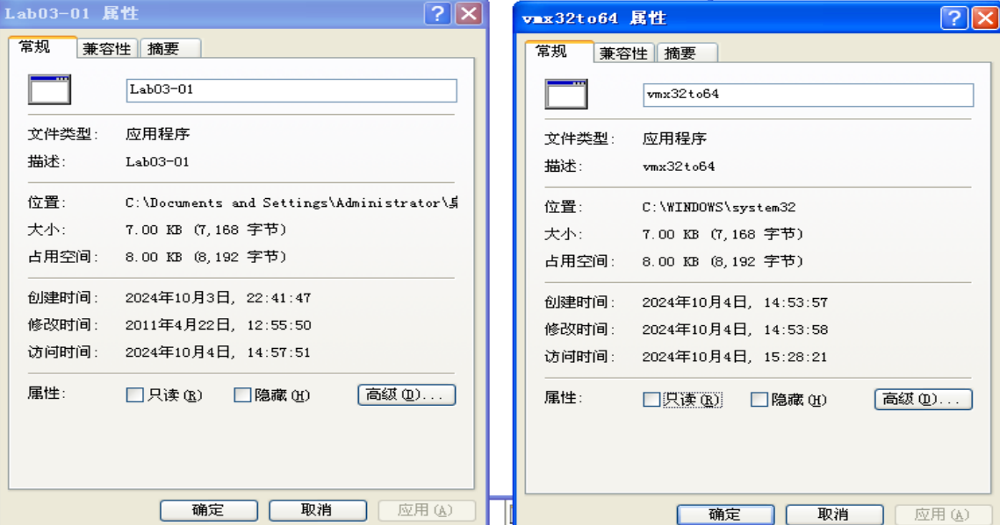

同样查看第三条记录，发现样本向注册表写入了信息：

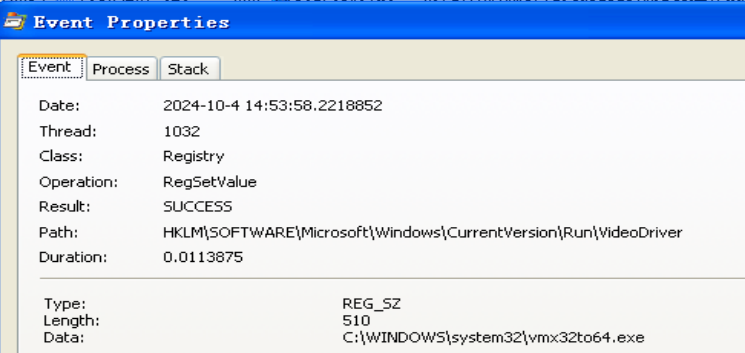

新建的注册表位于 `HKLM\SOFTWARE\Microsoft\Windows\CurrentVersion\Run`，名为 `VideoDriver`。用 `regedit` 打开注册表，定位到相应位置，确实能够看到该注册表项，说明该文件将 `vmx32to64.exe` 写入了开机启动项中。

据此可得出结论，**该恶意代码创建了一个名为 `WinVMX32` 的互斥量，复制自身到 `C:\Windows\System32\vmx32to64.exe`，并安装自己到系统自启动项中，通过创建注册表键值 `HKLM\SOFTWARE\Microsoft\Windows\CurrentVersion\Run\VideoDriver`，并将其设置为复制副本的位置。**

> Q3.这个恶意代码是否存在一些有用的网络特征码？如果存在，它们是什么？

打开 `ApateDNS`，可以看到恶意代码执行了 DNS 请求，持续访问 <www.praticalmalwareanalysis.com>，与上述字符串列表匹配。

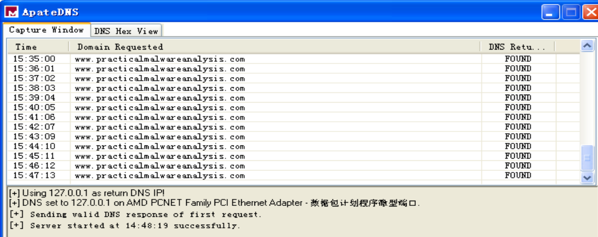

同时查看 `netcat` 结果，发现 80 端口无信息，443 端口有一堆乱码：

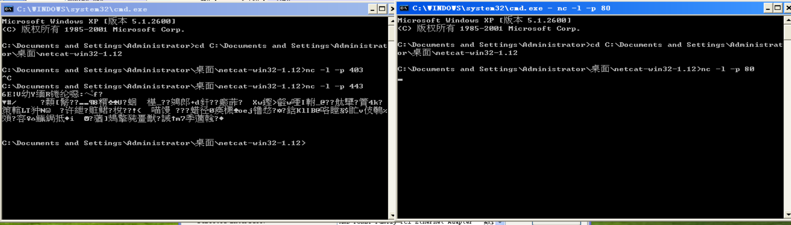

打开 WireShark 可以看到，其向该域名对应的服务器源源不断发送数据包。

分析可知，恶意代码在进行 `www.practicalmalwareanalysis.com` 的域名解析后，持续地广播大小为 256 字节的数据包，其中包含看似随机的二进制数据。

#### 2.lab3-2

**使用动态分析基础技术来分析在 `Lab03-02.d11` 文件中发现的恶意代码。**


> Q1.你怎样才能让这个恶意代码自行安装？


首先使用静态分析技术，用 `PEiD` 来查看这个文件，结果如下：

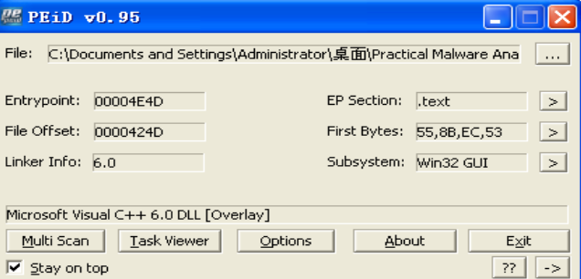

可以看到这个文件并未被加壳，只是用编译器编译过而已。

然后运行 `PEView` 工具查看导入表和导出表：

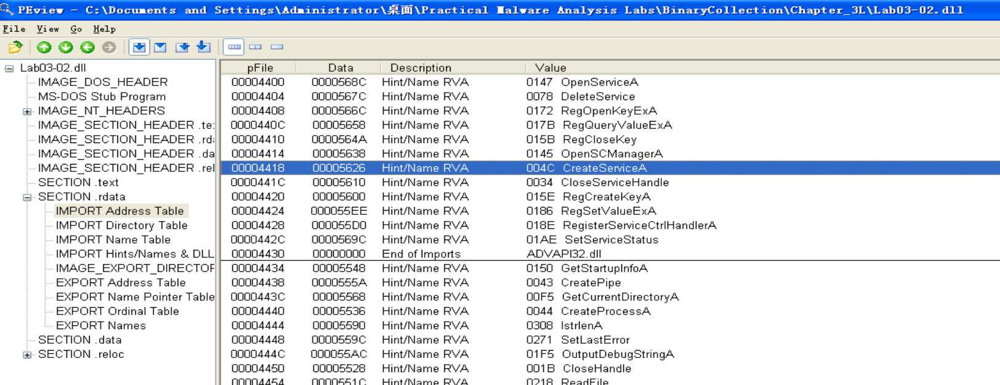

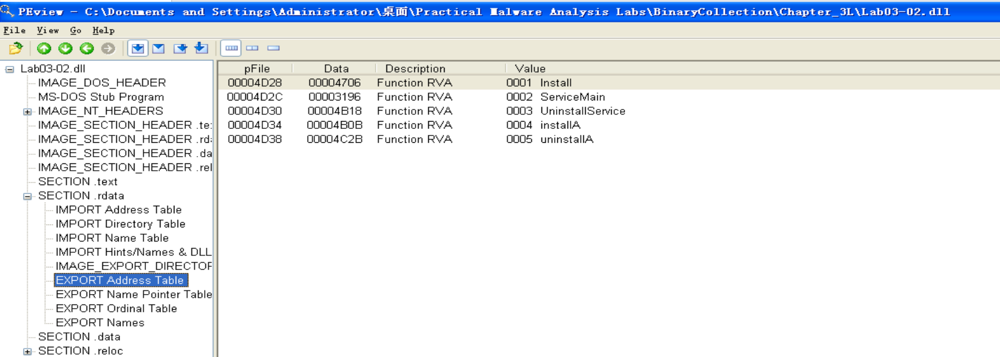

导入函数包括了一些服务操作函数，如 `CreateServiceA` 等，而导出函数包含 `ServiceMain`，推测这个恶意代码需要安装成一个服务，使其能够正常运行。

接着使用 `strings` 工具查看字符串，发现 有关注册表位置、域名等字符串，如 `Intranet Network Awareness (INA+)` ，更加证实了上述推测。

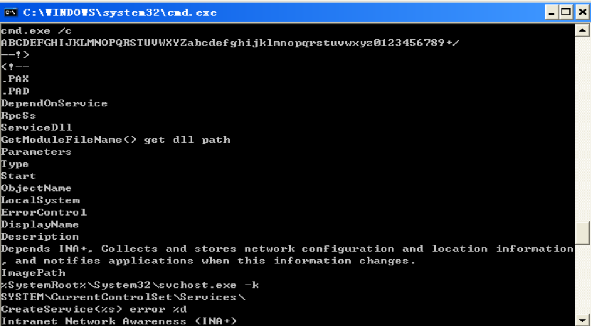

我们需要为该样本安装一个服务，首先使用 `Regshot` 保存注册表状态，然后利用 `rundll32.exe` 工具, 使用以下命令运行恶意代码导出的 `installA` 函数，便可将恶意代码安装为一个服务。：

```assembly
rundll32.exe Lab03-02.dll,installA
```

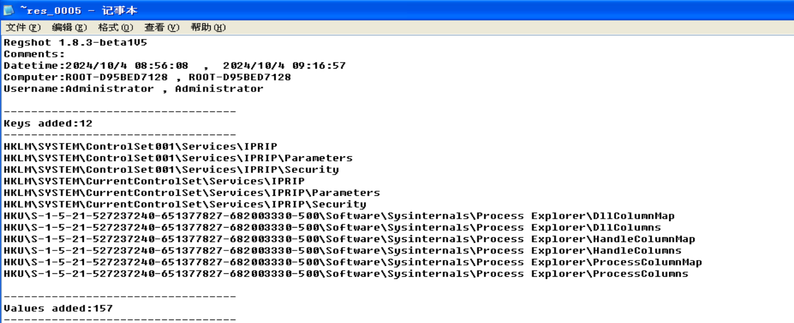

**发现恶意代码将自身安装为 `IPRIP` 服务，并把 `ImagePath` 设置为 `svchost.exe` 路径以执行它，这意味着恶意代码会在 `svchost.exe` 所在进行启动。而且，其中的 `Description` 和 `DisplayName` 可以作为该样本的识别特征。**


> Q2.在安装之后，你如何让这个恶意代码运行起来？

通过上述分析，要运行恶意代码，只要使用 `net` 命令执行 `net start IPRIP`，便可启动恶意代码安装的服务，也就相当于开始运行这个恶意代码：

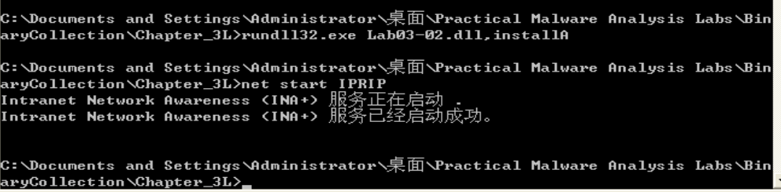

我们也可以在 `运行` 中输入 `services.msc` 查看服务，结果如下，说明服务确实启动了：

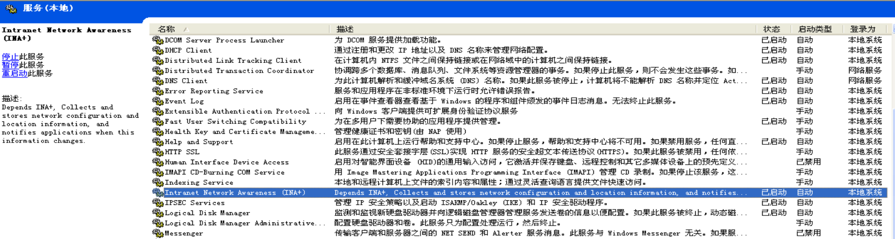

> Q3.你怎么能找到这个恶意代码是在哪个进程下运行的？

下面借助 `Process Explorer` 来确定哪个进程正在运行服务，查找 `Lab03-02.dll`，结果如下：

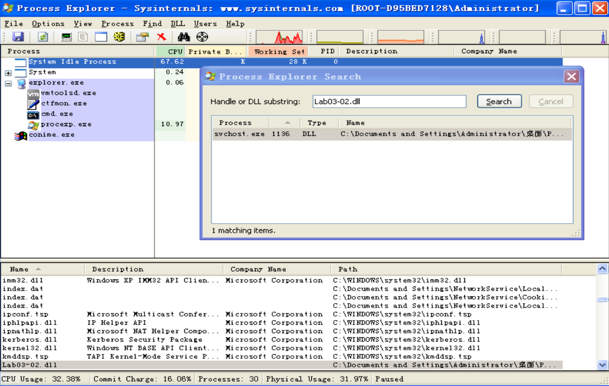

可以看到该恶意代码依附于“svchost.exe”运行，同时可以看到，该进程的 PID 为 1136。

> Q4.你可以在 `procmon` 工具中设置什么样的过滤器，才能收集这个恶意代码的信息？

我们知道该恶意代码依附运行的进程的 ID 为 1136，因此设置如下过滤器，即可收集该恶意代码的信息。

```assembly
PID is 1136
```

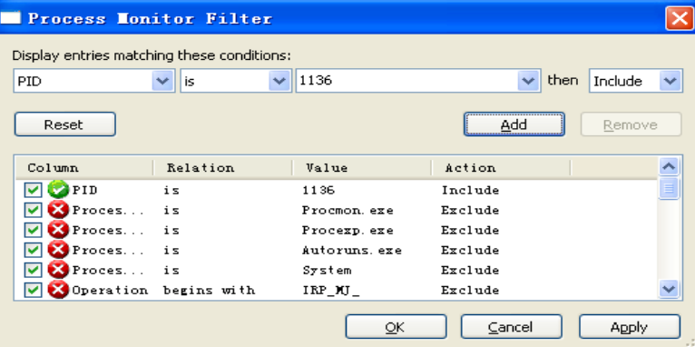


> Q5.这个恶意代码在主机上的感染迹象特征是什么？

默认情况下，恶意代码将安装为 `IPRIP` 服务，显示的服务名称为 `Intranet Network Awareness(INA+)`，描述为 `"Depends INA+, Collects and stores network configuration and location information, and notifies applications when this information changes"。`

它将自身持久地安装在注册表中``HKLM\SYSTEM\CurrentControlSet\Services\IPRIP\Parameters\ServiceDll:%CurrentDirectory%\Lab03-02.dll`。


> Q6.这个恶意代码是否存在一些有用的网络特征码？

同样借助 `ApateDNS` 可以看到，恶意代码对 `practicalmalwareanalysis.com` 进行了访问。

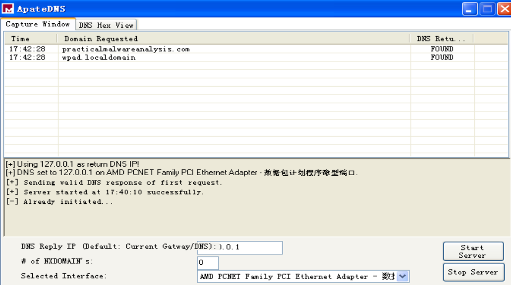

然后使用 `Netcat` 对 `80` 端口进行监控，可见恶意代码与该域名进行数据交互，发送了一个 `get` 请求。


可以得出结论：**恶意代码申请解析域名 `practicalmalwareanalysis.com`，然后通过 80 端口连接到这台主机，使用的协议看起来似平是 `HTTP` 协议。它在做一个 `GET` 请求 `serve.html`，使用的用户代理为 `%ComputerName% Windows XP 6.11`。**

#### 3.lab3-3

**在一个安全的环境中执行 `Lab03-03.exe` 文件中发现的恶意代码，同时使用基础的动态行为分析工具监视它的行为。**


> Q1.当你使用 `Process Explorer` 工具进行监视时，你注意到了什么？

首先使用静态分析技术，用 `PEiD` 来查看这个文件，结果如下：

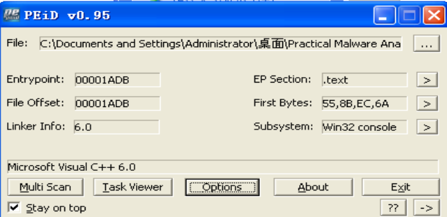

可以看到这个文件并未被加壳，并且是由 "Visual C++6.0" 编译。

接着使用 `Strings` 查看该文件字符串，可以发现，该文件中 **含有大量的字母 A**，可以作为 yara 检测的一个规则。

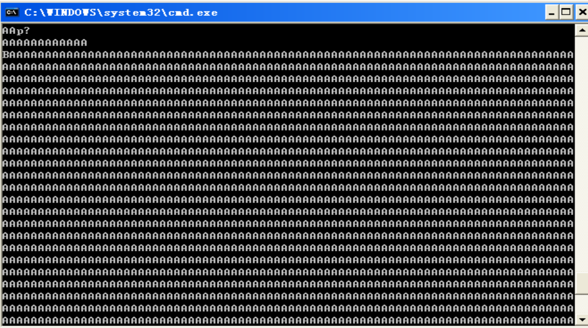

然后先打开 `Process Explorer` 软件监视、打开 `Process Monitor` 清除所有事件再开启捕捉，最后运行 Lab03-03.exe，观察 Process Explorer：


可以看到，该文件除创建自己的进程外，还创建了一个子进程 `svchost.exe`，而 Lab03-03.exe 则自行退出，仅剩子进程独立运行。而正常情况下，`svchost.exe` 应当是 services.exe 的子进程，这一点很可疑。


> Q2.你可以找出任何的内存修改行为吗？

下面对该进程进行进一步分析。右键选择 Properties-> Strings，查看磁盘与内存中的字符串：

<div align="center">
  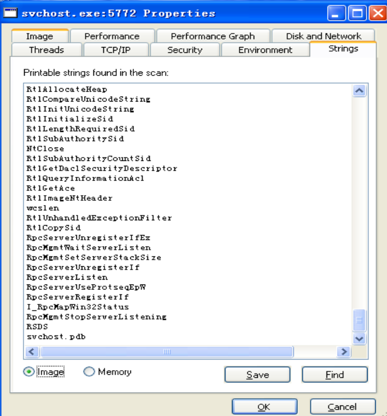
  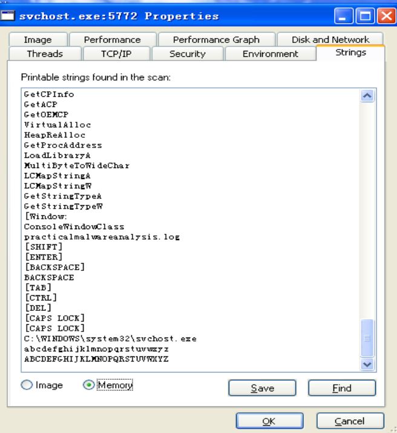
</div>


发现两者差别很大，内存中多出了 `practicalmalwareanalysis.log` 和 `[SHIFT]、[ENTER]、[BACKSPACE]` 等不字符串，而这些字符串通常不应该在 `svchost.exe` 中出现。基于以上字符，可以判断恶意代码篡改了内存，并且可以推测应该是一个敲击键盘的记录器。


> Q3.这个恶意代码在主机上的感染迹象特征是什么？


由上述分析，该恶意代码 **创建了一个 `practicalmalwareanalysis.log` 日志文件**，`[SHIFT]、[ENTER]、[BACKSPACE]` 等是键盘按键事件，实现了一个键盘记录器的窃听效果，此文件可以作为感染迹象特征。


> Q4.这个恶意代码的目的是什么？

在 `Process Explorer` 中可知 `svchost.exe` 的 PID 为 5772，我们使用 `Process Monitor` 工具来探测，添加如下几个过滤器：

```assembly
PID is 5772
```

建立一个记事本，使用键盘键入几个字符，观察 `Process Monitor`，可以看到多了许多 `CreateFile` 和 `WriteFile` 操作。


同时也可以看到文件创建的路径是 Lab03-03.exe 所在路径，按照该路径去打开，可以看到 `practicalmalwareanalysis.log` 文件。打开该日志文件，可以看到刚才写在记事本中的内容，可以发现果然是击键的记录。


综上所述，**这个程序在 `svchost.exe` 进程上执行了进程替换，来启动一个击键记录器。**

#### 4.lab3-4

**使用基础的动态行为分析工具来分析在 `Lab03-04.exe` 文件中发现的恶意代码。**


> Q1.当你运行这个文件时，会发生什么呢？

首先进行静态分析，使用 `PEID` 打开这个样本，结果如下：

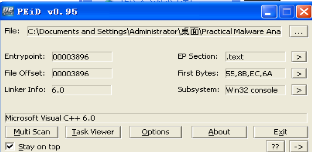

可以看到该文件没有加壳迹象。

下面使用 `Strings` 分析其字符串，如图所示：

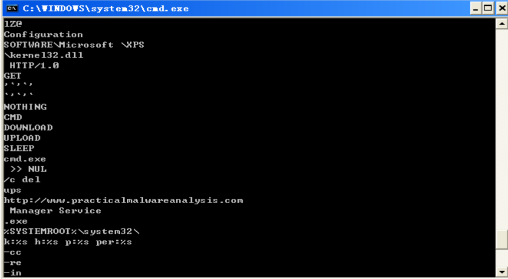

可以看到，有许多命令行参数，如 `-cc、-re、-in、k:%s h:%s p:%s per:%s` 等；有许多与系统命令有关的字符串，如 `cmd.exe、/c del、CMD、SLEEP、DOWNLOAD、UPLOAD` 等；还有可疑域名 <http://www.practicalmalwareanalysis.com> 等。

接着我们先启动 `Process Monitor` 监听程序，再运行 `Lab03-04.exe`，可以看到几秒后，文件消失了。

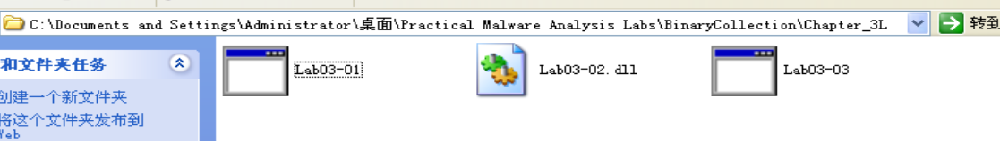

> Q2.是什么原因造成动态分析无法有效实施？

我们怀疑可能需要提供一个命令行参数，或者这个程序的某个部件缺失了。

根据上述静态分析，推测恶意代码使用命令行对自身进行删除，防止其被动态分析，设置如下的过滤器：

```shell
Process Name is Lab03-04.exe
Operation is Process Create
```

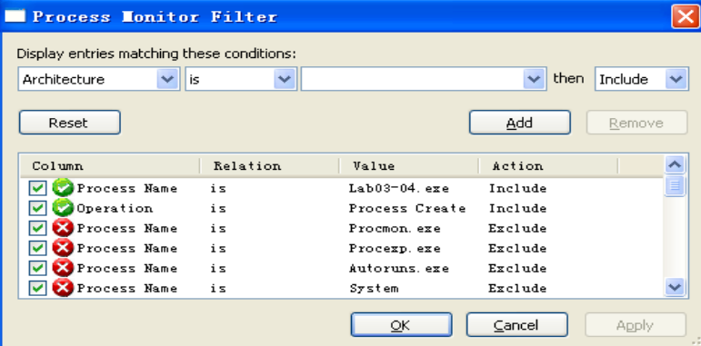

筛选后果然发现了其创建进程来删除自身：

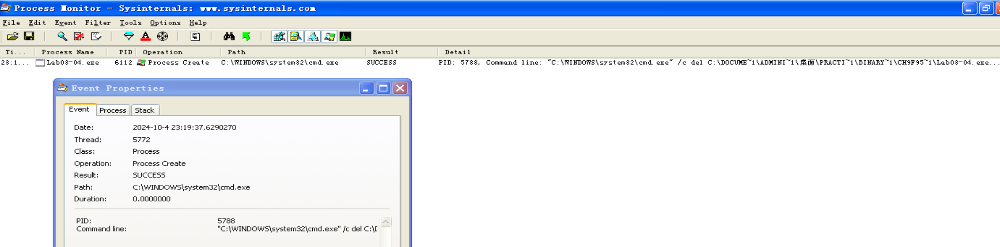

可以发现它通过 Process Create 操作，执行以下命令：

```shell
"C:\WINDOWS\system32\cmd.exe" /c del C:\DOCUME~1\ADMINI~1\桌面\PRACTI~1\BINARY~1\CH9F95~1\Lab03-04.exe >> NUL
```

通过该命令，恶意代码将自身删除。

> Q3.是否有其他方式来运行这个程序？

尝试使用命令行运行该样本，并使用在字符串列表中显示的一些命令行参数，比如 `-in`，但这样做却没有得到有效的结果，需要更深入的分析。

### （二）yara 编写与分析

#### 1.yara 编写

这次 yara 编写和之前的大同小异，就不再叙述，直接给出完整代码：

```yara
private rule isMZ_PE {
    meta:
        description = "It is a PE file"
    condition:
        filesize <10MB and uint16(0) == 0x5A4D and uint32(uint32(0x3C)) == 0x00004550
        // 文件大小小于10MB，文件头的前两个字节为MZ，PE头的偏移地址处的四个字节为PE标志
}

// Lab03-01
rule Lab03_01_exe {
    meta:
        description = "It may like Lab03-01.exe"
    strings:
        $s1 = "vmx32to64.exe"
        $s2 = "WinVMX32-"
        $s3 = "StubPath"
        $s4 = "SOFTWARE\\Classes\\http\\shell\\open\\commandV"
        $s5 = "Software\\Microsoft\\Active Setup\\Installed Components\\"
        $s6 = "www.practicalmalwareanalysis.com"
        $s7 = "VideoDriver"
        $s8 = "AppData"
    condition:
        isMZ_PE and all of them
}

// Lab03-02
rule Lab03_02_dll {
    meta:
        description = "It may like Lab03-02.dll"
    strings:
        $s1 = "IPRIP"
        $s2 = "svchost.exe"
        $s3 = "OpenService"
        $s4 = "CreateService"
        $s5 = "RegOpenKeyEx"
        $s6 = "RegQueryValueEx"
        $s7 = "cmd.exe"
        $s8 = "Lab03-02.dll"
        $s9 = "practicalmalwareanalysis.com"
    condition:
        isMZ_PE and all of them
}

// Lab03-03
rule Lab03_03_exe {
    meta:
        description = "It may like Lab03-03.exe"
    strings:
        $s1 = "\\svchost.exe"
        $s2 = "Sleep"
        $s3 = "ntdll.dll"
    condition:
        isMZ_PE and all of them
}

// Lab03-04
rule Lab03_04_exe {
    meta:
        description = "It may like Lab03-04.exe"
    strings:
        $s1 = "/c del "
        $s2 = "cmd.exe"
        $s3 = " >> NUL"
        $s4 = "SOFTWARE\\Microsoft \\XPS"
        $s5 = "HTTP/1.0"
        $s6 = "DOWNLOAD"
        $s7 = "UPLOAD"
        $s8 = "http://www.practicalmalwareanalysis.com"
    condition:
        isMZ_PE and all of them
}
```

#### 2. 运行

把上述 Yara 规则保存为 `lab3.yar`, 然后执行检查，可以看到，所有样本均被检出。**Yara 规则编写成功！**

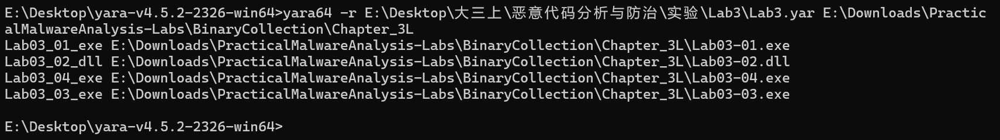

#### 3. 测试执行效率

接下来测试规则的执行效率，我选择编写一个 python 脚本、执行扫描和时间统计，代码如下：

```python
import os
import time

# 获取程序开始时间
start_time = time.time()

os.system(r"E:\Desktop\yara-v4.5.2-2326-win64\yara64.exe -r E:\Desktop\大三上\恶意代码分析与防治\实验\Lab3\Lab3.yar E:\Downloads")

# 获取程序结束时间
end_time = time.time()

# 计算并输出程序运行时间
elapsed_time = end_time - start_time
print(f"程序运行时间: {elapsed_time} 秒")
```

运行结果如下，**我这个文件夹大小为 18.3GB，有 3674 个文件、338 个文件夹，而运行时间为 57.86s。**

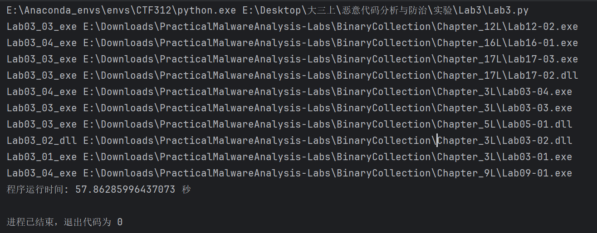

通常来说，高效的 YARA 规则条件，只包含简单的字符串匹配条件、简单的正则表达式条件等，而效率较低的 yara 规则通常包括复杂的逻辑条件、大型字符串、深度递归以及复杂的正则表达式等。在本次实验中，我通过以下三个方法优化了性能，因而效率较高。

> - 定义全局规则，缩小检查范围。
> - 选择筛选条件时，尽可能是有代表性的，从而减少条件的数量。
> - 条件尽可能简单，而且不使用 nocase 这种大小写不区分的修饰符降低效率。

## 四、实验结论及心得体会

---

在本次实验中，我学习了理论课上讲的动态分析技术，并且尝试将静态分析与动态分析相结合，获得了许多宝贵的实践经验。

通过使用`Process Monitor`和`Process Explorer`等动态分析工具，我学会了实时监控和分析恶意代码，使我能够直观地观察到病毒运行时的行为，例如文件操作、注册表修改和网络通信等。

在此次实验中，我编写了多个针对恶意程序的Yara规则，进一步学习了如何提取恶意代码的关键特征并转化为规则，使恶意软件的检测更加高效和精确。

另外，通过本次实验，也认识到了自己作为一名信息安全专业学生的责任，增强了我对信息安全领域的热情和信心，希望最后我能够熟练掌握病毒分析的方法和技巧。
