<div align='center'>
<b> <font face='微软雅黑' size='6'> 恶意代码分析与防治技术课程实验报告 </font> </b>
</div>


<div align='center'>
<b> <font font face='微软雅黑' size='6'> 实验四 </font> </b>
</div>


<div>
<font face='宋体' size='6'>&nbsp;&nbsp;&nbsp;&nbsp; 学 院：网络空间安全学院 </font> <br>
<font face='宋体' size='6'>&nbsp;&nbsp;&nbsp;&nbsp; 专 业：信息安全 </font> <br>
<font face='宋体' size='6'>&nbsp;&nbsp;&nbsp;&nbsp; 学 号：2212998 </font> <br>
<font face='宋体' size='6'>&nbsp;&nbsp;&nbsp;&nbsp; 姓 名：胡博浩 </font> <br>
<font face='宋体' size='6'>&nbsp;&nbsp;&nbsp;&nbsp; 班 级：信息安全 </font> <br>
</div>

## 一、实验目的

---

1. 完成教材上 lab5 的实验内容 。
2. 在样本分析结果的基础上，编写样本的 Yara 检测规则。
3. 尝试编写 IDA Python 脚本来辅助样本分析。

## 二、实验原理

---

本次实验采用了业界领先的 IDA Pro 反汇编软件及其内嵌的 IDA Python 插件，针对选定的病毒样本展开深入的反汇编与二进制分析。IDA Pro 以其高效的交互式设计，将晦涩难懂的二进制代码巧妙转化为易于解读的汇编语言，大幅提升了分析效率。得益于 IDA Python 插件的支持，我们可以通过 Python 脚本自动化执行一系列复杂分析任务，极大简化了分析流程。为确保实验过程的安全性和防止任何潜在风险的扩散，所有病毒样本均在虚拟机环境中进行测试。

## 三、实验过程

---

### （一）完成 Lab5 的题目

#### 1. Lab5-1

**只用 `IDA Pro` 分析在文件 `Lab05-01.dll` 中发现的恶意代码。这个实验的目标是给你一个用 `IDA Pro` 动手的经验。如果你已经用 `IDA Pro` 工作过，你可以选择忽略这些问题，而将精力集中在逆向工程恶意代码上。**

> Q1.`DllMain` 的地址是什么?

使用 `IDAPro` 加载 `Lab05-01.dll`, 在函数窗口搜索 `DllMain`，即可定位到该函数：

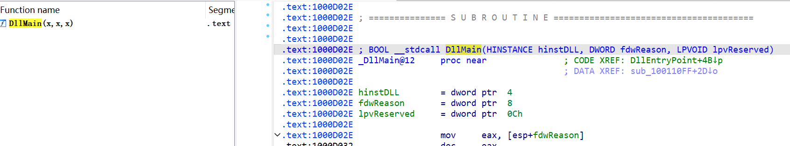

如图所示，可以看到 **DllMain 在.text 节的 0x1000D02E 处**。

> Q2.使用 `Imports` 窗口并浏览到 `gethostbyname`，导入函数定位到什么地址?

通过菜单的 View -> Open Subviews -> Imports 打开 `Imports` 窗口，搜索 `gethostbyname`，可以定位到该函数：

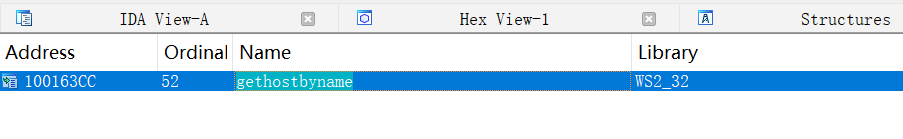

双击即可跳到他的地址，如下图所示：

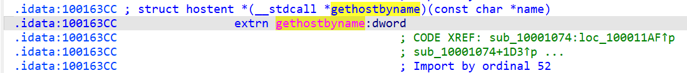

可以发现 **gethostbyname 在.idata 节的 0x100163CC 处**。

> Q3.有多少函数调用了 `gethostbyname`?

在此函数处，按下 X 即可查看交叉引用：

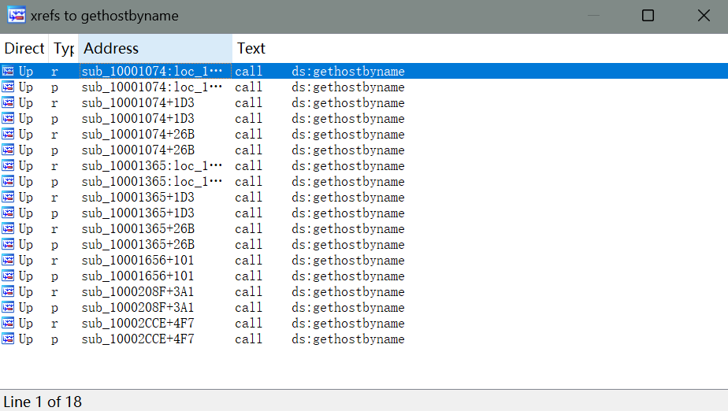

一共 18 个结果，仔细查看该记录，可以看到 IDA 将 `p`（被调用的引用）与 `r`（被读取的引用）都予以计算，故而是 9 次引用。而地址栏中的 `+` 与 `.` 都是表示地址偏移，属于同一函数，因此 **gethostbyname 被 5 个不同的函数调用了 9 次**。


> Q4.将精力集中在位于 `0x10001757` 处的对 `gethostbyname` 的调用，你能找出哪个 DNS 请求将被触发吗？

按 G 输入跳转的地址 `0x10001757`，定位到该处：

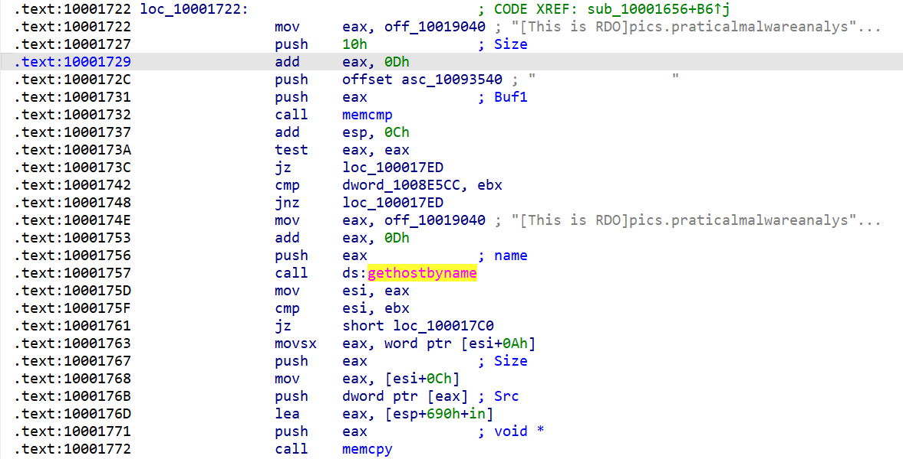

可以看到，该函数使用了一个参数，即字符串[This is PDO\\]pics.practicalmalwareanalysis.com。将其放入 eax 寄存器后，又增加了 0Dh。经过计算，增加之后该地址指向字符串中的 `p`。因此，**如果在 0x10001757 处对 gethostbyname 调用成功，恶意代码会发起对 pics.practicalmalwareanalysis.com 的 DNS 请求**。

> Q5.IDA Pro 识别了在 `0x10001656` 处的子过程中的多少个局部变量？

同理，按 G 输入地址即可跳转到 `0x10001656`：

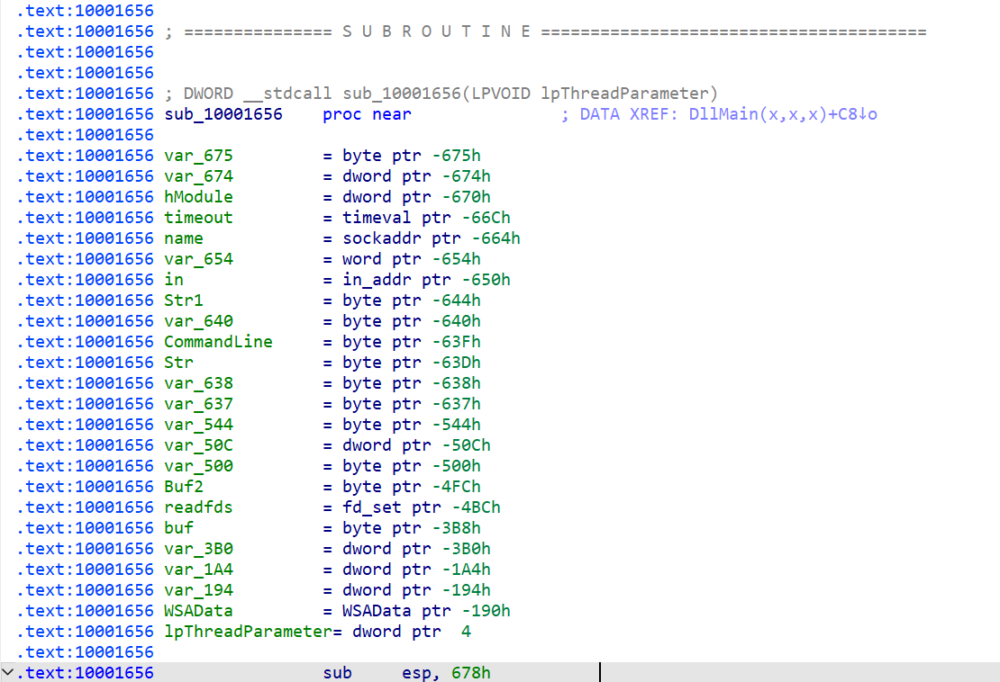

可以看到许多变量，除了最后一个是传入的参数外，其余的均为局部变量。因此 **在 0x10001656 处的函数中，IDA Pro 识别出 23 个局部变量。**

> Q6.IDA Pro 识别了在 `0x10901556` 处的子过程中的多少个参数？

根据上图分析，最后一个变量 lpThreadParameter 即为参数。因此 **在 0x10001656 处的函数中，IDA Pro 识别出 1 个参数。**

> Q7.使用 `Strings` 窗口，来在反汇编中定位字符串 `\cmd.exe /c`。它位于哪？

通过菜单的 View -> Open Subviews -> Strings 打开 `Strings` 窗口，搜索字符串 `\cmd.exe /c`：

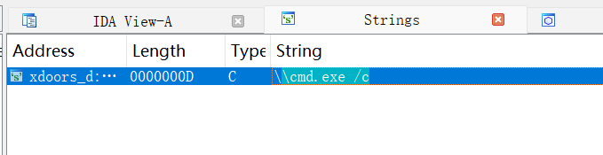

双击跳转，即可查看其和附近的字符串：

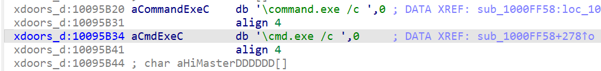

因此，**字符串 \cmd.exe /c 出现在 0x10095B34 处**。

> Q8.在引用 `\cmd.exe /c` 的代码所在的区域发生了什么？

按 x 查看该字符串的交叉引用：

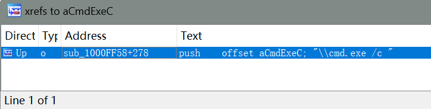

有且仅有一处引用，而且可以看到该字符串被压栈。跳转被引用的位置：


仔细查看代码，有诸如 recv、quit、exit、cd 等指令，如下图所示：

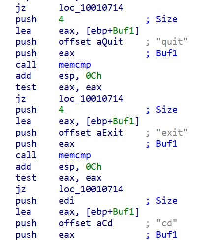

并且还有可疑字符串 aHiMasterDDDDDD：

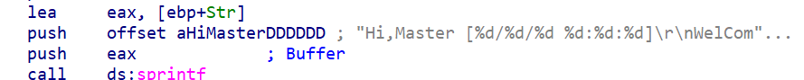

双击进入字符串存放位置：

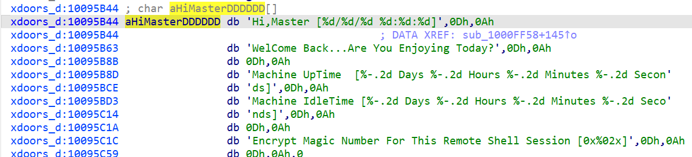

看到可疑字样 `This Remote Shell Session`，因此 **代码看起来是为攻击者开启一个远程 shell 会话**。

> Q9.在同样的区域，在 `0x100101C8` 处，看起来好像 `dword_1008E5C4` 是一个全局变量，它帮助决定走哪条路径。那恶意代码是如何设置 `dword_1008E5C4` 的呢？（提示：使用 `dword_ 1998E5C4` 的交叉引用。）

按 G 输入 `0x100101C8` 跳转到该地址：

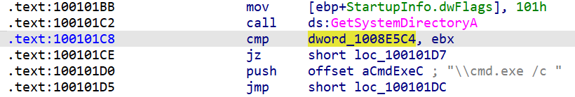

按 x 查看交叉引用：

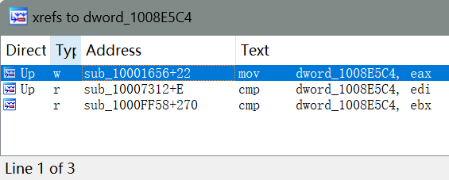

可以观察到被引用了 3 次，只有 `mov` 修改了其值。双击跳转到 mov 处代码：

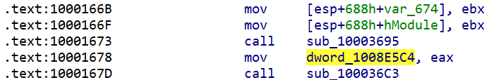

观察代码可以发现其值就是函数 sub_10003695 的返回值。双击进入该函数：

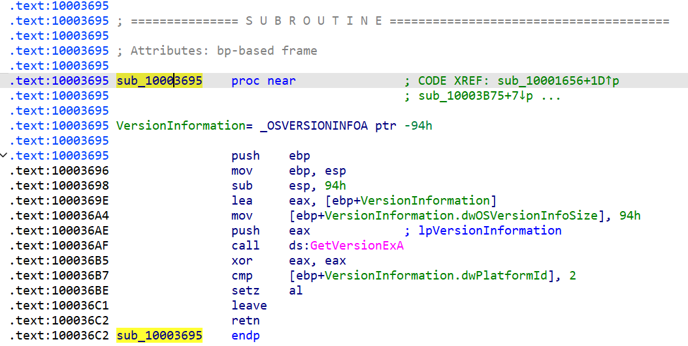

仔细查看代码，只是简单的判断当前操作系统是否为 Windows 2000 或更高版本，根据微软的文档，我们得知通常情况下 dwPlatformId 的值为 2。因此 **操作系统版本号被保存在了 dword_1008E5C4 中**。

> Q10.在位于 `0x1000FF58` 处的子过程中的几百行指令中，一系列使用 `memcmp` 来比较字符串的比较。如果对 `robotwork` 的字符串比较是成功的（当 `memcmp` 返回 0），会发生什么？

按 G 输入 `0x1000FF58` 定位到该处，往下看在 0x10010452 可以看到与 `robotwork` 比较的 `memcmp`。

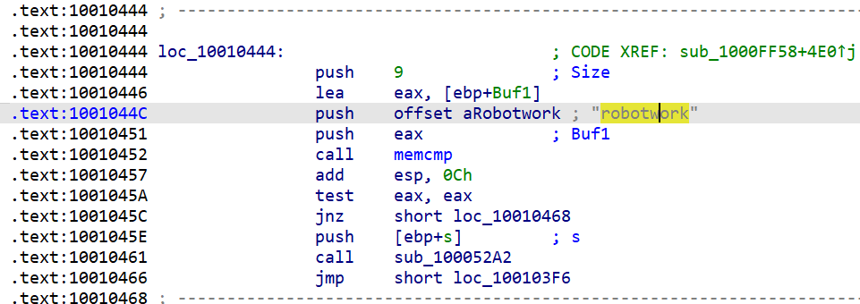

如果 eax 和 robotwork 相同，则 memcmp 的结果为 0，即 eax 为 0。test 的作用和 and 类似，只是不修改寄存器操作数，只修改标志寄存器，因此 test eax, eax 语句的含义是，若 eax 为 0，那么 test 的结果为 ZF = 1。而 jnz 检验的标志位就是 ZF , 若 ZF = 1，则不会跳转，继续向下执行，直到 call sub_100052A2。

进入函数 sub_100052A2：

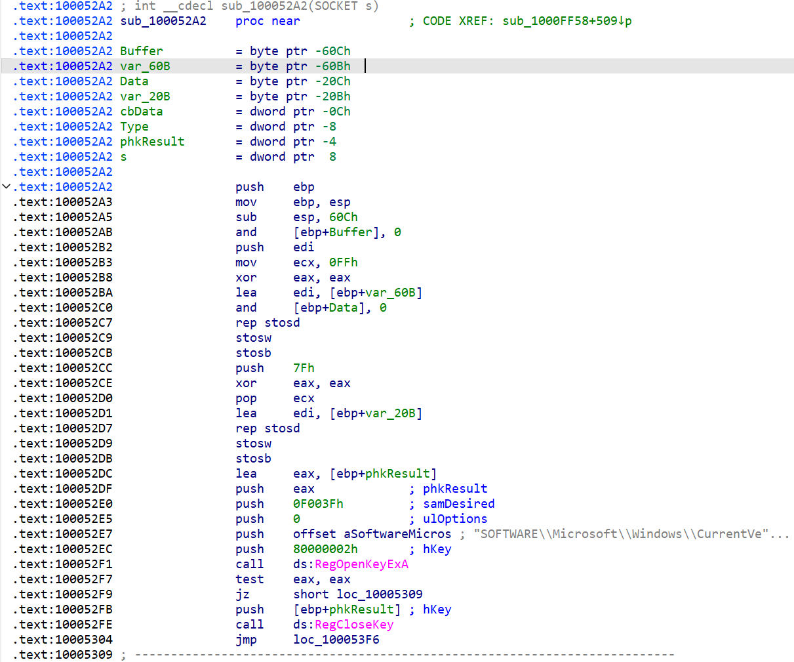

可以看到其参数为 socket 类型，即上图中 push 的 [ebp+s]。继续阅读可以发现，后面 aSoftWareMicros 处的值为”SOFTWARE\Microsoft\Windows\CurrentVersion“，并且调用 RegOpenKeyEx 函数读取该注册表值。

另外其也调用了 sub_100038EE 函数，如下图所示，这个函数调用了 send 和 free，用于发送 `\r\n\r\n[Robot_WorkTime :] %d\r\n\r\n` 等信息：

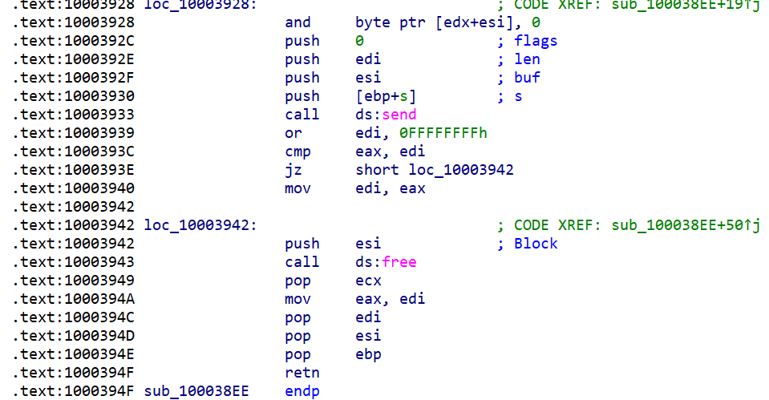

因此总结，**注册表项 HKLMI\SOFTWARE\Microsoft\Windows\Currentversion\WorkTime 和 WorkTimes 的值会被查询，并通过远程 shell 连接发送出去**。

> Q11.`PSLIST` 导出函数做了什么？

在 Exports 窗口找到 `PSLIST`：

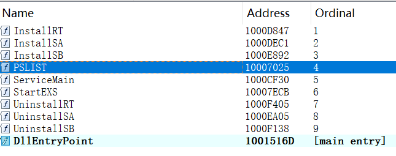

双击进入：

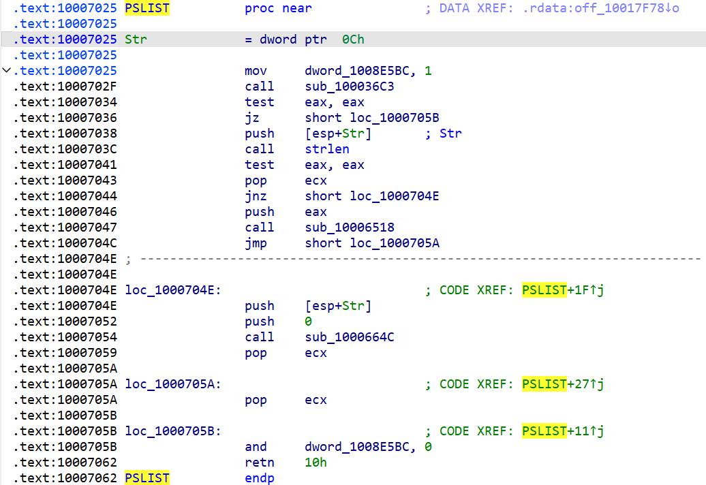

发现其调用了许多函数：首先调用 sub_100036C，检查操作系统的版本是 Windows Vista/7 或是 Windows XP/2003/2000；然后调用 sub_1000664C、sub_10006518，这两个函数都有 CreateToolhelp32Snapshot 函数，从相关字符串和 API 调用来看，用于获得一个进程列表，然后通过 send 将进程列表通过 socket 发送。

因此，**PSLIST 导出项可以通过网络发送进程列表，或者寻找该列表中某个指定的进程名并获取其信息**。

> Q12.使用图模式来绘制出对 `sub_10004E79` 的交叉引用图。当进入这个函数时，哪个 API 函数可能被调用？仅仅基于这些 API 函数，你会如何重命名这个函数？

在函数窗口中搜索 `sub_10004E79` 函数并跳转：

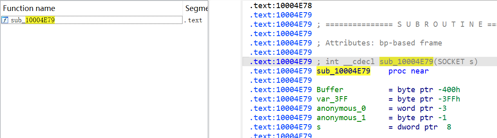

通过 View-> Graphs-> User xrefs chart 得到交叉引用图：

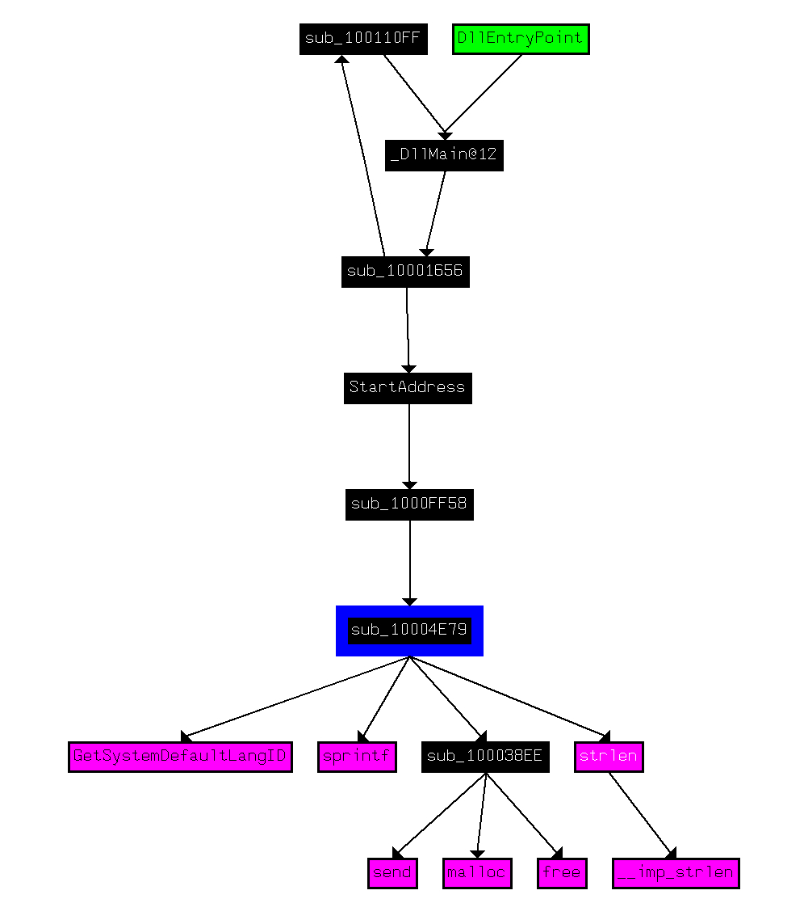

**主要调用的 API 为 GetSystemDefaultLangID、send 和 sprintf**。因此推测可能是通过 socket 发送语言标志，因而可以直接在函数名处右键 Rename **重命名为 send_languageID**。

> Q13.`DllMain` 直接调用了多少个 `Windows API`？多少个在深度为 2 时被调用？

在函数窗口中搜索 `DllMain` 函数并跳转：

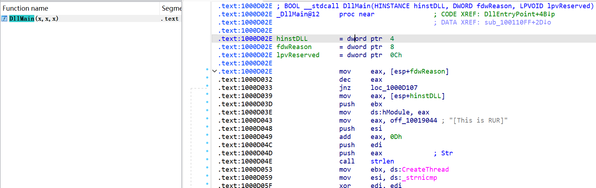

同理打开交叉引用图：

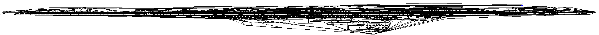

可以看到该图非常复杂，即 DllMain 调用了非常多函数。因此重新打开交叉引用图并设置递归深度为 2：

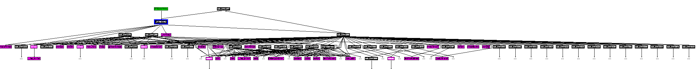

仔细观察，**DllMain 直接调用了 strncpy、strnicmp、CreateThread 和 strlen 这些 API。 进一步地，调用了非常多的 API，包括 Sleep、winExeC、gethostbyname，以及许多其他网络函数调用**。

> Q14.在 `0x10001358` 处，有一个对 `Sleep`（一个使用一个包含要睡眠的毫秒数的参数的 API 函数）的调用。顺着代码向后看，如果这段代码执行，这个程序会睡眠多久？

按 G 跳转到 `0x10001358` 处：

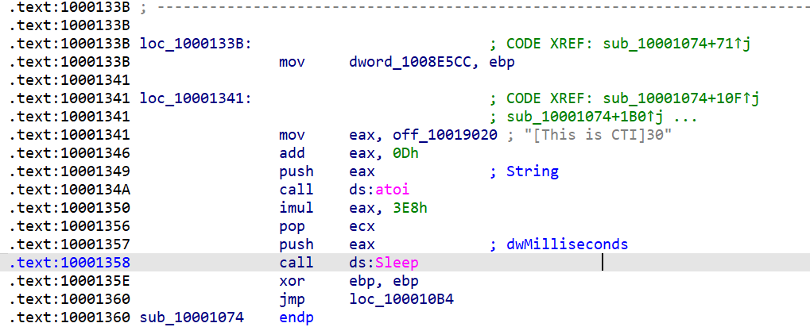

仔细观察代码，调用的 sleep 的参数为上一行 push 的 eax，而 eax 的值又来自 imul eax,3E8h 的运算结果。再往上看，可以看到，eax 是由 atoi 函数对 Str 运算得到的，也即字符串转整数。继续回溯，可以看到，Str 由 off_10019020+0Dh 位置的字符串得到，最终转换成数字 30。所以睡眠的时间应为 30*1000 = 30000（毫秒），即 30 秒。

因此，**恶意代码会休眠 30 秒**。

> Q15.在 `0x10001701` 处是一个对 `socket` 的调用。它的 3 个参数是什么？

按 G 输入 `0x10001701` 跳转到该地址：

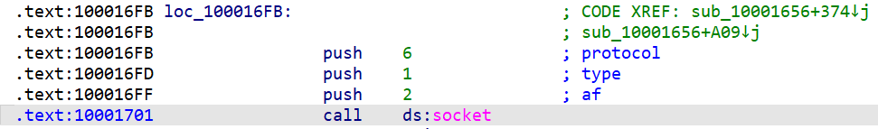

可以看到三个参数名：**protocol、type、af，值分别是 6、1 和 2**。

> Q16.使用 `MSDN` 页面的 `socket` 和 `IDA Pro` 中的命名符号常量，你能使参数更加有意义吗？在你应用了修改以后，参数是什么？

查阅 socket 的官方文档，可以确认，输入的参数含义为建立基于 IPv4 的 TCP 连接的 socket，通常在 HTTP 中使用。在数字上右键，选择 manual，分别替换成如图所示的实际的常量名。

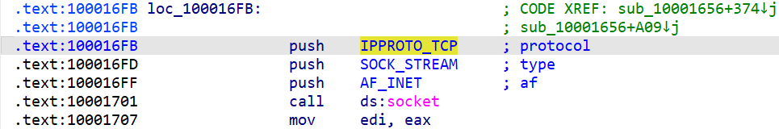

因此，**它们对应的 3 个符号常量分别是 IPPROTO_TCP、SOCK_STREAM 和 AF_INET**。

> Q17.搜索 `in` 指令（opcode 0xED）的使用。这个指令和一个魔术字符串 `VMXh` 用来进行 VMware 检测。这在这个恶意代码中被使用了吗？使用对执行 `in` 指令函数的交叉引用，能发现进一步检测 VMware 的证据吗？

通过 Search-> Text, 输入 in 并选择 Find all occurences，经过查找只有.text 0x199G61DB 处的 in eax, dx 指令符合要求：

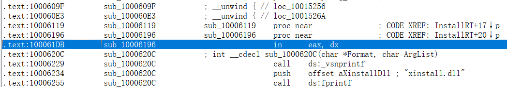

双击跳转：

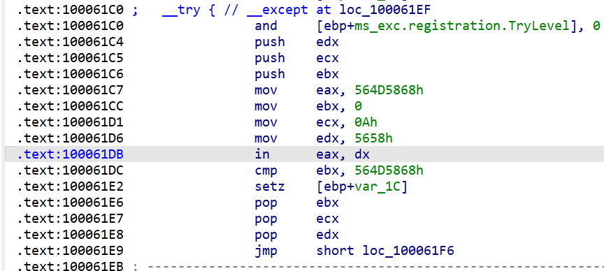

按 R 将数字转化为字符串：

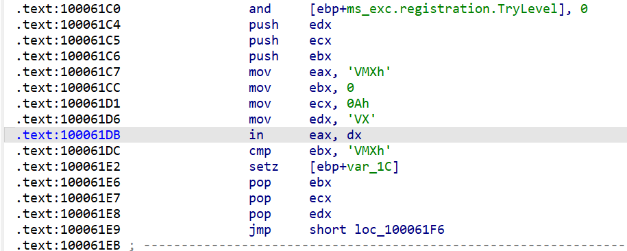

发现可疑字符 `VMXh、VX`，证明使用了反虚拟机技术。转到函数头，查看交叉引用：

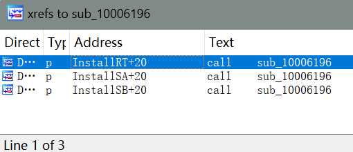

经过查找，第一个函数可以看到字符串 **”Found Virtual Machine, Install Cancel.“**，确认其使用反虚拟机技术。

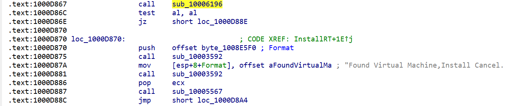

> Q18.将你的光标跳转到 `0x1001D988` 处，你发现了什么？

按 G 跳转到 `0x1001D988` 处：

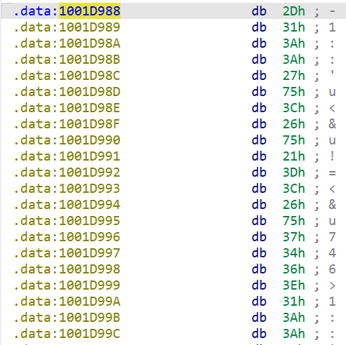

**在 0x1001D988 处可以看到一些看起来随机的数据**。

> Q19.如果你安装了 IDA Python 插件（包括 IDA Pro 的商业版本的插件），运行 `Lab05-01.dll`, 一个本书中随恶意代码提供的 IDA Pro Python 脚本，（确定光标是在 `0x1001D988` 处。）在你运行这个脚本后发生了什么？

运行 Lab05-01.py，报错如下，应该是 IDApython 版本不符：

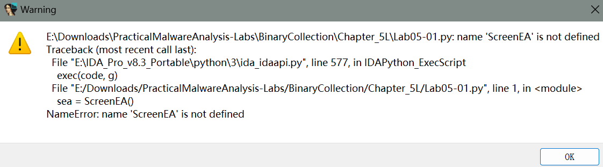

重写脚本如下：

```python
import ida_bytes

ea = idc.get_screen_ea()

for i in range(0x00, 0x50):
    b = ida_bytes.get_byte(ea+i)
    decoded_byte = b^0x55
    ida_bytes.patch_byte(ea+i, decoded_byte)
```

再次运行脚本，**这段数据被反混淆得到一个字符串**。

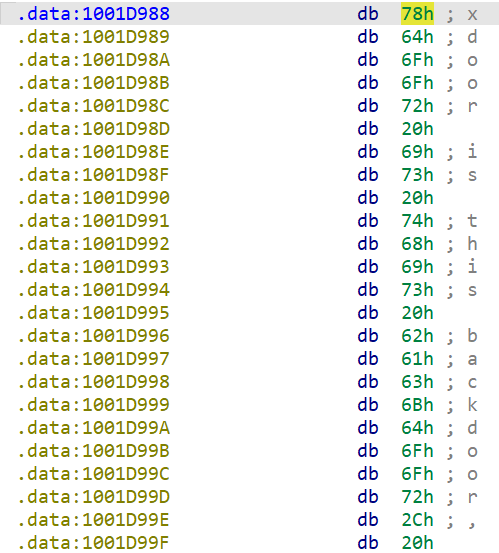

> Q20.将光标放在同一位置，你如何将这个数据转成一个单一的 ASCII 宇符串？

按下 A 键，就可以将其变为一个可读的字符串了：**xdoor is this backdoor, string decoded for practical Malware Analysis Lab :)1234**。

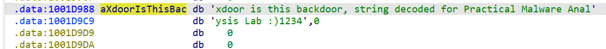

> Q21.使用一个文本编辑器打开这个脚本。它是如何工作的？

**该脚本的工作原理是, 对长度为 0x50 字节的数据，用 0x55 分别与其进行异或，然后用 PatchByte 函数在 IDA Pro 中修改这些字节。**（这里脚本已经经过我的修改，使其符合我的 IDApython 版本了……）

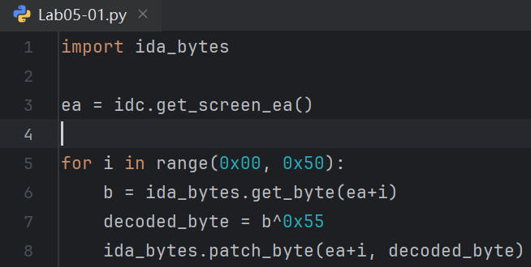

### （二）yara 编写与分析

#### 1. yara 编写

这次 yara 编写和之前的大同小异，就不再叙述，直接给出完整代码：

```yara
private rule isMZ_PE {
    meta:
        description = "It is a PE file"
    condition:
        filesize <10MB and uint16(0) == 0x5A4D and uint32(uint32(0x3C)) == 0x00004550
        // 文件大小小于10MB，文件头的前两个字节为MZ，PE头的偏移地址处的四个字节为PE标志
}

// Lab05-01
rule Lab05_01_dll {
    meta:
        description = "It may like Lab05_01_dll"
    strings:
        $s1 = "\\command.exe /c"
        $s2 = "\\cmd.exe /c"
        $s3 = "pics.praticalmalwareanalysis.com"
        $s4 = "Remote Shell Session"
        $s5 = "robotwork"
        $s6 = "socket() GetLastError reports %d"
    condition:
        isMZ_PE and all of them
}
```

#### 2. 运行

把上述 Yara 规则保存为 `lab4.yar`, 然后执行检查，可以看到，样本被检出。**Yara 规则编写成功！**

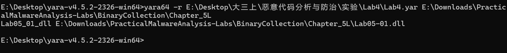

#### 3. 测试执行效率

接下来测试规则的执行效率，我选择编写一个 python 脚本、执行扫描和时间统计，代码如下：

```python
import os
import time

# 获取程序开始时间
start_time = time.time()

os.system(r"E:\Desktop\yara-v4.5.2-2326-win64\yara64.exe -r E:\Desktop\大三上\恶意代码分析与防治\实验\Lab4\Lab4.yar E:\Downloads")

# 获取程序结束时间
end_time = time.time()

# 计算并输出程序运行时间
elapsed_time = end_time - start_time
print(f"程序运行时间: {elapsed_time} 秒")
```

运行结果如下，我这个文件夹大小为 2.09GB，有 371 个文件、98 个文件夹，而运行时间为 2.24s，说明效率较高。

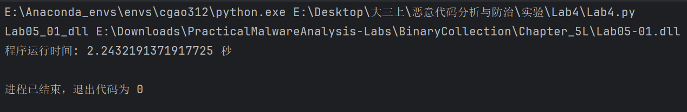

### （三）IDA python 脚本编写

#### 1. IDA python 脚本编写

为了简化安全审计和逆向工程的工作，我编写了如下脚本来辅助分析：

```python
import idaapi
import idautils
import idc

# 检查指令是否是 'jmp' 或 'call' 且操作数为寄存器类型
def is_jump_or_call_with_register(ea):
    """
    检查给定地址的助记符是否为 'jmp' 或 'call' 且操作数为寄存器类型
    """
    mnemonic = idc.print_insn_mnem(ea)
    if mnemonic not in ['jmp', 'call']:
        return False
    opnd_type = idc.get_operand_type(ea, 0)
    # 确保操作数是寄存器类型
    return opnd_type in [idaapi.o_reg, idaapi.o_phrase, idaapi.o_displ]

# 检查函数是否为库函数
def is_library_function(func_ea):
    """
    检查给定地址的函数是否为库函数
    """
    flags = idc.get_func_attr(func_ea, idc.FUNCATTR_FLAGS)
    return flags & idaapi.FUNC_LIB

# 标记不安全的函数调用并设置颜色
def judge_audit(addr):
    """
    对不安全的函数调用进行标注，并设置背景颜色
    """
    idc.set_cmt(addr, "### AUDIT HERE ###", 0)  # 添加注释
    idc.set_color(addr, idc.CIC_ITEM, 0x0000ff)  # 设置指令背景颜色

# 标记不安全函数的调用
def flag_calls(danger_funcs):
    """
    查找并标记程序中所有不安全函数的调用
    """
    count = 0
    for func in danger_funcs:
        faddr = idc.get_name_ea_simple(func)
        if faddr != idaapi.BADADDR:
            # 获取对该函数的所有交叉引用
            cross_refs = idautils.CodeRefsTo(faddr, 0)
            for addr in cross_refs:
                count += 1
                print("%s[%d] calls 0x%08x" % (func, count, addr))
                judge_audit(addr)

# 主函数
def main():
    # 遍历所有函数，排除库函数
    for func in idautils.Functions():
        if is_library_function(func):
            continue

        # 遍历函数中的所有指令
        ea = func
        func_end = idc.find_func_end(func)
        while ea != idaapi.BADADDR and ea < func_end:
            # 如果是跳转或调用且操作数是寄存器类型
            if is_jump_or_call_with_register(ea):
                print("Address: 0x{:X}, Instruction: {}".format(ea, idc.generate_disasm_line(ea, 0)))
            # 继续处理下一条指令
            ea = idc.next_head(ea)

    # 识别并标记不安全函数调用
    print("-------------------------------")
    danger_funcs = ["DllEntryPoint", "printf", "strcpy", "GetModuleFileNameExA", "Thread32Next"]
    flag_calls(danger_funcs)
    print("-------------------------------")

if __name__ == '__main__':
    main()
```

该脚本主要有两个功能：

1. **动态跳转或调用检测**，即检测汇编指令是否是 `jmp` 或 `call`，并且操作数为寄存器类型。

2. **查找和标记危险函数调用**，并为每个调用添加注释、设置背景颜色。（主要用来漏洞挖掘）

#### 2. 运行

执行该 IDApython 脚本，可以看到控制台输出了指令 `jmp` 或 `call`、以及危险函数的调用：

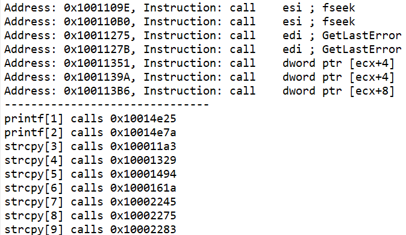

另外，在代码中危险函数也被标注了。如按 G 定位到第一个 printf 的调用 `0x10014e25` 处，可以看到该指令背景变为了红色：

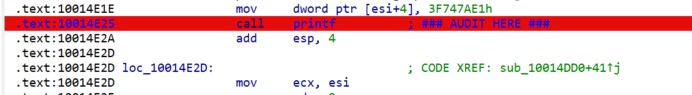

## 四、实验结论及心得体会

---

通过本次实验，我深入学习并掌握了 IDA Pro 的使用技巧，提升了对二进制文件的分析能力。在实际操作中，我不仅熟悉了 IDA 的常用快捷键及各个窗口的切换，还掌握了如何利用其反汇编和反编译功能，将复杂的二进制代码转化为更易理解的类 C 代码。

同时，我还进一步学习并实践了 yara 规则的编写，理解了如何通过 yara 规则对恶意代码进行检测和防御。

此外，我在实验中接触并学习了 IDA Python 脚本的使用。这一工具在分析过程中能够辅助自动化操作，使分析过程更加高效。

然而，在实验过程中，我也遇到了一些问题。比如由于 IDA 版本更新而导致 API 变更，实验里给的 IDApython 脚本不能使用，只能重新写一个适合版本的脚本；还有 IDA 的快捷键、右键菜单也发生了改变，只能百度搜索解决方法。
