<div align='center'>
<b> <font face='微软雅黑' size='6'> 恶意代码分析与防治技术课程实验报告 </font> </b>
</div>


<div align='center'>
<b> <font font face='微软雅黑' size='6'> 实验七 </font> </b>
</div>


<div>
<font face='宋体' size='6'>&nbsp;&nbsp;&nbsp;&nbsp; 学 院：网络空间安全学院 </font> <br>
<font face='宋体' size='6'>&nbsp;&nbsp;&nbsp;&nbsp; 专 业：信息安全 </font> <br>
<font face='宋体' size='6'>&nbsp;&nbsp;&nbsp;&nbsp; 学 号：2212998 </font> <br>
<font face='宋体' size='6'>&nbsp;&nbsp;&nbsp;&nbsp; 姓 名：胡博浩 </font> <br>
<font face='宋体' size='6'>&nbsp;&nbsp;&nbsp;&nbsp; 班 级：信息安全 </font> <br>
</div>


## 一、实验目的

---

1. 完成教材上 lab7 的实验内容。
2. 在样本分析结果的基础上，编写样本的 Yara 检测规则。
3. 尝试编写 IDA Python 脚本来辅助样本分析。

## 二、实验原理

---

本实验聚焦于 Windows 操作系统环境下，恶意软件利用的关键系统接口和机制。具体如下：

1. **Windows API 利用**：恶意代码通过调用文件操作（如 CreateFile, ReadFile, WriteFile）、进程控制（如 CreateProcess, TerminateProcess）以及注册表访问（如 RegOpenKey）等 API，实施隐蔽操作、系统篡改和数据感染。

2. **注册表操纵**：恶意程序通过操纵注册表项实现自启动、持久化驻留或篡改系统配置，从而隐蔽执行或扩展其影响力。

3. **网络通信接口**：通过利用网络相关的 API，恶意代码能够与远程服务器进行通信，执行命令接收、数据泄露或下载额外的恶意模块。

4. **进程与线程管理**：恶意软件通过进程和线程操作 API 进行并行任务处理，或通过线程注入技术隐蔽地在宿主进程中执行代码。

5. **互斥量机制**：恶意代码运用互斥量（如 CreateMutex, ReleaseMutex）来确保其在系统中的唯一实例运行，同时用以探测和分析环境，以规避沙盒检测和重复感染。

## 三、实验过程

---

### （一）完成 Lab7 的题目

#### 1. Lab7-1

**分析在文件 `Lab07-01.exe` 中发现的恶意代码。**

> Q1. 当计算机重启后，这个程序如何确保它继续运行（达到持久化驻留）？

（1）首先使用 `DIE` 查看加壳：

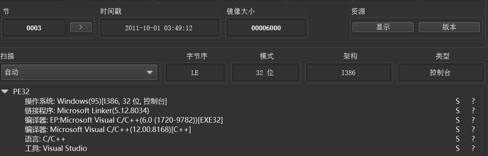

可以发现没有加壳。

（2）继续查看导入表和字符串：

**导入表：**

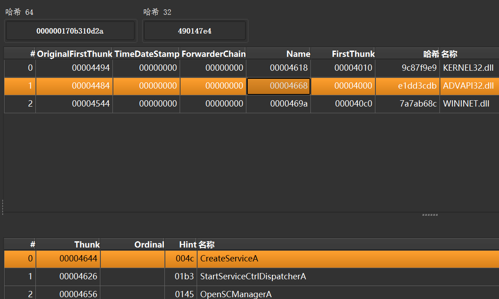

**字符串：**

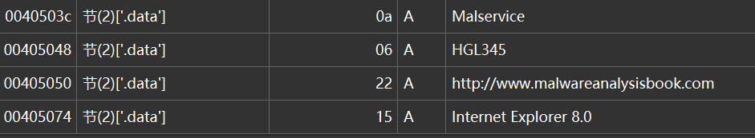

从 `Advapi32.dll` 库中导入的函数来看，三个函数都与服务相关。具体来说，`OpenSCManagerA` 和 `CreateServiceA` 这两个函数暗示了恶意代码可能会通过服务控制管理器来创建一个新的服务项。此外，`StartServiceCtrlDispatcherA` 函数的作用是将服务程序的主线程与服务控制管理器相连接。在代码中还发现了 `MalService` 这个字符串，这进一步证实了 **恶意代码是以服务的形式存在的**。

同时，恶意代码还从 `WinINet.dll` 库中调用了 `InternetOpenUrlA` 和 `InternetOpenA` 这两个函数。`InternetOpen` 函数的作用是建立一个到互联网的连接，而 `InternetOpenUrl` 函数则用于打开一个 URL。结合代码中出现的 `http://www.malwareanalysisbook.com` 网址和 `Internet Explorer 8.0` 的字符串，可以推测其进行了 Internet 网络访问。

（3）接着，使用 IDA 打开文件，查看 main 函数：

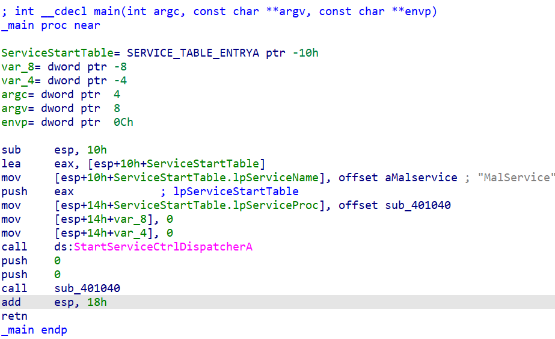

在这个函数里，它调用了 `StartServiceCtrlDispatcherA` 函数，这个函数是用来实现服务功能的，它告诉服务控制管理器应该调用哪个服务控制函数。从参数中我们可以看出，恶意代码安装的服务名应该是“**MalService**”，而对应的服务控制函数是 `sub_401040`，这个函数会在 `StartServiceCtrlDispatcherA` 执行后被触发。

（4）然后，我们双击跳转到 `sub_401040` 函数：

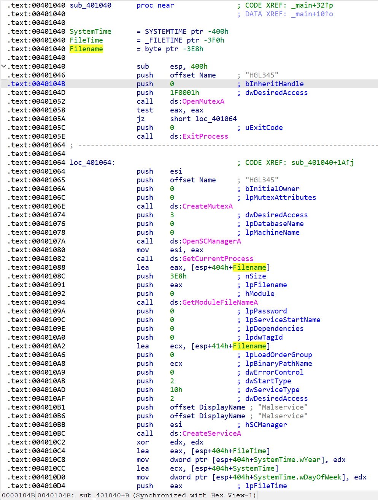

这段代码首先通过 `OpenSCManager` 获取服务控制管理器的句柄，然后使用 `GetCurrentProcess` 获取当前进程的伪句柄。接着，它调用 `GetModuleFileName` 函数，传入刚才获取的恶意代码进程的伪句柄，从而得到恶意代码的完整路径名。这个路径名随后被传入 `CreateServiceA` 函数，使得恶意代码以“**Malservice**”为名被安装为服务。在 `CreateServiceA` 函数的参数中，`dwStartType=2` 表示服务设置为自动启动（SERVICE_AUTO_START），这样服务就能在计算机重启后自动运行，实现了持久化。

所以，我们可以得出结论：**这个程序创建了一个名为 `Malservice` 的服务，确保它在系统启动时自动运行。**

> Q2. 为什么这个程序会使用一个互斥量？

我们来分析一下这个程序中互斥量的作用：

在 `Sub_401040` 函数里，代码首先尝试通过 `OpenMutexA` 函数获取名为“HGL345”的互斥量句柄。如果成功获取到互斥量句柄，程序就会退出；如果获取失败，说明还没有创建这个互斥量，程序就会继续执行，创建这个互斥量。这样的设计确保了程序在同一时间只有一个实例在运行。

具体来说，程序首先调用 `OpenMutexA` 函数尝试打开名为“HGL345”的互斥量。如果打开失败（返回值为 0），程序会跳转到 `loc_401064` 处，调用 `CreateMutexA` 函数创建一个新的互斥量“HGL345”。如果成功打开了互斥量，说明已经有一个程序实例在运行，并且已经创建了这个互斥量，这时程序会调用 `ExitProcess` 函数退出当前进程。

综上所述，**这个程序通过使用名为“HGL345”的互斥量，确保了在同一时间只有一个程序实例在运行。**

> Q3. 可以用来检测这个程序的基于主机特征是什么？

通过上述分析可知，我们可以关注两个主要的主机特征：

1. 互斥量：我们可以查找系统中是否存在一个名为 `HGL345` 的互斥量。如果这个互斥量存在，那么很可能是这个程序正在运行，因为这是它用来确保只运行一个实例的机制。
2. 服务：我们还应该检查系统中是否有一个名为 `Malservice` 的服务。这个服务是恶意代码创建的，用于在系统启动时自动启动程序，实现其持久化驻留。

> Q4. 检测这个恶意代码的基于网络特征是什么？

根据之前的分析，我们知道这个恶意代码从 `WinINet.dll` 中调用了 `InternetOpenUrlA` 和 `InternetOpenA` 这两个函数。进一步查看这两个函数的交叉引用，可以发现它们都在 `StartAddress` 这个子函数中被调用。

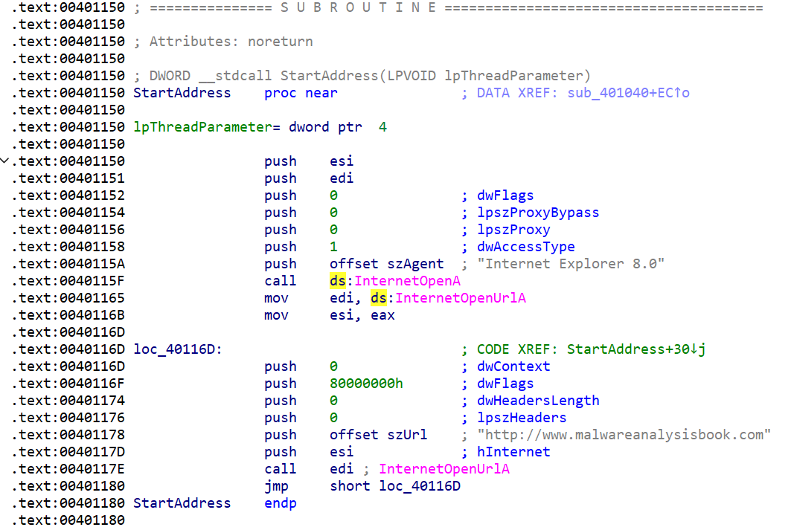

在 `InternetOpenA` 函数中，`szAgent` 参数被设置为 `Internet Explorer 8.0`，这意味着恶意代码在网络通信时会伪装成 IE8 的用户代理。而在 `InternetOpenUrlA` 函数中，访问的 URL 是 `http://www.malwareanalysisbook.com`。这两个就是该恶意代码在网络上的特征。

因此，我们可以得出结论：**这个恶意代码在网络通信时会使用 `Internet Explorer 8.0` 作为用户代理，并尝试与 `http://www.malwareanalysisbook.com` 这个网址进行通信。** 这些特征可以作为检测该恶意代码网络行为的依据。


> Q5. 这个程序的目的是什么？

该恶意程序首先使用 `SystemTimeToFileTime` 函数，将系统时间转换为文件时间格式。通过 IDA 的识别，我们可以看到程序设置了一个 `SystemTime` 结构体，将年、日、时、秒等值分别设置为 0，并将年份设置为 2100 年，即 2100 年 1 月 1 日 0 点。

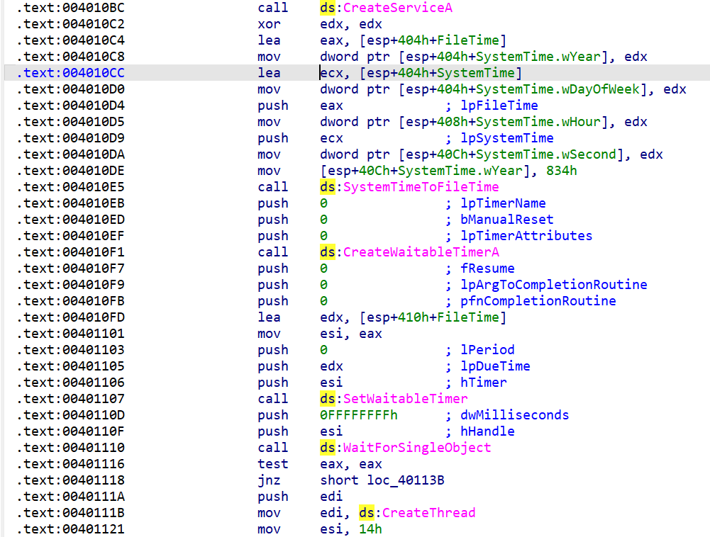

转换时间后，程序创建了一个定时器对象，并设置了触发时间为 2100 年 1 月 1 日 0 点。程序会等待这个时间点的到来，如果到达了指定时间，程序会继续执行；如果因为错误或其他原因未能到达指定时间，程序会进入一个长时间的休眠状态。

接着，程序会进入一个循环，创建 20 个线程，每个线程都会无限次地访问 `http://www.malwareanalysisbook.com`。这些线程在一个无限循环中执行，意味着它们会不断地向目标网址发送请求。

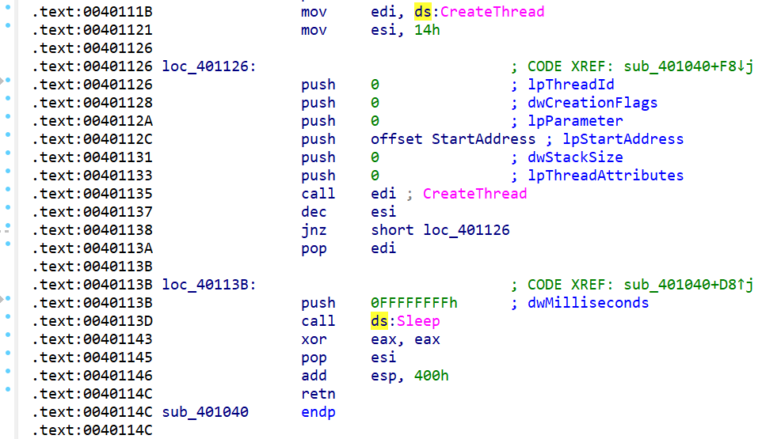

综上所述，这个恶意程序将自己设置为自启动服务，以便在计算机启动时自动运行。**等待到 2100 年 1 月 1 日的半夜，那时发送许多请求到 `http:/www. malwareanabysisbook.com`，大概是为了对这个网站进行一次分布式拒绝服务（DDoS）攻击。**

> Q6. 这个程序什么时候完成执行？

**这个程序永远不会完成。它在一个定时器上等待直到 2100 年，到时候创建 20 个线程，每一个运行一个无限循环。**


#### 2. Lab7-2

**分析在文件 Lab07-02.exe 中发现的恶意代码。**

> Q1. 这个程序如何完成持久化驻留？

（1）首先使用 `DIE` 查看是否加壳：

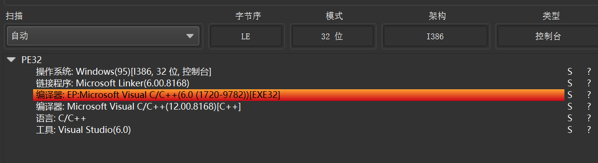

可以发现没有加壳。

（2）继续查看导入表和字符串：

**导入表：**

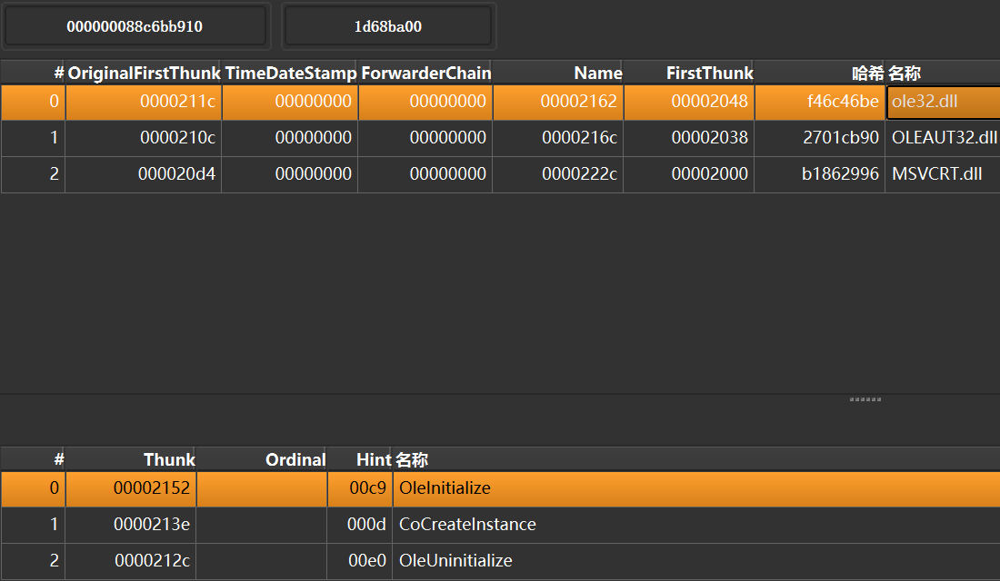

**字符串：**

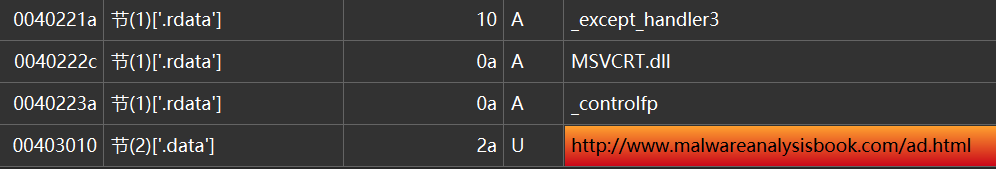

该恶意代码使用了 `OleInitialize`、`CoCreateInstance` 和 `OleUninitialize` 这几个函数。这些函数是 COM 编程中的基础，用于初始化 COM 库、创建 COM 对象和清理 COM 库。

此外，在代码的字符串列表中出现了网址 `http://www.malwareanalysisbook.com/ad.html`，这表明恶意代码可能尝试访问这个网址。

（3）打开 IDA，首先查看 main 函数：

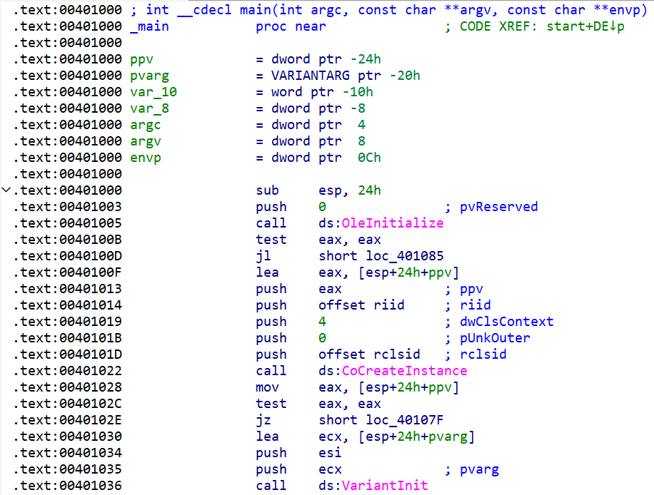

main 函数一开始调用了 `OleInitialize`，然后根据返回值进行判断。经过资料查询可以发现这个函数是用来初始化 OLE（对象链接和嵌入）的环境。接着，`CoCreateInstance` 被用来创建一个组件实例，并返回这个组件的接口，也就是一个 COM 对象。从 `mov eax, [esp+24h+ppv]` 这行代码可以看出，创建的 COM 对象被保存在了栈上。

（4）`CoCreateInstance` 使用了两个参数：`rclsid` 和 `riid`。其值分别为：

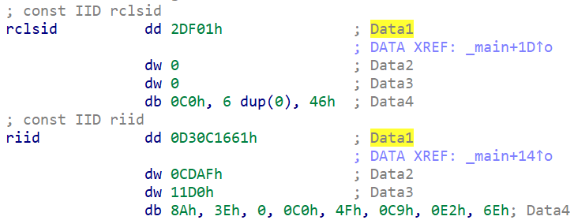

通过查阅资料可知，`riid` 对应 `IWebBrowser2`，而 `rclsid` 对应于 `InternetExplorer`。

（5）接下来是对之前创建的 COM 对象的使用：

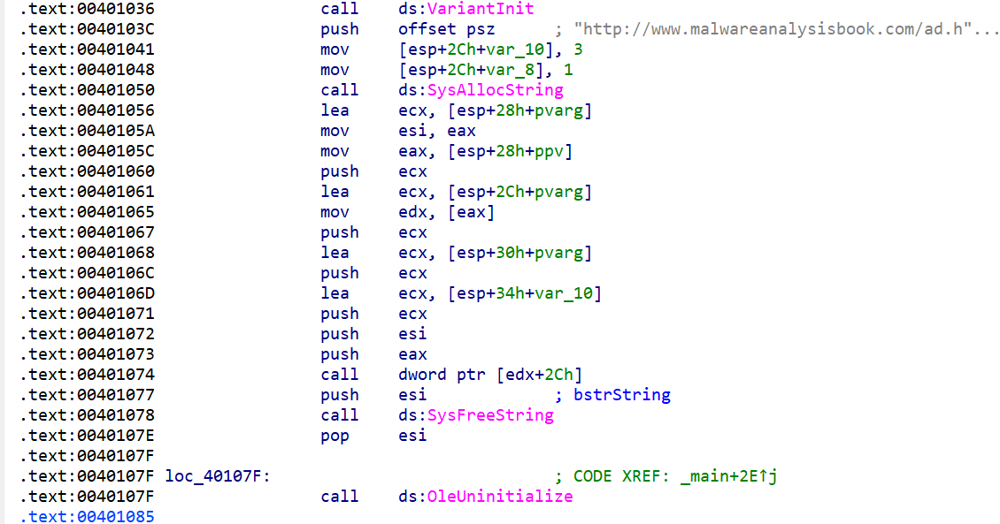

`VariantInit` 用于释放空间和初始化变量；`SysAllocString` 用于分配内存并返回一个 BSTR；`SysFreeString` 用于释放之前分配的内存。在执行过程中，我们可以看到内存分配是为之前分析出的 URL 分配的，而在释放之前调用了 `dword ptr [edx+2Ch]`。`edx` 取的是 `eax` 寄存器中存放的地址上的内容，根据调用结构猜测 `eax` 存放的地址上此时存放的也是一个地址。通过回溯代码，我们发现使用了 `[esp+28h+ppv]` 上的内容对 `eax` 进行了赋值。在书上有一个讨论说到 `IWebBrowser2` 接口的偏移 0x2C 位置处是 `Navigate` 函数，这个函数的功能是使用 Internet Explorer 访问之前关注的 URL。之后没有其他的操作，所以这里的作用很可能是打开一个广告页面。

因此，**这个程序没有完成持久化驻留。它运行一次然后退出。**

> Q2. 这个程序的目的是什么？

这段代码的流程比较直接，它主要通过 COM 来实现对特定网页的访问。因此，这个程序的目的是 **给用户显示一个广告网页**。

> Q3. 这个程序什么时候完成执行？

由上述分析，**这个程序在显示这个广告后完成执行**。

#### 3. lab7-3

**对于这个实验，我们在执行前获取到恶意的可执行程序，`Lab07-03.exe`，以及 DLL, `Lab07-03.dll`。声明这一点很重要，这是因为恶意代码一旦运行可能发生改变。两个文件在受害者机器上的同一目录下被发现。如果你运行这个程序，你应该确保两个文件在分析机器上的同一个目录中。一个以 `127` 开始的 IP 字符串 （回环地址）连接到了本地机器。（在这个恶意代码的实际版本中，这个地址会连接到一台远程机器，但是我们己经将它设置成连接本地主机来保护你。）**

*警告：这个实验可能对你的计算机引起某些损坏，并且可能一旦安装就很难清除。不要在一个没有事先做快照的虛拟机中运行这个文件。*

**这个实验可能比前面那些有更大的挑战。你将需要使用静态和动态方法的组合，并聚焦在全局视图上，避免陷入细节。**


（1）首先使用 `DIE` 查看是否加壳：

**EXE：**

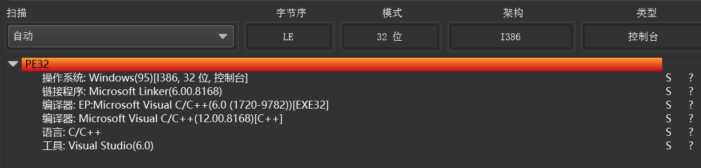

**DLL：**

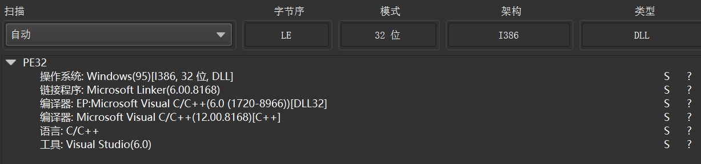

可以发现 exe 和 dll 均没有加壳。

（2）检查 exe 文件的导入表和字符串：

**导入表：**

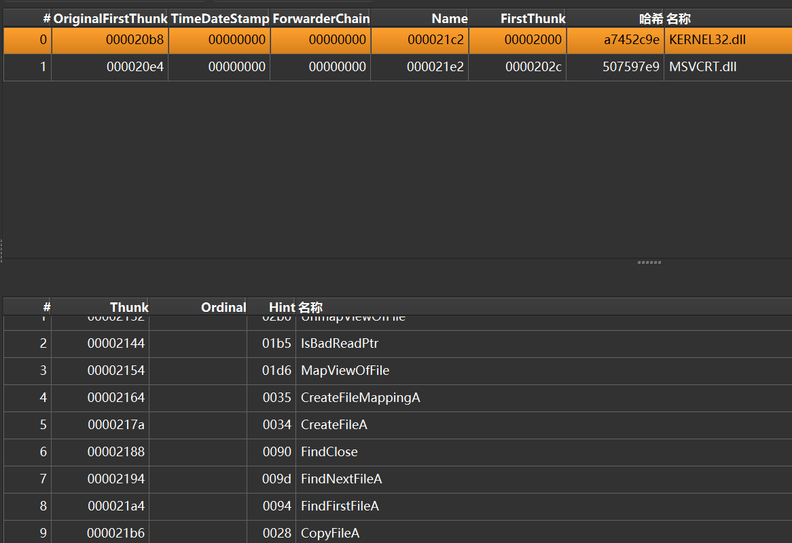

**字符串：**

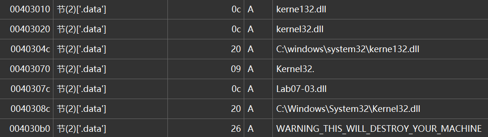

在字符串中，发现“kerne132.dll”这个名称，它将“kernel32.dll”中的一个“l”替换为了数字“1”。这种替换很可能是为了伪装文件名，使其不易被检测到。附近还出现了“Lab07-03.dll”。

在导入表中，可以看到 `CreateFileA` 用于打开或创建文件，`CreateFileMappingA` 和 `MapViewOfFile` 表明该程序可能会将文件映射到内存中。`FindFirstFileA` 和 `FindNextFileA` 的组合表明程序可能会遍历某个目录以查找文件，并使用 `CopyFileA` 复制找到的目标文件。但是，程序并没有导入 `Lab07-03.dll`、`LoadLibrary` 或 `GetProcAddress`，这是一个可疑的行为，需要在分析中进一步检查。

结合导入函数和字符串的分析，可以推测这个恶意程序可能会在当前目录中查找 `Lab07-03.dll` 文件，将其复制到 `C:\windows\system32\` 目录下，并重命名为 `kerne132.dll`。

（3）检查 dll 文件的导入表和字符串：

**导入表：**

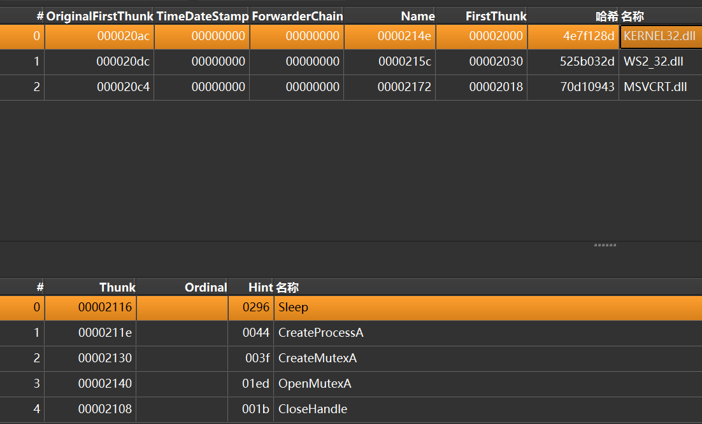

**字符串：**


注意到一个 IP 地址：127.26.152.13，这表明恶意程序可能会尝试连接到这个地址。字符串中还包含了“hello”、“sleep”和“exec”。

从 `ws2_32.dll` 的导入表中，可以看到所有需要通过网络发送和接收数据的函数。还有一个值得注意的是 `CreateProcess` 函数，这表明程序可能会创建一个新的进程。

（4）我也检查了 `Lab07-03.dll` 的导出表，奇怪的是它没有任何导出函数，这意味着它不能被其他程序导入。尽管如此，一个程序仍然可以通过 `LoadLibrary` 载入没有导出函数的 DLL。

（5）使用 IDA 打开 dll 文件，可以发现文件过于复杂，故而决定用 Python 脚本来辅助获取函数名，简化分析过程。这里实际上使用的是我 **上次 Lab4 脚本的简化版本**，所以也就不再解释，直接上代码：

```python
import idaapi
import idautils
import idc

# 检查指令是否是 'call'
def is_call_insn(ea):
    """
    检查给定地址的助记符是否为 'call'
    """
    mnemonic = idc.print_insn_mnem(ea)
    return mnemonic == 'call'

# 主函数
def main():
    # 遍历所有函数
    for func in idautils.Functions():
        # 遍历函数中的所有指令
        ea = func
        func_end = idc.find_func_end(func)
        while ea != idaapi.BADADDR and ea < func_end:
            # 如果是调用指令
            if is_call_insn(ea):
                print("Address: 0x{:X}, Instruction: {}".format(ea, idc.generate_disasm_line(ea, 0)))
            # 继续处理下一条指令
            ea = idc.next_head(ea)

if __name__ == '__main__':
    main()
```

运行方法和 Lab4 所述的一样，结果如下：

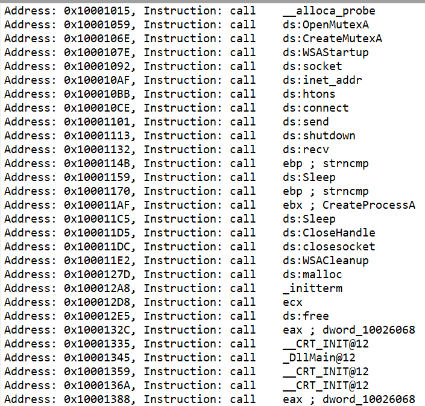

从输出结果可以看出，程序首先调用了__alloca_probe 来分配栈空间，接着是 OpenMutexA 和 CreateMutexA 的调用，这与 Lab 7-1 中的恶意代码类似，目的是确保同一时间只有一个实例在运行。

其他列出的函数似乎涉及到建立远程 socket 连接、传输和接收数据，最后以 Sleep 和 CreateProcessA 的调用结束。虽然不知道具体发送或接收了什么数据，也不知道创建了哪个进程，但可以推测这个 DLL 可能是设计来接收远程命令的。

（6）接下来，查看连接的目标地址：

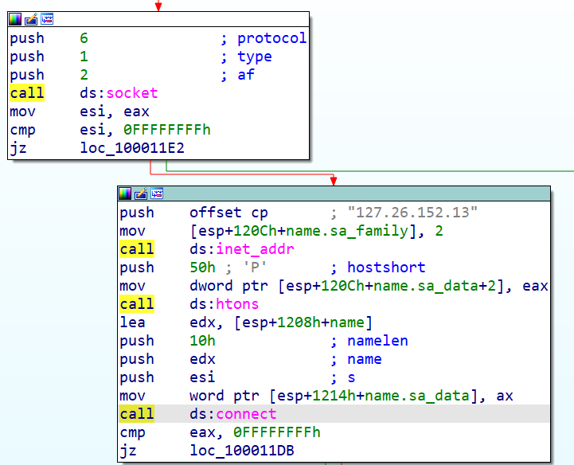

在 connect 调用的前几行，我们看到一个 inet_Addr 的调用，使用了固定的 IP 地址 127.26.152.13，端口参数是 50h，也就是端口 80，通常用于 Web 流量。

（7）查看对 send 的调用：

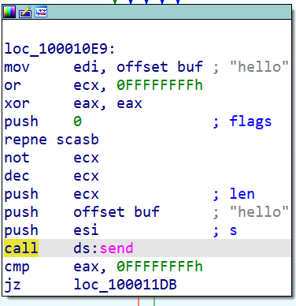

buf 中保存了要发送的数据，IDA 识别出指向 buf 的指针代表字符串 "hello"，并做了标记。

（8）查看 dll 文件中的主函数：

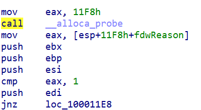

可以看到这个样本首先分配了一个非常大的栈空间（11F8h）。

（9）之后进行了对互斥量的操作，结合之前的分析，这里也是限制了同时只有一个进程在执行，并在创建之后有一个 WSAStartup 函数调用。

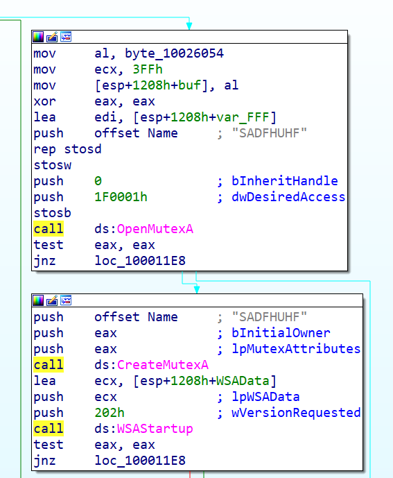

（10）接着可以看到程序依次调用了 socket, connect，开始了网络行为。发现访问的目标 IP 是 127.26.152.13，目的端口是 50h，也就是 80，也就是 tcp 中 http 常用的端口号。

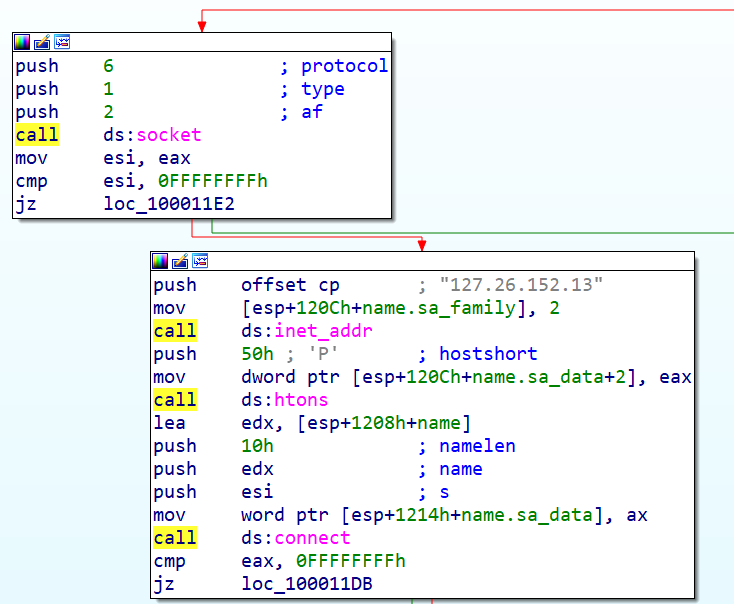

（11）在建立起连接之后，创建进程向服务器端发送了 "hello" 字样的信息，之后等待服务器的指示。

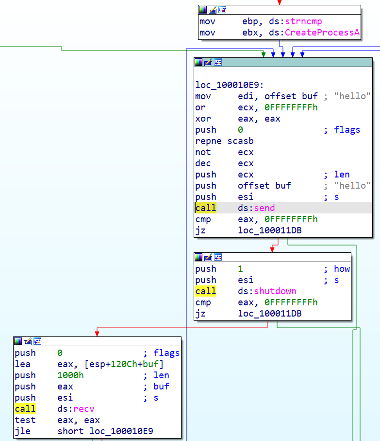

（12）然后由从服务器端收到的消息进行判断，如果是 sleep 就会执行 Sleep 函数，睡眠 60s，如果前四个字符是 exec 则会创建一个进程，在创建进程的时候可以看见非常多的参数，其中有一个注意到的点是有一个 commandline。

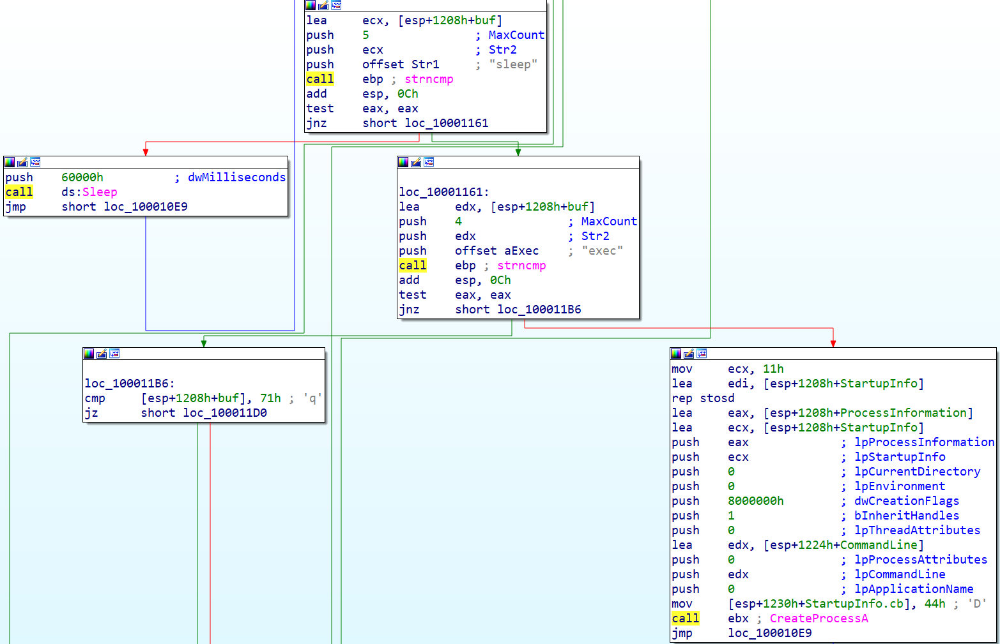

（13）接收缓冲区是从 1000 开始，定位到 CommandLine，可以看到其值是 0FFBh。通过这个信息可以知道这里是接收缓冲区的 5 个字节，也就是说要被执行的命令是接收缓冲区中保存的任意 5 字节的东西。也就是说他会执行这后面的内容。如果不是，则会和字符 q 进行比较，如果是就关闭 socket 并进行相关的清除，如果不是 q，再次执行 sleep，睡眠 60s，之后重新向 server 发送 hello 消息并等待指令。

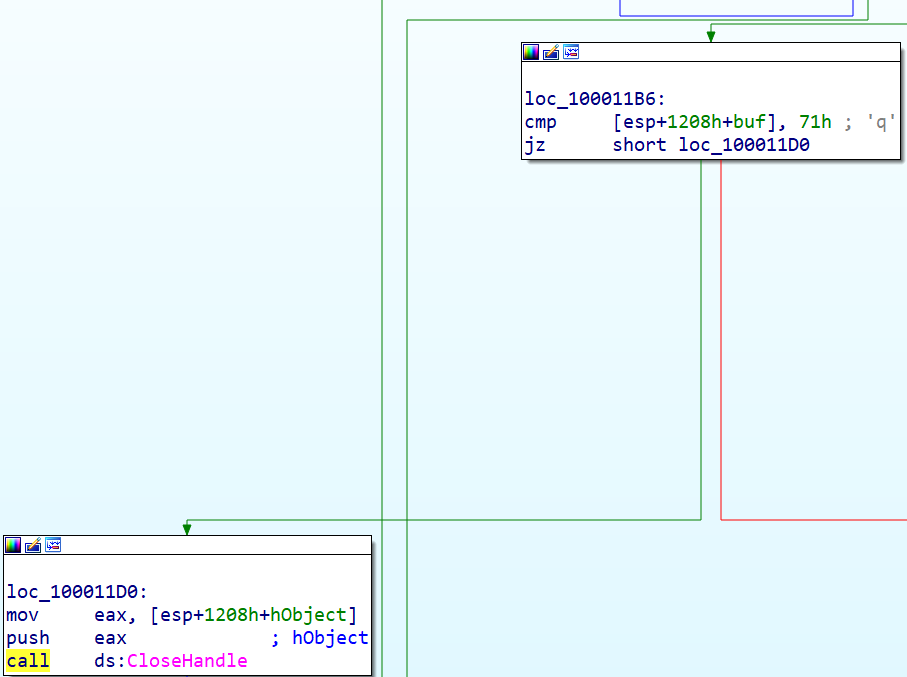

综上，推测该 dll 本质上实现了一个后门的功能，使得受到感染的机器成为肉机，执行攻击者想要执行的内容。

（14）利用 IDAPro 分析 Lab07-03.exe，显示程序一开始就检查命令行参数，如果不是 2 就退出，如果是 2 才继续执行。接着，程序执行了一个操作，将 `argv[1]` 的值移动到 eax 寄存器中。


（15）进一步分析，发现程序对 esi 寄存器的值进行了位比较，只有完全匹配才会继续执行，否则程序会提前结束。之前有一条指令将字符串 "aWarningThisWill" 移动到 esi 寄存器，这意味着要执行这个程序，需要在命令行中以 `Lab07-03.exe WARNING_THIS_WILL_DESTROY_YOUR_MACHINE` 的格式运行。

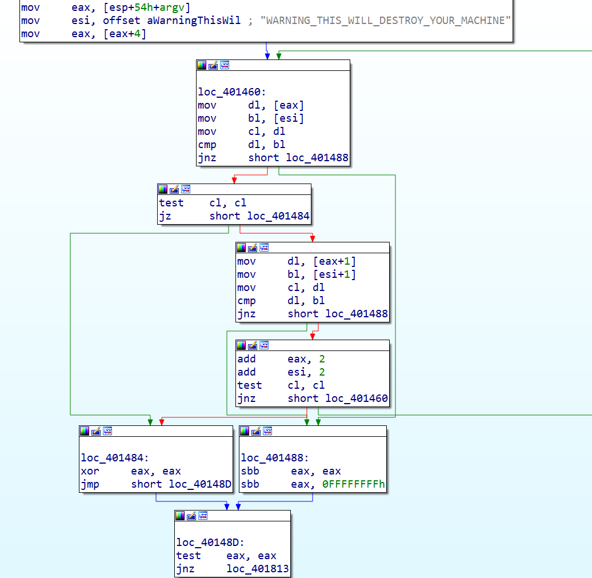

（16）通过验证后，程序主要执行创建文件和将文件映射到内存的操作。注意到程序在 C 盘目录下打开了 Kernel32.dll 文件，并且创建并打开了 Lab07-03.dll。

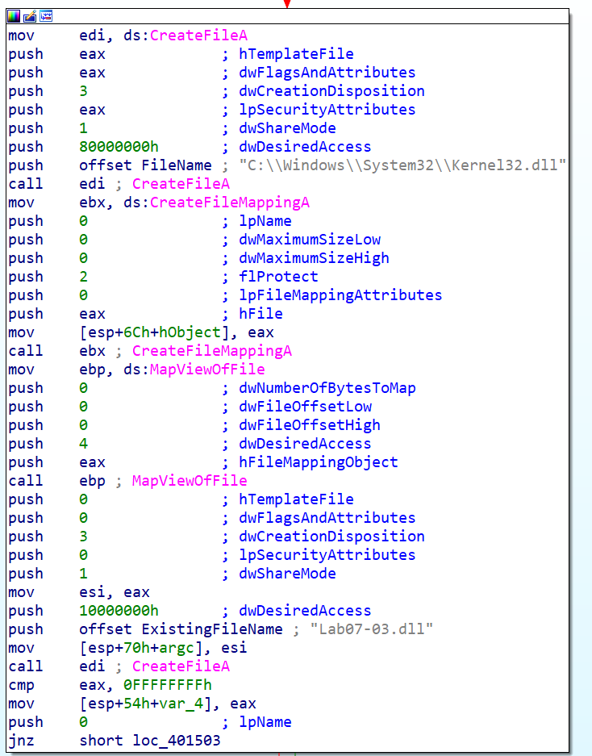

（16）之后可以发现程序多次调用了 sub_401040 函数。

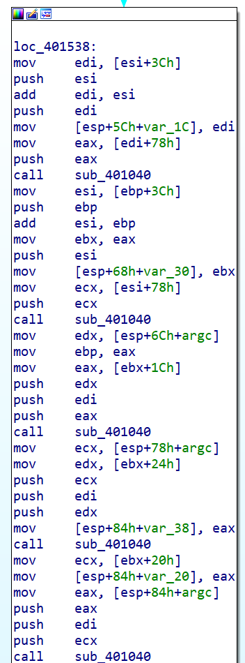

但这个调用过程很复杂，暂时跳过，希望后续分析能揭示其作用。

（17） 当上述的复杂代码执行结束后，程序进行了收尾操作，关闭了之前打开的句柄，并复制文件，将 Lab07-03.dll 改名为 C 盘下的 kernel32.dll，完成了一个危险的替换。

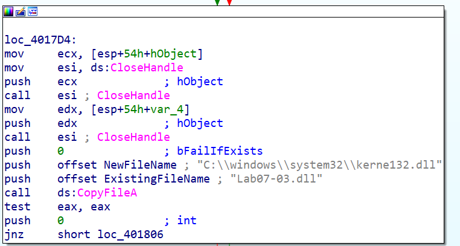

（18）替换完成后，可以看见 loc_401806 这个位置调用了 sub_4011E0 函数，传入 C 盘目录作为参数，那么这里就需要深入分析这个函数。

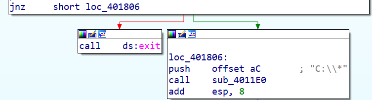

（19）点进去对这个函数进行分析， 发现这个函数对 C 盘目录下的文件进行全盘扫描，与.exe 文件进行比较。

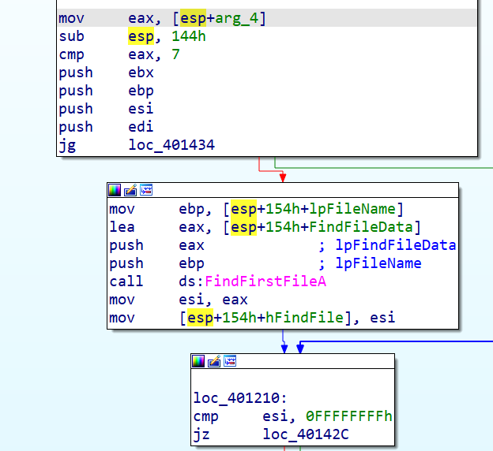

（20）同时可以注意到在调用 FindClose 之前，程序压入了 0xFFFFFFFF，并且当 esi 与 0xFFFFFFFF 比较相等时跳出循环。

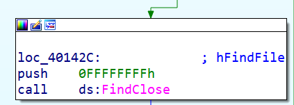

（21）为了验证猜想，查看程序在匹配到.exe 文件时的操作。注意到程序调用了一个非系统函数。

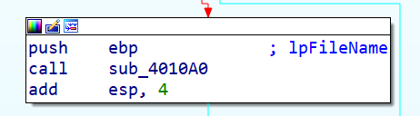

（22）深入分析这个函数，可以看出它先将文件加载到内存，并检查加载的指针是否有效。接着，使用_stricmp 函数对比“kernel32.dll”字符串，如果匹配成功，就会执行 repne scasb 指令，这个指令通常用来确定字符串的长度。

接下来的 repmovsd 指令涉及到 edi 寄存器，而 edi 中存储的是 ebx 中的值。从_stricmp 的注释中我们可以看到 ebx 实际上存储的是 string1。

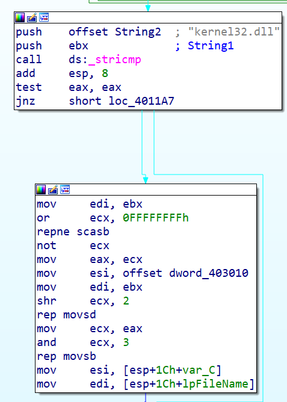

（23）进一步分析，我们找到了内存中的一个偏移位置 dword_403010，转换成字符串后显示为“kerne132.dll”。

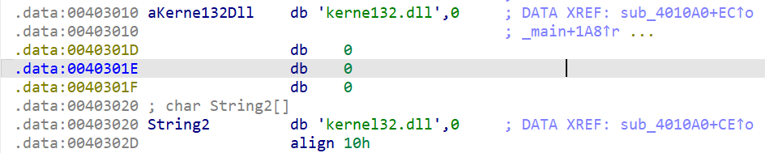

综合这些信息，我们可以得出结论，这个函数在执行时会遍历 C 盘下的所有 exe 文件，寻找其中的“kernel32.dll”字符串，并将其替换为“kerne132.dll”。而根据之前的分析，我们知道这个函数最终会在 C:\windows\system32\目录下创建一个名为“kerne132.dll”的文件。因此，我们有理由推测这个程序会修改所有可执行文件，将它们对“kernel32.dll”的调用重定向到这个恶意的“kerne132.dll”文件上，以此实现其恶意行为。


> Q1. 这个程序如何完成持久化驻留，来确保在计算机被重启后它能继续运行？

这个程序通过在 C:\Windows\System32 目录下创建一个 DLL 文件，并修改系统中所有引用该 DLL 的 exe 文件，实现其持久化驻留。


> Q2. 这个恶意代码的两个明显的基于主机特征是什么？

这个程序使用硬编码的文件名 `kerne132.dll`，这是一个明显的检测特征（注意数字 1 代替了字母 L）。同时，程序使用了一个硬编码的互斥量 `SADFHUHF`。


> Q3. 这个程序的目的是什么？

这个程序旨在创建一个难以删除的后门，来连接到一个远程主机。这个后门有两个命令：一个用来执行命令，一个用来进入睡眠。

> Q4. 一旦这个恶意代码被安装，你如何移除它？

* 如果有运行前的快照，可以直接恢复到快照状态。

* 从微软官方下载一个官方的 kernel32.dll 文件，将其重命名为 kerne132.dll 来替换恶意文件，同时保留一个 kernel32.dll 的备份以供后续程序使用。
* 手动修改受感染的 kerne132.dll 文件，移除其中的恶意代码，仅保留正常功能部分。

### （二）yara 编写与分析

#### 1. yara 编写

这次 yara 编写和之前的大同小异，就不再叙述，直接给出完整代码：

```yara
private rule isMZ_PE {
    meta:
        description = "It is a PE file"
    condition:
        filesize <10MB and uint16(0) == 0x5A4D and uint32(uint32(0x3C)) == 0x00004550
        // 文件大小小于10MB，文件头的前两个字节为MZ，PE头的偏移地址处的四个字节为PE标志
}

// Lab07-01
rule Lab07_01_exe {
    meta:
        description = "It may like Lab07_01_exe"
    strings:
        $s1 = "http://www.malwareanalysisbook.com"
        $s2 = "Internet Explorer 8.0"
        $s3 = "MalService"
        $s4 = "HGL345"
    condition:
        isMZ_PE and all of them
}

// Lab07-02
rule Lab07_02_exe {
    meta:
        description = "It may like Lab07_02_exe"
    strings:
        $s1 = "http://www.malwareanalysisbook.com/ad.html" wide
        $s2 = "OleUninitialize"
        $s3 = "CoCreateInstance"
    condition:
        isMZ_PE and all of them
}

// Lab07-03
rule Lab07_03_exe {
    meta:
        description = "It may like Lab07_03_exe"
    strings:
        $s1 = "kerne132.dll"
        $s2 = "Lab07-03.dll"
        $s3 = "C:\\Windows\\System32\\Kernel32.dll"
    condition:
        isMZ_PE and all of them
}

rule Lab07_03_dll {
    meta:
        description = "It may like Lab07_03_dll"
    strings:
        $s1 = "127.26.152.13"
        $s2 = "Sleep"
        $s3 = "hello"
    condition:
        isMZ_PE and all of them
}
```

#### 2. 运行

把上述 Yara 规则保存为 `lab5.yar`, 然后执行检查，可以看到，样本被检出。**Yara 规则编写成功！**

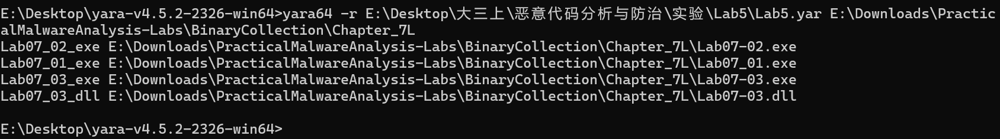

#### 3. 测试执行效率

接下来测试规则的执行效率，我选择编写一个 python 脚本、执行扫描和时间统计，代码如下：

```python
import os
import time

# 获取程序开始时间
start_time = time.time()

os.system(r"E:\Desktop\yara-v4.5.2-2326-win64\yara64.exe -r E:\Desktop\大三上\恶意代码分析与防治\实验\Lab5\Lab5.yar E:\Downloads")

# 获取程序结束时间
end_time = time.time()

# 计算并输出程序运行时间
elapsed_time = end_time - start_time
print(f"程序运行时间: {elapsed_time} 秒")
```

运行结果如下，我这个文件夹大小为 2.11GB，有 377 个文件、101 个文件夹，而运行时间为 2.74s，说明效率较高。

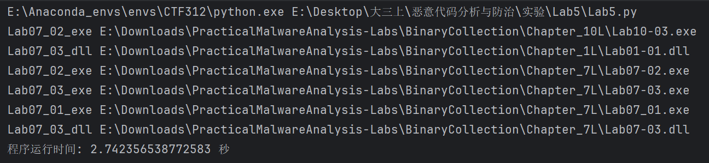

### （三）IDA python 脚本编写

#### 1. IDA python 脚本编写

为了简化安全审计和逆向工程的工作，我编写了如下脚本来辅助分析：

```python
import idaapi
import idautils
import idc

# 检查指令是否是 'jmp' 或 'call' 且操作数为寄存器类型
def is_jump_or_call_with_register(ea):
    """
    检查给定地址的助记符是否为 'jmp' 或 'call' 且操作数为寄存器类型
    """
    mnemonic = idc.print_insn_mnem(ea)
    if mnemonic not in ['jmp', 'call']:
        return False
    opnd_type = idc.get_operand_type(ea, 0)
    # 确保操作数是寄存器类型
    return opnd_type in [idaapi.o_reg, idaapi.o_phrase, idaapi.o_displ]

# 检查函数是否为库函数
def is_library_function(func_ea):
    """
    检查给定地址的函数是否为库函数
    """
    flags = idc.get_func_attr(func_ea, idc.FUNCATTR_FLAGS)
    return flags & idaapi.FUNC_LIB

# 标记不安全的函数调用并设置颜色
def judge_audit(addr):
    """
    对不安全的函数调用进行标注，并设置背景颜色
    """
    idc.set_cmt(addr, "### AUDIT HERE ###", 0)  # 添加注释
    idc.set_color(addr, idc.CIC_ITEM, 0x0000ff)  # 设置指令背景颜色

# 标记不安全函数的调用
def flag_calls(danger_funcs):
    """
    查找并标记程序中所有不安全函数的调用
    """
    count = 0
    for func in danger_funcs:
        faddr = idc.get_name_ea_simple(func)
        if faddr != idaapi.BADADDR:
            # 获取对该函数的所有交叉引用
            cross_refs = idautils.CodeRefsTo(faddr, 0)
            for addr in cross_refs:
                count += 1
                print("%s[%d] calls 0x%08x" % (func, count, addr))
                judge_audit(addr)

# 主函数
def main():
    # 遍历所有函数，排除库函数
    for func in idautils.Functions():
        if is_library_function(func):
            continue

        # 遍历函数中的所有指令
        ea = func
        func_end = idc.find_func_end(func)
        while ea != idaapi.BADADDR and ea < func_end:
            # 如果是跳转或调用且操作数是寄存器类型
            if is_jump_or_call_with_register(ea):
                print("Address: 0x{:X}, Instruction: {}".format(ea, idc.generate_disasm_line(ea, 0)))
            # 继续处理下一条指令
            ea = idc.next_head(ea)

    # 识别并标记不安全函数调用
    print("-------------------------------")
    danger_funcs = ["DllEntryPoint", "printf", "strcpy", "GetModuleFileNameExA", "Thread32Next"]
    flag_calls(danger_funcs)
    print("-------------------------------")

if __name__ == '__main__':
    main()
```

该脚本主要有两个功能：

1. **动态跳转或调用检测**，即检测汇编指令是否是 `jmp` 或 `call`，并且操作数为寄存器类型。

2. **查找和标记危险函数调用**，并为每个调用添加注释、设置背景颜色。（主要用来漏洞挖掘）

#### 2. 运行

执行该 IDApython 脚本，可以看到控制台输出了指令 `jmp` 或 `call`、以及危险函数的调用：

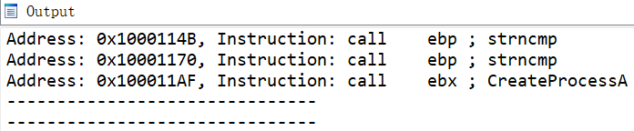

#### 3. 简化版本

实际上，在前面的分析中我使用的是简化版本的 IDA python 脚本（完整版没什么必要。。。在这次实验中）

通过这个脚本可以搜索到所有call指令，方便分析：

```python
import idaapi
import idautils
import idc

# 检查指令是否是 'call'
def is_call_insn(ea):
    """
    检查给定地址的助记符是否为 'call'
    """
    mnemonic = idc.print_insn_mnem(ea)
    return mnemonic == 'call'

# 主函数
def main():
    # 遍历所有函数
    for func in idautils.Functions():
        # 遍历函数中的所有指令
        ea = func
        func_end = idc.find_func_end(func)
        while ea != idaapi.BADADDR and ea < func_end:
            # 如果是调用指令
            if is_call_insn(ea):
                print("Address: 0x{:X}, Instruction: {}".format(ea, idc.generate_disasm_line(ea, 0)))
            # 继续处理下一条指令
            ea = idc.next_head(ea)

if __name__ == '__main__':
    main()
```

结果如下：


## 四、实验结论及心得体会

---

经过本次实验的深入实践，我掌握了 IDA Python 编程技能，显著提升了我在代码分析领域的效率。与此同时，我对 IDA Pro 的多种高级技巧，如交叉引用、指令跳转及反汇编技术，也已游刃有余。在 YARA 规则编写方面，我也能更为精准地为特定检测任务定制策略。
实验过程中，我对应用程序的代码结构与功能有了更加透彻的认识。同时，我学会了高效分析恶意代码的方法，尤其是在解析复杂的函数调用关系和破解混淆代码时，能够准确把握关键点，条分缕析地进行深入探究。同时，我深刻体会到在分析过程中，应避免过分沉溺于细节，而应始终保持对整体信息的宏观把握，确保分析工作既有深度又具备广度。
