<div align='center'>
<b> <font face='微软雅黑' size='6'> 恶意代码分析与防治技术课程实验报告 </font> </b>
</div>


<div align='center'>
<b> <font font face='微软雅黑' size='6'> 实验六---R77 </font> </b>
</div>


<div>
<font face='宋体' size='6'>&nbsp;&nbsp;&nbsp;&nbsp; 学 院：网络空间安全学院 </font> <br>
<font face='宋体' size='6'>&nbsp;&nbsp;&nbsp;&nbsp; 专 业：信息安全 </font> <br>
<font face='宋体' size='6'>&nbsp;&nbsp;&nbsp;&nbsp; 学 号：2212998 </font> <br>
<font face='宋体' size='6'>&nbsp;&nbsp;&nbsp;&nbsp; 姓 名：胡博浩 </font> <br>
<font face='宋体' size='6'>&nbsp;&nbsp;&nbsp;&nbsp; 班 级：信息安全 </font> <br>
</div>


## 一、实验目的

---

1. 运行 R77 程序，实现对指定的进程、文件、注册表、网络连接的隐藏
2. 实验效果进行截图，完成实验报告
3. 拓展阅读，在实验报告中概述 R77 所利用的 Windows 的 Detours 机制

## 二、实验原理

---

### Windows Detours 机制

Detours 是由微软开发的一款软件库，它能够拦截并重定向 Windows 应用程序中的函数调用。这一机制通过修改目标函数的入口机器代码，使其跳转至自定义的代理函数，从而实现对原函数的调用、行为修改或完全替代。Detours 在系统监控、程序调试、性能分析及安全工具开发等领域发挥着至关重要的作用。

### API Hooking 技术

API Hooking 技术允许开发者监控和修改应用程序对 API 的调用。该技术主要通过两种方式实现：Inline Hooking（直接修改 API 函数的机器代码）和 IAT Hooking（修改程序的导入地址表）。API Hooking 技术在软件调试、系统监控、安全防护以及增强现有系统功能等方面具有广泛的应用。

### DLL 注入技术

DLL 注入技术涉及将一个动态链接库（DLL）注入到另一个进程的地址空间。这一过程可以通过多种方法实现，如使用 `CreateRemoteThread` 函数或 `SetWindowsHookEx` 钩子功能。DLL 注入技术使得开发者能够影响或改变目标进程的行为，广泛应用于应用程序监控、调试和安全研究领域。

### Windows Ring0 与 Ring3

在 Windows 操作系统中，Ring0（内核模式）与 Ring3（用户模式）代表了处理器的不同保护级别。Ring0 拥有最高权限，可直接访问硬件和所有系统资源，通常由操作系统核心组件和驱动程序使用。而 Ring3 是普通应用程序的运行环境，其访问权限受限，无法直接操作硬件或关键系统资源。理解这两种模式的区别对于确保操作系统的安全性和功能实现具有重要意义。

### Rootkit 技术

Rootkit 是一种旨在隐藏自身以逃避安全检测和防御机制的恶意软件。其主要行为和特点包括隐藏存在、权限提升、持久性、后门访问和内核级操作。为有效防范 Rootkits，用户和管理员需保持系统和安全软件的更新，定期进行安全审查，并遵循最佳的网络安全实践。

### Rootkit77（r77）

Rootkit77，简称 r77，是一种特殊的无文件 Ring 3 Rootkit。它具有以下特点：

- **隐藏内容**：能够隐藏文件、进程、注册表项、服务、网络连接等多种系统对象。
- **动态配置**：通过配置文件可以灵活地控制隐藏的内容。
- **易于部署**：部署和卸载过程简便，仅需一个文件即可完成。

## 三、实验过程

---

### （一）前言

鉴于 r77 仅在 64 位操作系统上运行，本次实验选择在 `Windows 10` 操作系统上进行。另外，本次实验部分过程参照实验指导书 r77 Rootkit Technical Documentation。

### （二）环境配置

在之前的实验中，我已经安装好了 Windows 10 虚拟机，如下所示：

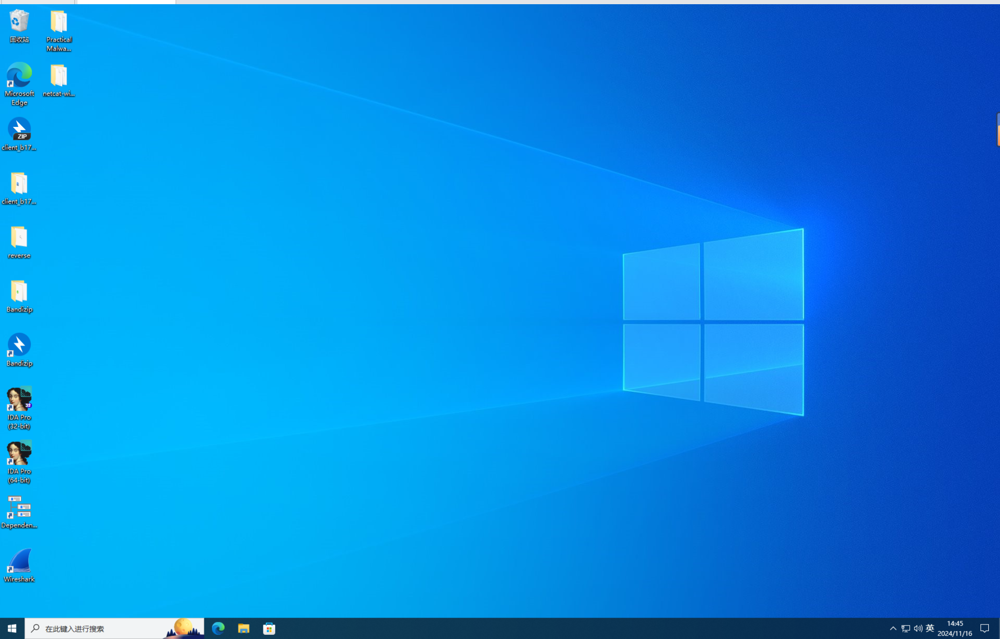

**注意：** 在进行实验之前，必须关闭计算机的病毒威胁检测功能，以防止解压缩后的病毒文件被自动删除：

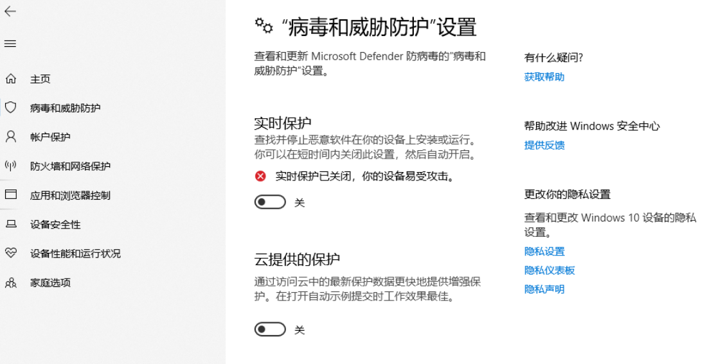

接下来，我们将所需的分析工具和程序转移到虚拟机中，包括用于测试隐藏进程的 Process Explorer、Procmon 和 TCPView。在完成这些准备工作并拍摄相关快照后，我们就可以开始实验了。

### （三）下载运行 R77

访问 R77 官网 [r77 Rootkit - bytecode77](https://bytecode77.com/r77-rootkit) 下载压缩包：

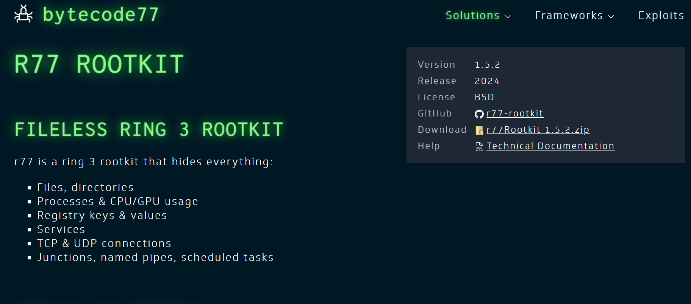

解压到桌面：

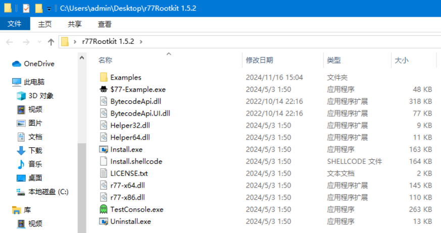

双击运行 `Install.exe`，这将导致 Rootkit77（R77）被注入到所有当前正在运行的进程中，并在系统中实现该 Rootkit 的持久化。新启动的进程在执行任何指令之前也会被注入 R77，这是通过钩住（hooking）进程创建 API 实现的。安装完成后，R77 将被配置为在系统重启后自动启动，并在第一个用户登录前注入所有进程。

由于 R77 已经注入到所有当前运行的进程中，我们无需重启系统。可以观察到，原本文件夹下的 `$77-Example.exe` 文件已经消失，这验证了 R77 会隐藏所有以 `$77` 为前缀的文件和进程。如图所示：


接下来，我们先运行 `Uninstall.exe` 来复原系统，然后依次对 R77 的进程隐藏、文件隐藏、注册表隐藏和网络连接隐藏功能进行验证。

### （四）进程隐藏

Rootkit77（R77）的进程隐藏功能是一种强大的技术，它使得特定进程在操作系统的常规监控工具（例如任务管理器）中不可见。这种隐藏技术主要通过修改操作系统的行为来阻止对特定进程的检测。

实际上，R77 不仅能够隐藏进程，还能隐藏任意以 `$77` 为前缀的文件。下面首先展示对任意文件的隐藏效果。

#### 示例进程

R77 提供了一个可执行文件 `$77-Example.exe`，该文件以 `$77` 为前缀。我们首先运行这个文件：

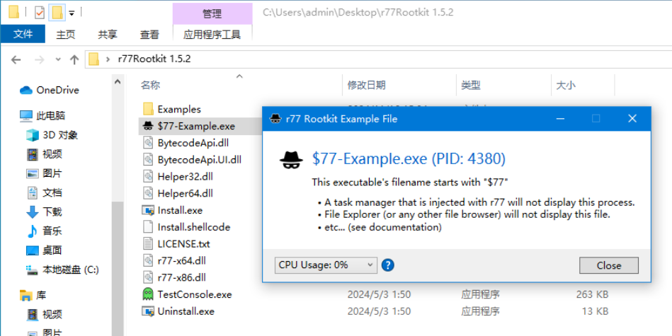

接着查看任务管理器：

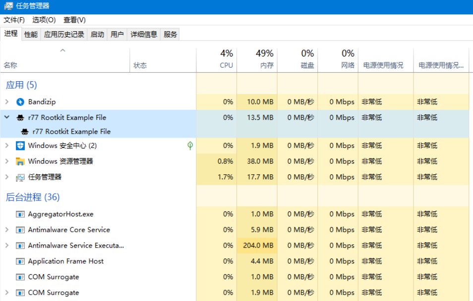

这个示例文件可以调节 CPU 占用率，为了更明显地展示其被隐藏但实际存在的效果，我将 CPU 占用率调至 100%。

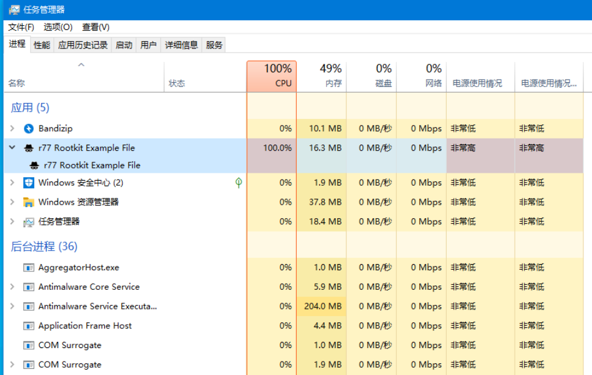

此时，这个可执行文件在任务管理器中是完全可见的。

接下来，运行 `Install.exe`，重新打开任务管理器，并保持 `$77-Example.exe` 运行，发现无法找到这个进程了：


尽管如此，由于我将其设置为 CPU 占用率 100%，我们仍然可以看到 CPU 的极高使用率，但其他进程并未进行高强度操作，这明显表明 `$77-Example.exe` 进程被隐藏了。

此外，刷新文件目录后，也发现 `Example` 文件不见了。

接下来，使用 Process Explorer 查看：


在进程目录树中明显没有这个进程，这确实证明了其被隐藏。

然后，我们查看 Procmon，首先设置过滤器为 `ProcessName is $77-Example.exe`。


查看过滤后的结果：


可以明显看到，之前被隐藏的进程 `$77-Example.exe` 的行为被 Procmon 检测到了，包括文件读取等操作。

这是因为 Procmon 能够捕获隐藏进程的活动并显示其详细信息。

#### 任意进程

实际上，R77 默认会隐藏所有以 `$77` 开头的进程，但除此之外，它还允许对其他进程进行针对性的隐藏。

我们运行了 `TestConsole.exe`，这个工具可以显示进程列表，包括那些被隐藏的进程：

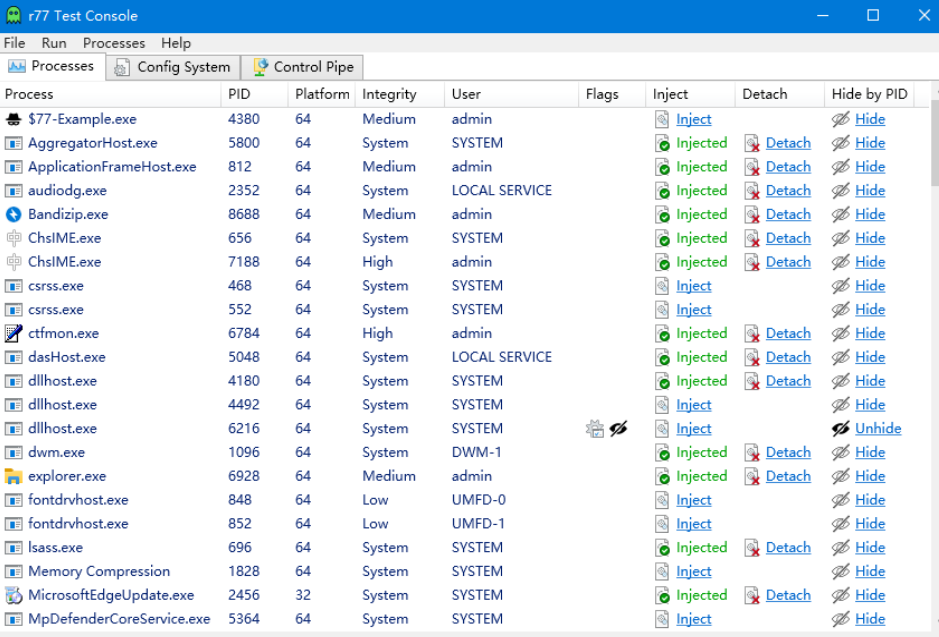

在界面的右侧，我们可以看到有一个“Hide”选项。为了实现对指定进程的隐藏，我选择将 `TestConsole.exe` 自身隐藏。

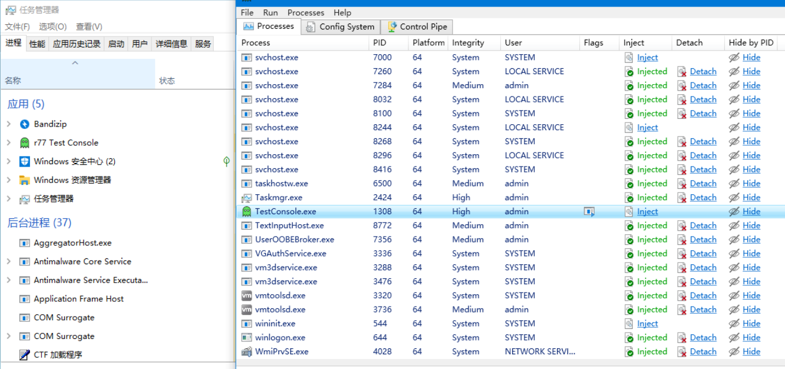

上图展示了在执行“Hide”操作之前，`TestConsole.exe` 在任务管理器中是可见的。点击界面右侧的“Hide”按钮后，我们来查看结果：

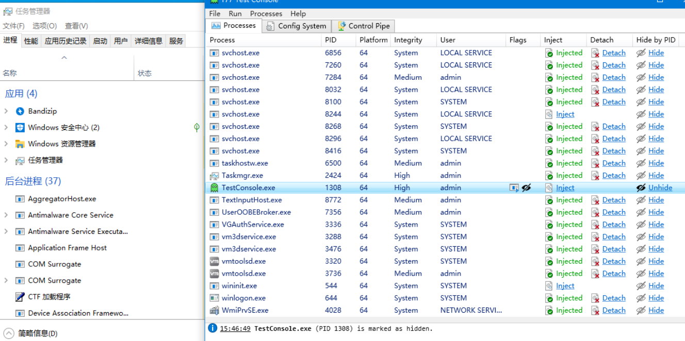

可以看到 `TestConsole.exe` 进程已经“消失”，同时界面右侧的“Hide”选项也已经变成了“Unhide”。至此，我们已经成功实现了对任意或指定进程的隐藏。

### （五）文件隐藏

接下来，我们将探讨 R77 的文件隐藏功能。这一功能依托于 API Hooking 技术，通过拦截和修改系统级别的文件系统调用实现，使得特定文件或目录在操作系统的标准文件浏览器，如 Windows 资源管理器中变得不可见。

需要注意的是，只有以 `$77` 为前缀的文件和文件夹才能被 R77 隐藏。

首先，我们通过执行 `Uninstall.exe` 来恢复到之前的状态：

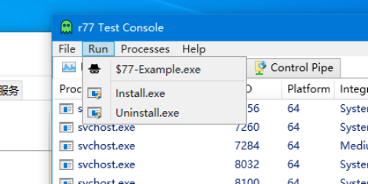

然后，在一个文件夹中放入我想要隐藏的文件和文件夹：

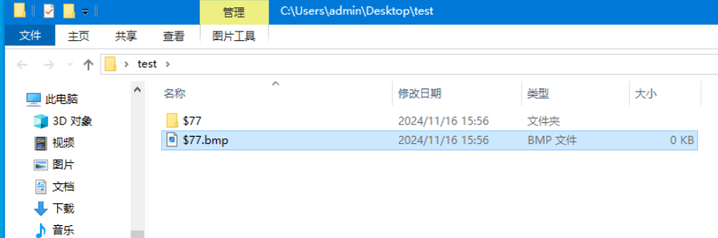

接下来，执行 `Install` 操作，并刷新文件夹：

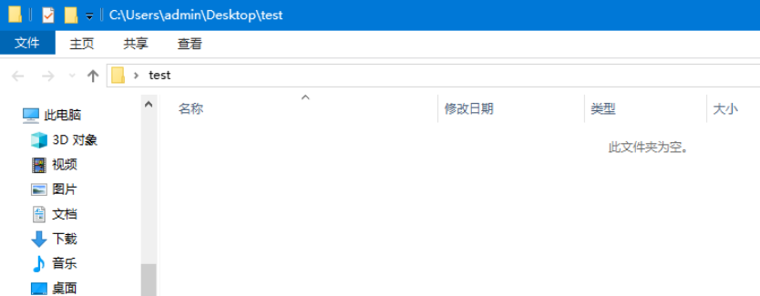

此时，文件夹显示为“此文件夹为空”，表明文件已经被成功隐藏。

### （六）注册表隐藏

现在，我们验证 Rootkit77 的注册表隐藏功能。R77 的配置信息存储在 `HKEY_LOCAL_MACHINE\SOFTWARE\$77config` 中，并且可以在未提权状态下由任何进程写入。这个键的 DACL（Discretionary Access Control List）被设置为可以给任意用户授予完全访问权限。在注册表编辑器被注入了 Rootkit 之后，“$77config”键会自动隐藏，并且它还可以实现对任意以`$ 77`为前缀的注册表键进行隐藏。

首先，执行 `Uninstall.exe` 以恢复到未感染的状态，然后打开注册表编辑器。在 `HKEY_CURRENT_USER` 下创建一个名为 `test` 的注册表项，并在其中创建一个以 `$77` 为前缀的子注册表项：


接下来，执行 `Install.exe`，然后刷新注册表：


可以看到，在 `test` 下没有任何其他目录了，这证明了 `$77` 被成功隐藏，验证成功。

### （七）网络连接隐藏

最后，我们将在卸载之前的安装后，验证 R77 对网络连接，例如 TCP 和 UDP 的隐藏能力。

#### TCP 隐藏

首先，打开 TCPView，仅选择显示 TCP v4 连接：

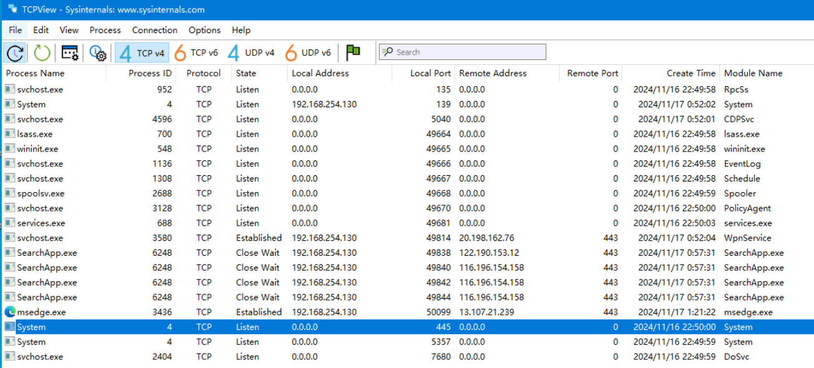

在此步骤中，我打开了 Microsoft Store，可以在 TCPView 中看到其对应的进程：

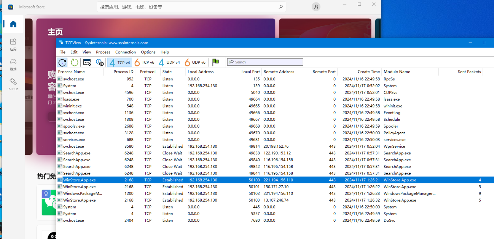

接着，打开 TestConsole.exe，点击“Hide”按钮，然后重新查看 TCPView：

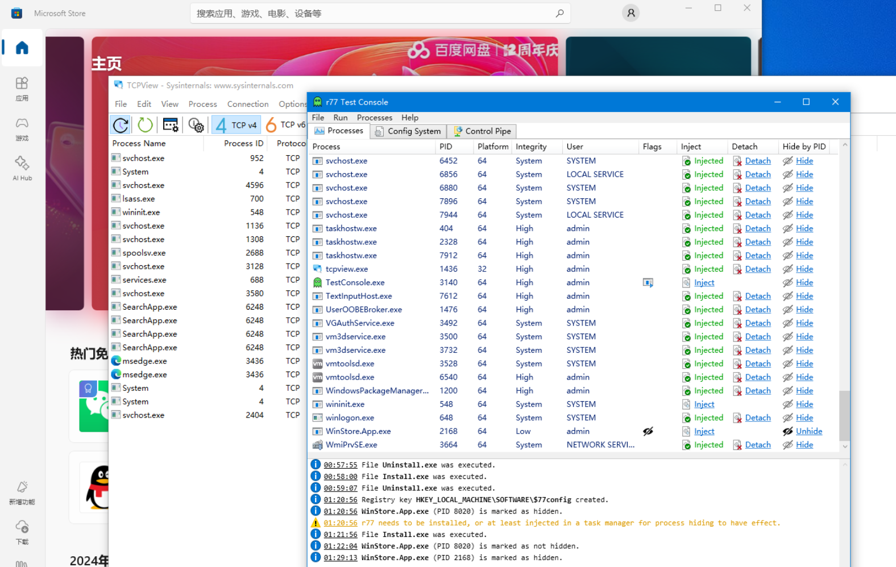

发现无法侦察到相应端口的 TCP 通信了，这证明了 TCP 连接已被成功隐藏。

#### UDP 隐藏

首先，在 TestConsole.exe 中设置仅显示 UDP v4 连接：

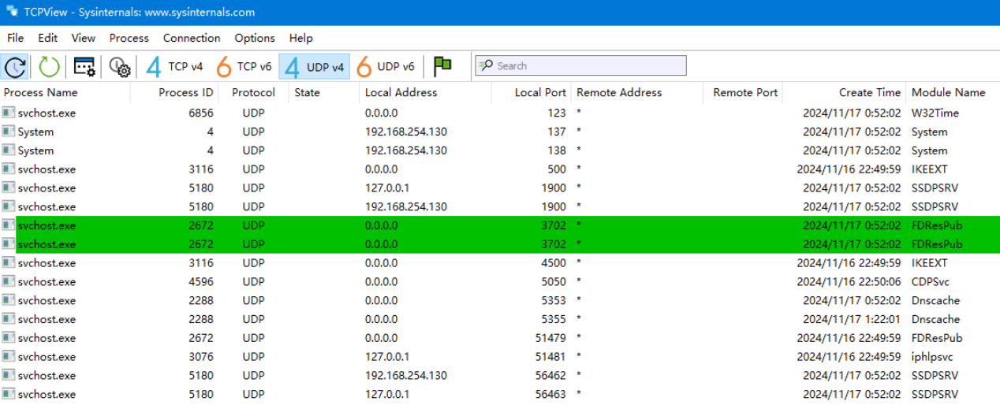

然后，我打开了 Edge 浏览器，在 TCPView 中可以看到其对应的进程：

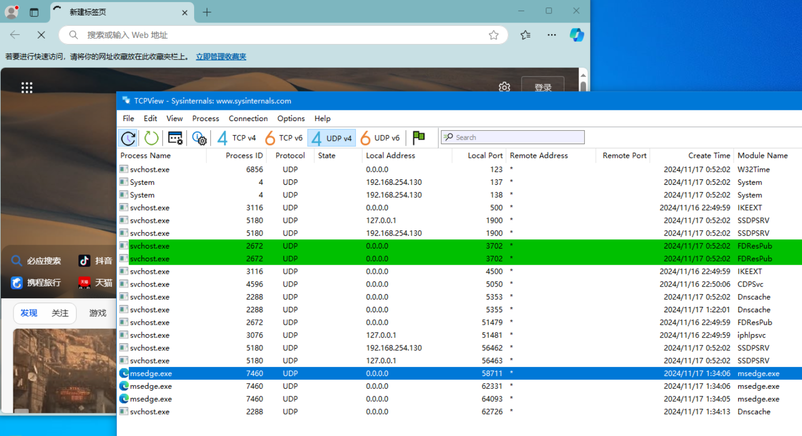

打开 TestConsole.exe，点击“Hide”按钮，然后重新查看 TCPView（注意 Edge 可能会启动多个进程，但通常只有一个进程是实际运行的）：

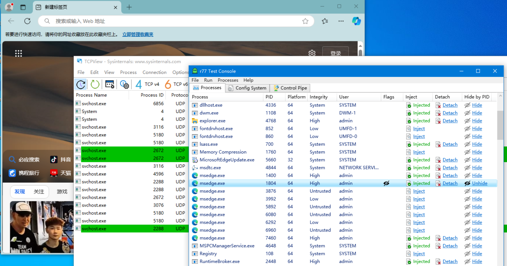

此时，之前显示的 Edge 的 UDP 连接进程已经消失，这证明了 UDP 连接已被成功隐藏。

## 四、R77 所利用的 Windows Detours 机制

---

R77 是一种高度复杂的恶意软件，通过模块化架构实现对文件、进程、注册表和网络连接等系统资源的隐藏和持久化操作。其核心依赖于微软的 Detours 技术——一个强大的函数拦截和重定向工具库。Detours 技术原本用于性能监控、调试和程序增强，但 R77 恶意软件却滥用此技术进行隐匿和恶意活动。以下是对 R77 如何利用 Detours 机制的详细分析。

### （一）Detours 机制概述

**Microsoft Detours** 是一个专为 Windows 平台设计的二进制代码注入和函数重定向工具库。Detours 的核心功能包括：

- **函数拦截**：通过修改目标函数入口点的机器指令（如插入跳转指令），将函数调用重定向到自定义函数。
- **动态逻辑插入**：拦截后，开发者可以选择调用原函数、修改返回值，或完全替代原逻辑。
- **动态加载**：Detours 可以将恶意模块注入目标进程，允许在运行时修改行为。

虽然 Detours 合法用于调试、性能分析等领域，但 R77 利用其拦截功能操控核心 API，从而实现隐匿目标资源的目的。

### （二）R77 的模块设计与 Detours 的结合

R77 的架构由四个独立但紧密协作的模块组成：**安装模块（Install Module）**、**初始阶段模块（Stager Module）**、**服务模块（Service Module）** 和 **核心模块（Core Module）**。它们分别通过 Detours 实现特定功能：

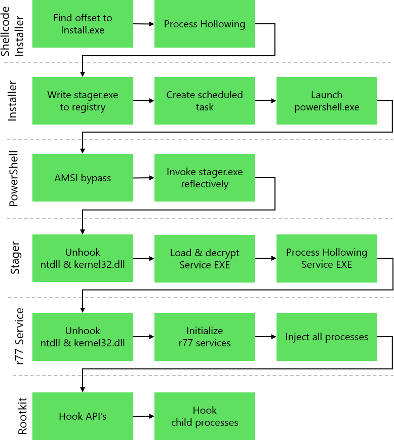

该图是 R77 GitHub 仓库的图片。

#### 安装模块

安装模块的主要任务是通过劫持系统调用完成恶意模块的部署与持久化。

1. **恶意模块的存储**：
   - 将初始阶段模块（Stager Module）存储为注册表键 `$77stager`。
   - 通过拦截注册表相关 API（如 `RegSetValueEx`），绕过安全工具对注册表操作的监控。

2. **生成 PowerShell 命令**：
   - 构建用于从注册表中加载初始阶段模块的 PowerShell 命令，并对其变量进行混淆以提高隐蔽性。
   - 劫持 PowerShell 执行流程，避免恶意活动被安全工具检测。

3. **绕过 AMSI**：
   
   使用 Detours 劫持 `AmsiScanBuffer` 函数，强制返回 `AMSI_RESULT_CLEAN`，使得 PowerShell 执行的代码被认为是安全的。
   
4. **创建持久化任务**：
   
   通过 COM 接口创建定时任务，在系统启动时执行恶意模块。

#### 初始阶段模块

初始阶段模块负责为 R77 后续操作奠定基础，其功能包括 API 解钩、权限提升和有效载荷加载。

1. **API 解钩（Unhooking DLL）**：
   
   即利用 Detours 恢复 `NTDLL.dll` 和 `KERNEL32.dll` 的原始状态，移除安全工具插入的 Hook。
   
   具体步骤为：
   - 从磁盘加载干净的 DLL 副本。

   - 将其映射到内存中。
   
   - 分析并重写被 Hook 的 `.text` 段。
   
2. **权限提升**：
   
   使用 Detours 劫持 `AdjustTokenPrivileges`，提升当前进程的 `SeDebugPrivilege`，以便访问其他进程的内存。
   
3. **载荷解密与注入**：
   
   - 使用 GZip 解压并通过 XOR 解密服务模块（Service Module）。
   - 将解密后的模块通过进程镂空技术（Process Hollowing）注入到合法进程中。
   
4. **伪造父进程 ID（PPID Spoofing）**：
   
   利用 Detours 劫持进程创建 API（如 `CreateProcess`），将目标进程的父进程伪装为系统进程（如 `winlogon.exe`），增加其合法性。

#### 服务模块

服务模块在 Stager Module 完成部署后运行，负责动态配置和核心模块注入。

1. **注入核心模块**：
   
   通过 Detours 劫持 `NtResumeThread` 和 `NtCreateThreadEx`，在子进程启动时将核心模块注入。
   
2. **动态配置**：
   
   在注册表路径 `HKEY_LOCAL_MACHINE\SOFTWARE\$77config` 下创建一个动态配置键，允许进程隐藏规则的实时更新。
   
3. **核心模块的分发**：
   
   定期扫描所有进程，将核心模块注入到符合条件的目标进程中。

#### 核心模块

核心模块是 R77 的核心部分，直接利用 Detours 操控系统关键 API，实现资源隐藏。

1. **目标 API 列表**：
   
   - `NtQuerySystemInformation`：隐藏进程。
   - `NtQueryDirectoryFile` / `NtQueryDirectoryFileEx`：隐藏文件和目录。
   - `NtEnumerateKey` / `NtEnumerateValueKey`：隐藏注册表键和值。
   - `NtDeviceIoControlFile`：隐藏 TCP 和 UDP 网络连接。
   - ……
   
2. **Detours 的实现细节**：
   
   - **挂接 API**：
     
     使用 `DetourAttach()` 替换目标 API 的入口地址。
   - **过滤返回值**：
     
     通过代理函数（Hook 函数）检查返回数据，根据攻击者配置过滤特定条目。
   - **恢复原逻辑**：
     
     通过 `DetourDetach()` 在必要时恢复 API 原始行为。

### （三）Detours 的典型应用场景

#### DLL 注入与反射加载

**过程**：

- 使用 `VirtualAllocEx` 为目标进程分配内存。

- 将恶意 DLL 写入目标进程内存。

- 调用 `ReflectiveDllMain` 加载 DLL，执行恶意代码。

**效果**：实现无文件运行，隐蔽恶意模块。

#### API Hooking 示例

以下代码展示了 R77 如何利用 Detours 劫持文件系统 API `NtQueryDirectoryFile`，隐藏特定文件：

```c
NTSTATUS HookedNtQueryDirectoryFile(
    HANDLE FileHandle, 
    PVOID FileInformation, 
    ULONG Length
) {
    // 调用原始函数
    NTSTATUS status = OriginalNtQueryDirectoryFile(FileHandle, FileInformation, Length);
    // 过滤结果，隐藏以 "$77" 开头的文件
    FilterHiddenFiles(FileInformation);
    return status;
}
```

#### 进程隐藏

通过劫持 `NtQuerySystemInformation` 实现进程隐藏：

- **拦截系统 API 返回值**：删除特定进程 ID 条目。

- **实现隐蔽性**：使任务管理器和其他监控工具无法检测隐藏进程。

### （四）检测与防御措施

1. **完整性检查**：
   
   比对核心 DLL 的 `.text` 段，检测是否被修改。
2. **行为监控**：
   
   使用 Sysmon 和 Procmon 监控异常的 API 调用。
3. **部署 EDR 工具**：
   
   利用端点检测响应系统实时识别动态 Hook 行为。

R77 的成功在于精心设计的多模块协同，以及对 Detours 技术的滥用，使得其在隐藏性和功能性上达到了极高的水准。理解其工作原理有助于研发有效的检测和防御工具。

## 五、实验结论及心得体会

---

### 1. 实验结论

通过本次对 R77 工具的深入研究和实际操作，我们成功验证了其在隐藏进程、文件、注册表项以及 TCP/UDP 连接方面的卓越效果及有效性。实验结果表明，R77 能够通过系统级别的拦截和修改操作，实现高度隐蔽且灵活的隐藏功能，而无需对被隐藏对象进行物理状态或数据上的修改。这一特性不仅展示了 R77 在系统管理和隐私保护方面的强大能力，同时也揭示了其潜在的安全风险——可能被恶意软件利用来进行隐蔽活动，从而对用户和企业构成威胁。总体而言，实验达到了预期目标，取得了圆满成功。

### 2. 心得体会

此次实验不仅让我深入了解了 R77 工具的技术原理与功能特性，还为我提供了宝贵的实践经验和个人感悟：

- **技能提升**：通过实验，我进一步熟练掌握了如 Prcomon、ProcessExplorer 等病毒分析工具的使用技巧，提高了我的病毒分析和问题解决能力。
- **认识深化**：在实验过程中，我深刻认识到技术是一把双刃剑。虽然 R77 为系统管理和隐私保护提供了强有力的支持，但同时也存在被滥用的风险。这使我更加意识到，在进行技术研究和应用时必须时刻关注安全性和伦理问题。
- **学习动力**：实验的成功激发了我对计算机技术深入学习的兴趣。我认识到只有不断学习并掌握新技术，才能更有效地应对日益复杂的网络安全威胁与挑战。

总之，这次经历不仅增强了我的专业技能，也加深了我对信息安全领域重要性的理解，并激励着我在未来继续探索更多未知领域。
