<div align='center'>
<b> <font face='微软雅黑' size='6'> 恶意代码分析与防治技术课程实验报告 </font> </b>
</div>


<div align='center'>
<b> <font font face='微软雅黑' size='6'> 实验十一 </font> </b>
</div>


<div>
<font face='宋体' size='6'>&nbsp;&nbsp;&nbsp;&nbsp; 学 院：网络空间安全学院 </font> <br>
<font face='宋体' size='6'>&nbsp;&nbsp;&nbsp;&nbsp; 专 业：信息安全 </font> <br>
<font face='宋体' size='6'>&nbsp;&nbsp;&nbsp;&nbsp; 学 号：2212998 </font> <br>
<font face='宋体' size='6'>&nbsp;&nbsp;&nbsp;&nbsp; 姓 名：胡博浩 </font> <br>
<font face='宋体' size='6'>&nbsp;&nbsp;&nbsp;&nbsp; 班 级：信息安全 </font> <br>
</div>


## 一、实验目的

---

1. 完成教材上 lab11 的实验内容。
2. 在样本分析结果的基础上，编写样本的 Yara 检测规则。
3. 尝试编写 IDA Python 脚本来辅助样本分析。

## 二、实验原理

---

### 后门技术

后门程序是一种特殊的恶意软件，它赋予攻击者绕过正常认证机制，远程访问受感染系统的权限。以下是后门程序的主要类型及其检测策略：

**固定 Shell 后门**：在目标系统中植入一个固定的命令行接口，允许攻击者执行任意命令。这种后门活动可以通过网络流量分析或系统日志审查来识别。

**系统级 Rootkit 后门**：通过修改系统核心组件（例如 Windows 的 GINA 模块），后门能够提升权限并隐藏其存在。防御措施包括强化身份验证机制（如使用复杂密码和多因素认证）以及定期审查系统配置和权限。

### Rootkit 分析

Rootkit 是一套工具，旨在隐藏恶意软件及其活动，通常通过操纵操作系统的关键功能来实现。Rootkit 的主要类型包括：

**IAT Hook Rootkit**：通过修改进程的导入地址表（IAT）来拦截系统调用。识别此类 Rootkit 的关键在于行为分析和系统完整性校验。

**Inline Hook Rootkit**：直接修改代码内容，改变函数的执行路径。通过行为分析检测异常的系统调用流程，可以发现此类 Rootkit。

防御 Rootkit 的策略包括使用完整性验证工具来检测内核和用户态的异常，以及监控内存和文件系统活动，以定位隐藏的 Rootkit 组件。

### Windows 恶意软件技术

**Windows 服务劫持**：通过替换或修改 Windows 服务文件，使恶意代码随系统启动而运行。通过检测服务配置的异常，有助于识别这种技术。

**DLL 劫持**：利用 Windows 动态链接库加载机制的漏洞，将恶意 DLL 文件插入系统。定期更新系统和验证 DLL 加载路径是有效的防御措施。

常见的恶意软件行为还包括：

**登录凭证窃取**：通过转储密码哈希值或“Pass-The-Hash”攻击来窃取登录信息。观察恶意代码是否存储或传输哈希值是识别这些攻击的关键。

**按键记录器**：在用户态通过 API Hook（如 SetWindowsHookEx、GetAsyncKeyState）记录按键，在内核态通过键盘驱动拦截键盘输入。

**存活机制**：利用注册表（如 Run、AppInit_DLLs、Winlogon 等）或 DLL 劫持等方法实现持久化。

**提权**：通过访问令牌提权或利用系统漏洞获取更高权限。

**Rootkit 隐藏技术**：在用户态使用 IAT Hook 或 Inline Hook 隐藏进程、文件或网络活动。

## 三、实验过程

---

### （一）完成 Lab11 的题目

#### 1. Lab11-1

**分析恶意代码 Lab11-01.exe。**

##### （1）初步静态分析

首先，进行初步的静态代码分析。利用 `DIE` 工具检查程序是否被加壳：

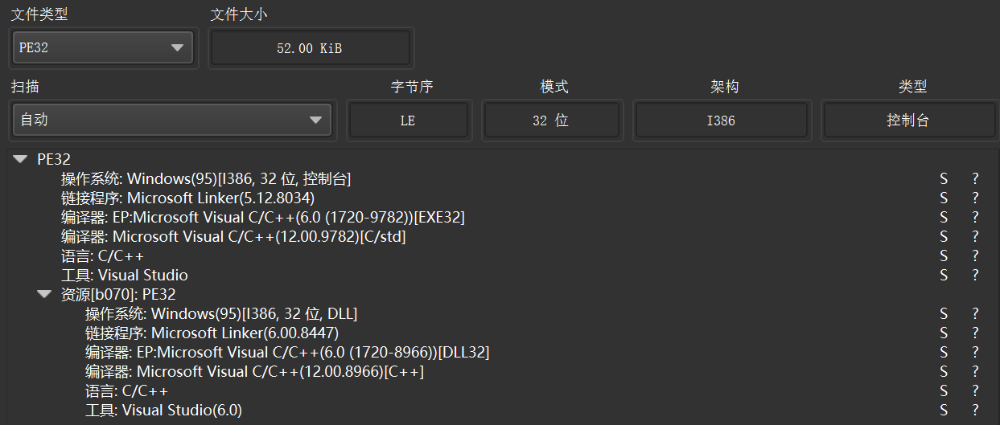

分析结果显示，该恶意软件未加壳，且由 VC6 开发环境编写。进一步检查发现，它包含一个额外的资源节。

接下来，我们检查导入表：


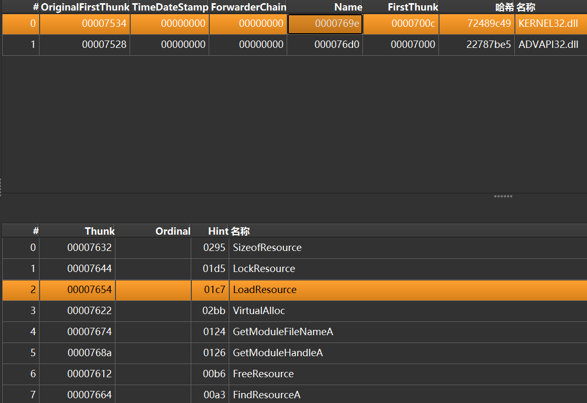

从这些表中，可以识别出一些关键的函数，这些函数暗示了恶意软件可能具有资源操作能力。结合资源节的存在，这需要进一步深入分析。

- **资源节操作**：`FindResourceA`、`SizeofResource` 和 `LoadResource` 等函数的存在表明恶意软件可能具备操作资源的能力。
- **注册表操作**：`APVAPI32.dll` 库中的 `RegSet` 和 `CreateValue` 函数表明恶意软件能够修改注册表。

进一步查看字符串信息：

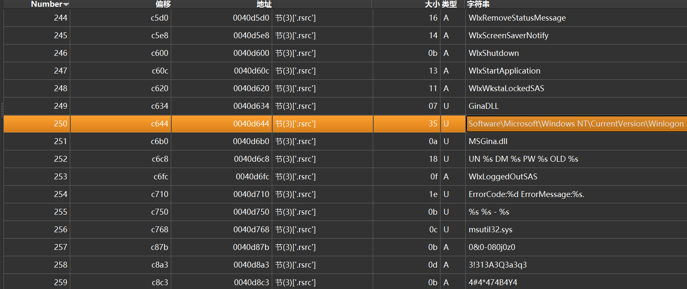

字符串中出现了 `Gina.dll` 和 `SOFTWARE\Microsoft\Windows NT\CurrentVersion\Winlogon`，这些信息提供了重要的线索：

- **GinaDLL**：这是 Windows 登录过程中的一部分，负责用户认证。攻击者可能会替换这个 DLL 以窃取用户凭据或植入恶意功能。
- **Winlogon 注册表路径**：这是管理用户登录和注销配置的关键路径。攻击者可能会修改这个路径下的值，以自动启动恶意代码或绕过安全措施。
- **msginan32.dll**：这可能是与 `GinaDLL` 相关的文件，攻击者可能会替换或修改这个文件。

结合注册表路径和系统驱动文件，推测恶意软件通过修改注册表来拦截 `GINA`，并利用驱动文件实现其功能。

在资源节中，发现了：

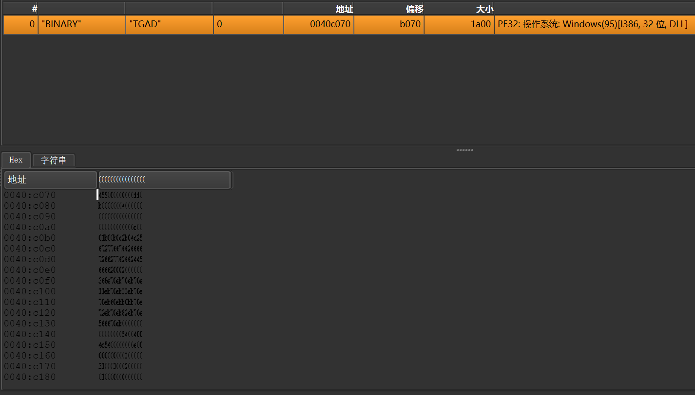

一个名为 `TGAD` 的资源节，结合之前字符串分析的结果，推测这是一个可执行文件。考虑到导入表中对它的 `Find` 和 `Load` 操作，恶意软件可能会尝试加载这个恶意的 exe 文件。

因此，使用 `Resource Hacker` 工具：

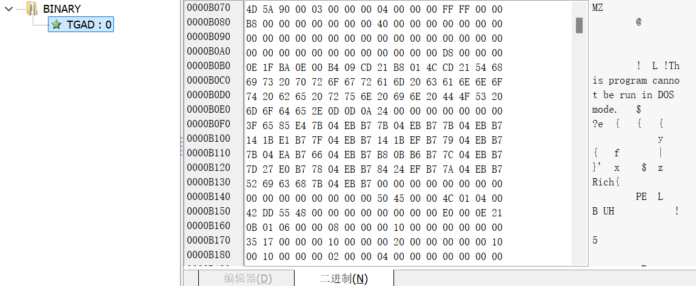

将 `TGAD` 资源保存为 bin 格式的可执行文件。然后，使用 `DIE` 工具检查其导入表：


再次看到 `RegSet` 和 `CreateKey` 等注册表操作函数，这进一步证实了 exe 文件加载 `TGAD` 后会进行注册表修改。

查看导出表：

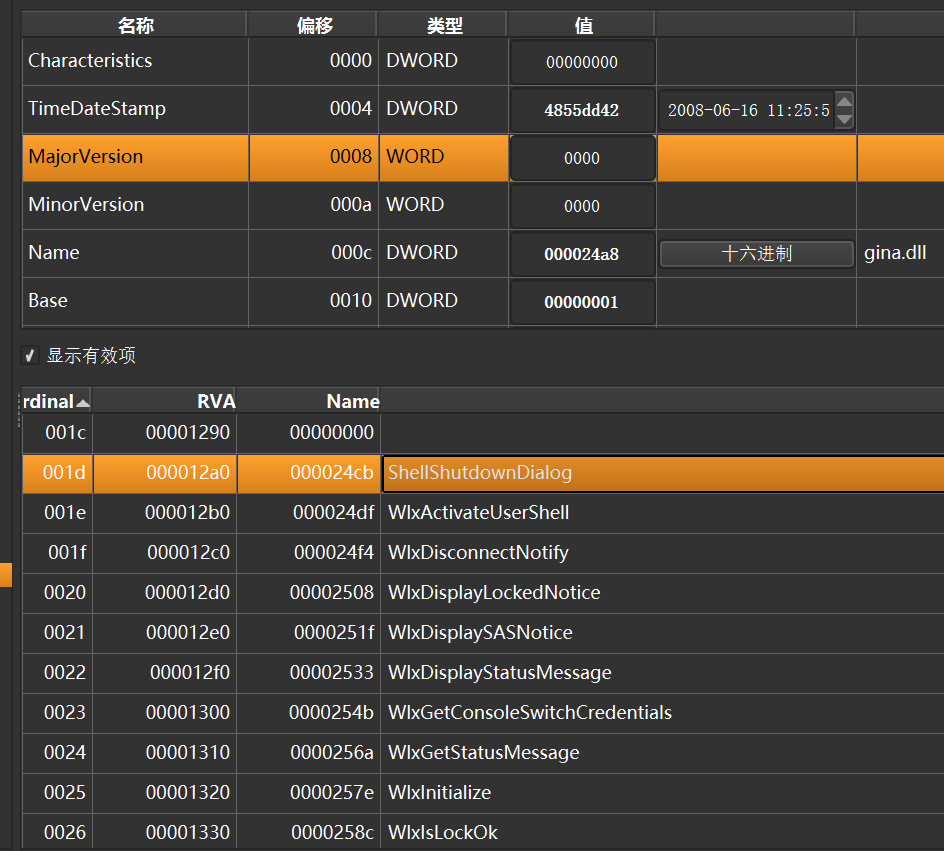

可以看到许多以 `Wlx` 为前缀的函数，这些都是 `GINA` 拦截所必需的：

- **WlxInitialize**：初始化 `Gina DLL`。
- **WlxDisplaySASNotice**：显示登录请求的安全注意事项。
- **WlxLoggedOutSAS**：处理用户注销的 SAS 操作。

最后，再次查看字符串：

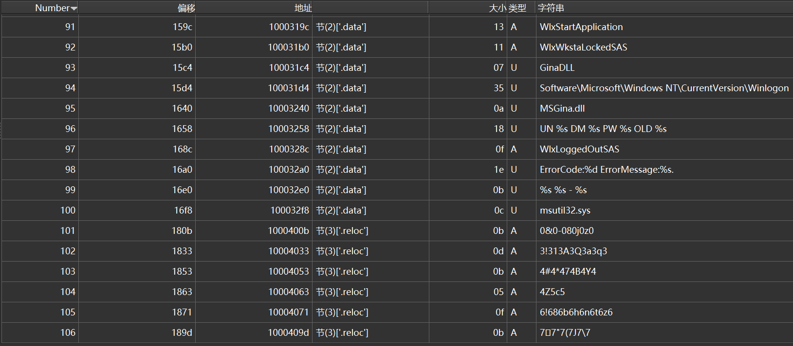

一些有趣的字符串信息：

- **Gina 与 Winlogon 注册表路径**：这与之前对 exe 文件的静态分析结果一致，表明恶意软件会操作 Gina。
- **UN%sDM%sPW%sOLD%s**：结合其拦截 GINA 的行为，我们推测这可能是用于记录用户登录凭据的日志。
- **msutil32.sys**：这是一个系统文件。

##### （2）综合行为分析

在开始行为分析之前，确保已经创建了系统快照，以便跟踪变化。

首先，我们利用 Procmon 工具监控程序的行为，通过设置特定的过滤条件来聚焦于目标程序：

```assembly
Process Name is Lab11-01.exe
```

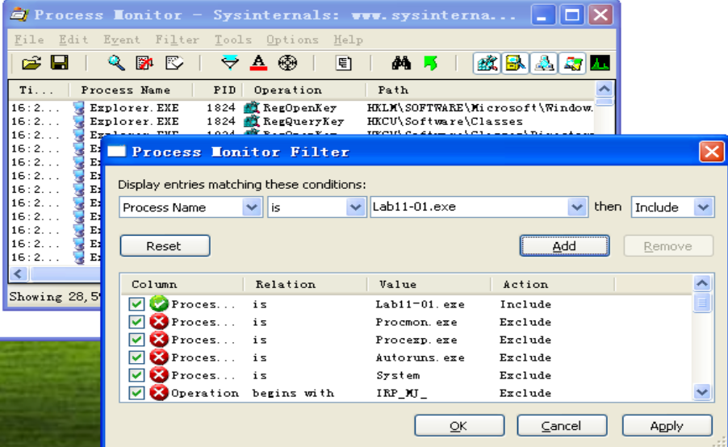

随后，执行 Lab11-01.exe 程序：

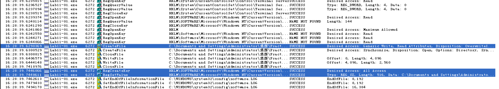

监测结果显示，该恶意程序尝试通过 CreateFile 函数在启动目录下创建一个名为 msgina32.dll 的文件。接着，它通过注册表操作将这个恶意 DLL 添加到 `SOFTWARE\Microsoft\windowsNT\CurrentVersion\Winlogon` 路径下。这一行为与我们之前的静态代码分析结果相吻合，意味着一旦系统重启，WinLogon 将会自动加载这个 DLL。此外，通过对 Lab11-01-TGAD 资源节和 msgina.dll 进行 MD5 校验，我们发现它们实际上是同一个文件。于是我们将其重新命名为 msgina32.dll。

利用 RegShot 工具对比恶意代码执行前后的系统快照，确认了注册表确实被修改，且修改指向了 GINA，这导致在系统启动时 WinLogon 会加载该 DLL 文件。重启计算机后，登录界面的出现进一步证实了恶意代码旨在捕获用户的用户名和密码。

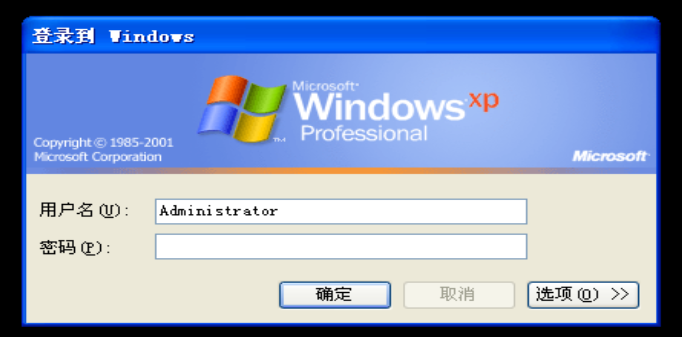

##### （3）深入分析

接下来，我们将通过 IDA 工具对恶意程序进行深入分析。将 `exe` 文件拖入 IDA 中进行反编译，并直接跳转到 `main` 函数以查看其反编译代码：

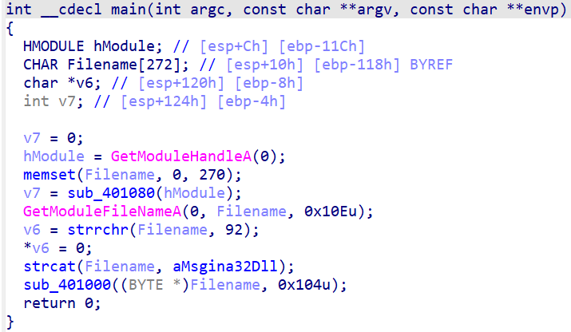

这是程序的入口点。程序首先获取模块句柄，清空一个文件名字符串，然后调用 `sub_401080` 函数。获取当前模块的文件名，接着修改它以指向一个名为 "msgina32.dll" 的新文件。

接下来，我们检查这两个函数的实现：

- **sub_401080**：

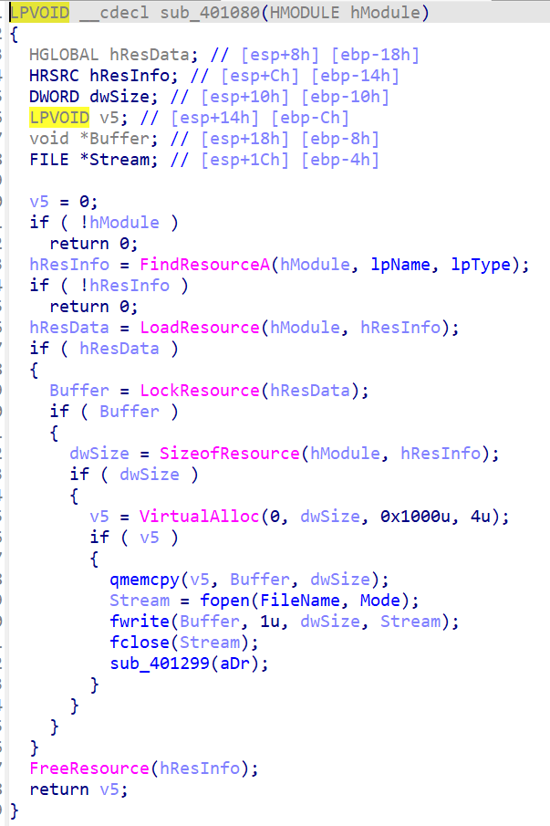

该函数通过文件句柄，不断执行查找和加载资源节 `TGAD` 到 `msgina32.dll` 的操作。具体步骤包括：查找并锁定资源，获取资源大小，将资源内容复制到新分配的内存，并最终将资源内容写入 "msgina32.dll" 文件。最后，调用 `sub_401299` 函数来输出相关信息。

- **sub_401000**：

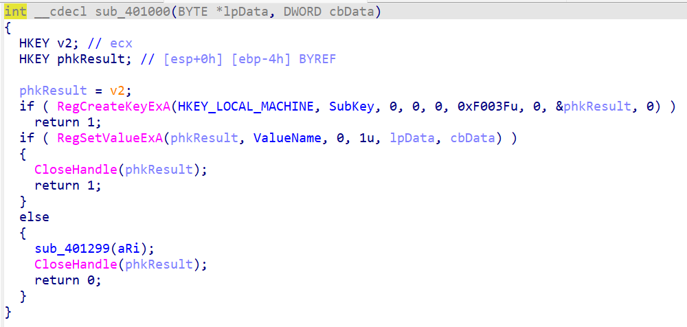


根据对注册表的修改行为，推测该函数与 `GINA` 有关。该函数利用文件名写入键值，最后使用 `sub_401299` 来输出信息。它尝试创建或打开注册表键 `"SOFTWARE\Microsoft\Windows NT\CurrentVersion\Winlogon"`，并设置一个名为 `"GinaDLL"` 的值，可能用于替换或修改默认的 `GINA`（图形标识和认证）。最后，调用 `sub_401299` 函数来输出相关信息。

综上所述，该 `exe` 文件实际上是 `msgina32.dll` 的安装器。因此，接下来的分析重点将是这个 `dll` 文件。

我们继续使用 IDA 对 `dll` 文件进行详细分析。将 `dll` 文件导入 IDA 并分析其主要代码段：

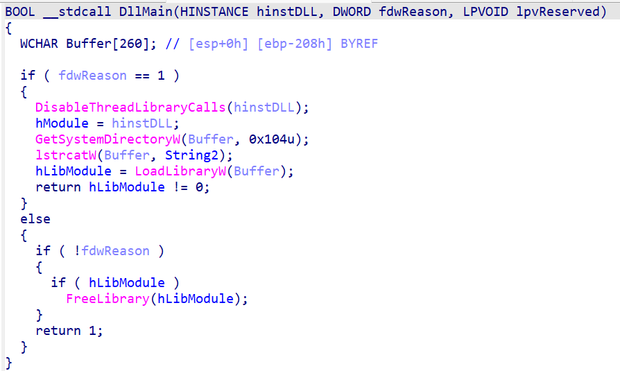

关键代码段分析：

- **参数解析**：`hinstDLL` 代表 DLL 句柄，`fdwReason` 指示调用原因，`lpvReserved` 为保留参数。
- **DLL 加载处理**：当 `fdwReason` 等于 1，即 `DLL_PROCESS_ATTACH` 时，执行以下操作：
  - 调用 `DisableThreadLibraryCalls` 禁用线程调用。
  - 将 `hinstDLL` 赋值给全局变量 `hModule`。
  - 使用 `GetSystemDirectoryW` 获取系统目录路径并存储于 `Buffer`。
  - 通过 `lstrcatW` 在 `Buffer` 后追加 `"_MSGina"`。
  - 调用 `LoadLibraryW` 加载 `"MSGina"` 库，并将句柄存储于 `hLibModule`。
- **DLL 卸载处理**：当 `fdwReason` 等于 0，即 `DLL_PROCESS_DETACH` 时，如果 `hLibModule` 非空，则调用 `FreeLibrary` 释放库文件。

此外，除了 `DllMain` 之外，还有一些名为 `gina_1`、`gina_2` 等的类似函数：

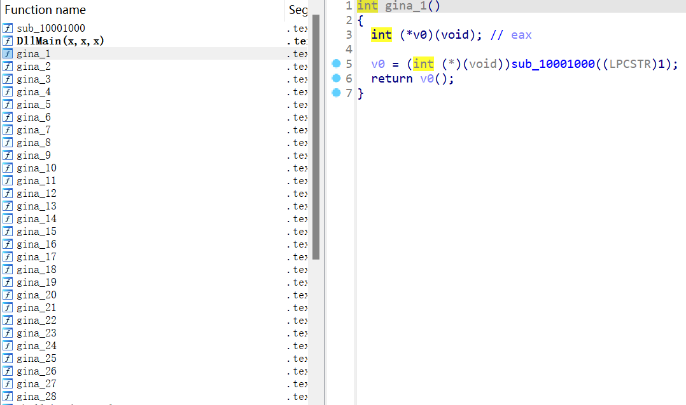

这些函数代码几乎相同，都是调用 `sub_10001000` 位置的函数，目的是获取一个函数指针。它们的区别在于传入的参数 `LPCSTRlpProcName` 不同，代表不同的字符串。

进入 `sub_10001000` 函数查看：

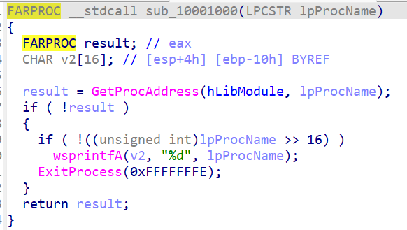

关键点：

- 接受一个名为 `lpProcName` 的字符串参数，并返回 `FARPROC` 类型的值，前者应该是不同的函数名字符串。
- 使用 `GetProcAddress` 函数检索动态链接库中导出函数的地址。第一个参数是 `hLibModule`，已指向被加载的 `msgina.dll` 的句柄。第二个参数是 `lpProcName`，表示要检索的函数名。
- 如果 `GetProcAddress` 返回的结果是空（即 0），则代码会进行进一步的检查。使用位运算检查 `lpProcName` 的高 16 位是否为 0，如果是，则调用 `wsprintfA` 函数格式化字符串，将错误信息存储在 `v2` 变量中。然后调用 `ExitProcess` 函数终止当前进程。

因此，该函数通过传入的参数 `LPCSTR` 的不同值来作为函数地址偏移，来选取 `msgina.dll` 中的不同函数。`GetProcAddress` 获取到了函数地址。

由于 `hLibModule` 是 `msgina.dll` 的句柄，因此这个函数将解析 `msgina` 中的函数，通过参数来控制函数偏移，解析成功则直接返回这个函数的地址。

大部分导出函数实际上只是直接跳转到 `msgina` 对应的函数。

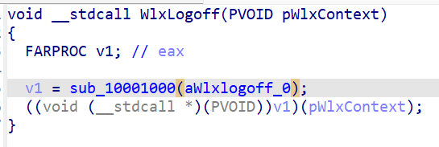

可以看到，很明显通过上述地址偏移找到的位置，直接跳转到的应该就是 `GINA` 需要的那些导出函数，包括 `Wlx` 前缀的那些导出函数。

但是有一个特例即 `WlxLoggedOutSAS` 函数，它包括了额外的代码：

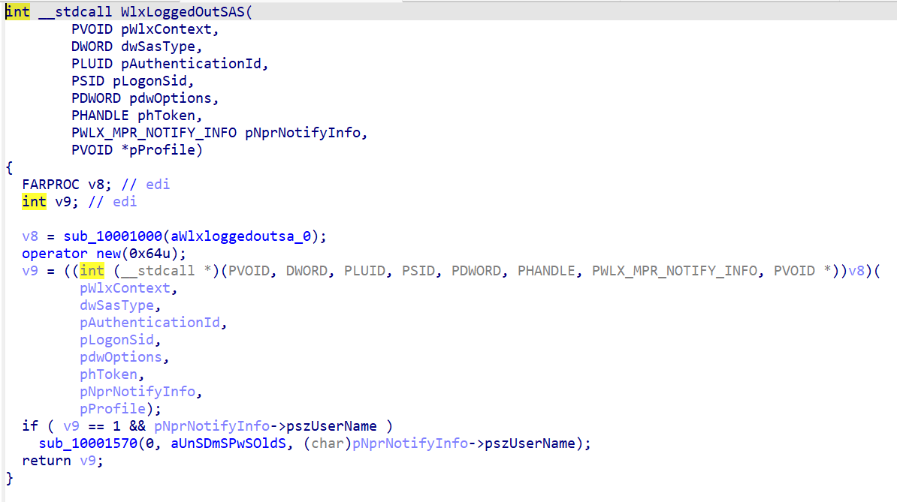

它本来的作用是处理用户注销时的安全身份验证的动态链接库文件。看到这个 `WlxLoggedOutSAS` 并不是跳到了直接的对应 `GINA` 函数，而是转而去了 `sub_10001570`。

查看 `sub_10001570` 函数：

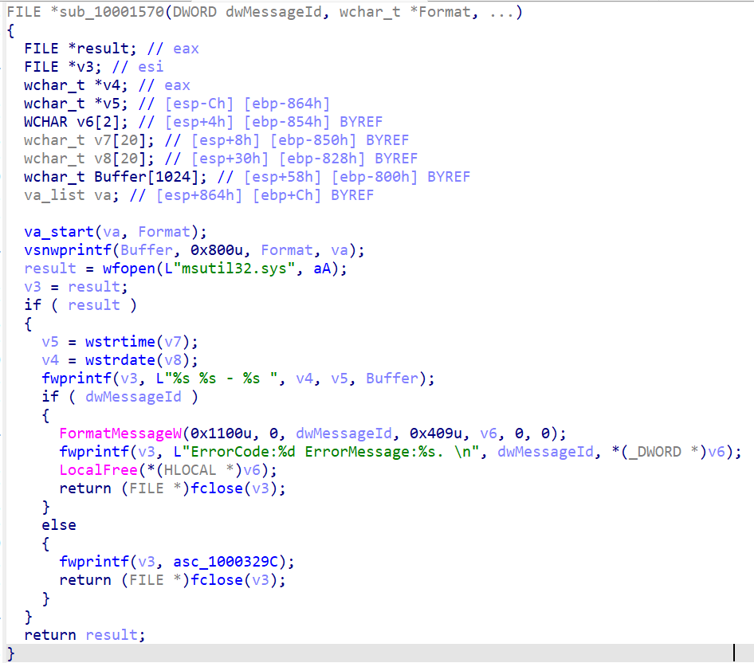

这个函数看起来像是窃取登录凭证的函数。关键点：

- `vsnwprintf(&Dest, 0x800u, Format, va)`：使用可变参数列表 `va` 和格式化字符串 `Format`，将格式化后的字符串写入 `Dest` 中。
- `wfopen(Filename, Mode)`：创建并打开一个文件，`Filename` 是文件名，`Mode` 是文件打开模式。详细查看后，这里的 `Filename` 对应了之前静态分析发现的字符串 `msutil32.sys`，推测是向其中写入一些文件内容。
- `fwprintf(v3, ::Format, v5, v4, &Dest)`：使用 `v3` 指向的文件流，按照 `::Format` 指定的格式，将 `v5`、`v4` 和 `Dest` 的内容写入文件。其中 `v5` 还有 `v4` 对应的都是日期和时间的信息，而 `Dest` 储存的是格式化的消息字符串。
- `FormatMessageW`：用来格式化调用获取错误信息的文本描述，对应的描述为“ErrorCode:%d ErrorMessage:%s”。

综上所述，整个函数看起来是一个用来记录日志的函数。并把格式化的日志信息记录在 `msutil32.sys` 文件中。其中由于 `Winlogon` 位于 `System32` 目录，因此这个文件也是创建在这里，并且运行在 `Winlogon` 进程中。如果没有提供消息 ID，它可能会写入一个默认的日志消息。最初我们推测字符串时候，想的是或许 `msutil32.sys` 根据其后缀表达，有可能是一个系统文件。但是由于它是在 `WlxLoggedOutSAS` 这个函数调用时候使用，并用来记录日志，或许还有别的可能。

因为 `WlxLoggedOutSAS` 的调用会默认遍历所有存在的用户名，这样才能实际上地进行销毁和注销。因此这个过程会暴露所有的用户信息及登录凭证。故 `sub_10005070` 可能会在这个过程中窃取登录的用户名和密码，然后再把这些信息写在 `System32` 下的 `msutil32.sys` 文件中，让我们误以为他只是一个简单的系统文件，借此隐藏自己。

使用记事本打开该 `sys` 文件，可以看到其确实记录有上面重启登录时的信息。

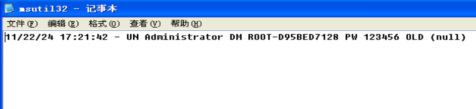

因此，我们可以确定 Lab11-1 是一个精心设计的恶意程序，专门针对 GINA 进行拦截。该恶意软件的核心目标是在受感染的计算机系统中部署一个定制的 DLL 文件，该文件在系统重启后被激活，开始执行其恶意行为。主要的恶意活动包括在用户登录过程中秘密捕获凭据信息。

Lab11-01.exe 实际上是一个安装程序，它包含了一个特定的资源节，该资源节是一个 DLL 文件。这个安装器的主要功能是加载其资源节中的 DLL 文件。该 DLL 文件被设计用来拦截 GINA，即在用户登录认证过程中起关键作用的动态链接库。通过修改系统注册表，该恶意软件能够在系统重启后，在用户注销过程中秘密窃取信息，实现其恶意目的。这种行为使其成为一个高效的账号盗窃工具。

##### （4）问题解答

> Q1. 这个恶意代码向磁盘释放了什么？

此恶意程序从其资源节 TGAD 中提取并释放了一个名为 msgina32.dll 的文件，将其放置在与恶意程序同一目录下。


> Q2. 这个恶意代码如何进行驻留？

为了实现自启动，该程序创建了一个新的注册表项 `HKLM\SOFTWARE\Microsoft\WindowsNT\CurrentVersion\Winlogon\GINADLL`，确保每次系统启动登录时，msgina32.dll 作为 GINA DLL 被安装，从而使得 msgina32.dll 在系统重启后能够被加载。


> Q3. 这个恶意代码如何窃取用户登录凭证？

该程序利用 GINA 拦截功能盗取用户登录凭证。msgina32.dll 能够捕获所有提交给系统认证的用户登录信息。

> Q4. 这个恶意代码对窃取的证书做了什么处理？

该恶意程序将盗取的登录凭证记录在 `%SystemRoot%\System32\msutil32.sys` 文件中，包括用户名、域名、密码和时间戳。使用.sys 作为文件后缀是为了伪装，以避免引起注意。

> Q5. 如何在你的测试环境让这个恶意代码获得用户登录凭证？

在释放并安装恶意程序后，需要重启系统以启动 GINA 拦截。只有在用户注销时，恶意程序才会记录登录凭证，因此需要注销并重新登录系统，才能在日志文件中查看到登录凭证，正如我们之前的结果所示。

#### 2. Lab11-2

**分析恶意代码 Lab11-02.dll。假设一个名为 Lab11-02.ini 的可疑文件与这个恶意代码一同被发现。**

##### （1）初步静态分析

首先对样本进行了初步的静态分析。使用 `DIE` 工具检查样本是否加壳：

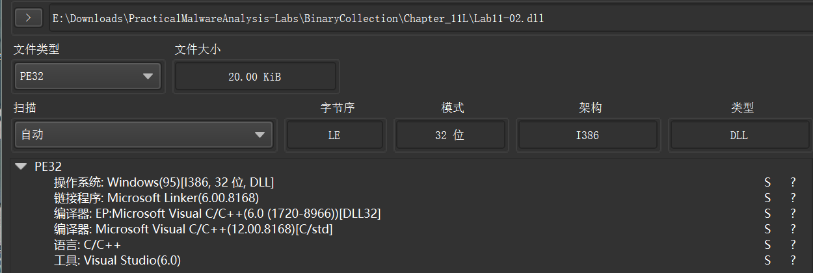

结果显示样本未加壳。

接下来，检查样本的导入表：

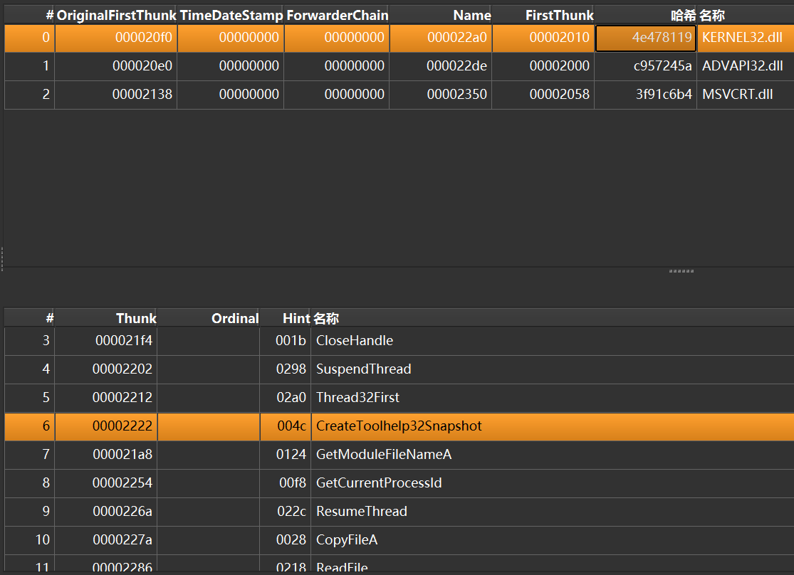

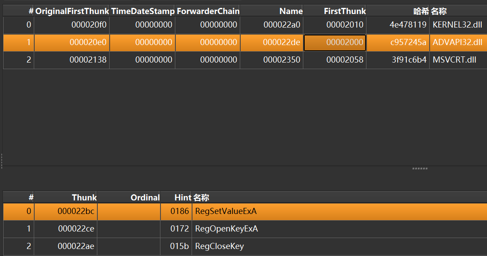

在导入表中，我们发现了一些值得注意的函数：

- **ADVAPI32.dll**：包含注册表操作函数，如 `RegOpenKeyExA` 和 `RegSetValueExA`。
- **Kernel32.dll**：包含可疑函数 `CreateToolhelp32Snapshot`，用于获取系统进程和模块信息，以及 `CopyFileA`，用于文件复制。

样本可能利用 `RegSetValueExA`、`RegOpenKeyExA` 进行注册表修改，使用 `CreateToolhelp32Snapshot` 搜索进程或线程列表，使用 `CopyFileA` 复制文件。

继续分析导出表：

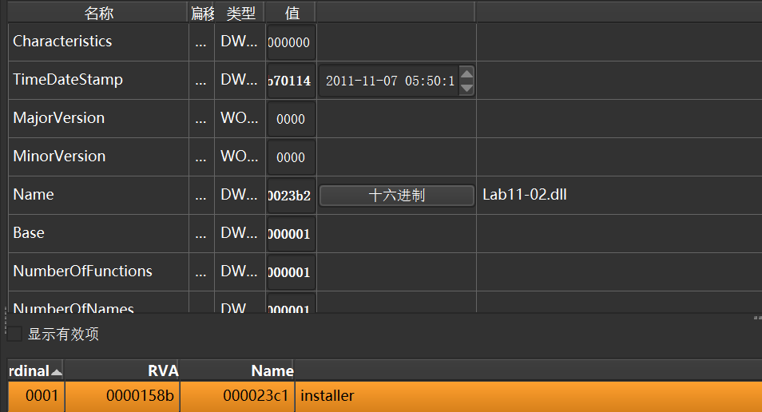

发现一个名为 `installer` 的导出函数，暗示样本可能具有自安装行为。结合之前的注册表操作函数，推测样本可能具有驻留行为，可能安装一个进程。

然后，查看样本中的字符串：

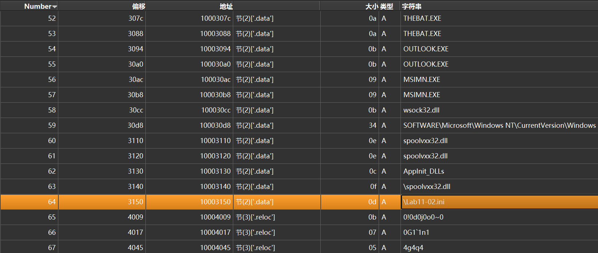

发现了一些有趣且指向性的字符串：

- **注册表路径**：`SOFTWARE\Microsoft\Windows NT\CurrentVersion\Windows`，包含 Windows 版本和配置信息，如安装路径、产品密钥、安全设置等。结合之前的注册表操作函数，推测样本对此路径下的注册表有操作。
- **AppInit_DLLs**：Windows 操作系统中的一个注册表键，用于指定在用户登录时自动加载的动态链接库文件。结合上面的注册表路径，推断恶意代码可能利用这个注册表键来安装自己。如果成功，它会被加载到所有装载了 User32.dll 的进程中。
- **配置文件**：`Lab11-02.ini`，表明病毒使用了配置文件。
- **邮件客户端**：`OUTLOOK.EXE`、`MSIMN.EXE` 和 `THEBAT.EXE`，分别是 Microsoft Outlook、Microsoft Outlook Express 和 The Bat! 的客户端可执行文件，推测病毒可能具有邮件操作行为。
- **网络行为**：`send` 和 `wsock32.dll`，结合邮件信息，推测可能有网络行为，并进行邮件发送。还有 `RCPTT0:` 作为 SMTP 命令创建电子邮件接收人。

字符串中的 `SOFTWARE\Microsoft\Windows NT\CurrentVersion\Windows` 和 `AppInit_DLLs` 表明恶意代码使用 `AppInit_DLLs` 进行半永久安装。`Lab11-02.ini` 表明其使用了 ini 文件，而 `OUTLOOK.EXE` 和 `THEBAT.EXE` 表明恶意代码对邮件客户端进行了某种处理。

最后，查看了 ini 文件：

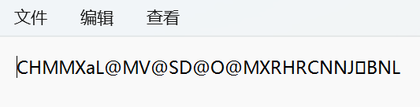


发现一个奇怪的字符串，推测已经加密。似乎经历了混淆处理，暂时无法解密。

##### （2）综合行为分析

依据 Lab3 的分析经验，我们了解到要执行这些 DLL 文件，需要借助 `rundll32.exe` 工具。

首先，我们启动 Promon 并为 `rundll32.exe` 设置了一个行为监控过滤器：

```assembly
Process Name is rundll32.exe
```

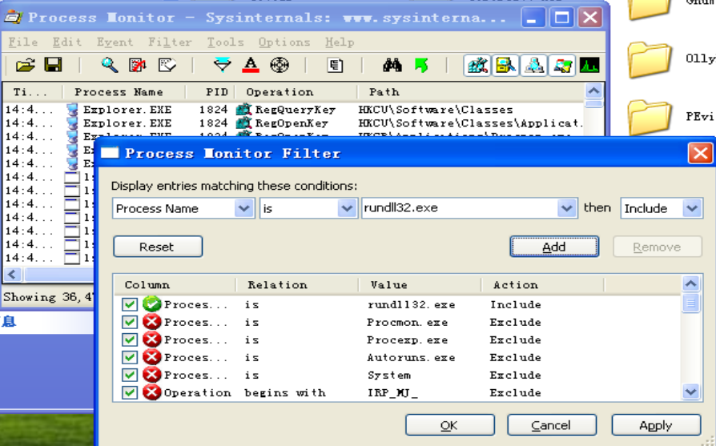

接着，我们使用 Regshot 工具记录系统快照，以便追踪注册表的变化：

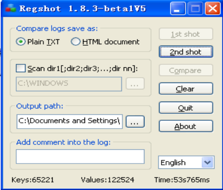

然后，我们通过以下命令执行 DLL 文件的安装：

```assembly
rundll32.exe Lab11-02.dll, installer
```

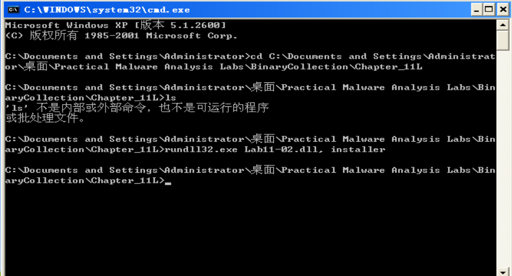

通过 Promon 监控，我们捕获到了以下行为：

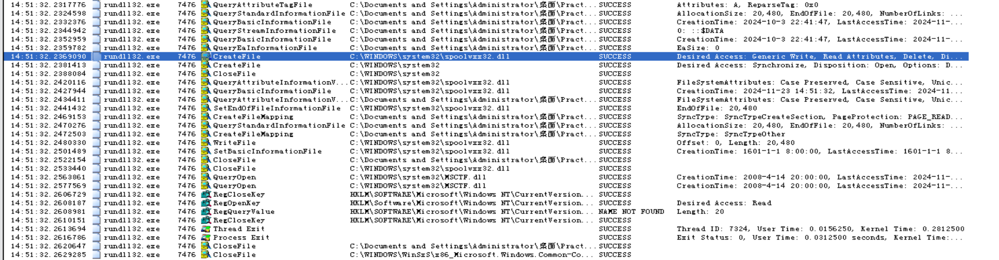

- **文件创建**：恶意代码在系统目录下创建了一个名为 `spoolvxx32.dll` 的文件，位于 `System32` 文件夹内。推测这可能是一个恶意文件。经过进一步地对比分析，我发现这个文件与 `Lab11-02.dll` 完全一致。
- **注册表修改**：恶意代码通过注册表操作将 `spoolvxx32.dll` 添加到了 `AppInit_DLLs` 列表中。
- **配置文件访问**：我还注意到，恶意代码尝试访问系统目录下的 `Lab11-02.ini` 文件，这表明需要将 `Lab11-02.ini` 文件移动到系统目录下。

通过 Regshot 工具的前后对比分析，同样可以确认恶意代码将 `spoolvxx32.dll` 添加到了 `AppInit_DLLs` 列表中，使得恶意代码能够被加载到所有加载了 `User32.dll` 的进程中：

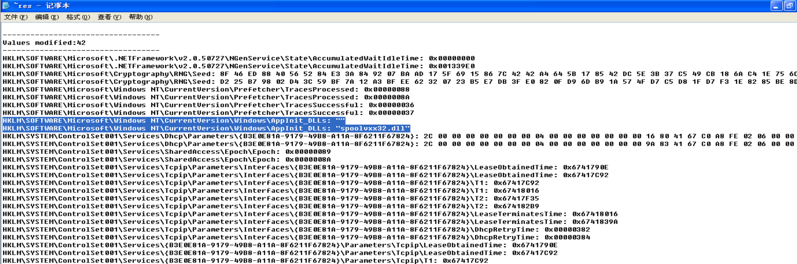

##### （3）深入分析

进一步地，我们使用 IDA 对样本进行深入分析：

首先，检查样本中唯一的导出函数 `installer`：

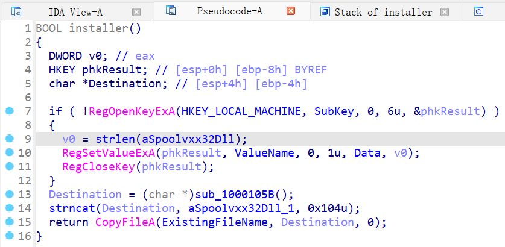

该函数的主要目的是在系统中部署一个名为 "spoolvxx32.dll" 的文件，并对注册表进行修改，以确保该 DLL 在系统启动时被加载。以下是对该函数的详细分析：

**注册表操作**：

- 使用 `RegOpenKeyExA` 打开注册表键 `"SOFTWARE\Microsoft\Windows NT\CurrentVersion\Windows"`。此键与系统启动时加载的组件相关。
- 使用 `RegSetValueExA` 将 `"AppInit_DLLs"` 的值设置为 `"spoolvxx32.dll"`。这意味着每次启动应用程序时，Windows 将自动加载这个 DLL。`"AppInit_DLLs"` 机制常被恶意软件用来实现持久性。
- 关闭注册表键句柄。

**文件操作**：

- 调用 `sub_1000105B` 函数，可能返回一个路径字符串，用于确定 `"spoolvxx32.dll"` 的存放位置。
- 使用 `strncat` 将 `"\spoolvxx32.dll"` 拼接到路径上。
- 使用 `CopyFileA` 将现有文件复制到新路径，可能是将恶意 DLL 放置到指定位置的操作。

值得注意的地方：

- `RegOpenKeyExA` 打开注册表键，如果成功，接下来的操作将在此键下进行。
- `RegSetValueExA` 设置 `AppInit_DLLs` 的值为 `spoolvxx32.dll`，实现病毒驻留的持久化。
- `sub_1000105B` 函数返回路径，并与 `"\spoolvxx32.dll"` 拼接。

 接下来，查看 `sub_1000105B`：

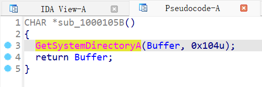

该函数仅使用 `GetSystemDirectoryA` 获取系统目录，并返回路径地址。

使用交叉引用图查看 `installer` 的具体调用情况：

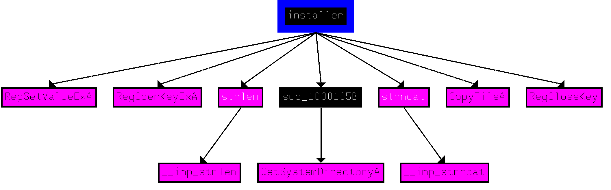

可以看到在注册表中添加了一个项，并将文件复制到系统目录，与前面的分析相匹配。该函数用于将恶意代码复制到 `spoolvxx32.dll` 文件，并将其设置为 `AppInit_DLLs` 值。

接下来分析 `DllMain` 函数：

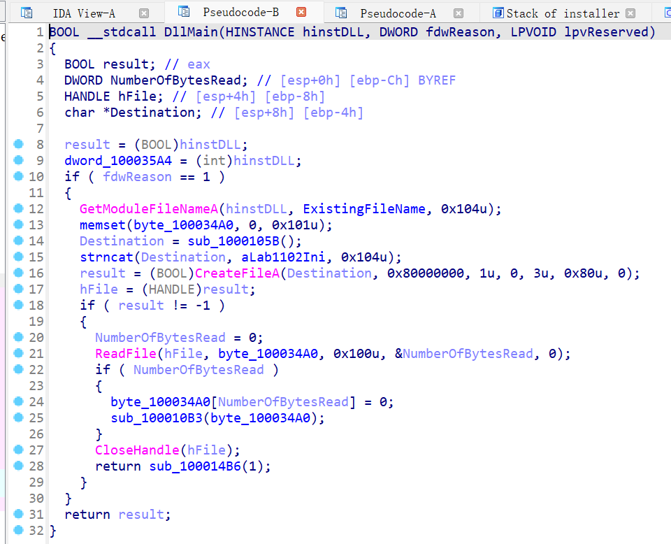

从代码来看，此函数在 DLL 被加载到进程时执行一系列文件操作和可能的配置读取。以下是对该函数的详细解析：

**初始化**：

- 获取 DLL 自身的模块文件名。
- 清零一个字节数组 `byte_100034A0`，可能用于存储配置数据或其他信息。

**配置文件读取**：

- 调用 `sub_1000105B` 函数，返回一个字符串，可能是配置文件的存放路径。
- 使用 `strncat` 在这个路径上拼接 `"\Lab11-02.ini"`，构造出配置文件的完整路径。
- 使用 `CreateFileA` 尝试打开这个配置文件。
- 如果文件打开成功，使用 `ReadFile` 读取内容到 `byte_100034A0` 数组。
- 检查读取的字节数，如果非零，则调用 `sub_100010B3` 处理读取的数据。

**后续处理**：

- 调用 `sub_100014B6`，其作用未知，但可能与 DLL 的初始化或配置应用有关。
- 文件句柄被关闭。

值得注意的地方：

- `fdwReason` 参数表示 DLL 加载或卸载原因。
- `sub_1000105B` 函数调用 `GetSystemDirectoryA` 获取系统目录，返回配置文件的存放路径。
- 使用 `strncat` 在路径上拼接 `"\Lab11-02.ini"`，构造出配置文件的完整路径。
- 调用 `CreateFileA` 函数打开配置文件，如果成功打开文件，则继续读取文件内容。如果文件读取成功，将文件内容传递给 `sub_100010B3` 函数进行处理。
- 最后调用名为 `sub_100014B6` 的函数，传入参数 1，可能是用于通知其他部分 DLL 加载已经完成。

由此可知，关键部分函数是 `sub_100010B3`，它可能隐藏着反混淆对 ini 进行解密的关键。

`sub_100010B3` 似乎用于解密数据，我们查看这个函数的代码：

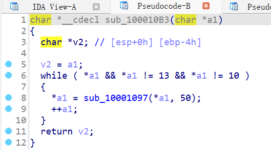

不出所料，此时正在利用一些字符串和 13 以及 10，还有 50 等对应的 ASCII 码字符进行类似的解密操作，同样他还调用了 `sub_10001097`：

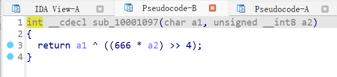

看到也在解密复杂的东西。到此我们就有目标了，由于我们之前 Procmon 观察到它会尝试打开 system32 下的 ini，我们也把配置文件挪进去了。而且我们还知道关键的解密代码位置了，因此直接可以进行动态分析，来到此处，一步一步看到解密的结果啦！

**使用 OllyDbg 进行动态分析。**

考虑到 IDA 与 OllyDbg 在加载地址时可能存在的差异，我们计算出需要在 `sub_100010B3` 函数的 0x003D10B3 地址处，找到 0x003D16CA 位置，并在该调用结束后设置断点。

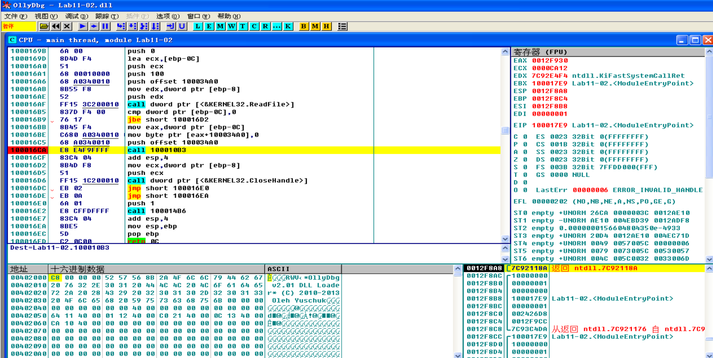

运行程序至断点处，并进行单步执行：

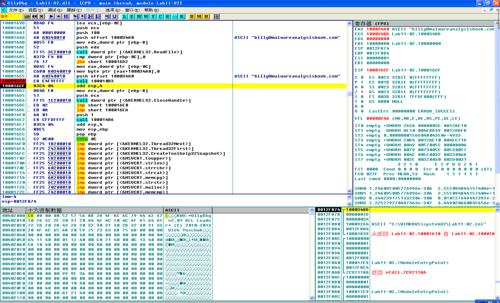

执行结果显示，程序解密出一个电子邮件地址：<billy@malwareanalysisbook.com>。结合之前分析中提到的 `send` 函数，我们可以推测程序可能打算向这个邮箱发送某些数据。

我们还注意到，在 `DLLMain` 函数的末尾调用了 `sub_100014B6` 函数，该函数根据解密结果执行后续行为。因此，为了揭示程序的最终目的，我们需要对 `sub_100014B6` 函数进行深入分析。

使用 IDA 查看 `sub_100014B6` 函数：

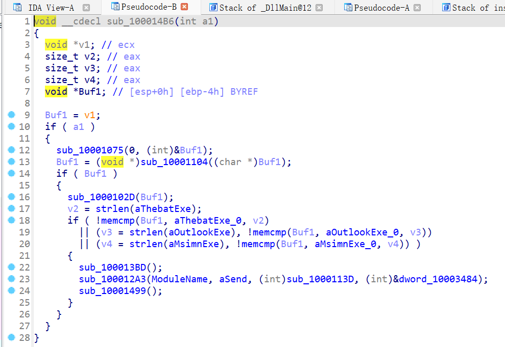

此函数涉及多个子函数的调用，具体包括：

- `sub_10001075`
- `sub_10001104`
- `sub_1000102D`
- `sub_100013BD`
- `sub_100012A3`
- `sub_1000113D`
- `sub_10001499`

此外，函数中出现了一些关键字符串，如 `aThebat_exe` 和 `aOutlook_exe`，这些字符串与之前静态分析中发现的邮件客户端可执行文件相对应。`aSend` 字符串则与 `send` 函数相关联。

为了深入理解函数的行为，我们需要对这些子函数逐一进行分析。

- `sub_10001075`：

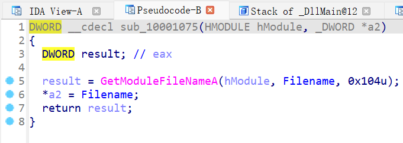

该函数负责获取当前 DLL 的完整路径，以确定正在运行的模块名称，这对于后续检查是否为目标邮件客户端至关重要。

- `sub_10001104`：

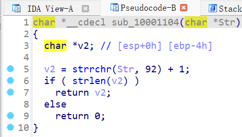

此函数从完整路径中提取文件名，用于识别当前进程是否为目标邮件客户端之一。

- `sub_1000102D`：

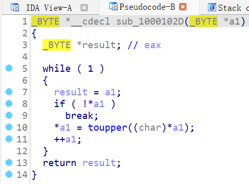

该函数将文件名中的所有字符转换为大写，以实现不区分大小写的比较。

- `sub_100013BD`：

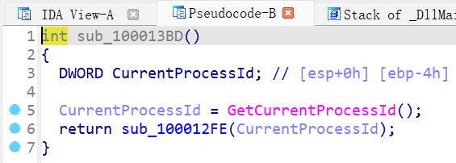

通过获取当前进程 ID 并调用 `sub_100012FE`，此函数在进程控制中发挥作用。

- `sub_100012FE`：

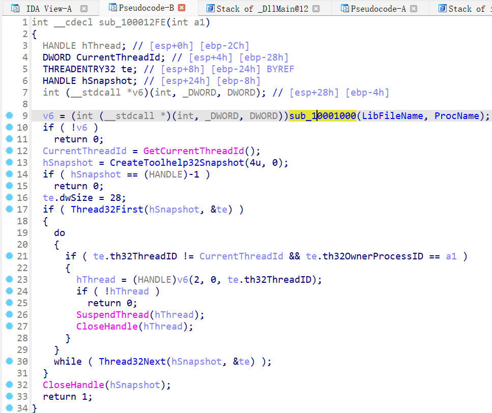

这是一个关键函数，它通过挂起非当前线程的所有进程，可能为了改变进程状态或安装挂钩。

- `sub_10001000`：

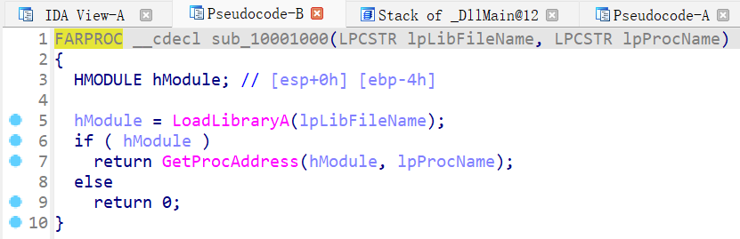

该函数通过调用 `LoadLibraryA` 和 `GetProcAddress` 来获取进程的 IP 地址。

- `sub_100012A3`：

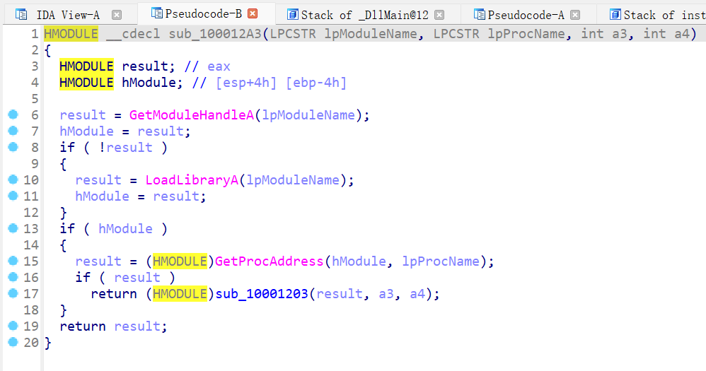

此函数通过 `GetModuleHandleA` 和 `GetProcAddress` 获取进程号，为后续的进程操作做准备。

- `sub_10001203`：

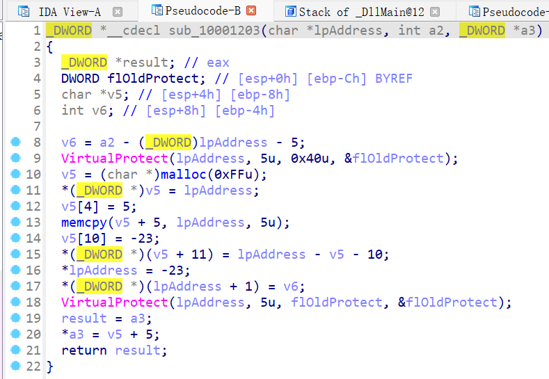

通过修改内存保护，此函数能够改变 `send` 函数的目标地址，实现函数重定向和挂钩。

- `sub_10001499`：

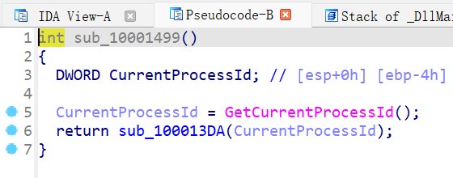

此函数调用 `sub_100013DA`，与 `sub_100012FE` 功能相似，但关注于恢复之前挂起的所有线程。

- `sub_100013DA`：

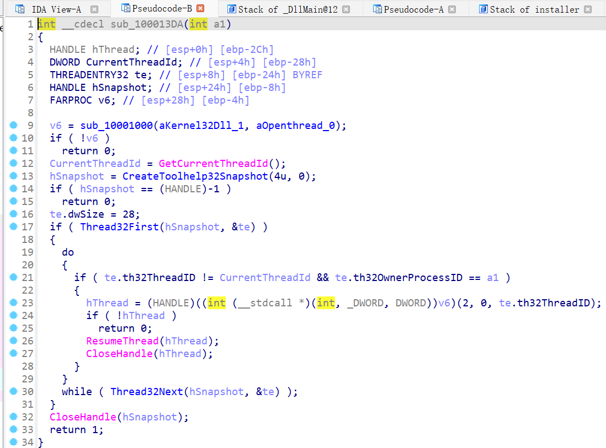

内容和 `sub_100012FE` 几乎一样。但这次 `sub_100013BD` 暂停了其他的所有线程。因此这里的 `sub_10001499` 调用将之前所有挂起的线程全部都恢复了。

综合这些子函数的行为，`sub_100014B6` 能够有效地识别目标邮件客户端进程，并在关键函数上安装挂钩。通过精心设计的步骤，`Lab11-02.dll` 能够在用户不知情的情况下监控和操纵邮件客户端，实现其恶意目的。

- **进程检查**：通过比较当前运行的可执行文件名称与预设的邮件客户端名称，确定是否在目标进程中运行。
- **`send` 函数重定向与挂钩**：修改 `send` 函数的目标地址，实现数据发送的重定向和挂钩。
- **数据劫持与纂改**：在 `send` 函数处理的数据中寻找 "RCPT TO" 字符串，插入额外的收件人信息，将邮件副本发送到指定地址。

总结而言，该病毒的目的是在特定的邮件客户端进程中拦截和篡改发送的邮件消息，将邮件副本发送到恶意软件作者指定的地址。

##### （4）问题解答

> Q1. 这个恶意 DLL 导出了什么？


此恶意 DLL 文件导出了一个名为 installer 的函数。

> Q2. 使用 rundll32.exe 安装这个恶意代码后，发生了什么？

通过命令 `rundll32.exe Lab11-02.dll, installer` 启动恶意代码，它会将自己复制为 spoolvxx32.dll 到系统目录，并在 AppInit_DLLs 注册表项添加键值以实现持久性安装，同时尝试打开并解密系统目录下的 Lab11-02.ini 文件，然后执行邮件客户端监控等操作。

> Q3. 为了使这个恶意代码正确安装，Lab11-02.ini 必须放置在何处？

如上所述，ini 文件必须放置在系统目录下，即 `%SystemRoot%\System32\`。


> Q4. 这个安装的恶意代码如何驻留？

该代码通过将自己安装在 AppInit_DLLs 列表中，使得所有加载 User32.dll 的进程都会加载该恶意代码。


> Q5. 这个恶意代码采用的用户态 Rootkit 技术是什么？

该恶意代码针对 send 函数进行了挂钩攻击，即通过对 send 函数的代码进行修改的重定向、安装了一个 inline 挂钩。


> Q6. 挂钩代码做了什么？

挂钩代码会检查所有外发的数据包，，如果包含 "RCPT TO" 字符串，它会添加一个额外的 RCPT TO 行，即将 <billy@malwareanalysisbook.com> 添加到收件人列表中，从而将邮件转发到该邮箱。

> Q7. 哪个或者哪些进程执行这个恶意攻击，为什么？

该恶意攻击仅针对 MSIMN.EXE、THEBAT.EXE 和 OUTLOOK.EXE 这三个电子邮件客户端进程，因为它们是邮件客户端软件，恶意代码只在这些进程运行时安装挂钩。


> Q8. `.ini` 文件的意义是什么？

该文件包含了一个加密的电子邮件地址，解密后显示为 <billy@malwareanalysisbook.com>。


> Q9. 你怎样用 Wireshark 动态抓获这个恶意代码的行为？

通过“抓取网络流量 ( Capturing the Network Traffic）” 的方法，抓取系统的网络数据包，可以观察到一个假冒的邮件服务器也就是 <billy@malwareanalysisbook.com> 以及 Outlook Express 客户端。

#### 3. Lab11-3

**分析恶意代码 Lab11-03.exe 和 Lab11-03.dll。确保这两个文件在分析时位于同一个目录中。**

##### （1）初步静态分析

我首先对两个样本进行了静态分析。使用 `DIE` 工具检查加壳情况：

- 对于 exe 文件：

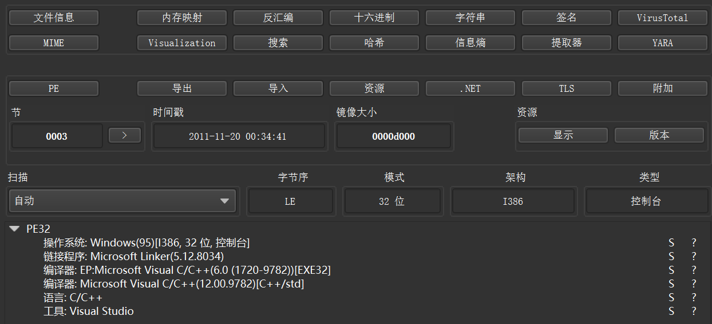

- 对于 dll 文件：

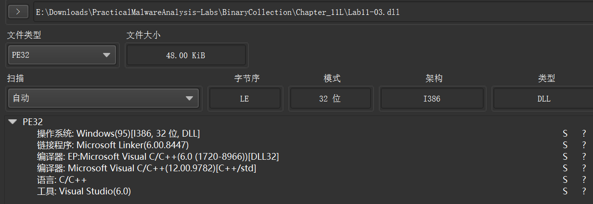

两个样本均未发现加壳。

接下来，我们详细分析 exe 文件。

**字符串分析**：

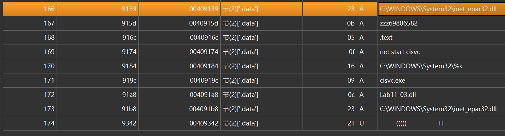

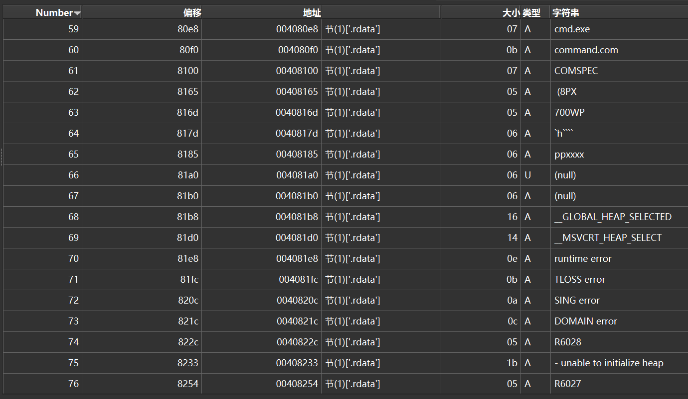

我们注意到几个关键点：

- `C:\Windows\System32\inet_epar32.dll`：可能与网络通信或互联网协议相关，暗示了潜在的网络行为。
- `zzz69806582`：一个重复出现的字符串，需要进一步关注。
- `net start cisvc` 和 `cisvc.exe`：表明样本可能具有启动服务的行为，但具体服务尚不清楚。推测恶意代码会启动 cisvc 服务。
- `Lab11-03.dll`：暗示样本可能对另一个 dll 文件进行操作。
- `cmd.exe` 与 `command.com`：可能涉及远程 Shell 操作。
- `runtime/SING/TLOSS/DOMAIN error`：可能与超市和域名错误相关。
- `R60XX` 和 `unable to XXX`：可能与错误消息和 Shell 操作有关。

**导入表分析**：

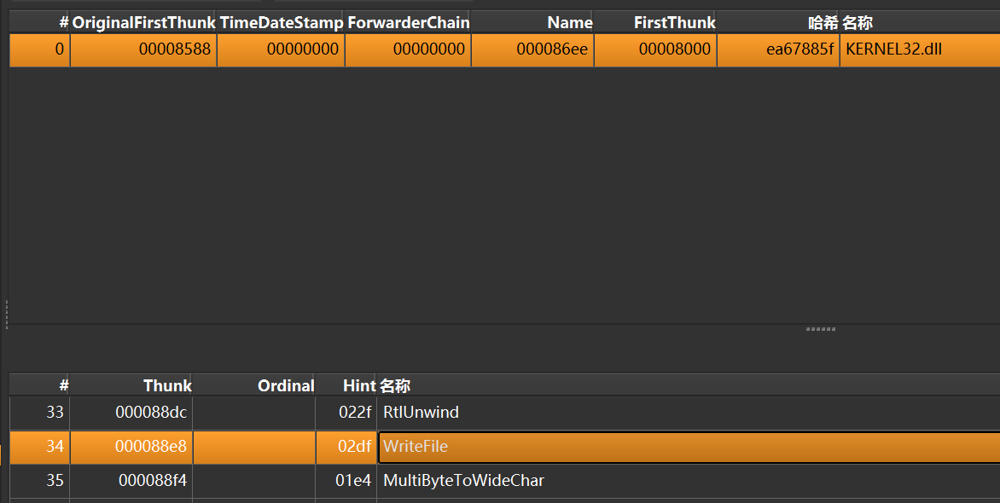

exe 文件的导入表中只有一些常见函数，其中唯一值得注意的只有 WriteFile。结合字符串中的 C:\Windows\System32\inet_epar32.dll，猜测其写入 `inet_epar32.dll` 文件，并保存到系统目录下面。

接下来，我们分析 dll 文件。

**字符串分析**：

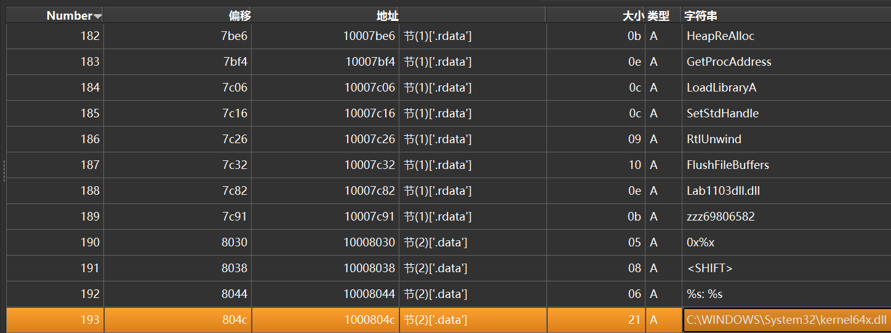

我们发现：

- `C:\WINDOWS\System32\kernel64x.dll`：可能是 System32 目录下的一个伪装文件。
- `Lab1103dll.dll`：名称可疑，可能经过混淆处理。
- `zzz69806582`：在 exe 文件中也出现，需要关注。
- `<SHIFT>`：可能与键盘记录功能相关。

**导出函数分析**：

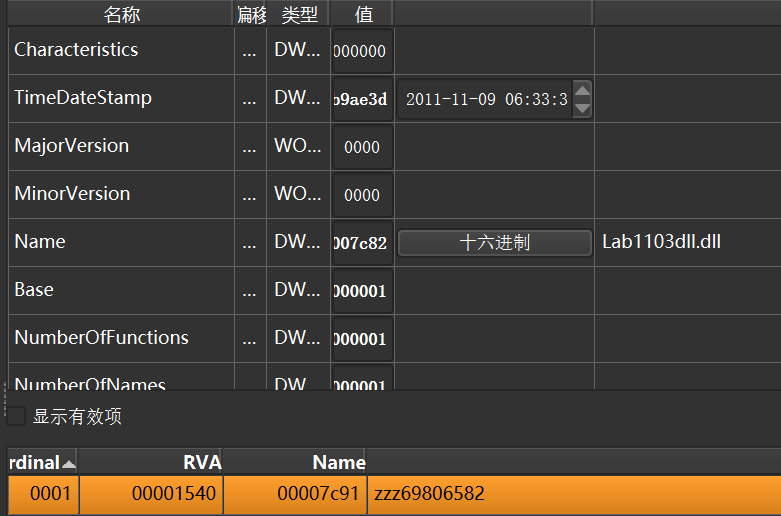

可以看到：dll 文件的导出函数中，`Lab1103dll.dll` 和 `zzz69806582` 函数名异常。

**导入表分析**：

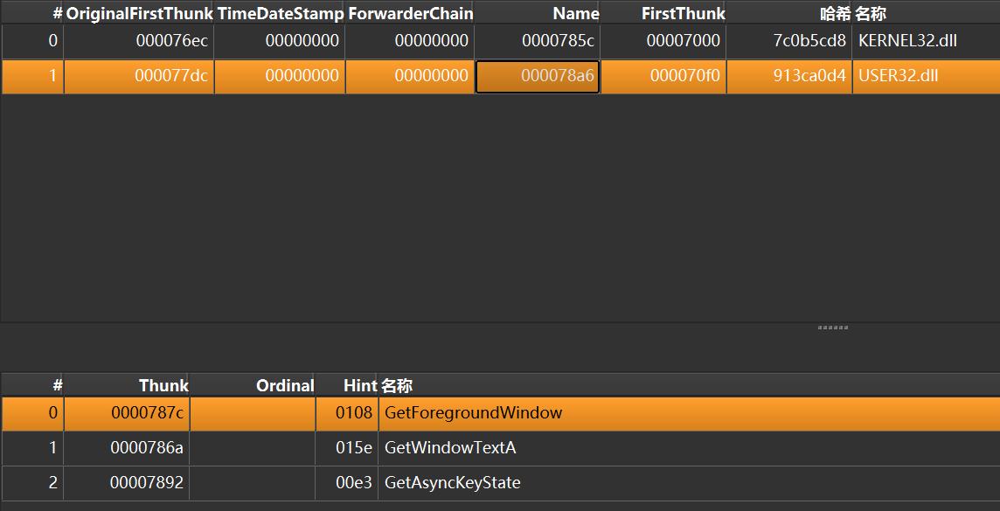

dll 文件的导入表中包含：

- `GetAsyncKeyState`：用于检查按键状态。
- `GetForegroundWindow`：确定当前交互窗口。
- `GetWindowTextA`：获取窗口标题。

综合以上信息，我们推测这可能是一个键盘记录器，并将记录的数据存储在 `kernel64x.dll` 中。

##### （2）综合行为分析

为了验证我们的假设，即该样本是一个键盘记录器，我们进行了动态运行分析。

启动 Promon 并设置了一个行为监控过滤器：

```assembly
Process Name is Lab11-03.exe
```

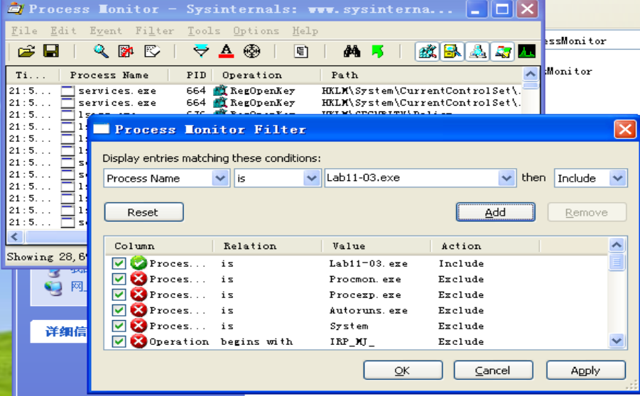

接着，我们运行了该可执行文件，并观察到以下行为：

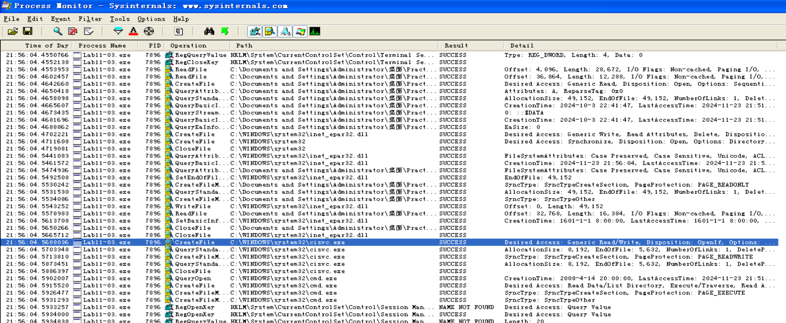

**关键行为观察**：

- **创建 inet_epar32.dll 文件**：样本在 System32 目录下创建了 inet_epar32.dll 文件。
- **写入 inet_epar32.dll**：样本对 inet_epar32.dll 文件进行了写入操作。
- **创建 cisvc.exe**：样本创建了 cisvc.exe 文件，并进行了文件映射操作。

样本在 `C:\Windows\System32\` 目录下创建了 inet_epar32.dll 文件，并获取了 cisvc.exe 的句柄。

我们进一步检查了这个 dll 文件：

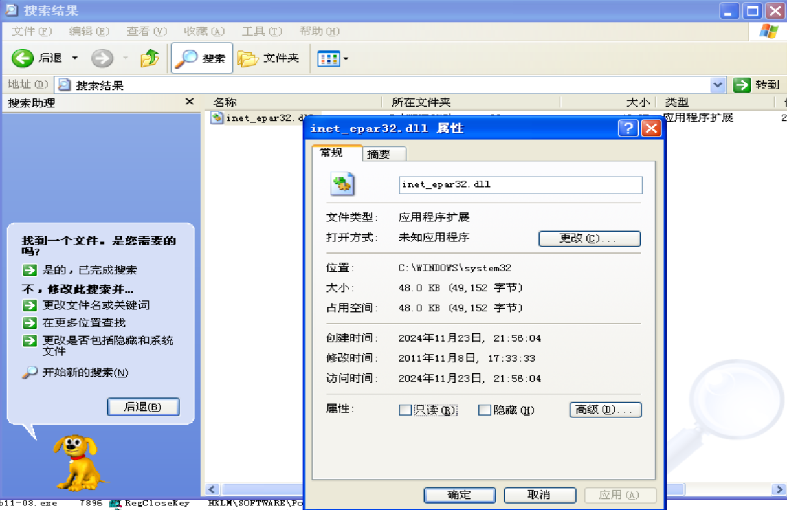

发现样本实际上是将 Lab11-03.dll 复制到系统目录，并重命名为 inet_epar32.dll。在 System32 目录下出现了大小为 48KB 的 inet_epar32.dll 文件。

检查 Lab11-03.dll：

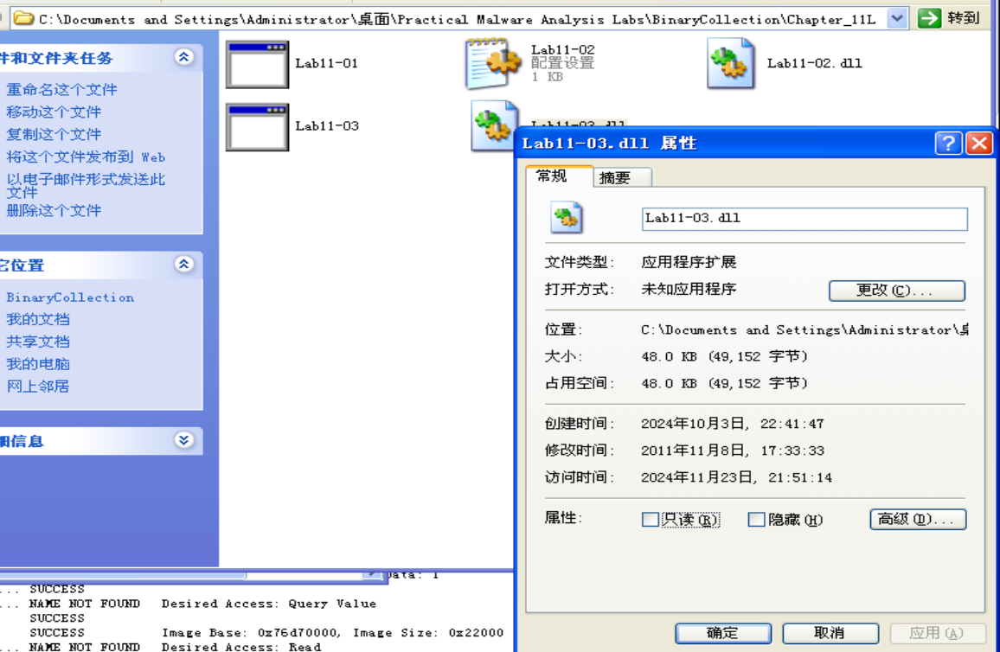

大小也是 48KB，因此我们推断 inet_epar32.dll 实际上是 exe 文件将 dll 文件直接复制到 System32 目录下并改名的结果。

为了验证其键盘记录功能，我们尝试打开一个文本文件并输入内容：

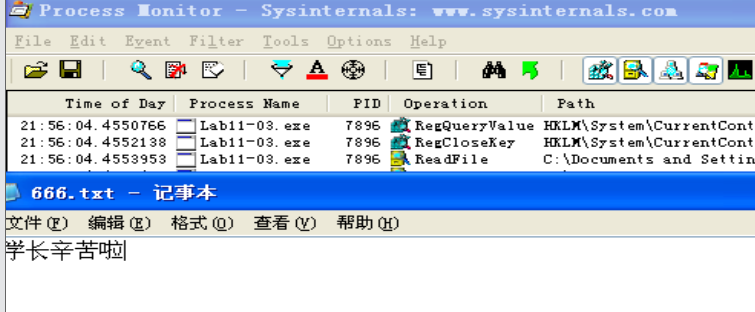

结果发现系统目录下多了一个 kernel64x.dll 文件：

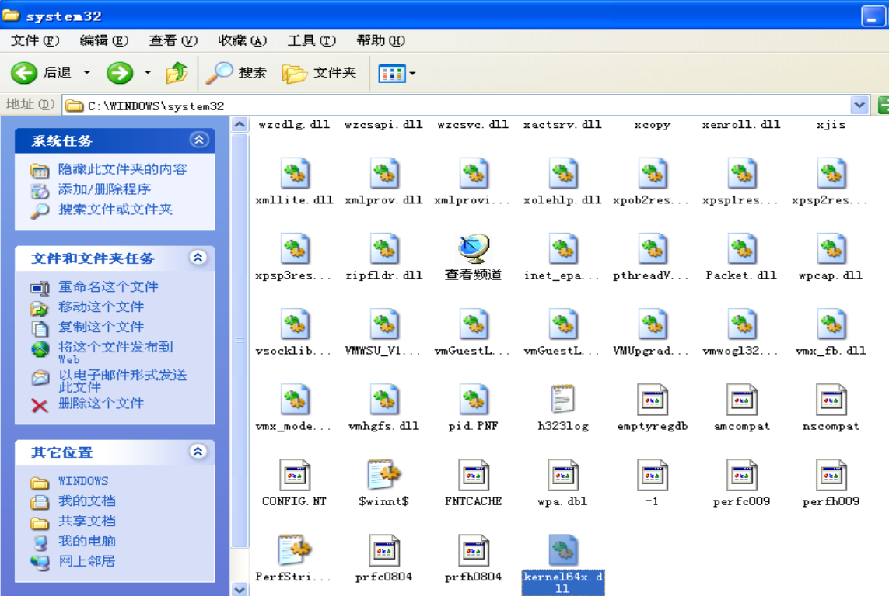

使用记事本打开该文件：

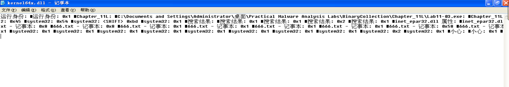 可以看到之前的键盘输入记录，与我们的分析相符，文件中包含了清晰的键盘输入记录。

##### （3）深入分析

在通过动态分析验证了初步假设之后，使用 IDA 对样本进行进一步的深入分析，特别关注 exe 文件中的 `main` 函数。

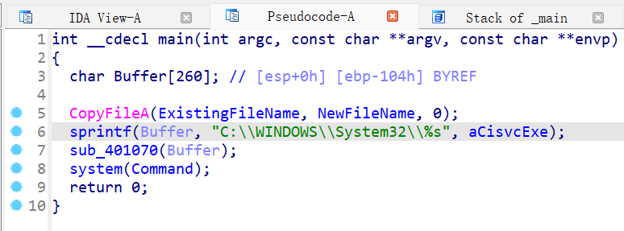

**关键行为分析**：

- **文件复制**：通过 `CopyFileA` 函数，样本将 `Lab11-03.dll` 复制到 `System32` 目录下，并重命名为 `inet_epar32.dll`。
- **路径构建**：使用 `sprintf` 函数，样本构建了 `C:\WINDOWS\System32\cisvc.exe` 的完整路径，并存储在 `buffer` 中。
- **子函数调用**：`buffer` 被作为参数传递给 `sub_401070` 函数。
- **服务启动**：样本通过系统调用启动了 `cisvc` 服务。

这一系列活动表明，样本首先将 `Lab11-03.dll` 复制到 `System32` 目录下，然后创建了 `cisvc.exe` 的路径字符串，并传递给 `sub_401070` 函数，最后通过 `net start cisvc` 命令启动索引服务。

为了进一步理解 `sub_401070` 函数的行为，我们查看了其交叉引用图：

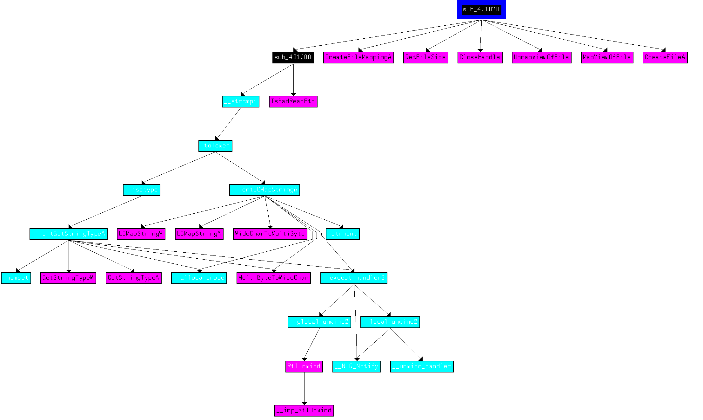

看到调用关系非常复杂，其中 sub_401000 又调用了很多函数，我们重点关注它在函数内部调用的：

- **CreateFileA**：创建了 cisvc.exe。
- **CreateFileMappingA 和 MapViewOfFile**：创建文件 cisvc 的文件映射，然后映射进入内存中。其中 MapViewOfFile 返回的内存映射视图基地址可以被读写。由此给了它们必要的权限。
- **UnmapViewOfFile**：再关闭映射，结果就是可以把所有在内存中对文件的修改也同样写入磁盘。这解释了为什么在 Procmon 中没有观察到 `WriteFile` 函数的调用，实际上是通过内存映射的方式在内存中操作文件。

代码通过 sub_401070 调用 CreateFileA、CreateFileMappingA 和 MapViewOfFile 来操控 `cisvc.exe`，MapViewOfFile 返回的内存映射视图的基地址可读写，在 UnmapViewOfFile 调用后，对文件的任何修改都会被写入硬盘。

继续顺序查看代码，我们发现了一处值得注意的地方：

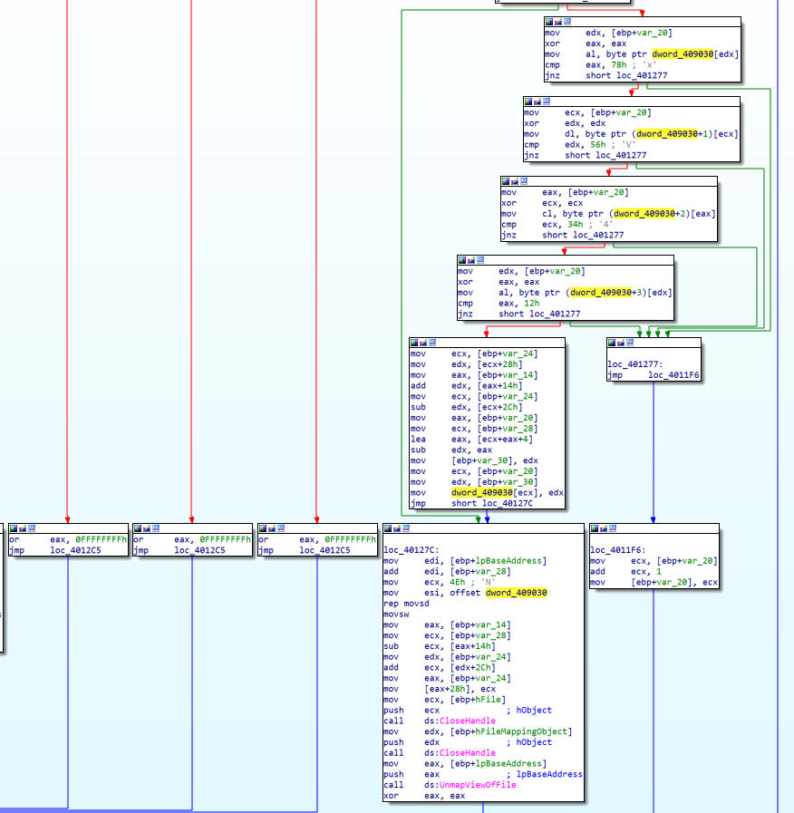

通过 var_28 等变量调整偏移量，并将 byte_409030 放入 esi 中，目的是通过 rep movsd 复制到映射文件中。我们推测这可能是写入 `cisvc.exe` 的内容。

查看这个 dword：

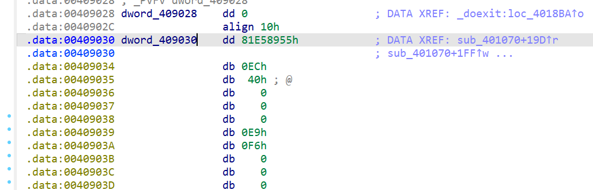

看到一些原始字节，我们不知道是什么，但可以试着按下 C 转为反汇编表示：

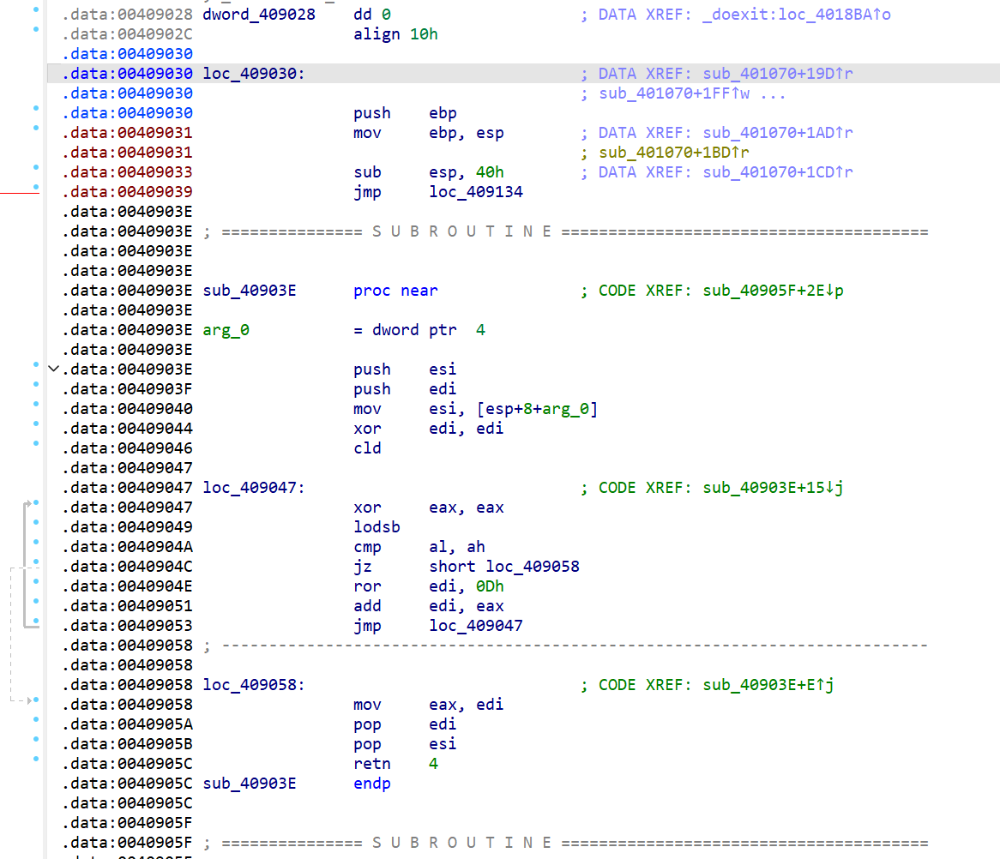

发现了一段人工构造的汇编代码即 shellcode。跟随内容至 shellcode 的结尾 0x00409139 处：

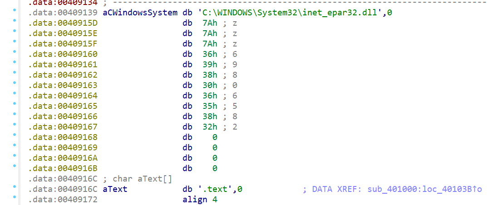

我们拼接了一些零散的字符串，发现了：

- System32 下的 `inet_epar32.dll`：这是病毒加载的 dll，经过验证，我们知道它就是复制过去的 `Lab11-03.dll`。
- `zzz69806582`：它是 `inet_epar32.dll` 的导出函数。

这表明恶意代码加载了 `inet_epar32.dll` 并使用了其导出函数 `zzz69806582`。为了进一步分析恶意目的，我们需要查看 `zzz69806582` 函数的行为。

使用 IDA 加载 `Lab11-03.dll`：

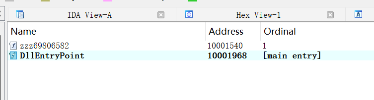

我们发现它确实有一个名为 `zzz69806582` 的函数。

我们查看这个函数：

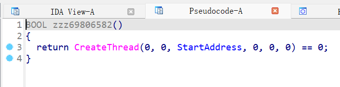

发现它唯一调用的函数是 `CreateThread`，创建一个新线程，运行的函数是 `StartAddress`，类似于网络编程中使用的多线程 socket 编程。

接下来查看 `StartAddress` 函数：

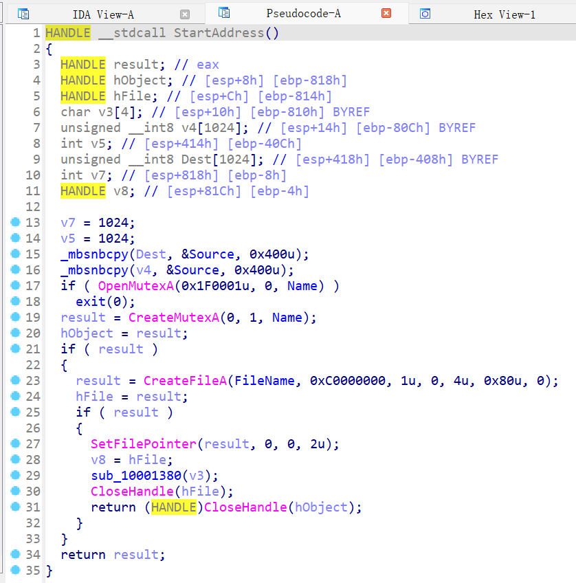

我们注意到：

- `OpenMutexA` 和 `CreateMutexA`：通过创建一个互斥量（Name 为 "MZ"），确保任何时刻只有一个病毒实例在运行，避免引起注意。
- `CreateFileA`：创建并尝试打开 `System32` 下的 `kernel64x.dll`。如果打开成功，result 为真。
- `sub_10001380`：如果打开结果为真，通过一个指针 `FilePointer` 遍历文件，并使用 `sub_10001380` 进行文件处理。

恶意代码创建了名为 "MZ" 的互斥量，阻止多个实例运行，然后打开 `kernel64x.dll` 来写入日志，利用 `sub_10001380` 函数。

根据动态分析结果，我们推测写入的是日志，因此查看 `sub_10001380`：


- 循环调用 `sub_10001030`，只要结果为真。
- `sprintf`：对传入的 Buffer 进行格式化，变成格式化字符串。
- `WriteFile`：将 Buffer 写入文件对应的句柄，实现记录！
- `Sleep(0xAu)`：睡眠时间为 10 毫秒，间隔 10 毫秒行动。

这个函数使用 `sprintf` 和 `WriteFile` 来写入日志，完成击键记录。

现在我们想知道写入的内容，因此需要查看 `sub_10001030`：

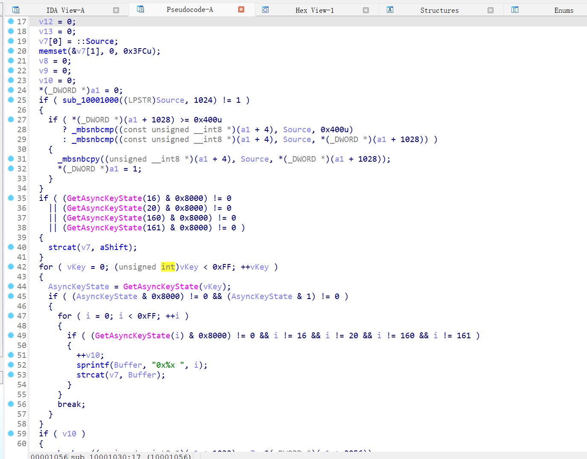

`GetAsyncKeyState` 的调用，实现了用户态的击键记录，最后通过 `WriteFile` 写入日志。

##### （4）问题解答

> Q1. 使用基础的静态分析过程，你可以发现什么有趣的线索？

- 在可执行文件中发现了字符串 `inet_epar32.dll` 和命令 `net start cisvc`，这暗示了该程序可能会启动 CiSvc 索引服务。
- `Lab11-03.dll` 导入了 API 函数 `GetAsyncKeyState` 和 `GetForegroundWindow`，这些函数通常用于键盘记录活动，这可能表明存在一个击键记录器。
- `Lab11-03.exe` 不仅包含上述字符串，还导入了相同的 API 函数，这进一步强化了它是击键记录器的猜测，且记录可能存储在 `kernel64x.dll` 文件中。
- 使用 PEiD 工具分析时，我们发现 `Lab11-03.exe` 调用了 `WriteFile` 函数，且字符串中包含 `Lab11-03.dll`，这可能意味着它会加载 DLL；同时，`inet_epar32.dll` 和 `net start cisvc` 的字符串表明它可能与服务启动有关。
- `Lab11-03.dll` 中还有字符串 `C:\WINDOWS\System32\kernel64x.dll` 和一个神秘的 `Lab1103dll.dll` 以及 `zzz69806582`，这些信息为我们揭示了更多的行为特征。

综合这些线索，我们有理由相信这是一个将击键记录存储在 `kernel64x.dll` 文件中的击键记录器。

> Q2. 当运行这个恶意代码时，发生了什么？

恶意代码在执行时，首先会将 `Lab11-03.dll` 复制到 Windows 系统目录，并重命名为 `inet_epar32.dll`。随后，它会向 `cisvc.exe` 写入数据并启动索引服务。此外，该恶意代码还会通过内存映射的方式，而不是直接使用 `WriteFile` 函数，将击键记录写入 `kernel64x.dll` 文件。


> Q3. Lab11-03.exe 如何安装 Lab11-03.dll 使其长期驻留？

`Lab11-03.exe` 利用入口点重定向技术，将 `Lab11-03.dll` 木马化到索引服务中，从而确保其在系统重启后仍能自动加载。这一过程涉及运行 shellcode 并修改索引服务的入口点，使得 `Lab11-03.dll` 能够长期潜伏在系统中。

> Q4. 这个恶意代码感染 Windows 系统的哪个文件？

恶意代码通过修改 `cisvc.exe` 来加载 `inet_epar32.dll`，并实现持久化驻留。具体来说，它调用了 `inet_epar32.dll` 中的导出函数 `zzz69806582`，从而感染了 `cisvc.exe`。


> Q5. Lab11-03.dll 做了什么？

`Lab11-03.dll` 作为一个轮询式的击键记录器，其主要功能在导出函数 `zzz69806582` 中实现，该函数负责记录用户的键盘操作。


> Q6. 这个恶意代码将收集的数据存放在何处？

该恶意代码将用户的击键记录和窗体输入信息存储在 `C:\Windows\System32\kernel64x.dll` 文件中。

### （二）yara 编写与分析

#### 1. yara 编写

本次 Yara 规则的编写基于上述的病毒分析和实验问题，主要是基于静态分析的字符串和 IDA 分析结果。

```yara
private rule isMZ_PE {
    meta:
        description = "It is a PE file"
    condition:
        filesize <10MB and uint16(0) == 0x5A4D and uint32(uint32(0x3C)) == 0x00004550
        // 文件大小小于10MB，文件头的前两个字节为MZ，PE头的偏移地址处的四个字节为PE标志
}

// Lab11-01
rule Lab11_01_exe {
    meta:
        description = "It may like Lab11_01_exe"
    strings:
        $s1 = "SOFTWARE\\Microsoft\\Windows NT\\CurrentVersion\\Winlogon"
        $s2 = "GinaDLL"
        $s3 = "msgina32.dll"
    condition:
        isMZ_PE and all of them
}

// Lab11-02
rule Lab11_02_dll {
    meta:
        description = "It may like Lab11_02_dll"
    strings:
        $s1 = "SOFTWARE\\Microsoft\\Windows NT\\CurrentVersion\\Windows"
        $s2 = "spoolvxx32.dll"
        $s3 = "THEBAT.EXE"
        $s4 = "OUTLOOK.EXE"
        $s5 = "MSIMN.EXE"
        $s6 = "AppInit_DLLs"
        $s7 = "Lab11-02.ini"
    condition:
        isMZ_PE and all of them
}

// Lab11-03
rule Lab11_03_exe {
    meta:
        description = "It may like Lab11_03_exe"
    strings:
        $s1 = "C:\\WINDOWS\\System32\\inet_epar32.dll"
        $s2 = "Lab11-03.dll"
        $s3 = "net start cisvc"
        $s4 = "zzz69806582"
    condition:
        isMZ_PE and all of them
}

rule Lab11_03_dll {
    meta:
        description = "It may like Lab11_03_dll"
    strings:
        $s1 = "C:\\WINDOWS\\System32\\kernel64x.dll"
        $s5 = "<SHIFT>"
        $s6 = "zzz69806582"
        $s7 = "Lab1103dll.dll"
    condition:
        isMZ_PE and all of them
}
```

#### 2. 运行

把上述 Yara 规则保存为 `lab7.yar`, 然后执行检查，可以看到，样本被检出。**Yara 规则编写成功！**

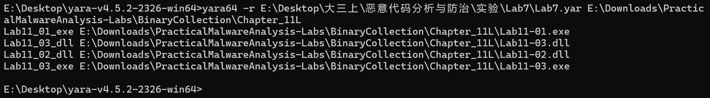

#### 3. 测试执行效率

接下来测试规则的执行效率，我选择编写一个 python 脚本、执行扫描和时间统计，代码如下：

```python
import os
import time

# 获取程序开始时间
start_time = time.time()

os.system(r"E:\Desktop\yara-v4.5.2-2326-win64\yara64.exe -r E:\Desktop\大三上\恶意代码分析与防治\实验\Lab7\Lab7.yar E:\Downloads")

# 获取程序结束时间
end_time = time.time()

# 计算并输出程序运行时间
elapsed_time = end_time - start_time
print(f"程序运行时间: {elapsed_time} 秒")
```

运行结果如下，我这个文件夹大小为 2.13GB，有 388 个文件、106 个文件夹，而运行时间为 2.67s，说明效率较高。

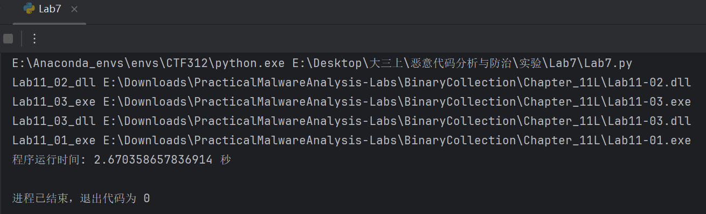

### （三）IDA python 脚本编写

#### 1. IDA python 脚本编写

为了简化安全审计和逆向工程的工作，我编写了三个脚本来辅助分析：

##### 脚本一

```python
import idaapi
import idautils
import idc

# 检查指令是否是 'jmp' 或 'call' 且操作数为寄存器类型
def is_jump_or_call_with_register(ea):
    """
    检查给定地址的助记符是否为 'jmp' 或 'call' 且操作数为寄存器类型
    """
    mnemonic = idc.print_insn_mnem(ea)
    if mnemonic not in ['jmp', 'call']:
        return False
    opnd_type = idc.get_operand_type(ea, 0)
    # 确保操作数是寄存器类型
    return opnd_type in [idaapi.o_reg, idaapi.o_phrase, idaapi.o_displ]

# 检查函数是否为库函数
def is_library_function(func_ea):
    """
    检查给定地址的函数是否为库函数
    """
    flags = idc.get_func_attr(func_ea, idc.FUNCATTR_FLAGS)
    return flags & idaapi.FUNC_LIB

# 标记不安全的函数调用并设置颜色
def judge_audit(addr):
    """
    对不安全的函数调用进行标注，并设置背景颜色
    """
    idc.set_cmt(addr, "### AUDIT HERE ###", 0)  # 添加注释
    idc.set_color(addr, idc.CIC_ITEM, 0x0000ff)  # 设置指令背景颜色

# 标记不安全函数的调用
def flag_calls(danger_funcs):
    """
    查找并标记程序中所有不安全函数的调用
    """
    count = 0
    for func in danger_funcs:
        faddr = idc.get_name_ea_simple(func)
        if faddr != idaapi.BADADDR:
            # 获取对该函数的所有交叉引用
            cross_refs = idautils.CodeRefsTo(faddr, 0)
            for addr in cross_refs:
                count += 1
                print("%s[%d] calls 0x%08x" % (func, count, addr))
                judge_audit(addr)

# 主函数
def main():
    # 遍历所有函数，排除库函数
    for func in idautils.Functions():
        if is_library_function(func):
            continue

        # 遍历函数中的所有指令
        ea = func
        func_end = idc.find_func_end(func)
        while ea != idaapi.BADADDR and ea < func_end:
            # 如果是跳转或调用且操作数是寄存器类型
            if is_jump_or_call_with_register(ea):
                print("Address: 0x{:X}, Instruction: {}".format(ea, idc.generate_disasm_line(ea, 0)))
            # 继续处理下一条指令
            ea = idc.next_head(ea)

    # 识别并标记不安全函数调用
    print("-------------------------------")
    danger_funcs = ["DllEntryPoint", "printf", "strcpy", "GetModuleFileNameExA", "Thread32Next"]
    flag_calls(danger_funcs)
    print("-------------------------------")

if __name__ == '__main__':
    main()
```

该脚本主要有两个功能：

1. **动态跳转或调用检测**，即检测汇编指令是否是 `jmp` 或 `call`，并且操作数为寄存器类型。

2. **查找和标记危险函数调用**，并为每个调用添加注释、设置背景颜色。（主要用来漏洞挖掘）

##### 脚本二

本次实验中由于 Lab11-03 出现需要解密 shellcode 的地方，因此编写如下脚本进行解密：

```python
def decrypt(data):
    if not data:  # 检查输入是否为空
        return ""
    length = len(data)
    if length < 2:  # 如果长度小于2，无法进行异或解密
        return data
    result = ""
    key = ord(data[0])
    for c in range(1, length):
        result += chr(ord(data[c]) ^ key)
    return result
```

##### 脚本三

本次实验中涉及的病毒具有复杂的调整行为比如 Lab11-02 的 11 个函数，所以编写一个查找并跟踪参数传递的函数。

```python
import idaapi
import idc
import idautils

def find_mov_esi(addr):
    """
    在给定地址addr的上下文中，向前遍历指令，找到最近的一条mov指令，
    并将值赋给esi寄存器。如果是，则打印找到的参数值。
    """
    while addr != idaapi.BADADDR:
        insn = idc.get_insn_at(addr)
        if insn is None:
            break
        mnemonic = idc.print_insn_mnem(insn)
        if mnemonic == "mov":
            # 获取操作数
            operands = idc.print_operands(insn)
            # 检查是否将值赋给esi寄存器
            if "esi" in operands:
                # 提取并打印参数值
                esi_value = idc.get_operand_value(insn, 0) if "esi" in operands else idc.get_operand_value(insn, 1)
                print(f"Found mov to esi at {idc.get_func_name(addr)}+{addr-idc.get_func_attr(addr, idc.FUNCATTR_START)}: {esi_value}")
                break
        addr = idc.prev_head(addr)  # 向前移动到上一条指令
```

#### 2. 运行

下面我以代码一为例进行展示，执行该 IDApython 脚本：

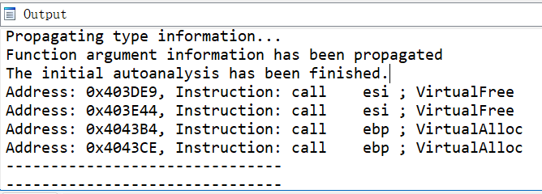

可以看到控制台输出了 `call`，说明脚本编写成功！

## 四、实验结论及心得体会

---

本次实验“恶意代码与防治分析 Lab11”使我受益匪浅。在实验过程中，我不仅掌握了 IDA Pro 工具的高级使用技巧，还学会了如何编写 Yara 规则来识别恶意代码。通过深入研究 Windows XP 的 MSGina.dll 工作原理和特洛伊木马的存活机制，我对恶意代码的运作方式有了更为清晰的认识。

实验让我深刻理解到，恶意代码的核心在于实现持久化存活，而功能的实现则是其辅助手段。在分析按键记录器和 rootkit 技术时，我意识到防护措施的重要性。通过实际操作，我对静态分析、动态分析和高级静态分析的综合运用能力得到了提升，特别是在特征函数猜测恶意代码功能方面取得了显著进步。

本次实验共分析了三份恶意代码，它们虽然各有特点，但都涉及到修改注册表和创建文件等行为。通过分析 Lab11-02.dll，我学会了恶意软件如何利用注册表实现持久化，以及如何通过挂钩技术监控和篡改邮件客户端。

总的来说，本次实验提高了我的恶意代码分析与防治能力，让我在实际操作中积累了宝贵经验。在今后的学习和工作中，我将不断巩固所学知识，为网络安全贡献自己的力量。
