<div align='center'>
<b> <font face='微软雅黑' size='6'> 恶意代码分析与防治技术课程实验报告 </font> </b>
</div>


<div align='center'>
<b> <font font face='微软雅黑' size='6'> 实验八---R77 </font> </b>
</div>


<div>
<font face='宋体' size='6'>&nbsp;&nbsp;&nbsp;&nbsp; 学 院：网络空间安全学院 </font> <br>
<font face='宋体' size='6'>&nbsp;&nbsp;&nbsp;&nbsp; 专 业：信息安全 </font> <br>
<font face='宋体' size='6'>&nbsp;&nbsp;&nbsp;&nbsp; 学 号：2212998 </font> <br>
<font face='宋体' size='6'>&nbsp;&nbsp;&nbsp;&nbsp; 姓 名：胡博浩 </font> <br>
<font face='宋体' size='6'>&nbsp;&nbsp;&nbsp;&nbsp; 班 级：信息安全 </font> <br>
</div>


## 一、实验目的

---

1. 在使用 R77 的基础上，撰写技术分析
1. 要求描述使用过程中看到的行为如何技术实现

## 二、实验原理

---

### Windows Detours 机制

Detours 是由微软开发的一款软件库，它能够拦截并重定向 Windows 应用程序中的函数调用。这一机制通过修改目标函数的入口机器代码，使其跳转至自定义的代理函数，从而实现对原函数的调用、行为修改或完全替代。Detours 在系统监控、程序调试、性能分析及安全工具开发等领域发挥着至关重要的作用。

### API Hooking 技术

API Hooking 技术允许开发者监控和修改应用程序对 API 的调用。该技术主要通过两种方式实现：Inline Hooking（直接修改 API 函数的机器代码）和 IAT Hooking（修改程序的导入地址表）。API Hooking 技术在软件调试、系统监控、安全防护以及增强现有系统功能等方面具有广泛的应用。

### DLL 注入技术

DLL 注入技术涉及将一个动态链接库（DLL）注入到另一个进程的地址空间。这一过程可以通过多种方法实现，如使用 `CreateRemoteThread` 函数或 `SetWindowsHookEx` 钩子功能。DLL 注入技术使得开发者能够影响或改变目标进程的行为，广泛应用于应用程序监控、调试和安全研究领域。

### Windows Ring0 与 Ring3

在 Windows 操作系统中，Ring0（内核模式）与 Ring3（用户模式）代表了处理器的不同保护级别。Ring0 拥有最高权限，可直接访问硬件和所有系统资源，通常由操作系统核心组件和驱动程序使用。而 Ring3 是普通应用程序的运行环境，其访问权限受限，无法直接操作硬件或关键系统资源。理解这两种模式的区别对于确保操作系统的安全性和功能实现具有重要意义。

### Rootkit 技术

Rootkit 是一种旨在隐藏自身以逃避安全检测和防御机制的恶意软件。其主要行为和特点包括隐藏存在、权限提升、持久性、后门访问和内核级操作。为有效防范 Rootkits，用户和管理员需保持系统和安全软件的更新，定期进行安全审查，并遵循最佳的网络安全实践。

### Rootkit77（r77）

Rootkit77，简称 r77，是一种特殊的无文件 Ring 3 Rootkit。它具有以下特点：

- **隐藏内容**：能够隐藏文件、进程、注册表项、服务、网络连接等多种系统对象。
- **动态配置**：通过配置文件可以灵活地控制隐藏的内容。
- **易于部署**：部署和卸载过程简便，仅需一个文件即可完成。

## 三、实验过程

---

在进行具体的分析之前，我先查看 R77 的 github 仓库及相关技术文档，以对其有一个大概的了解。

### （一）R77 总览

R77 是一种高度复杂的恶意软件，通过模块化架构实现对文件、进程、注册表和网络连接等系统资源的隐藏和持久化操作。其核心依赖于微软的 Detours 技术——一个强大的函数拦截和重定向工具库。Detours 技术原本用于性能监控、调试和程序增强，但 R77 恶意软件却滥用此技术进行隐匿和恶意活动。以下是对 R77 如何利用 Detours 机制的详细分析。

#### Detours 机制概述

**Microsoft Detours** 是一个专为 Windows 平台设计的二进制代码注入和函数重定向工具库。Detours 的核心功能包括：

- **函数拦截**：通过修改目标函数入口点的机器指令（如插入跳转指令），将函数调用重定向到自定义函数。
- **动态逻辑插入**：拦截后，开发者可以选择调用原函数、修改返回值，或完全替代原逻辑。
- **动态加载**：Detours 可以将恶意模块注入目标进程，允许在运行时修改行为。

虽然 Detours 合法用于调试、性能分析等领域，但 R77 利用其拦截功能操控核心 API，从而实现隐匿目标资源的目的。

#### R77 的模块设计与 Detours 的结合

R77 的架构由四个独立但紧密协作的模块组成：**安装模块（Install Module）**、**初始阶段模块（Stager Module）**、**服务模块（Service Module）** 和 **核心模块（Core Module）**。它们分别通过 Detours 实现特定功能：

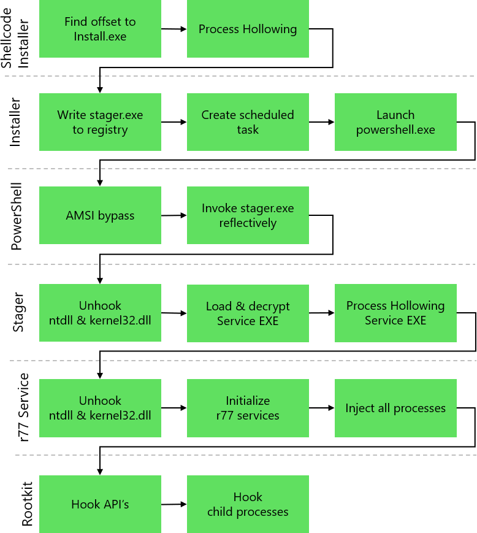

该图是 R77 GitHub 仓库的图片。

##### 安装模块

安装模块的主要任务是通过劫持系统调用完成恶意模块的部署与持久化。

1. **恶意模块的存储**：

	- 将初始阶段模块（Stager Module）存储为注册表键 `$77stager`。
	- 通过拦截注册表相关 API（如 `RegSetValueEx`），绕过安全工具对注册表操作的监控。

2. **生成 PowerShell 命令**：

	- 构建用于从注册表中加载初始阶段模块的 PowerShell 命令，并对其变量进行混淆以提高隐蔽性。
	- 劫持 PowerShell 执行流程，避免恶意活动被安全工具检测。

3. **绕过 AMSI**：

	使用 Detours 劫持 `AmsiScanBuffer` 函数，强制返回 `AMSI_RESULT_CLEAN`，使得 PowerShell 执行的代码被认为是安全的。

4. **创建持久化任务**：

	通过 COM 接口创建定时任务，在系统启动时执行恶意模块。

##### 初始阶段模块

初始阶段模块负责为 R77 后续操作奠定基础，其功能包括 API 解钩、权限提升和有效载荷加载。

1. **API 解钩（Unhooking DLL）**：

	即利用 Detours 恢复 `NTDLL.dll` 和 `KERNEL32.dll` 的原始状态，移除安全工具插入的 Hook。

	具体步骤为：

	- 从磁盘加载干净的 DLL 副本。

	- 将其映射到内存中。

	- 分析并重写被 Hook 的 `.text` 段。

2. **权限提升**：

	使用 Detours 劫持 `AdjustTokenPrivileges`，提升当前进程的 `SeDebugPrivilege`，以便访问其他进程的内存。

3. **载荷解密与注入**：

	- 使用 GZip 解压并通过 XOR 解密服务模块（Service Module）。
	- 将解密后的模块通过进程镂空技术（Process Hollowing）注入到合法进程中。

4. **伪造父进程 ID（PPID Spoofing）**：

	利用 Detours 劫持进程创建 API（如 `CreateProcess`），将目标进程的父进程伪装为系统进程（如 `winlogon.exe`），增加其合法性。

##### 服务模块

服务模块在 Stager Module 完成部署后运行，负责动态配置和核心模块注入。

1. **注入核心模块**：

	通过 Detours 劫持 `NtResumeThread` 和 `NtCreateThreadEx`，在子进程启动时将核心模块注入。

2. **动态配置**：

	在注册表路径 `HKEY_LOCAL_MACHINE\SOFTWARE\$77config` 下创建一个动态配置键，允许进程隐藏规则的实时更新。

3. **核心模块的分发**：

	定期扫描所有进程，将核心模块注入到符合条件的目标进程中。

##### 核心模块

核心模块是 R77 的核心部分，直接利用 Detours 操控系统关键 API，实现资源隐藏。

1. **目标 API 列表**：

	- `NtQuerySystemInformation`：隐藏进程。
	- `NtQueryDirectoryFile` / `NtQueryDirectoryFileEx`：隐藏文件和目录。
	- `NtEnumerateKey` / `NtEnumerateValueKey`：隐藏注册表键和值。
	- `NtDeviceIoControlFile`：隐藏 TCP 和 UDP 网络连接。
	- ……

2. **Detours 的实现细节**：

	- **挂接 API**：

		使用 `DetourAttach()` 替换目标 API 的入口地址。

	- **过滤返回值**：

		通过代理函数（Hook 函数）检查返回数据，根据攻击者配置过滤特定条目。

	- **恢复原逻辑**：

		通过 `DetourDetach()` 在必要时恢复 API 原始行为。

### （二）工具分析

#### Install.exe

首先对 Install.exe 程序进行简要的分析，以了解究竟是怎么实现上述功能的。

##### 基础静态分析

使用 `DIE` 分析 Install.exe 的加壳情况：

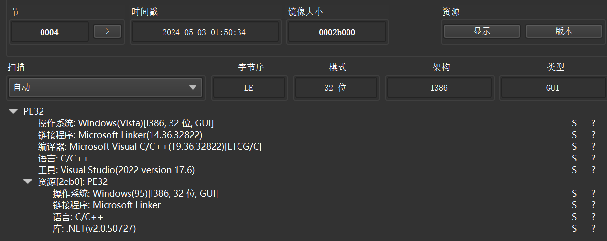

可以看到其使用工具: Visual Studio(2022 version 17.6)编写，并没有加壳。而且注意到其有一个资源节！

接着查看其导入表和导出表：


ole32.dll 有许多关于关于 COM 编程的函数。

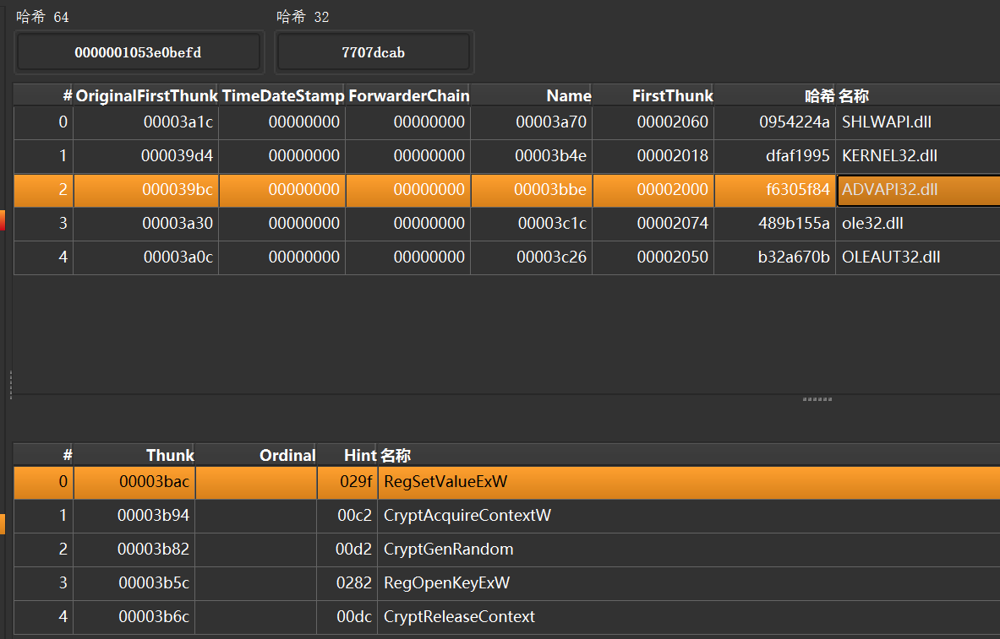

ADVAPI32.dll 有一些疑似加解密的函数。

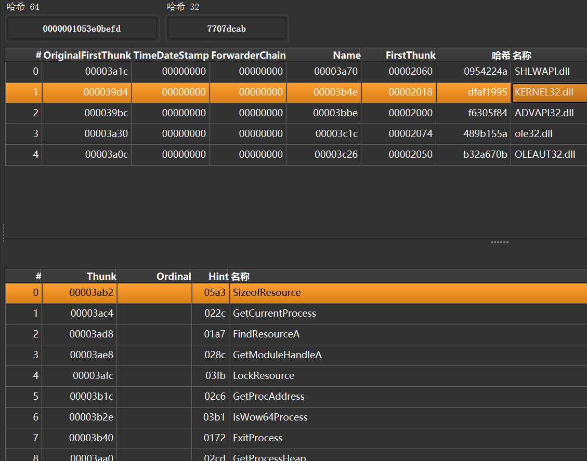

KERNEL32.dll 看到了其有许多寻找和加载资源节的函数，具体而言是 LoadResource 这些。这与一开始看到的资源节信息一致！

因此我决定仔细查看资源节：

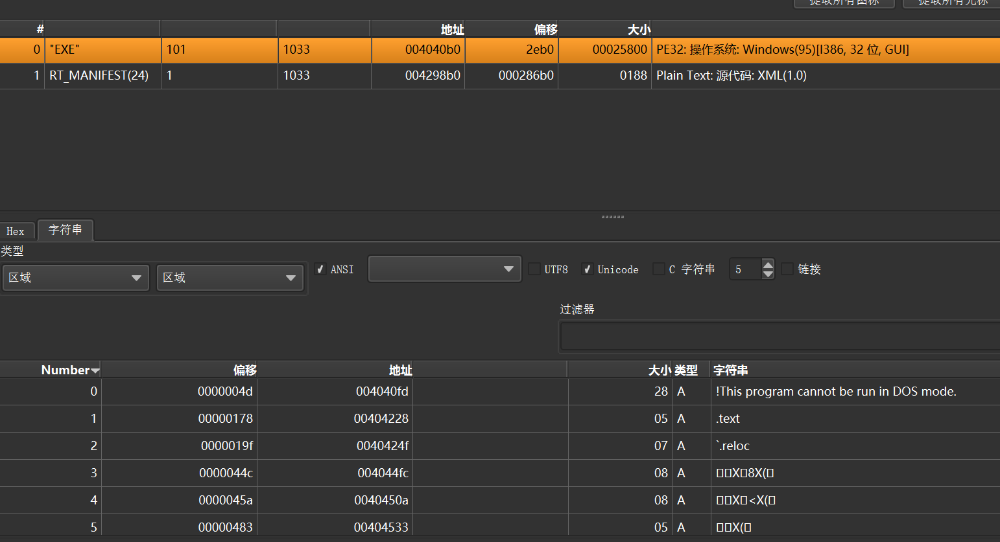

可以发现其包含一个 EXE 程序和一个 XML 文件！

观察 EXE 程序的字符串：

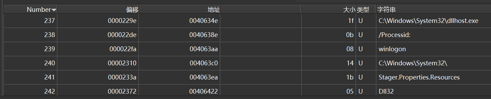

发现有许多导入函数和一些可疑的地址，如 `C:\Windows\System32\dllhost.exe`

再查看 XML 文件：

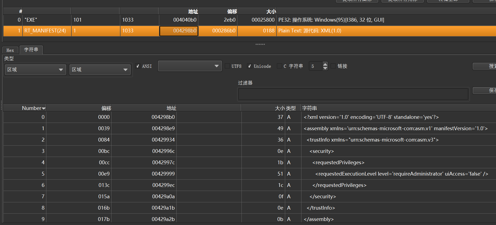

发现 `requestedPrivileges` 和 `requireAdministrator` 字样，似乎表示与权限安全相关。

关于资源节的信息我在后面再详细分析，先继续分析 Install.exe。

##### IDA 分析

由于 R77 是一个工程量巨大且逻辑极为复杂的 rootkit，我仅通过 IDA 进行初步的分析。

载入 Install.exe，进入 start 函数：

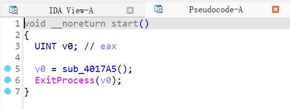

可以看到其核心代码在 sub_4017A5 函数中，进入查看其代码：

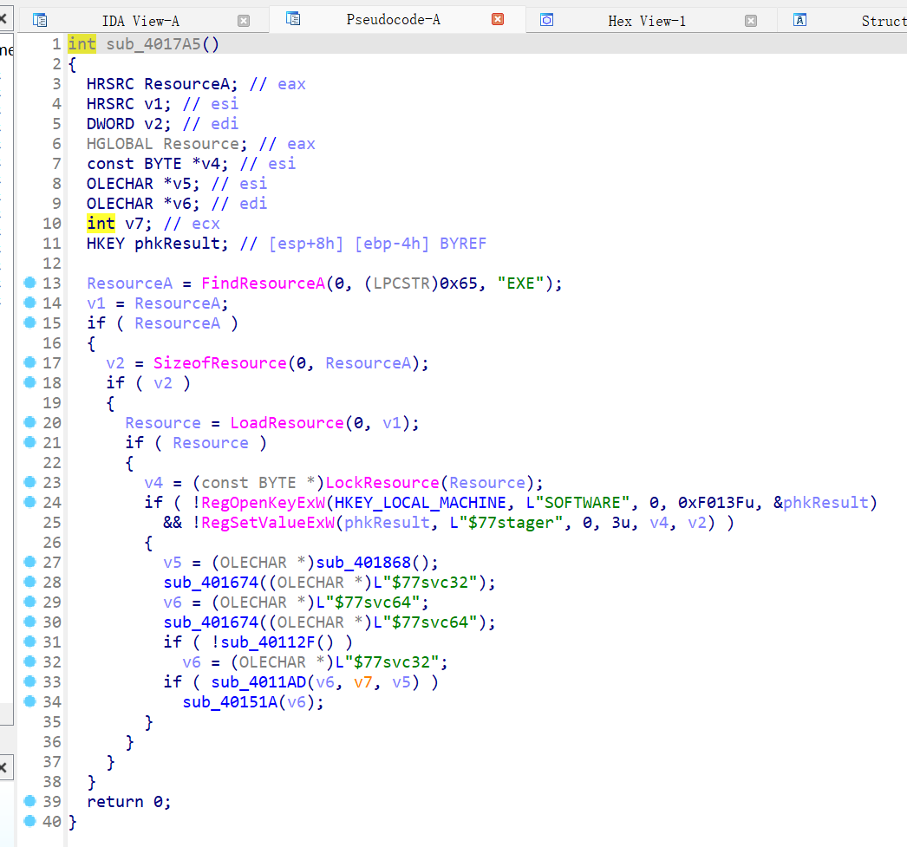

在分析过程中，发现该函数调用了许多其他函数，因此进一步查看了其调用链。

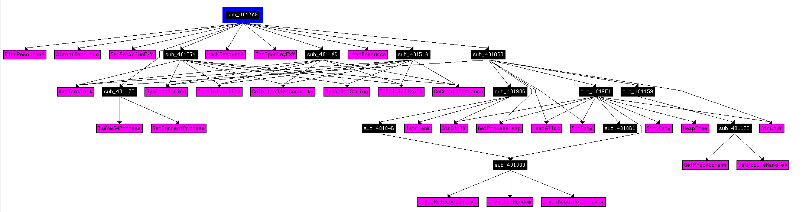

从图中可以看出，函数调用非常复杂。然而，注意到有许多函数用于加载资源节，并且还使用了 `RegOpenKeyExW` 打开注册表键 `HKEY_LOCAL_MACHINE\SOFTWARE`。随后会调用 `sub_401868`，其中包含许多 PowerShell 相关的内容。

接下来将重点解析这五个被调用的函数：`sub_401868`、`sub_401674`、`sub_40112F`、`sub_4011AD` 和 `sub_40151A`。

**sub_401868**: 

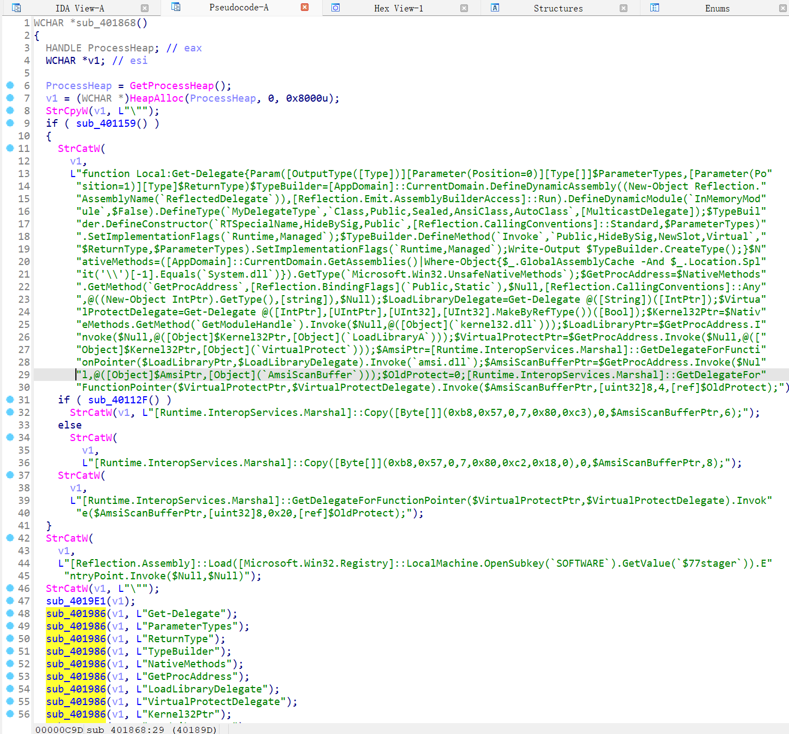

1. **内存分配策略**：使用 `GetProcessHeap` 和 `HeapAlloc` 从进程的堆空间中分配内存，这部分内存用于存储构造出的 PowerShell 命令字符串。首先，`StrCpyW` 函数被用来将起始字符串复制到这块新分配的内存中。
2. **构建 PowerShell 命令的策略**：通过 `[Reflection.Assembly]::Load` 方法来构建一个 PowerShell 命令，目的是以反射的方式将 .NET stager 加载到内存中。此外，通过修改 `AmsiScanBuffer` API，可以规避 Microsoft 的反恶意软件扫描接口（AMSI），使其始终返回 `AMSI_RESULT_CLEAN` 响应，即扫描结果显示内容安全，未发现威胁。
3. **命令混淆技术**：通过多次调用 `sub_401986` 实现了对 PowerShell 命令的混淆。这主要是通过使用随机字符串替换变量名称来实现的，增加了命令的隐蔽性和不易被识别的特点。

**sub_401674**： 

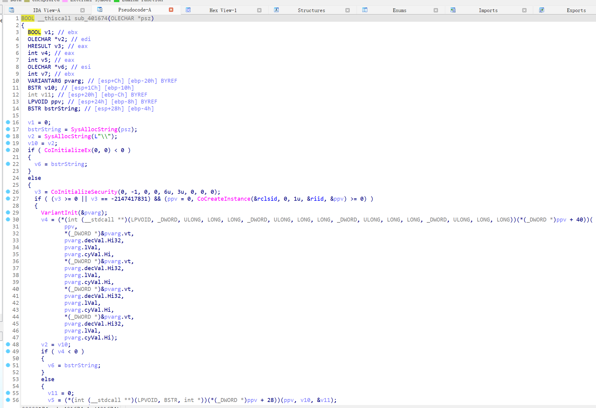

1. **双重系统兼容性调用**：`sub_401674` 被设计为对两种不同的系统架构进行操作：首先针对 32 位系统进行调用，随后再对 64 位系统执行相同的操作。这种双重调用策略确保了函数在不 同的系统环境中都能有效运行。
2. **COM 对象操作的核心**：函数的主体涉及对 COM（组件对象模型）对象的操作。除了最初的 COM 环境初始化等准备工作外，函数的核心部分集中在处理 `ppv+n` 的地方。在这一环节，函数执行了对特定 COM 对象的函数调用。
3. **COM 函数调用的实现**：在 `ppv+n` 的操作中，函数通过调用 COM 对象的特定方法来实现其核心功能。这一步骤是整个函数操作的关键，它直接关联到 COM 对象的交互和控制。

**sub_40112F**： 

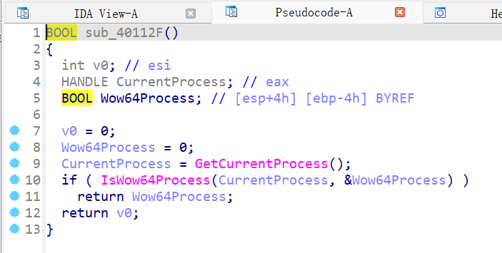

1. **进程句柄获取**：在 `sub_40112F` 的起始阶段，函数调用 `GetCurrentProcess()` 以获得当前进程的特殊句柄。这个句柄不是普通的句柄，而是一个代表执行该函数的进程的伪句柄。
2. **系统架构检测**：利用 `IsWow64Process()` 来判断当前进程是否在 WoW64（Windows 32 位在 Windows 64 位上的子系统）环境下运行。这个检测过程需要两个参数：一是进程的句柄，二是指向布尔类型变量的指针，用于存储检测结果。
3. **架构相关决策**：根据 `IsWow64Process()` 的返回结果，函数能够判断出操作系统是 32 位还是 64 位。这个判断对于后续操作至关重要，因为它决定了下一个函数调用时传递的参数是 `$77svc32` 还是 `$77svc64`，这两个参数分别对应 32 位和 64 位服务。

**sub_4011AD**：

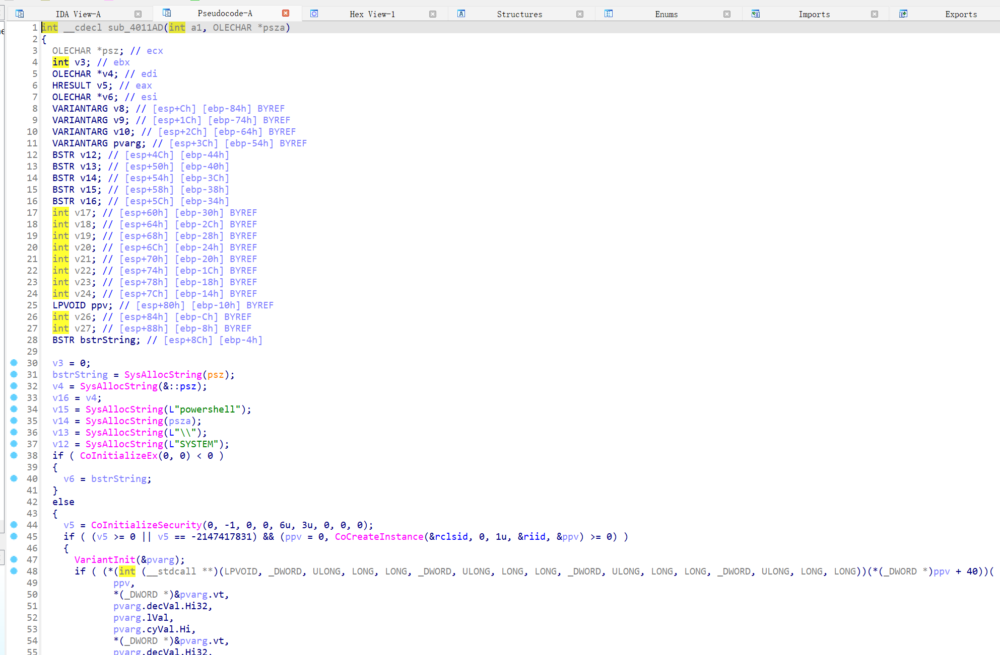

1. **参数分析**：在深入函数内部之前，首先关注其关键参数。其中，`v6` 与操作系统的位数（32 位或 64 位）直接相关，`v7` 是一个整型数值，而 `v5` 则是之前经过混淆处理的 PowerShell 命令字符串。
2. **COM 对象的应用**：函数核心部分涉及到 COM（组件对象模型）对象的使用。它主要通过调用 `ppv + 40` 等位置的函数来实现其功能。这些 COM 对象的调用是函数执行的关键部分。
3. **PowerShell 命令执行**：根据传入的参数和函数开头构造的 `PowerShell\SYSTEM` 字符串，可以推测该函数的主要作用是通过 COM 对象来执行 PowerShell 指令。这种执行方式可能与系统的位数和特定的 PowerShell 命令有关。

**sub_40151A**：

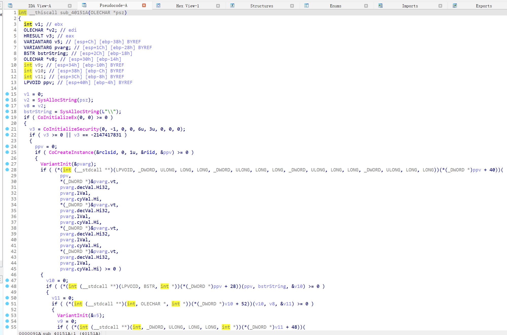

调用了 COM 对象的相关函数。

install.exe 是 R77 rootkit 的一个关键组成部分，其功能和实现机制相当复杂。以下是对其功能的概述：

1. **主要目标**：install.exe 的主要目标是将 R77 rootkit 植入目标系统，确保其在系统中持久化并执行其设计的功能，主要包括隐藏进程、文件、注册表项和网络连接等。在启动时，install.exe 首先从其自身的资源部分提取嵌入的文件，这些文件可能包含了 R77 rootkit 的主要执行代码或其他必要的组件。
2. **资源提取与加载**：install.exe 使用 Windows API 函数 `FindResourceA` 和 `SizeofResource` 来定位和获取这些嵌入资源。接着，通过 `LoadResource` 和 `LockResource` 加载并锁定这些资源，确保它们能够被正确处理。此后，install.exe 使用 `RegOpenKeyExW` 和 `RegSetValueExW` 函数在注册表中创建或修改值，将提取的资源以二进制形式存储，为后续操作做准备。
3. **构建并执行 PowerShell 命令**：install.exe 动态生成 PowerShell 脚本，其中可能包含了使用 `[Reflection.Assembly]::Load` 方法以反射方式加载 .NET stager 到内存中的命令。这种办法的一个优势是可以绕过 Microsoft 的反恶意软件扫描接口（AMSI），使恶意活动不被检测到。此外，通过修改 `AmsiScanBuffer` API，install.exe 进一步确保恶意操作不会被现有的安全机制所识别。
4. **针对不同系统架构的处理逻辑**：install.exe 通过检测当前系统的架构（使用 `GetCurrentProcess` 和 `IsWow64Process` 函数）来决定执行哪个版本的 R77 服务（如 `$77svc32` 或 `$77svc64`）。根据系统架构的不同，install.exe 将加载适当的 R77 组件。
5. **COM 对象的使用**：install.exe 还涉及到 COM 对象的使用，通过这些对象执行一系列操作，包括执行混淆后的 PowerShell 命令、注册服务等。这一部分的实现细节可能相当复杂，涉及多个 COM 接口的调用和操作。

综上所述，install.exe 通过使用资源节中的 .Net stager 文件，加载后绕过系统监控。最终目的是让其注册服务并加载进内存。

#### 资源节

##### 基础静态分析

在一开始 `DIE` 分析 install.exe 时，我发现了它的资源节有一个 EXE 程序和一个 XML 文件；在后面使用 `IDA` 详细分析 install.exe 时，也发现了其使用了资源节中的 .Net stager 文件。因此，我将对资源节进行分析。

首先使用 `Resourece Hacker` 分析：

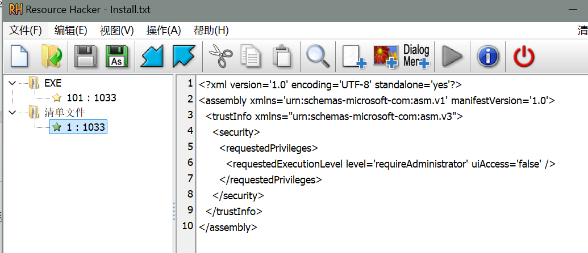

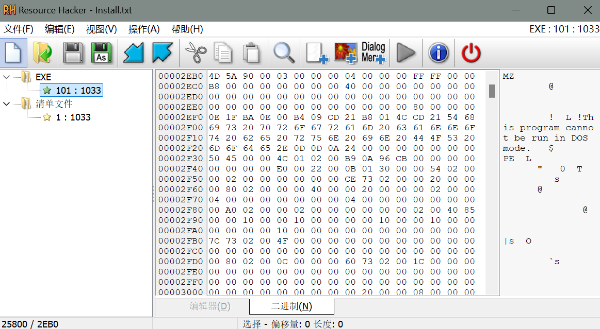

与之前在 IDE 中观察到的一致，确实存在一个 EXE 程序和一个 XML 文件。XML 文件没什么好分析的，将 EXE 程序提取出来。并使用 `DIE` 分析：

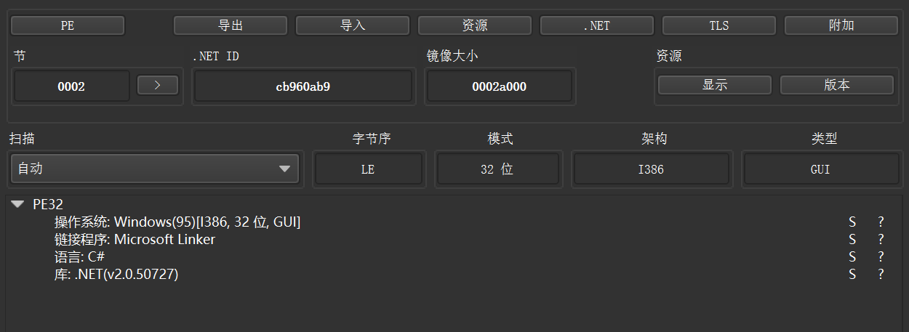

发现是.NET 程序，使用 C#编写。意味着 IDA 不行，得使用.NET 反汇编工具分析。幸好我是 CTF 逆向手，对 C#反汇编略懂一点。

继续查看字符串：
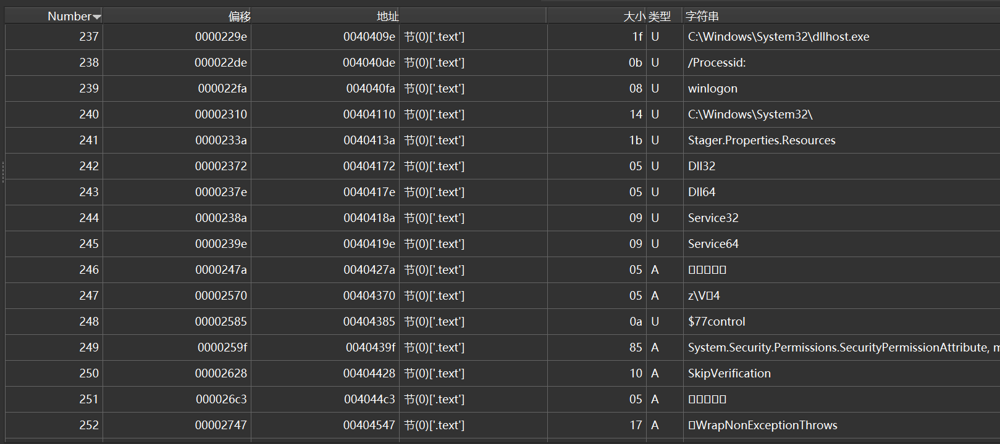

发现可疑路径 `C:\Windows\System32\dllhost.exe` 和 `C:\Windows\System32\`，以及一堆带有 `$77` 开头的字符串。

##### C#反汇编分析

在本次反汇编分析中，我使用了 `dnSpy` 和 `ILSpy` 工具。

首先使用 `ILSpy` 进行整体分析：

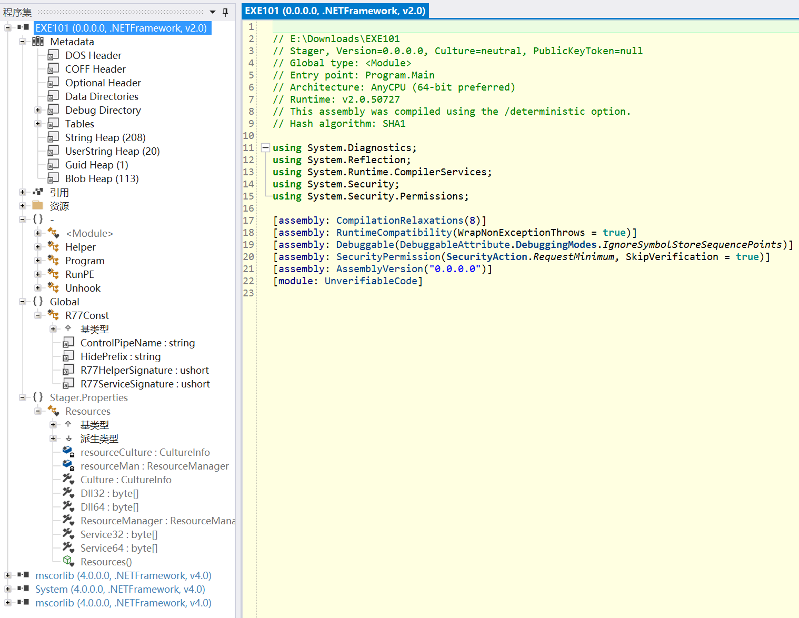

从截图可以看出，该程序名为 Stager。

接着查看了 Global 和 Properties 部分：

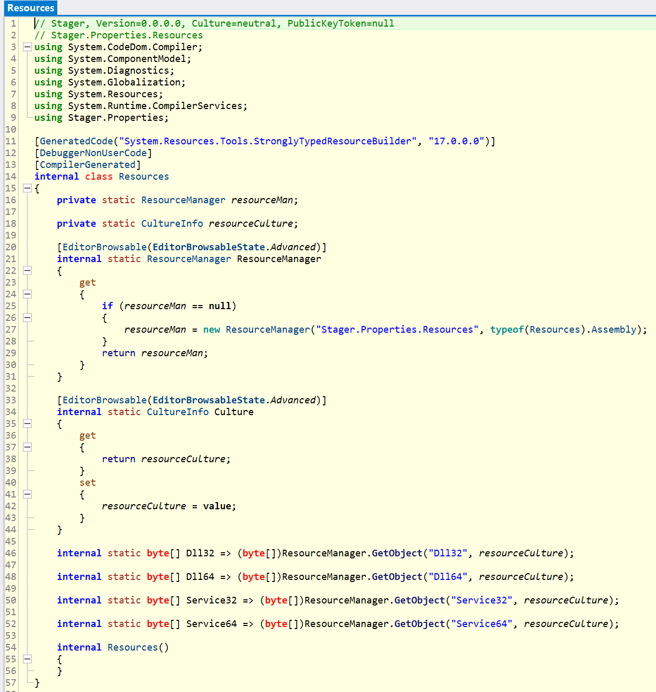

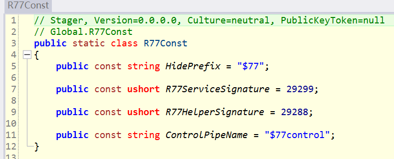

发现其中包含两个类：`R77Const` 和 `Resources`。

进一步查看主要代码：
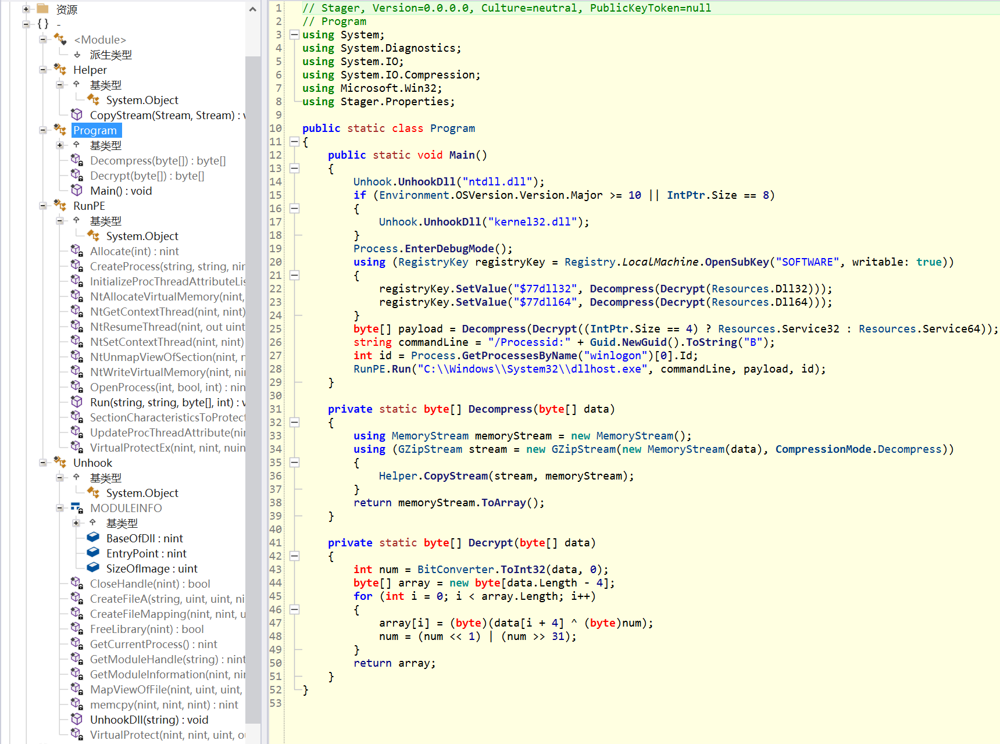

发现了四个关键类：`Helper`、`Program`、`RunPE` 和 `Unhook`。

随后，我使用 `dnSpy` 对 Stager 进行了更细致的分析。


由于分析过程较为复杂，这里直接给出最终的分析结论：

1. **移除 DLL 拦截**：Stager 程序的一个关键任务是消除 DLL 拦截。具体而言，它能够恢复安全程序对系统核心 DLL 文件（例如 NTDLL.dll 或 KERNEL32.dll）所做的更改，这些更改原本用于监控和拦截系统调用。这一行为的目的是为了防止恶意活动被安全工具识别。
2. **修改系统权限**：Stager 程序还会调整 Windows 系统中的 SeDebugPrivilege 权限，这是一种安全机制，允许进程访问其他进程的内存空间，通常用于执行高级恶意行为，如进程注入。
3. **解密和解压服务模块**：Stager 程序负责解密和解压其加载的服务模块，这些模块可能包含执行恶意操作的代码。
4. **服务模块的注入**：在完成解密和解压后，Stager 程序将这些服务模块注入到目标进程中，使得恶意代码能够在用户系统上悄无声息地执行。
5. **进程空洞化**：Stager 程序采用了一种称为“进程空洞化”的技术，这涉及到创建一个新的合法系统进程，清空其内存并用恶意代码填充。这种方法使用合法进程作为掩饰，以隐蔽的方式执行恶意代码。
6. **父进程 ID 伪装**：为了进一步隐藏其行为，Stager 程序可能会使用父进程 ID（PPID）伪装技术，将自己伪装成另一个合法进程的子进程，从而创建新进程。这有助于绕过基于行为的安全检测。

总结来说，Stager 程序的主要功能包括消除 DLL 拦截、调整 SeDebugPrivilege 权限、解密和解压服务模块，并将这些模块注入到目标进程中，无论是 32 位还是 64 位系统。

#### Helper32.dll

最后，我将对服务模块的部分进行简单的分析。由于 Helper64.dll 和 Helper32.dll 差不多，这里只对 Helper32.dll 进行分析。

##### 基础静态分析

使用 `DIE` 进行查看：

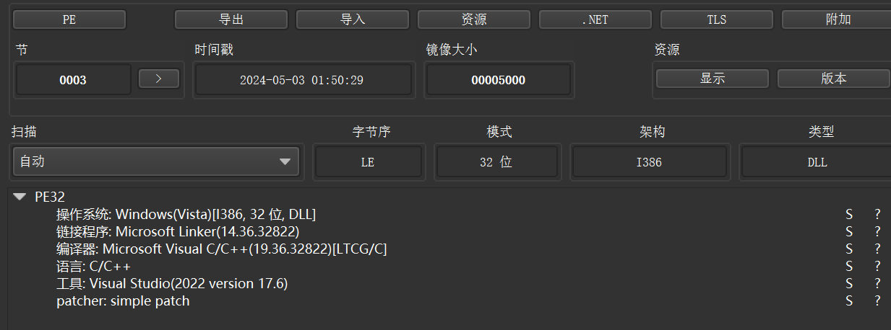

发现使用工具: Visual Studio(2022 version 17.6)进行编写，另外打包工具为 simple patch，没有加壳。

因为 Helper32.dll 是用来作为动态链接库的，所以只要分析它的导出函数即可。

查看其导出表：
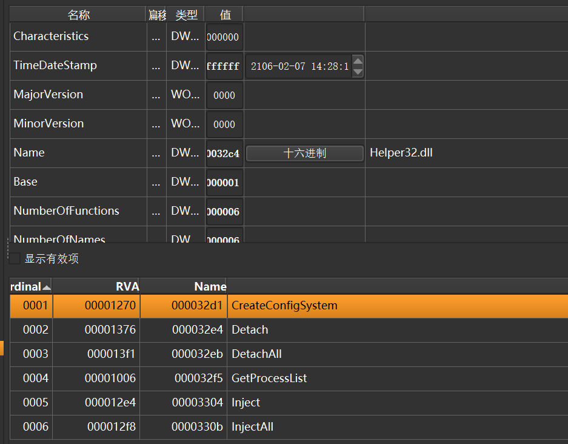

可以发现它有 6 个导出函数，其中最重要的是如下几个：

- `CreateConfigSystem`：负责设置所需的环境；
- `DetachAll` 和 `InjectAll`：分别用于移除和植入恶意行为。

鉴于 `Detach` 和 `Inject` 功能相似，无需重复分析。同样，`DetachAll` 和 `InjectAll` 也具有相似性，因此，我们只需关注 `CreateConfigSystem` 和 `InjectAll` 的分析。

##### IDA 分析

首先，将 `Helper32.dll` 加载到 IDA 中，然后检查 `CreateConfigSystem` 函数：

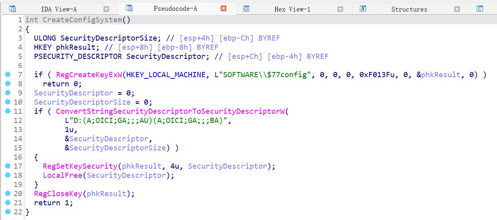

该函数的主要任务是在 Windows 注册表中创建一个新的键，并配置其安全设置，以便任何用户都能对其进行修改。具体来说，它执行以下步骤：

1. **注册表键的创建**：在 `HKEY_LOCAL_MACHINE` 下创建一个键，该键是恶意软件配置系统的一部分。
2. **安全描述符的设置**：使用 `SOFTWARE\\$77config` 路径，通过 `ConvertStringSecurityDescriptorToSecurityDescriptorW` 函数创建一个安全描述符，允许所有用户和管理员完全访问该键。
3. **安全设置的应用**：利用 `RegSetKeySecurity` 函数将安全描述符应用到新创建的注册表键上。
4. **注册表键的关闭**：最后，通过 `RegCloseKey` 函数关闭注册表键的句柄。

这一功能的目的是为恶意软件创建一个可由任何用户访问和修改的配置存储区域，以便其服务模块能够存储当前进程 ID，以便于管理和后续操作。根据系统架构的不同，进程 ID 存储在名为 `svc32` 或 `svc64` 的注册表项中。

接下来，分析 `InjectAll` 函数：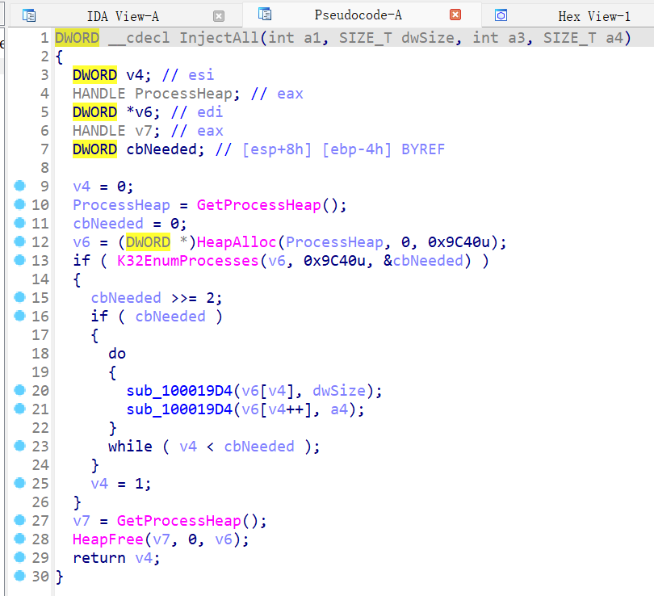

这段代码实现了恶意软件的核心注入机制，通过两个关键步骤确保其在系统中广泛分布并执行隐蔽操作：

1. **对所有进程的注入**：代码首先枚举当前系统中运行的所有进程，然后利用 `sub_100019D4` 函数对这些进程逐一进行注入操作，确保恶意软件的核心组件（一个 DLL 文件）被加载到除特定排除进程外的所有运行中进程中。
2. **新创建子进程的注入**：除了对现有进程的注入外，代码还监控新创建的子进程，并在适当的时候将恶意软件注入这些子进程中，这是通过服务和已感染进程之间的进程间通信实现的。

恶意软件的核心功能包括在多个关键的 Windows API 上安装钩子，这些 API 用于获取系统信息。例如，`NtResumeThread` 在父进程创建子进程后被调用以启动线程执行。通过安装的钩子，恶意软件能够将子进程的 PID 发送到服务模块，并在条件允许时进行注入。

此外，恶意软件的核心组件还负责在关键的 Windows API 上设置挂钩并过滤这些 API 的输出。例如，它可以在 `NtEnumerateKey` 和 `NtEnumerateValueKey` 上设置挂钩，这些 API 用于枚举注册表项，然后过滤掉配置中指定的特定项。

通过这个导出函数，实现了服务模块的另一个主要任务即注入核心 Rootkit。这个核心是一个以资源形式存在于每个运行进程中的 DLL，除非在编译 Rootkit 之前已经在配置中被特定排除。

### （三）使用效果及原理分析

#### Install.exe 和 Uninstall.exe

##### 效果

双击运行 `Install.exe`，这将导致 Rootkit77（R77）被注入到所有当前正在运行的进程中，并在系统中实现该 Rootkit 的持久化。新启动的进程在执行任何指令之前也会被注入 R77，这是通过钩住（hooking）进程创建 API 实现的。安装完成后，R77 将被配置为在系统重启后自动启动，并在第一个用户登录前注入所有进程。

由于 R77 已经注入到所有当前运行的进程中，我们无需重启系统。可以观察到，原本文件夹下的 `$77-Example.exe` 文件已经消失，这验证了 R77 会隐藏所有以 `$77` 为前缀的文件和进程。如图所示：


通过运行 `Uninstall.exe`，系统将恢复至原始状态，其执行的操作包括：

1. **彻底移除 R77**：`Uninstall.exe` 将彻底卸载 R77 rootkit。
2. **从进程中分离 R77**：从所有活跃进程中移除 R77，意味着之前注入的 R77 代码和功能将被清除。
3. **清除 R77 配置**：从注册表中删除所有与 R77 相关的配置信息。

##### 技术实现机制

1. **DLL 注入与进程拦截**：`Install.exe` 利用 DLL 注入技术将 R77 代码加载至活跃进程中，可能涉及创建远程线程或其他注入技术。进程创建拦截可能是通过修改系统级 API（例如 `CreateProcess`）实现，或者通过拦截更低级别的系统调用（例如与进程创建相关的 NT 级函数）。
2. **持久化机制**：R77 的持久化通过修改系统配置（如注册表项）或创建特殊的启动任务实现，确保系统重启后能够自动加载。
3. **卸载与清理**：`Uninstall.exe` 负责从每个已注入的进程中移除 R77，并清理所有相关配置，确保 rootkit 不留痕迹。这可能涉及逆转注入过程和删除或修改注册表项及其他系统配置。

#### 进程隐藏

##### 效果

Rootkit77（R77）的进程隐藏功能是一种强大的技术，它使得特定进程在操作系统的常规监控工具（例如任务管理器）中不可见。这种隐藏技术主要通过修改操作系统的行为来阻止对特定进程的检测。

实际上，R77 不仅能够隐藏进程，还能隐藏任意以 `$77` 为前缀的文件。下面首先展示对任意文件的隐藏效果。

###### 示例进程

R77 提供了一个可执行文件 `$77-Example.exe`，该文件以 `$77` 为前缀。我们首先运行这个文件：


接着查看任务管理器：


这个示例文件可以调节 CPU 占用率，为了更明显地展示其被隐藏但实际存在的效果，我将 CPU 占用率调至 100%。


此时，这个可执行文件在任务管理器中是完全可见的。

接下来，运行 `Install.exe`，重新打开任务管理器，并保持 `$77-Example.exe` 运行，发现无法找到这个进程了：

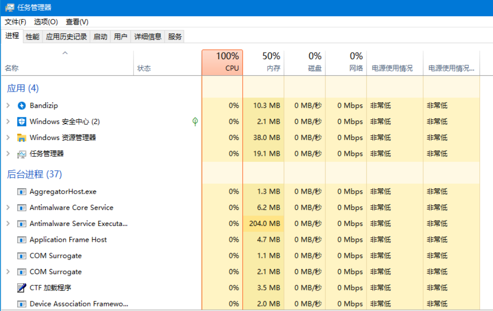

尽管如此，由于我将其设置为 CPU 占用率 100%，我们仍然可以看到 CPU 的极高使用率，但其他进程并未进行高强度操作，这明显表明 `$77-Example.exe` 进程被隐藏了。

此外，刷新文件目录后，也发现 `Example` 文件不见了。

接下来，使用 Process Explorer 查看：

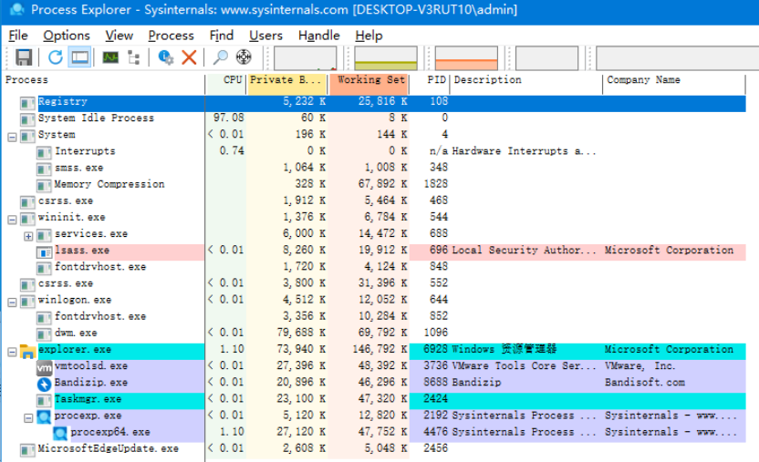

在进程目录树中明显没有这个进程，这确实证明了其被隐藏。

然后，我们查看 Procmon，首先设置过滤器为 `ProcessName is $77-Example.exe`。

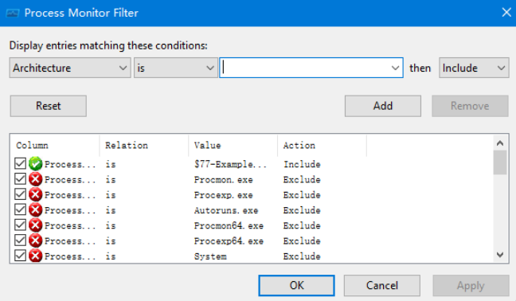

查看过滤后的结果：

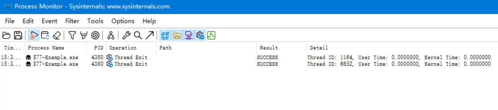

可以明显看到，之前被隐藏的进程 `$77-Example.exe` 的行为被 Procmon 检测到了，包括文件读取等操作。

这是因为 Procmon 能够捕获隐藏进程的活动并显示其详细信息。

###### 任意进程

实际上，R77 默认会隐藏所有以 `$77` 开头的进程，但除此之外，它还允许对其他进程进行针对性的隐藏。

我们运行了 `TestConsole.exe`，这个工具可以显示进程列表，包括那些被隐藏的进程：


在界面的右侧，我们可以看到有一个“Hide”选项。为了实现对指定进程的隐藏，我选择将 `TestConsole.exe` 自身隐藏。


上图展示了在执行“Hide”操作之前，`TestConsole.exe` 在任务管理器中是可见的。点击界面右侧的“Hide”按钮后，我们来查看结果：


可以看到 `TestConsole.exe` 进程已经“消失”，同时界面右侧的“Hide”选项也已经变成了“Unhide”。至此，我们已经成功实现了对任意或指定进程的隐藏。

##### 原理

技术的核心在于操作系统的内核和用户空间的 API 拦截、动态配置以及内存注入技术。该技术通过多种机制实现进程隐藏，确保目标进程在任务管理器和其他进程查看工具中不可见，同时用户无法通过标准方法检测到这些隐藏的进程。

**1. 基于名称的进程隐藏技术**：

首先，R77 采用基于名称的进程隐藏技术，通过筛选机制检查进程名称是否以特定标识符（如 `$77`）开头。在拦截与进程枚举相关的 API（如 `NtQuerySystemInformation` 或 `EnumProcesses`）后，R77 会修改 API 返回的进程列表，排除满足隐藏条件的进程信息。这种方法操作简单，效率高，特别适合频繁创建且符合命名规则的进程，但其劣势在于仅适用于可以修改名称的进程。

**2. 基于进程 ID 的隐藏技术**：

其次，R77 还提供了基于进程 ID 的隐藏技术，用户可以通过配置工具指定需要隐藏的进程 ID。在拦截 API 后，R77 会对比配置的隐藏列表，移除匹配的进程 ID 信息。这种技术无需更改进程名称即可隐藏特定进程，适用于动态生成或无法更改名称的进程。其优势在于灵活性高，适用于任何进程，但劣势在于需要提前知道进程 ID，增加了配置的复杂性。

**3. 基于名称的隐藏技术（替代方案）**：

此外，R77 还提供了基于名称的隐藏技术（替代方案），用户通过配置工具指定特定进程名称，R77 据此决定是否隐藏。该技术类似于基于名称的隐藏，拦截 API 并修改返回值，排除配置列表中的进程。该方法适用于名称固定但不符合特定前缀规则的进程。

**4. API 拦截与进程枚举机制**：

在 API 拦截与进程枚举机制方面，R77 从系统的进程枚举结果中移除目标进程，通过拦截相关 API（例如 `NtQuerySystemInformation`、`EnumProcesses` 等）、修改 API 返回的数据，删除隐藏进程的信息。值得注意的是，由于未拦截直接打开进程的 API（例如 `OpenProcess`），用户可以直接访问进程，而不会触发错误。通过这种方法，隐藏的进程不会出现在任务管理器等工具中，同时用户无法通过常规工具检测到隐藏进程，但直接访问不会引起错误。

**5. 反射式 DLL 注入技术**：

反射式 DLL 注入是 R77 的关键技术，用于将代码注入目标进程以实现隐藏功能。

**技术细节**：

1. **内存分配**：使用 `VirtualAllocEx` 在目标进程内存中分配区域存放 DLL 数据。
2. **DLL 写入**：使用 `WriteProcessMemory` 将 R77 的 DLL 数据写入内存区域。
3. **定位加载器**：使用 `GetReflectiveLoaderOffset` 计算 DLL 中加载器函数的偏移地址。
4. **线程创建**：调用 `CreateRemoteThread` 创建线程执行 DLL 加载器代码。
5. **执行监控**：使用 `WaitForSingleObject` 等待线程执行完成，确保 DLL 加载成功。

**特点**：

- **无磁盘痕迹**：DLL 仅在内存中，不写入硬盘。
- **隐蔽性强**：DLL 不在 PEB 模块列表中，难以被安全工具检测。
- **自加载功能**：通过内部自引导代码完成加载与初始化，绕过常规 DLL 加载路径。

**6. 进程创建时的拦截**：

在进程创建时的拦截方面，R77 服务启动时，会自动注入所有当前运行的进程，并监控新进程。通过拦截 `NtResumeThread`，在新进程初始化完成后、执行任何指令前进行注入。对于跨架构进程，通过 R77 服务的命名管道完成注入请求。R77 在新进程执行任何指令前完成注入，确保隐藏功能在进程启动初期生效。对于快速枚举进程的应用（如 `RegEdit`），此策略尤为重要。

**技术核心总结**：

R77 的进程隐藏技术依赖以下核心机制：

1. **劫持与篡改 API**：针对进程枚举 API，修改返回值以隐藏目标进程。
2. **反射式 DLL 注入**：使用反射加载器动态加载 R77 DLL，提高隐蔽性。
3. **动态配置**：用户可通过配置系统灵活指定隐藏规则（基于名称、前缀或 ID）。
4. **进程创建拦截**：确保隐藏功能在新进程开始运行前即已生效。

R77 具有以下几个隐蔽性特征：

- **模块列表不可见**：通过反射式 DLL 注入，隐藏 DLL 模块，不显示在 PEB 中。
- **进程列表不可见**：通过 API 拦截，隐藏目标进程，使其从进程枚举结果中移除。
- **操作系统无痕迹**：进程运行时的隐藏操作全部在内存中完成，不产生磁盘痕迹。

#### 文件隐藏

##### 效果

接下来，我们将探讨 R77 的文件隐藏功能。这一功能依托于 API Hooking 技术，通过拦截和修改系统级别的文件系统调用实现，使得特定文件或目录在操作系统的标准文件浏览器，如 Windows 资源管理器中变得不可见。

需要注意的是，只有以 `$77` 为前缀的文件和文件夹才能被 R77 隐藏。

首先，我们通过执行 `Uninstall.exe` 来恢复到之前的状态：


然后，在一个文件夹中放入我想要隐藏的文件和文件夹：


接下来，执行 `Install` 操作，并刷新文件夹：


##### 原理

R77 Rootkit 利用操作系统文件系统的核心功能，通过关键函数的劫持和数据返回结果的修改，高效地隐藏文件和目录。这种内核级别的实现对资源管理器等工具来说是透明的，提供了极强的隐蔽性。其核心技术包括文件系统函数劫持、数据返回结果的修改、特定路径隐藏等。

**1. 核心技术：文件系统函数劫持**：

R77 Rootkit 的核心技术是文件系统函数劫持，其劫持目标是核心函数 NtQueryDirectoryFile 和 NtQueryDirectoryFileEx，这两个函数是 Windows 文件系统的核心，用于列举目录中的文件和子目录。R77 通过注入目标进程，劫持这些函数的调用栈，修改函数行为，拦截调用结果，并在文件枚举前介入。这样，R77 就控制了操作系统或应用程序获取文件目录信息的入口。

**2. 数据返回结果的修改**：

在数据返回结果的修改方面，R77 在拦截文件系统函数后，会分析这些函数的返回结果，即目录中的文件和子目录列表，然后过滤这些结果，移除符合隐藏条件的项。

**过滤规则**：

- **基于文件名前缀**：以特定前缀（如 `$77`）命名的文件或目录会被过滤。
- **基于配置路径**：R77 的配置系统允许用户指定需要隐藏的文件或目录的完整路径。

**实现步骤**：

1. **调用原始函数**：拦截后，仍调用底层的原始 `NtQueryDirectoryFile` 函数获取完整的文件列表。
2. **分析返回结果**：遍历每个文件或目录，检查其名称是否符合隐藏条件。
3. **过滤结果**：符合隐藏条件的文件或目录将被从结果集中移除。
4. **返回修改后的结果**：最终返回给调用方的是已经过滤后的文件列表。

**3. 特定路径隐藏**：

R77 还允许用户通过配置系统精确指定文件或目录路径以实现隐藏，这种特定路径隐藏的扩展功能提供了更高的灵活性，使得能够隐藏任何文件或目录，而不仅仅是基于名称前缀。用户可通过 R77 的配置文件或命名管道接口定义需要隐藏的文件或目录路径。系统运行时动态加载这些配置，无需重启或重新部署。

**4. 实现效果**：

在实现效果方面，被隐藏的文件或目录在使用标准工具（如资源管理器、命令行工具等）时完全不可见。对用户来说，这些文件或目录似乎并不存在。然而，R77 的隐藏仅影响文件系统的枚举操作。如果用户知道隐藏文件或目录的完整路径，可以直接通过路径访问，例如在命令行中直接输入文件路径仍可以打开该文件。

**5. 技术核心细节**：

**核心函数劫持与注入**：

R77 使用 Hook 技术拦截 NtQueryDirectoryFile 和 NtQueryDirectoryFileEx，改变这些函数的返回值，移除需要隐藏的文件或目录。同时，使用反射式 DLL 注入技术，将 R77 的隐藏逻辑注入到所有运行的进程中，在每个进程的地址空间内执行隐藏逻辑，覆盖操作系统的原生文件枚举行为。

**隐藏逻辑工作流**：

1. 应用程序或操作系统调用 `NtQueryDirectoryFile` 枚举文件。
2. R77 拦截该调用，并分析返回的文件列表。
3. 根据隐藏规则过滤结果集，移除符合条件的文件或目录。
4. 将过滤后的结果返回给调用方。

**过滤实现**：

- **前缀匹配**：检查文件名是否以 `$77` 等特定字符串开头。
- **路径匹配**：与配置的隐藏路径列表进行比对，匹配的项被过滤。

**6. 安全性与隐蔽性**：

R77 的隐藏技术具有极高的隐蔽性，因为拦截的是底层文件系统函数，所有调用这些函数的工具都无法发现被隐藏的文件。过滤逻辑直接修改返回结果，而不是阻止文件访问。这种方法难以被常规的文件系统监控工具或杀毒软件发现。

**安全隐患**：

- **恶意利用**：这种隐藏技术可能被恶意软件用于隐藏其自身或敏感数据。
- **检测困难**：由于隐藏文件仍存在于文件系统中，传统文件扫描工具难以发现。检测隐藏文件需要直接扫描文件系统的物理层（如磁盘扇区）或通过特定工具分析 `NtQueryDirectoryFile` 调用链。

**总结**：

总的来说，R77 的文件隐藏技术通过劫持文件系统函数并修改其返回值，在操作系统层面实现了极其高效的文件和目录隐藏。虽然这种方法对攻击者具有强大的隐蔽能力，但也显著增加了安全风险。理解其工作原理有助于更有效地设计检测与防御方案，同时提醒我们关注操作系统接口的安全性。

#### 注册表隐藏

##### 效果

现在，我们验证 Rootkit77 的注册表隐藏功能。R77 的配置信息存储在 `HKEY_LOCAL_MACHINE\SOFTWARE\$77config` 中，并且可以在未提权状态下由任何进程写入。这个键的 DACL（Discretionary Access Control List）被设置为可以给任意用户授予完全访问权限。在注册表编辑器被注入了 Rootkit 之后，“$77config”键会自动隐藏，并且它还可以实现对任意以`$ 77`为前缀的注册表键进行隐藏。

首先，执行 `Uninstall.exe` 以恢复到未感染的状态，然后打开注册表编辑器。在 `HKEY_CURRENT_USER` 下创建一个名为 `test` 的注册表项，并在其中创建一个以 `$77` 为前缀的子注册表项：


接下来，执行 `Install.exe`，然后刷新注册表：

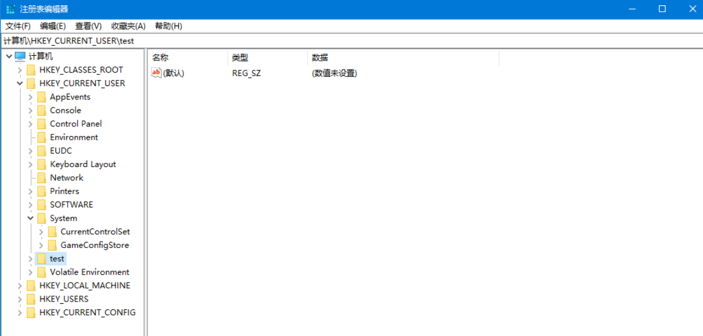

可以看到，在 `test` 下没有任何其他目录了，这证明了 `$77` 被成功隐藏，验证成功。

##### 原理

R77 Rootkit 的注册表隐藏功能是一种高级的技术手段，它通过劫持关键的内核级注册表枚举函数并修改其行为。这种技术使得注册表项和值的隐蔽性得到了高效和隐蔽的增强。具体来说，这种技术的工作原理可以分为以下几个部分：

**1. 核心机制：关键注册表函数的操纵**：

首先，R77 Rootkit 的核心技术在于劫持目标函数，这些目标函数包括 NtEnumerateKey 和 NtEnumerateValueKey。NtEnumerateKey 函数用于枚举注册表键，即列出一个注册表路径下的所有子键；而 NtEnumerateValueKey 函数则用于枚举注册表键中的值，即列出某个注册表键下的所有值。R77 使用函数劫持技术，拦截对这些核心函数的调用，并在函数执行完成后，通过 Hook 插入自定义逻辑，进而修改返回的数据。由于这些函数构成了 Windows 注册表操作的基石，绝大部分应用程序和系统功能都会依赖它们来访问注册表内容，因此劫持这些函数后，R77 能对注册表枚举过程施加细粒度的控制。

**2. 数据返回结果的筛选**：

接下来，R77 在劫持函数后，依然会调用底层的原始函数以执行正常的注册表枚举操作。随后，R77 会审查返回结果，筛选出符合隐藏条件的注册表项或值，并从结果集中移除。过滤条件可以基于名称前缀，例如以 `$77` 开头的注册表项或值，或者基于路径配置，通过 R77 的配置文件，用户可以指定需要隐藏的注册表项路径。

**实现步骤**：

1. 调用原始函数：调用 `NtEnumerateKey` 或 `NtEnumerateValueKey` 获取注册表内容。
2. 分析返回结果：检查每一个注册表键或值是否符合隐藏条件。
3. 过滤隐藏项：移除符合隐藏条件的注册表键或值。
4. 返回修改后的结果：调整后的结果集返回给调用方，隐藏项不再可见。

**3. 调整枚举索引**：

此外，R77 还需要调整枚举索引，因为 Windows 注册表枚举函数会为每个返回的项分配一个索引，该索引在连续的枚举调用中会被用来定位下一项。当 R77 移除符合条件的注册表项或值后，为了保证剩余项的索引连续性，需要重新计算枚举索引。这种索引调整确保了调用方无法通过索引空洞察觉隐藏项的存在，从而使得隐藏项对于调用者完全不可见，调用者认为注册表内容被完整地枚举。

**4. 技术实现代码分析**：

**核心拦截逻辑**：

以下是拦截 `NtEnumerateKey` 的示例代码：

```c
NTSTATUS HookedNtEnumerateKey(
    HANDLE KeyHandle,
    ULONG Index,
    KEY_INFORMATION_CLASS KeyInformationClass,
    PVOID KeyInformation,
    ULONG Length,
    PULONG ResultLength
) {
    NTSTATUS status = OriginalNtEnumerateKey(
        KeyHandle, Index, KeyInformationClass, KeyInformation, Length, ResultLength);

    if (NT_SUCCESS(status)) {
        FilterRegistryKeys(KeyHandle, KeyInformation, KeyInformationClass);
    }
    return status;
}
```

**拦截逻辑分解**：

1. 调用原始函数：使用 `OriginalNtEnumerateKey` 调用未被操纵的注册表枚举函数，获取完整的结果集。
2. 检查调用状态：确保函数执行成功，返回了有效的结果。
3. 过滤逻辑：调用 `FilterRegistryKeys` 函数，移除符合隐藏条件的注册表键。

**过滤函数示例**：

```c
void FilterRegistryKeys(
    HANDLE KeyHandle,
    PVOID KeyInformation,
    KEY_INFORMATION_CLASS KeyInformationClass
) {
    // 遍历 KeyInformation，筛选符合隐藏条件的项
    // 移除隐藏项，并调整其余项的索引
}
```

**5. 注册表隐藏的效果**：

注册表隐藏的效果是，被隐藏的注册表项或值在通过标准工具查看时完全不可见，即使应用程序依赖注册表访问功能，也无法检测到被隐藏的项。然而，这种技术也有局限性，如果用户知道隐藏项的确切路径或名称，可以直接通过路径访问该项，且隐藏仅影响枚举操作，而不影响直接访问。

**6. 隐蔽性与安全性分析**：

**隐蔽性**：

- 操作系统透明性：R77 的隐藏逻辑在操作系统核心层面实现，调用方只能看到经过过滤的结果。
- 修改返回结果：隐藏逻辑不影响注册表项的实际存储，仅对访问接口施加控制，进一步提升隐蔽性。

**潜在安全风险**：

- 恶意利用：恶意软件可使用类似技术隐藏自身的注册表配置，使检测和移除变得更加困难。
- 检测复杂性：隐藏逻辑对常规的反病毒工具和监控软件透明，需要深度检测工具才能发现异常。

**总结**：

总结来说，R77 的注册表隐藏技术通过劫持关键的注册表枚举函数，实现了对注册表键和值的高效隐藏。其核心在于拦截并修改 API 的返回结果，结合过滤逻辑和索引调整，确保隐藏项完全不可见。这种技术的高隐蔽性对攻击者具有极大的吸引力，但也增加了系统安全管理的复杂性。理解其工作原理是有效检测与防御的基础。

#### 网络连接隐藏

##### 效果

最后，我们将在卸载之前的安装后，验证 R77 对网络连接，例如 TCP 和 UDP 的隐藏能力。

###### TCP 隐藏

首先，打开 TCPView，仅选择显示 TCP v4 连接：


在此步骤中，我打开了 Microsoft Store，可以在 TCPView 中看到其对应的进程：


接着，打开 TestConsole.exe，点击“Hide”按钮，然后重新查看 TCPView：


发现无法侦察到相应端口的 TCP 通信了，这证明了 TCP 连接已被成功隐藏。

###### UDP 隐藏

首先，在 TestConsole.exe 中设置仅显示 UDP v4 连接：


然后，我打开了 Edge 浏览器，在 TCPView 中可以看到其对应的进程：


打开 TestConsole.exe，点击“Hide”按钮，然后重新查看 TCPView（注意 Edge 可能会启动多个进程，但通常只有一个进程是实际运行的）：


此时，之前显示的 Edge 的 UDP 连接进程已经消失，这证明了 UDP 连接已被成功隐藏。

##### 原理

R77 Rootkit 通过操纵操作系统的网络通信接口和数据反馈机制，在系统底层对 **TCP/UDP 网络连接** 进行隐蔽处理。这种隐蔽手段依赖于关键 I/O 控制函数的拦截和数据篡改，以确保某些网络连接在监控工具和系统调用中无法被检测到。

**1. 核心机制：网络 I/O 控制函数的拦截**：

R77 Rootkit 的核心机制是网络 I/O 控制函数的拦截，特别是针对 `NtDeviceIoControlFile` 函数的劫持。`NtDeviceIoControlFile` 函数负责处理设备的 **I/O 控制命令**，包括从网络驱动程序（例如 `\Device\Nsi`）获取网络连接信息。查询和列举网络连接的操作依赖于这个函数和特定的 **I/O 控制代码**（例如 `0x12001b`）。R77 采用函数劫持技术，拦截对 `NtDeviceIoControlFile` 的调用。具体是在执行原始函数后，插入额外逻辑，以篡改其返回的网络连接数据。这种劫持发生在系统底层，对上层应用不可见，并且对于特定的 I/O 控制代码（如查询 **TCP/UDP 连接**），R77 可以选择性地干预。

**2. 拦截与处理流程**：

拦截与处理流程分为几个步骤：

1. **截获 I/O 控制函数**：

R77 劫持 `NtDeviceIoControlFile` 函数，捕获所有 I/O 控制请求，并通过分析请求的设备对象（如 `\Device\Nsi`）和 **I/O 控制代码**，识别是否为网络连接查询。

2. **识别网络连接查询**：

通过检查 **I/O 控制代码**（如 `IOCTL_TCP_UDP_QUERY`），确定是否请求 TCP/UDP 连接数据。如果目标为网络连接列表，则进行干预。

3. **调用原始函数**：

调用底层的原始 `NtDeviceIoControlFile` 函数，获取未篡改的网络连接列表。

4. **筛选连接数据**：

修改返回的网络连接列表，移除特定的连接条目。并调整列表顺序和总计数，以保持隐蔽性。

**代码示例**：

伪代码如下，展示了如何实现这一过程：

```c
NTSTATUS HookedNtDeviceIoControlFile(
    HANDLE FileHandle,
    HANDLE Event,
    PIO_APC_ROUTINE ApcRoutine,
    PVOID ApcContext,
    PIO_STATUS_BLOCK IoStatusBlock,
    ULONG IoControlCode,
    PVOID InputBuffer,
    ULONG InputBufferLength,
    PVOID OutputBuffer,
    ULONG OutputBufferLength
) {
    // 调用原始的 NtDeviceIoControlFile 函数
    NTSTATUS status = OriginalNtDeviceIoControlFile(
        FileHandle, Event, ApcRoutine, ApcContext, IoStatusBlock,
        IoControlCode, InputBuffer, InputBufferLength,
        OutputBuffer, OutputBufferLength
    );

    // 检查状态和 I/O 控制代码
    if (NT_SUCCESS(status) && IoControlCode == IOCTL_TCP_UDP_QUERY) {
        // 对网络连接数据进行筛选
        FilterNetworkConnections((NetworkConnectionsList*)OutputBuffer);
    }

    return status;
}
```

伪代码中的 `HookedNtDeviceIoControlFile` 函数首先调用原始的 `NtDeviceIoControlFile` 函数，然后检查状态和 I/O 控制代码。如果条件满足，则调用 `FilterNetworkConnections` 函数对网络连接数据进行筛选。

**3. 数据返回结果的筛选**：

**数据结构**：

网络连接数据通常包括以下信息：

- **源地址与端口**：本地机器的网络地址与端口。
- **目标地址与端口**：远程机器的网络地址与端口。
- **协议类型**：TCP 或 UDP。
- **连接状态**：如 ESTABLISHED、LISTEN 等。

**筛选机制**：

1. **遍历连接列表**：

遍历返回的每个网络连接，使用 `ShouldHideConnection` 函数判断是否需要隐藏。

2. **移除隐藏项**：

如果某个连接需要隐藏，则将其从列表中移除。并通过内存操作将后续连接向前移动，覆盖需要隐藏的条目。

3. **调整计数和顺序**：

同时，更新连接列表的总计数，确保列表的完整性，并调整后续连接的顺序，以防止索引空洞。

**筛选函数示例**：

伪代码如下：

```c
void FilterNetworkConnections(NetworkConnectionsList* connections) {
    for (int i = 0; i < connections->Count; i++) {
        if (ShouldHideConnection(connections->Connections[i])) {
            // 移动后续连接覆盖当前连接
            MoveMemory(
                &connections->Connections[i],
                &connections->Connections[i + 1],
                (connections->Count - i - 1) * sizeof(NetworkConnection)
            );
            // 减少总计数
            connections->Count--;
            // 重新检查当前索引
            i--;
        }
    }
}

bool ShouldHideConnection(NetworkConnection connection) {
    // 判断逻辑：如根据目标地址、端口或协议类型
    return (connection.LocalPort == 12345); // 示例：隐藏特定端口的连接
}
```

**4. 实现效果与隐蔽性**：

**实现效果**：

被隐藏的网络连接不会出现在监控工具（如 `netstat`、Wireshark）或系统调用中。调用方认为返回的网络连接列表完整且正确。

**隐蔽性保证**：

隐蔽性保证通过修改返回数据后调整索引与计数来实现，确保数据结构无异常。上层应用程序（如防火墙或网络监控软件）无法通过常规手段发现被隐藏的连接。

**5. 技术优点与风险分析**：

**优点**：

1. 透明性高：

数据筛选在内核层完成，对上层应用完全透明。

2. 灵活性强：

可以根据任意条件（如地址、端口、协议类型）动态选择隐藏的连接。

3. 系统兼容性：

劫持位置位于标准接口，适用于大多数 Windows 系统版本。

**风险**：

1. 检测难度增加：

标准网络监控工具无法检测到被隐藏的连接。

2. 滥用问题：

恶意软件可以利用此技术隐藏自身的网络通信，增加检测和清除的难度。

3. 性能开销：

筛选和修改数据列表需要额外的计算资源，可能导致性能下降。

**总结**：

R77 网络连接隐藏技术通过拦截网络 I/O 控制函数和修改数据返回机制，在系统级别隐藏 **TCP/UDP 网络连接**。通过精确的连接筛选和列表调整，其实现的隐蔽性几乎无懈可击。然而，这种技术也带来了显著的安全风险，加强对内核完整性和网络行为的监控是防御此类技术的关键。

## 四、实验结论及心得体会

---

### 1. 实验结论

R77 工具是一款开源的 Ring3 级别的 rootkit 工具，它能够隐藏系统中的多种元素，如文件、目录、进程、CPU 使用率、注册表键值、服务、TCP 和 UDP 连接、命名管道以及计划任务等。其核心工作原理是基于 Windows API 的钩子技术，通过改变 API 的行为来隐藏特定的系统元素。R77 工具由四个主要模块组成：安装器模块、阶段模块、服务模块和核心模块。

1. **安装器模块**：负责将阶段模块的 PE 文件存储在注册表中，采用一种常见的持久性技术，用于在系统中潜伏恶意代码。阶段模块存储后，安装器模块构建并执行 PowerShell 命令，以加载并执行阶段模块，并创建计划任务以确保该 PowerShell 命令的运行。

2. **阶段模块**：主要任务是负责将服务模块和核心模块注入到系统中。

3. **服务模块**：作为一个 Windows 服务，其主要职责是将核心模块注入到所有运行中的进程。

4. **核心模块**：作为实际的 rootkit，通过钩子 Windows API 来隐藏系统中的各种元素。

R77 工具还包含一个动态配置系统，允许用户通过进程 ID 和名称来隐藏进程，通过完整路径来隐藏文件系统项，以及隐藏特定端口的 TCP 和 UDP 连接等。配置信息存储在 `HKEY_LOCAL_MACHINE\SOFTWARE\$77config` 中，任何进程都可以无需提升权限进行写入。

此外，R77 工具采用了多种技术来规避 AV 和 EDR 的检测，包括 AMSI 绕过和 DLL 反钩子技术。AMSI 绕过通过修改 `amsi.dll!AmsiScanBuffer` 函数，使其始终返回 `AMSI_RESULT_CLEAN`，从而绕过 AMSI 的扫描。DLL 反钩子技术则是通过从磁盘加载 `ntdll.dll` 的新副本并恢复原始的部分，以此来规避其他钩子检测。

综合上述分析，R77 工具是一个高度复杂且灵活的系统隐藏工具，它利用 Windows API 钩子技术和多种高级技术来隐藏系统元素，使得恶意软件能够在系统中持久存在且难以被检测。本次实验不仅验证了 R77 工具在隐藏系统元素方面的强大功能，还通过深入的技术分析，揭示了其隐藏技术的复杂性和深度，以及其在不修改被隐藏对象物理状态或数据的情况下实现隐藏的能力。

### 2. 心得体会

此次实验不仅让我深入了解了 R77 工具的技术原理与功能特性，还为我提供了宝贵的实践经验和个人感悟：

- **技能提升**：通过实验，我进一步熟练掌握了如 Prcomon、ProcessExplorer 等病毒分析工具的使用技巧，提高了我的病毒分析和问题解决能力。
- **认识深化**：在实验过程中，我深刻认识到技术是一把双刃剑。虽然 R77 为系统管理和隐私保护提供了强有力的支持，但同时也存在被滥用的风险。这使我更加意识到，在进行技术研究和应用时必须时刻关注安全性和伦理问题。
- **学习动力**：实验的成功激发了我对计算机技术深入学习的兴趣。我认识到只有不断学习并掌握新技术，才能更有效地应对日益复杂的网络安全威胁与挑战。

总之，这次经历不仅增强了我的专业技能，也加深了我对信息安全领域重要性的理解，并激励着我在未来继续探索更多未知领域。
