<div align='center'>
<b> <font face='微软雅黑' size='6'> 恶意代码分析与防治技术课程实验报告 </font> </b>
</div>


<div align='center'>
<b> <font font face='微软雅黑' size='6'> 实验十二 </font> </b>
</div>


<div>
<font face='宋体' size='6'>&nbsp;&nbsp;&nbsp;&nbsp; 学 院：网络空间安全学院 </font> <br>
<font face='宋体' size='6'>&nbsp;&nbsp;&nbsp;&nbsp; 专 业：信息安全 </font> <br>
<font face='宋体' size='6'>&nbsp;&nbsp;&nbsp;&nbsp; 学 号：2212998 </font> <br>
<font face='宋体' size='6'>&nbsp;&nbsp;&nbsp;&nbsp; 姓 名：胡博浩 </font> <br>
<font face='宋体' size='6'>&nbsp;&nbsp;&nbsp;&nbsp; 班 级：信息安全 </font> <br>
</div>


## 一、实验目的

---

1. 完成教材上 lab12 的实验内容。
2. 在样本分析结果的基础上，编写样本的 Yara 检测规则。
3. 尝试编写 IDA Python 脚本来辅助样本分析。

## 二、实验原理

---

### 1. 进程注入

进程注入是指攻击者将恶意代码插入到正常进程中执行，从而利用目标进程的合法身份隐藏恶意活动，常见方法包括：

1. **API 调用实现注入**：
   - `CreateRemoteThread`：在目标进程中创建线程以执行恶意代码。
   - `VirtualAllocEx`：在目标进程中分配内存，用于存储恶意代码。
   - `WriteProcessMemory`：将恶意代码写入目标进程内存。

2. **DLL 注入**：
   
   将恶意代码封装为 DLL 文件，通过 API 如 `LoadLibrary` 加载到目标进程，执行 DLL 的 `DllMain` 函数。
   
3. **代码洞**：
   
   利用目标程序中未使用的内存空间插入恶意代码。

这种技术利用正常进程的上下文和权限执行恶意行为，难以被普通安全软件识别。

### 2. Hook 注入

Hook 注入允许拦截和篡改系统函数调用或消息，通常用于监控或修改系统行为。常见的 Hook 注入技术包括：

1. **API Hooking**：
   
   修改系统 API 的入口点，将调用重定向到恶意函数。典型方法包括：
   - 替换导入地址表（IAT）。
   - 使用工具如 Microsoft Detours。
   
2. **Inline Hooking**：
   
   修改函数前几条机器码，插入跳转指令到恶意代码。
   
3. **Message Hooking**：
   
   使用 `SetWindowsHookEx` 设置全局钩子，监控窗口消息或键盘事件。例如设置键盘钩子 (`WH_KEYBOARD_LL`) 以窃取用户输入。

Hook 注入常用于键盘记录、监控窗口活动和修改程序行为。

### 3. APC 注入

APC 是一种异步机制，允许线程在可警报状态下执行特定代码。攻击者可以利用 APC 将恶意代码插入目标线程的执行上下文，具体步骤如下：

1. **分配内存并写入代码**：
   
   使用 `OpenProcess` 打开目标进程句柄。调用 `VirtualAllocEx` 分配内存，`WriteProcessMemory` 写入恶意代码。

2. **排队 APC 对象**：
   
   使用 `QueueUserAPC` 将恶意代码加入目标线程的 APC 队列。当目标线程进入可警报状态时，执行 APC 队列中的代码。

APC 注入可在用户模式或内核模式下操作，通常用于注入 shellcode 或执行恶意 DLL。

### 4. 进程替换

进程替换技术通过启动合法进程并用恶意代码替换其内存空间实现伪装，常见流程：

1. 创建合法进程 (如 `CreateProcess`)。
2. 暂停进程 (`SuspendThread`)。
3. 使用 `VirtualAllocEx` 和 `WriteProcessMemory` 写入恶意代码。
4. 使用 `SetThreadContext` 修改线程上下文，指向恶意代码入口点。
5. 恢复进程运行 (`ResumeThread`)。

这种方法将恶意代码伪装成合法进程的行为，增加检测难度。

### 5. Detours

Detours 是一种用于拦截和修改函数调用的技术。通过修改函数机器码实现重定向，典型实现步骤如下：

1. **插入跳转指令**：
   
   修改目标函数的开头，插入跳转指令指向恶意代码。
   
2. **函数包装**：
   
   在调用目标函数之前或之后添加额外的代码。

Detours 技术常用于监控系统调用、篡改函数行为或劫持敏感操作。

### 6. 恶意代码启动隐蔽行为

恶意代码通常采用以下隐蔽启动方式，以规避检测：

1. **注册表修改**：
   
   在注册表中添加或伪装启动项，如 `HKLM\Software\Microsoft\Windows\CurrentVersion\Run`。
   
2. **服务伪装**：
   
   注册恶意代码为系统服务，伪装成正常服务。
   
3. **任务计划**：
   
   使用任务计划程序定时启动恶意程序。
   
4. **自启动目录**：
   
   将恶意代码放入启动文件夹，如 `C:\Users\<User>\AppData\Roaming\Microsoft\Windows\Start Menu\Programs\Startup`。
   
5. **DLL 注入与反射加载**：
   
   通过 DLL 注入或反射性加载，在合法进程上下文中执行恶意代码。

## 三、实验过程

---

### （一）完成 Lab12 的题目

#### 1. Lab12-1

**分析在 Lab12-01.exe 和 Lab12-01.dll 文件中找到的恶意代码，并确保在分析时这些文件在同一目录中**。

##### （1）初步静态分析

- **Lab12-01.exe**

首先，我们对 exe 文件进行了特征分析。通过使用 `DIE` 工具，我们检查了其加壳情况：

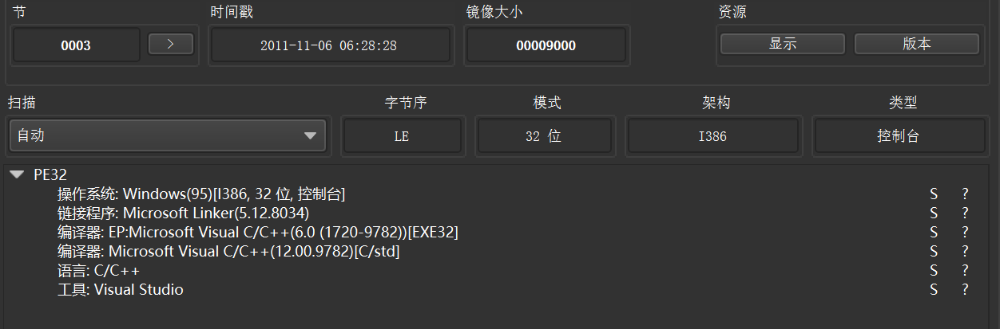

结果显示该文件未加壳，且由 Visual Studio 编写。

接下来，我们查看了导入表：

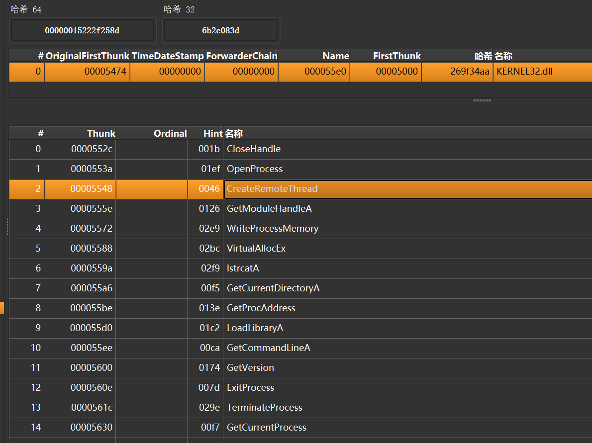

发现了一些关键的导入函数：

- **CreateRemoteThread**：用于在远程进程中创建线程。
- **WriteProcessMemory**：向另一个进程的地址空间写入数据。
- **VirtualAllocEx**：在另一个进程的虚拟地址空间中分配内存。
- **LoadLibrary**：加载动态链接库。

这些函数通常被恶意代码用于进程操作，暗示 Lab12-01 可能涉及注入后的远程后门 RemoteShell 行为。

然后，我们分析了字符串：

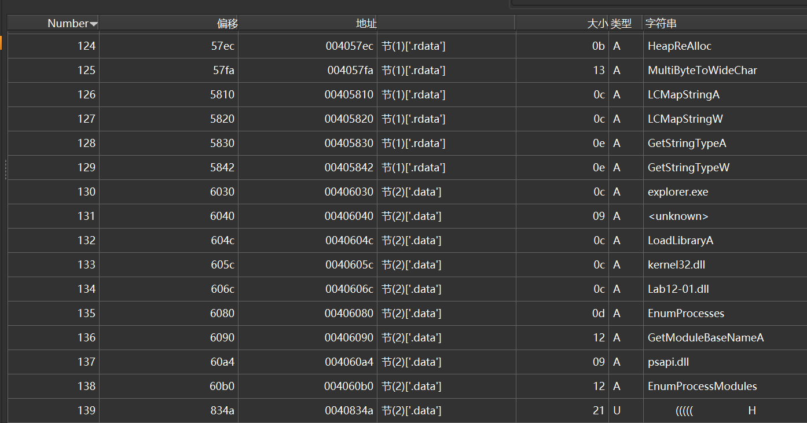

发现一些有趣的字符串：

- **explorer.exe**：表明可能注入到资源管理器进程中。
- **Lab12-01.dll**：与另一个 DLL 文件相关。
- **psapi.dll**：暂时不清楚其用途，可能是伪装的名字。

推测这些是恶意代码的目标文件，暗示 Lab12-01 可能使用 Lab12-01.dll 注入到 Explorer 进程中。

- **Lab12-01.dll**

接下来，我们对 DLL 文件进行了分析，同样使用 `DIE` 工具检查加壳情况：

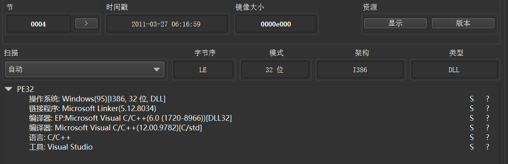

结果显示该文件同样未加壳，由 Visual Studio 编写。

然后，我们查看了其导入表：

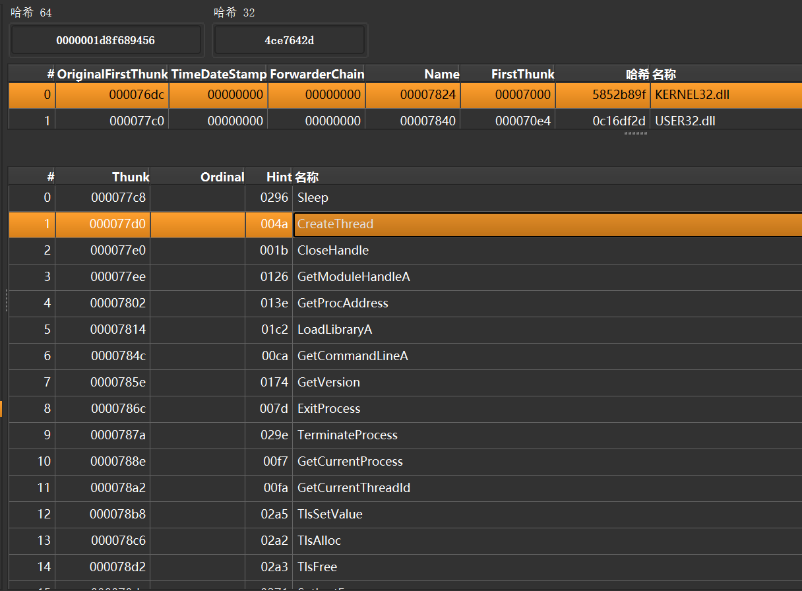

在 **Kernel32.dll** 中，我们发现：

- **CreateThread**：可能用于创建进程。
- **GetVersion**：可能用于判断当前操作系统版本。
- **GetCommandLineA**：可能对命令行进行操作。

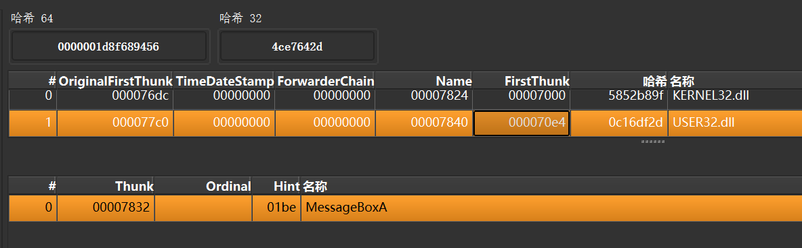

在 **USER32.dll** 中，我们发现 **MessageBoxA**，推测可能用于显示信息，与远程后门行为相关。

最后，我们查看了字符串：

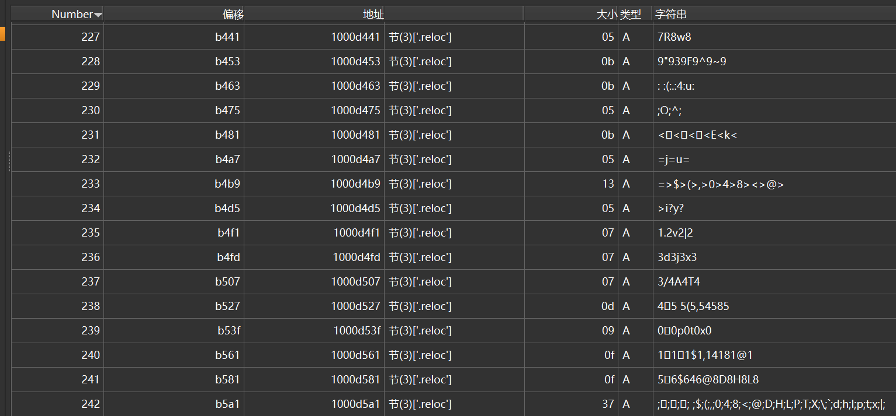

DLL 的字符串列表中出现了一些提示词，目前不清楚其具体用途，可能用于显示某种信息。

同时，我们发现许多时间提示信息和星期几，结合前面的分析，推测 DLL 可能利用远程后门向远程主机发送带有时间信息的消息。

##### （2）综合行为分析

本次实验的核心目标是揭示 Lab12-01.exe 的隐蔽启动行为。为此，我们将结合静态和动态分析技术，重点研究其进程注入行为。

**动态分析步骤**：

1. **设置快照与过滤器：** 

我们首先在 ProcessMonitor 中设置快照，并配置了针对 Lab12-01.exe 的过滤器：

```sql
Process Name is Lab12-01.exe
```

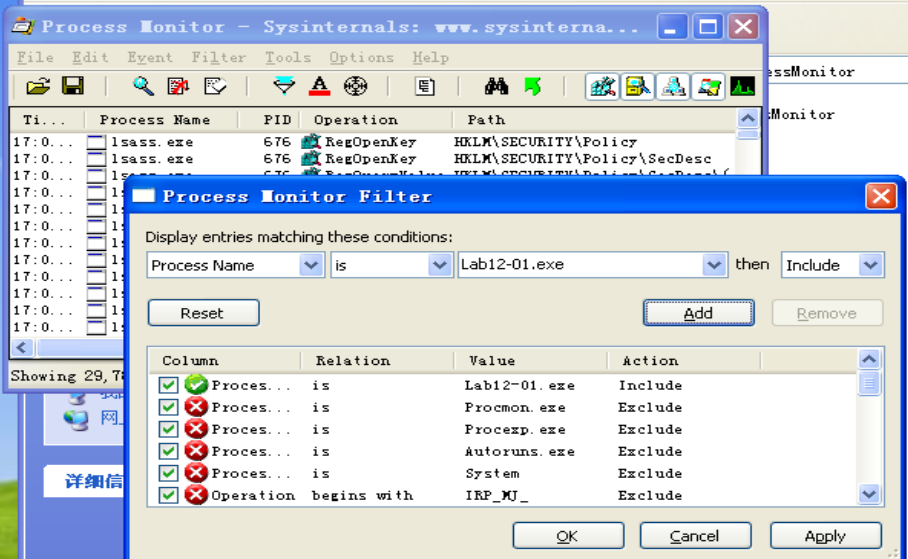

2. **运行 Lab12-01.exe：** 

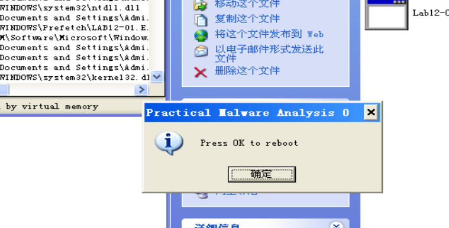

双击运行 Lab12-01.exe 后，观察到程序弹出了一个消息框，提示“Press OK to restart”，标题为“malware analysis0”。该消息框每分钟弹出一次，并且对弹出次数进行了计数。

3. **分析 ProcessMonitor 捕获的行为：** 

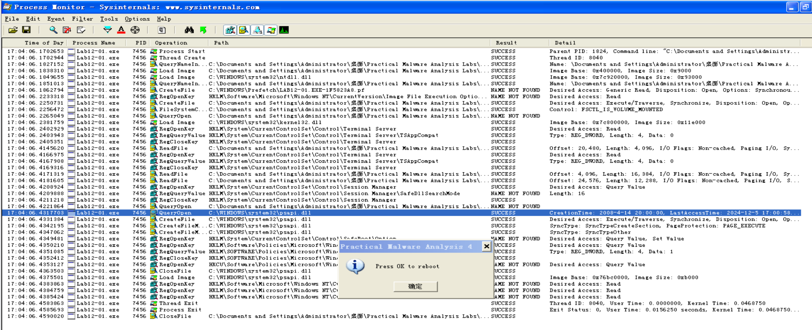

返回 ProcessMonitor，我们捕获到了恶意代码的关键行为。观察到程序对 psapi.dll 进行了操作，并且尝试访问 HKLM\Windows 下的注册表项，同时还有文件创建行为。

4. **使用 Process Explorer 验证：** 

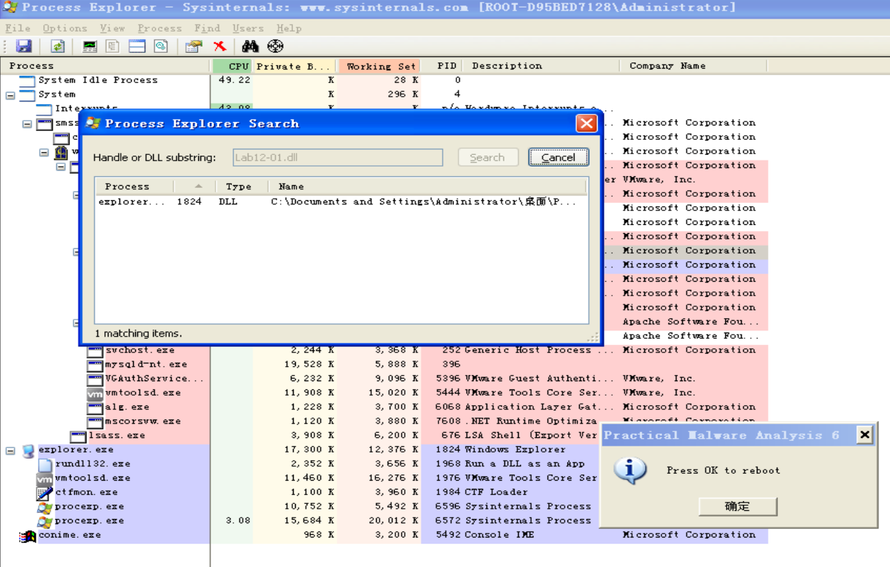

最后，我们使用 Process Explorer 进一步验证。结果显示 Lab12-01.dll 被成功加载到 explorer.exe 进程中，这与我们之前的静态分析推测相吻合，即 Lab12-01 可能利用 Lab12-01.dll 注入到 Explorer 进程中。

**结论：**

通过上述动态分析，我们不仅验证了 Lab12-01.exe 的隐蔽启动行为，还揭示了其进程注入的具体细节。这些发现为进一步深入分析提供了坚实的基础。接下来，我们将恢复快照，准备进行更深入的分析。

##### （3）深入分析

接下来，我们将使用 IDA 进行深入分析。首先分析 exe 文件，进入反汇编界面后查看 main 函数的代码：

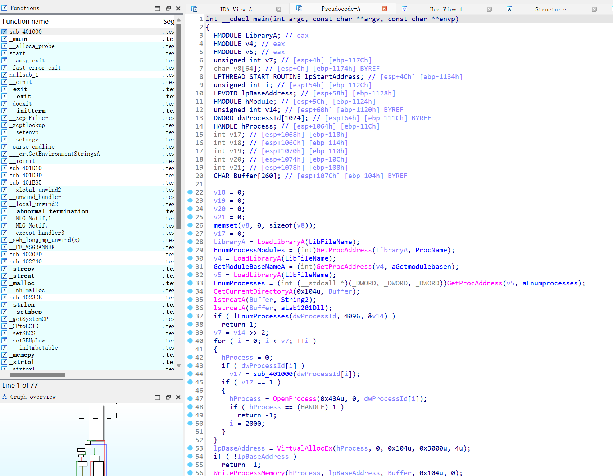

在分析中，我们注意到几个关键点：

1. **动态链接库加载和函数地址获取**：
	- 使用 `LoadLibraryA` 加载指定的动态链接库（LibFileName）。
	- 通过 `GetProcAddress` 从加载的库中获取 `EnumProcessModules`、`GetModuleBaseNameA` 和 `EnumProcesses` 三个特定函数的地址。
2. **获取当前进程目录**：
	- 使用 `GetCurrentDirectoryA` 获取当前进程的工作目录。
	- 使用 `lstrcatA` 将字符串 `String2` 和 `"Lab1201.dll"` 追加到当前目录。
3. **系统进程枚举**：
	- 使用 `EnumProcesses` 获取系统中所有进程的 ID。
	- 对于每个进程 ID，调用 `sub_401000` 函数进行处理。如果处理结果为 1，则表示找到了目标条件的进程 ID。
4. **打开符合条件的进程**：
	- 使用 `OpenProcess` 打开满足条件的进程，获取进程句柄（hProcess）。
5. **在目标进程中分配内存并写入数据**：
	- 使用 `VirtualAllocEx` 在目标进程中分配一块内存。
	- 使用 `WriteProcessMemory` 将获取到的当前进程目录（Buffer）写入目标进程的内存中。
6. **在目标进程中创建远程线程**：
	- 使用 `GetModuleHandleA` 获取目标进程中指定模块的句柄。
	- 使用 `GetProcAddress` 获取指定模块中的函数地址。
	- 使用 `CreateRemoteThread` 在目标进程中创建一个新的线程，并在其中执行指定的函数。
7. **返回结果**：
	- 如果上述操作成功，则返回 0；否则，返回-1 或 1，表示执行过程中的不同错误状态。

从上述代码中可以看出，该病毒通过注入行为，将特定 DLL 加载到目标进程中并执行其中的代码，实现一些恶意行为。

其中我们比较值得注意的是具体对进程进行处理的 `sub_401000`。我们可以进一步查看 `sub_401000` 函数如下：

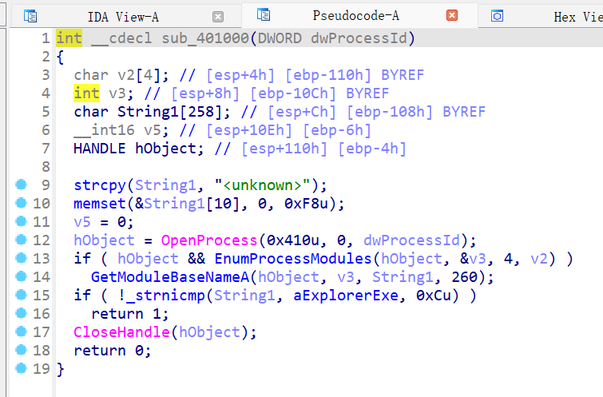

函数 `sub_401000` 是一个检测特定进程名称的函数。它接受一个进程标识符（PID）作为参数，并执行以下操作：

1. **变量初始化**：定义了一个字符串 `String1` 并将其初始化为 ""。`memset` 被用来清零 `String1` 字符串的其余部分，除了初始的 ""。`v5` 是一个两字节大小的变量，被清零。它可能是为了保证结尾，保持字符串的完整性。
2. **打开进程**：`String1` 字符串以空字符 `OpenProcess` 尝试以特定的权限打开给定 PID 的进程。权限 `PROCESS_QUERY_INFORMATION` 和 `0x410` 可能是一个包含 `PROCESS_VM_READ` 的权限集，允许函数查询进程信息并读取其虚拟内存。
3. **枚举进程模块**：如果成功打开进程，`EnumProcessModules` 被用来枚举进程的模块并获取第一个模块的句柄（通常是主执行模块）。`v3` 用于接收模块的句柄。`v2` 可能是用来接收枚举函数所需的字节数。
4. **获取模块基本名称**：`GetModuleBaseNameA` 函数使用得到的模块句柄和进程句柄来获取该模块（进程的可执行文件）的基本名称，并将其存储在 `String1` 中。
5. **比较进程名称**：`_strnicmp` 函数比较 `String1` 中的 `String1` 和 "explorer.exe"，只比较前 12 个字符（"explorer.exe" 的长度）。这是不区分大小写的字符串比较。
6. **结果返回**：如果比较结果表明 `String1` 中存储的名称是 "explorer.exe"，则函数返回 1，表示找到了目标进程。如果名称不匹配，函数关闭之前打开的进程句柄，并返回 0。

综上所述，函数 `sub_401000` 的目的是检查传入的进程 ID 是否是 "explorer.exe"。在主函数中，如果返回 1，则可能触发某种特定的行为，比如在该进程中注入 DLL。

一旦这个点明确了，后面就很清晰明了了，于是回到 main 中：

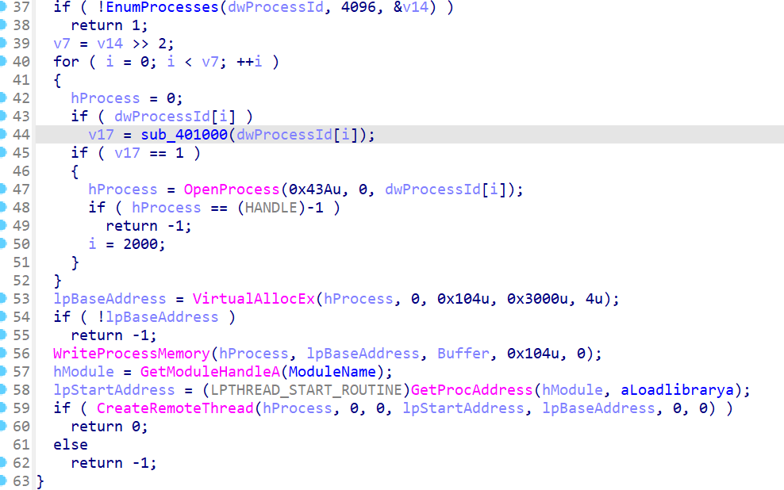

看到一旦 `sub_401000` 检查成功，就会返回到 main 中调用 `OpenProcess` 打开这个进程即 `explorer.exe` 的句柄。最后通过一些恶意操作，通过 `WriteProcessMemory` 将 Buffer 内容写入进程。

因此我们去看 buffer 被设置的地方:

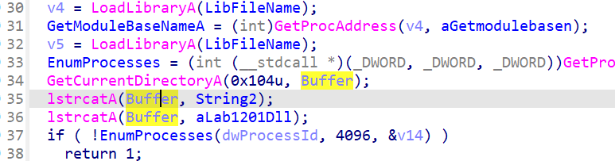

其实之前分析 main 已经分析过了，这里再强调下，它使用 `lstrcatA` 将字符串 `String2` 和 "Lab1201.dll" 追加到当前目录。即将 `Lab12-01` 获取到了 buffer 然后写入了，最后注入了当前进程即 `explorer.exe` 中。

综合以上分析，可以知道 `Lab12-01.exe` 的目的是将 `Lab12-01.dll` 注入到 `explorer.exe` 中。

接下来使用 IDA 分析 `Lab12-01.dll`，看看它有没有别的行为：

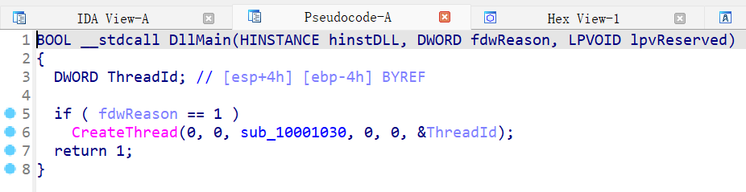

`DllMain` 是 DLL 的主入口点，它在每次加载和卸载 DLL 时被调用，以及在创建和终止线程时。

参数：

- `hinstDLL` 是模块的句柄。
- `fdwReason` 表明了函数被调用的原因。
- `lpvReserved` 是保留参数。

功能：

- 当 `fdwReason` 为 1（表示 `DLL_PROCESS_ATTACH`，即 DLL 被加载）时，`CreateThread` 被调用以创建一个新线程，该线程执行 `sub_10001030` 函数。`
- 函数返回 1，表示 `DllMain` 执行成功。

因此 `DllMain` 只创建了一个新线程，对应执行函数 `sub_10001030`。过去查看：

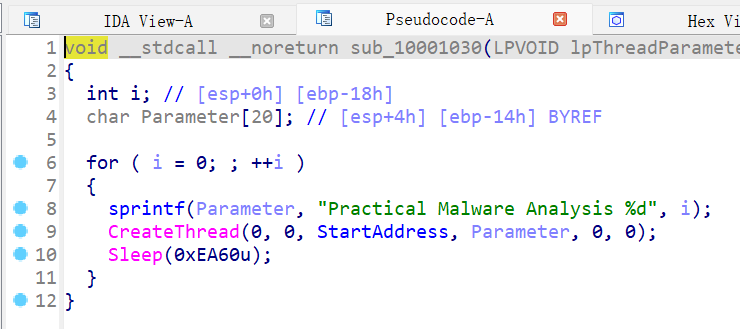

`sub_10001030` 这个函数被设计为无限循环，创建线程并使它们休眠。

功能：

- 初始化一个循环计数器。
- 在无限循环中，使用 `i`。`sprintf` 在 "Malware Analysis %d" 中生成一个字符串，格式为 "Practical Malware Analysis %d"，其中 `Parameter` 中生成的字符串被每次循环中 `i` 的当前值替换。
- `CreateThread` 创建一个新线程，该线程的入口是 `Parameter` 参数。
- 然后该函数调用 `StartAddress` 函数，`Sleep` 60 秒，这个调用将暂停当前线程的执行。

接着查看 StartAddress 函数:

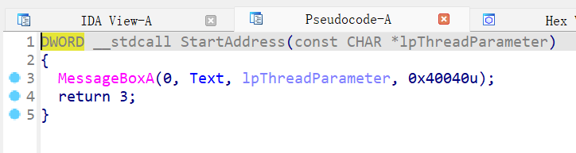

这个函数弹出一个消息框，并且返回一个值。

功能：

- 当线程开始时，`MessageBoxA` 被调用，显示一条消息 "Press OK to reboot" 和 `lpThreadParameter` 的内容，后者是传入的参数，包含了 "Practical Malware Analysis %d" 字符串和循环计数器的值。
- 函数返回数字 3，虽然这个返回值在这里并没有被使用。

因此这个 DLL 将格式化字符串 "Practical Malware Analysis" 和当前迭代计数 `i` 写入消息框的标题，"Press OK to reboot" 是消息框的内容。最后使用 `Sleep` 函数让当前线程休眠 0xEA60 毫秒（1 分钟）。

综上所述这个 DLL 实现了每分钟弹一次窗口的功能。因此它就是频繁地无休止打开一个消息框烦人而已。

##### （4）问题解答

> Q1. 在你运行恶意代码可执行文件时，会发生什么？

运行这个恶意代码之后，它会弹出一个标题为 "Practical Malware Analysis"，内容为 "Press OK to reboot" 的消息框，并且每一分钟出现一次，无穷无尽。


> Q2. 哪个进程会被注入？

被注入的进程是 `explorer.exe`。


> Q3. 你如何能够让恶意代码停止弹出窗口？

可以重新启动 `explorer.exe` 进程，重启电脑也行。

另外，通过在 ProcessMonitor 中查看，我们发现了注入的 `Lab12-01.dll` 在 `Explorer.exe` 中，因此先 kill 再 reboot 该进程亦可。

> Q4. 这个恶意代码样本是如何工作的？

这个恶意代码执行 DLL 注入，来在 `explorer.exe` 中启动 `Lab12-01.dll`。一旦 `Lab12-01.dll` 被注入，它在屏幕上每分钟显示一个消息框，并通过一个计数器，来显示已经过去了多少分钟。

#### 2. Lab12-2

**分析在 Lab12-02.exe 文件中找到的恶意代码**。

##### （1）初步静态分析

首先，我们对 exe 文件进行了初步分析，使用 `DIE` 工具检查其加壳情况：

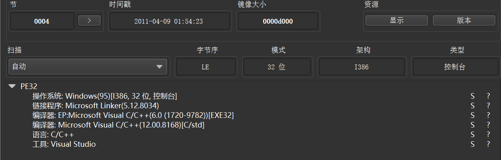

结果表明该文件未加壳，且由 Visual Studio 编写。

接下来，我们查看了其导入表：

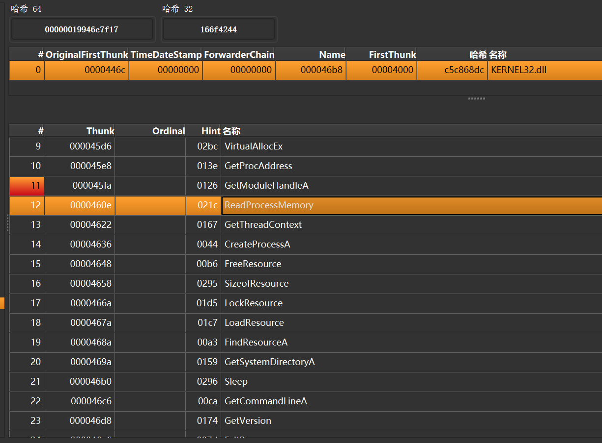

在导入表中，我们发现了许多关键函数：

- **ReadProcessMemory** 和 **WriteProcessMemory**：用于读取或写入其他进程的内存数据，表明可能对进程的内存空间进行了直接修改和读写。
- **GetThreadContext** 和 **SetThreadContext**：用于获取或设置线程的上下文信息，包括寄存器状态、指令指针和堆栈指针等。这些函数可以用于监视和控制线程的执行。
- **CreateProcessA**：用于创建一个新的进程，并返回该进程的句柄和标识符。此函数可能用于启动一个新的程序。
- **LockResource**、**LoadResource**、**SizeofResource**：用于管理和操作进程中的资源，暗示 exe 文件中包含的重要资源可能是核心组件。

我们还注意到导入表中的 **LoadResource** 和 **FindResourceA**，推测资源节可能包含恶意代码利用的数据。

另外 **SetThreadContext**、**GetThreadContext**、**CreateProcessA**，这些暗示恶意代码可能创建了新的进程并修改了进程的上下文。

然后，我们查看了其字符串：


发现了一系列以 "wqsyLkla" 开头的字符串，以及大量连续的 "A"，这些可能与某种解密或混淆技术有关。

此外，我们还注意到 exe 文件具有一个资源节文件，并且在导入函数中尝试对其进行操作，证明资源节肯定是核心部分之一。

查看资源节：

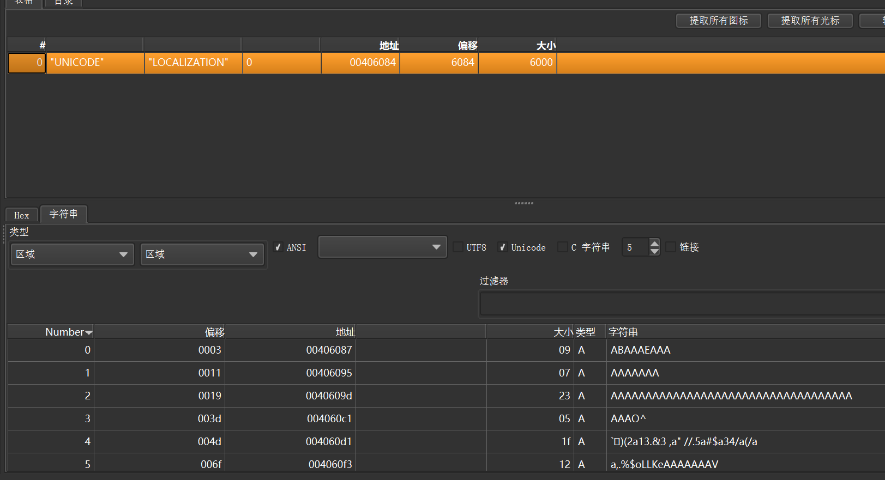

资源节的类型为 UNICODE，名字为 LOCALIZATION，内容似乎被加密过。可以看到一个名为 "UNICODE LOCALIZATION: 0" 的资源节，其内容中包含了之前分析字符串时发现的大量 0，仍然保持混淆状态。

综上所述，初步静态分析揭示了该 exe 文件可能利用资源节中的加密数据进行恶意操作，并通过一系列系统函数对进程和线程进行控制和修改。

##### （2）综合行为分析

然后先打开 `Process Explorer` 软件监视、打开 `Process Monitor` 清除所有事件再开启捕捉，最后运行 Lab03-03.exe，观察 Process Explorer：

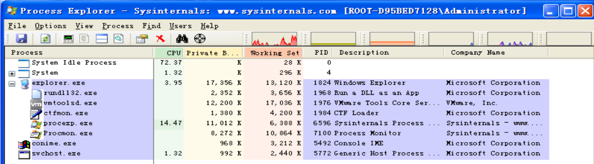

可以看到，该文件除创建自己的进程外，还创建了一个子进程 `svchost.exe`，而 Lab03-03.exe 则自行退出，仅剩子进程独立运行。而正常情况下，`svchost.exe` 应当是 services.exe 的子进程，这一点很可疑。

下面对该进程进行进一步分析。右键选择 Properties-> Strings，查看磁盘与内存中的字符串：


发现两者差别很大，内存中多出了 `practicalmalwareanalysis.log` 和 `[SHIFT]、[ENTER]、[BACKSPACE]` 等不字符串，而这些字符串通常不应该在 `svchost.exe` 中出现。基于以上字符，可以判断恶意代码篡改了内存，并且可以推测应该是一个敲击键盘的记录器。

由上述分析，该恶意代码 **创建了一个 `practicalmalwareanalysis.log` 日志文件**，`[SHIFT]、[ENTER]、[BACKSPACE]` 等是键盘按键事件，实现了一个键盘记录器的窃听效果，此文件可以作为感染迹象特征。

在 `Process Explorer` 中可知 `svchost.exe` 的 PID 为 5772，我们使用 `Process Monitor` 工具来探测，添加如下几个过滤器：

```assembly
PID is 5772
```

建立一个记事本，使用键盘键入几个字符，观察 `Process Monitor`，可以看到多了许多 `CreateFile` 和 `WriteFile` 操作。


同时也可以看到文件创建的路径是 Lab03-03.exe 所在路径，按照该路径去打开，可以看到 `practicalmalwareanalysis.log` 文件。打开该日志文件，可以看到刚才写在记事本中的内容，可以发现果然是击键的记录。

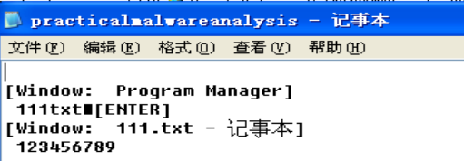

综上所述，**这个程序在 `svchost.exe` 进程上执行了进程替换，来启动一个击键记录器。**

##### （3）深入分析

接下来，我们使用 IDA 对程序进行深入分析，重点关注 `main` 函数：

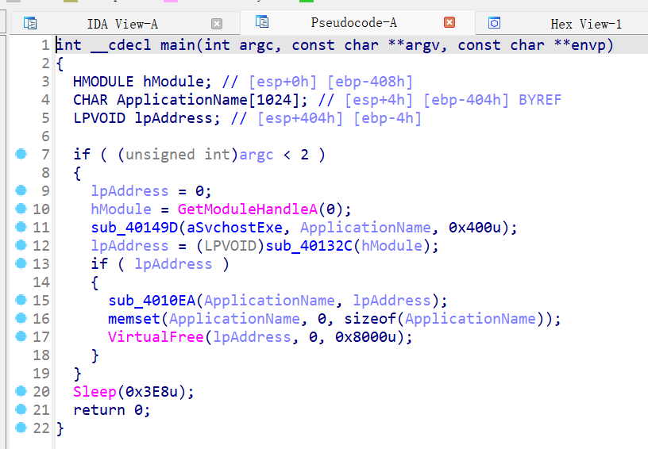

分析步骤如下：

1. **参数检查**：

	程序首先检查传递给 `main` 函数的参数数量（`argc`）。如果参数数量少于 2，则继续执行后续代码；如果参数数量大于或等于 2，则程序不执行任何操作并直接进入休眠状态。

2. **环境准备**：

	函数使用 `GetModuleHandleA` 获取当前执行模块（程序自身）的句柄。由于调用时没有提供模块名，它将返回调用程序的模块句柄。

3. **文件名处理**：

	函数调用 `sub_40149D`，该函数似乎用于构建或修改传入的路径 `\svchost.exe`，并将结果存储在 `ApplicationName` 中。`ApplicationName` 预先分配了 1024 字节的空间，足以存储任何修改后的路径或文件名。

4. **资源提取**：

	之后，调用 `sub_40132C`，可能从当前模块中提取资源并将其放在新分配的内存中。这个内存地址被存储在 `lpAddress` 中。

5. **进程操作**：

	如果 `lpAddress` 非空，即资源提取成功，调用 `sub_4010EA`，传入 `ApplicationName` 和 `lpAddress`。`sub_4010EA` 可能执行的是代码注入，或者修改另一个进程的内存空间，其中 `ApplicationName` 是目标进程名，`lpAddress` 是注入的代码或数据。

6. **清理操作**：

	完成上述操作后，使用 `memset` 清除 `ApplicationName` 中的数据，可能是出于安全考虑，以避免敏感信息（如可能的恶意文件路径）留在内存中。`VirtualFree` 用于释放之前分配给 `lpAddress` 的内存，`0x8000u` 参数指示释放操作。

7. **程序结束**：

	最后，调用 `Sleep` 使程序休眠一段时间（1000 毫秒），然后程序正常退出并返回 0。

我们查看 `sub_4010EA`，这个函数调用了多个函数，如 `CreateProcessA`：

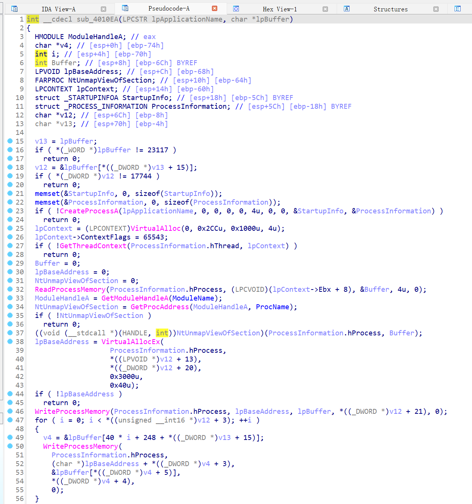

`sub_4010EA` 函数似乎执行了一个进程替换或进程注入的操作。这通常是恶意软件用来注入其代码到另一个进程的内存空间中，并在目标进程的上下文中执行该代码的技术。仔细分析代码：

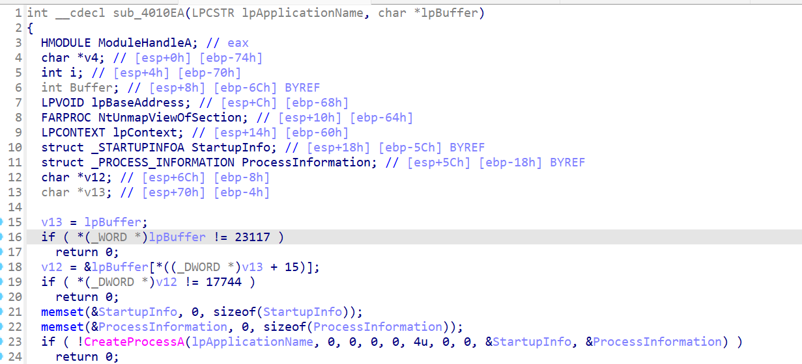

- 验证 PE 文件签名：函数检查传入的缓冲区 `lpBuffer` 指向的内容是否以 0x5A4D 开头，这是 PE（Portable Executable）文件头的标准开始，对应于 "MZ"（Mark Zbikowski 的签名，DOS 执行文件的标准头）。接着，函数跳转到 PE 头，检查 PE 头的签名是否为 0x4550，即 "PE\0\0"。

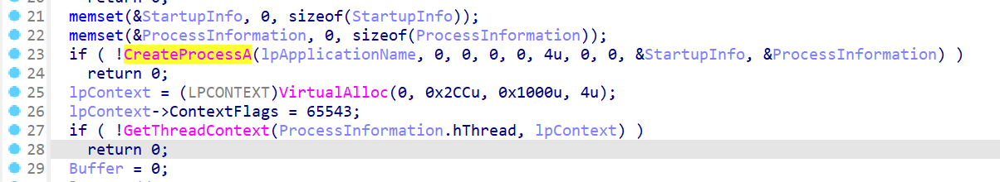

- 创建新的进程：使用 `CreateProcessA` 创建一个新的进程，但在创建后不立即开始执行（`CREATE_SUSPENDED` 标志设置为 4u）。

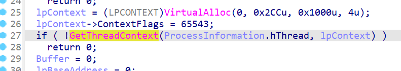

- 获取目标进程上下文：分配内存并设置一个 `CONTEXT` 结构，然后使用 `GetThreadContext` 获取新创建的进程的主线程的上下文（寄存器状态等）。

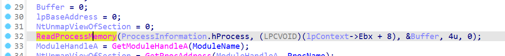

- 读取目标进程的镜像基址：通过 `ReadProcessMemory` 读取目标进程的镜像基址（从 `EBX` 寄存器加上 8 个字节的位置）。

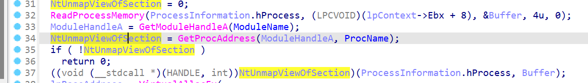

- 卸载目标进程的镜像：获取 `NtUnmapViewOfSection` 函数的地址，并调用它来卸载目标进程的镜像，为新镜像的注入做准备。

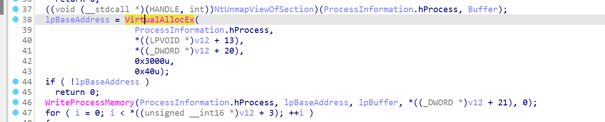

- 在目标进程中分配内存：使用 `VirtualAllocEx` 在目标进程的内存空间中分配内存，准备将恶意代码注入。

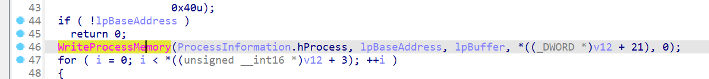

- 写入 PE 头：使用 `WriteProcessMemory` 将原始的 PE 头写入到新分配的内存中。

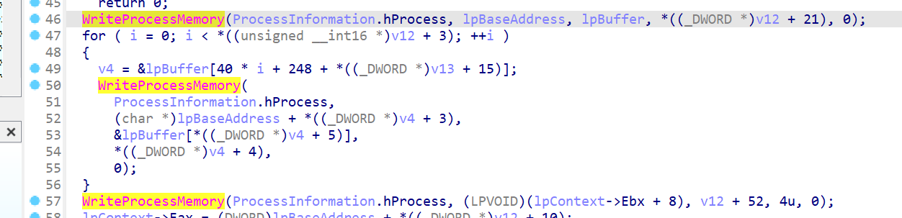

- 写入 PE 文件的各个部分：遍历 PE 文件的每个部分，将其写入到新进程的内存空间中。这是通过读取 PE 文件部分头中的信息，并按部分头指定的目标地址和大小进行。

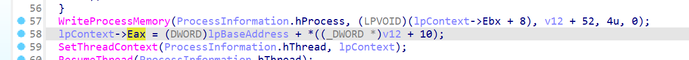

- 修正目标进程的入口点：更新目标进程的 `EAX` 寄存器，设置为新的入口点。

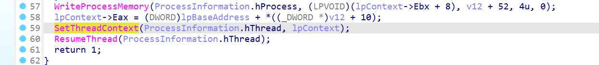

- 设置目标进程的上下文并恢复线程：通过 `SetThreadContext` 设置新的进程上下文，然后 `ResumeThread` 来启动目标进程的主线程。

接下来查看 `main` 函数调用的另一个函数 `sub_40132C`：

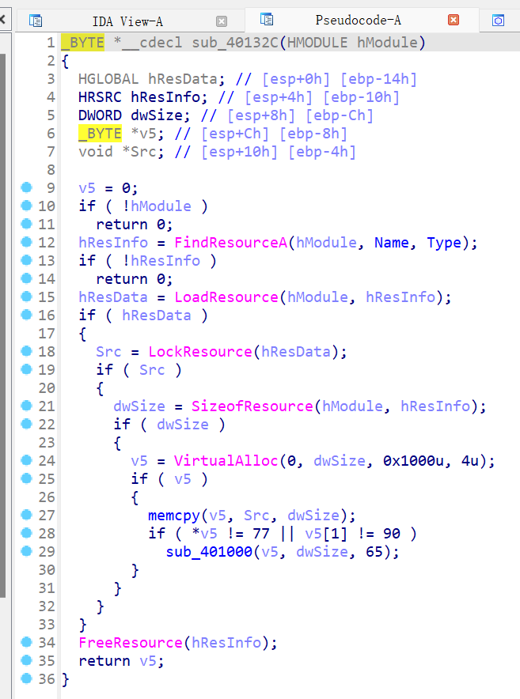

这个函数的流程如下：

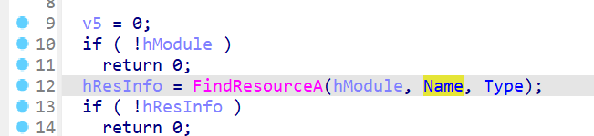

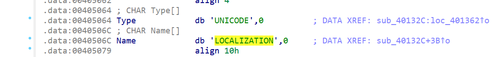

- 资源定位与验证：`sub_40132C` 开始于检查传入的模块句柄 `hModule`。如果句柄有效，它会尝试查找模块内部的资源，特别是一个类型为 "UNICODE"，名为 "LOCALIZATION" 的资源。这通常意味着函数正在尝试访问嵌入在模块内的特定数据，可能是本地化内容或配置数据。如果这些资源存在，它会继续流程；如果资源未找到，函数将返回 0。

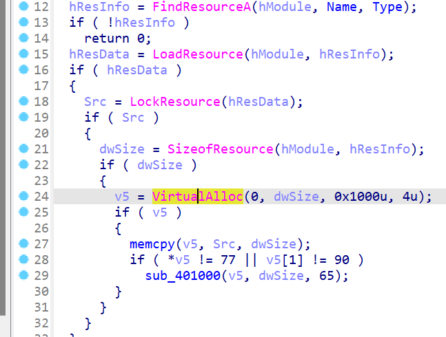

- 资源加载与内存分配：如果资源被找到，函数会加载这个资源并锁定它，以便可以对其进行操作。然后，函数会查询资源的大小并尝试在进程的虚拟地址空间中分配足够的内存来存放资源内容。这是通过 `VirtualAlloc` 函数完成的，该函数为资源数据提供了一个新的内存位置。

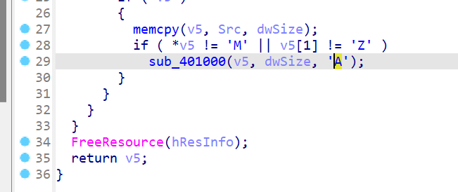

- 资源复制与可选处理：一旦内存分配成功，函数使用 `memcpy` 将资源数据从其原始位置复制到新分配的内存中。复制后，函数会检查新内存位置的前两个字节以确定它是否是一个有效的 PE 文件头（以 "MZ" 开头）。如果不是，函数会调用 `sub_401000` 来对整个数据进行变换。

其中调用了 `sub_401000` 函数，我们查看它的代码：

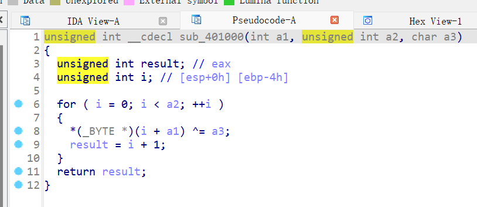

`sub_401000` 函数执行一个简单的循环，对从地址 `a1` 开始的 `a2` 个字节进行异或（XOR）操作，使用 `a3` 作为密钥。这是一种常见的数据编码或解码操作，可能用于简单的数据隐藏或加密。在 `sub_40132C` 函数中，如果资源数据的头两个字节不是 "MZ"，则此函数会被用来修改整个资源数据块。回顾传递给 `sub_401000` 的第三个参数 0x41 可以发现异或的密钥就是 65！也就是'A'！我们直接把它标记成'A'。

为了对资源节的文件进行异或解码，我们首先使用 ResourceHacker 提取资源节文件：

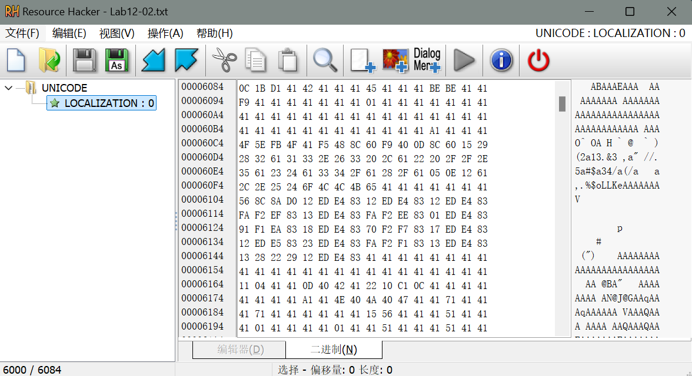

然后使用 010 Editor 软件将从资源节中提取出的 exe 文件拖入，工具-> 十六进制运算-> 二进制异或：

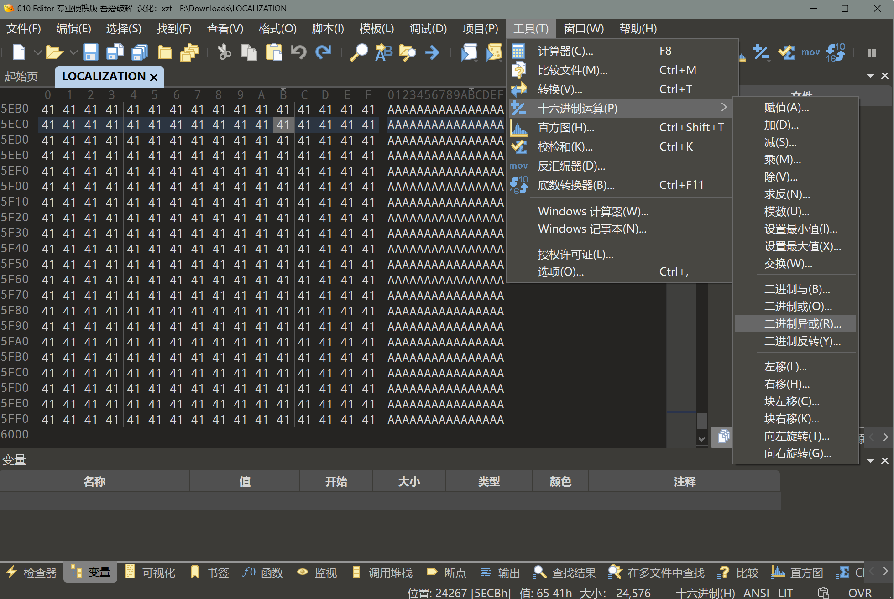

通过之前 IDA 的代码分析，可以知道数据应该是无符号字节，操作数为 41，进制为十六进制，异或范围为整个文件，字节序为小端字节序，如下所示：

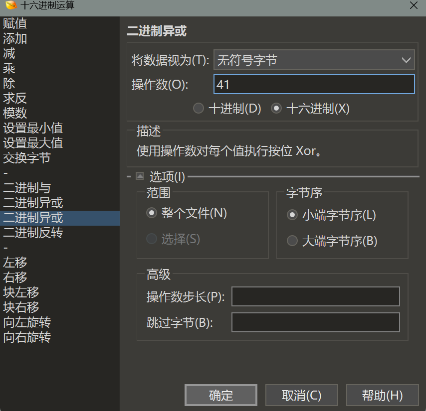

点击确定就可以解析出原有文本了，如下图所示：


可以看到有 "MZ"，"PE" 等文件标志。解密结果是一个可执行程序。也就是替换 svchost 的 exe。

综合以上分析，可以得出结论：这个恶意代码从资源节提取出一段加密后的二进制文件，然后进行解密，在解密后针对 svchost.exe，使用解码后的二进制文件进行替换，达到进程替换的效果。

##### （4）问题解答

> Q1. 这个程序的目的是什么？


这个程序的目的是秘密地启动另一个程序（键盘记录器），会把在某个窗口下按键的内容记录在 exe 目录下的 `practicalmalwareanalysis.log` 里。

> Q2. 启动器恶意代码是如何隐蔽执行的？

这个程序使用进程替换来秘密执行，程序 exe 是个启动器，负责启动 svchost.exe，然后修改其内存为资源文件的内容，创建傀儡进程来隐蔽执行，资源中的 PE 文件才是真正功能模块。

> Q3. 恶意代码的负载存储在哪里？

这个恶意的有效载荷(payload)被保存在这个程序的资源节中。这个资源节的类型是 UNICODE，且名字是 LOCALIZATION，加密存储在资源里。


> Q4. 恶意负载是如何被保护的？

保存在这个程序资源节中的恶意有效载荷是经过 XOR 编码过的。这个解码例程可以在 `sub_40132C` 处找到，而 XOR 字节在 0x0040141B 处可以找到，通过加密存储来进行保护。


> Q5. 字符串列表是如何被保护的？

这些字符串是使用在 `sub_401000` 处的函数，来进行 XOR 编码的，通过异或进行保护。

#### 3. Lab12-3

**分析在 Lab12-2 实验过程中抽取出的恶意代码样本，或者使用 Lab12-03.exe 文件**。

##### （1）初步静态分析

针对 Lab12-03.exe 文件，我们首先使用 `DIE` 工具分析其加壳情况：

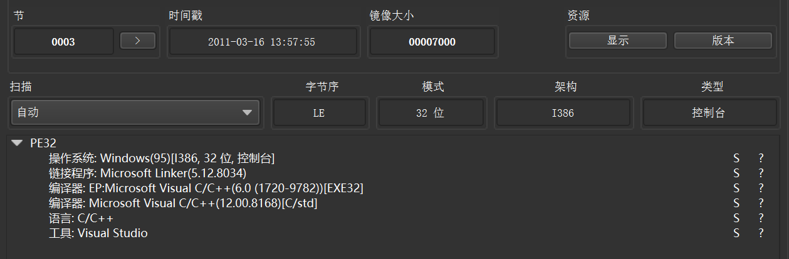

分析结果显示该病毒未经过加壳处理，且由 Visual Studio 编写。

随后，我们查看了其导入表：

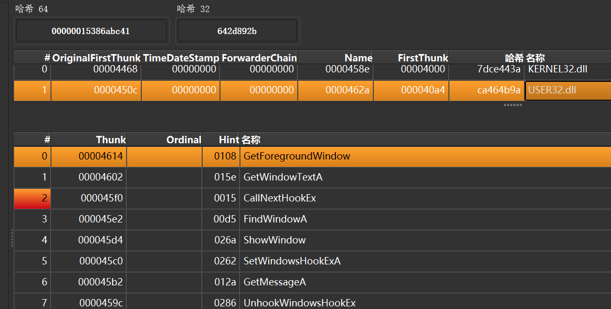

在导入表中，我们注意到一些关键的导入函数：

- **SetWindowsHookExA**：用于安装一个钩子过程，以便对系统事件进行监视和拦截，暗示其可能具有注入病毒行为。
- **FindWindow**：用于在窗口类名或窗口标题名指定的条件下查找顶层窗口。
- **CallNextHookEx**：用于在钩子过程中调用下一个钩子或默认过程，确保系统事件得到正确处理，常与设置钩子配合使用。
- **GetForegroundWindow**：用于获取当前具有焦点的窗口的句柄。

这些与 Hook 相关的函数表明，病毒的注入启动行为很可能是通过钩子实现的。

接下来，我们分析了字符串：

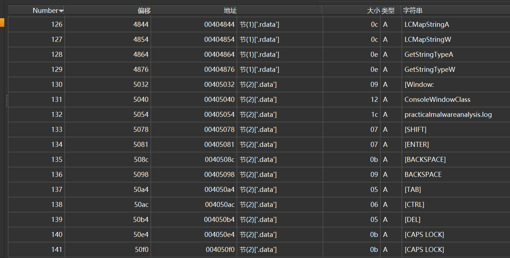

病毒包含一些重要的字符串：

- **practicalmalwareanalysis.log**：可能用于记录日志。
- **BACKSPACE, SHIFT, ENTER** 等：暗示病毒可能是一个键盘记录器。

这个文件在 Lab3 中我们曾经遇到过，已被识别为一个键盘记录器，用于记录用户的输入。

##### （2）综合行为分析

鉴于这个 EXE 文件是上一个文件的子程序，我们无需进行动态分析，可以直接进行深入分析。

##### （3）深入分析

接下来，我们使用 IDA 对 Lab12-03.exe 进行深入分析，直接查看 `main` 函数：

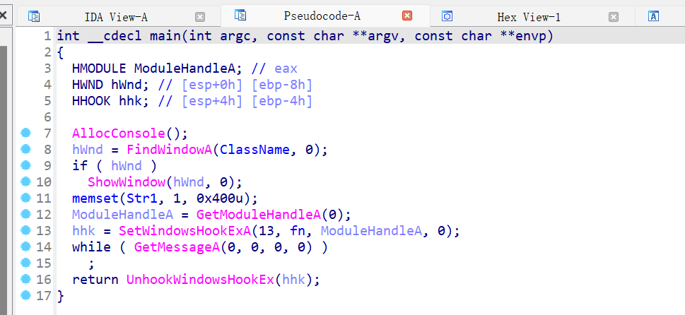

分析结果如下：

- **分配控制台窗口**：使用 `AllocConsole` 函数分配控制台窗口，用于输出调试信息。
- **隐藏窗口**：使用 `FindWindowA` 函数查找窗口（通过 `ClassName` 指定），获取窗口句柄。若找到窗口，使用 `ShowWindow` 函数将窗口隐藏（参数为 0）。
- **初始化字节数组**：使用 `memset` 函数将名为 `byte_405350` 的字节数组的前 0x400 个字节全部置为 1。
- **设置 Windows 钩子**：使用 `GetModuleHandleA` 获取当前模块的句柄，然后使用 `SetWindowsHookExA` 函数设置全局的 Windows 钩子，类型为 13（`WH_KEYBOARD_LL`）。钩子过程为 `fn` 函数，目的是启动键盘事件监控，实施恶意行为，并通过 `fn` 函数来接受击键记录。
- **消息循环**：使用 `GetMessageA` 函数不断获取消息，直到获取到退出消息（参数都为 0）。这是因为 Windows 不会将消息发送到程序进程的钩子函数中，所以需要一直调用 `GetMessageA`。
- **卸载 Windows 钩子**：使用 `UnhookWindowsHookEx` 函数卸载先前设置的 Windows 钩子（`hhk`）。
- **返回**：退出程序，返回消息循环结束后的结果。

由此可知，恶意行为主要集中在 `fn` 函数中，该函数负责截获键盘事件并进行处理。接下来查看：

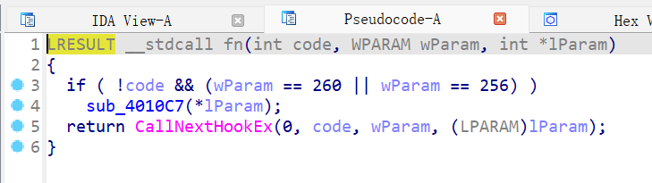

分析如下：

- **检查按键消息**：使用条件判断确保消息是键盘按键消息（`code` 为 0）且按键为 `CAPS LOCK`（`wParam == 260`）或 `SHIFT`（`wParam == 256`）。若条件成立，调用 `sub_4010C7` 函数，传递 `lParam->vkCode` 作为参数。
- **调用下一个钩子过程**：使用 `CallNextHookEx` 函数调用下一个钩子过程，传递相同的参数（0, `code`, `wParam`, (`LPARAM`)`lParam`）。返回下一个钩子过程的返回值。

主函数实现了分配控制台窗口、隐藏窗口、设置键盘钩子，并在消息循环中持续运行。钩子过程（`fn`）检测 `CAPS LOCK` 和 `SHIFT` 按键消息，若满足条件则调用 `sub_4010C7` 函数，然后继续传递消息给下一个钩子。

接下来查看 `sub_4010C7` 函数：

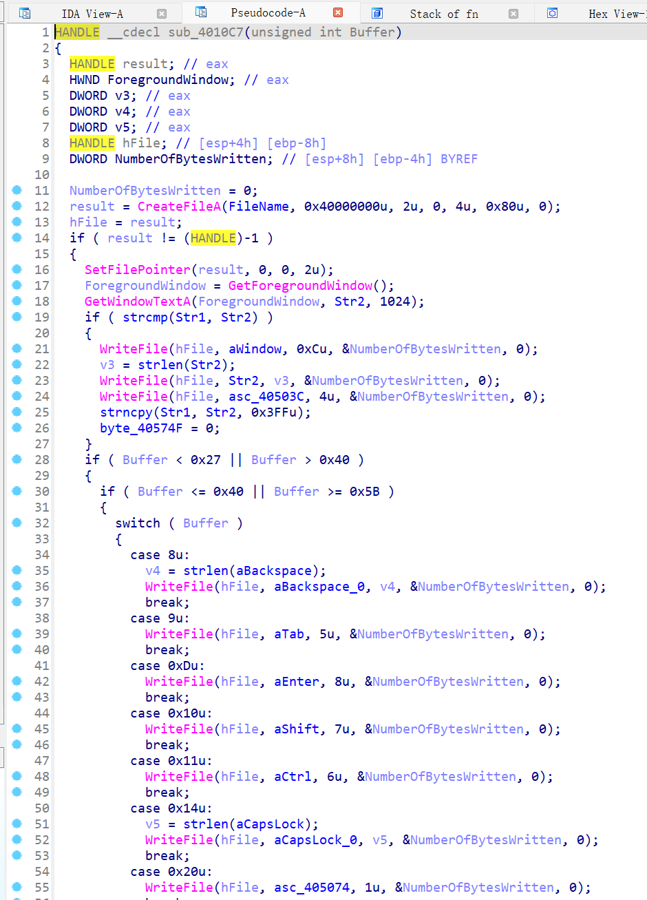

该函数可以分为两部分，其中第一部分：

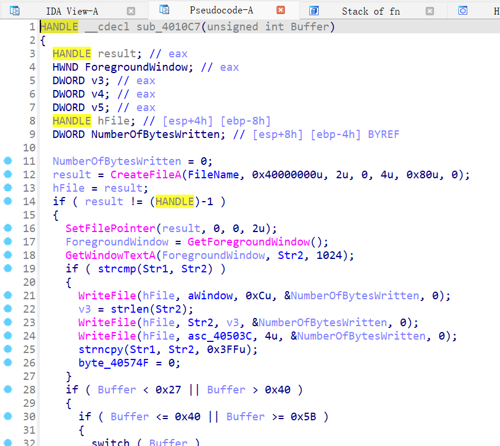

仔细查看分析代码后，可以得出以下结果：

1. **日志文件创建与打开**：
	
	函数首先尝试创建或打开名为 `practicalmalwareanalysis.log` 的文件，用于记录键盘活动。如果文件成功打开，函数将文件指针移动到文件末尾，准备追加新的日志内容。
2. **获取当前窗口标题**：
	
	使用 `GetForegroundWindow` 获取当前活跃窗口句柄，并使用 `GetWindowTextA` 获取该窗口的标题。这通常用于确定键盘输入发生的上下文。
3. **窗口标题变更检查与记录**：
	
	函数检查当前活跃窗口的标题是否与之前记录的窗口标题（存储在 `Str1`）不同。如果不同，它会在日志文件中记录新的窗口标题，并更新 `Str1` 为当前窗口标题。

这些操作的目的是帮助程序提供按键来源的上下文。接下来是第二部分：

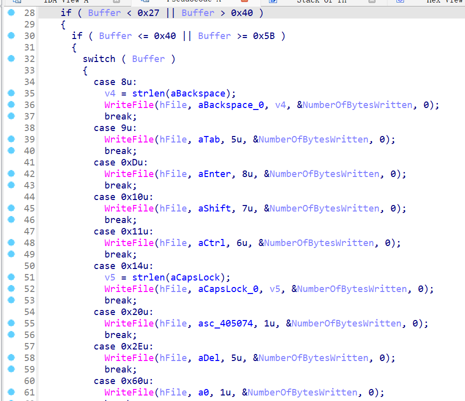

可以看到是关于条件语句和键盘输入处理：

- 若满足特定条件，进入条件分支。
- 根据 `Buffer` 的值进行多个条件判断和相应的处理，包括特殊键处理，如空格、Shift、Enter、Backspace、Tab、Ctrl、Delete 等。
- 处理数字键和 CapsLock 键，将键值映射为相应字符。
- 若不满足以上条件，直接将 `Buffer` 的值写入文件。
- 使用 `CloseHandle` 关闭文件句柄 `hFile`。

这个函数的主要目的是记录用户在不同窗口下的键盘活动，并将其保存到一个日志文件中。这种行为典型地指向键盘记录器（Keylogger），一种常见的监控或恶意软件技术，用于秘密记录用户的键盘输入。

由此我们可以轻松得出结论：该恶意代码通过 `SetWindowsHookEx` 这个钩子实现了一个击键记录器，将击键记录写入到 `practicalmalwareanalysis.log` 中。

##### （4）问题解答

> Q1. 这个恶意负载的目的是什么？

这个程序是一个击键记录器，设置键盘钩子，监听键盘输入事件。它记录用户敲击键盘的内容和按键。

> Q2. 恶意负载是如何注入自身的？

这个程序使用挂钩注入，通过 `SetWindowsHookEx` 函数设置全局消息钩子来注入自身，偷取击键记录。


> Q3. 这个程序还创建了哪些其他文件？

恶意代码创建了 `practicalmalwareanalysis.log`，来记录用户的击键输入。

#### 4. Lab12-4

**分析在 Lab12-04.exe 文件中找到的恶意代码。**

##### （1）初步静态分析

同理，先使用 `DIE` 查看加壳情况：

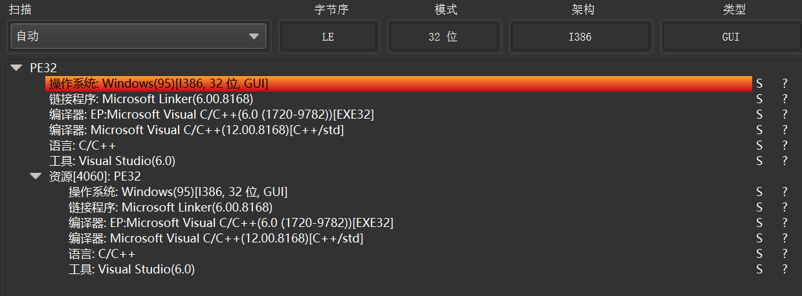

结果显示该文件未加壳，且由 Visual Studio 6.0 编写。

接下来，我们查看了其导入表：

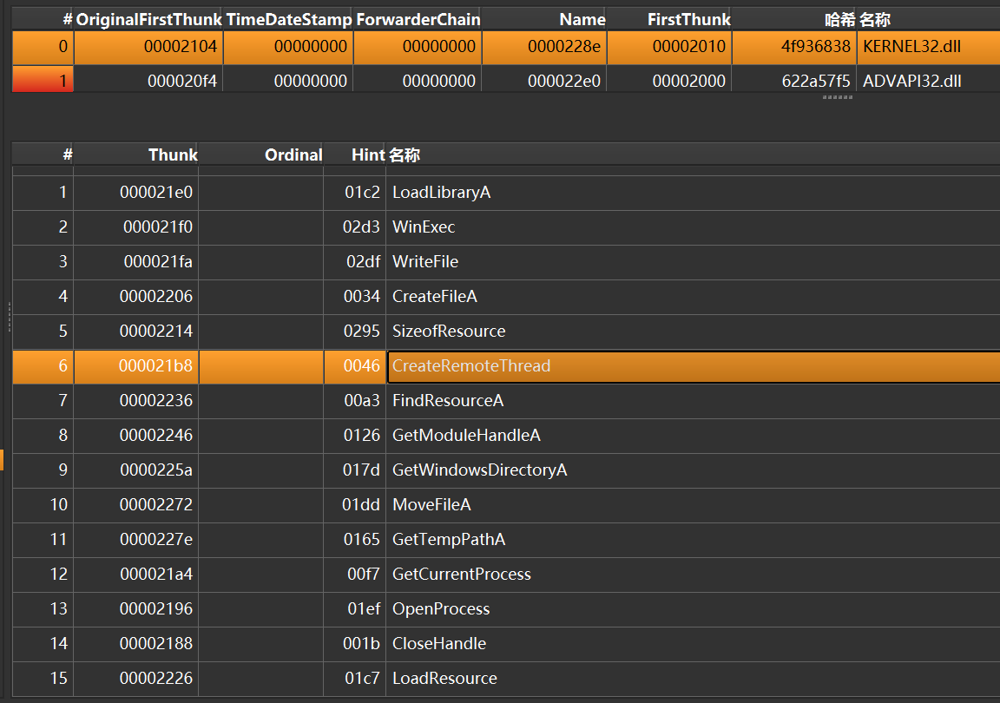

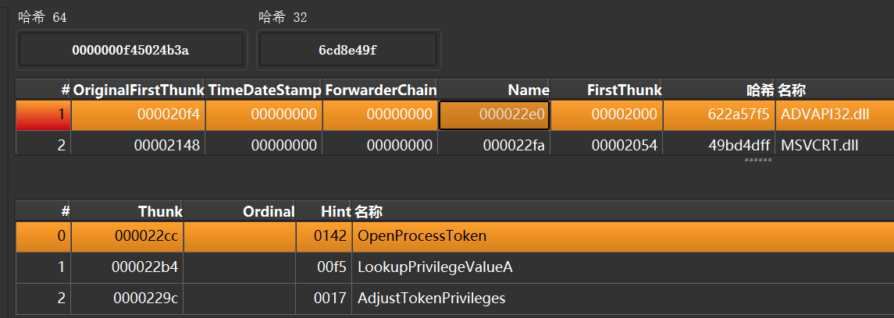

在导入表中，我们发现了几个关键函数：

- **CreateRemoteThread**：用于创建远程线程，但没有伴随 `WriteProcessMemory` 或 `VirtualAllocEx`，表明可能不涉及内存写入操作。
- **FindResource**、**LoadResource**：表明文件包含资源节，这可能是程序的核心部分。
- **GetTempPathA**、**OpenProcessToken**、**GetCurrentProcess**：涉及当前进程和文件路径的操作。
- **LookupPrivilegeValueA**、**AdjustTokenPrivileges**：推测与权限操作有关。

然后，我们分析了字符串：

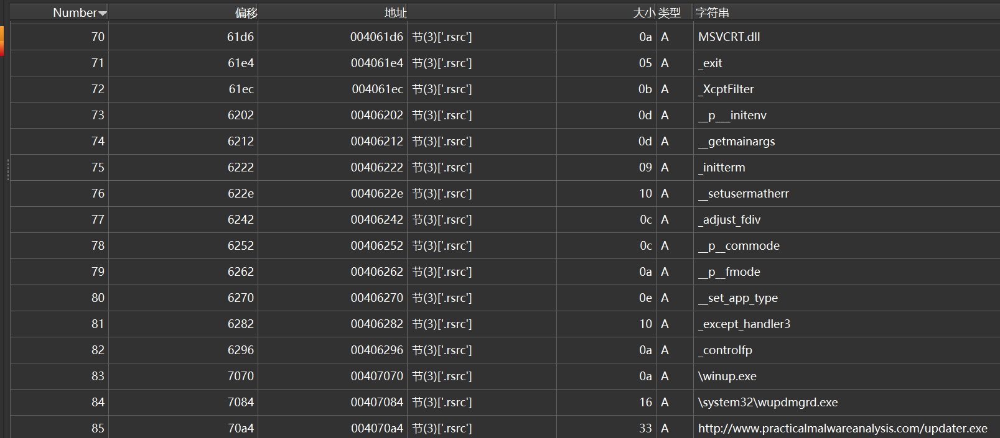

发现了一些关键字符串，如 `wupddmgrd.exe` 和通过 http 访问的 `updater.exe`，推测程序可能尝试从网址下载文件。

同时，我们还看到了与注册表相关的字符串，以及 `winlogon.exe` 等进程名称。

最后，我们查看了资源节信息：

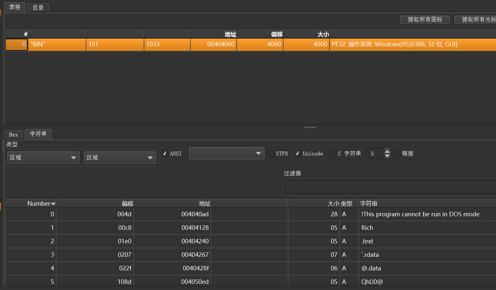

发现了一个名为 `BIN` 的资源段，根据字符串提示，可以看到 `MZ`、`PE` 等信息，表明它是一个二进制程序。目前尚不清楚这个文件的具体作用，但根据其格式，它可能是一个嵌入的可执行文件或脚本，用于后续的执行或下载操作。

##### （2）综合行为分析

我们首先启动 Procmon.exe，并设置过滤器以监控名为 Lab12-04.exe 的进程：

```sql
Process Name is Lab12-04.exe
```

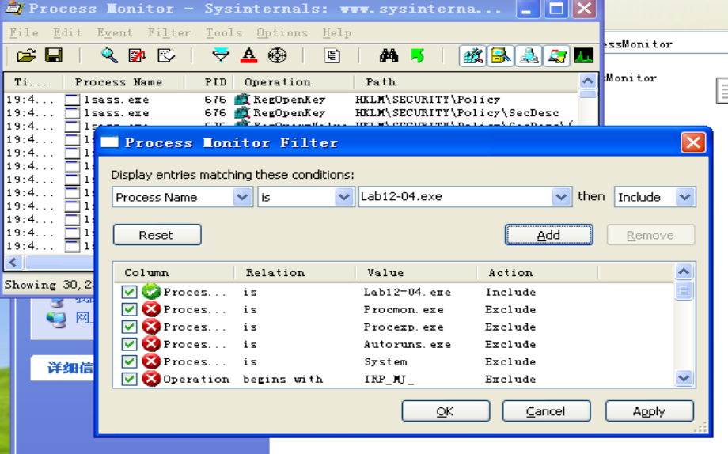

运行 Lab12-04.exe 后，我们观察到以下行为：

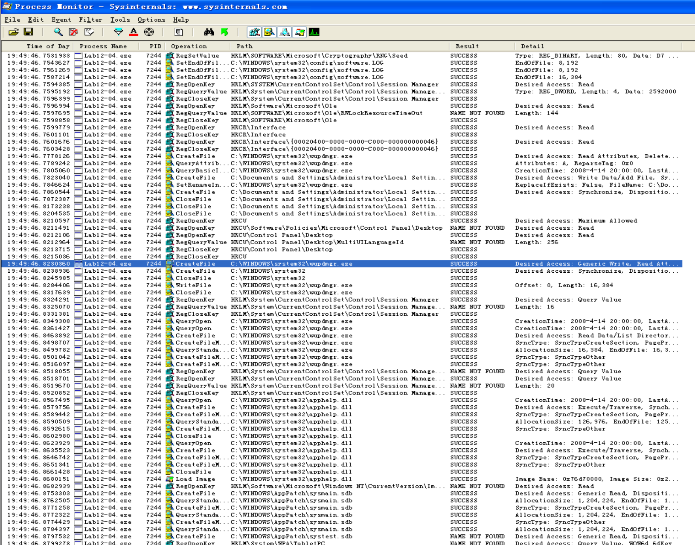

分析结果显示，恶意代码试图通过 `CreateFileA` 在 `%TEMP%` 目录下创建 `winup.exe`，并覆盖了位于 `%SystemRoot%\System32\` 目录下的 `wupdmgr.exe`，这是一个 Windows 的二进制更新文件。

使用 Resource Hacker 提取资源：

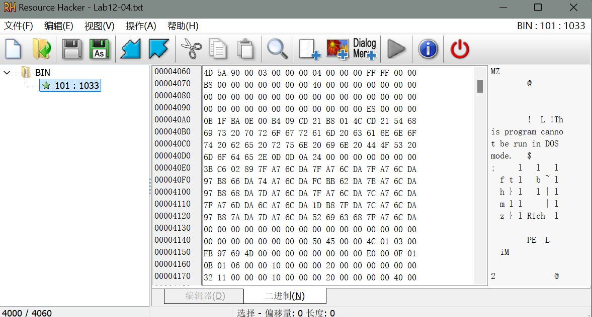

对比恶意代码释放的 `wupdmgr.exe` 和从资源节中提取的 `BIN` 文件，发现它们是相同的。

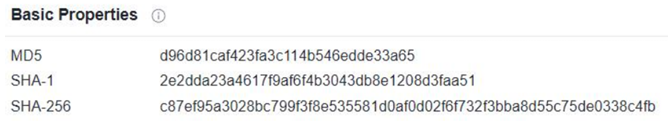

此外，恶意代码还试图打开网页 `http://fe2.update.microsoft.com/`：

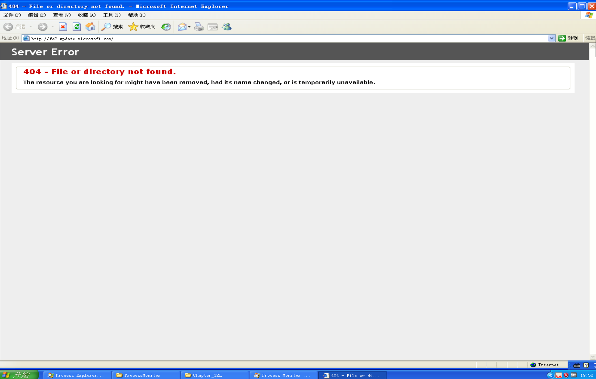

由于网络限制，该网页的访问并未成功。

为了深入了解其网络行为，我们使用 WireShark 进行抓包分析，设置过滤器为 http，并关注本地回环地址 127.0.0.1：

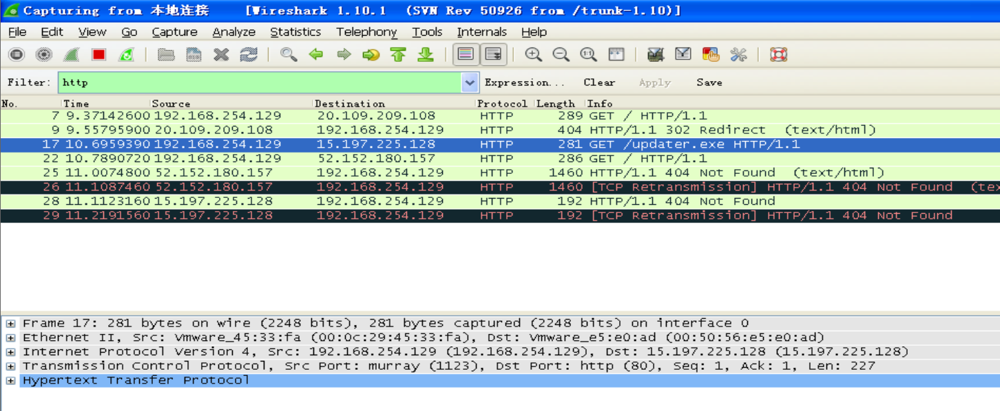

抓包结果显示，该恶意程序试图从 `www.practicalmalwareanalysis.com` 网站通过 GET 请求下载 `updater.exe`。

总而言之，Lab12-04.exe 的行为表明它是一个恶意程序，其主要行为包括替换系统文件、尝试下载外部文件，并与远程服务器进行通信。这些行为是典型的恶意软件特征，表明该程序可能用于进一步的恶意活动，如下载额外的恶意负载或进行其他形式的攻击。

##### （3）深入分析

我们通过 IDA 对 Lab12-04.exe 进行了深入分析，重点关注 `main` 函数：

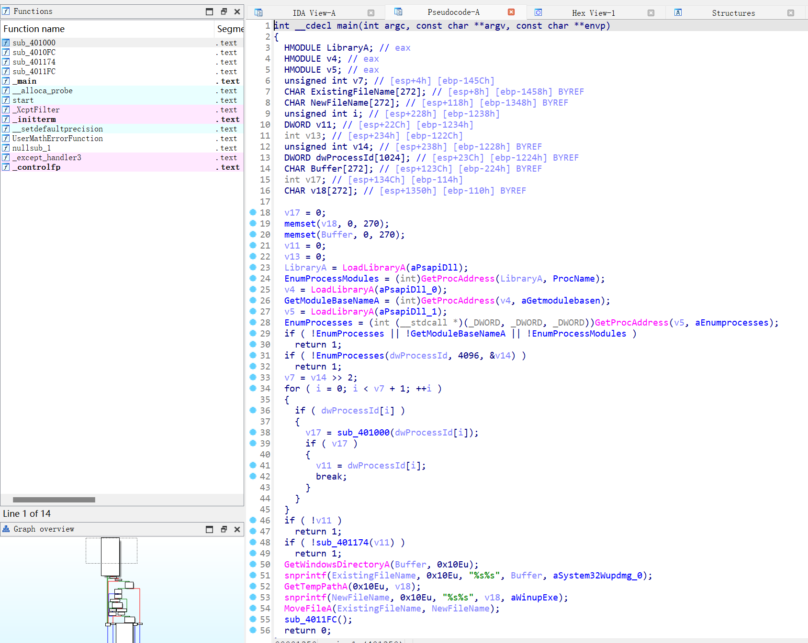

分析的主要流程如下：

1. **加载库并获取函数地址**：

	程序加载 `psapi.dll` 库，并从中获取 `EnumProcessModules`、`GetModuleBaseNameA` 和 `EnumProcesses` 函数的地址，这些函数通常用于枚举和检索进程信息。

2. **枚举系统进程**：

	使用 `EnumProcesses` 函数枚举系统中所有进程的进程 ID，并将它们存储在 `dwProcessId` 数组中。

3. **查找特定进程**：

	遍历 `dwProcessId` 数组，对于每个进程 ID，调用 `sub_401000`（功能未知）。如果 `sub_401000` 返回非零值，说明找到了目标进程，其 ID 存储在 `v11` 中，并跳出循环。

4. **进程处理**：

	如果找到了目标进程（`v11` 不为零），调用 `sub_401174`，传入目标进程的 ID。此函数的具体作用未提供，但可能涉及对目标进程的某种操作。

5. **文件操作**：

	- 使用 `GetWindowsDirectoryA` 获取 Windows 系统目录的路径，并将其存储在 `Buffer` 中。构造一个路径 `ExistingFileName`，指向系统目录下的 `wupdmgr.exe` 文件。
	- 使用 `GetTempPathA` 获取系统临时文件夹的路径，并将其存储在 `v18` 中。构造一个路径 `NewFileName`，指向临时文件夹下的 `winup.exe` 文件。
	- 使用 `MoveFileA` 将 `ExistingFileName` 指向的文件移动到 `NewFileName` 指向的位置，实际上是重命名或移动 `wupdmgr.exe` 到一个新位置。

6. **其他操作**：

	调用 `sub_4011FC`，其具体作用未知，可能是执行某种清理或后续操作。

7. **程序结束**：

	程序返回 0，表示正常结束。

接下来，我们分别查看其中调用的几个子函数。

先看 `sub_401000`：

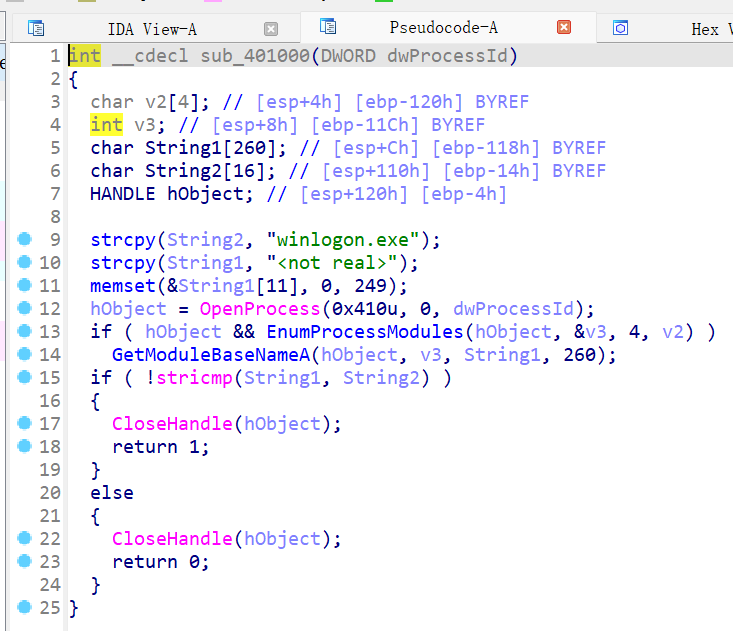

`sub_401000`：

- **初始化变量和字符串**：
  - 字符串 `Str2` 初始化为 "winlogon.exe"。
  - 字符串 `Str1` 初始化为 "<not real>"。
  - 其他局部变量的初始化。
- **打开目标进程**：
  
  使用 `OpenProcess` 打开指定 `dwProcessId` 的进程，获取进程句柄 `hObject`。
- **获取目标进程模块信息**：
  
  使用 `myEnumProcessModules` 函数获取目标进程中模块的信息，包括模块句柄 `v3` 和模块数量。
- **获取目标进程模块文件名**：
  
  使用 `myGetModuleBaseNameA` 函数获取目标进程中模块 `v3` 的文件名，存储在 `Str1` 中。
- **比较模块文件名**：
  
  使用 `stricmp` 比较 `Str1` 即目标进程模块的文件名和 `Str2` 即 `winlogon.exe`，如果相同则返回 1，表示找到目标进程。
- **关闭进程句柄**：
  
  使用 `CloseHandle` 关闭进程句柄 `hObject`。
- **返回结果**：
  
  根据比较结果，返回 1 或 0，表示是否找到目标进程。

由此可知，这段代码是一个用于查找指定进程的函数，通过打开目标进程、获取模块信息和比较模块文件名的方式，判断目标进程是否为 "winlogon.exe"。因此，我们将其重新命名为 `PIDLOOKUP`。

接下来，我们知道如果匹配成功了，对应的 PID 会传给 `sub_401174`，过去看看：

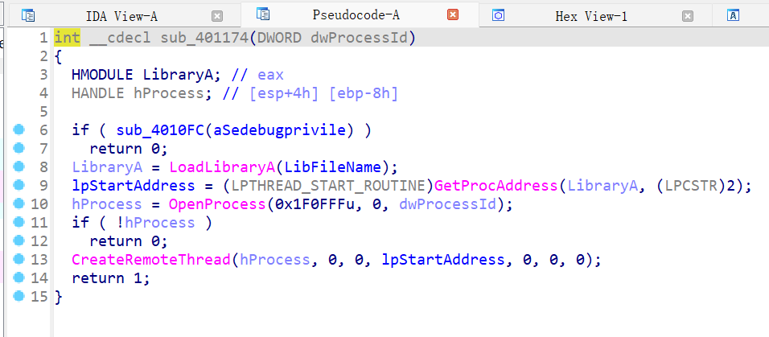

**远程线程注入函数**：

- **判断是否具备 SeDebugPrivilege 权限**：

	调用 `sub_4010FC` 函数检查是否拥有 `SeDebugPrivilege` 权限，如果有，则返回 0，表示无法执行注入。

- **加载库文件**：

	使用 `LoadLibraryA` 加载指定的动态链接库（`LibFileName` 即 `sfc_os.dll`）。

- **获取函数地址**：

	使用 `GetProcAddress` 获取加载的库中序号为 2 的函数地址，将其存储在 `lpStartAddress` 中。

- **打开目标进程**：

	使用 `OpenProcess` 以 0x1F0FFFu 权限打开指定 `dwProcessId` 的进程，获取进程句柄 `hProcess`。

- **创建远程线程**：

	使用 `CreateRemoteThread` 在目标进程中创建一个新的线程，执行 `lpStartAddress` 指向的函数。`lpStartAddress` 已经是 `sfc_os.dll` 中序号 2 的指针了，它负责向 `winlogon.exe` 注入一个线程。该线程就是 `sfc_os.dll` 中序号为 2 的函数。

- **返回注入结果**：

	根据是否成功打开目标进程，返回 1 或 0，表示注入是否成功。

因此，该函数用于在目标进程中执行指定函数的远程线程注入函数，首先检查权限，加载指定库文件，获取函数地址，然后以高权限打开目标进程，创建远程线程执行函数。

其中的 `SeDebugPrivilege` 对应的 `sub_4010FC` 实际上是第 11 章中讨论的函数：

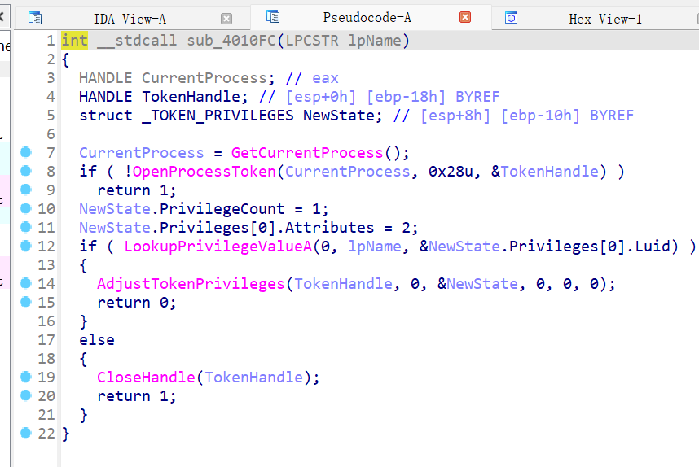

此函数用于修改当前进程的权限，尤其是尝试启用 "SeDebugPrivilege"。使用 `OpenProcessToken` 和 `AdjustTokenPrivileges` 来尝试启用 "SeDebugPrivilege"，这通常用于获取调试其他进程的能力。如果权限修改成功，函数返回 0；否则返回 1。这个函数的作用是提升进程权限，允许它执行一些需要更高权限的操作，如访问和修改其他进程。

接下来我们回到 `sub_401174`，想想 `sfc_os.dll` 的到处序号为 2 的函数是什么呢。

在 Windows 系统中，`sfc_os.dll`（System File Checker OS）是一个用于系统文件完整性检查和修复的系统文件。我们并不知道未公开的导出函数 2，根据书上提示，将其命名为 `SfcTerminateWatcherThread`。并且我们为了成功运行该函数，就必须强制运行它在 `winlogon.exe` 中，这样恶意代码在下次系统重启前，就可以禁用 Windows 文件包含机制。

我们前面分析 `main` 时候已经提到了，这里再次重申，上面的注入线程如果成功了，那么就会执行 `main` 的后面这部分：

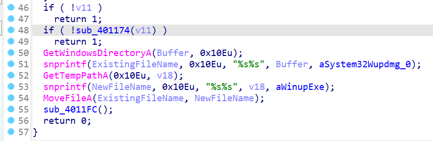

现在结合具体内容详细说：

- **文件路径构造**：

	`GetWindowsDirectoryA` 返回当前 Windows 目录即 `C:\Windows`，然后和 `system32\wupdmgr` 拼成 `C:\Windows\system32\wupdmgr.exe`。然后通过 `snprintf` 存在 `Dest`（`ExistingFileName`）中。这个 `wupdmgr.exe` 用于系统更新。

- **文件移动**：

	`GetTempPathA` 构造另一个字符串，即 `C:\Documents and Settings\username\Local\Temp\winup.exe` 存在 `NewFileName` 中。

- **文件替换**：

	最后通过将 `MoveFileA` 将更新的二进制文件放到了用户的临时目录中。

接下来我们注意到函数 `sub_4010FC` 中多次调用了 `GetModuleHandle` 等和 `LoadResource` 提取资源节：

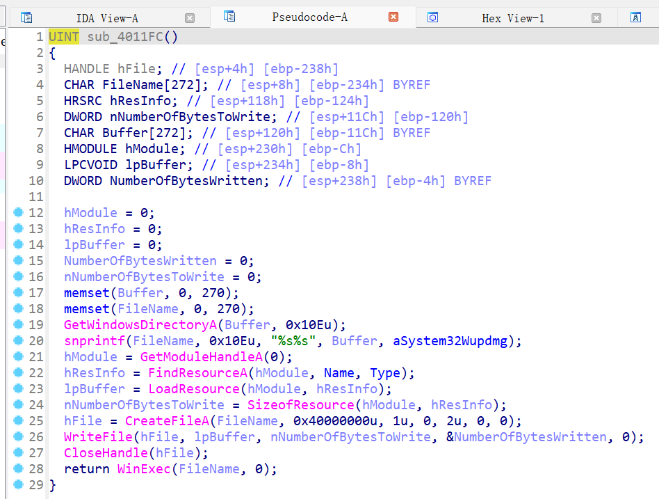

这个函数执行了一系列文件操作和资源管理，其主要工作流程如下：

1. **文件和资源准备**：
	- 使用 `GetWindowsDirectoryA` 获取 Windows 系统目录的路径，并存储在 `Buffer` 中。构造一个文件路径 `FileName`，指向系统目录下的 `wupdmgr.exe` 文件。
	- 获取当前模块（可能是执行的程序本身）的句柄。
	- 使用 `FindResourceA` 查找模块中的资源，资源类型为 "BIN"，名字为 "#101"。
2. **资源加载和文件写入**：
	- 通过 `LoadResource` 和 `SizeofResource` 加载找到的资源并获取其大小。
	- 使用 `CreateFileA` 创建（或打开）`FileName` 指定的文件，准备写入数据。
	- 使用 `WriteFile` 将加载的资源内容写入新创建的 `wupdmgr.exe` 文件。
3. **执行新文件**：
	- 关闭文件句柄。
	- 使用 `WinExec` 执行 `FileName` 指向的文件。`WinExec` 函数用于运行一个可执行文件。

操作系统宫老师刚讲过的 `WinExec`！Windows 系统调用来在用户进程运行 `wupddmgr.exe`。同时使用 `SW_HIDE`（0），实际上是 Windows 的文件保护机制一般来说会探测到文件的改变或者覆盖行为，所以一般来说这个病毒创建新更新程序其实会失败。不过由于其禁用了 Windows 文件保护机制，所以它的邪恶目的才可以实现。

最后让我们来看看 `BIN` 干了什么，我直接使用 ResourceHacker 将他提取，命名为 `mal_wupdmgr.exe`，然后加载到 IDA 中：

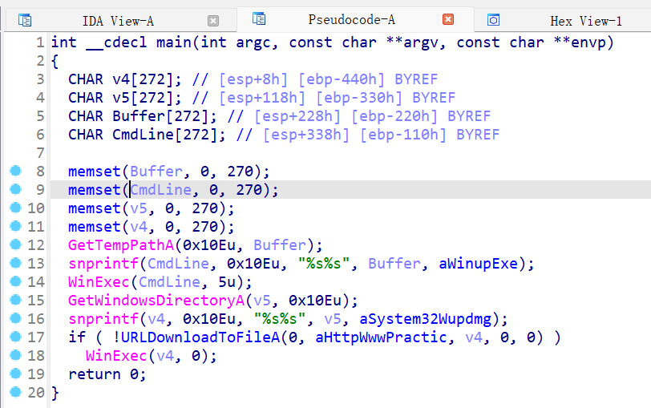

看到一些值得注意的地方：

- **临时目录和文件操作**：

	`GetTempPathA` 创建临时目录字符串，然后移动原始 Windows 更新二进制文件 `C:\Documents and Settings\username\Local\Temp\winup.exe`。

- **执行原始文件**：

	`WinExec` 运行原始的 Windows 更新二进制文件。所以原始的还是能运行，只是换了一个位置，到临时目录中了。

- **下载操作**：

	URLDownloadToFileA 这个很重要，它虽然是个自己写的函数，但其内部还是调用相关 API。我们关注其参数：

	- `szURL`：`http://www.practicalmalwareanalysis.com/updater.exe`。
	- `szFileName`：`Dest` 即 `C:\Windows\system32\wupdmgrd.exe`。

	由此将下载文件 `updater.exe` 保存在 `wupdmgrd.exe` 中。

- 执行和返回：

	最后根据 `URLDownloadToFileA` 的参数和 0 比较，判断是否调用失败，不等于 0，则会运行先创建的文件，然后二进制文件返回并退出。

综上所述，Lab12-04.exe 看起来是一个用于操控系统文件的恶意软件。它首先识别系统中的 `winlogon.exe` 进程，然后尝试在该进程中注入代码。接着，程序修改 `wupdmgr.exe`（Windows 更新管理器），将其替换为从资源中提取的恶意代码，并执行这个新的 `wupdmgr.exe`，以禁用文件保护机制。

##### （4）问题解答

> Q1. 位置 0x401000 的代码完成了什么功能？

它负责查看给定 PID 是否为 `winlogon.exe` 进程，并返回判断结果。

> Q2. 代码注入了哪个进程？

注入到的进程是 `winlogon.exe`。

> Q3. 使用 LoadLibraryA 装载了哪个 DLL 程序？

装载的 DLL 程序是 Windows 文件保护机制的 `sfc_os.dll`。属于操作系统级别的程序。

> Q4. 传递给 CreateRemoteThread 调用的第 4 个参数是什么？

传给 `CreateRemoteThread` 的第 4 个参数是一个函数指针，指向的是加载的文件保护机制程序 `sfc_os.dll` 的序号为 2 的函数，根据提示其命名为 `SfcTerminateWatcherThread`。即对文件保护机制禁用。

> Q5. 二进制主程序释放出了哪个恶意代码？

恶意代码从资源段中释放了 `BIN` 二进制程序。并且将这个二进制文件覆盖旧的 Windows 更新程序即 `wupdmgr.exe`，通过结尾多加一个 `d` 混淆视听。同时覆盖真实的 `wupdmgr.exe` 之前，恶意代码将它复制到 `%TEMP%` 目录，供以后使用。

> Q6. 释放出恶意代码的目的是什么？

这个病毒是一个十分典型的通过禁用 Windows 保护机制来修改 Windows 功能的一种通用方法。病毒首先向 `winlogon.exe` 注入一个远程线程（因为这个函数一定要运行在进程 `winlogon.exe` 中所以 `CreateRemoteThread` 调用十分必要）。并且调用 `sfc_os.dll` 的一个导出函数（即序号为 2 的 `sfcTerminateWatcherThread`），在下次启动之前禁用 Windows 的文件保护机制。恶意代码通过用这个二进制文件来更新自己的恶意代码并且调用原始的二进制文件（位于 `%TEMP%` 目录）特洛伊木马化 `wupdmgr.exe` 文件。值得注意的是，恶意代码并没有完全破坏原始的 Windows 更新二进制程序，所有被感染主机用户仍会看到正常的 Windows 更新功能，十分狡猾，难以察觉！

### （二）yara 编写与分析

#### 1. yara 编写

本次 Yara 规则的编写基于上述的病毒分析和实验问题，主要是基于静态分析的字符串和 IDA 分析结果。

```yara
private rule isMZ_PE {
    meta:
        description = "It is a PE file"
    condition:
        filesize <10MB and uint16(0) == 0x5A4D and uint32(uint32(0x3C)) == 0x00004550
        // 文件大小小于10MB，文件头的前两个字节为MZ，PE头的偏移地址处的四个字节为PE标志
}

// Lab12-01
rule Lab12_01_exe {
    meta:
        description = "It may like Lab12_01_exe"
    strings:
        $s1 = "Lab12-01.dll"
        $s2 = "explorer.exe"
        $s3 = "psapi.dll"
    condition:
        isMZ_PE and all of them
}

rule Lab12_01_dll {
    meta:
        description = "It may like Lab12_01_dll"
    strings:
        $s1 = "Practical Malware Analysis %d"
        $s2 = "Press OK to reboot"
    condition:
        isMZ_PE and all of them
}

// Lab12-02
rule Lab12_02_exe {
    meta:
        description = "It may like Lab12_02_exe"
    strings:
        $s1 = "\\svchost.exe"
        $s2 = "AAAqAAApAAAsAAArAAAuAAAtAAAwAAAvAAAyAAAxAAA"
        $s3 = "LOCALIZATION"
    condition:
        isMZ_PE and all of them
}

// Lab12-03
rule Lab12_03_exe {
    meta:
        description = "It may like Lab12_03_exe"
    strings:
        $s1 = "practicalmalwareanalysis.log"
        $s2 = "[SHIFT]"
        $s3 = "[ENTER]"
        $s4 = "[BACKSPACE]"
        $s5 = "[TAB]"
        $s6 = "[CTRL]"
        $s7 = "[DEL]"
        $s8 = "[CAPS LOCK]"
    condition:
        isMZ_PE and all of them
}

rule Lab12_04_exe {
    meta:
        description = "It may like Lab12_04_exe"
    strings:
        $s1 = "http://www.practicalmalwareanalysis.com/updater.exe"
        $s2 = "<not real>"
        $s3 = "\\system32\\wupdmgr.exe"
        $s4 = "\\winup.exe"
        $s5 = "winlogon.exe"
    condition:
        isMZ_PE and all of them
}
```

#### 2. 运行

把上述 Yara 规则保存为 `lab9.yar`, 然后执行检查，可以看到，样本被检出。**Yara 规则编写成功！**

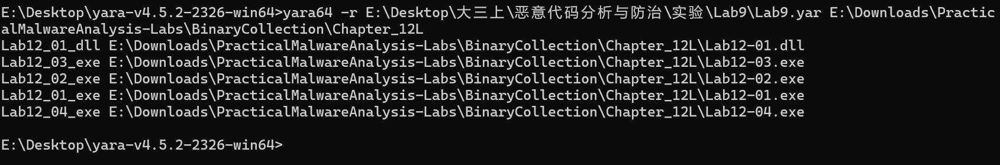

#### 3. 测试执行效率

接下来测试规则的执行效率，我选择编写一个 python 脚本、执行扫描和时间统计，代码如下：

```python
import os
import time

# 获取程序开始时间
start_time = time.time()

os.system(r"E:\Desktop\yara-v4.5.2-2326-win64\yara64.exe -r E:\Desktop\大三上\恶意代码分析与防治\实验\Lab9\Lab9.yar E:\Downloads")

# 获取程序结束时间
end_time = time.time()

# 计算并输出程序运行时间
elapsed_time = end_time - start_time
print(f"程序运行时间: {elapsed_time} 秒")
```

运行结果如下，我这个文件夹大小为 2.13GB，有 438 个文件、122 个文件夹，而运行时间为 2.7s，说明效率较高。

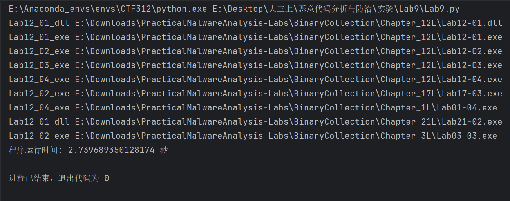

### （三）IDA python 脚本编写

#### 1. IDA python 脚本编写

为了简化安全审计和逆向工程的工作，我编写了三个脚本来辅助分析：

##### 脚本一

```python
import idaapi
import idautils
import idc

# 检查指令是否是 'jmp' 或 'call' 且操作数为寄存器类型
def is_jump_or_call_with_register(ea):
    """
    检查给定地址的助记符是否为 'jmp' 或 'call' 且操作数为寄存器类型
    """
    mnemonic = idc.print_insn_mnem(ea)
    if mnemonic not in ['jmp', 'call']:
        return False
    opnd_type = idc.get_operand_type(ea, 0)
    # 确保操作数是寄存器类型
    return opnd_type in [idaapi.o_reg, idaapi.o_phrase, idaapi.o_displ]

# 检查函数是否为库函数
def is_library_function(func_ea):
    """
    检查给定地址的函数是否为库函数
    """
    flags = idc.get_func_attr(func_ea, idc.FUNCATTR_FLAGS)
    return flags & idaapi.FUNC_LIB

# 标记不安全的函数调用并设置颜色
def judge_audit(addr):
    """
    对不安全的函数调用进行标注，并设置背景颜色
    """
    idc.set_cmt(addr, "### AUDIT HERE ###", 0)  # 添加注释
    idc.set_color(addr, idc.CIC_ITEM, 0x0000ff)  # 设置指令背景颜色

# 标记不安全函数的调用
def flag_calls(danger_funcs):
    """
    查找并标记程序中所有不安全函数的调用
    """
    count = 0
    for func in danger_funcs:
        faddr = idc.get_name_ea_simple(func)
        if faddr != idaapi.BADADDR:
            # 获取对该函数的所有交叉引用
            cross_refs = idautils.CodeRefsTo(faddr, 0)
            for addr in cross_refs:
                count += 1
                print("%s[%d] calls 0x%08x" % (func, count, addr))
                judge_audit(addr)

# 主函数
def main():
    # 遍历所有函数，排除库函数
    for func in idautils.Functions():
        if is_library_function(func):
            continue

        # 遍历函数中的所有指令
        ea = func
        func_end = idc.find_func_end(func)
        while ea != idaapi.BADADDR and ea < func_end:
            # 如果是跳转或调用且操作数是寄存器类型
            if is_jump_or_call_with_register(ea):
                print("Address: 0x{:X}, Instruction: {}".format(ea, idc.generate_disasm_line(ea, 0)))
            # 继续处理下一条指令
            ea = idc.next_head(ea)

    # 识别并标记不安全函数调用
    print("-------------------------------")
    danger_funcs = ["DllEntryPoint", "printf", "strcpy", "GetModuleFileNameExA", "Thread32Next"]
    flag_calls(danger_funcs)
    print("-------------------------------")

if __name__ == '__main__':
    main()
```

该脚本主要有两个功能：

1. **动态跳转或调用检测**，即检测汇编指令是否是 `jmp` 或 `call`，并且操作数为寄存器类型。

2. **查找和标记危险函数调用**，并为每个调用添加注释、设置背景颜色。（主要用来漏洞挖掘）

##### 脚本二

本次实验中由于 Lab12-02 出现需要 XOR 解密的地方，因此编写如下脚本，用于对资源节文件进行 XOR 异或解码（注意这里需要先知道资源文件的位置）：

```python
import idaapi
import idc
import idautils

def log_message(message):
    """Log messages to the IDA output window."""
    print(f"[XOR Decoder]: {message}")

def xor_decode_le(data, operand):
    """
    Perform XOR decoding for little-endian data.
    Each byte is XOR-ed with the operand (0x41).
    """
    decoded_data = bytearray()
    for byte in data:
        decoded_data.append(byte ^ operand)
    return decoded_data

def save_to_file(filename, data):
    """Save the decoded data to a file."""
    try:
        with open(filename, "wb") as f:
            f.write(data)
        log_message(f"Decoded data saved to: {filename}")
    except Exception as e:
        log_message(f"Failed to save data to file: {e}")

def main():
    # Known parameters for the resource section
    resource_start_ea = 0x00006084  # Resource section start address
    resource_size = 0x6000         # Size of the resource section (in bytes)
    
    # Define the XOR operand (41 in hex)
    xor_operand = 0x41
    log_message(f"Using XOR operand: {hex(xor_operand)}")

    # Read the resource section content
    log_message(f"Reading resource section from {hex(resource_start_ea)} with size {resource_size} bytes...")
    encoded_data = idaapi.get_bytes(resource_start_ea, resource_size)
    if not encoded_data:
        log_message("Failed to read resource section content!")
        return

    # Decode the content
    log_message("Decoding the resource section...")
    decoded_data = xor_decode_le(encoded_data, xor_operand)

    # Save the decoded content to a file
    output_filename = "decoded_resource.bin"
    save_to_file(output_filename, decoded_data)

    log_message("XOR decoding completed.")

if __name__ == "__main__":
    main()
```

##### 脚本三

本次实验中涉及的病毒具有复杂的调整行为比如 Lab12-02 的函数非常复杂，所以编写一个查找并跟踪参数传递的函数。

```python
import idaapi
import idc
import idautils

def find_mov_esi(addr):
    """
    在给定地址addr的上下文中，向前遍历指令，找到最近的一条mov指令，
    并将值赋给esi寄存器。如果是，则打印找到的参数值。
    """
    while addr != idaapi.BADADDR:
        insn = idc.get_insn_at(addr)
        if insn is None:
            break
        mnemonic = idc.print_insn_mnem(insn)
        if mnemonic == "mov":
            # 获取操作数
            operands = idc.print_operands(insn)
            # 检查是否将值赋给esi寄存器
            if "esi" in operands:
                # 提取并打印参数值
                esi_value = idc.get_operand_value(insn, 0) if "esi" in operands else idc.get_operand_value(insn, 1)
                print(f"Found mov to esi at {idc.get_func_name(addr)}+{addr-idc.get_func_attr(addr, idc.FUNCATTR_START)}: {esi_value}")
                break
        addr = idc.prev_head(addr)  # 向前移动到上一条指令
```

#### 2. 运行

下面我以代码一为例进行展示，执行该 IDApython 脚本：

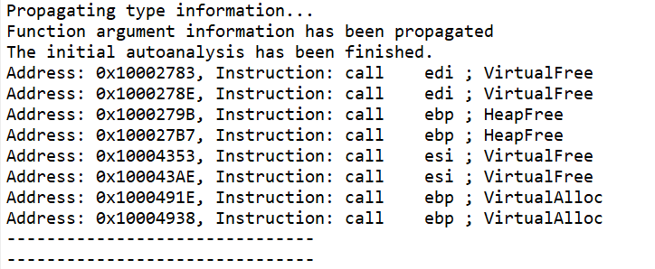

可以看到控制台输出了 `call`，说明脚本编写成功！

## 四、实验结论及心得体会

---

在本次实验中，我有机会深入探究并亲自实践了多种用于恶意软件隐藏执行的技术，例如进程注入、钩子（Hook）注入以及异步过程调用（APC）注入等。我特别关注了恶意软件如何通过注入技术实现隐蔽执行，以及它们是如何利用操作系统的特性来达到这一目的。

通过这些实验，我了解了恶意软件的常见行为特征，尤其是它们在注入技术和启动机制方面的应用。这些知识对于分析实际的恶意软件样本来说至关重要。例如，在实验中，我们探讨了 `lookupPrivilegeValueA` 函数的调用，这一过程揭示了权限提升的具体实现。

我利用了多种逆向工程工具，包括 IDA、OllyDbg 和 Process Monitor，来分析恶意软件样本，并揭示了它们的内部工作原理。在分析这些病毒样本的过程中，我对恶意代码设计的复杂性和其执行的隐蔽性有了深刻的认识。例如，病毒通过修改操作系统层面的设置来实现其持久性和隐蔽启动。

这次实验也让我认识到了保持系统安全的重要性，包括及时更新安全补丁、使用防病毒软件以及执行有效的网络安全策略。例如，恶意软件常常依赖于系统的特定漏洞或未经授权的 API 调用，通过及时修复这些漏洞，可以显著降低被感染的风险。
