<div align='center'>
<b> <font face='微软雅黑' size='6'> 恶意代码分析与防治技术课程实验报告 </font> </b>
</div>


<div align='center'>
<b> <font font face='微软雅黑' size='6'> 大作业-恶意代码检测模型实验 </font> </b>
</div>


<div>
<font face='宋体' size='6'>&nbsp;&nbsp;&nbsp;&nbsp; 学 院：网络空间安全学院 </font> <br>
<font face='宋体' size='6'>&nbsp;&nbsp;&nbsp;&nbsp; 专 业：信息安全 </font> <br>
<font face='宋体' size='6'>&nbsp;&nbsp;&nbsp;&nbsp; 学 号：2212998 </font> <br>
<font face='宋体' size='6'>&nbsp;&nbsp;&nbsp;&nbsp; 姓 名：胡博浩 </font> <br>
<font face='宋体' size='6'>&nbsp;&nbsp;&nbsp;&nbsp; 班 级：信息安全 </font> <br>
</div>


## 一、实验目的

---

1. 下载 Ember 数据集，并分析 Ember 数据集中样本的 PE 文件特征
2. 基于 Ember 的训练数据，选择至少一种机器学习算法，训练恶意代码检测模型（可以参考和复现 Ember 给出的基于 LightGBM 算法的模型代码）
3. 基于 Ember 的测试数据，验证训练好的检测模型的性能
4. 完成并提交实验报告（详细的实验过程+结论）和模型源代码

## 二、实验原理

---

本实验依据 Ember 框架展开，以机器学习方法达成恶意软件检测之目的。其主要步骤如下：

### 主要步骤

1. **特征工程**：借助静态特征提取方式，如 PE 文件特征、字节直方图、熵值分析等，为模型供应数据。特征提取过程呈模块化，涉及多维度分析，能够全面且细致地挖掘数据特征，为后续模型训练提供丰富且有效的信息基础。
2. **机器学习建模**：采用 LightGBM（基于梯度提升的决策树算法）进行建模。LightGBM 具有高效性与高精度的特点，尤其适用于处理高维度的特征数据，能够在复杂的数据环境中准确地捕捉数据间的潜在关系，从而构建出具有强大预测能力的模型。
3. **模型评估**：通过准确率、召回率、F1-score 等多项指标对模型性能予以评估，以此确保模型具备良好的泛化能力，使其在面对未知数据时能够保持稳定且可靠的预测性能，从而有效应用于实际的恶意软件检测场景。

### 数据集和特征介绍

Ember 数据集涵盖恶意与良性 PE 文件，其特征提取主要包括以下几类：

#### 解析特征

- **文件信息**：包含文件的大小、虚拟大小、导入导出函数数量等，这些信息能够从宏观层面反映文件的基本属性和规模，为初步判断文件性质提供依据。
- **标头信息**：涉及目标机器类型、子系统版本、链接器版本等，通过对这些信息的分析，可以了解文件的运行环境和相关技术细节，有助于进一步剖析文件的潜在风险。
- **导入导出函数**：深入分析 PE 文件的导入和导出函数，以此捕捉文件的外部依赖关系，进而推断文件在运行过程中可能与其他系统组件或外部资源的交互情况，为判断文件是否存在恶意行为提供重要线索。
- **部分信息**：针对文件中的不同节，如.text、.data 等，分析其大小、虚拟大小、熵等信息。这些信息能够更细致地刻画文件内部的结构和数据分布情况，有助于发现隐藏在文件内部的恶意特征。

#### 与格式无关的特征

- **字节直方图**：通过记录文件中每个字节值的频率，能够准确地描述文件的字节分布情况，从而捕捉到文件在数据层面的特征，为区分不同类型的文件提供微观层面的依据。
- **字节熵直方图**：计算文件中固定窗口的字节熵，以此反映文件的复杂度。较高的字节熵通常意味着文件具有更复杂的结构和内容，这对于识别经过加密或混淆处理的恶意软件具有重要意义。
- **字符串信息**：统计文件中的可打印字符串，重点捕获路径、URL、注册表项等信息。这些信息往往与恶意软件的行为密切相关，例如恶意软件可能会尝试访问特定的路径、连接特定的 URL 或修改注册表项，通过对这些字符串信息的分析，可以有效地检测出潜在的恶意行为。

### 特别关注的技术细节

- **特征提取与选择**：实验中运用多维度的特征提取方法，涵盖字节级的直方图和熵计算，以及 PE 文件结构的深度解析。这些特征相互补充，从不同角度刻画了文件的特征，有助于更准确地区分恶意软件与良性文件，提高模型的检测精度和召回率。
- **LightGBM 的优势**：相较于传统的机器学习算法，如决策树、支持向量机等，LightGBM 展现出更高的训练效率。特别是在应对大规模数据集时，其能够显著加快训练速度，并有效减少内存使用，从而在保证模型性能的前提下，提高了模型训练和部署的可行性和效率.
- **模型优化**：利用网格搜索等方法对 LightGBM 的超参数进行精细调优，确保模型达到最佳性能。在优化过程中，对学习率、树的深度、叶子节点的数量等关键参数进行了细致调整，通过不断地试验和评估，找到最优的参数组合，从而提升模型的预测能力和泛化能力.
- **评估指标**：除了基本的准确率指标外，F1-score 和召回率等指标在本实验中具有重要意义。它们能够更全面地反映模型的检测能力，尤其是在处理恶意样本较少的情况下，召回率的重要性更为凸显。因为在这种情况下，确保尽可能多地检测出恶意样本，即提高召回率，对于保障系统的安全性至关重要。

## 三、实验过程

---

### （一）环境搭建

首先进入项目 github 仓库地址 [elastic/ember: Elastic Malware Benchmark for Empowering Researchers](https://github.com/elastic/ember)，下载克隆到本地

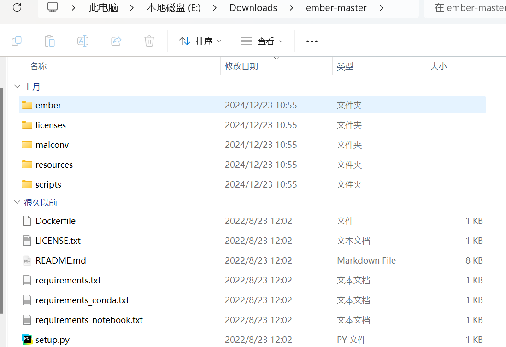

仔细查看其 readme 文件，发现可以直接使用 dockerfile 文件，构建一个完整的容器运行，这样就不用复杂的配环境了。

同时由于我之前已经下载配置过 docker，这里我只要使用以下命令构建镜像就 ok。这里参考 [使用 Dockerfile 创建镜像，创建容器并运行_dockerfile zk-CSDN 博客](https://blog.csdn.net/dongdong9223/article/details/83059265)

```assembly
docker build -t malware:v1 .
```

结果如图所示，成功构建！

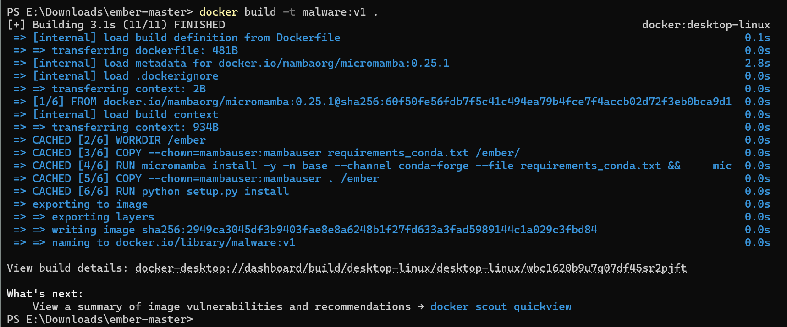

然后新建一个容器，命令如下：

```assembly
docker run -it -p 127.0.0.1:8111:80 --name malware_test malware:v1 /bin/bash
```

这里由于我已经建立了容器，所以报错（我是先完成的实验然后才写的报告并截图…）

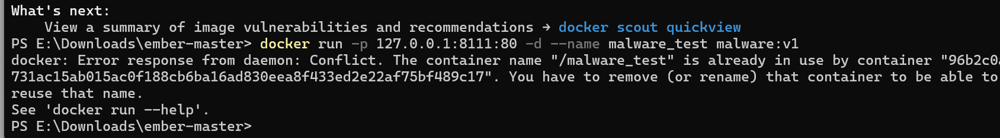

因为这次实验需要调整代码，所以我将在 vscode 中连接 docker 容器进行。

我之前已经在 vscode 中安装过容器相关的插件（Docker 和 Dev Containers），就不再赘述相关的过程。

为了方便代码的调整编写，我在容器中也安装了一些插件，主要是和 python 相关的，如下所示：

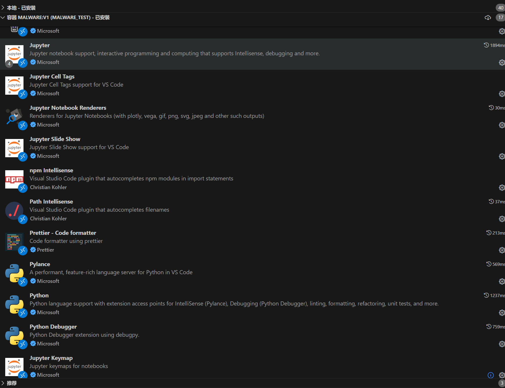

之后正常的打开容器、打开 ember 文件夹就行。

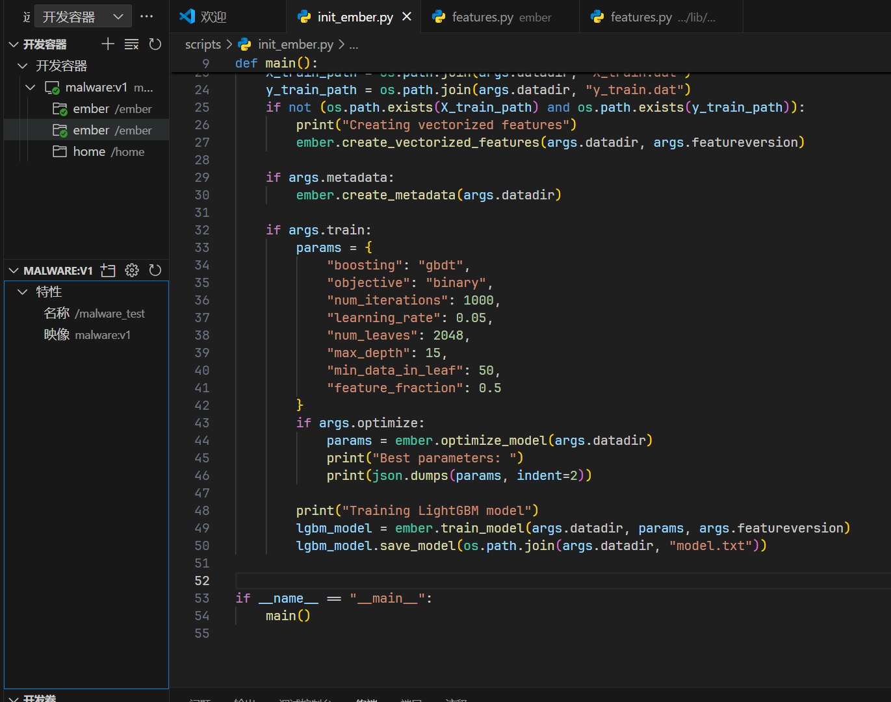

最后，根据 readme 文件，我们还需要下载数据集，才能进行模型的训练及分类。

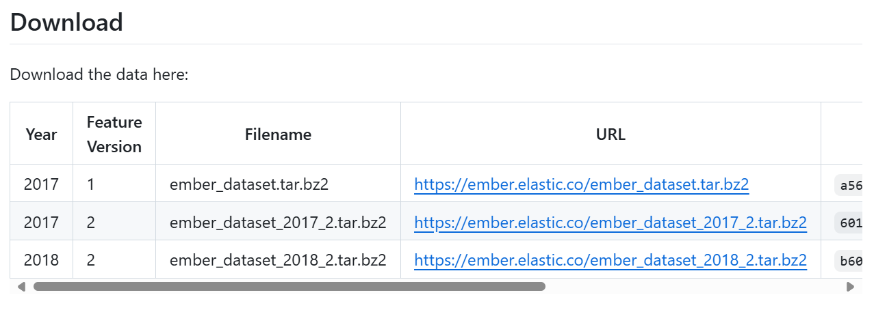

这里直接选择最新的最全的数据集 2018 版本的，大概有 1.6GB，需要下载挺久的。

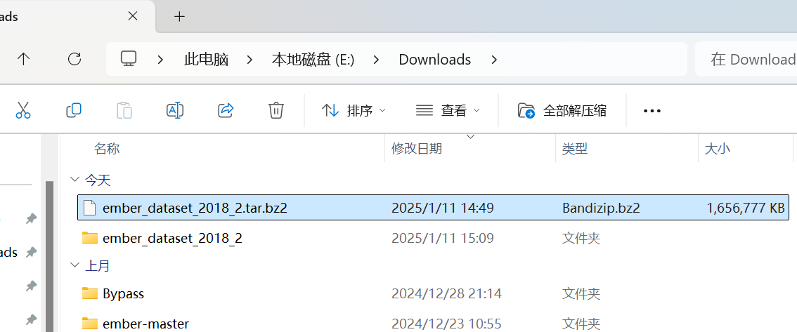

我们解压两次，得到相关的文件.可以看到这里有 6 个训练集、1 个测试集和一个训练好的模型：

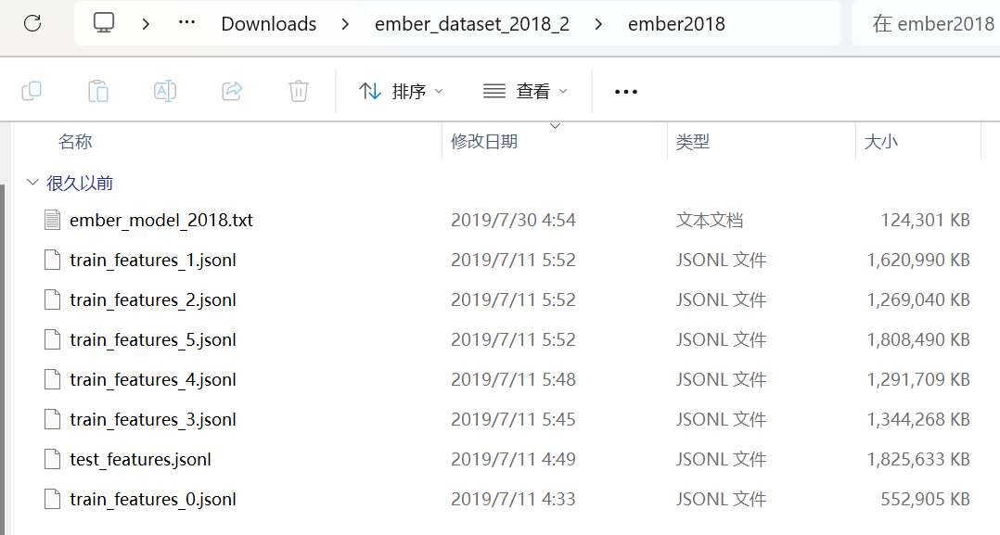

我们直接拖入容器中就行（这也是 vsode 插件 Dev Containers 的功劳，方便快捷）。由于文件较大，大概 10 个 GB，需要等待一会…最终如图所示：

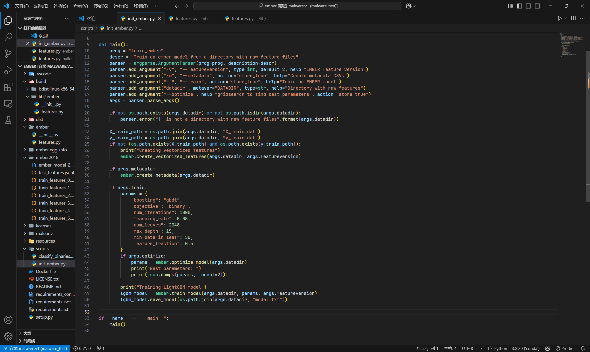

至此完成了环境的配置，可以进行实验了。

### （二）实验复现 1（失败）

仔细查看项目的 readme 文件，可以发现模型训练和 pe 文件分类的代码主要是在 scripts 文件夹中, ember 则是用来训练过程中的特征提取。然后根据下图，可以知道能够通过以下命令生成相应的模型：

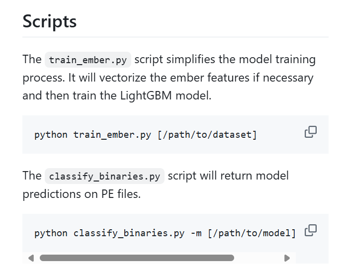

首先输出下面的命令切换到 scripts 目录下，方便之后输入命令：

```assembly
cd scripts
```

然后再输出以下命令：

```assembly
python init_ember.py -t ../ember2018/
```

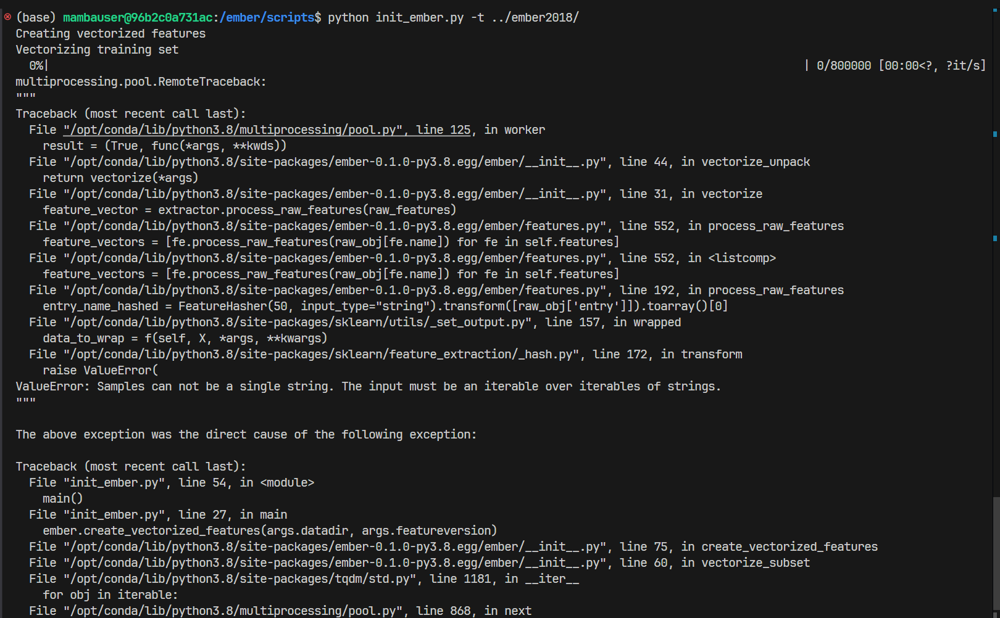

结果如上，报错，大概是说 `transform（）` 方法需要列表、而不是单个字符串。

然后我就上网查资料，发现 ember 官方仓库的 issue 中有相关说明，即 [create_vectorized_features 错误·问题#103 ·弹性/弹性 --- create_vectorized_features error · Issue #103 · elastic/ember](https://github.com/elastic/ember/issues/103)

解决方法是把 features.py 中 192 行的 entry_name_hashed = FeatureHasher(50, input_type = "string").transform([raw_obj['entry']]).toarray()[0]

换成 entry_name_hashed = FeatureHasher(50, input_type = "string").transform([ [raw_obj['entry']] ]).toarray()[0] 

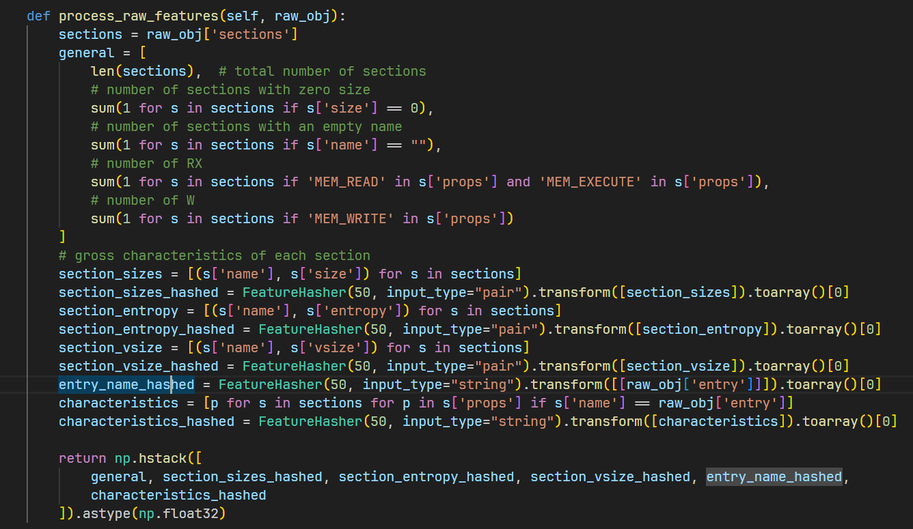

修改完后我再次运行上述命令，还是报一样的错。

我仔细研究代码，发现在 docker build 时运行了这样一个命令：

```assembly
RUN python setup.py install
```

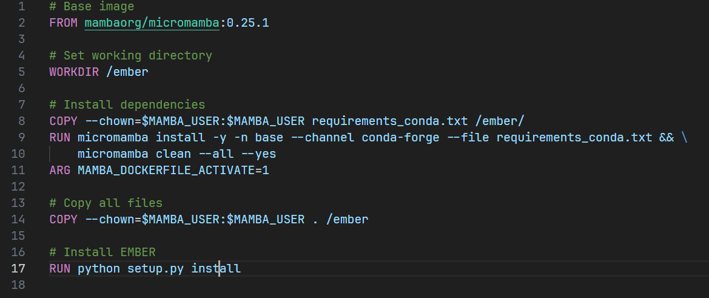

意思是在 python 中安装 ember，所以我们需要在 docker build 之前修改代码。因为 init_ember.py 文件使用了 ember-0.1.0-py3.8.egg 文件，而这个文件是在 build 时自动生成的。。。

解决方法大概有两个：

其一，手动替换这个 egg 文件：得先把这个文件解压了，里面就是包括了 ember 的两个文件\__init__\.py 和 features.py, 修改完之后再压缩好、并放回原处。不过这个比较麻烦 🤣

其二，在 build 前修改：得把容器、镜像删掉，再修改代码，之后重新生成镜像、容器。也比较麻烦。

这里我选择从头来过，修改代码再重新 build 容器，然后运行之前的命令，结果如下所示：

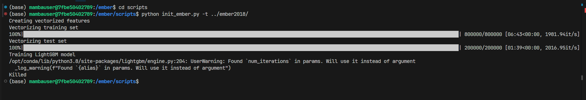

还是报错，Killed

这里我猜测是由于内存不够的原因。。。而 linux 有内存限制设置(OOM killer)、会强行杀死进程

### （三）实验复现 2（成功复现，但是准确率不够高）

所以我决定调整数据集大小，经过反复多次实验，我发现把 test_features.jsonl（1.74 GB）作为训练集、把 train_features_0.jsonl（539.95 MB）作为测试集。

并调整数据集相关代码。

这里我经过仔细研究，发现是 create_vectorized_features 和 create_metadata 函数涉及到了这些数据集。因此将代码调整如下（这里为什么名字对不上呢，因为我调整了太多次、好不容易才成功的、而且最终我也没采用这个方法、所以就没管了）：

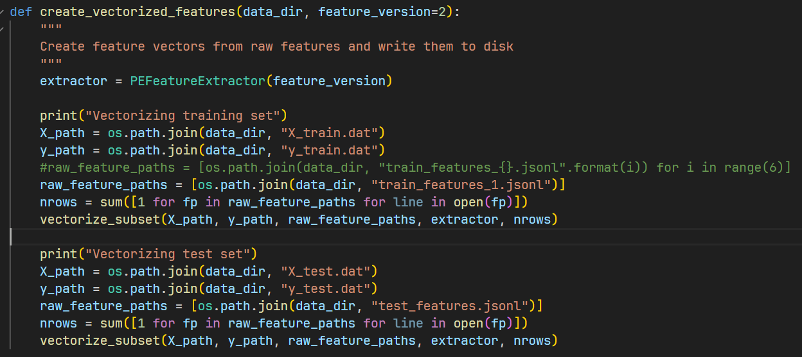

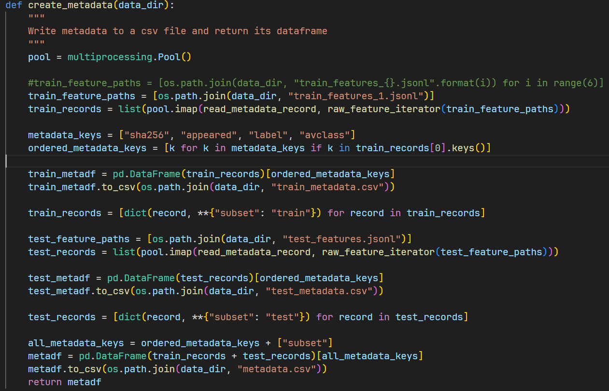

然后一样的，不厌其烦地运行命令，终于成功了！！！

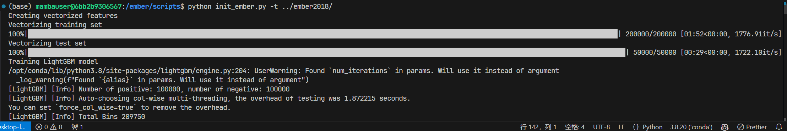

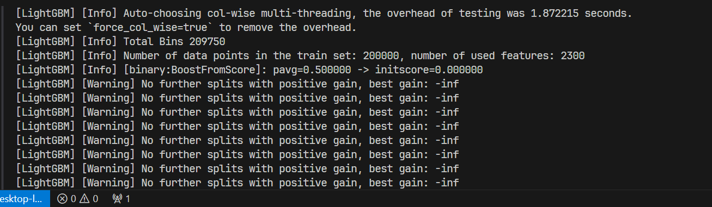

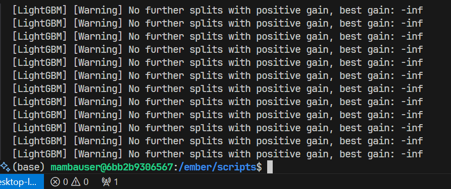

至此，我们得到了训练好的模型，可以开始分类了。

我选择把恶意代码实验的样本作为测试的东西。

先把它传入 docker 容器中，然后根据 readme 运行下面的命令：

```assembly
python classify_binaries.py -m ../ember2018/model.txt ../BinaryCollection/Chapter_1L/Lab01-01.exe
```

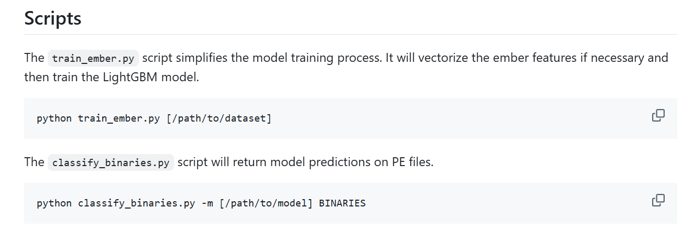

结果如图所示：


可以看到能够进行分类，但是准确率不够高。应该是由于数据集不够。

但是这已经是我电脑内存的极限了，没法再提高了。。。

### （四）实验复现 3（终于完美复现成功）

然后我上网查找资料，发现 windows 没有这种内存回收的机制，所以应该能够使用完整的数据集进行测试。

所以我决定在本机上直接进行，而不使用 docker 容器。

首要的问题就是选择什么 python 版本，这里我参考 [error: subprocess-exited-with-error (lief) · Issue #102 · elastic/ember](https://github.com/elastic/ember/issues/102)

选择 python3.6 作为 python 解释器。（其实是因为我之前使用了高版本的 3.8 没能成功 😭，但是之前的错误找不到了，就不截图说明了）

这里还好我之前安装过了 anaconda、方便管理 pyhton 版本。这里我直接新建一个新的 conda 虚拟环境：

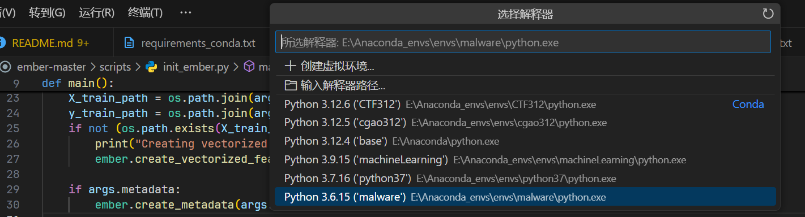

然后一样的步骤，就不再赘述。

但是这里有一点不同，我为了提高代码的效率，把这个 int 改为了 int64

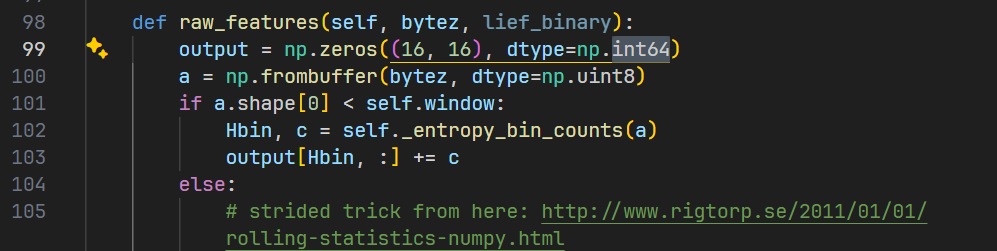

然后这里的初始化也注释掉了：

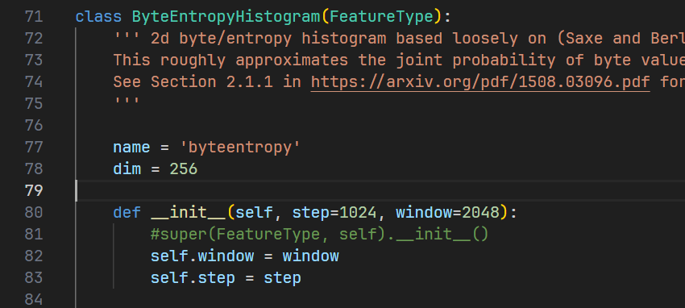

之后参考 readme，运行下面两条命令：

```assembly
pip install -r requirements.txt
python setup.py install
```

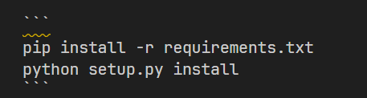

结果如下：

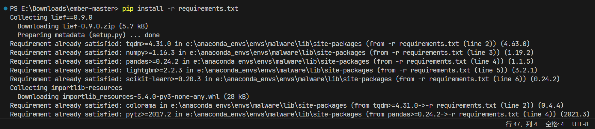

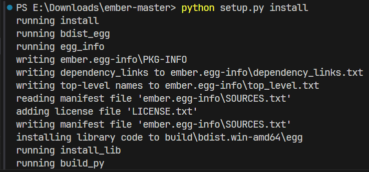

配置好依赖后，就可以训练模型了：

```assembly
python init_ember.py -t ../ember2018/
```

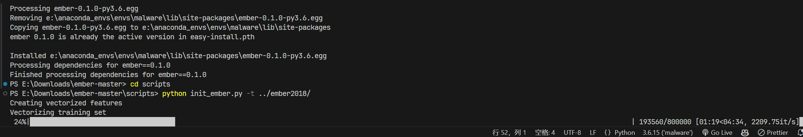

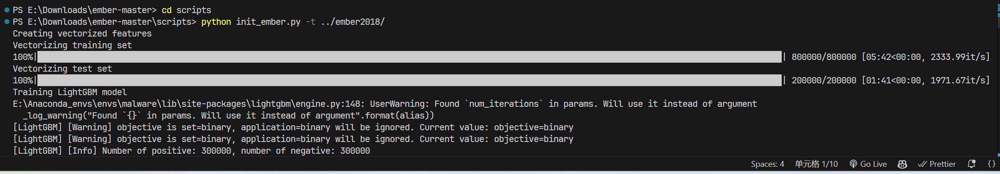

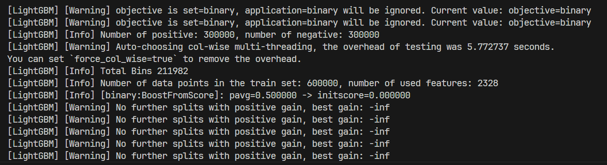

可以发现能够成功训练！果然之前是由于内存的原因，现在 windows 就没有那个问题了！

训练成功后多出了一个 model.txt 文件，这是刚刚训练好的模型。

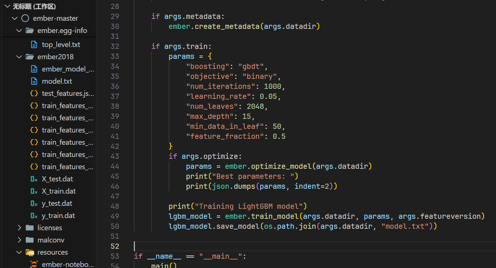

然后我们使用下面的命令，测试一下模型的效果：

```assembly
python classify_binaries.py -m ../ember2018/model.txt ../BinaryCollection/Chapter_1L/Lab01-01.exe
```

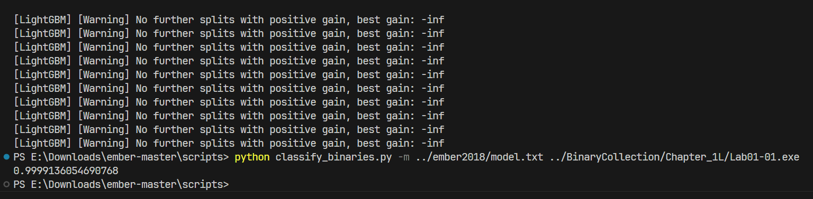

发现效果不错，有 0.9999，比复现 2 结果的 0.03 好了不知道多少！！！

### （五）使用模型的一些指标进行性能评估

这里使用 resources\ember2018-notebook.ipynb 文件来进行模型性能评估。

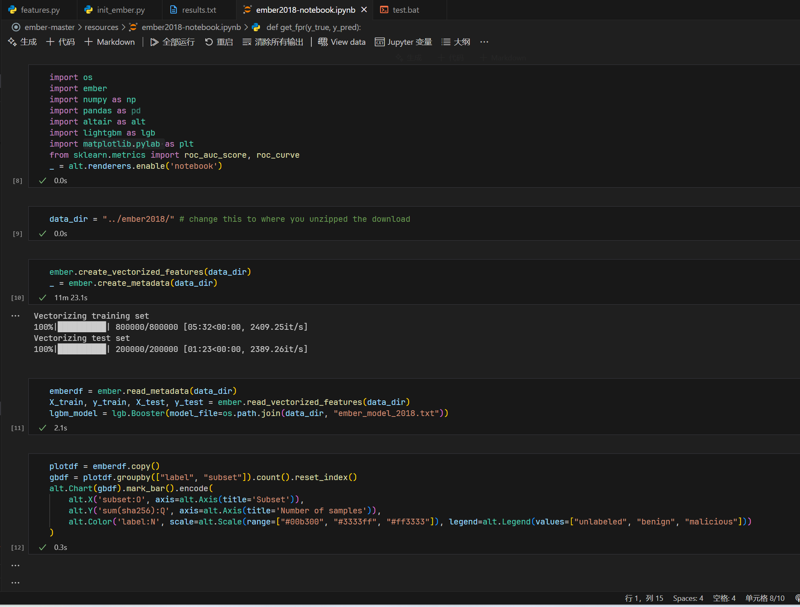

在这个代码中，我们使用了来自 **EMBER 2018** 数据集的特征，并应用了一个 LightGBM（Light Gradient Boosting Machine）模型来预测样本是否为恶意。代码的核心步骤涉及数据的加载、特征提取、模型训练、预测以及模型评估。下面我将逐步详细解释代码中各部分的作用，并结合准确率、精确率、召回率、F1 分数等指标进行说明。

#### 代码说明

##### 数据加载与特征提取

```python
python复制代码data_dir = "../ember2018/"  # 数据集所在的路径
ember.create_vectorized_features(data_dir)
_ = ember.create_metadata(data_dir)
```

这些代码行的作用是：

- **加载数据集**：`data_dir` 指定了存放 EMEBR 2018 数据集的目录。你需要下载并解压数据集到这个目录。
- **创建特征向量**：`ember.create_vectorized_features(data_dir)` 用于从原始的二进制文件中提取特征并保存为向量化的格式，适合模型训练。
- **创建元数据**：`ember.create_metadata(data_dir)` 生成有关数据集的信息（如文件名、标签等），并将其保存为元数据。

##### 数据预处理与模型加载

```python
python复制代码emberdf = ember.read_metadata(data_dir)
X_train, y_train, X_test, y_test = ember.read_vectorized_features(data_dir)
lgbm_model = lgb.Booster(model_file=os.path.join(data_dir, "ember_model_2018.txt"))
```

这里的代码读取了数据并加载了预训练的 LightGBM 模型：

- `ember.read_metadata(data_dir)` 读取数据的元信息，存入 DataFrame `emberdf`。
- `ember.read_vectorized_features(data_dir)` 从文件中读取训练和测试数据的特征（`X_train`, `X_test`）以及对应的标签（`y_train`, `y_test`）。
- `lgbm_model = lgb.Booster(model_file=...)` 加载了一个已训练的 LightGBM 模型文件，`ember_model_2018.txt`。

##### 数据可视化

```python
python复制代码# 使用Altair绘制不同标签样本的数量统计
plotdf = emberdf.copy()
gbdf = plotdf.groupby(["label", "subset"]).count().reset_index()
alt.Chart(gbdf).mark_bar().encode(
    alt.X('subset:O', axis=alt.Axis(title='Subset')),
    alt.Y('sum(sha256):Q', axis=alt.Axis(title='Number of samples')),
    alt.Color('label:N', scale=alt.Scale(range=["#00b300", "#3333ff", "#ff3333"]), legend=alt.Legend(values=["unlabeled", "benign", "malicious"]))
)
```

这段代码生成了一个条形图，展示了数据集中不同标签（如 benign、malicious 和 unlabeled）在不同子集（训练集、测试集等）中的分布。

##### 模型预测

```python
python复制代码y_test_pred = lgbm_model.predict(X_test)
y_train_pred = lgbm_model.predict(X_train)
emberdf["y_pred"] = np.hstack((y_train_pred, y_test_pred))
```

使用训练好的 LightGBM 模型对测试集（`X_test`）和训练集（`X_train`）进行预测。将预测结果存储到 DataFrame 中（`emberdf["y_pred"]`）。

##### 评估模型性能

接下来，我们使用不同的指标来评估模型的性能，具体包括 **False Positive Rate (FPR)**、**False Negative Rate (FNR)**、**Detection Rate** 等。

###### 计算 FPR 和 FNR：

```python
python复制代码def get_fpr(y_true, y_pred):
    nbenign = (y_true == 0).sum()  # 真实标签为 benign 的数量
    nfalse = (y_pred[y_true == 0] == 1).sum()  # 预测为恶意的 benign 样本数量
    return nfalse / float(nbenign)
```

`get_fpr` 函数计算假阳性率（FPR），即所有实际是 benign 样本中被错误预测为恶意的比例。

###### 计算阈值并输出模型在特定 FPR 下的性能：

```python
python复制代码def find_threshold(y_true, y_pred, fpr_target):
    thresh = 0.0
    fpr = get_fpr(y_true, y_pred > thresh)
    while fpr > fpr_target and thresh < 1.0:
        thresh += 0.0001
        fpr = get_fpr(y_true, y_pred > thresh)
    return thresh, fpr
```

`find_threshold` 函数根据目标假阳性率（FPR）来查找一个合适的预测阈值。通过调整阈值，直到模型的假阳性率降到目标值以下。

###### 输出在不同假阳性率下的性能：

```python
python复制代码threshold, fpr = find_threshold(testdf.label, testdf.y_pred, 0.01)
fnr = (testdf.y_pred[testdf.label == 1] < threshold).sum() / float((testdf.label == 1).sum())
```

在 FPR 为 1% 时，输出模型的 **假阳性率**、**假阴性率** 和 **检测率**（Detection Rate）。

###### 绘制 ROC 曲线：

```python
python复制代码plt.figure(figsize=(8, 8))
fpr_plot, tpr_plot, _ = roc_curve(testdf.label, testdf.y_pred)
plt.plot(fpr_plot, tpr_plot, lw=4, color='k')
```

使用 `roc_curve` 绘制接收操作特征曲线（ROC），并标记出不同的阈值对应的 **假阳性率** 和 **真正率**（True Positive Rate，TPR）。

##### 模型输出分数分布

```python
python复制代码fig = plt.figure(figsize=(8, 8))
testdf[testdf["label"] == 0].y_pred.hist(range=[0, 1], bins=10, color="#3333ff", alpha=0.8, label="benign")
testdf[testdf["label"] == 1].y_pred.hist(range=[0, 1], bins=10, color="#ff3333", alpha=0.8, label="malicious")
```

通过直方图显示模型对恶意和正常样本的预测分数分布，帮助理解模型对不同类别的预测能力。

#### 模型评估指标

1. **准确率 (Accuracy)**：

	计算公式为：

	$\text{Accuracy} = \frac{\text{TP} + \text{TN}}{\text{TP} + \text{TN} + \text{FP} + \text{FN}}$

	在模型的整体表现中，准确率反映了模型正确分类的比例。

2. **精确率 (Precision)**：

	计算公式为：

	$\text{Precision} = \frac{\text{TP}}{\text{TP} + \text{FP}}$

	精确率衡量的是预测为恶意的样本中，有多少是真正恶意的。

3. **召回率 (Recall)**：

	计算公式为：

	$\text{Recall} = \frac{\text{TP}}{\text{TP} + \text{FN}}$

	召回率反映了模型对恶意样本的识别能力。

4. **F1 分数 (F1-score)**：

	计算公式为：

	$\text{F1} = 2 \times \frac{\text{Precision} \times \text{Recall}}{\text{Precision} + \text{Recall}}$

	F1 分数是精确率和召回率的调和平均数，综合了二者的平衡。

总的来说，此代码使用 LightGBM 对恶意软件进行分类，并结合多个评估指标（如 FPR、FNR、检测率、ROC 曲线等）评估模型在不同阈值下的表现。通过这些指标，我们可以更加全面地了解模型在安全领域中的表现。

#### 评估结果

安装好相关的依赖包之后，直接全部运行，结果如下：

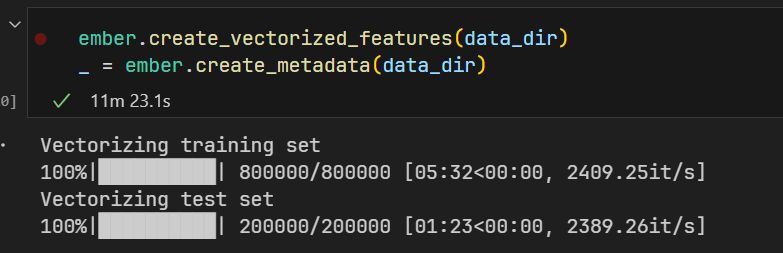

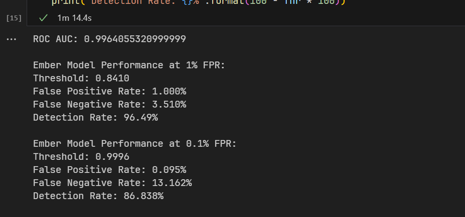

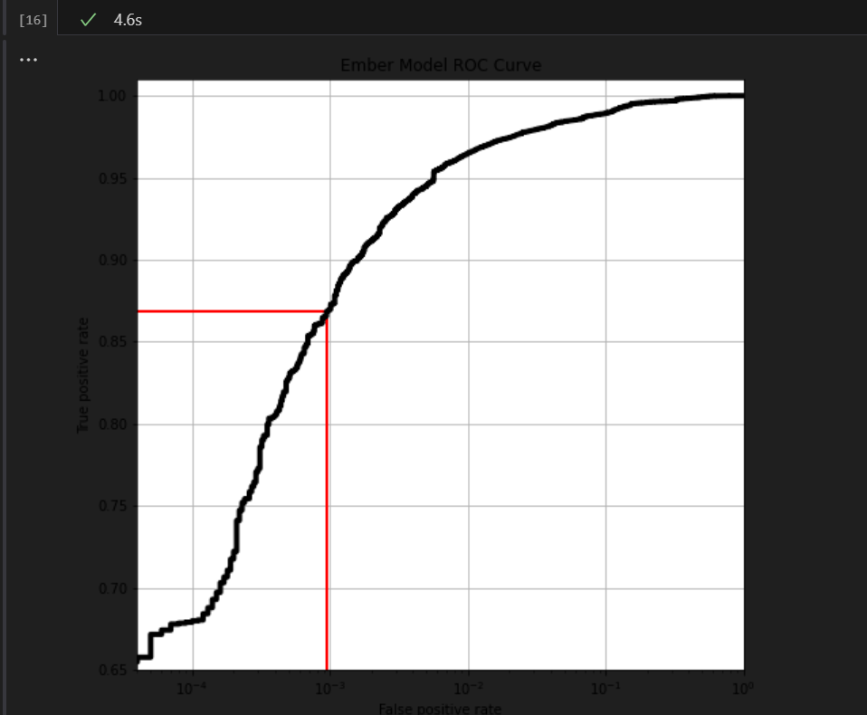

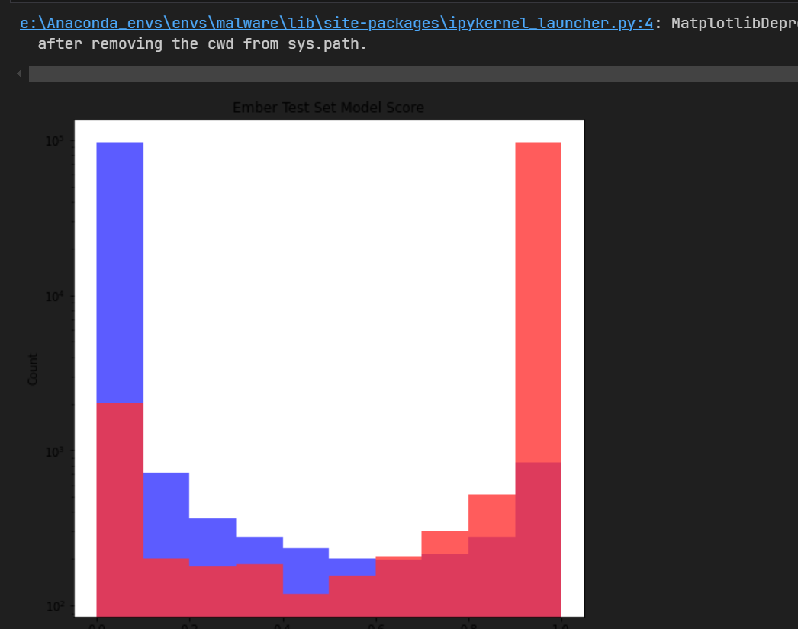

##### （1）性能评估指标分析

###### ROC AUC

模型整体 AUC 为 0.9964，说明分类能力极强，能够很好地区分恶意和良性样本。

###### 在 1% FPR 时的表现

- 阈值：0.8410  
- 误报率(FPR)：1.000%  
- 漏报率(FN)：3.510%  
- 检测率(DR)：96.49%  

在保持较低误报的同时，仍能检测到约 96.49%的恶意样本。

###### 在 0.1% FPR 时的表现

- 阈值：0.9996  
- 误报率(FPR)：0.095%  
- 漏报率(FN)：13.162%  
- 检测率(DR)：86.838%  

尽管误报降至极低，但漏报率上升，检测率仍保持在 86.84%左右。

##### （2）分数分布图分析

###### 分布特征

- 良性样本(蓝色)

	大多集中在 0 分附近；

	分布非常集中，表明模型对良性软件有很强的识别能力；

	极少数样本的得分在中间区域，说明存在少量难以判定的情况。

- 恶意样本(红色)

	主要集中在 1 分附近；

	分布同样很集中，显示模型对恶意软件也有很强的识别能力；

	中间区域样本很少，表明模型的判断很明确。

###### 分布特点

明显的双峰分布；

两类样本的分数分布几乎完全分离；

中间地带(0.2-0.8)的样本极少，说明模型判断非常果断；

这种分布对实际应用非常有利，便于设置分类阈值。

##### （3）分数分布与阈值选择

可以在约 0.84 阈值处实现高检出率并维持可接受的误报； 

若对误报敏感，可提高阈值至 0.9996，但需承担漏报明显上升的代价。

##### （4）模型优势与局限性

- **优势：** AUC 高，能在不同 FPR 设定下灵活选择阈值，兼顾误报与漏报。  
- **局限：** 极低误报时，检测率降幅明显；在实际应用中需平衡业务需求与安全风险。

### （六）使用恶意代码实验的样本测试

为了快速测试，我编写了一个 bat 脚本，主要就是遍历文件夹中的所有 PEwj（exe 和 dll），对于每一个样本，都使用 classify_binaries.py 文件和 model.txt 进行测试：

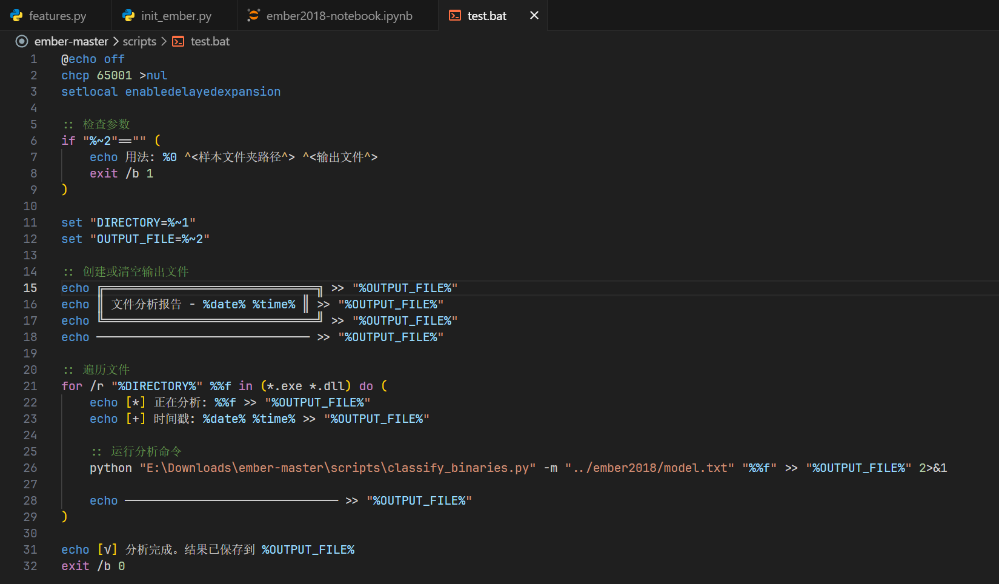

使用如下命令执行这个 test.bat 脚本：

```assembly
test.bat "E:\Downloads\ember-master\BinaryCollection" "results.txt"
```

命令行界面输出如下（那个错误是由于输出的原因，无伤大雅）：

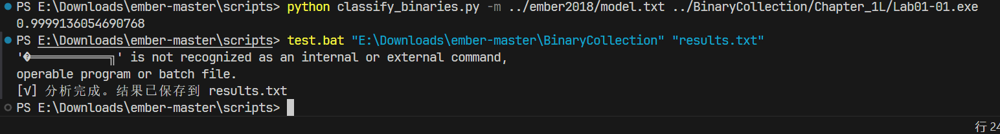

生成的 result.txt 如下图所示，总共有 244 行，对应了文件夹中的所有文件：

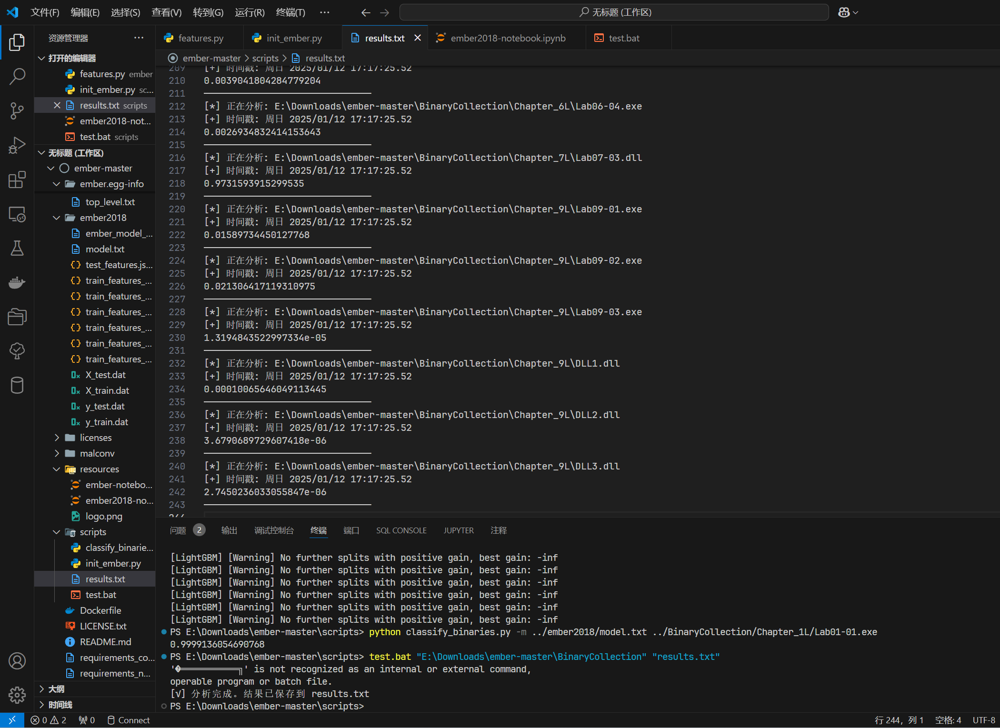

仔细观察，发现准确率还不错（需要注意，恶意代码实验中的并非所有代码都是恶意代码）：

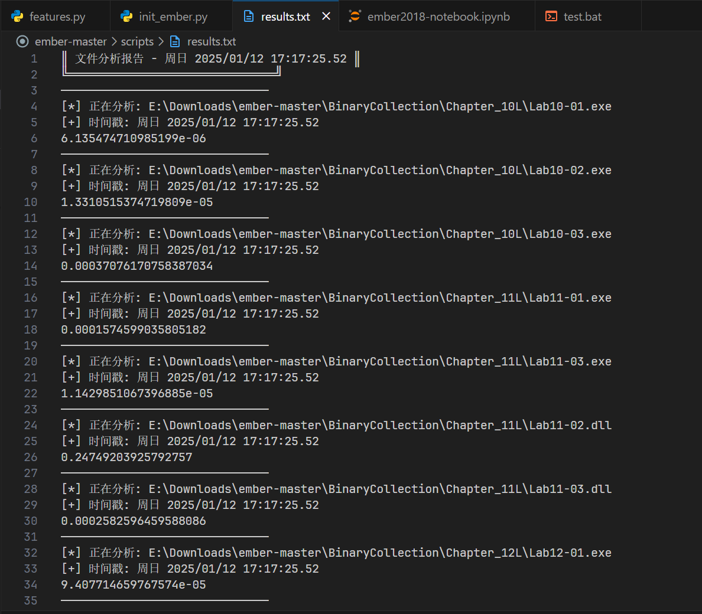

## 四、数据集分析

### 数据说明

在制作 EMBER 数据集时，考虑了几个实际用例和研究，包括以下内容。

- **比较恶意软件检测模型的性能**：该数据集为评估不同机器学习模型在恶意软件检测任务中的表现提供了基准，特别是用于恶意软件样本分类的各种特征工程技术。
- **量化模型退化与概念漂移**：恶意软件随时间变化可能影响模型的检测效果，EMBER 数据集的设计考虑了恶意软件的长期变化，能够帮助量化模型退化以及随着时间推移出现的概念漂移问题。
- **研究可解释的机器学习**：通过深入分析特征对模型判断的贡献，EMBER 数据集为可解释的机器学习研究提供了一个极好的实践平台，特别是在恶意软件检测中的应用。
- **比较恶意软件分类的特征**：为研究人员提供了多维度的特征选择空间，尤其是一些在 EMBER 数据集中独特的新特征，能够比较和评估不同特征集对恶意软件分类任务的影响。
- **端到端深度学习与传统特征工程的对比**：通过与端到端深度学习方法进行对比，评估传统机器学习模型结合特征工程的效果。
- **恶意软件的对抗性攻击与防御**：为研究恶意软件检测系统如何应对对抗性攻击提供了基础数据，能够测试和验证各种防御策略。
- **半监督学习与无监督学习**：该数据集包含未标记的样本，提供了半监督学习和无监督学习的研究机会，尤其是在恶意软件分类领域，这部分内容的研究仍相对较少。

基于上述目标，EMBER 数据集的设计保证了其在不同研究方向中的广泛适用性，同时也为机器学习模型的训练与评估提供了充分的挑战和实验条件。

### 数据布局

EMBER 数据集由一系列 **JSON 行文件** 组成，每行代表一个恶意软件样本，并包含多个字段以描述该样本的特征。每个 JSON 对象包括以下关键信息：

- **sha256 哈希值**：每个样本都由一个独特的 **sha256 哈希值** 进行标识，确保了文件的唯一性和可追溯性。
- **时间戳**：提供了文件首次出现的大致时间，通常以 **月份为单位**，有助于分析恶意软件随时间的变化。
- **标签**：每个样本都附带一个标签，表示文件的恶意性质。标签值为 **0** 表示良性文件，**1** 表示恶意文件，**-1** 表示未标记文件，后者通常用于半监督学习或对抗性研究。
- **特征集**：每个文件都配有多组 **原始特征**，涵盖了文件的解析特性和与文件格式无关的统计数据（例如字节直方图、字符串计数等）。这些特征进一步被转化为适合机器学习模型训练的特征向量。

数据集中的每个文件都代表了一个完整的恶意软件样本，包含丰富的元数据和详细的特征信息。这些特征信息通过专门的处理代码，转化为适合机器学习模型输入的数字化特征向量。

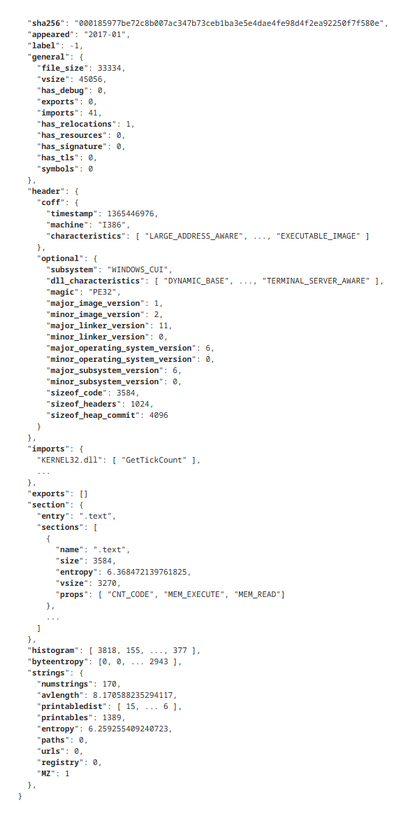

从单个 PE 文件中提取的原始特征：

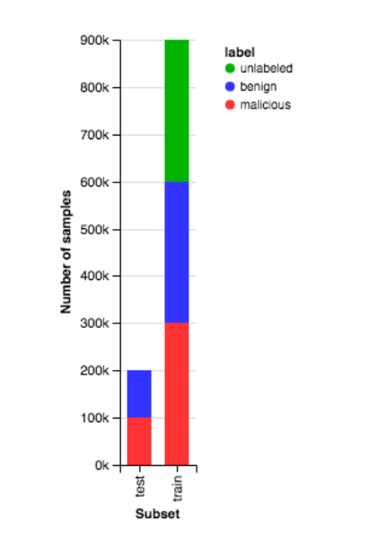

恶意、良性和未标记样本在训练集和测试集中的分布：


### 功能集描述

EMBER 数据集包含八组原始特征，这些特征能够帮助模型理解文件的结构、行为以及潜在的恶意特征。以下是对各类特征的详细描述：

#### 1. 解析特征

这些特征通过解析 PE 文件格式（Windows 可执行文件格式）获得，能够提供有关文件结构、依赖库、函数等详细信息。具体特征类别包括：

（1）**一般文件信息**：

- 该类别包括文件的基本信息，如虚拟文件大小、导入和导出函数的数量、是否包含调试信息、是否有线程本地存储（TLS）、是否包含资源段、是否有重定位、是否签名等。
- 还包括文件符号的数量，指示了文件是否被调试过，或者是否可能具有某些隐藏的恶意代码特征。

（2）**标头信息**：

- 提供从 COFF（通用对象文件格式）标头中提取的信息，包括时间戳、目标机器类型、图像特征列表等。
- 还包括从可选标头中提取的信息，如目标子系统、DLL 特征、文件魔法（如 "PE32"）、版本信息、链接器版本、子系统版本等。
- 这些特征能够揭示恶意软件文件的构建环境和可能的异常行为模式。

（3）**导入函数**：

- 该类别记录文件所依赖的动态链接库（DLL）和每个库中使用的具体函数。例如，`kernel32.dll:CreateFileMappingA` 表示该文件可能与系统文件的某些函数进行交互。
- 这些导入函数的集合经过特征散列处理，能够有效压缩并提取文件的关键行为信息。

（4）**导出函数**：

- 记录该文件导出的函数列表，展示该文件可能暴露的接口或功能。
- 通过对这些导出函数名称的散列处理，可以将其转化为模型特征。

（5）**部分信息（Section Information）**：

- 记录文件每个部分的属性，包括部分名称、大小、熵值、虚拟大小等信息。不同部分的特点（例如代码段、数据段等）可能与文件的恶意行为有关。
- 入口点和其他相关部分的信息也可以提供潜在的恶意指示。

#### 2. 与格式无关的特征

除了解析 PE 文件的特征外，EMBER 数据集还提供了与文件格式无关的特征，这些特征同样适用于任何类型的二进制文件，不依赖于特定格式的解析。具体包括：

（1）**字节直方图**：

- 该特征记录文件中每个字节值（0-255）出现的次数。直方图能够反映文件内容的统计特征，帮助模型识别文件中的异常模式。
- 通过归一化处理，字节直方图可以更好地与文件的其他特征结合，揭示文件可能的恶意行为。

（2）**字节熵直方图**：

- 该特征计算文件中字节的熵分布，熵值反映了文件内容的复杂性和随机性。恶意文件通常具有不同于良性文件的熵分布特征，尤其是在加密或压缩的文件中。
- 字节熵直方图通过计算滑动窗口内的熵值，并将熵与字节值配对，生成一个联合分布，进一步揭示文件的潜在威胁。

（3）**字符串信息**：

- 提供有关文件中可打印字符串的统计信息，包括字符串的总数、平均长度、字符熵等。尤其关注包含至少五个字符的字符串，因为这通常指示文件中嵌入的有效信息或代码。
- 另外，特殊字符串模式（如路径 `C:\`、URL `http://`、`https://`、注册表项 `HKEY_` 等）可以帮助模型识别文件是否与常见的恶意软件行为相关。

### 数据标记与元数据

所有 EMBER 数据集中的文件都根据其恶意性被标记为 **良性（0）**、**恶意（1）** 或 **未标记（-1）**。恶意文件是基于多个安全厂商（如 VirusTotal）报告的恶意软件样本来标记的，这些恶意文件至少有 40 家厂商报告为恶意。良性文件在 VirusTotal 上没有被标记为恶意，确保其为清洁文件。

每个文件的 **sha256 哈希值** 被保留在数据集中，确保文件能够被追踪和验证。通过这种哈希值，研究人员可以与其他外部数据库（如 VirusShare）进行比对，进一步丰富恶意软件的分析上下文。

### 训练与测试集划分

为了模拟现实环境中的恶意软件演化，EMBER 数据集对样本进行了时间上的划分，训练集和测试集存在时间上的差异。这种拆分方式旨在模拟恶意软件随着时间的推移不断演变的情况，帮助研究人员评估模型对未来未知恶意软件的检测能力。

### 数据的可用性与研究潜力

EMBER 数据集不仅适用于传统的机器学习模型训练，也为多个研究领域提供了宝贵的数据支持：

- **半监督学习**：由于数据集中包含未标记样本，研究人员可以使用半监督学习方法对模型进行训练，以提高模型对未知恶意软件的检测能力。
- **对抗性攻击与防御**：研究者可以利用该数据集测试恶意软件检测系统的鲁棒性，并研究如何防御针对这些系统的对抗性攻击。
- **模型可解释性**：通过对数据集中的特征进行深入分析，研究人员能够揭示恶意软件检测模型的内部工作机制，提高模型的透明度和可解释性。

## 五、代码分析

### （一）关键部分分析：ByteEntropyHistogram 特征提取

在 EMBER 数据集中，**ByteEntropyHistogram** 是一种基于文件字节数据的特征提取方法，主要用于提取 PE（Portable Executable）文件中的信息熵（Entropy）特征。这一方法通过对文件内容应用滑动窗口技术，计算窗口内字节数据的熵值和直方图，并根据这些统计特征构建一个高维的特征向量。该特征被广泛应用于恶意软件检测，因为它能够捕捉到二进制文件中数据分布的细节，进而揭示潜在的恶意行为模式。

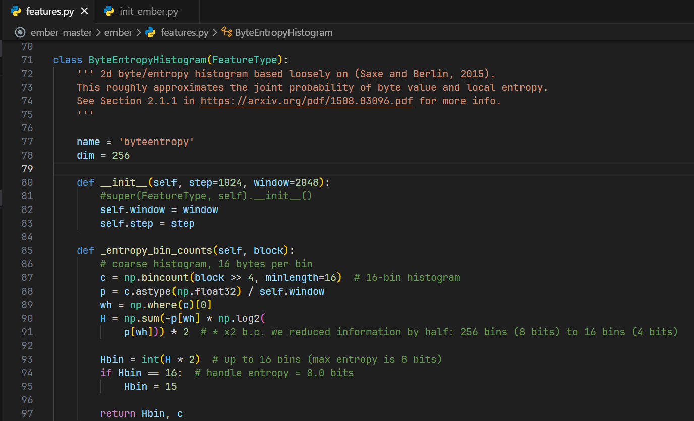

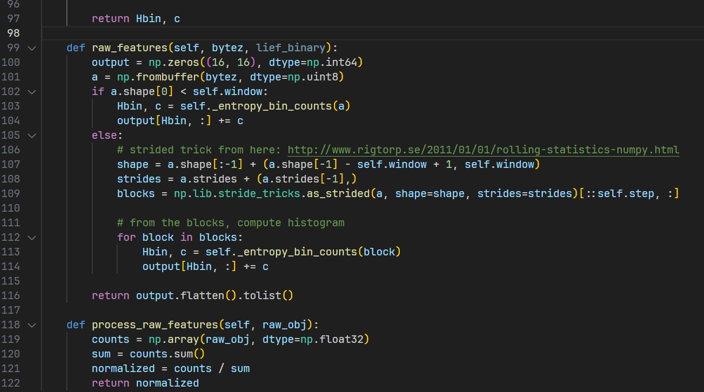

#### 1. **ByteEntropyHistogram 的概述**

ByteEntropyHistogram 通过将文件内容划分为多个重叠的滑动窗口，每个窗口内的字节数据会经过处理，提取出信息熵和字节频率分布等特征。这些特征最终汇总成一个 256 维的特征向量，用于表示整个文件的特征。

#### 2. **ByteEntropyHistogram 特征提取过程详解**

下面详细分析其实现过程，重点关注两个关键函数：`_entropy_bin_counts(block)` 和 `raw_features(bytez)`。

##### 2.1 `_entropy_bin_counts(block)` 函数

该函数的作用是对给定的一个字节数组（block）计算信息熵和频率直方图。具体步骤如下：

- **输入参数**：`block` 是一个字节数组（numpy 数组，类型为 `np.uint8`），代表滑动窗口内的二进制数据。

- **步骤 1**：**右移操作 (`block >> 4`)** 该操作是对字节数组中的每个数据元素进行位移，即将每个字节右移 4 位。通过右移操作，字节数据的范围从 0-255 被压缩到 0-15。这样可以减少数据的维度，同时保留重要的统计信息。具体来说，右移 4 位相当于每个字节值除以 16，因此高 4 位保留，低 4 位被丢弃。

	例如，对于输入字节数据：

	```python
	bytez = b'MZ\x90\x00\x03\x00\x00\x00\x04'
	block = np.frombuffer(bytez, dtype=np.uint8)
	print(block)  # 输出：[ 77,  90, 144,   0,   3,   0,   0,   0,   4]
	block = block >> 4
	print(block)  # 输出：[4, 5, 9, 0, 0, 0, 0, 0, 0]
	```

- **步骤 2**：**统计出现次数 (`np.bincount(block >> 4, minlength=16)`)** 使用 `np.bincount` 统计每个字节（0-15）出现的次数，返回一个长度为 16 的数组，表示各个数字（0-15）的频率分布。

	例如，经过右移后，假设 `block` 为 `[4, 5, 9, 0, 0, 0, 0, 0, 0]`，则其直方图统计结果为：

	```python
	c = np.bincount(block >> 4, minlength=16)
	print(c)  # 输出：[1, 0, 0, 0, 1, 1, 0, 0, 0, 1, 0, 0, 0, 0, 0, 0]
	```

- **步骤 3**：**计算信息熵** 使用计算公式 `H = -∑(p * log2(p))` 计算信息熵，其中 `p` 是各个字节值的出现概率。然后将信息熵放大 4 倍（因为我们将字节压缩为 16 个桶）。

	```python
	p = c.astype(np.float32) / self.window  # 计算每个数据的概率
	wh = np.where(c)[0]  # 获取非零元素的索引
	H = np.sum(-p[wh] * np.log2(p[wh])) * 2  # 计算信息熵并放大
	```

	这里的信息熵值被放大 4 倍，并且最大值被限制为 15（表示最大熵值为 8 位，即 `log2(16)`）。最终返回的 `Hbin` 为一个介于 0 到 15 之间的整数，表示熵值的量化结果。

##### 2.2 `raw_features(bytez)` 函数

`raw_features` 函数的主要作用是通过滑动窗口将整个文件数据分割成多个块，并计算每个块的熵值和直方图。具体步骤如下：

- **步骤 1**：**初始化输出矩阵** 创建一个 16x16 的二维数组 `output` 用于存储每个熵值对应的直方图统计结果：

	```python
	output = np.zeros((16, 16), dtype=np.int32)
	```

- **步骤 2**：**文件数据转换** 使用 `np.frombuffer` 将字节数据（bytez）转换为 `np.uint8` 格式的数组，确保每个字节的数据值在 0 到 255 之间：

	```python
	a = np.frombuffer(bytez, dtype=np.uint8)
	```

- **步骤 3**：**滑动窗口分块** 如果文件字节数大于窗口大小（默认为 2048 字节），则使用滑动窗口技术将文件划分为多个重叠的块，每个块大小为 2048 字节，步长为 1024 字节。通过 `np.lib.stride_tricks.as_strided` 创建滑动窗口：

	```python
	shape = a.shape[:-1] + (a.shape[-1] - self.window + 1, self.window)
	strides = a.strides + (a.strides[-1],)
	blocks = np.lib.stride_tricks.as_strided(a, shape=shape, strides=strides)[::self.step, :]
	```

- **步骤 4**：**处理每个窗口的特征** 对每个滑动窗口中的字节数据，调用 `_entropy_bin_counts` 函数计算熵值 `Hbin` 和直方图向量 `c`，并将其累加到对应的 `output` 矩阵中：

	```python
	for block in blocks:
	    Hbin, c = self._entropy_bin_counts(block)
	    output[Hbin, :] += c
	```

- **步骤 5**：**返回结果** 将 16x16 的矩阵 `output` 展平为一个 256 维的一维数组，并作为最终的特征向量返回：

	```python
	return output.flatten().tolist()
	```

##### 2.3 特征归一化

在最终返回特征向量前，`process_raw_features` 函数会对提取的特征进行归一化处理，确保每个特征值在整体特征向量中占有适当的权重：

```python
counts = np.array(raw_obj, dtype=np.float32)
sum = counts.sum()  # 求和
normalized = counts / sum  # 对每个值进行归一化
return normalized
```

归一化的目的是避免某些特征因值域过大而主导模型的训练过程。

#### 3. **总结**

ByteEntropyHistogram 特征提取方法通过对 PE 文件字节数据应用滑动窗口技术，计算窗口内字节的频率直方图和信息熵，构建了一个具有较高区分力的特征向量。该特征的计算过程涉及对数据的模糊化处理（通过右移操作）、熵值计算和直方图统计，最终输出一个 256 维的特征向量。通过这种方式，能够有效捕捉文件内容中的统计特性，对于恶意软件的检测和分类具有重要的应用价值。

### （二）整体结构分析

#### 3.1 上层接口

模型训练过程的上层接口主要体现在 `init_ember.py` 中，其中包括了对命令行参数的解析、数据准备、元数据生成、模型训练和优化的功能。下面是具体的步骤分析：

1. **导入和参数解析** 使用 `argparse` 模块来处理命令行输入的参数。主要参数包括：

	- `-v/--featureversion`：特征版本号，默认为 2
	- `-m/--metadata`：是否生成元数据 CSV 文件
	- `-t/--train`：是否训练模型
	- `datadir`：原始特征文件目录
	- `--optimize`：是否使用网格搜索来优化模型参数

	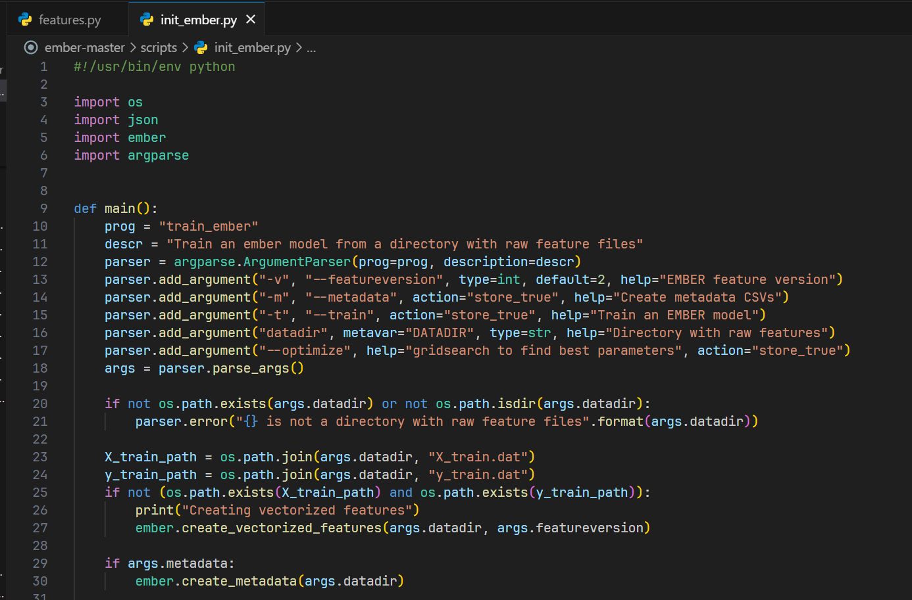

2. **数据准备阶段** 在数据准备阶段，首先检查是否已存在训练数据的特征文件，如果不存在，则调用 `ember.create_vectorized_features()` 来生成这些特征文件。

	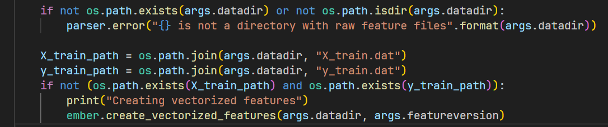

3. **元数据生成** 如果命令行参数指定了生成元数据（`args.metadata`），则调用 `ember.create_metadata()` 来生成 CSV 格式的元数据文件。

	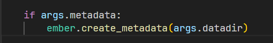

4. **模型训练** 如果指定了训练（`args.train`），会定义 LightGBM 模型的默认参数并开始训练模型，参数包括：

	- 使用梯度提升决策树（GBDT）
	- 二分类目标
	- 1000 次迭代
	- 0.05 的学习率
	- 最大深度为 15，其他超参数也一并定义

	

5. **参数优化和模型保存** 如果指定了 `--optimize`，则会进行模型的参数优化，使用网格搜索来寻找最佳的模型参数。训练后，模型会被保存到文件中。

	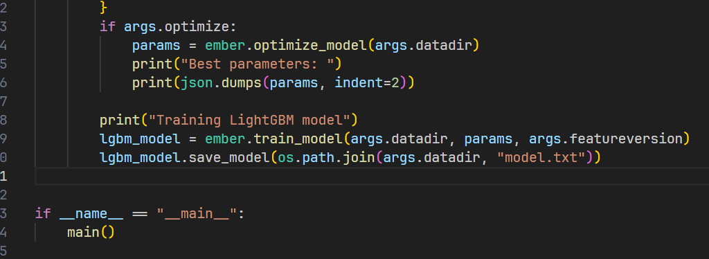

#### 3.2 特征提取

`EMBER` 框架的特征提取部分位于 `ember/ember` 文件夹内的两个主要脚本中，特别是 `features.py` 和其他核心实现部分。系统的特征提取模块设计如下：

1. **系统总体设计**

	- 该系统主要用于 PE 文件（Windows 可执行文件）的恶意软件检测。
	- 系统采用模块化设计，各个特征提取器作为独立模块存在，可以单独维护和扩展。
	- 特征提取通过继承基类 `FeatureType` 实现，`PEFeatureExtractor` 类管理特征提取器，协调特征提取流程。

	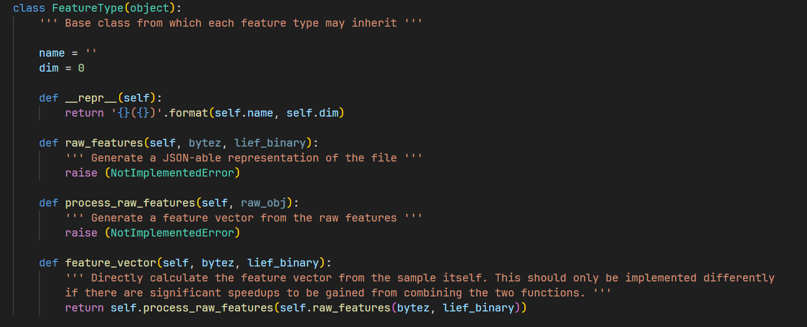

	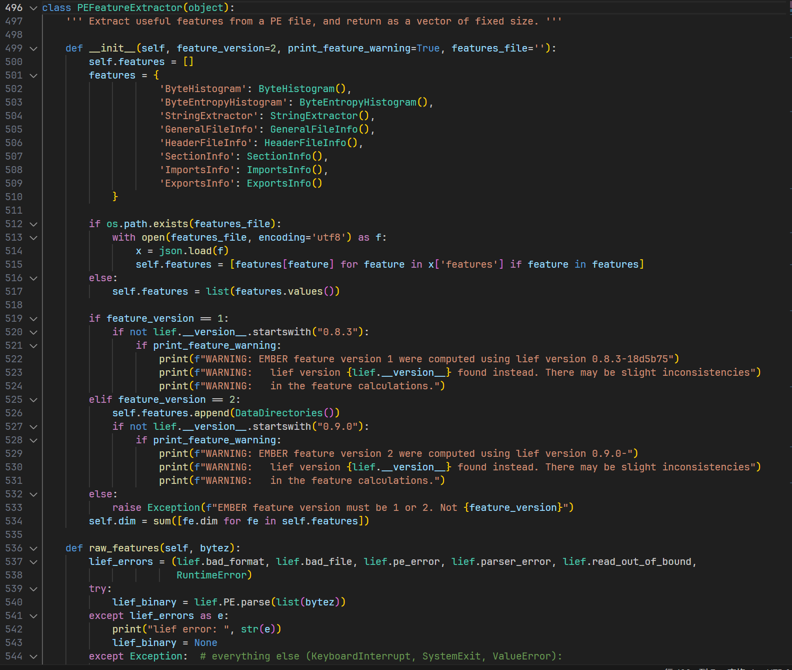

2. **核心特征提取器** 特征提取器包括字节级分析、字符串特征提取、PE 文件头部信息、节信息、导入和导出表信息等。以下是各个特征提取器的详细设计：

	- **ByteHistogram**：字节频率分布分析，统计文件中每个字节的出现次数，生成 256 维特征向量。

	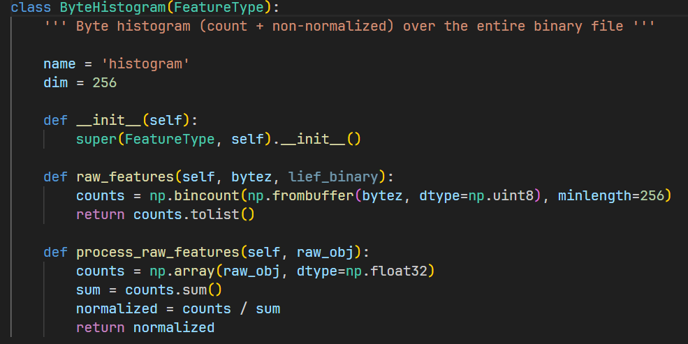

	- **ByteEntropyHistogram**：熵值分布分析，使用滑动窗口计算局部熵值，用于识别混淆和加壳技术。

		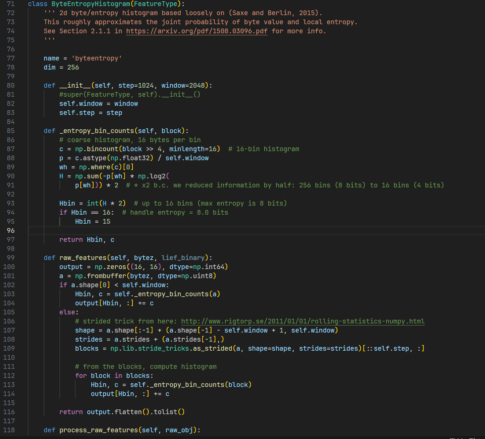

	- **StringExtractor**：字符串特征分析，提取文件中可打印字符串，如文件路径、URL、注册表项等。

		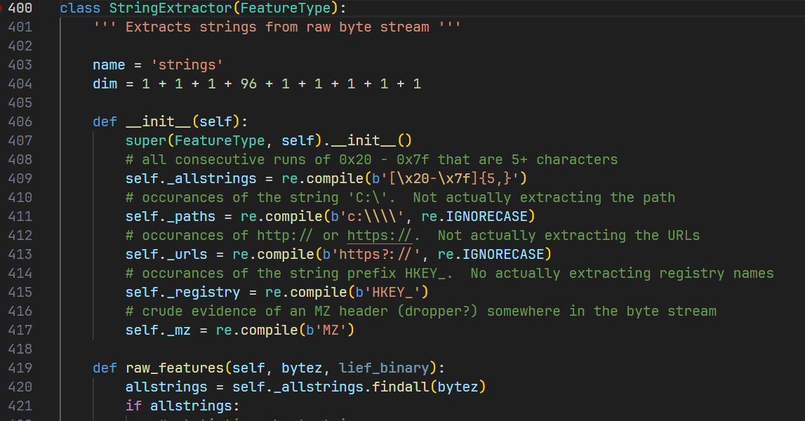

	- **GeneralFileInfo**：基本文件信息提取，包括文件大小、虚拟大小、调试信息、导入导出函数等。

		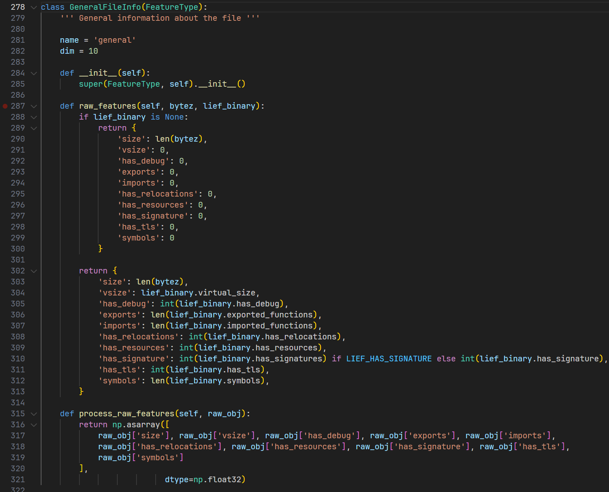

	- **HeaderFileInfo**：PE 文件头部信息提取，获取 COFF 文件头和可选头部的详细信息。

		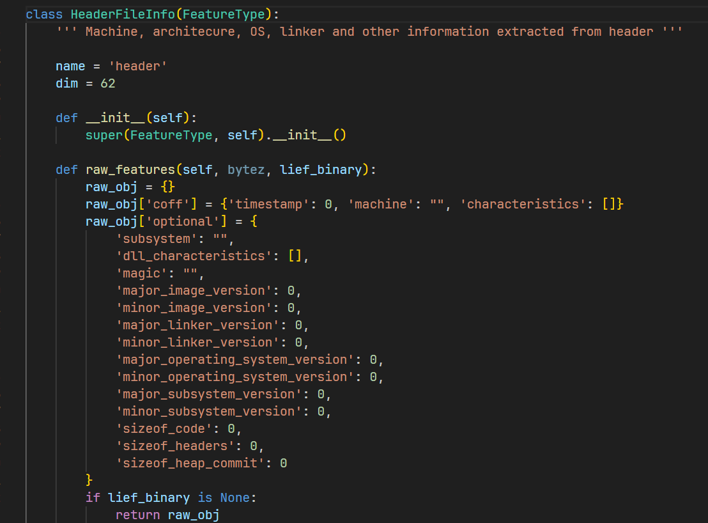

	- **SectionInfo**：PE 节信息提取，分析各个节的基本信息、熵值、虚拟大小等。

		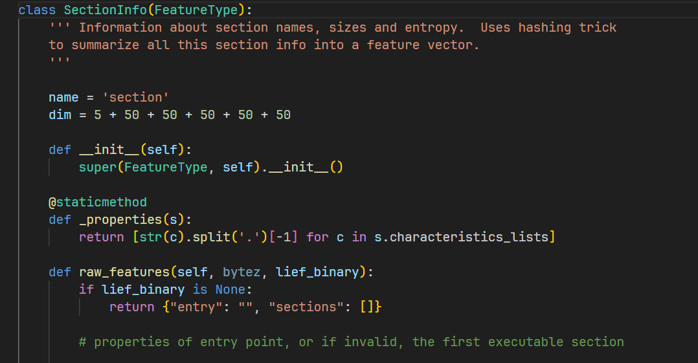

	- **ImportsInfo**：导入表分析，提取程序导入的库和函数信息。

		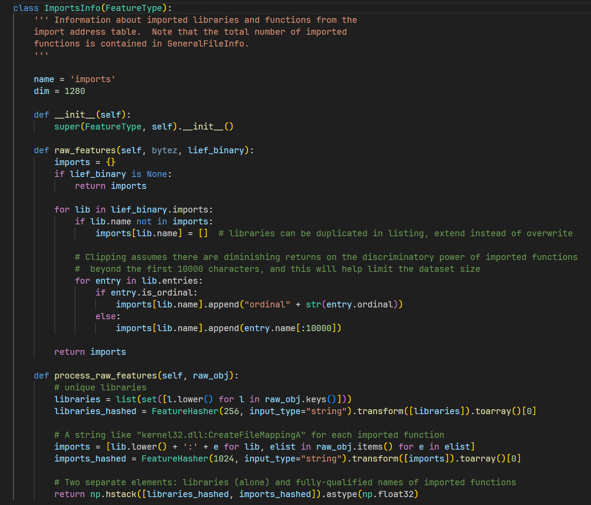

	- **ExportsInfo**：导出表分析，提取程序导出的函数信息。

		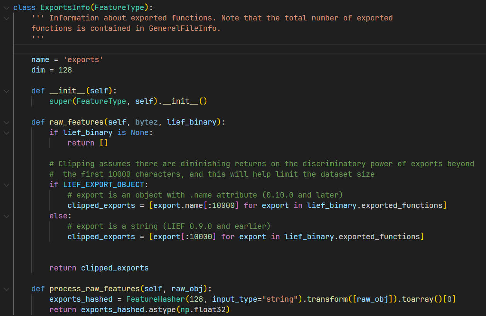

3. **特征处理与集成** 系统通过三个阶段来处理特征：原始特征提取、特征向量化和特征集成。

	- 在原始特征提取阶段，使用 LIEF 库解析 PE 文件，提取特征数据。
	- 特征向量化阶段，将提取的特征转换为数值向量，并处理缺失值。
	- 特征集成阶段，使用 `numpy.hstack` 将不同特征的向量合并，确保维度一致。

#### 3.3 EMBER PE 文件特征向量化与模型训练

1. **数据处理与向量化设计** 特征向量化过程中使用了高效的多进程并行处理和内存映射技术，以处理大规模数据集。系统实现了迭代器模式来逐步读取原始特征文件，并通过内存映射文件存储特征矩阵，从而避免内存过度占用。

	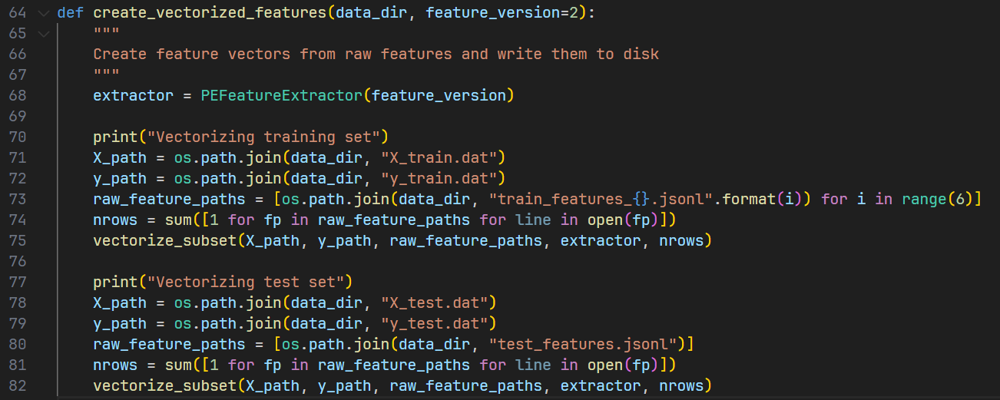

2. **特征数据管理与元数据处理** 数据管理模块分层设计，将数据存取、特征处理和元数据管理分离。内存映射技术支持高效的特征访问，pandas 用于处理结构化的元数据。元数据包括每个样本的 SHA256 哈希值、首次出现时间、标签等，便于后续分析和模型评估。

	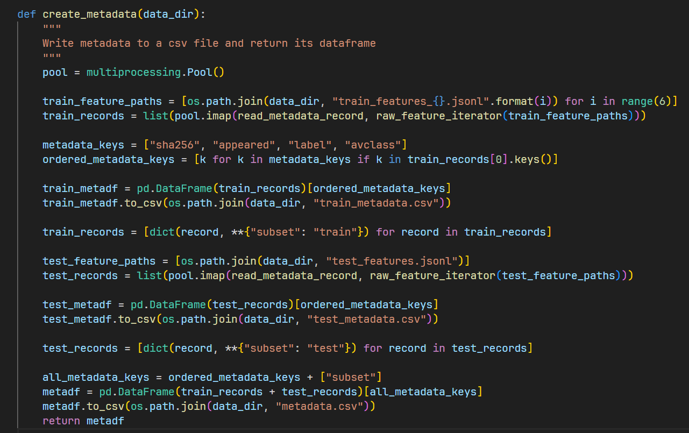

3. **模型训练与优化** 采用 LightGBM 作为模型训练工具，并且实现了网格搜索方法来优化模型参数。训练过程关注低误报率，通过使用时间序列交叉验证来确保模型的时间泛化性能。参数优化过程包括：

	- 使用 `make_scorer` 定义关注低 FPR 区域的 AUC 评分函数

	- 使用网格搜索方法来寻找最佳参数

		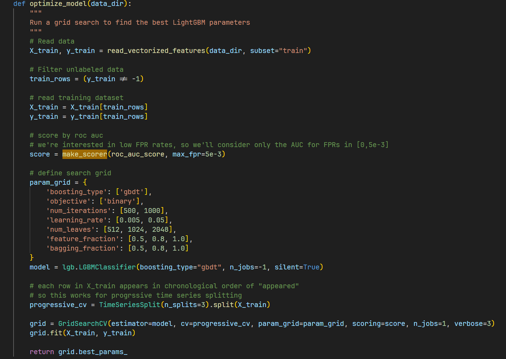

4. **LightGBM 算法实现**

	- **算法原理与架构**：LightGBM 是一种高效的梯度提升框架，采用直方图算法和 Leaf-wise 树生长策略，大大提高了训练效率。

	- **直方图优化与特征处理**：通过直方图算法来优化特征分割，减少内存消耗，并加速计算过程。

	- **Leaf-wise 树生长策略**：相比传统的 Level-wise 树生长，Leaf-wise 树生长策略能够减少分裂次数并提升模型精度。

		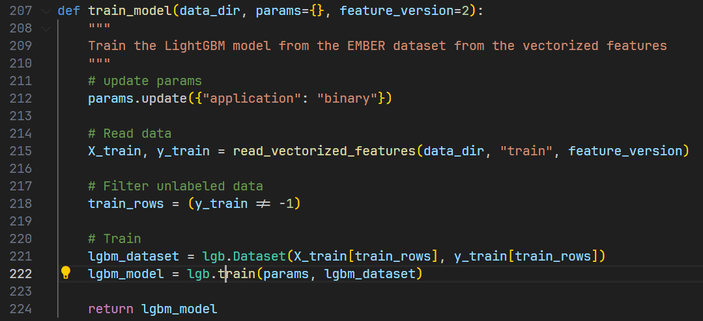

整个 `EMBER` 框架具有高度的模块化和扩展性，采用了高效的特征提取和数据处理技术，特别适用于大规模恶意软件检测任务。系统通过精细的特征提取、向量化、以及 LightGBM 模型训练和优化，提供了一个可扩展且高效的恶意软件检测解决方案。

## 六、实验结论及心得体会

---

### 实验结论

1. **恶意软件检测性能**：借助 EMBER 框架对 PE 文件进行静态分析特征提取，并运用 LightGBM 模型训练，实验结果显示，基于特征向量的机器学习方法可有效甄别恶意软件与正常程序。经一系列特征提取与优化训练，最终模型于多个数据集展现出良好分类性能。具体而言，模型的 AUC 在恶意软件检测中表现突出，于控制低误报率区域时，能在假阳性较少的情况下达成较高召回率与准确率。采用时间序列交叉验证，使模型面对现实世界的时间变化时，可保持良好泛化能力，有效规避过拟合现象。此外，模型参数优化，如运用网格搜索，进一步提升了模型性能，发现的超参数配置有效增强了模型预测精度。
2. **特征提取效果**：在特征提取环节，所采用的 8 个静态特征提取器，包括字节直方图、字节熵直方图、字符串提取器等，从多维度捕捉了 PE 文件特征。各特征提取器于不同文件层面提供了有价值信息，其中字节级分析，如 ByteHistogram、ByteEntropyHistogram，揭示了文件内部结构信息，如代码加密与混淆情况；字符串提取器可检测文件中是否存在可疑字符串，如路径、URL、注册表项等，为恶意文件动态行为提供线索；文件结构分析，如 GeneralFileInfo、SectionInfo、HeaderFileInfo，展现了 PE 文件内部结构特征，恶意文件中此类信息常呈现特有的结构异常；交互分析，即 ImportsInfo、ExportsInfo，分析了文件外部依赖关系，如调用的 API 接口，此乃识别恶意文件的关键所在。这些特征的多样性与全面性为后续模型训练提供了高质量输入数据，极大提升了模型分类能力。
3. **系统性能**：系统采用的内存映射技术与多进程并行计算，在特征向量化和数据处理阶段显著提高了效率。处理大规模 PE 文件时，通过批量处理和内存优化，降低了系统内存占用，保障了高效的数据加载与存储。异常处理机制与并行计算不仅增强了系统稳定性，还确保了处理大量数据时的容错能力。各特征提取器的独立性保证了模块化设计，便于后续扩展与维护。
4. **模型训练与优化**：使用 LightGBM 进行模型训练时，经网格搜索优化超参数，找到了最佳参数配置，显著提升了模型性能。尤其在优化低误报率区域的 AUC 时，模型展现出较强的鲁棒性与实用性。时间序列交叉验证确保了模型能够应对现实场景中的数据变化，强化了模型的时间泛化能力。通过增量训练与模型更新机制，实验表明模型在应对新样本和动态数据时具备持续学习能力，可避免实际应用中的性能衰退。
5. **实验中的挑战与收获**：在 PE 文件特征提取过程中，因 PE 文件结构复杂，特别是异常文件格式的解析处理，系统需处理各类不规则或畸形文件。在此过程中，LIEF 库虽提供了极大便利，但也需应对文件格式不符标准、头部信息解析错误等特殊情况。特征选择与降维是模型训练的重要步骤，实验中虽提取了大量特征，但并非所有特征都对分类结果有显著影响，因此适当筛选和降维是提高模型效果的关键因素。

### 心得体会

1. **模块化设计的重要性**：在整个实验中，EMBER 框架的模块化设计优势显著。特征提取器的独立性使系统扩展与维护简便易行，且系统各模块，如特征提取、数据处理、模型训练等相互协作，保障了整个流程的高效与稳定。在实际恶意软件分析中，不同样本和特征表现各异，模块化设计既支持不同特征的灵活配置，又便于后续更新与调整。
2. **特征提取与机器学习结合的优势**：通过本次实验，深刻认识到特征提取与机器学习模型训练紧密相关。精心设计的特征可有效提升机器学习模型的预测能力。在恶意软件检测中，静态分析特征，如字节分布、文件结构、API 调用等，提供了有力信息支持，经合适机器学习算法，可助我们从大量样本中提取有价值模式，可见特征工程与机器学习模型结合是恶意软件检测的关键环节。
3. **数据处理和性能优化的挑战**：面对大规模 PE 文件数据时，系统内存消耗与处理速度问题不容忽视。采用内存映射文件和多进程计算有效缓解了此类问题，处理大规模数据集时，分批处理和并行计算显著提高了数据处理效率与系统响应速度，使系统在处理海量 PE 文件时仍能高效运行，这对现实环境中的恶意软件检测意义重大。
4. **模型优化与验证的实际意义**：实验中，通过网格搜索和时间序列交叉验证，可不断调整模型超参数，确保模型在不同数据集和时间区间的稳定性。此优化方法不仅提高了模型精度，还助于深入理解机器学习模型的调优过程。在实际应用中，恶意软件样本特性与分布不断变化，持续优化和验证模型是确保恶意软件检测系统可靠性的关键。
5. **实际应用中的潜力与挑战**：此次实验使我更深刻地认识到恶意软件检测系统的潜力与挑战。尽管模型和特征提取技术已取得显著进展，但在实际应用中，恶意软件样本的快速进化、加密技术、代码混淆及反分析技巧等，仍给检测系统带来巨大挑战。因此，如何结合静态分析与动态分析方法，进一步提升系统检测能力，是未来研究的重要方向。

总之，本次实验使我对恶意软件检测技术体系有了更深入理解，为今后相关领域的研究与应用积累了宝贵经验。
