<div align='center'>
<b> <font face='微软雅黑' size='6'> 计算机网络课程实验报告 </font> </b>
</div>


<div align='center'>
<b> <font font face='微软雅黑' size='6'> 实验一：利用 Socket 编写一个聊天程序 </font> </b>
</div>


<div>
<font face='宋体' size='6'>&nbsp;&nbsp;&nbsp;&nbsp; 学 院：网络空间安全学院 </font> <br>
<font face='宋体' size='6'>&nbsp;&nbsp;&nbsp;&nbsp; 专 业：信息安全 </font> <br>
<font face='宋体' size='6'>&nbsp;&nbsp;&nbsp;&nbsp; 学 号：2212998 </font> <br>
<font face='宋体' size='6'>&nbsp;&nbsp;&nbsp;&nbsp; 姓 名：胡博浩 </font> <br>
</div>
## 一、实验要求与功能

------

### （一）实验要求

1. 提供完整的聊天协议说明。
2. 使用 C 或 C++ 语言，利用基本的 Socket 函数实现，不得使用 CSocket 等封装类。
3. 使用流式套接字，采用多线程或多进程方式完成程序。
4. 提供基本的对话界面（非图形界面），并确保有正常的退出方式。
5. 支持多人聊天，能够处理英文和中文消息。
6. 代码结构清晰，具备良好的可读性。
7. 观察实验过程中是否存在数据丢失，提交可执行文件、源代码和实验报告。

### （二）自行扩展功能

1. **日志功能**：服务器保存每个客户端的聊天记录，方便后续查看。
2. **用户昵称**：支持用户设置昵称，便于区分身份。
3. **身份验证**：增加用户名和密码验证，确保用户需通过身份认证才能加入聊天室。（这里多人可以共用同一份用户名、相当于聊天室的密码）
4. **私聊功能**：支持用户间的单独私聊。
5. **优雅退出机制**：用户可通过命令退出，服务器也可通过命令关闭聊天室并通知所有用户。
6. **命令输入功能**：实现私聊、退出、获取在线用户列表、帮助等多种命令支持。
7. **优化用户体验**：提供错误提示、用户上线/离线通知及控制台颜色设置等功能，提升使用体验。

感谢老师的教导与助教的批阅，辛苦！

## 二、实验环境与说明

------

### （一）环境配置

本实验在 Windows 系统上使用 Visual Studio 进行开发，文件编码为 UTF-8（BOM）。通过 C++ 编写了服务器和客户端程序，使用了多种库函数和头文件来实现网络通信、多线程处理、文件操作及日志记录等功能。

### （二）头文件与库函数

**主要头文件：**

- **`<iostream>`**: 标准输入输出流，用于控制台信息的输入输出操作。
- **`<vector>`**: 动态数组，用于在服务器端存储客户端套接字及其映射。
- **`<thread>`**: 多线程支持，使用 `std::thread` 实现并发连接处理。
- **`<map>`**: 关联容器 `std::map`，用于保存用户 ID 与昵称的映射。
- **`<fstream>`**: 文件操作，用于服务器端日志记录。
- **`<winsock2.h>`**: Windows 下的 Socket API，用于创建、连接和传输数据。
- **`<windows.h>`**: Windows 系统调用库，控制台颜色设置等。
- **`<string>`**: 字符串操作。
- **`<ctime>`**: 时间处理，用于生成和格式化时间戳。

**关键库函数：**

- **Socket 操作**:
  - `socket()`：创建套接字。
  - `bind()`：绑定套接字到 IP 和端口。
  - `listen()`：进入监听模式。
  - `accept()`：接受客户端连接。
  - `connect()`：客户端连接到服务器。
  - `send()` 和 `recv()`：数据发送和接收。
  - `closesocket()`：关闭套接字连接。
  - `WSAStartup()` 和 `WSACleanup()`：Winsock 库初始化与清理。

- **线程操作**:
  - `std::thread`：多线程并发处理，服务器通过线程处理客户端连接。
  - `std::thread:: detach()`：将线程设置为分离模式，允许独立运行。

- **其他功能**:
  - `localtime_s()` 和 `std::strftime()`：时间戳生成和格式化。
  - `std::getline()`：读取用户输入。

## 三、协议设计

------

### （一）协议概述

本协议设计用于支持客户端与服务器之间的即时聊天通信，采用 TCP/IP 作为底层传输机制，利用 TCP 的可靠性特性，确保数据包的顺序和完整性，从而实现高效的消息传输。

### （二）协议架构

本协议遵循 **客户端-服务器模型**，多个客户端通过与服务器的连接进行交互。客户端通过特定的 IP 地址和端口发送连接请求，服务器接收该请求并进行处理，确保能够同时支持多个用户的交互。通信模式分为 **点对点（私聊）** 和 **广播（公共聊天）**，服务器负责处理消息的路由、广播以及执行客户端的命令。

### （三）消息格式

#### 1. 基本结构

每个消息包含两个主要部分：

- **消息头**：包含消息的元数据，如消息类型、发送者 ID、目标 ID、发送者昵称和时间戳，负责描述消息的基本信息。
- **消息体**：实际的消息内容，承载具体的交流信息。

#### 2. 消息类型

协议支持多种消息类型：

- **TEXT**：普通文本消息，用于日常交流。
- **PRIVATE**：私聊消息，仅发送给特定用户，保障私密性。
- **SYSTEM**：系统消息，用于发送服务器相关的通知（如欢迎消息和规则提示）。
- **COMMAND**：用于执行客户端或服务器的命令（如查询在线用户列表）。

#### 3. 字段定义

消息的字段具体定义如下：

- **type**：消息类型，4 字节（大端），枚举值。
- **senderID**：发送者 ID，4 字节（大端），唯一标识发送者。
- **targetID**：目标用户 ID，4 字节（大端），-1 表示广播。
- **nickname**：发送者昵称，50 字节（大端），标识发送者身份。
- **content**：消息内容，512 字节（包括空终止符），消息内容的最大长度。
- **time**：时间戳，50 字节（大端），表示消息发送的日期和时间。

### （四）协议语法

文件编码为 **UTF-8（BOM）**，消息在发送时需按照特定格式编码：字符串字段采用 C 风格字符串（以空字符结尾），需要确保实际消息内容的长度在 512 字节内；整数类型字段使用固定长度的二进制表示，采用**大端字节序**。

### （五）协议语义

根据不同的消息类型，服务器执行相应操作：

- **TEXT** 消息：服务器将该消息广播给所有在线客户端，确保信息的及时传递。
- **PRIVATE** 消息：服务器仅将此消息发送给指定的目标用户，保障私密交流。
- **SYSTEM** 消息：服务器利用此类型发送通知，告知客户端如登录成功、聊天室规则等信息。
- **COMMAND** 消息：服务器处理此类指令，执行相应操作，如列出当前在线用户等。

### （六）协议时序

#### 1. 连接建立流程

（1）客户端通过特定的 IP 地址和端口向服务器发送连接请求。

（2）服务器接收请求并分配一个唯一的 **clientID**，确认连接的有效性。

（3）服务器向客户端发送欢迎消息及聊天室规则，以完成初始化。

#### 2. 消息交换顺序

（1）客户端构造消息并通过 TCP 连接发送，包含消息类型、目标 ID 和内容。

（2）服务器接收消息，根据消息类型进行处理：

- 对于 **TEXT** 消息，服务器将其广播给所有在线客户端；
- 对于 **PRIVATE** 消息，服务器直接发送至目标用户；
- 对于 **COMMAND** 消息，服务器执行相应指令并返回结果。

（3）服务器向所有客户端广播消息或点对点发送消息，并反馈处理结果。

#### 3. 连接断开流程

（1）客户端主动断开连接，向服务器发送关闭信号。

（2）服务器接收到信号后，移除该客户端，并更新状态。

（3）服务器通知所有在线客户端该用户已离线，确保信息同步。

### （七）错误处理

#### 1. 错误类型定义

- **身份验证失败**：登录时用户名或密码错误，客户端需要重新输入。
- **消息发送失败**：因网络故障或其他问题导致消息未成功传输，需重新尝试。
- **服务器错误**：服务器内部错误，可能需要重新连接。

#### 2. 错误恢复机制

- 客户端在收到身份验证失败时，提示用户重新输入用户名和密码。
- 对于消息发送失败，则依靠 TCP 协议的可靠性。

### （八）安全性考虑

- **身份验证机制**：客户端连接服务器时需提供有效的用户名和密码，服务器进行严格的校验，以防止未授权访问。
- **加密传输**：尽管当前版本未实现加密，但可通过 SSL/TLS 层进行扩展，以保障数据传输的安全性。

### （九）扩展性

协议设计允许 **自定义消息类型** 与 **命令** 的扩展，以适应未来功能的添加。通过 **版本控制** 机制，客户端与服务器可协商协议版本，确保向后兼容性。

### （十）示例

- **公共聊天消息**：

  ```cpp
  Message msg = {TEXT, 1, -1, "Alice", "Hello everyone!", "2024-10-20 14:00:00 "};
  ```

- **私聊消息**：

  ``` cpp
  Message msg = {PRIVATE, 1, 2, "Alice", "Hello Bob!", " 2024-10-20 14:05:00 "};
  ```

### （十一）限制和约束

- **最大消息长度**：消息内容最大限制为512字节（包括空终止符），确保效率与安全性。
- **并发连接数限制**：并发连接数依赖于服务器的硬件能力及操作系统限制，默认设置为SOMAXCONN。如果超出限制，服务器将拒绝新连接或排队，确保现有连接的稳定性。

## 四、程序设计

------

### （一）程序简介

本实验旨在实现一个基于 Socket 编程的多人在线聊天系统，使用户能够实时与他人进行交流。系统由服务器端和客户端组成，其中服务器端负责管理客户端连接、广播消息和维护在线用户列表，客户端则负责与用户进行交互，发送和接收消息。

本次实验根据要求自行设计了完整的应用层聊天协议，并利用流式 Socket 调用传输层接口实现了一个网络聊天程序，满足了实验中所有要求。通过多线程技术为每个用户建立接收线程，服务器端为每个用户创建独立线程以实现高效通信。消息格式与解析算法的设定，实现了全体信息与特定用户信息的发送。此外，创新地增加了一个线程，使服务器能够随时通过输入命令结束会话。

### （二）程序整体框架

本程序的整体框架结构参考了理论课上讲解的经典网络聊天系统架构，主要包括客户端和服务器端的设计，下面详细介绍其具体实现：

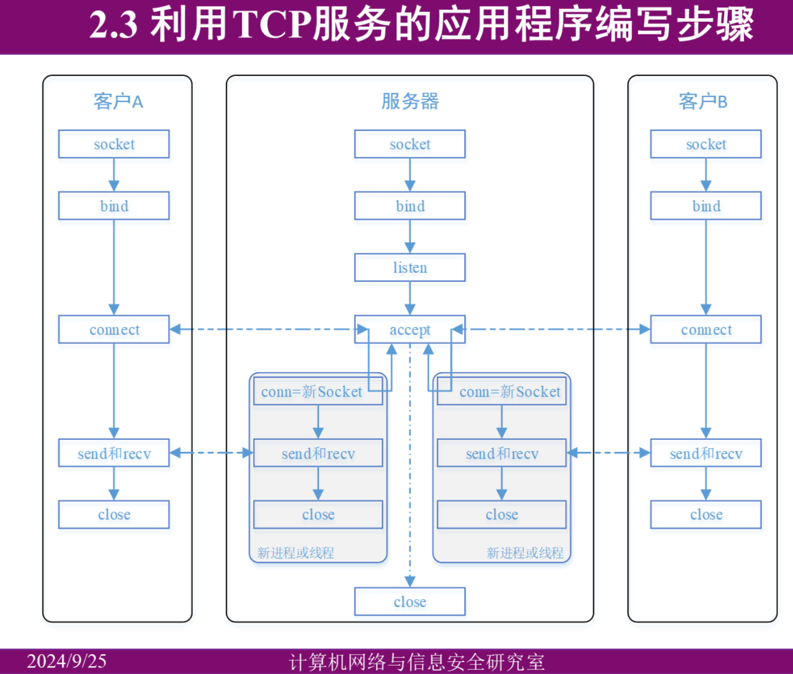

相比标准架构，本程序有如下改进和特殊设计：

1. 服务器端 (Server.cpp)

- **独立的服务器命令处理线程**：服务器初始化完毕后，除了正常处理客户端请求外，还会单独开启一个线程，用于接受服务器命令（如查询在线用户列表、广播消息等）。
  
- **并发客户端处理**：服务器通过 `while` 循环不断监听客户端连接请求。一旦有客户端连接请求成功，服务器为该客户端创建一个独立的线程进行通信处理，实现多客户端并发通信。

- **客户端 ID 分配**：每当一个新的客户端连接成功时，服务器会为其分配一个唯一的客户端 ID，以便后续通信中的识别与管理。

- **身份验证机制**：在进入聊天室之前，服务器会接收客户端发送的用户名和密码，进行身份验证，确保只有经过授权的用户才能加入聊天室。

- **安全关闭机制**：服务器端提供了一个安全关闭的功能，当管理员执行关闭命令时，服务器会向所有在线的客户端发送广播消息，通知即将关闭聊天室，并随后安全地关闭服务器。

2. 客户端 (Client.cpp)

- **身份验证**：在客户端加入聊天室之前，必须向服务器提交用户名和密码，服务器验证通过后，客户端才会被允许进入聊天室。

- **消息解析与发送**：客户端在发送信息之前，首先对输入信息进行解析，以便根据指令类型（如私聊、公聊等）正确发送给服务器。

- **独立接收消息线程**：客户端为了不阻塞用户的输入，会单独创建一个线程用于持续接收来自服务器的消息，并实时在控制台上显示。这确保了客户端能够同时发送和接收消息。

通过以上设计和改进，本程序在实现基本聊天系统功能的基础上，提升了安全性、并发处理能力及灵活性，使得系统更加符合实际应用场景的需求。

### （三）程序模块与功能

#### 1. 服务器端

##### （1）枚举和结构体

- **`enum MessageType`**: 定义了消息的类型，包括文本消息、私聊消息、系统消息、命令消息。该枚举使服务器和客户端能够正确识别和处理不同类型的消息。

``` c++
// 消息类型枚举
enum MessageType {
    TEXT,      // 文本消息
    PRIVATE,   // 私聊消息
    SYSTEM,    // 系统消息
    COMMAND    // 命令消息
};
```

- **`struct Message`**: 消息结构体，包含消息类型、发送者 ID、目标 ID、昵称、内容和时间戳等信息。用于网络传输时封装消息数据，保证消息的统一格式和规范。

``` c++
// 消息结构体
struct Message {
    MessageType type;        // 消息类型
    int senderID;            // 发送者 ID
    int targetID;            // 目标用户 ID
    char nickname [50];       // 发送者昵称
    char content [512];       // 消息内容
    char time [50];           // 消息时间戳
};
```

##### （2）类与核心功能

###### Logger 类

- **`static void log(const std::string& message)`**: 负责记录日志到文件和控制台。它根据当前日期生成日志文件，将日志信息写入文件，同时输出到控制台，方便系统监控与调试。

###### ChatServer 类

- **`bool initialize()`**: 初始化服务器，包括 Winsock 启动、套接字创建、绑定端口以及监听。该方法为服务器的启动做好准备工作。
- **`void run()`**: 服务器的主循环，处理客户端连接请求。通过为每个客户端创建单独的线程，实现并发处理。
- **`void handleClient(SOCKET clientSocket)`**: 管理与单个客户端的交互，包括身份验证、消息处理以及连接断开时的清理工作。
- **`void sendMessage(const Message& msg)`**: 发送消息，根据类型确定是广播给所有用户还是发送给特定用户。
- **`void broadcastMessage(const Message& msg, int senderID)`**: 广播消息给除发送者外的所有在线客户端。
- **`void handleServerCommands()`**: 处理服务器命令，例如 `/list` 列出在线用户、`/quit` 关闭服务器等，增强了服务器的可控性。
- **`void cleanup()`**: 释放服务器资源，确保在关闭时清理所有套接字和连接。

##### （3）服务器端核心代码

###### 服务器初始化和运行

``` c++
// 初始化服务器
bool ChatServer:: initialize() {
    Logger:: log("正在初始化服务器...");
    // 初始化 Winsock
    WSADATA wsaData;
    if (WSAStartup(MAKEWORD(2, 2), &wsaData) != 0) {
        Logger:: log("Winsock 初始化失败: " + getErrorMessage(WSAGetLastError()));
        return false;
    }
    // 创建套接字
    serverSocket = socket(AF_INET, SOCK_STREAM, 0);
    if (serverSocket == INVALID_SOCKET) {
        Logger:: log("创建套接字失败: " + getErrorMessage(WSAGetLastError()));
        return false;
    }
    // 绑定套接字
    sockaddr_in serverAddr = { 0 };
    serverAddr.sin_family = AF_INET;
    serverAddr.sin_addr.s_addr = INADDR_ANY;
    serverAddr.sin_port = htons(PORT);
    if (bind(serverSocket, (sockaddr*)&serverAddr, sizeof(serverAddr)) == SOCKET_ERROR) {
        Logger:: log("绑定套接字失败: " + getErrorMessage(WSAGetLastError()));
        return false;
    }
    // 监听套接字
    if (listen(serverSocket, SOMAXCONN) == SOCKET_ERROR) {
        Logger:: log("监听套接字失败: " + getErrorMessage(WSAGetLastError()));
        return false;
    }

    isRunning = true;
    Logger:: log("服务器已启动，正在监听端口 " + std:: to_string(PORT) + "...");
    return true;
}

// 运行服务器
void ChatServer:: run() {
    std:: thread commandThread(&ChatServer:: handleServerCommands, this);
    commandThread.detach();

    while (isRunning) {
        // 接收客户端连接
        sockaddr_in clientAddr;
        int clientAddrSize = sizeof(clientAddr);
        SOCKET clientSocket = accept(serverSocket, (sockaddr*)&clientAddr, &clientAddrSize);

        if (clientSocket == INVALID_SOCKET) {
            Logger:: log("接受客户端连接失败: " + getErrorMessage(WSAGetLastError()));
            continue;
        }

        std:: thread clientThread(&ChatServer:: handleClient, this, clientSocket);
        clientThread.detach();
    }
}
```

这段代码展示了服务器的初始化和主运行循环。

关键点解释：

1. `initialize()` 方法完成了 Winsock 初始化、创建服务器套接字、绑定地址和端口、开始监听等关键步骤。
2. `run()` 方法是服务器的主循环，它创建了一个处理服务器命令的线程，并在主循环中不断接受新的客户端连接。
3. 对于每个新的客户端连接，都会创建一个新的线程来处理，这允许服务器同时处理多个客户端。

###### 处理客户端连接

``` c++
// 处理客户端连接
void ChatServer:: handleClient(SOCKET clientSocket) {
    char username [50], password [50];
    // 进行身份验证
    while (isRunning) {
        recv(clientSocket, username, sizeof(username), 0);
        recv(clientSocket, password, sizeof(password), 0);
        // 验证用户名和密码
        if (userCredentials [username] != password) {
            int buffer = -1; // 认证失败
            send(clientSocket, (char*)&buffer, sizeof(buffer), 0);
        }
        else {
            break;
        }
    }

    int clientID = nextClientID++;                 // 为新客户端分配 ID
    clients.emplace_back(clientSocket, clientID);  // 添加客户端
    clientNicknames [clientID] = username;          // 记录客户端昵称

    Logger:: log("客户端 " + std:: to_string(clientID) + " 已连接。昵称: " + username);
    send(clientSocket, (char*)&clientID, sizeof(clientID), 0);  // 发送分配的客户端 ID

    // 发送欢迎消息
    Message welcomeMsg = { SYSTEM, 0, -1, "服务器", "", "" };
    std:: string welcomeMessage = "欢迎 " + std:: string(username) + " 加入聊天室！";
    strncpy_s(welcomeMsg.content, welcomeMessage.c_str(), sizeof(welcomeMsg.content) - 1);

    std:: time_t now = std:: time(nullptr);
    struct tm timeinfo;
    localtime_s(&timeinfo, &now);
    std:: strftime(welcomeMsg.time, sizeof(welcomeMsg.time), "%Y-%m-%d %H:%M:%S", &timeinfo);
    broadcastMessage(welcomeMsg, 0);

    // 发送聊天室规则
    Message joinMsg = { SYSTEM, 0, clientID, "服务器", "", "" };
    std:: string joinMessage = "请遵守以下规则：\n"
        "1. 输入消息后按回车发送。\n"
        "2. 私聊请使用 /p <用户ID> <消息>。\n"
        "3. 输入 /list 查看在线用户。\n"
        "4. 输入 /help 获取帮助。";
    strncpy_s(joinMsg.content, joinMessage.c_str(), sizeof(joinMsg.content) - 1);
    sendMessage(joinMsg);
    // 处理客户端消息
    try {
        while (isRunning) {
            Message msg;
            int bytesRead = recv(clientSocket, (char*)&msg, sizeof(msg), 0);
            if (bytesRead <= 0) {
                Logger:: log("客户端 " + std:: to_string(clientID) + (bytesRead == SOCKET_ERROR ? " 接收失败: " : " 断开连接。") + getErrorMessage(WSAGetLastError()));
                break;
            }
            Logger:: log(" [" + std:: string(msg.time) + " - " + std:: to_string(msg.senderID) + " - " + msg.nickname + " - " + std:: to_string(msg.targetID) + "]: " + msg.content);
            if (msg.type == COMMAND) {
                handleClientCommands(msg, clientID);
            }
            else {
                sendMessage(msg);
            }
        }
    }
    catch (const std:: exception& e) {
        Logger:: log("处理客户端 " + std:: to_string(clientID) + " 时发生异常: " + e.what());
    }
    // 客户端离开时清理
    clients.erase(std:: remove_if(clients.begin(), clients.end(), [clientID](const auto& c) {
        return c.second == clientID;
        }), clients.end());
    clientNicknames.erase(clientID);
    closesocket(clientSocket);
    // 广播用户离开信息
    Message leftMsg = { SYSTEM, 0, -1, "服务器", "", "" };
    std:: string leftContent = "用户 " + std:: to_string(clientID) + " 已离开聊天室。";
    strncpy_s(leftMsg.content, leftContent.c_str(), sizeof(leftMsg.content) - 1);
    now = std:: time(nullptr);
    localtime_s(&timeinfo, &now);
    std:: strftime(leftMsg.time, sizeof(leftMsg.time), "%Y-%m-%d %H:%M:%S", &timeinfo);
    broadcastMessage(leftMsg, 0);
}
```

这段代码展示了如何处理单个客户端连接的整个生命周期。

关键点解释：

1. 首先进行用户身份验证。
2. 为新客户端分配 ID，并将其添加到连接列表中。
3. 发送欢迎消息给所有客户端。
4. 在一个循环中持续接收和处理来自客户端的消息。
5. 处理客户端断开连接的情况，包括清理资源和通知其他客户端。

#### 2. 客户端

##### （1）枚举和结构体

与服务器端一致，客户端也使用 `MessageType` 和 `Message` 来定义消息类型和消息结构，确保客户端与服务器之间的数据一致性。

##### （2）类与核心功能

###### ChatClient 类

- **`bool initialize()`**: 初始化客户端，完成 Winsock 启动、套接字创建并与服务器建立连接。
- **`void authenticate()`**: 处理用户登录，验证用户名与密码，确保合法用户才能进入聊天室。
- **`void run()`**: 主循环，处理用户输入与发送消息，同时启动接收消息的线程。
- **`void receiveMessages()`**: 接收来自服务器的消息，并根据消息类型进行处理和显示。
- **`void sendMessage(const Message& msg)`**: 发送消息至服务器。
- **`void setConsoleColor(int color)`**: 设置控制台文本颜色，增强用户体验。

##### （3）客户端核心代码

###### 客户端初始化和运行

``` c++
// 初始化客户端
bool ChatClient:: initialize() {
    // 初始化 Winsock
    WSADATA wsaData;
    if (WSAStartup(MAKEWORD(2, 2), &wsaData) != 0) {
        std:: cerr << "Winsock 初始化失败: " << getErrorMessage(WSAGetLastError()) << std:: endl;
        return false;
    }
    // 创建套接字
    clientSocket = socket(AF_INET, SOCK_STREAM, 0);
    if (clientSocket == INVALID_SOCKET) {
        std:: cerr << "创建套接字失败: " << getErrorMessage(WSAGetLastError()) << std:: endl;
        return false;
    }
    // 连接服务器
    sockaddr_in serverAddr = { 0 };
    serverAddr.sin_family = AF_INET;
    serverAddr.sin_port = htons(PORT);
    inet_pton(AF_INET, SERVER_IP, &(serverAddr.sin_addr));

    if (connect(clientSocket, (sockaddr*)&serverAddr, sizeof(serverAddr)) == SOCKET_ERROR) {
        std:: cerr << "连接服务器失败: " << getErrorMessage(WSAGetLastError()) << std:: endl;
        return false;
    }

    return true;
}

// 运行客户端
void ChatClient:: run() {
    // 启动接收消息的线程
    std:: thread(&ChatClient:: receiveMessages, this).detach();

    Message msg = { TEXT, clientID, -1, "", "", "" };
    strncpy_s(msg.nickname, sizeof(msg.nickname), nickname.c_str(), _TRUNCATE);
    // 主循环，发送消息
    try {
        while (isRunning) {
            std:: string input;
            std:: getline(std:: cin, input);

            std:: time_t now = std:: time(nullptr);
            struct tm timeinfo;
            localtime_s(&timeinfo, &now);
            std:: strftime(msg.time, sizeof(msg.time), "%Y-%m-%d %H:%M:%S", &timeinfo);
            // 处理命令
            if (input == "/quit") {
                isRunning = false;
                setConsoleColor(14); // 黄色
                std:: cout << "感谢使用！程序将关闭。" << std:: endl;
                setConsoleColor(7); // 恢复默认颜色
                break;
            }
            else if (input.substr(0, 3) == "/p ") {
                std:: istringstream iss(input.substr(3));
                int targetID;
                if (iss >> targetID) {
                    std:: string privateMsg;
                    std:: getline(iss >> std:: ws, privateMsg);
                    if (! privateMsg.empty()) {
                        msg.type = PRIVATE;
                        msg.targetID = targetID;
                        strncpy_s(msg.content, privateMsg.c_str(), sizeof(msg.content) - 1);
                    }
                    else {
                        setConsoleColor(12); // 红色
                        std:: cout << "私聊消息不能为空。" << std:: endl;
                        setConsoleColor(7); // 恢复默认颜色
                        continue;
                    }
                }
                else {
                    setConsoleColor(12); // 红色
                    std:: cout << "无效的私聊命令格式。使用 /p <用户ID> <消息> " << std:: endl;
                    setConsoleColor(7); // 恢复默认颜色
                    continue;
                }
            }
            else if (input == "/list") {
                msg.type = COMMAND;
                msg.targetID = -1;
                strcpy_s(msg.content, "/list");
            }
            else if (input == "/help") {
                setConsoleColor(14); // 黄色
                std:: cout << "可用命令：\n"
                    << " - /quit: 退出聊天\n"
                    << " - /p <用户ID> <消息>: 发送私聊消息\n "
                    << " - /list: 列出所有在线用户\n"
                    << " - /help: 显示此帮助信息\n";
                setConsoleColor(7); // 恢复默认颜色
                continue;
            }
            else {
                msg.type = TEXT;
                msg.targetID = -1;
                strncpy_s(msg.content, input.c_str(), sizeof(msg.content) - 1);
            }
            sendMessage(msg);
        }
    }
    catch (const std:: exception& e) {
        if (! isRunning) {
            return;
        }
        setConsoleColor(12); // 红色
        std:: cerr << "发生异常: " << e.what() << std:: endl;
        setConsoleColor(7); // 恢复默认颜色
    }
    cleanup();
}
```

这段代码展示了客户端的初始化和主运行循环。

关键点解释：

1. `initialize()` 方法完成了 Winsock 初始化、创建客户端套接字、连接到服务器等关键步骤。
2. `run()` 方法是客户端的主循环，它创建了一个接收消息的线程，并在主循环中处理用户输入和发送消息。
3. 主循环中处理了各种用户命令（如退出、私聊、列出用户等），并将普通消息发送给服务器。

###### 接收消息

``` c++
void ChatClient:: receiveMessages() {
    try {
        Message msg;
        while (isRunning) {
            int bytesRead = recv(clientSocket, (char*)&msg, sizeof(msg), 0);
            if (bytesRead <= 0) {
                if (! isRunning) {
                    break;
                }
                isRunning = false;
                setConsoleColor(12); // 红色
                std:: cout << (bytesRead == SOCKET_ERROR ? "接收消息时发生错误。" : "与服务器断开连接。") << getErrorMessage(WSAGetLastError()) << std:: endl;
                setConsoleColor(7); // 恢复默认颜色
                break;
            }

            if (msg.type == SYSTEM && strcmp(msg.content, "服务器正在关闭。再见！") == 0) {
                if (! isRunning) {
                    break;
                }
                isRunning = false;
                setConsoleColor(14); // 黄色
                std:: cout << "服务器正在关闭。按回车键退出。" << std:: endl;
                setConsoleColor(7); // 恢复默认颜色
                break;
            }

            setConsoleColor(11); // 浅蓝色
            std:: cout << "[" << msg.time << "] ";
            setConsoleColor(10); // 绿色
            std:: cout << msg.nickname << " (ID: " << msg.senderID << "): ";
            setConsoleColor(7); // 恢复默认颜色
            std:: cout << msg.content << std:: endl;
        }
    }
    catch (const std:: exception& e) {
        if (! isRunning) {
            return;
        }
        setConsoleColor(12); // 红色
        std:: cerr << "接收消息时发生异常: " << e.what() << std:: endl;
        setConsoleColor(7); // 恢复默认颜色
    }
    cleanup();
}
```

这段代码展示了客户端如何接收和显示来自服务器的消息。

关键点解释：

1. 在一个单独的线程中运行，持续接收服务器发送的消息。
2. 处理各种异常情况，如服务器断开连接或关闭。
3. 使用不同的颜色显示消息的不同部分，提高可读性。
4. 对系统消息（如服务器关闭）进行特殊处理。

#### 3. 扩展功能的实现说明

（1）日志功能：

- 在 `Server.cpp` 中实现了 `Logger` 类，使用静态方法 `log()` 记录日志。
- 日志会同时输出到控制台和日期命名的文本文件中（如 "2023-10-20_log.txt"）。
- 在服务器的关键操作点（如客户端连接、断开、消息发送等）调用 `Logger::log()` 记录信息。

  ``` cpp
  // 日志类，负责记录日志
  class Logger {
  public:
      // 记录日志到文件和控制台
      static void log(const std:: string& message) {
          std:: time_t now = std:: time(nullptr);
          char date [11];
          struct tm timeinfo;
          localtime_s(&timeinfo, &now);
          std:: strftime(date, sizeof(date), "%Y-%m-%d", &timeinfo);
  
          std:: ofstream logFile(std:: string(date) + "_log.txt ", std::ios:: app);
          if (logFile.is_open()) {
              logFile << message << std:: endl;
          }
          else {
              std:: cerr << "无法打开日志文件。" << std:: endl;
          }
          std:: cout << message << std:: endl;
      }
  };
  ```

（2）用户昵称：

  - 在 `Message` 结构体中添加了 `nickname` 字段。
  - 服务器端使用 `std::map<int, std::string> clientNicknames` 存储客户端 ID 和昵称的映射。
  - 客户端在身份验证成功后，将用户名作为昵称存储。

（3）身份验证：

  - 服务器端使用 `std::map<std::string, std::string> userCredentials` 存储用户名和密码。
  - 在 `ChatServer::handleClient()` 方法中实现了身份验证逻辑。
  - 客户端在 `ChatClient::authenticate()` 方法中实现了身份验证过程。

（4）私聊功能：

  - 在 `Message` 结构体中添加了 `targetID` 字段，用于指定私聊目标。
  - 服务器端在 `ChatServer::sendMessage()` 方法中根据 `targetID` 决定是否为私聊消息。
  - 客户端通过 "/p <用户ID> <消息>" 命令发送私聊消息。

（5）优雅退出机制：

  - 服务器端通过 "quit" 命令触发关闭流程，在 `ChatServer::handleServerCommands()` 中实现。
  - 客户端通过 "/quit" 命令触发退出流程，在 `ChatClient::run()` 中实现。
  - 服务器关闭时会向所有客户端发送关闭通知。

（6）命令输入功能：

  - 服务器端在 `ChatServer::handleServerCommands()` 中实现了服务器命令处理。
  - 客户端在 `ChatClient::run()` 中实现了客户端命令处理。
  - 支持的命令包括：私聊 (/p)、退出 (/quit)、获取在线用户列表 (/list)、帮助 (/help)。

（7）优化用户体验：

  - 错误提示：在各个关键操作点添加了错误检查和提示，如连接失败、认证失败等。
  - 用户上线/离线通知：在 `ChatServer::handleClient()` 中实现了用户连接和断开的广播通知。
  - 控制台颜色设置：在 `Client.cpp` 中实现了 `setConsoleColor()` 方法，用于设置不同类型消息的颜色。

**实现这些功能的关键点：**

（1）使用适当的数据结构（如 `std::map`）来存储用户信息和昵称。

（2）设计合理的消息结构体，包含必要的字段（如消息类型、发送者、接收者、内容等）。

（3）实现命令解析逻辑，区分普通消息和命令。

（4）使用多线程技术处理并发连接和消息接收。

（5）实现服务器和客户端的双向通信机制。

（6）添加适当的错误处理和异常捕获，提高程序的稳定性。

（7）使用文件 I/O 实现日志功能。

（8）利用 Windows API 实现控制台颜色设置，增强可读性。

具体实现请查阅代码，就不在此赘述了。

## 五、界面展示与运行

------

编译后，生成的可执行文件为`Server.exe`（服务器端）和`Client.exe`（客户端）。

### 1. 启动服务器

在服务器端未启动的情况下运行客户端，会出现连接失败的错误提示：

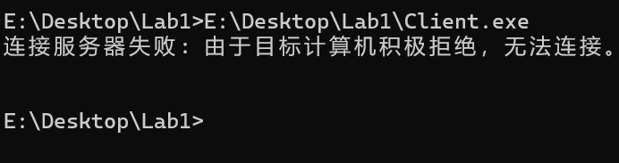

首先，启动服务器，运行`Server.exe`：

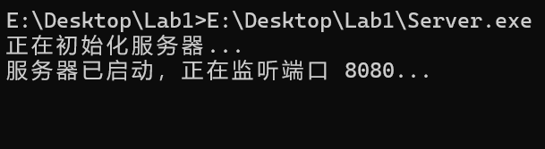

此时若尝试启动第二个服务器，由于端口已被占用，程序将迅速退出：

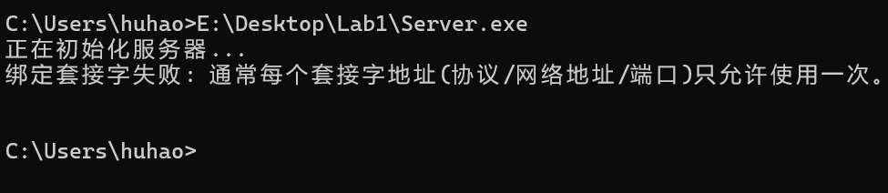

### 2. 启动三个客户端

打开一个客户端后，会提示输入用户名。需要注意的是，因系统允许相同用户名多端登录，因此这里相当于使用聊天室密码：

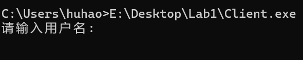

若用户名或密码为空或错误，将提示重新输入，只有输入正确的信息才能进入聊天室。成功登录后，服务端会返回一个用户ID：

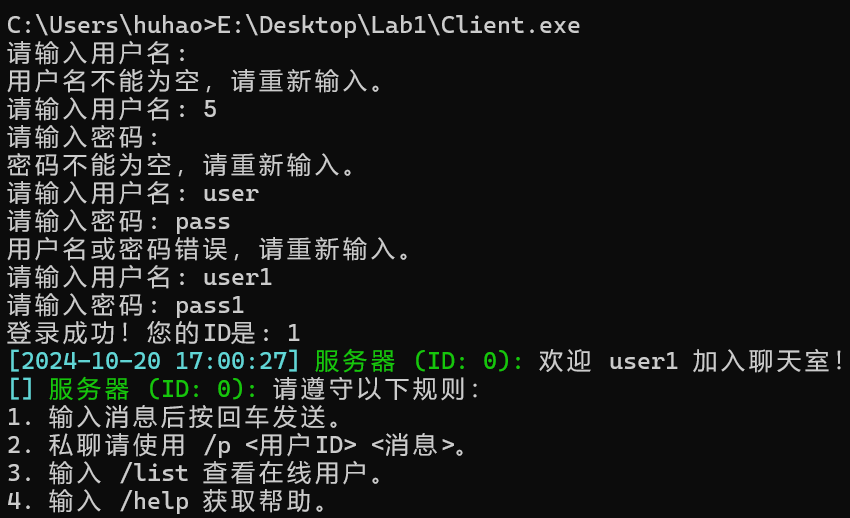

再打开两个客户端，进入聊天室时，会有广播通知所有用户，且只有自己会看到聊天室规则，同时服务端也会有消息提示。服务端也会记录此消息。值得注意的是，输入相同的用户名和密码也能成功加入聊天室，因为服务器是通过ID区分用户的：

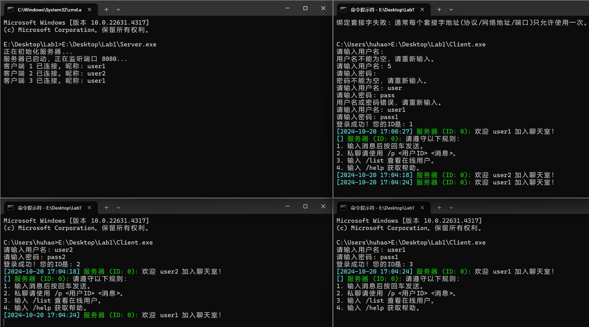

此时，用户和服务端都可以检查在线用户。除了`/help`命令外，用户输入的其他命令都会在服务端记录：（因为/help是在本地处理的）：

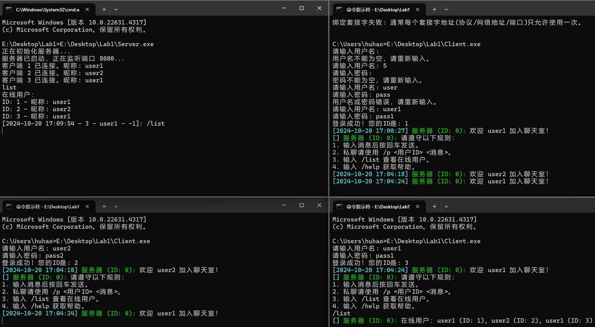

### 3. 消息与命令测试

公共聊天测试如图，可以看到支持中英文聊天、多人聊天，而且消息会显示发送时间、发送人名称及ID：

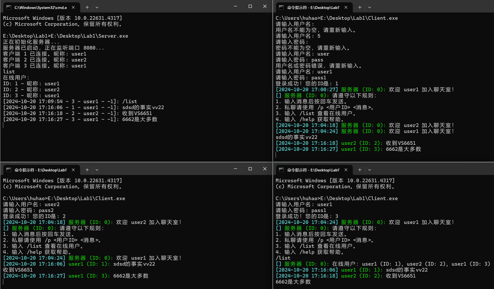

私聊测试如图，可以看到单独的`/p`会被视为普通文本，而`/p `（后有空格）会被识别为无效命令。而且用户ID可以随意指定，允许发送给自己（充当“文件传输助手”:dog:）​：

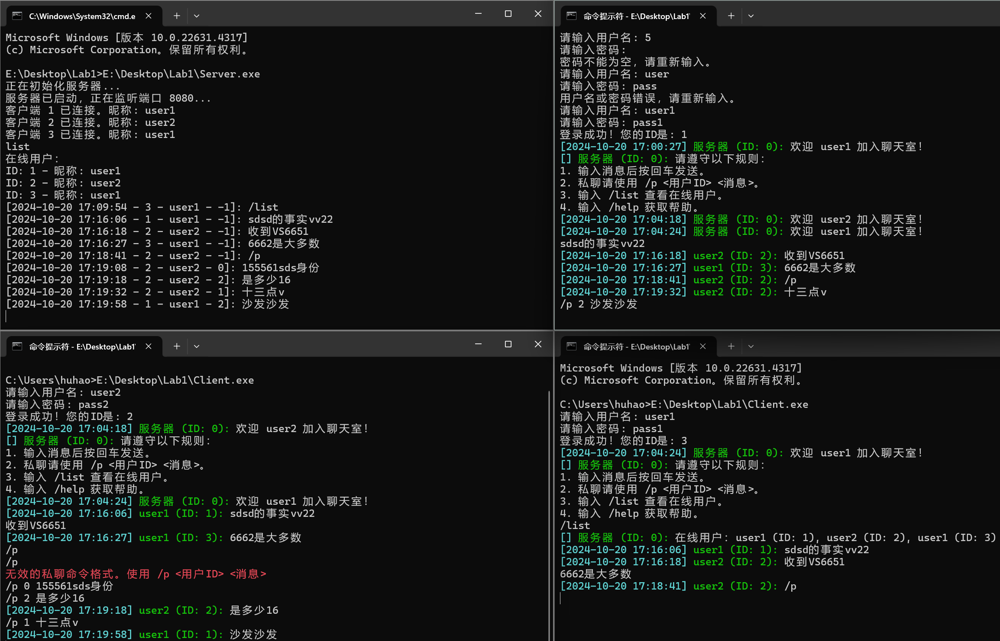

命令测试如图，除了 `/help` 外，用户输入的其他命令会在服务端记录：

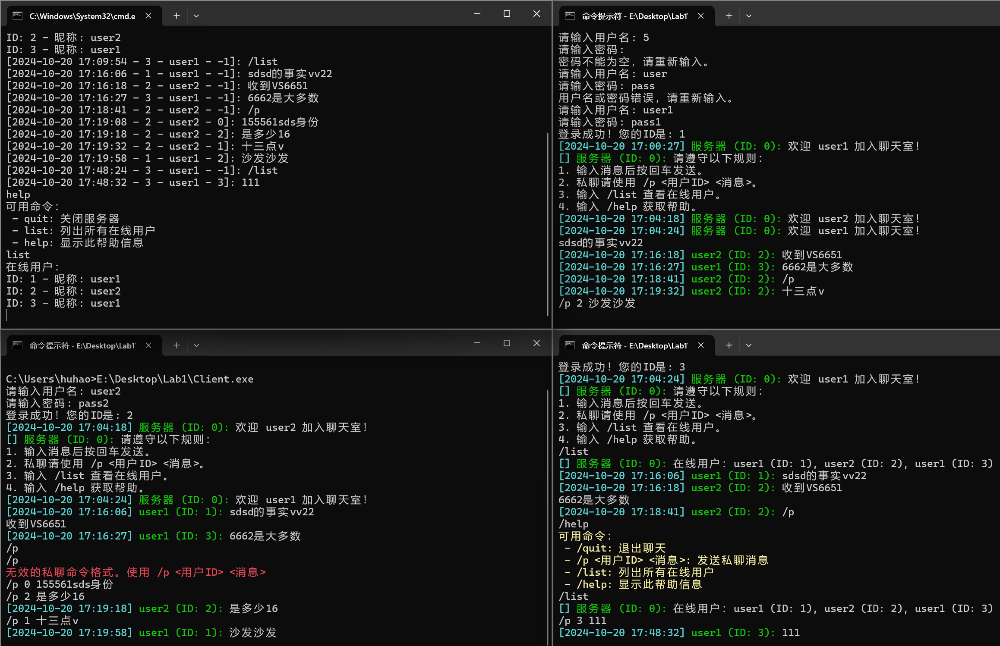

### 4. 服务器或客户端退出

用户可以通过输入 `/quit` 退出聊天室，所有用户和服务器都会收到用户离开的通知；

随后输入 `list` 测试确认用户已成功退出，表明服务器成功清理了与该用户的连接资源。

服务器输入 `quit` 命令可关闭聊天室，并通知所有用户服务器将关闭。

服务端的“接受客户端连接失败”消息表明连接线程已成功关闭，其他资源也已释放，所有线程均已结束。

用户端在服务器关闭时没有错误提示，说明用户端也已成功关闭并释放所有资源：

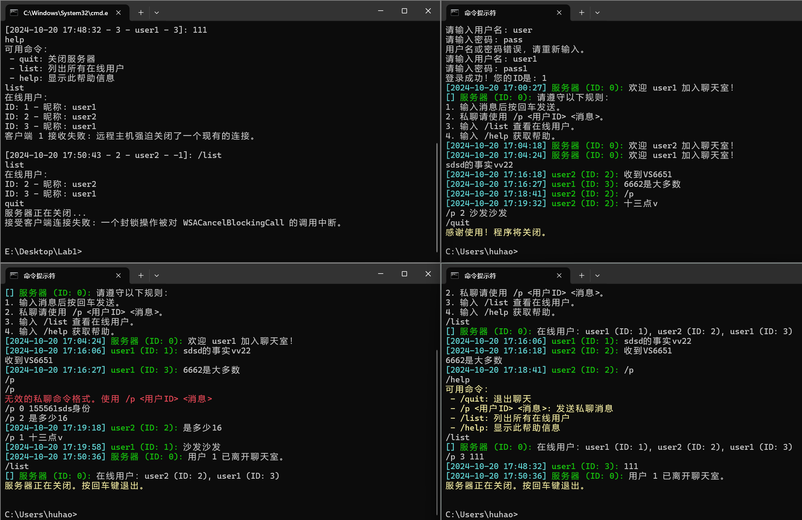

### 5. 日志截图

我在服务器端设置了日志输出，在运行时，会把服务器接收到的消息记录在日志文件中，如下所示，记录了之前聊天室的所有内容：

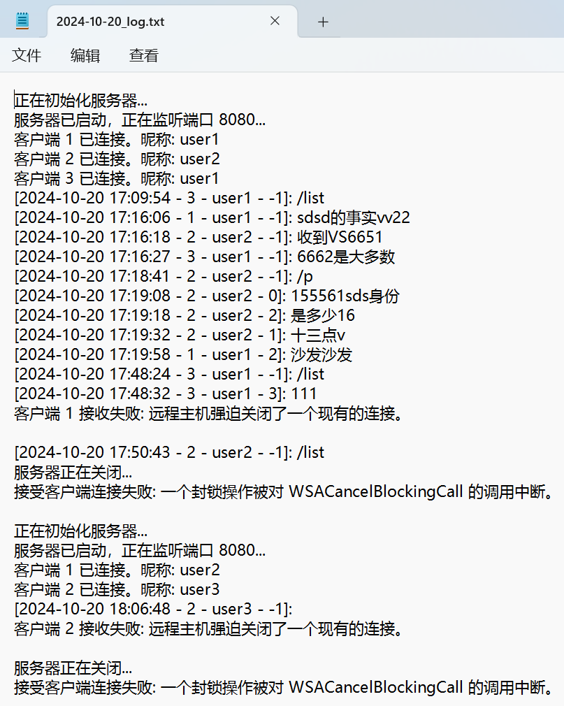

### 6. 补充测试

如果服务器输入无效命令，将不会有任何响应：

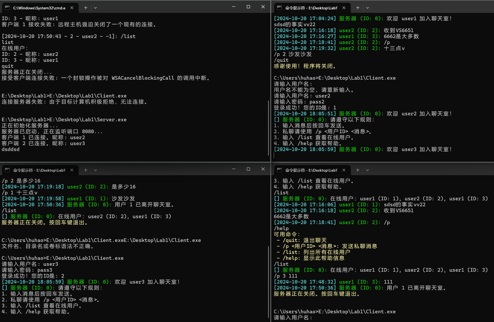

直接关闭聊天窗口，服务器端会提示该客户端已退出并与之断开连接：

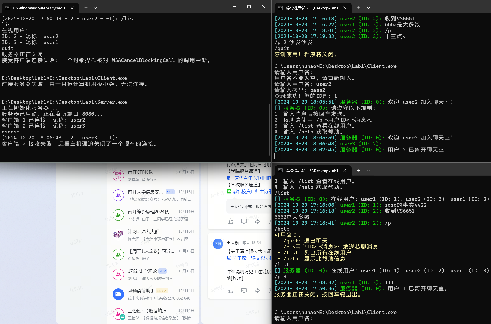

若服务器关闭时，有用户停留在输入用户名密码的界面，则会持续提示用户名或密码错误，尽管输入的是正确的用户名密码：

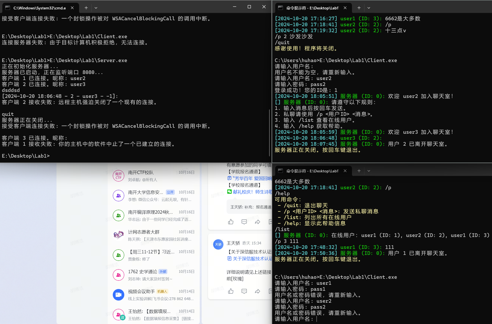

## 六、数据丢失测试

------

在实验中，我进行了多次实验和监控，测试结果显示所有合法消息均成功发送，而且服务器日志记录的数据显示消息丢失率为0。这意味着在正常操作下，信息能够确保无丢失地传送。

为进一步验证这一结果，我使用Wireshark软件对数据包进行了监控和分析。测试过程具体如下：

1. **设置Wireshark**：打开Wireshark，选择“Adapter for loopback traffic capture”以捕获本地环回流量。

2. **配置过滤器**：输入过滤条件 `ip.src == 127.0.0.1 && tcp.port == 8080`。

3. **发送消息**：用户在客户端发送消息“hello world”。

4. **抓包分析**：Wireshark成功捕获到相关数据包，结果如下所示：

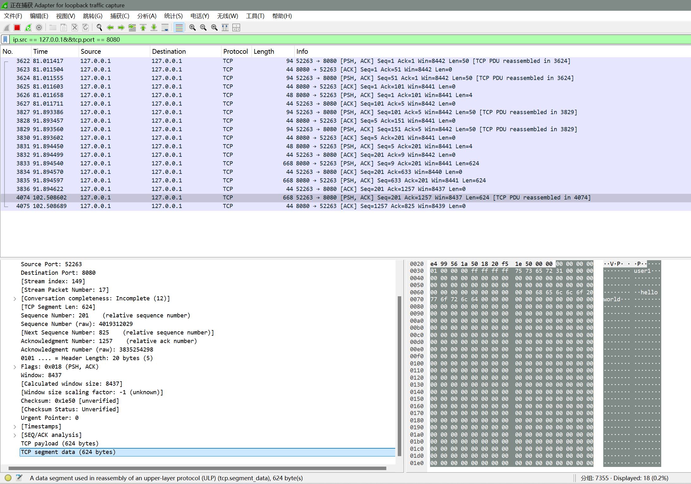

5. **内容查看**：右键点击数据包，选择“显示分组字节”，然后选择“显示为ASCII”，结果如下，显示消息内容在传输过程中保持完好，未发生丢失：

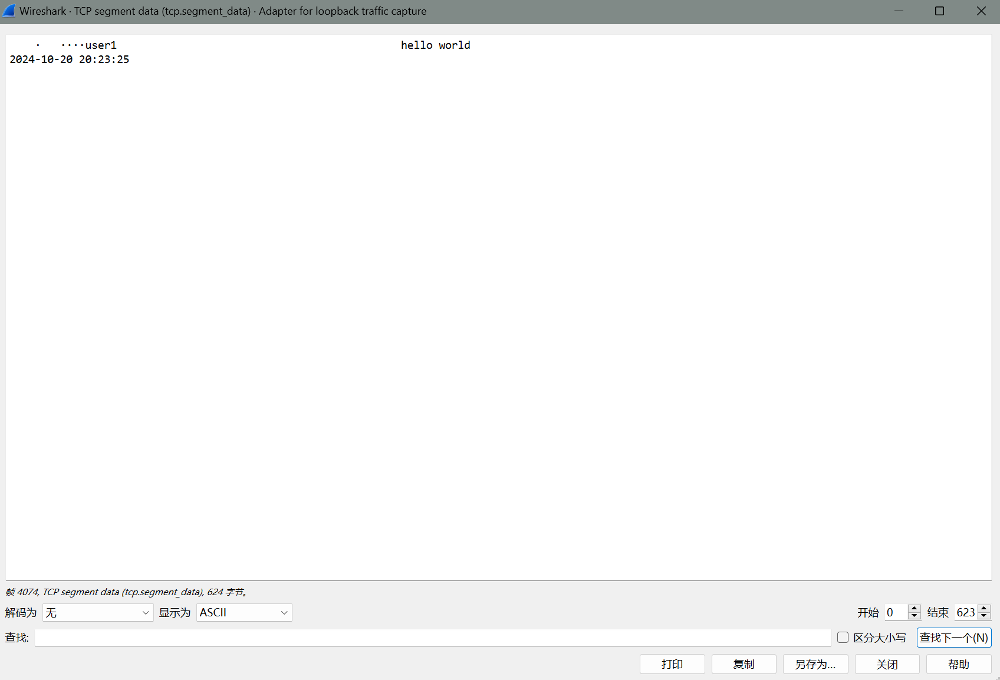

综上所述，测试表明本协议在数据传输过程中具备良好的可靠性，能够确保所有合法输入的消息完整到达目标。

## 七、实验反思与总结

------

### 1. 实验难点

在本次聊天室实验中，我遇到了一些重要的技术难点，主要集中在消息结构的设计、线程管理和网络通信的细节。

（1）**消息结构的设计**
消息的结构体设计至关重要，它需要包含消息类型、发送者 ID、目标用户 ID、发送者昵称、消息内容和时间戳等信息。为了实现灵活的消息处理，我定义了一个枚举类型 `MessageType` 来区分文本消息、私聊消息、系统消息和命令消息。这种设计使得在接收和发送消息时能够清晰区分不同的消息类型，从而提高了代码的可读性和可维护性。

（2）**多线程管理**
服务器需要同时处理多个客户端的连接和消息传递，采用多线程是解决这一问题的有效方法。在实现中，我使用了标准库中的 `std::thread` 来为每个客户端创建一个新的线程。这个过程中，线程的创建和销毁需要仔细管理，以防止资源泄露和数据竞争。我通过使用互斥锁等技术，确保在对共享资源（如客户端列表）进行操作时的安全性。

（3）**客户端连接与身份验证**
身份验证是确保聊天室安全性的关键。在处理客户端连接时，我必须确保用户提供的用户名和密码是有效的。实现过程中，我使用一个简单的 `std::map` 来存储用户凭证，并在接收到客户端的输入后进行验证。这一过程需要保证在多线程环境下的安全性，以防止多个线程同时访问或修改用户凭证。

（4）**命令与消息的处理**
客户端支持发送不同类型的命令（如私聊、列出在线用户等）。在服务器端，我需要根据消息的类型来调用相应的处理函数。这个设计需要精确地解析和处理命令，以确保客户端的每个请求都能得到正确的响应。我通过设计统一的消息格式，确保服务器能够识别并正确处理每一条消息。

（5）**网络通信的稳定性**
由于网络通信的不稳定性，消息的接收和发送过程中可能会出现错误。因此，我在消息发送和接收的过程中加入了错误处理机制。当发生错误时，我会记录相关信息，并关闭连接，确保服务器在异常情况下能够安全运行。

### 2. 遇到的问题

在实验过程中，我也遇到了一些技术问题，主要包括以下几个方面：

（1）**函数兼容性**：在使用 Visual Studio 进行实验时，旧函数如 `localtime` 和 `strncpy` 报错，无法正常编译。为此，我改用了更安全的函数 `localtime_s` 和 `strncpy_s`。例如，下面的代码示例展示了如何安全地获取当前时间：

```c++
char date[11];
struct tm timeinfo;
localtime_s(&timeinfo, &now);
std::strftime(date, sizeof(date), "%Y-%m-%d", &timeinfo);
```

（2）**字符数组与字符串的转换**：在信息传输中使用了 `char[]`，而一般字符串则使用 `std::string`。为此，我只能使用类似 `strncpy_s` 的函数进行转换。例如：

```c++
Message welcomeMsg = { SYSTEM, 0, -1, "服务器", "", "" };
std::string welcomeMessage = "欢迎 " + std::string(username) + " 加入聊天室！";
strncpy_s(welcomeMsg.content, welcomeMessage.c_str(), sizeof(welcomeMsg.content) - 1);
```

（3）**退出功能的错误处理**：在服务器或用户退出时出现错误。我添加了一个布尔标志 `isRunning` 以指示服务器的运行状态。在所有线程中使用该标志，并在关闭服务器或客户端时将其置为 `false`，从而安全关闭所有线程。

（4）**用户登录阻塞**：客户端在输入用户名和密码时，如果其他用户也尝试登录，将无法进入聊天室。为了解决此问题，我对代码结构进行了调整，但是引发了一系列错误、经过一天的排查调整才修复好错误:worried:

在实验中还遇到了许多其他问题，但这里就不一一列举了……

### 3. 程序改进方向

未来的改进方向包括：

- **异常处理**：增强程序的异常处理机制，以提高系统的容错能力。
- **用户体验**：改进用户输入界面的交互性，增加输入提示和错误反馈。
- **性能优化**：优化网络传输效率，降低延迟，提升整体性能。
- **安全性增强**：加强用户数据的安全性，比如实现加密存储与传输。

### 4. 总结与收获

通过这次实验，我不仅巩固了 C++和网络编程的知识，还提升了解决复杂问题的能力。在构建聊天室的过程中，我根据要求进行了合理的功能扩展，深入学习了相关技术。尽管遇到了一些挑战，但通过细致的调试，最终成功完成了实验。

在功能扩展时，我遵循了老师的建议，专注于 socket 编程相关的内容。我实现了消息解析和按类型发送的功能，并考虑了特殊情况，制定了相应的协议和代码，确保了系统的完整性和规范性。

这次实验让我深入理解了 socket 编程的流程和规范。自主设计协议加深了我对网络通信的认识。同时，我学习了互斥锁的使用，认识到了线程安全的重要性。实现多线程后，我对其运行机制有了更清晰的认识。

此外，我也加深了对 TCP 和 IP 协议的理解，掌握了如何使用 socket 建立服务端和客户端的连接，以及如何通过多线程实现多人实时聊天功能。这次经历不仅丰富了我的编程技能，也让我对网络通信有了更全面的认识。
