<div align='center'>
<b> <font face='微软雅黑' size='6'> 计算机网络课程实验报告 </font> </b>
</div>


<div align='center'>
<b> <font font face='微软雅黑' size='6'> 实验二：配置 Web 服务器，分析 HTTP 交互过程 </font> </b>
</div>


<div>
<font face='宋体' size='6'>&nbsp;&nbsp;&nbsp;&nbsp; 学 院：网络空间安全学院 </font> <br>
<font face='宋体' size='6'>&nbsp;&nbsp;&nbsp;&nbsp; 专 业：信息安全 </font> <br>
<font face='宋体' size='6'>&nbsp;&nbsp;&nbsp;&nbsp; 学 号：2212998 </font> <br>
<font face='宋体' size='6'>&nbsp;&nbsp;&nbsp;&nbsp; 姓 名：胡博浩 </font> <br>
</div>
## 一、实验要求

------

1. 搭建 Web 服务器（自由选择系统），并制作简单的 Web 页面，包含简单文本信息（至少包含专业、学号、姓名）、自己的 LOGO、自我介绍的音频信息。
2. 通过浏览器获取自己编写的 Web 页面，使用 Wireshark 捕获浏览器与 Web 服务器的交互过程，使用 Wireshark 过滤器使其只显示 HTTP 协议。
3. 现场演示。
4. 提交 HTML 文档、Wireshark 捕获文件和实验报告，对 HTTP 交互过程进行详细说明。

注：页面不要太复杂，包含所要求的基本信息即可。使用 HTTP，不要使用 HTTPS。

感谢老师的教导与助教的批阅，辛苦！

## 二、实验环境

------

- 系统环境：`Windows 11` 操作系统

- Web 服务器搭建：选用 `PHPStudy` 作为本地 Web 服务器搭建工具，它集成了 Apache、MySQL 和 PHP 等核心组件，简化了配置过程，使我们能够快速部署 Web 服务。

- 开发工具：使用 `PHPStorm` 作为代码编辑器，它提供了高效的代码编写和调试支持，帮助我们高效完成 Web 页面的开发。

- 网络分析工具：利用 `Wireshark` 捕获网络数据包，分析 HTTP 协议的交互过程，以深入了解 Web 通信的细节。

## 三、Web 服务器搭建

------

### 服务器搭建

在本次实验中，我们选用了 `phpStudy` 作为搭建本地 Web 服务器的工具。`phpStudy` 默认配置了 **Apache2.4.39** 作为 Web 服务器框架，而本次实验中并未涉及 FTP 和 MySQL 服务，因此我们没有启用这些组件。为了规避端口冲突，我们将 Web 服务器的监听端口设置为 **8081**，其他配置均保持默认。

在 `phpStudy` 的网站界面中，我们创建了一个新的网站项目，命名为“lab2”，并指定其使用 **HTTP 协议**，监听端口为 **8081**，其余配置均采用默认设置。具体的配置步骤和界面截图如下所示：

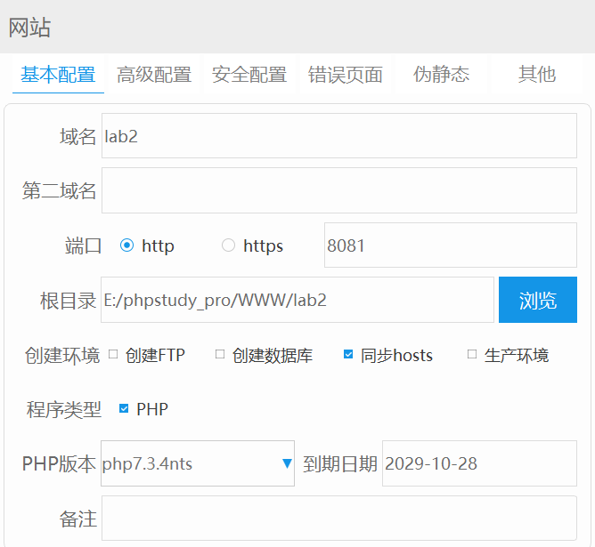

通过上述配置，我们成功搭建了“lab2”网站。接下来，所有的网页文件都将在 `E:/phpstudy_pro/WWW/lab2` 目录下进行编写和部署。

### 网页制作

#### Web 网页文件结构

本次实验的 Web 网页文件结构如下所示：

```assembly
Homepage:
├─ assets
│  ├─ audio
│  │  └─ intro.mp3
│  ├─ css
│  │  └─ style.css
│  └─ images
│     ├─ logo.jpg
│     └─ background.jpg
└─ index.html
```

在本次实验中，网页设计虽非核心重点，但也是锻炼前端设计能力的重要环节。个人网页包含了以下内容：

- **个人 Logo**：使用我个人的桌面壁纸作为网站 Logo。
- **基本信息**：包括专业、学号、姓名。
- **自我介绍音频**：提供一段音频，介绍我自己。
- **个性签名**：展示我的个人签名。
- **联系方式**：包括 GitHub、哔哩哔哩和电子邮件等。
- **版权声明**：对网页内容进行版权声明。
- **背景图片**：使用一张图片作为网页背景。

#### index.html

我编写了一个名为 `index.html` 的文件，作为 Web 网页的主要页面。该文件命名为 `index`，是因为在访问 URL 时，默认会加载 `index.html` 或 `index.php` 文件。

#### 静态文件

在 `assets` 文件夹中，包含以下子文件夹：

- **audio**：存放音频资源文件，如自我介绍的音频文件 `intro.mp3`。
- **css**：存放 `index.html` 的样式表 `style.css`，用于定义 HTML 文件中元素的样式，包括文本对齐、字号、字体、字间距以及背景图片的路径和样式等。
- **images**：存放图片资源，包括网站 Logo 即 `logo.jpg` 和背景图片 `images-background.jpg`。

### 网站访问

启动 phpStudy 中的 Apache 服务后，可以通过 phpStudy 内置的浏览器打开网站，或者直接在外部浏览器中访问网址 `http://lab2:8081/index.html`。网页效果如下：

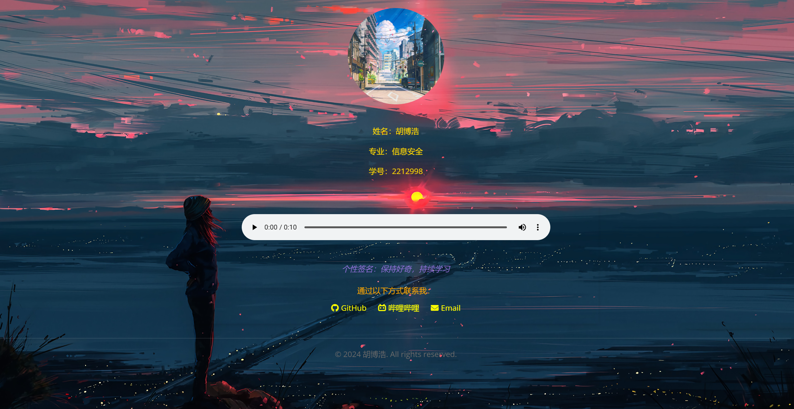

经过测试，音频文件可以正常播放，链接可以正常访问，这表明 Web 网站的搭建是成功的。

## 四、Wireshark 抓包

------

### 网站建立与服务开启

在完成 Web 服务器的搭建后，开启 Apache 服务，确保服务器正常运行。

### 配置 Wireshark

#### 接口选择

在进行 Wireshark 抓包分析时，由于分析是在 **同一台主机** 上进行的，我们需要捕获 **本机回环地址** 中的数据包。在 Wireshark 中，我们选择了 `Adapter for loopback traffic capture` 作为捕获接口：

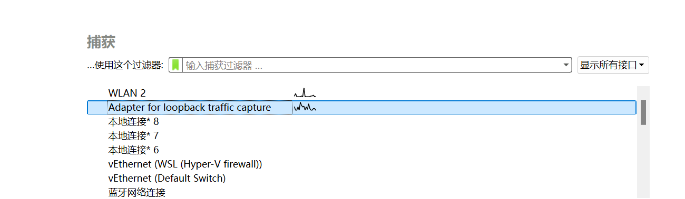

#### 过滤器规则

为了捕获主要的 http 协议和 tcp 协议数据包，并且考虑到我们的 Web 网页使用的端口号为 `8081`，我们应用了以下过滤器规则：

```assembly
ip.src == 127.0.0.1&&tcp.port==8081&&(http or tcp)
```

这个过滤器规则确保我们只关注源 IP 为本地回环地址（127.0.0.1），目标 TCP 端口为 8081，并且协议为 HTTP 或 TCP 的数据包。

### 捕获数据包

应用上述过滤器规则后，访问网站 `http://127.0.0.1:8081/index.html`。返回到 Wireshark，我们发现成功捕获到了预期的数据包。如图所示，这些数据包包括了 HTTP 请求和响应、TCP 三次握手和四次挥手等关键网络交互过程。


**注意，如果需要多次捕获，需要每次提前清除缓存或者直接禁用缓存。** 这是因为浏览器可能会缓存网页内容，导致后续的请求不再从服务器获取新数据，而是直接从本地缓存中读取，这样就不会在网络中产生新的数据包，从而影响我们的抓包分析。这个我在后面会具体分析。

下面我将基于此界面来对 HTTP 交互过程进行分析。

## 五、HTTP 交互过程分析

------

### 请求和响应

在正式分析数据包之前，我们需要先了解 HTTP 请求报文和响应报文的格式。通过在 Wireshark 中设置 `http` 作为过滤条件，我们可以捕获 HTTP 请求和响应的数据包。

#### HTTP 请求报文


`HTTP` 请求报文由 3 部分组成（**请求行**+**请求头**+**请求体**）：

1. **请求行**
   - 请求行包括请求方法、请求 URI 和 HTTP 版本，例如 `GET /index.html HTTP/1.1`。
   - **请求方法**：常用的方法有 `GET` 和 `POST`，还有其他如 `DELETE`、`HEAD`、`OPTIONS`、`PUT`、`TRACE` 等。
   - **请求 URI**：指定请求资源的路径，与请求头中的 `Host` 字段共同构成完整的请求 URL。
   - **HTTP 版本**：表明使用的 HTTP 协议版本，本次实验中即为 HTTP/1.1。
2. **请求头**
   - HTTP 请求头包含多个字段，格式为“字段名: 字段值”，服务器根据这些字段获取客户端信息。
   - 常见的请求头字段包括：
     - `Accept`：告知服务器客户端能够接受的响应类型。
     - `Referer`：指示请求来源的 URL。
     - `Cookie`：客户端的 Cookie 通过这个头部字段发送给服务器。
     - `Cache-Control`：控制缓存。
   - 本次捕获的请求头包括 `Host`、`Connection`、`Accept` 等字段。
3. **请求体**
   - 对于 `GET` 请求，请求体通常是空的；而对于 `POST` 请求，请求体包含表单数据。

#### HTTP 响应报文


同理，HTTP 的响应报文也由三部分组成（**响应行**+**响应头**+**响应体**）:

1. **响应行**
   - 响应行包括协议版本和状态码，例如 `HTTP/1.1 200 OK`。
   - **状态码**：表示请求的结果，常见的状态码有：
     - `200 (OK)`：请求成功。
     - `302/307`：临时重定向。
     - `304 (NOT MODIFIED)`：资源未改变。
     - `401 (UNAUTHORIZED)`：客户端无权访问资源。
     - `403 (FORBIDDEN)`：客户端未获授权。
     - `404 (NOT FOUND)`：资源未找到。
2. **响应头**
   - 响应头与请求头类似，包含多个字段，如 `Server`、`Content-Type`、`Content-Length`、`Last-Modified` 等。
3. **响应体**
   - 响应体包含请求的数据，例如 HTML 文档内容、图片等。

### 三次握手，建立连接

TCP（传输控制协议）三次握手是建立一个可靠连接的过程，它确保了两端的发送和接收能力都是正常的，并且为数据传输提供了一个同步的起始点。


如图所示，客户端（端口 `62637` 和端口 `62638`）分别与服务器（端口 `8081`）通过三次握手建立连接。这里开启两个端口是由于 **浏览器的并行机制**，后文会对此详细分析。

#### 步骤

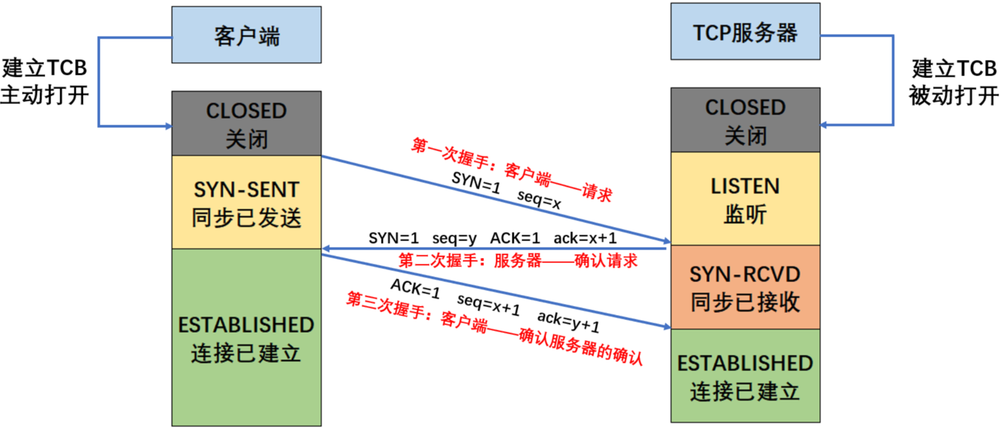

1. **第一次握手（SYN）**
	- 客户端发送一个带有 SYN（同步序列编号）标志位的 TCP 段到服务器，同时随机生成一个初始序列号（ISN, Initial Sequence Number）`x`。这个 SYN 报文不包含应用层数据，其目的是启动一个连接。
	- 客户端进入 `SYN_SENT` 状态，等待服务器确认。
2. **第二次握手（SYN-ACK）**
	- 服务器收到客户端的 SYN 请求后，如果同意建立连接，则会发送一个带有 SYN 和 ACK（确认应答）标志位的 TCP 段作为响应。服务器也会随机生成自己的初始序列号 `y`，并在 ACK 中确认客户端的序列号加一（`x+1`）。
	- 服务器进入 `SYN_RCVD` 状态。
3. **第三次握手（ACK）**
	- 客户端收到服务器的 SYN-ACK 响应后，会发送一个带有 ACK 标志位的 TCP 段作为确认。这个 ACK 会确认服务器的初始序列号加一（`y+1`）。
	- 客户端和服务器都进入 `ESTABLISHED` 状态，此时连接已经建立，可以开始传输数据。

#### 数据包截图和分析

以客户端 `62637` 端口和服务器建立连接为例：

1. **第一次握手**

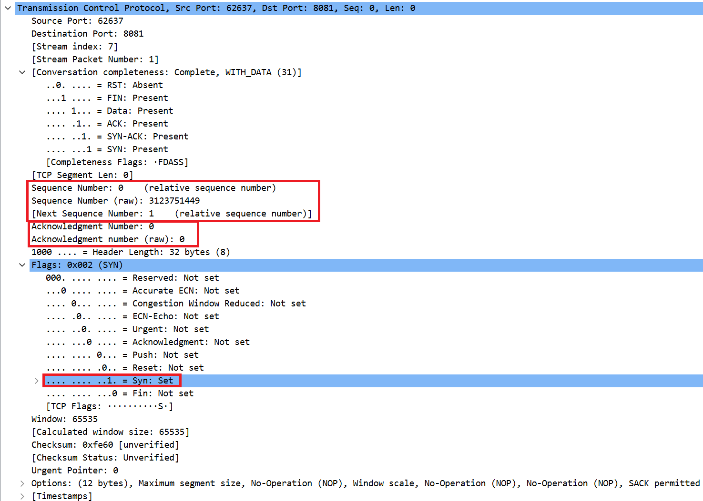

客户端发送 `SYN` 到服务器，序列号 Seq 为 `0`，ack 为 `0`，无数据负载，窗口大小和其它 TCP 选项也被发送。

2. **第二次握手**


服务器回应 `SYN-ACK`，确认号 ack 为 `1`，序列号 Seq 为 `0`，表明服务器已接收到客户端的 SYN 请求，并提供了自己的初始序列号。

3. **第三次握手**


客户端发送 `ACK` 确认，确认号 ack 为 `1`，表明客户端已成功接收到服务器的 SYN-ACK，并确认了服务器的初始序列号。

#### 为什么三次握手是必要的

1. **验证双方通信能力**

	三次握手协议的核心目的是验证通信双方均具备数据发送和接收的能力。在协议的初始阶段，客户端向服务器发送一个 SYN（同步序列编号）报文，表示其准备开始数据传输。服务器随后回应一个 SYN-ACK（同步和确认）报文，表明它已准备好接收数据。最终，客户端发送 ACK（确认）报文，以确认服务器的接收和发送能力，同时验证客户端自身的通信能力。

2. **防止过时的连接请求**

	网络延迟或其他因素可能导致客户端重复发送连接请求。如果只进行两次握手，那么一个延迟的旧连接请求可能在连接已关闭后到达服务器，导致服务器错误地为这个过时的请求建立新连接。三次握手通过客户端的最终确认步骤来避免这种情况，确保所有的连接请求都是最新的。

3. **序列号同步**

	三次握手过程中，客户端和服务器交换初始序列号（ISN），这对于确保后续数据传输的顺序和完整性至关重要。这些序列号用于验证数据包的顺序，保证数据的准确传输。

4. **减少资源浪费**

	如果仅进行两次握手，一旦客户端发生故障或网络出现问题，服务器可能会在等待客户端数据的过程中浪费资源。通过三次握手，可以确保双方都已准备好进行数据传输，从而减少不必要的资源消耗。

5. **增强安全性**

	三次握手还增强了网络通信的安全性。由于连接建立过程更为复杂，攻击者更难通过建立半打开的连接来进行攻击。例如，**SYN 洪水攻击** 在采用三次握手的协议下更难以执行。

6. **防止数据重复传输**

	滞留在网络中的连接请求如果在连接已建立后到达服务器，可能会导致服务器错误地重复发送数据。三次握手通过客户端的最终确认来避免这种情况，确保数据传输的准确性和唯一性。

### 传输数据

在 TCP 连接建立之后，客户端和服务器之间的数据传输是 HTTP 协议的核心部分。这个过程涉及到请求 HTML 页面、CSS 文件、音频文件等资源的传输。

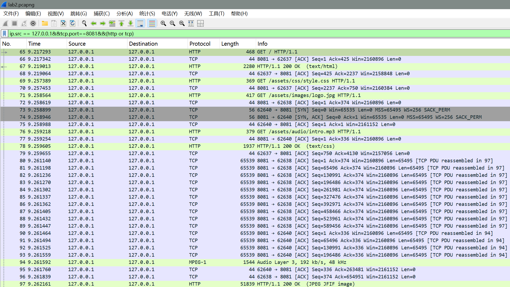

由于数据传输的数据包过多，这里仅展示部分。可以看到客户端向服务器端请求了 html 页面、css 文件、音频文件、两个图片文件以及页面图标文件 icon 等。

#### 数据传输过程

##### 1. 请求 HTML 页面

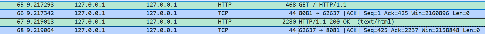

- 客户端通过发送 HTTP GET 请求来请求服务器上的 HTML 页面。
- 服务器接收到请求后，检查请求的合法性，并在找到相应的 HTML 文件后，通过 HTTP 响应将文件内容发送回客户端。
- 客户端接收到 HTML 内容后，开始解析内容并请求页面中引用的其他资源，如 CSS 文件、图片和音频文件。

**具体分析**：

（1）客户端向服务器端发送请求

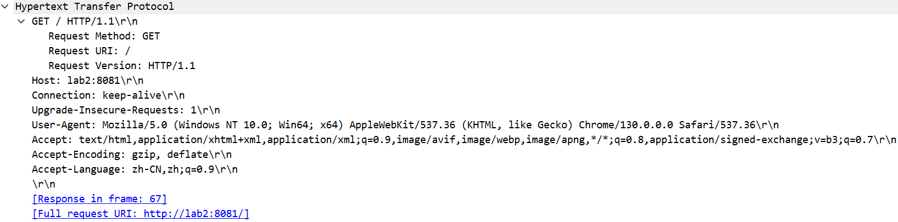

- **请求行**

  - 请求方式：GET
  - 请求 URI：/
  - 协议版本：HTTP/1.1

- **请求头**

  - Host
  - Connection
  - User-Agent
		……

（2）服务器端回复 ACK 表示收到请求

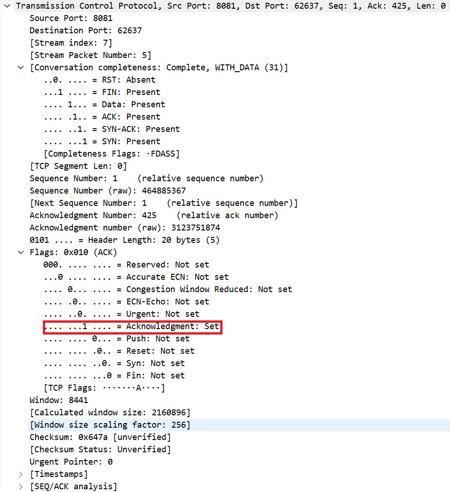

（3）服务器端向客户端发送响应报文

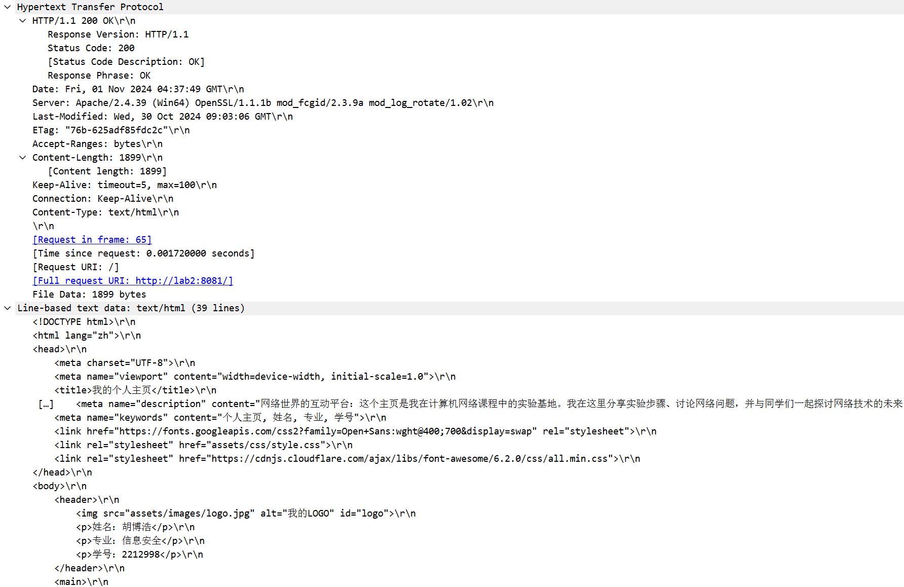

- 状态行
  - 协议版本：HTTP/1.1
  - 状态码：200，表示 OK
- 响应头部
  - Date
  - Server
  - Connection
  - ……
- 响应体
  - index.html 的内容

（4）客户端回复 ACK 表示收到请求

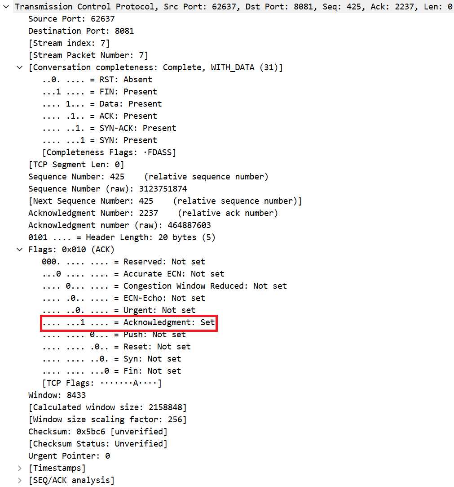

##### 2. 请求 CSS 文件、音频文件、两个图片文件以及页面图标文件 icon

- 在 HTML 页面被解析的过程中，浏览器会发现对其他文件的引用，并发起新的 HTTP GET 请求来获取这些文件。
- 服务器响应这些请求，将其他文件发送至客户端，客户端随后将这些文件应用到 HTML 内容中。

其他的请求和响应大多与 html 文件类似，因此不再赘述。

#### 独特的数据传输过程

##### 1. 请求音频文件

音频文件属于流媒体的一种，这类文件在传输时有一些特别的需求和特性：

（1）**对实时性的要求**

流媒体文件，比如音频和视频，通常需要较低的延迟，以便用户能够实时接收和播放内容。

（2）**分块传输**

由于流媒体文件可能体积庞大，它们经常被分割成小块进行传输，这样即使在网络条件不理想时也能保持播放的连续性。

（3）**累积确认**

在 TCP 协议中传输流媒体文件时，可能会采用累积确认的方式，即客户端对服务器发送的多个数据包只回复一次确认，以此减少网络流量。

（4）**错误恢复机制**

流媒体传输中可能包含特定的错误恢复机制，比如重传策略，以确保数据的完整性和播放的流畅度。

（5）**带宽调整**

流媒体传输可能会根据当前的网络带宽情况动态调整媒体流的质量，以提升用户的体验。

**具体分析**：

通过右键点击并选择 TCP 流，我们能够获取到关于音频文件的所有数据包，如下面的截图所示：

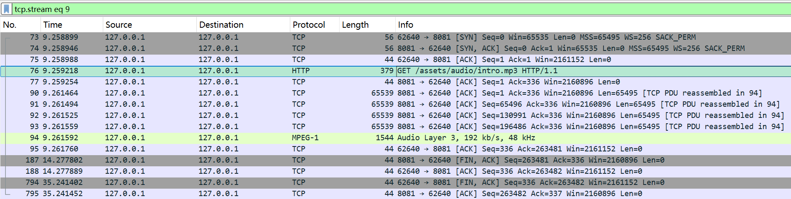

从截图中可以观察到，由于音频文件是 **分块传输** 的，客户端向服务器发送了多个请求以获取音频文件的不同部分，服务器也相应地做出了多个响应，每次响应都包含了音频文件的一个片段。

在数据包序列中，连续的 `ACK` 是服务器或客户端发送的确认信号，同时伴随着 **“TCP segment of a reassembled PDU”** 的信息。服务器连续发送多个 `ACK`（每个 `ACK` 值相同，而 `Seq` 值是上一个 `Seq` 值加上发送的数据长度），这是因为采用了 **累积确认** 机制，这样做是为了节省带宽和提高传输效率。“TCP segment of a reassembled PDU”表示 Wireshark 在将这些分散的数据包重新组装时生成的消息。

此外，可以注意到在传输开始前进行了三次握手，传输结束后立即进行了四次挥手，这表明 **音频文件的传输是通过新开启的 62640 端口专门进行的**。

##### 2. 请求图片文件

在分析数据包时，我注意到除了音频文件传输中出现的连续 `ACK` 和 **“TCP segment of a reassembled PDU”** 信息外，这些现象也出现在图片文件的传输中。以下是传输两张图片时的数据包截图：

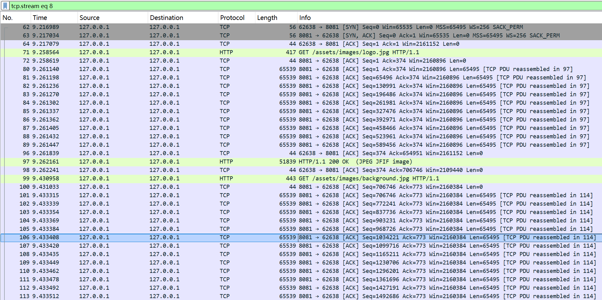

观察到的情况与音频文件传输相似，图片文件同样采用了 **分块传输、“TCP segment of a reassembled PDU”、累积确认以及通过新开启的 62640 端口进行传输的方式**。

经过分析，我认为这些现象的出现可能是因为 **这两张图片的体积较大**。大文件在网络传输时，为了确保数据的完整性和传输效率，通常会被分割成多个小的数据包进行传输。这样的处理方式有助于在网络条件不佳时，依然能够保持数据的连续传输，并且可以通过累积确认减少网络流量，提高传输效率。同时，通过专门的端口进行传输，可以更好地管理网络连接，确保数据的顺利传输。

##### 3. 请求 ico 页面图标文件

同理，请求 ico 文件时也单独开启了端口处理，但是由于没有设置 ico 文件，所以响应 `404Not Found`。

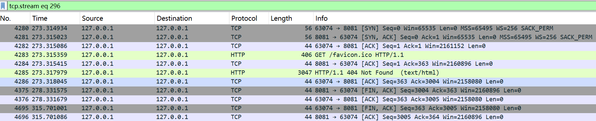

### 四次挥手，关闭连接

TCP 四次挥手是结束 TCP 连接的一个过程，它确保了双方在数据传输完成后，并且确认对方已经接收到所有数据，才能安全地关闭连接。需要注意的是，四次挥手可以由客户端或者服务器任一方发起，但通常情况下，客户端来发起这个过程被认为是更优的做法。

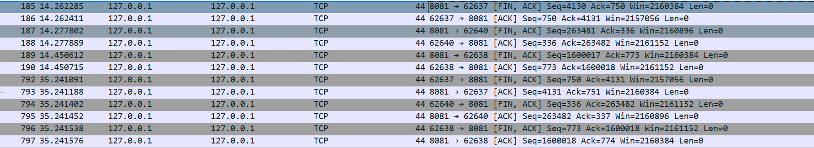

从图中可以看到，这里有三个 TCP 连接正在进行四次挥手、关闭连接的过程。根据之前的分析，我们知道 `62637` 和 `62638` 端口是由于 **浏览器的并行连接机制** 导致的，这一点在后面会有更详细的分析。而 `62640` 端口是因为 **音频文件的传输是单独通过一个新开启的端口进行的，传输完成后这个端口会立即被关闭**，这一点在之前讨论音频文件请求的部分已经详细分析过了。

#### 步骤(以客户端主动关闭为例说明)

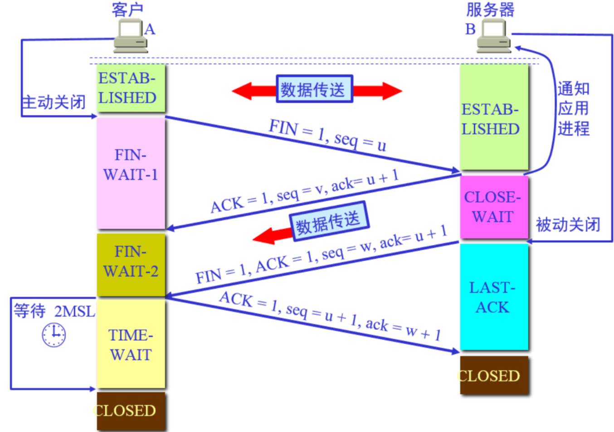

1. **第一次挥手：客户端发起关闭请求**

	客户端完成所有数据的发送后，决定关闭连接，于是客户端发送一个 FIN（结束）标志位的 TCP 段，用来关闭客户端到服务器的数据传输。客户端进入 FIN-WAIT-1 状态。

	- **客户端操作**：发送 FIN（结束）标志位的 TCP 段（seq = u）
	- **状态**：客户端进入 FIN-WAIT-1 状态

2. **第二次挥手：服务器确认客户端的关闭请求**

	服务器接收到客户端的 FIN 后，需要告知客户端已经成功收到结束请求，于是服务器发送一个 ACK（确认）标志位的 TCP 段作为回应。服务器进入 CLOSE-WAIT 状态。

	- **服务器操作**：发送 ACK 标志位的 TCP 段（ack = u+1）
	- **状态**：服务器进入 CLOSE-WAIT 状态

3. **第三次挥手：服务器发起关闭请求**

	服务器在完成所有数据的发送后，也会发送一个 FIN（结束）标志位的 TCP 段给客户端，请求关闭服务器到客户端的数据传输。服务器进入 LAST-ACK 状态。

	- **服务器操作**：发送 FIN（结束）标志位的 TCP 段（seq = w）
	- **状态**：服务器进入 LAST-ACK 状态

4. **第四次挥手：客户端确认服务器的关闭请求**

	客户端接收到服务器的 FIN 后，需要告知服务器已经成功收到结束请求，于是客户端发送一个 ACK（确认）标志位的 TCP 段作为回应。客户端进入 TIME-WAIT 状态，等待 2MSL（Maximum Segment Lifetime，报文最大生存时间）后关闭连接。服务器接收到 ACK 后，关闭连接，进入 CLOSED 状态。

	- **客户端操作**：发送 ACK 标志位的 TCP 段（ack = w+1）
	- **状态**：客户端进入 TIME-WAIT 状态，经过 2MSL 后进入 CLOSED 状态
	- **服务器操作**：接收到 ACK 后，进入 CLOSED 状态

#### 数据包截图和分析

让我们以客户端 `62637` 端口和服务器端关闭 TCP 连接为例，详细分析四次挥手的各个阶段（注意这里是 **服务器主动关闭**）：

1. **第一次挥手**：

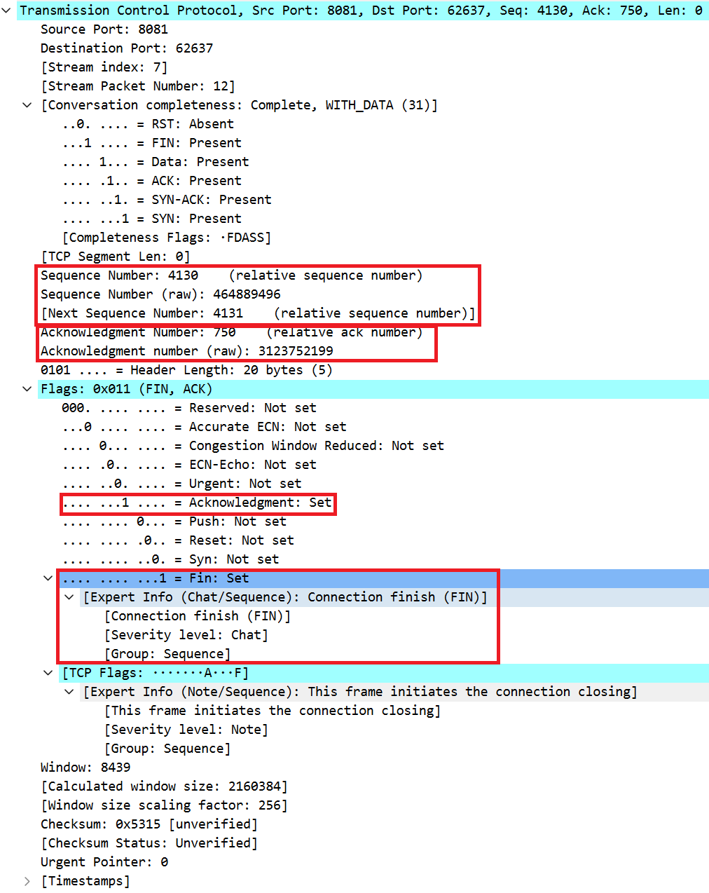

服务器向客户端发送了 FIN（结束）标志位，主动提出关闭连接的请求。

- 序列号（Seq）：`4130`
- 确认号（Ack）：`750`
- 标志位：ACK、FIN

此时，服务器进入 FIN_WAIT1 状态，等待客户端的响应。

2. **第二次挥手**：

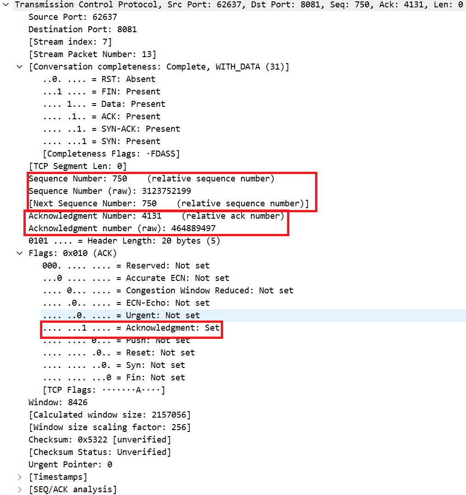

客户端收到服务器的 FIN 报文后，回复 ACK 确认，并进入 CLOSE_WAIT 状态。

- 序列号（Seq）：`750`
- 确认号（Ack）：`4131`
- 标志位：ACK

服务器收到这个确认后，进入 FIN_WAIT2 状态。

3. **第三次挥手**：

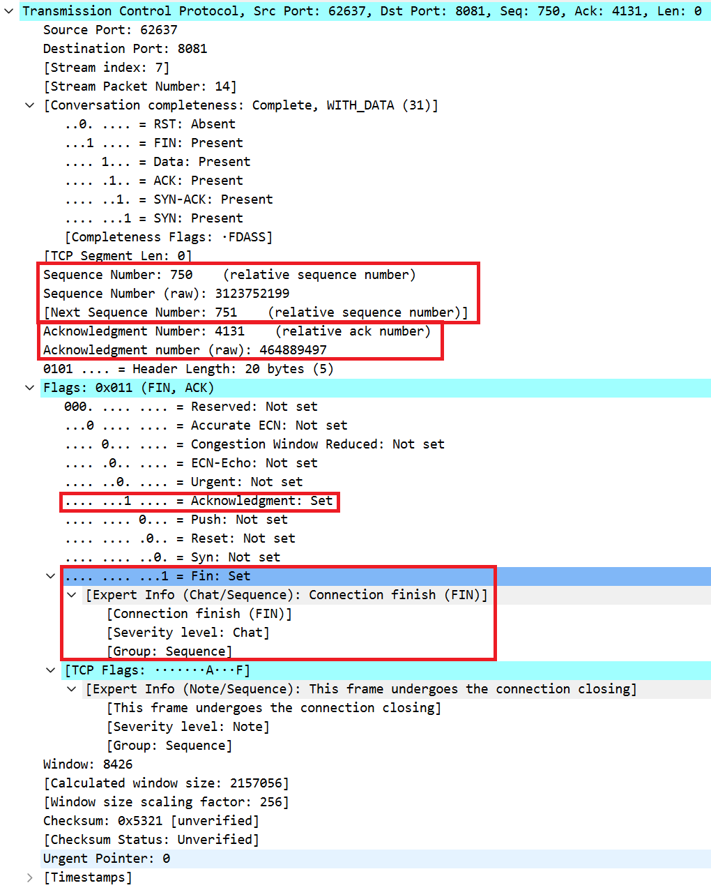

客户端在数据发送完毕后，向服务器发送 FIN 报文，请求关闭连接。

- 序列号（Seq）：`750`
- 确认号（Ack）：`4131`
- 标志位：ACK、FIN

客户端进入 LAST_ACK 状态，等待服务器的最终确认。

4. **第四次挥手**：

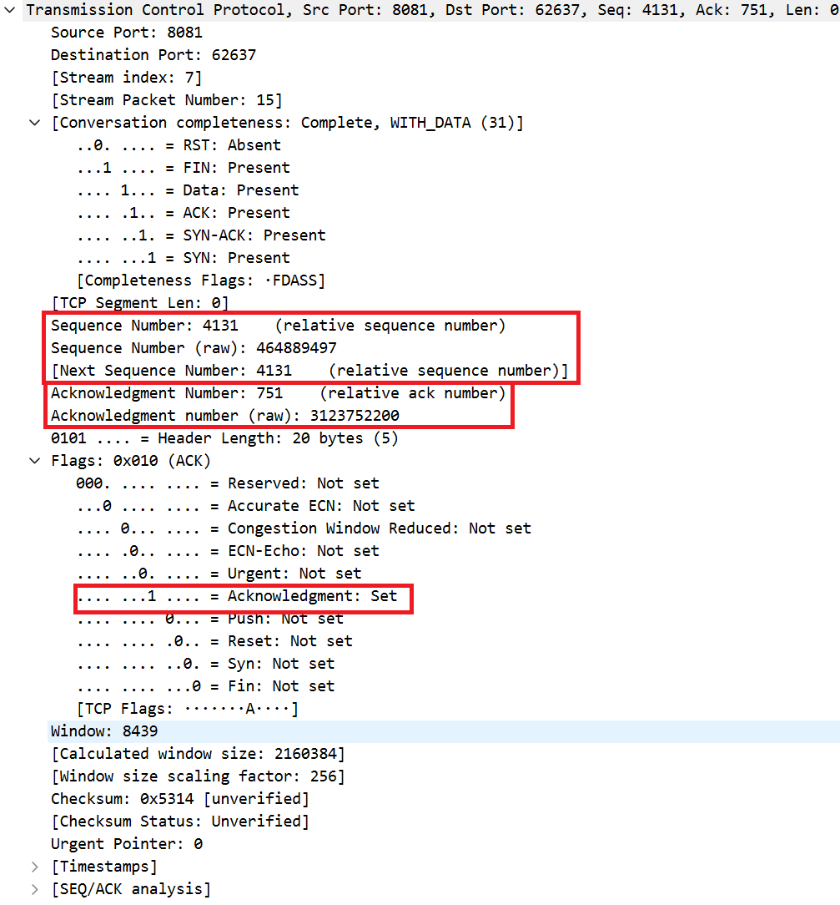

服务器回复 ACK 确认，然后进入 TIME_WAIT 状态，等待 2MSL（最大报文段生存时间）后关闭连接。

- 序列号（Seq）：`4131`
- 确认号（Ack）：`751`
- 标志位：ACK

客户端收到这个确认后，关闭连接。

#### 为何需要四次挥手

TCP 需要四次挥手而不是三次或两次，原因如下：

1. **全双工通信**：TCP 支持全双工通信，即数据可以在两个方向上独立传输。因此，每个方向的连接关闭都需要单独处理，这就要求四次挥手来分别终止两个方向的连接。

2. **确保数据完整**：四次挥手确保在关闭连接前，双方都有时间发送和接收剩余数据，保证数据的完整性。
3. **避免误关闭**：如果只使用三次挥手，可能会出现一方还有数据要发送，而另一方已经关闭连接的情况。四次挥手通过分别处理每个方向的连接关闭，避免了这种误关闭。
4. **确认机制**：四次挥手提供了足够的确认，确保双方都清楚连接正在关闭，所有数据都已传输完毕，增强了连接终止过程的可靠性。

### 其他数据包分析

在捕获的文件中，我也发现了其他的数据包，如 `TCP Keep-Alive`、`TCP Dup ACK`、`RST` 等标注的数据包。

#### TCP Keep-Alive（TCP 保活机制）

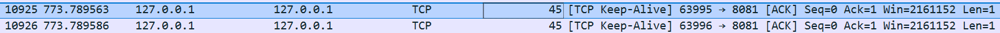

在 HTTP 1.1 中，**持久化连接** 是一个默认启用的特性，它允许多个请求和响应复用同一个 TCP 连接，避免了为每个请求单独建立和关闭连接的开销。

HTTP/1.1 通过 `Connection: keep-alive` 这个头部字段来启用持久连接。当客户端和服务器都支持持久连接时，它们可以在完成一次请求-响应后保持连接打开，以便于后续的通信。

持久连接并不是永久保持的，服务器和客户端可以设置超时时间和最大请求数。超时时间通常由 `Keep-Alive: timeout=<seconds>` 这个头部字段控制，而最大请求数则由 `Keep-Alive: max=<requests>` 控制。一旦超过这些限制，连接就会被关闭。

在这次实验中，我使用的是 Apache 服务器，**Apache 默认的保活时间为 5 秒**，也就是说，如果 5 秒内没有新的 HTTP 请求，服务器会自动关闭连接，进行四次挥手后结束连接。如果需要，可以通过修改 Apache 的配置文件来调整这个保活超时时间。

#### TCP Dup ACK（TCP 重复确认）


在查看数据包截图时，注意到接收方发出了一系列重复的 ACK。这种情况通常意味着接收方已经收到了一个数据段，并且正在等待下一个数据段的到来。这些重复的 ACK 携带相同的确认序列号，这实际上是在告诉发送方哪个数据包是它期待接收的。

#### RST（TCP 连接重置）

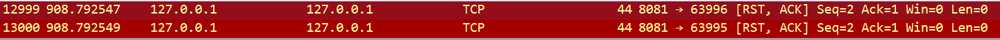

观察这个数据包，可以发现它标记了 RST 和 ACK。深入查看数据包详情，会看到一个警告提示：**“(Warning/Sequence): Connection reset (RST)”**。如下所示：

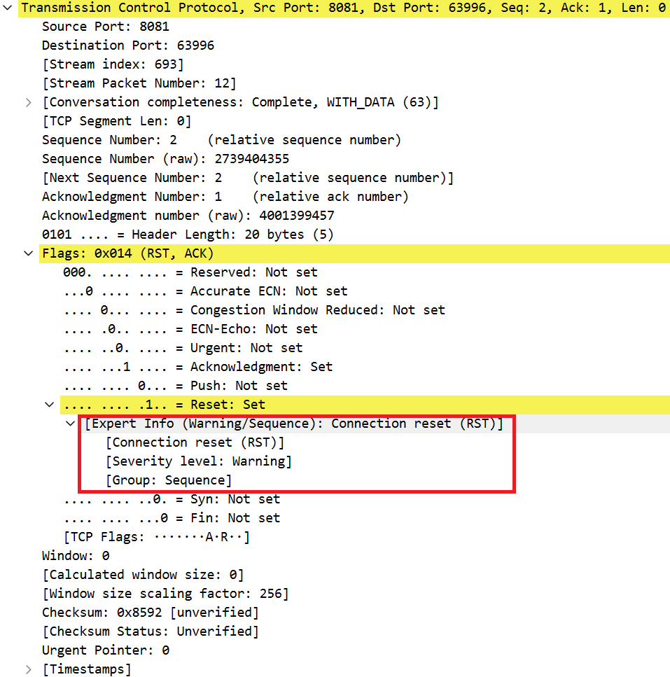

这个提示意味着连接的一端（这里是服务器）发出了一个重置信号，目的是要立即结束当前的 TCP 连接。

#### Not Modified（未修改状态）

之前说过如果清理缓存，会影响抓包。因此这里尝试在不清除浏览器缓存的情况下重新加载网页，看看网络请求会有什么变化。

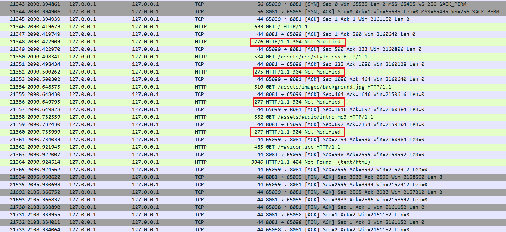

从截图中可以看到，当客户端尝试获取资源时，由于这些资源自从上次请求后并没有发生变化，服务器对这些请求的回应都是 **304 Not Modified**。这种情况通常出现在使用了条件请求的情况下，比如通过 If-Modified-Since 这样的 HTTP 头部。如果服务器检测到请求的资源自上次请求以来没有被修改，它就会返回一个 304 状态码，告诉客户端可以继续使用缓存中的版本。

#### 浏览器的并行连接机制

浏览器的并行连接机制，也就是我们常说的 HTTP 并行连接或连接复用，是指浏览器为了提升数据传输效率，能够在多个 TCP 连接上同时发起多个 HTTP 请求。

##### 并发连接

1. **多个 TCP 连接**
   - 浏览器可以对同一个服务器建立多个并发的 TCP 连接。这样，浏览器就能同时通过这些连接请求多个资源，而不是逐个等待每个请求完成。
   - 根据 HTTP/1.1 规范，浏览器通常会为同一域名建立多个并发连接，数量一般在 2 到 8 个之间，具体取决于浏览器的具体实现。

2. **资源加载优化**
   - 并发连接使得浏览器可以同时请求多个资源，比如 HTML、CSS、JavaScript 文件和图片等，这大大缩短了页面的加载时间，尤其是在加载需要大量资源的复杂网页时。

##### 管线化

1. **管线化请求**
   - HTTP 管线化允许浏览器在一个 TCP 连接上连续发送多个请求，而不必等待每个请求的响应。如果第一个请求没有立即得到响应，浏览器可以继续发送后续请求。
   - 这种技术可以减少等待服务器响应的时间，特别是在服务器处理请求的顺序性导致某些请求被延迟时。

2. **响应顺序**
   - 尽管请求是连续发送的，但服务器必须按照接收到请求的顺序发送响应。如果一个请求处理时间较长，它可能会阻塞后续请求的响应，这种现象被称为“队头阻塞”。

##### 数据包截图和分析

以下是浏览器并行机制的数据包截图和分析：

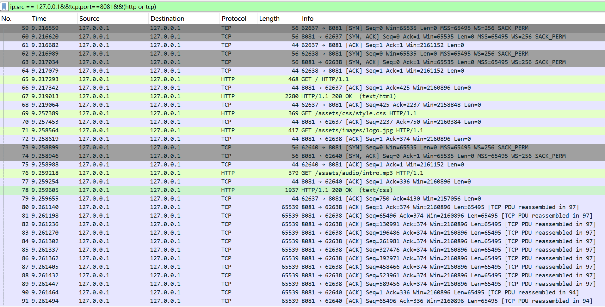

从截图中可以看到，多个 TCP 连接几乎同时被建立，每个连接都包含了 HTTP 请求和响应。

这些连接并行地传输数据，例如，一个连接端口 `62640` 正在传输音频文件 intro，而另一个连接端口 `62638` 正在传输图片文件 logo。

通过这种方式，浏览器能够同时接收多个资源，而不需要等待一个资源完全下载完成，从而提高了页面加载的效率。

## 六、实验反思与总结

------

### 遇到的问题及解决过程

#### 1. 缓存处理

在使用 Wireshark 进行网络抓包时，浏览器缓存是一个需要注意的问题。为了确保每次捕获的数据包都是从服务器新获取的，我采取了以下措施：

- **清除缓存**：在每次抓包前，我都会手动清除浏览器缓存，以确保每次访问网站都能从服务器获取最新数据。

- **禁用缓存**：在浏览器的开发者工具中禁用缓存，这样浏览器就不会使用缓存内容，而是每次都向服务器发起请求。在 Chrome 中，可以通过搜索“cache”并调整相关设置来实现。

#### 2. 网络握手挥手细节

最初，我对 TCP 的三次握手和四次挥手的具体细节不太了解，面对数据包时感到无从下手。

我通过学习网络协议的基础知识，逐步理解了握手过程的细节，从而能够更好地分析数据包。

#### 3. 大文件分段传输

对于大文件的分段传输，一开始我不太明白为什么会有那么多 ACK 数据包。

后来我明白了大文件需要分段传输，每个分段都会收到对应的 ACK 确认，这是确保数据完整性的重要机制。

#### 4. 并行连接机制

面对多次出现的三次握手和四次挥手，我一开始不了解浏览器的并行连接机制。

通过研究，我了解到浏览器可以同时开启多个 TCP 连接来提高数据传输效率，这也是为什么会有多次握手和挥手的原因。

#### 5. 其他数据包类型

在实验中，我还遇到了 TCP Keep-Alive、TCP Dup ACK、RST、Not Modified 等其他类型的数据包，一开始不太清楚它们的具体作用。

我没有放弃，而是不断探究这些数据包的原因和作用，最终理解了它们在网络通信中的重要性和作用。

### 思考分析

除了上述问题、前面报告中的探索思考之外，我还对以下几个方面进行了深入的思考和分析：

#### 为什么选择 HTTP 而非 HTTPS

选择使用 HTTP 协议而不是 HTTPS，主要是因为 HTTPS 数据传输是加密的，这使得 Wireshark 捕获的数据包内容难以解读。此外，使用 HTTPS 还需要从 CA 申请证书，免费证书不多，而且通常需要支付费用。

#### HTTP/1.1 和 HTTP/1.0 的主要区别

- **缓存控制**：HTTP/1.1 对缓存机制进行了优化，引入了如 Cache-Control 和 ETag 等控制机制，这增强了缓存管理的效率和适应性。在分析数据时，我也观察到了这些字段。
- **连接持久性**：与 HTTP/1.0 每次请求都需要新开 TCP 连接不同，HTTP/1.1 支持持久连接，允许多个请求和响应在同一个 TCP 连接上进行，减少了连接建立和断开的消耗，提升了网络性能。这就是所谓的 keep-alive 机制，我在实验中也观察到了其多次出现。
- **其他变化**：还包括了流水线请求、分块传输（例如，大文件通过多个 TCP 流传输）、Host 头字段（用于指定请求的目标主机，使得同一服务器可以管理多个域名的网站）以及更细致的错误处理（例如，OK、Not Modified 等状态码）。

#### 为什么 TCP 四次挥手后要等待 2MSL

在 TCP 协议中，当一方主动关闭连接并在发送最后一个 ACK 之后，它会进入“TIME_WAIT”状态，并等待 2 个 MSL（最大报文段生存时间）后才关闭连接。这样做的原因有两个：

1. **确保 ACK 到达**：2MSL 的等待时间确保了最后一个 ACK 能够到达接收方。如果 ACK 在传输中丢失，接收方会重新发送 FIN，而发送方在“TIME_WAIT”状态下能够重新发送 ACK 以响应。
2. **防止旧数据干扰**：2MSL 的等待时间确保了所有在连接期间产生的数据包都已从网络中清除，防止它们对新的连接造成干扰。MSL 是数据包在网络中可能存在的最长时间，2MSL 确保了数据包在网络中的两个方向上的传输都已彻底完成。

