<div align='center'>
<b> <font face='微软雅黑' size='6'> 计算机网络课程实验报告 </font> </b>
</div>


<div align='center'>
<b> <font font face='微软雅黑' size='6'> 实验 3-1 </font> </b>
</div>


<div>
<font face='宋体' size='6'>&nbsp;&nbsp;&nbsp;&nbsp; 学 院：网络空间安全学院 </font> <br>
<font face='宋体' size='6'>&nbsp;&nbsp;&nbsp;&nbsp; 专 业：信息安全 </font> <br>
<font face='宋体' size='6'>&nbsp;&nbsp;&nbsp;&nbsp; 学 号：2212998 </font> <br>
<font face='宋体' size='6'>&nbsp;&nbsp;&nbsp;&nbsp; 姓 名：胡博浩 </font> <br>
</div>
## 一、实验要求与功能

------

### （一）实验要求

利用 **数据报套接字** 在用户空间实现 <span style="color:#FF0000;"> 面向连接的可靠数据传输 </span>，功能包括：**建立连接、差错检测、接收确认、超时重传** 等。流量控制采用 **停等机制**，完成给定 **测试文件的传输**。

1. 数据报套接字：UDP
2. 协议设计：数据包格式，发送端和接收端交互，详细完整
3. 建立连接、断开连接：类似 TCP 的握手、挥手功能
4. 差错检验：校验和
5. 接收确认、超时重传：rdt2.0、rdt2.1、rdt2.2、`rtd3.0` 等，亦可自行设计协议
6. 单向传输：发送端、接收端
7. 日志输出：收到/发送数据包的序号、ACK、校验和等，传输时间与吞吐率
8. 测试文件：必须使用助教发的测试文件（1.jpg、2.jpg、3.jpg、helloworld.txt）

### （二）自行扩展功能

为进一步完善实验，设计和实现了以下扩展功能：

1. **连接断开的可靠性增强**
	- 考虑到 **最后一个 ACK 可能丢失** 的情况，在连接断开设计中引入等待 2MSL 机制，确保 Client 和 Server 均能正确关闭连接。
	- 类似地，在连接建立阶段，考虑 **最后一个 ACK 的丢失**，同样设计等待 2MSL 机制，保证连接的可靠性。
2. **特殊情况处理**
	协议设计中额外考虑了以下特殊情况：
	- 数据包乱序
	- Server 端 ACK 丢失
	- 其他可能影响传输的异常情况
3. **用户体验优化**
	- 提供详细的错误提示信息，方便排查问题。
	- 通过控制台颜色区分信息类型（如错误、提示、正常输出等），提升操作体验。

感谢老师的教导与助教的批阅，辛苦！

## 二、实验环境与说明

------

### （一）环境配置

本实验在 Windows 系统上使用 Visual Studio 进行开发，文件编码为 UTF-8（带 BOM）。实验中通过 C++ 编写了服务器和客户端程序，使用了多种库函数和头文件来实现网络通信、文件操作等功能。

### （二）头文件与库函数

**主要头文件：**

- `<iostream>`：用于标准输入输出操作。
- `<winsock2.h>`：用于 Windows 套接字编程。
- `<ws2tcpip.h>`：提供了 Windows 套接字扩展功能。
- `<string>`：用于字符串操作。
- `<fstream>`：用于文件读写操作。
- `<chrono>`：用于时间操作和计时。
- `<memory>`：用于智能指针管理。
- `<vector>`：用于动态数组操作。
- `<sstream>`：用于字符串流操作。

**关键库函数：**

- WSAStartup：初始化 Winsock 库。

- socket：创建套接字。

- bind：绑定套接字到本地地址。

- sendto：发送数据到指定地址。

- recvfrom：从指定地址接收数据。

- closesocket：关闭套接字。

- WSACleanup：清理 Winsock 库。

- inet_pton：将 IPv4 和 IPv6 地址从文本转换为二进制形式。

- ioctlsocket：控制套接字的 I/O 模式。

- FormatMessageA：格式化系统错误消息。

通过这些头文件和库函数，实验实现了客户端与服务器之间的 UDP 通信，包括三次握手、四次挥手以及文件传输等功能。

## 三、协议设计

------

### （一）协议概述

本协议的设计目标是在不可靠的 UDP 信道上实现可靠的文件传输。协议模拟了 TCP 中的连接建立（通过三次握手）和连接断开（通过四次挥手），并且采用了类似 TCP 的重传机制来保证数据的可靠传输。通过自定义的数据包结构和错误检测与恢复机制，确保数据能够在丢包、延迟等不可靠网络环境下高效且完整地传输。

### （二）数据包设计

为了确保在不可靠的网络环境中实现可靠的文件传输，本协议设计了自定义的数据包格式 `Message`，该数据包包含了通信中所需的所有字段，并通过校验和机制确保数据完整性。数据包的具体结构如下：

#### 1. 数据包格式

```cpp
#pragma pack(1) // 设置结构体内存对齐为1字节
class Message {
public:
    uint32_t srcIP{ 0 };       // 源IP地址（4字节）
    uint32_t destIP{ 0 };      // 目的IP地址（4字节）
    uint16_t srcPort{ 0 };     // 源端口（2字节）
    uint16_t destPort{ 0 };    // 目的端口（2字节）
    uint32_t seqNum{ 0 };      // 序列号（4字节）
    uint32_t ackNum{ 0 };      // 确认号（4字节）
    uint32_t length{ 0 };      // 数据长度（4字节）
    uint16_t flags{ 0 };       // 标志位（2字节）
    uint16_t checkNum{ 0 };    // 校验和（2字节）
    uint8_t data[MAX_MSG_SIZE]{ 0 };  // 数据段（最大大小为10000字节）
    // 构造函数
    Message() = default;
    // 标志位操作
    bool is_SYN() const { return flags & Flag::SYN; }
    void set_SYN() { flags |= Flag::SYN; }
    bool is_ACK() const { return flags & Flag::ACK; }
    void set_ACK() { flags |= Flag::ACK; }
    bool is_FIN() const { return flags & Flag::FIN; }
    void set_FIN() { flags |= Flag::FIN; }
    bool is_FILE_NAME() const { return flags & Flag::FILE_NAME; }
    void set_FILE_NAME() { flags |= Flag::FILE_NAME; }
    // 校验和方法
    bool checkSum();
    void setCheckSum();
    // 清理报文
    void clean();
};
#pragma pack() // 恢复默认内存对齐
```

**字段说明：**

- **srcIP** 和 **destIP**：由于实验在本地进行，这两个字段未实际使用，但保留以模拟真实环境。
- **srcPort** 和 **destPort**：源端口和目标端口，用于标识通信双方的端口。
- **seqNum**：序列号，用于保证数据包的有序性。
- **ackNum**：确认号，用于接收方确认数据包的接收。
- **length**：数据段长度，指示有效数据部分的大小。
- **flags**：标志位，指示数据包的类型和控制信息，如连接请求、确认、数据等。
- **checkNum**：校验和，用于确保数据传输过程中的完整性。
- **data**：数据部分，包含实际传输的文件数据或控制信息。

#### 2. 标志位定义

```cpp
struct Flag {
    static constexpr uint16_t SYN = 0x1;        // 建立连接
    static constexpr uint16_t ACK = 0x2;        // 确认接收
    static constexpr uint16_t FIN = 0x4;        // 关闭连接
    static constexpr uint16_t FILE_NAME = 0x8;  // 传输文件名
};
```

### （三）客户端和服务器交互过程

客户端和服务器通过自定义的协议进行通信，主要包括连接建立、数据传输和连接断开三个阶段。为了在不可靠的 UDP 信道上实现可靠的数据传输，引入了超时重传机制和差错校验机制。

#### 1. 连接建立：三次握手（包含超时重传）

连接建立采用类似 TCP 的三次握手机制，确保双方建立可靠的通信通道。

##### 流程描述

1. **第一次握手：** 客户端发送一个带有 `SYN` 标志位的报文，序列号为 `seqNum = x`。

2. **第二次握手：** 服务器收到后，回复一个带有 `SYN` 和 `ACK` 标志位的报文，序列号为 `seqNum = y`，确认号为 `ackNum = x + 1`。

3. **第三次握手：** 客户端收到后，再发送一个带有 `ACK` 标志位的报文，序列号递增、即 `seqNum = x + 1`，确认号为 `ackNum = y + 1`。

4. **等待确认：** 客户端在发送完第三次握手的 `ACK` 报文后，进入 `TIME_WAIT` 状态，等待 **2 \* MSL**（最大报文段生存时间），以确保服务器成功接收到 `ACK`。

5. **连接建立成功：** 服务器收到第三次握手的 `ACK` 后，认为连接建立成功。

##### 时序图

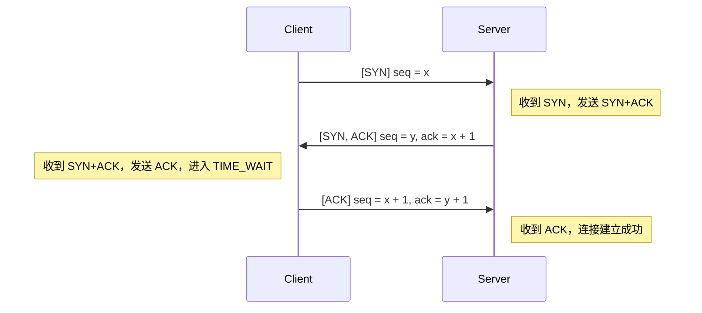

##### 超时重传机制

为保证连接可靠建立，引入超时重传机制：

- **客户端：**
  - 在发送第一次握手（`SYN`）后，启动定时器，等待服务器的 `SYN+ACK` 报文。
  - 若在超时时间（如 500ms）内未收到预期报文，则重传 `SYN` 报文。
  - 最大重传次数限制，超过则连接建立失败。
  - 在发送第三次握手（`ACK`）后，进入 `TIME_WAIT` 状态，等待 **2 \* MSL**，以防止 `ACK` 丢失导致服务器重复发送 `SYN+ACK`。
- **服务器：**
  - 在发送第二次握手（`SYN+ACK`）后，启动定时器，等待客户端的 `ACK` 报文。
  - 若在超时时间内未收到 `ACK`，则重传 `SYN+ACK` 报文，直到达到最大重传次数。

##### 三次握手流程图

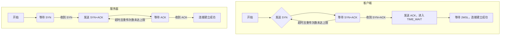

#### 2. 可靠数据传输（包含超时重传和停等机制）

文件传输过程需要在不可靠的 UDP 信道上实现可靠的数据传输，包括差错检验、接收确认、超时重传和流量控制。

##### 传输过程描述

1. **文件名传输：**
	- **客户端：** 发送一个带有 `FILE_NAME` 标志的报文，`seqNum = n`，数据段包含文件名和文件大小。
	- **服务器：** 接收后，回复一个 `ACK` 报文，`ackNum = n + 1`。
2. **文件数据传输：**
	- **客户端：** 将文件按 `MAX_MSG_SIZE` 分块，每个数据块发送一个数据报文，`seqNum` 依次递增。
	- **服务器：** 接收数据报文，确认校验和正确后，回复对应的 `ACK` 报文，`ackNum = 收到的 seqNum + 1`。

##### 数据传输时序图

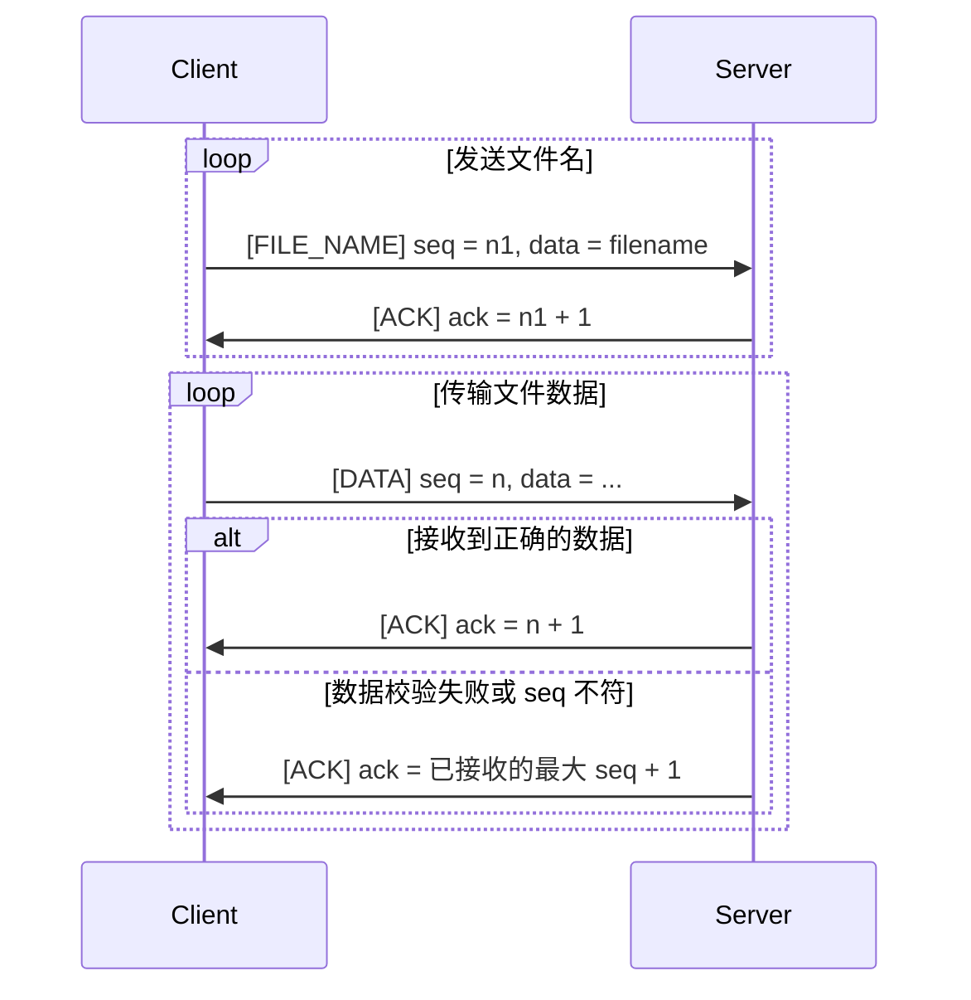

##### 超时重传机制

**客户端**:

- 在发送每个数据报文后，启动定时器，等待服务器的 `ACK`。
- 若在超时时间内未收到对应的 `ACK`，则重传该数据报文。
- 采用停等协议，即每次只发送一个数据包，等待 `ACK` 后才发送下一个。

##### 数据传输流程图

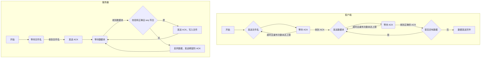

#### 3. 连接断开：四次挥手（包含超时重传）

连接断开采用类似 TCP 的四次挥手机制，双方依次发送和确认关闭连接的请求。

##### 流程描述

1. **第一次挥手：** 客户端发送带有 `FIN` 标志的报文，序列号 `seqNum = u`，表示请求关闭连接。
2. **第二次挥手：** 服务器收到后，发送带有 `ACK` 标志的确认报文，确认号为 `ackNum = u + 1`。
3. **第三次挥手：** 服务器发送带有 `FIN` 标志的报文，序列号 `seqNum = v`，表示准备关闭连接。
4. **第四次挥手：** 客户端收到后，发送带有 `ACK` 标志的确认报文，`seqNum = u + 1`，`ackNum = v + 1`。
5. **等待确认（客户端）：** 客户端在发送完最后的 ACK 报文后，重新进入 `TIME_WAIT` 状态，等待 **2 \* MSL**，以确保服务器成功接收到 `ACK`。
6. **连接关闭：** 服务器收到 `ACK` 后，直接关闭连接；客户端在等待超时后，关闭连接。

##### 时序图

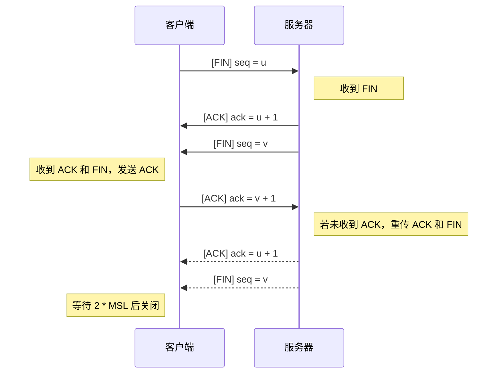

##### 超时重传机制

- **客户端：**
  - 在发送第一次挥手（`FIN`）后，启动定时器，等待服务器的 `ACK` 和 `FIN` 报文。
  - 若在超时时间内未收到预期报文，则重传 `FIN` 报文，重新等待两个报文，直到达到最大重传次数。
  - 如果只收到 `ACK` 未收到 `FIN`，超时后也重传 `FIN`
  - 收到两个报文后，发送最后的 `ACK` 报文，进入 `TIME_WAIT` 状态，等待 **2 \* MSL**。
  - 若在 `TIME_WAIT` 状态时，再次收到服务器的 `ACK + FIN` 报文，重新发送 `ACK`。
- **服务器：**
  - 在收到客户端的 `FIN` 后，依次发送 `ACK` 和 `FIN` 报文。
  - 发送后，启动定时器，等待客户端的最后 `ACK`。
  - 若在超时时间内未收到 `ACK`，则重传 `ACK` 和 `FIN` 报文，直到达到最大重传次数。
  - 收到客户端的 `ACK` 后，直接关闭连接。


##### 四次挥手流程图

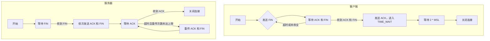

### （四）状态机图

#### 1. 客户端状态机

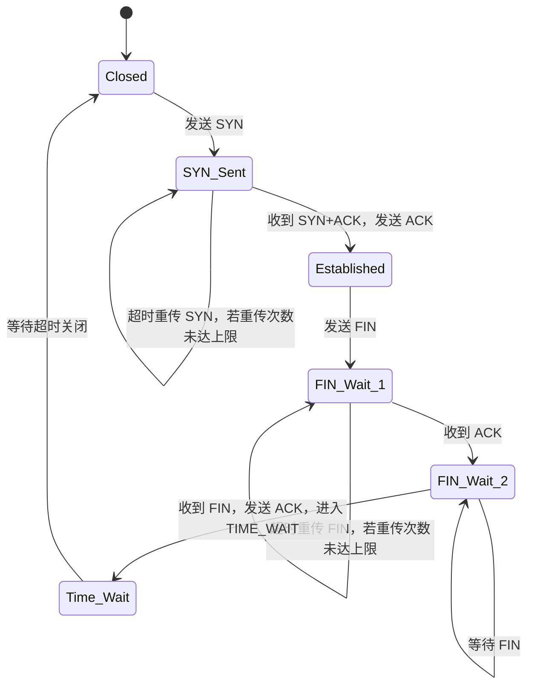

#### 2. 服务器端状态机

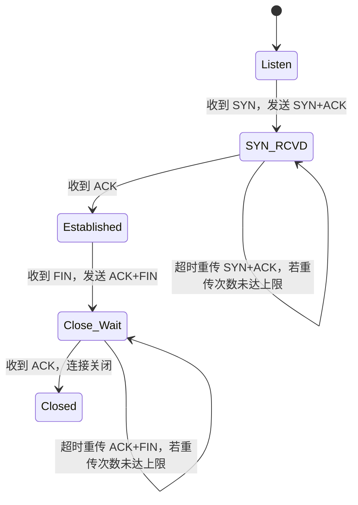

### （五）限制和约束

1. **数据包大小限制：**

   **最大数据段大小：** MAX_MSG_SIZE 为 10000 字节，防止数据包过大导致丢失。

2. **序列号和确认号：**

   每次发送或接收数据包，seqNum 和 ackNum 必须严格按照协议递增，确保数据有序可靠传输。

### （六）总结

通过上述设计，实现了在不可靠的 UDP 信道上进行可靠的文件传输。通过三次握手和四次挥手机制，确保了连接的可靠建立和正确关闭；通过超时重传、校验和和停等机制，保证了数据传输的可靠性和完整性。

## 四、程序设计

------

### （一）程序简介

本次实验的目标是在 UDP 不可靠信道上设计一个可靠传输协议。我基于 TCP 协议的设计思想，实现了类似的三次握手连接、四次挥手断开连接以及可靠的数据传输协议（基于 rdt3.0 协议）。具体来说，我设计了合理的消息格式，并利用提供的路由器进行包括超时重传机制在内的多种测试，最后对结果进行综合分析。

### （二）程序模块与功能

本次实验的实现主要包含三个核心文件：**Message.h**、**Client.cpp**、**Server.cpp**。各文件的功能与关键实现如下：

#### Message.h

该文件定义了消息传输过程中使用的消息格式和相关常量，核心内容包括：

##### 模拟丢包

```c++
double packetLossRate = 0.1; // 丢包率，取值范围为 0.0 到 1.0
int delayTime = 100;         // 延时时间，单位为毫秒
```

##### 常量定义

```c++
constexpr int MAX_WAIT_TIME = 500;        // 超时时间（毫秒）
constexpr int MAX_SEND_TIMES = 10;       // 最大重传次数
constexpr int MAX_FILE_SIZE = 100000000; // 最大文件大小（字节）
constexpr int MAX_MSG_SIZE = 10000;      // 最大数据段大小
```

##### 网络配置常量

```c++
constexpr const char* routerIP = "127.0.0.1";   // 路由器 IP 地址
constexpr const char* clientIP = "127.0.0.1";   // 客户端 IP 地址
constexpr const int routerPORT = 30000;         // 路由器端口
constexpr const int clientPORT = 12345;         // 客户端端口
```

##### 标志位定义

通过 **Flag** 结构定义常见标志位，用于控制连接建立与数据传输过程：

```c++
struct Flag {
    static constexpr uint16_t SYN = 0x1;        // 0001,建立连接
    static constexpr uint16_t ACK = 0x2;        // 0010,确认接收
    static constexpr uint16_t FIN = 0x4;        // 0100,关闭连接
    static constexpr uint16_t FILE_NAME = 0x8;  // 1000,文件名
};
```

##### Message 类

Message 类负责封装网络传输的报文格式，包括头部字段和数据段。其主要功能如下：

- **头部字段**：用于存储源/目的地址、序号、确认号、标志位等元信息。
- **数据段**：存储传输内容，最大长度为 10,000 字节。
- **关键方法**：提供校验和设置、清理报文、标志位管理等功能。

```c++
class Message {
public:
    //头部（一共28字节）
    uint32_t srcIP{ 0 };     // 源IP(4字节)
    uint32_t destIP{ 0 };    // 目的IP(4字节)
    uint16_t srcPort{ 0 };   // 源端口(2字节)
    uint16_t destPort{ 0 };  // 目的端口(2字节)
    uint32_t seqNum{ 0 };    // 序号(4字节)，这个表示相对序列号
    uint32_t ackNum{ 0 };    // 确认号(4字节)
    uint32_t length{ 0 };    // 数据段长度(4字节)
    uint16_t flags{ 0 };     // 标志位(2字节)
    uint16_t checkNum{ 0 };  // 校验和(2字节)
    uint8_t data[MAX_MSG_SIZE]{ 0 };  // 数据段
    Message() = default;
    // 标志位管理
    bool is_SYN() const { return flags & Flag::SYN; }
    void set_SYN() { flags |= Flag::SYN; }
    bool is_ACK() const { return flags & Flag::ACK; }
    void set_ACK() { flags |= Flag::ACK; }
    bool is_FIN() const { return flags & Flag::FIN; }
    void set_FIN() { flags |= Flag::FIN; }
    bool is_FILE_NAME() const { return flags & Flag::FILE_NAME; }
    void set_FILE_NAME() { flags |= Flag::FILE_NAME; }
    // 校验和方法
    bool checkSum();
    void setCheckSum();
    // 清理报文
    void clean() {
        srcIP = destIP = srcPort = destPort = seqNum = ackNum = length = flags = checkNum = 0;
        memset(data, 0, sizeof(data));
    }
};
```

#### Client.cpp

客户端程序实现了发送文件的核心逻辑，主要功能包括：

1. **类设计**：
	- 封装客户端的核心状态（如 Socket、地址信息、连接状态、序列号等）。
	- 使用 **Message** 类表示发送和接收的报文。
2. **功能实现**：
	- **三次握手**：通过调用 `threeWayHandshake()` 方法，与服务端建立可靠连接。
	- **文件传输**：调用 `sendFile()` 方法，基于停等协议发送文件数据，保证可靠性。
	- **四次挥手**：使用 `fourWayHandwave()` 方法断开连接，确保双方正常关闭连接。
3. **辅助方法**：
	提供日志打印、错误处理、报文设置与发送等功能。

```c++
class Client {
private:
    SOCKET clientSocket;                // 客户端 socket
    SOCKADDR_IN routerAddr;             // 路由器地址
    SOCKADDR_IN clientAddr;             // 客户端地址
    bool isConnected;                   // 是否连接成功
    int currentSeq;                     // 当前序列号
    Message sendMsg;                    // 发送的报文
    Message recvMsg;                    // 接收的报文
    void printMessageInfo(const Message& msg, const string& prefix, Level level);//打印报文信息
    string getErrorMessage(int errorCode);//获取系统错误信息
    void setMsg(Message& sendMsg);//设置报文
    bool sendMessage(Message& sendMsg);//实现单个报文发送
    bool sendtoWithSimulation(SOCKET s, const char* buf, int len, int flags, const struct sockaddr* to, int tolen);//发送数据时模拟丢包延时
public:
    Client() : clientSocket(INVALID_SOCKET), isConnected(false), currentSeq(0) {}
    ~Client() {
        if (clientSocket != INVALID_SOCKET) {
            closesocket(clientSocket);
            clientSocket = INVALID_SOCKET;
        }
        WSACleanup();
    }
    void print(const string& info, Level level);//打印信息
    bool initialize();//初始化client
    bool threeWayHandshake();//实现client的三次握手
    void sendFile(const string& filename);//实现文件传输
    bool fourWayHandwave();//实现client的四次挥手
    void waitExit();//等待退出
};
```

#### Server.cpp

服务器程序负责接收文件并实现与客户端的交互逻辑，功能包括：

1. **类设计**：
	- 管理服务器的 Socket、地址信息、连接状态等核心资源。
	- 使用 **Message** 类管理报文的接收与发送。
2. **功能实现**：
	- **三次握手**：调用 `threeWayHandshake()` 方法与客户端建立连接。
	- **文件接收**：通过 `recvFile()` 方法接收并存储文件，处理丢包、乱序等异常情况。
	- **四次挥手**：调用 `fourWayHandwave()` 方法实现可靠的连接关闭。
3. **辅助方法**：
	提供 ACK 发送、日志打印、错误处理等功能。

```c++
class Server {
private:
    SOCKET serverSocket;//服务器socket
    SOCKADDR_IN serverAddr;//服务器地址
    SOCKADDR_IN routerAddr;//路由器地址
    bool isConnected;//是否连接成功
    int currentSeq;  // 当前序列号
    Message sendMsg;//发送的报文
    Message recvMsg;//接收的报文
    void printMessageInfo(const Message& msg, const string& prefix, Level level);//打印报文信息
    string getErrorMessage(int errorCode);//获取系统错误信息
    void setMsg(Message& sendMsg);//设置报文
    bool recvMessage(Message& recvMsg);//实现单个报文接收
    void sendAck(uint32_t ackNum);//发送ACK报文
    bool sendtoWithSimulation(SOCKET s, const char* buf, int len, int flags, const struct sockaddr* to, int tolen);//发送数据时模拟丢包延时
public:
    Server() : serverSocket(INVALID_SOCKET), isConnected(false), currentSeq(0) {}
    ~Server() {
        if (serverSocket != INVALID_SOCKET) {
            closesocket(serverSocket);
            serverSocket = INVALID_SOCKET;
        }
        WSACleanup();
    }
    void print(const string& info, Level level);//打印信息
    bool initialize();//初始化server
    bool threeWayHandshake();//实现server的三次握手
    void recvFile();//实现文件接收
    bool fourWayHandwave();//实现server的四次挥手
    void run();//运行server
};
```

### （三）核心代码分析

#### 差错检测

在本次实验中，为了确保数据传输的可靠性，我在消息传输过程中实现了差错检测机制。具体实现如下：

在 Message.h 文件中，我定义了 Message 类，该类包含了消息头部的各种字段和数据段，并提供了校验和的计算和验证方法。

##### 校验和方法

- checkSum 方法用于验证 Message 结构体的校验和是否正确。

```c++
bool Message::checkSum() {
    uint32_t sum = 0;
    uint16_t* msg = (uint16_t*)this;
    for (int i = 0; i < sizeof(*this) / 2; i++) {
        sum += *msg++;
        if (sum & 0xFFFF0000) {
            sum &= 0xFFFF;
            sum++;
        }
    }
    return (sum & 0xFFFF) == 0xFFFF;
}
```

该方法通过遍历 Message 结构体的每个 16 位单元，计算所有单元的和，并检查最终的和是否为 0xFFFF。如果是，则校验和正确。

- setCheckSum 方法用于计算并设置 Message 结构体的校验和。

```c++
void Message::setCheckSum() {
    checkNum = 0;
    uint32_t sum = 0;
    uint16_t* msg = (uint16_t*)this;
    for (int i = 0; i < sizeof(*this) / 2; i++) {
        sum += *msg++;
        if (sum & 0xFFFF0000) {
            sum &= 0xFFFF;
            sum++;
        }
    }
    checkNum = ~(sum & 0xFFFF);
}
```

该方法通过遍历 Message 结构体的每个 16 位单元，计算所有单元的和，并将最终的和取反后赋值给 checkNum 字段，从而设置校验和。

##### 差错检测的应用

在 `Client.cpp` 和 `Server.cpp` 文件中，我在发送和接收消息时都应用了校验和方法。例如，在客户端发送消息时，我调用 setCheckSum 方法计算并设置校验和：

```c++
void Client::setMsg(Message& sendMsg) {
    ......// 设置消息的其他字段
    sendMsg.setCheckSum(); // 设置校验和
}
```

在服务器接收消息时，我调用 checkSum 方法验证校验和：

```c++
bool Server::recvMessage(Message& msg) {
    ......
    while (true) {
        ......// 接收消息
        if (recvBytes > 0) {
            if (msg.checkSum()) { // 验证校验和
                ......// 处理消息
            } else {
                ......// 校验和错误，丢弃消息
            }
        }
    }
    ......
}
```

#### 建立连接

在本次实验中，客户端和服务器通过三次握手协议建立可靠连接，确保双方都已准备好进行数据传输。

##### 客户端（Client.cpp）

客户端的三次握手过程在 `threeWayHandshake` 方法中实现。具体步骤如下：

1. **发送第一次握手（SYN）**：

   客户端首先发送带有 SYN 标志的数据包，表示希望与服务器建立连接。

   ```cpp
   sendMsg.clean();
   sendMsg.set_SYN();
   setMsg(sendMsg);
   printMessageInfo(sendMsg, "发送第一次握手：", SEND);
   sendtoWithSimulation(clientSocket, (char*)&sendMsg, sizeof(sendMsg), 0, (sockaddr*)&routerAddr, AddrLen);
   ```

2. **接收第二次握手（SYN + ACK）**：

   客户端在发送第一次握手后，等待服务器的响应。如果在指定的超时时间内未收到正确的 SYN + ACK 报文，客户端会重新发送第一次握手请求，最多重试 `MAX_SEND_TIMES` 次。

   ```cpp
   for (int retry = 0; retry < MAX_SEND_TIMES; ++retry) {
       clock_t start = clock();
       while (clock() - start < MAX_WAIT_TIME) {
           recvMsg.clean();
           int recvByte = recvfrom(clientSocket, (char*)&recvMsg, sizeof(recvMsg), 0, (sockaddr*)&routerAddr, &AddrLen);
           if (recvByte > 0 && recvMsg.checkSum()) {
               if (recvMsg.is_SYN() && recvMsg.is_ACK() && recvMsg.ackNum == sendMsg.seqNum + 1) {
                   print("接收第二次握手成功", INFO);
                   ......// 连接准备就绪，继续执行后续操作
               } else {
                   print("接收到错误数据", WARN);
               }
           }
       }
       print("接收第二次握手超时，重新发送第一次握手", WARN);
       printMessageInfo(sendMsg, "重新发送第一次握手：", SEND);
       sendtoWithSimulation(clientSocket, (char*)&sendMsg, sizeof(sendMsg), 0, (sockaddr*)&routerAddr, AddrLen);
   }
   ```
   
3. **发送第三次握手（ACK）**：

   当客户端成功接收到带有 SYN + ACK 标志的响应后，客户端发送第三次握手的 ACK 数据包，确认连接建立成功。同时，客户端等待 2MSL 时间，以确保服务器能够接收到确认包。

   ```cpp
   sendMsg.clean();
   sendMsg.set_ACK();
   sendMsg.ackNum = recvMsg.seqNum + 1;
   setMsg(sendMsg);
   printMessageInfo(sendMsg, "发送第三次握手：", SEND);
   sendtoWithSimulation(clientSocket, (char*)&sendMsg, sizeof(sendMsg), 0, (sockaddr*)&routerAddr, AddrLen);
   // 等待确认第三次握手成功
   clock_t confirmStart = clock();
   print("等待 2MSL 的时间", INFO);
   while (clock() - confirmStart < 2 * MAX_WAIT_TIME) {
       recvMsg.clean();
       recvByte = recvfrom(clientSocket, (char*)&recvMsg, sizeof(recvMsg), 0, (sockaddr*)&routerAddr, &AddrLen);
       if (recvByte > 0 && recvMsg.checkSum()) {
           if (recvMsg.is_SYN() && recvMsg.is_ACK()) {
               print("第三次握手可能丢失，重传", WARN);
               sendtoWithSimulation(clientSocket, (char*)&sendMsg, sizeof(sendMsg), 0, (sockaddr*)&routerAddr, AddrLen);
           }
       }
   }
   ```

##### 服务器（Server.cpp）

服务器的三次握手过程在 `run` 和 `threeWayHandshake` 方法中实现。具体步骤如下：

1. **接收第一次握手（SYN）**：

   服务器在接收到客户端发送的第一次握手请求（SYN）后，确认请求并准备建立连接。

   ```cpp
   void Server::run() {
       if (initialize()) {
           while (true) {
               recvMsg.clean();
               int addrLen = sizeof(routerAddr);
               int recvBytes = recvfrom(serverSocket, (char*)&recvMsg, sizeof(recvMsg), 0, (sockaddr*)&routerAddr, &addrLen);
               if (recvBytes > 0) {
                   if (recvMsg.checkSum()) {
                       if (recvMsg.is_SYN()) {
                           // 接收到客户端的第一次握手请求（SYN有效）
                           print("接收第一次握手成功", INFO);
                           if (threeWayHandshake()) {
                               print("三次握手成功", INFO);
                           } else {
                               print("三次握手失败", ERR);
                           }
                       }
                       ......// 其他消息处理
               }
           }
       }
   }
   ```
   
2. **发送第二次握手（SYN + ACK）**：

   服务器接收到客户端的第一次握手请求后，发送带有 SYN 和 ACK 标志的数据包，表示准备好建立连接。

   ```cpp
   sendMsg.clean();
   sendMsg.set_SYN();     // 设置 SYN 标志
   sendMsg.set_ACK();     // 设置 ACK 标志
   sendMsg.ackNum = recvMsg.seqNum + 1; // 设置确认号
   setMsg(sendMsg);       // 设置报文内容
   printMessageInfo(sendMsg, "发送第二次握手：", SEND);
   sendtoWithSimulation(serverSocket, (char*)&sendMsg, sizeof(sendMsg), 0, (sockaddr*)&routerAddr, addrLen); // 发送数据包
   ```

3. **接收第三次握手（ACK）**：

   服务器在接收到客户端的第三次握手（ACK）包后，确认连接建立成功。如果客户端没有正确收到 ACK 或连接超时，服务器会重新发送第二次握手，最多重试 `MAX_SEND_TIMES` 次。

   ```cpp
   for (int retry = 0; retry < MAX_SEND_TIMES; ++retry) {
       clock_t start = clock();
       while (clock() - start < MAX_WAIT_TIME) {
           recvMsg.clean();
           int recvByte = recvfrom(serverSocket, (char*)&recvMsg, sizeof(recvMsg), 0, (sockaddr*)&routerAddr, &addrLen);
           if (recvByte > 0) {
               if (recvMsg.checkSum()) {
                   if (recvMsg.is_ACK() && recvMsg.ackNum == sendMsg.seqNum + 1) {
                       print("接收第三次握手成功", INFO);
                       isConnected = true;
                       return true;  // 连接成功
                   } else {
                       print("[重复接收报文] 服务器收到错误的报文，重新发送第二次握手", WARN);
                       sendtoWithSimulation(serverSocket, (char*)&sendMsg, sizeof(sendMsg), 0, (sockaddr*)&routerAddr, addrLen); // 重新发送
                   }
               } else {
                   print("接收到错误数据", WARN);
               }
           }
       }
       print("接收第三次握手超时，重新发送第二次握手", WARN);
       sendtoWithSimulation(serverSocket, (char*)&sendMsg, sizeof(sendMsg), 0, (sockaddr*)&routerAddr, addrLen); // 重新发送
   }
   ```

通过上述三次握手过程，客户端与服务器成功建立连接，确保双方都已准备好进行后续的数据传输。

#### 断开连接

在本次实验中，客户端和服务器通过四次挥手协议断开连接，确保双方都正确地结束数据传输。

##### 客户端（Client.cpp）

客户端的四次挥手过程在 `fourWayHandwave` 方法中实现。具体步骤如下：

1. **发送第一次挥手（FIN）**：

   客户端首先发送一个带有 FIN 标志的数据包，表示自己已完成数据传输，准备关闭连接。

   ```cpp
   sendMsg.clean();
   sendMsg.set_FIN();               // 设置 FIN 标志
   setMsg(sendMsg);                 // 设置报文内容
   printMessageInfo(sendMsg, "发送第一次挥手：", SEND);
   sendtoWithSimulation(clientSocket, (char*)&sendMsg, sizeof(sendMsg), 0, (sockaddr*)&routerAddr, AddrLen); // 发送数据包
   ```

2. **接收第二次挥手（ACK）**：

   客户端在发送第一次挥手后，等待服务器确认收到 FIN 数据包。如果在指定超时时间内没有收到正确的 ACK 响应，客户端会重新发送第一次挥手，最多重试 `MAX_SEND_TIMES` 次。

   ```cpp
   for (int retry = 0; retry < MAX_SEND_TIMES; ++retry) {
       clock_t start = clock();
       while (clock() - start < MAX_WAIT_TIME) {
           recvMsg.clean();
           int recvByte = recvfrom(clientSocket, (char*)&recvMsg, sizeof(recvMsg), 0, (sockaddr*)&routerAddr, &AddrLen);
           if (recvByte > 0 && recvMsg.checkSum()) {
               if (recvMsg.is_ACK() && recvMsg.ackNum == sendMsg.seqNum + 1) {
                   print("接收第二次挥手成功", INFO);
                   ......// 等待第三次挥手（FIN有效）
               } else {
                   print("接收到错误数据", WARN);
               }
           }
       }
       print("接收超时，重新发送第一次挥手", WARN);
       sendtoWithSimulation(clientSocket, (char*)&sendMsg, sizeof(sendMsg), 0, (sockaddr*)&routerAddr, AddrLen);
   }
   ```
   
3. **等待第三次挥手（FIN 有效）**：

   客户端等待服务器发送带有 FIN 标志的第三次挥手数据包，表示服务器也完成了数据传输，准备关闭连接。注意这里如果没有收到，会重发第一次挥手。

   ```cpp
   clock_t waitStart = clock();
   while (clock() - waitStart < MAX_WAIT_TIME) {
       recvMsg.clean();
       int recvByte = recvfrom(clientSocket, (char*)&recvMsg, sizeof(recvMsg), 0, (sockaddr*)&routerAddr, &AddrLen);
       if (recvByte > 0 && recvMsg.checkSum()) {
           if (recvMsg.is_FIN()) {
               print("接收第三次挥手成功", INFO);
               ......// 发送第四次挥手（ACK有效）
           } else {
               print("接收到错误数据", WARN);
           }
       }
   }
   ```

4. **发送第四次挥手（ACK 有效）**：

   客户端在接收到服务器的 FIN 数据包后，发送 ACK 确认报文，表示客户端已成功接收到服务器的关闭请求，并确认关闭连接。

   ```cpp
   sendMsg.clean();
   sendMsg.set_ACK();                     // 设置 ACK 标志
   sendMsg.ackNum = recvMsg.seqNum + 1;   // 设置确认号
   setMsg(sendMsg);                       // 设置报文内容
   printMessageInfo(sendMsg, "发送第四次挥手：", SEND);
   sendtoWithSimulation(clientSocket, (char*)&sendMsg, sizeof(sendMsg), 0, (sockaddr*)&routerAddr, AddrLen); // 发送数据包
   ```
   
5. **等待退出**：

   客户端在发送第四次挥手后，等待 2MSL 时间，以确保服务器能够接收到 ACK 确认并正确关闭连接。

   ```cpp
   void Client::waitExit() {
       print("等待 2MSL 的时间", INFO);
       int addrLen = sizeof(routerAddr);
       auto start = chrono::steady_clock:: now();
       while (chrono:: duration_cast <chrono::milliseconds>(chrono::steady_clock:: now() - start).count() < 2 * MAX_WAIT_TIME) {
           int recvByte = recvfrom(clientSocket, (char *)&recvMsg, sizeof(recvMsg), 0, (sockaddr*)&routerAddr, &addrLen);
           if (recvByte > 0 && recvMsg.checkSum()) {
               // 发送第四次挥手确认包
               sendtoWithSimulation(clientSocket, (char *)&sendMsg, sizeof(sendMsg), 0, (sockaddr*)&routerAddr, addrLen);
           }
       }
   }
   ```

##### 服务器（Server.cpp）

服务器的四次挥手过程在 `run` 和 `fourWayHandwave` 方法中实现。具体步骤如下：

1. **接收第一次挥手（FIN）**：

   服务器在接收到客户端发送的 FIN 数据包后，确认客户端已请求断开连接，并准备开始自己的关闭过程。

   ``` cpp
   void Server:: run() {
       if (initialize()) {
           while (true) {
               recvMsg.clean();
               int addrLen = sizeof(routerAddr);
               int recvBytes = recvfrom(serverSocket, (char *)&recvMsg, sizeof(recvMsg), 0, (sockaddr*)&routerAddr, &addrLen);
               if (recvBytes > 0) {
                   if (recvMsg.checkSum()) {
                       ......// 处理其他消息
                       else if (recvMsg.is_FIN()) {
                           // 接收到客户端的第一次挥手（FIN 有效）
                           print("接收第一次挥手成功", INFO);
                           if (fourWayHandwave()) {
                               print("四次挥手成功", INFO);
                               break;
                           } else {
                               print("四次挥手失败", ERR);
                           }
                       }
                       ......// 处理其他消息
               }
           }
       }
   }
   ```
   
2. **发送第二次挥手（ACK）**：

   服务器在接收到客户端的 FIN 数据包后，发送 ACK 数据包确认客户端的关闭请求。

   ``` cpp
   Message ackMsg;
   ackMsg.set_ACK();                     // 设置 ACK 标志
   ackMsg.ackNum = recvMsg.seqNum + 1;   // 设置确认号
   setMsg(ackMsg);                       // 设置报文内容
   printMessageInfo(ackMsg, "发送第二次挥手：", SEND);
   sendto(serverSocket, (char *)&ackMsg, sizeof(ackMsg), 0, (sockaddr*)&routerAddr, AddrLen); // 发送 ACK
   ```

3. **发送第三次挥手（FIN）**：

   服务器在发送完第二次挥手（ACK）后，准备向客户端发送带有 FIN 标志的第三次挥手数据包，表示自己也完成了数据传输，准备关闭连接。

   ``` cpp
   sendMsg.clean();
   sendMsg.set_FIN();                   // 设置 FIN 标志
   setMsg(sendMsg);                     // 设置报文内容
   printMessageInfo(sendMsg, "发送第三次挥手：", SEND);
   sendtoWithSimulation(serverSocket, (char *)&sendMsg, sizeof(sendMsg), 0, (sockaddr*)&routerAddr, AddrLen); // 发送 FIN
   ```

4. **接收第四次挥手（ACK）**：

   服务器在发送第三次挥手（FIN）后，等待客户端发送 ACK 确认包，表示客户端已成功接收到服务器的关闭请求，并确认关闭连接。

   ``` cpp
   for (int retry = 0; retry < MAX_SEND_TIMES; ++retry) {
       clock_t start = clock();
       while (clock() - start < MAX_WAIT_TIME) {
           recvMsg.clean();
           int recvByte = recvfrom(serverSocket, (char *)&recvMsg, sizeof(recvMsg), 0, (sockaddr*)&routerAddr, &AddrLen);
           if (recvByte > 0) {
               if (recvMsg.checkSum()) {
                   if (recvMsg.is_ACK() && recvMsg.ackNum == sendMsg.seqNum + 1) {
                       print("接收第四次挥手成功", INFO);
                       return true; // 连接关闭成功
                   } else {
                       print("[重复接收报文] 服务器收到客户端的重复报文，重新发送第二、三次挥手", WARN);
                       sendtoWithSimulation(serverSocket, (char *)&ackMsg, sizeof(ackMsg), 0, (sockaddr*)&routerAddr, AddrLen);
                       sendtoWithSimulation(serverSocket, (char *)&sendMsg, sizeof(sendMsg), 0, (sockaddr*)&routerAddr, AddrLen);
                   }
               } else {
                   print("接收到错误数据", ERR);
               }
           }
       }
       print("接收第四次挥手超时，重新发送第二、三次挥手", WARN);
       sendtoWithSimulation(serverSocket, (char *)&ackMsg, sizeof(ackMsg), 0, (sockaddr*)&routerAddr, AddrLen);
       sendtoWithSimulation(serverSocket, (char *)&sendMsg, sizeof(sendMsg), 0, (sockaddr*)&routerAddr, AddrLen);
   }
   ```

通过以上四次挥手过程，客户端和服务器成功断开连接，确保双方都正确地结束了数据传输。

#### 文件传输

在本次实验中，实现了基于可靠传输协议的文件传输功能，包括接收确认、超时重传和停等机制，确保文件能够可靠地通过不可靠的 UDP 信道传输。

##### 客户端（Client.cpp）

客户端的文件传输功能在 `sendFile` 方法中实现，主要分为以下几个步骤：

1. **读取文件并准备发送**：

   客户端首先打开指定的文件，获取文件的大小，并将文件内容加载到内存缓冲区中，准备进行发送。

   ``` cpp
    ifstream file(" 测试文件\\" + filename, ios:: binary);
    if (! file) {
       throw runtime_error("无法打开文件");
    }
    // 获取文件大小
    file.seekg(0, ios:: end);
    unsigned int fileSize = static_cast <unsigned int>(file.tellg());
    file.seekg(0, ios:: beg);
    // 读取文件内容到缓冲区
    vector <BYTE> fileBuffer(fileSize);
    if (! file.read(reinterpret_cast <char*>(fileBuffer.data()), fileSize)) {
       throw runtime_error("文件读取失败");
    }
    print("文件读取成功，大小为 " + to_string(fileSize) + " bytes", INFO);
   ```

   通过 `ifstream` 打开文件，获取文件大小，并将文件内容读取到 `fileBuffer` 中。

2. **发送文件信息（文件名和文件大小）**：

   客户端将文件的元数据（文件名和文件大小）封装到报文中，设置标志位 `FILE_NAME`，并发送给服务器。

   ``` cpp
   sendMsg.clean();
   sendMsg.length = fileSize;
   sendMsg.set_FILE_NAME();
   strncpy_s(reinterpret_cast <char*>(sendMsg.data), MAX_MSG_SIZE, filename.c_str(), filename.length());
   setMsg(sendMsg);
   if (! sendMessage(sendMsg)) {
       throw runtime_error("文件信息发送失败");
   }
   print("文件信息发送成功", INFO);
   ```
   
   发送文件信息报文后，客户端会等待服务器的确认。
   
3. **发送文件内容**：

   文件内容会被分割成多个数据包，每个数据包的大小不超过 `MAX_MSG_SIZE`，然后逐个发送。

   ``` cpp
   size_t totalPackets = (fileSize + MAX_MSG_SIZE - 1) / MAX_MSG_SIZE;
   for (size_t i = 0; i < totalPackets; ++i) {
       sendMsg.clean();
       size_t offset = i * MAX_MSG_SIZE;
       size_t dataSize = min(static_cast <size_t>(MAX_MSG_SIZE), fileSize - offset);
       memcpy(sendMsg.data, fileBuffer.data() + offset, dataSize);
       setMsg(sendMsg);
       if (! sendMessage(sendMsg)) {
           throw runtime_error("数据包发送失败");
       }
       print("已发送数据包：" + to_string(i + 1) + "/" + to_string(totalPackets), INFO);
   }
   ```
   
   每个数据包的内容从 `fileBuffer` 中按块读取，并通过 `sendMessage` 发送出去。
   
4. **接收确认、超时重传和停等机制**：

   在 `sendMessage` 方法中，客户端实现了接收确认、超时重传和停等机制，保证了每个数据包的可靠发送。

   ``` cpp
   bool Client:: sendMessage(Message& msg) {
       int retries = 0;
       while (retries < MAX_SEND_TIMES) {  
           sendtoWithSimulation(clientSocket, (char *)&msg, sizeof(msg), 0, (sockaddr*)&routerAddr, sizeof(SOCKADDR_IN));
           printMessageInfo(msg, "发送报文：", SEND);
        clock_t start = clock();
           while (clock() - start < MAX_WAIT_TIME) {
               recvMsg.clean();
               int addrLen = sizeof(routerAddr);
               int recvBytes = recvfrom(clientSocket, (char *)&recvMsg, sizeof(recvMsg), 0, (sockaddr*)&routerAddr, &addrLen);
               if (recvBytes > 0 && recvMsg.checkSum()) {
                if (recvMsg.is_ACK() && recvMsg.ackNum == msg.seqNum + 1) {
                       print("收到确认: ack = " + to_string(recvMsg.ackNum), RECV);
                       return true;
                   }
               }
           }
           print("报文序号 =" + to_string(msg.seqNum) + " 第" + to_string(++retries) + "次超时重传", WARN);
       }
    print("达到最大重传次数，发送失败", ERR);
       return false;
   }
   ```

- **发送数据报文**：客户端通过 `sendto` 函数发送数据报文。
- **接收确认**：客户端等待服务器发送的 ACK 报文。如果在指定时间内收到了正确的 ACK，则认为发送成功。
- **超时重传**：如果未收到确认，或收到的 ACK 不符合要求，则进行重传，最多尝试 `MAX_SEND_TIMES` 次。
- **停等机制**：客户端在每次发送数据包后，等待确认后再继续发送下一个包，确保按序传输。

##### 服务器（Server.cpp）

服务器的文件接收功能在 `run` 和 `recvFile` 方法中实现，主要步骤如下：

1. **接收文件信息（文件名和文件大小）**：

   服务器接收到文件名和文件大小信息后，确认文件的基本信息，并准备接收文件内容。

   ``` cpp
   void Server:: run() {
       if (initialize()) {
           while (true) {
               recvMsg.clean();
               int addrLen = sizeof(routerAddr);
               int recvBytes = recvfrom(serverSocket, (char *)&recvMsg, sizeof(recvMsg), 0, (sockaddr*)&routerAddr, &addrLen);
               if (recvBytes > 0) {
                   if (recvMsg.checkSum()) {
                       if (recvMsg.is_FILE_NAME()) {
                           recvFile();
                       } else {
                           print("接收到错误数据", WARN);
                       }
                   }
               }
           }
       }
   }
   ```

2. **接收文件内容**：

   服务器按顺序接收文件内容，确保每个数据包都能正确接收，并将其存储到缓冲区中。

   ``` cpp
   uint32_t receivedBytes = 0;
   while (receivedBytes < fileSize) {
       if (! recvMessage(recvMsg)) {
           throw runtime_error("数据包接收失败");
       }
       uint32_t dataSize = min(fileSize - receivedBytes, static_cast <uint32_t>(MAX_MSG_SIZE));
       fileBuffer.insert(fileBuffer.end(), recvMsg.data, recvMsg.data + dataSize);
       receivedBytes += dataSize;
       sendAck(recvMsg.seqNum + 1);
   }
   ```

3. **接收确认、处理重复数据包和停等机制**：

   服务器在 `recvMessage` 方法中实现了接收确认、重复数据包处理和停等机制，确保文件完整性。

   ``` cpp
   bool Server:: recvMessage(Message& msg) {
       int addrLen = sizeof(routerAddr);
       while (true) {
           msg.clean();
           int recvBytes = recvfrom(serverSocket, (char *)&msg, sizeof(msg), 0, (sockaddr*)&routerAddr, &addrLen);
           if (recvBytes > 0) {
               if (msg.checkSum()) {
                   if (msg.seqNum == sendMsg.ackNum) {
                       print("Server 收到：seq = " + to_string(msg.seqNum) + " 的数据报文", RECV);
                       return true;
                   } else {
                       print("[重复接收报文] server 收到 seq = " + to_string(msg.seqNum) + " 的数据报文，并发送 ack = " + to_string(sendMsg.ackNum) + " 的 ACK 报文", WARN);
                       sendtoWithSimulation(serverSocket, (char *)&sendMsg, sizeof(sendMsg), 0, (sockaddr*)&routerAddr, addrLen);
                   }
               } else {
                   print("接收到错误数据", ERR);
               }
           }
       }
   }
   ```

4. **发送 ACK 报文**：

   服务器在每次成功接收到数据报文后，都会发送相应的 ACK 报文，以确保客户端能继续发送下一个数据包。

   ``` cpp
   void Server:: sendAck(uint32_t ackNum) {
       sendMsg.clean();
       sendMsg.set_ACK();
       sendMsg.ackNum = ackNum;
       setMsg(sendMsg);
       printMessageInfo(sendMsg, "发送 ACK 报文：", SEND);
       sendtoWithSimulation(serverSocket, (char *)&sendMsg, sizeof(sendMsg), 0, (sockaddr*)&routerAddr, sizeof(SOCKADDR_IN));
   }
   ```

##### 超时重传与停等机制

在本次文件传输中，客户端和服务器都采用了 **停等协议**。每次发送一个数据包，等待确认后再发送下一个数据包。这样能确保文件在不可靠的 UDP 信道上可靠传输。

- **超时重传**：客户端发送数据报文后，若在规定的时间内没有收到确认，则进行重传，最多重传 `MAX_SEND_TIMES` 次。

- **接收确认**：服务器在成功接收数据报文后，立即发送 ACK 报文告知客户端已成功接收。
- **处理重复数据包**：服务器会检查数据包的序列号，如果序列号不符合预期，说明是重传的包，服务器会重发上一次的 ACK，确保数据包的正确顺序。

通过这些机制，客户端和服务器能够在不可靠的网络环境中，保证文件的完整性和传输效率。

#### 日志输出

在本次实验中，客户端和服务器通过日志输出记录了数据包的序列号、确认号、校验和等信息，以及传输时间和吞吐率。

##### 日志输出方法

使用 `print` 方法来输出日志信息，依据日志的严重性级别（INFO、WARN、ERR、RECV、SEND）动态调整输出的颜色：

``` cpp
void Client:: print(const string& info, Level level) {
    HANDLE hConsole = GetStdHandle(STD_OUTPUT_HANDLE);
    CONSOLE_SCREEN_BUFFER_INFO consoleInfo;
    GetConsoleScreenBufferInfo(hConsole, &consoleInfo);
    // 根据日志级别设置控制台颜色
    switch (level) {
        case Level:: INFO:
            SetConsoleTextAttribute(hConsole, 7); // 白色
            break;
        case Level:: WARN:
            SetConsoleTextAttribute(hConsole, 14); // 黄色
            break;
        case Level:: ERR:
            SetConsoleTextAttribute(hConsole, 12); // 红色
            break;
        case Level:: RECV:
            SetConsoleTextAttribute(hConsole, 11); // 青色
            break;
        case Level:: SEND:
            SetConsoleTextAttribute(hConsole, 10); // 绿色
            break;
        default:
            SetConsoleTextAttribute(hConsole, 7); // 默认颜色
            break;
    }
    cout << info << endl;
    SetConsoleTextAttribute(hConsole, 7); // 恢复默认颜色
}
```

该方法通过 `Level` 枚举类型定义不同的日志级别，使输出更加直观、便于区分不同类型的日志。

##### 打印报文信息

客户端在发送或接收每个数据包时，记录相关的报文信息，如序列号、确认号、标志位和校验和：

``` cpp
void Client:: printMessageInfo(const Message& msg, const string& prefix, Level level) {
    ostringstream oss;
    oss << prefix
        << "序列号: " << msg.seqNum
        << ", 确认号: " << msg.ackNum
        << ", 标志位: ";
    if (msg.is_SYN()) oss << "[SYN] ";
    if (msg.is_ACK()) oss << "[ACK] ";
    if (msg.is_FIN()) oss << "[FIN] ";
    if (msg.is_FILE_NAME()) oss << "[FILE_NAME] ";
    oss << ", 校验和: " << msg.checkNum;
    print(oss.str(), level);
}
```

服务端同理，就不再展示。

##### 文件传输统计

客户端在文件传输过程中，除了记录每个数据包的发送情况，还会在传输完成后输出文件传输的统计信息，包括总传输时间和平均吞吐率：

``` cpp
void Client:: sendFile(const string& filename) {
    try {
        ......
        // 发送文件信息：文件名、文件大小
        ......
        if (! sendMessage(sendMsg)) {
            throw runtime_error("文件信息发送失败");
        }
        print("文件信息发送成功", INFO);
        // 发送文件内容
        ......
        for (size_t i = 0; i < totalPackets; ++i) {
            ......
            if (! sendMessage(sendMsg)) {
                throw runtime_error("数据包发送失败");
            }
            print("已发送数据包：" + to_string(i + 1) + "/" + to_string(totalPackets), INFO);
        }
        // 计算传输统计
        auto duration = chrono:: duration_cast <chrono::milliseconds>(chrono::steady_clock:: now() - startTime).count();
        float throughput = duration > 0 ? static_cast <float>(fileSize) / duration : 0.0f;
        print("传输完成:\n 总传输时间: " + to_string(duration) + " ms\n 平均吞吐率: " + to_string(throughput) + " bytes/ms", INFO);
    }
    catch (const exception& e) {
        print("文件传输错误: " + string(e.what()), ERR);
    }
}
```

服务器在接收数据包时，同样会记录相关的日志信息，并在接收文件完成后输出统计数据。此处代码结构与客户端基本一致，就不再展示。

#### 丢包延时模拟

原有的路由器程序通过每隔 nnn 个数据包丢弃一个包来实现丢包机制，能够验证程序的超时重传功能，但无法模拟实际网络环境中因数据包延迟时间不同导致的乱序问题。而且程序也存在许多bug，因此我决定自行模拟丢包延时。

##### 丢包率与延时时间定义

在 `Message.h` 文件中引入以下两个参数，用于控制丢包和延时的模拟：

``` c++
double packetLossRate = 0.1; // 丢包率，取值范围为 0.0 到 1.0
int delayTime = 100;         // 延时时间，单位为毫秒
```

##### 辅助函数模拟丢包和延时

为实现丢包和延时的模拟，我设计了辅助函数 `sendtoWithSimulation`，用于包装标准的 `sendto` 函数。在数据发送过程中，该函数引入了延时模拟和随机丢包逻辑：

``` c++
bool Client:: sendtoWithSimulation(SOCKET s, const char * buf, int len, int flags, const struct sockaddr* to, int tolen) {
    // 模拟延时
    std::this_thread:: sleep_for(std::chrono:: milliseconds(delayTime));
    // 模拟丢包
    static std:: random_device rd;
    static std:: mt19937 gen(rd());
    static std:: uniform_real_distribution <> dis(0.0, 1.0);
    if (dis(gen) >= packetLossRate) {
        sendto(s, buf, len, flags, to, tolen); // 实际发送数据
        return true;
    }
    else {
        print("模拟丢包", WARN);
        return false;
    }
}
```

在客户端和服务器的所有数据发送过程中，将原有的 `sendto` 函数替换为 `sendtoWithSimulation`，实现对每个数据包的丢包和延时模拟

## 五、测试、结果与性能分析

------

### 丢包延时测试

为了测试程序在三次握手、四次挥手以及文件传输过程中对丢包、失序问题的处理能力，将丢包率设置为 30%，延时设置为 100ms：

``` c++
double packetLossRate = 0.3; // 丢包率，取值范围为 0.0 到 1.0
int delayTime = 100;         // 延时时间，单位为毫秒
```

#### 三次握手

测试开始时，客户端和服务端进行三次握手。实验结果如下图所示，握手成功，连接建立无误。

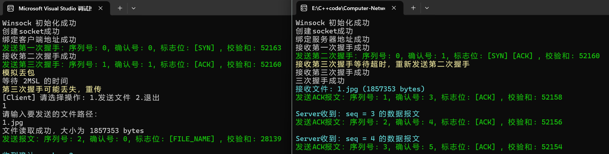

具体过程分析如下：

1. **第一次握手**：客户端发送报文，
	**序列号：0**，**确认号：0**，**标志位：[SYN]**。
2. **第二次握手**：服务端回复报文，
	**序列号：0**，**确认号：1**，**标志位：[SYN, ACK]**。
3. **第三次握手**：客户端发送确认报文，
	**序列号：1**，**确认号：1**，**标志位：[ACK]**。

可以看到，序列号与确认号严格按照协议设计变化，无误。

此外，实验还模拟了客户端的第三次握手丢包的情况。此时：

- 服务端接收第三次握手等待超时，重新发送第二次握手
- 客户端在等待2MSL（最大报文段生存时间）期间，成功发送了第三次握手报文。同时，客户端也显示第三次握手可能丢失，重传
- 最终，服务端成功接收第三次握手，握手完成，连接建立。

这一过程验证了程序对丢包场景下三次握手的正确处理。

#### 文件传输

这里由于丢包率设置过高，为了节省时间，我选择发送1.jpg。

##### 文件信息发送

客户端成功发送了文件名和基本信息，服务端也正确回复了ACK确认。

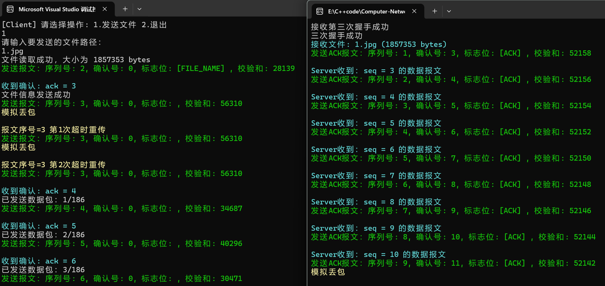

- 客户端发送：**序列号：2**，**确认号：0**，**标志位：[FILE_NAME]**，**校验和：28139**。
- 服务端回复：**序列号：1**，**确认号：3**，**标志位：[ACK]**，**校验和：52158**。

- 客户端收到确认后显示 **"文件信息发送成功"**。

文件信息的序列号、确认号和标志位与协议设计完全一致，传输正确。

##### 文件传输

文件传输过程中也出现了丢包导致的超时重传、重复接收报文。

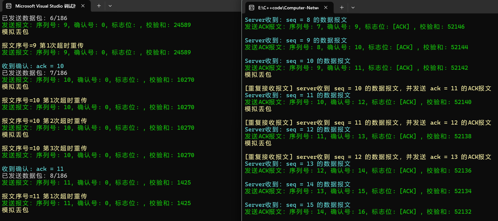

- **客户端**在发送序列号为10的数据包时，数据包丢失，触发了超时重传机制。
- 第一次超时后，**客户端**重传了数据包，**服务端**成功接收并发送了ACK确认报文，但ACK报文丢失，导致**客户端**没有收到确认，进而触发了第二次超时重传。
- 在**客户端**进行第二次超时重传时，数据包再次丢失。
- 第三次重传后，**服务端**成功接收到序列号为10的数据包，并正确识别出重复报文，仅回复了ACK确认，并未重复处理数据。
- 最终，**客户端**收到了确认`ack = 11`，标志着序列号为10的数据包成功传输完成，**客户端**可以准备发送下一个数据包。

这过程中出现了客户端丢包、服务端ACK丢失、客户端超时重传、服务端处理重复报文几乎所有情况，验证了程序在丢包、高延迟环境下的超时重传机制，以及对重复数据包的正确处理。

##### 传输结果

其他数据包的传输与此类似，就不再展示。直接到最后的传输结果：

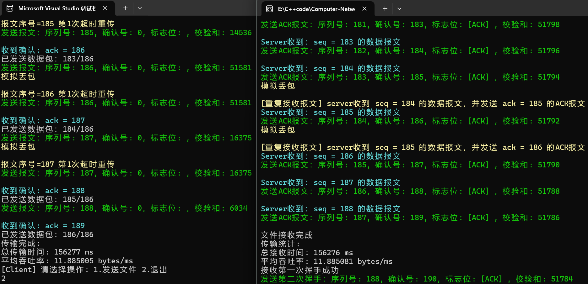

文件传输结束后，客户端和服务端均显示如下统计信息：

- **客户端**：发送186个数据包，总耗时156277ms，平均吞吐率11.885 bytes/ms。
- **服务端**：接收186个数据包，总耗时156276ms，平均吞吐率11.885 bytes/ms。

##### 文件检查

传输完成后，查看文件属性

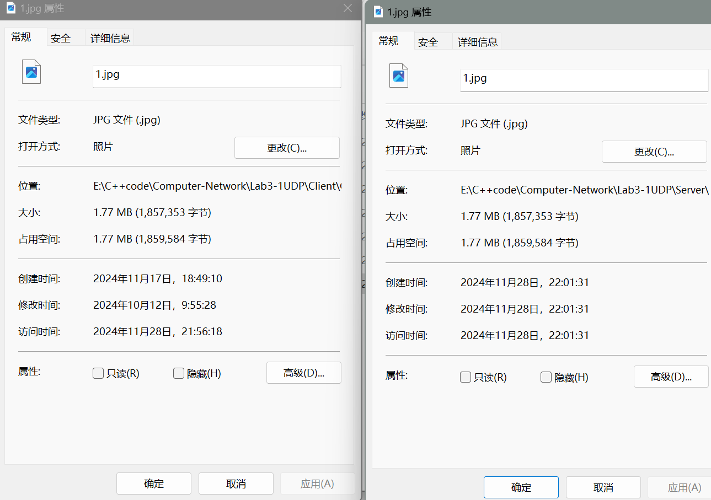

可以看到传输前后文件大小没有发生改变。

打开文件，可以看到文件成功打开，说明数据无误。


#### 四次挥手

测试最后进行了四次挥手，以确保连接能够正确关闭。

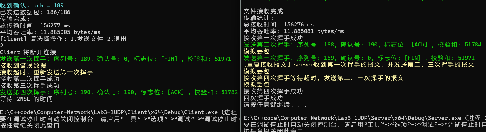

**客户端操作：**

1. 第一次挥手：客户端发起断开连接的请求，发送FIN标志的报文，
	- **序列号：189**，**确认号：0**，**标志位：[FIN]**，**校验和：51971**。
2. **错误数据处理**：客户端接收到错误数据，但选择忽略。
3. **超时重传**：由于长时间未收到服务端响应，客户端超时后重新发送第一次挥手。
4. **第二次挥手**：客户端成功接收到服务端的ACK报文，确认第一次挥手成功。
5. **第三次挥手**：客户端接收到服务端的FIN报文，确认第三次挥手成功。
6. 第四次挥手：客户端发送最终的ACK报文，
	- **序列号：190**，**确认号：190**，**标志位：[ACK]**，**校验和：51782**。
7. **等待2MSL**：客户端进入等待状态，确保所有重复的报文都能被对方接收，等待2倍的最大报文段生存时间（2MSL）。

**服务端操作：**

1. **第一次挥手接收**：服务端成功接收客户端的FIN报文。
2. 第二次挥手：服务端发送ACK报文，
	- **序列号：188**，**确认号：190**，**标志位：[ACK]**，**校验和：51784**。
3. **丢包模拟**：服务端的第二次挥手报文在传输过程中丢失。
4. 第三次挥手：服务端发送FIN报文，
	- **序列号：189**，**确认号：0**，**标志位：[FIN]**，**校验和：51971**。
5. **重复接收处理**：服务端重复接收到客户端的第一次挥手报文，并重新发送第二、三次挥手报文。
6. **丢包模拟**：服务端的第三次挥手报文在传输过程中丢失。
7. **超时重传**：服务端等待第四次挥手超时后，再次发送第二、三次挥手报文。
8. **丢包与接收**：服务端的第二次挥手报文再次丢失，客户端接收到第三次挥手。
9. **客户端第四次挥手**：客户端发送第四次挥手报文。
10. **四次挥手完成**：服务端成功接收到客户端的第四次挥手报文，宣布四次挥手成功，连接关闭。

在丢包处理方面，仔细分析如下：

- 服务端的第二次挥手报文丢失，导致客户端超时并重传第一次挥手。
- 服务端在接收到第三次挥手时，由于未预期到该报文，将其视为错误数据并忽略。
- 客户端在超时后重新发送第一次挥手，服务端接收到重复的第一次挥手后，重新发送第二、三次挥手报文。
- 服务端的第三次挥手报文丢失，客户端只收到第二次挥手。
- 服务端在等待第四次挥手超时后，再次发送第二、三次挥手报文，但第二次挥手报文再次丢失，客户端接收到第三次挥手，并发送第四次挥手。
- 服务端最终成功接收到客户端的第四次挥手报文，宣布四次挥手成功。

在整个过程中，客户端和服务端的超时重传机制有效地保证了连接关闭的最终成功。无论是客户端重新发送第一次挥手，还是服务端通过超时重传发送丢失的报文，都表明协议设计能够应对丢包场景。

### 其他测试

除了以上丢包率为 30%、延时为 100ms、传输文件1.jpg的测试，我也对三次握手、四次挥手、文件传输等不同过程、多个不同文件、不同丢包率和延时下的广泛测试，除了丢包率过高时、如50%情况下可能出现10次超时重传都失败，其他情况均能正确处理！(不知道花了几天时间……)

### 性能分析

我采用了**5%丢包率**和**10ms的延时**，同时将**超时重传时间设置为50ms**。以下是四个测试文件在这一条件下的总传输时间和平均吞吐率的对比结果：

|     文件名     | 大小(KB) | 数据包 | 传输时间(ms) | 吞吐率(bytes/ms) |
| :------------: | :------: | :----: | :----------: | :--------------: |
| helloworld.txt |   1617   |  166   |     5859     |      282.6       |
|     1.jpg      |   1814   |  186   |     7247     |      256.3       |
|     2.jpg      |   5761   |  590   |    22765     |      259.1       |
|     3.jpg      |  11689   |  1197  |    45382     |      263.7       |

> 以上数据仅对本次实验负责

从表格中可以看出：

- 随着文件大小的增加，总传输时间显著增加，这符合预期，因为更大的文件需要更多的数据包进行传输。
- 吞吐率在不同文件之间有一定的波动，但整体来看，随着文件大小的增加，吞吐率在大文件传输中保持相对稳定，这表明即使在丢包和延迟的环境下，TCP 协议的重传机制仍能有效保障传输效率。

为了更直观地展示这些结果，我绘制了文件大小与传输时间、吞吐率之间的关系图：

**传输时间与文件大小关系图**：

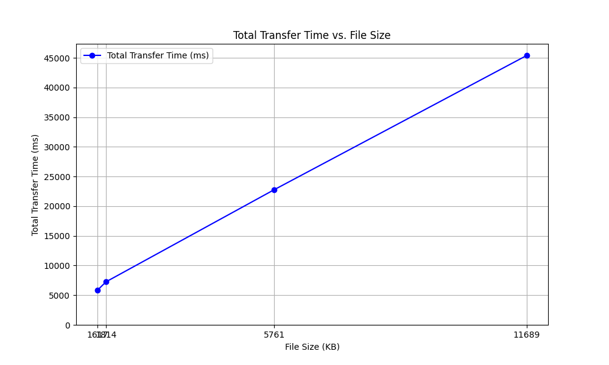

**吞吐率与文件大小关系图**：


通过上述图表，可以直观地观察到传输时间随着文件大小的增加而线性增长，而吞吐率则相对稳定，尽管存在一定的波动。

## 六、实验反思与总结

---

### 1. 实验挑战

在本次实验中，我面临了若干挑战，特别是在确保数据传输的可靠性方面。由于 UDP 协议本身缺乏可靠性，我不得不自行实现包括超时重传、差错检测和丢包重传等机制，以适应高丢包率和网络延迟的环境。此外，高丢包率环境下客户端的第三次握手信息容易丢失，导致服务端需要不断重传，这增加了实验的复杂性。在文件传输过程中，服务器必须能够处理 ACK 包丢失的情况，确保数据传输的可靠性。同时，我还对原有代码进行了扩展，以支持多文件传输，并使用 `#pragma pack(1)` 指令来保证协议格式的一致性。在代码优化方面，我将 main 函数中的局部变量转换为全局变量，简化了代码结构，减少了潜在的错误。

### 2. 程序不足

尽管取得了一定进展，但程序还存在一些不足之处。例如，初始的大缓冲区设计在传输大文件时占用了过多的内存，影响了性能。此外，重传等待时间采用固定值，没有根据网络条件进行动态调整，这导致了效率低下和不必要的重传。

### 3. 改进措施

针对这些问题，我计划采取以下改进措施。首先，引入最大报文段大小（MSS）协商机制，根据网络状况和需求选择最合适的 MSS 值，以提高传输效率。其次，我将采用分块传输策略，将大文件分割成小块进行传输，减少内存占用，提高大文件传输效率。此外，我还将根据网络的实时状况动态调整重传等待时间，参考前一个消息的往返时延（RTT）。最后，我计划引入多线程技术，尤其是在服务器端，以提高程序的并发处理能力，处理更多的客户端请求，提升系统的吞吐量和并发性能。

### 4. 实验收获

通过本次实验，我不仅深入理解了 UDP 协议的不可靠性，还掌握了在应用层实现可靠传输的技术。同时，我也深刻认识到了调试和日志记录在程序开发中的重要性，通过日志记录可以有效监控程序运行状态，定位并解决潜在问题。这些宝贵的经验将对我的未来学习和工作产生积极影响。
