<div align='center'>
<b> <font face='微软雅黑' size='6'> 计算机网络课程实验报告 </font> </b>
</div>


<div align='center'>
<b> <font font face='微软雅黑' size='6'> 实验 3-2 </font> </b>
</div>


<div>
<font face='宋体' size='6'>&nbsp;&nbsp;&nbsp;&nbsp; 学 院：网络空间安全学院 </font> <br>
<font face='宋体' size='6'>&nbsp;&nbsp;&nbsp;&nbsp; 专 业：信息安全 </font> <br>
<font face='宋体' size='6'>&nbsp;&nbsp;&nbsp;&nbsp; 学 号：2212998 </font> <br>
<font face='宋体' size='6'>&nbsp;&nbsp;&nbsp;&nbsp; 姓 名：胡博浩 </font> <br>
</div>
## 一、实验要求与功能

------

### （一）实验要求

在实验 3-1 的基础上，将停等机制改成 **基于滑动窗口的流量控制机制**，采用固定窗口大小，支持 **累积确认**，完成给定测试文件的传输。

1. 协议设计：数据包格式，发送端和接收端交互，详细完整
2. 流水线协议：多个序列号
3. 发送缓冲区、接收缓冲区
4. 累积确认：Go Back N
5. 日志输出：收到/发送数据包的序号、ACK、校验和等，发送端和接收端的窗口大小等情况，传输时间与吞吐率
6. 测试文件：必须使用助教发的测试文件（1.jpg、2.jpg、3.jpg、helloworld.txt）

**注**：GoBackN 的接收窗口为 1，发送窗口大于 1，发送窗口和接收窗口不采用相同大小。
随机设置窗口大小，范围在 20-32 之间

### （二）自行扩展功能

为进一步完善实验，设计和实现了以下扩展功能：

1. **连接断开的可靠性增强**
  - 考虑到 **最后一个 ACK 可能丢失** 的情况，在连接断开设计中引入等待 2MSL 机制，确保 Client 和 Server 均能正确关闭连接。
  - 类似地，在连接建立阶段，考虑 **最后一个 ACK 的丢失**，同样设计等待 2MSL 机制，保证连接的可靠性。
2. **特殊情况处理**
    协议设计中额外考虑了以下特殊情况：
  - 数据包乱序
  - 文件传输时 Server 端发送的 **最后一个 ACK 丢失**
  - 其他可能影响传输的异常情况
3. **多线程** 实现数据传输：由发送线程和接收线程互相配合
4. **锁机制** 和 **原子操作** 避免竞争
5. **用户体验优化**
  - 提供详细的错误提示信息，方便排查问题。
  - 通过控制台颜色区分信息类型（如错误、提示、正常输出等），提升操作体验。

感谢老师的教导与助教的批阅，辛苦！

## 二、实验环境与说明

------

### （一）环境配置

本实验在 Windows 系统上使用 Visual Studio 进行开发，文件编码为 UTF-8（带 BOM）。实验中通过 C++ 编写了服务器和客户端程序，使用了多种库函数和头文件来实现网络通信、文件操作等功能。

### （二）头文件与库函数

**主要头文件：**

- `<iostream>`：用于标准输入输出操作。
- `<winsock2.h>`：用于 Windows 套接字编程。
- `<ws2tcpip.h>`：提供了 Windows 套接字扩展功能。
- `<string>`：用于字符串操作。
- `<fstream>`：用于文件读写操作。
- `<chrono>`：用于时间操作和计时。
- `<thread>`：用于多线程操作。
- `<vector>`：用于动态数组操作。
- `<sstream>`：用于字符串流操作。
- `<random>`：用于生成随机数。
- `<mutex>`：用于线程间的互斥锁操作。
- `<atomic>`：用于原子操作。

**关键库函数：**

- `WSAStartup`：初始化 Winsock 库。

- `socket`：创建套接字。
- `bind`：绑定套接字到本地地址。
- `sendto`：发送数据到指定地址。
- `recvfrom`：从指定地址接收数据。
- `closesocket`：关闭套接字。
- `WSACleanup`：清理 Winsock 库。
- `inet_pton`：将 IPv4 和 IPv6 地址从文本转换为二进制形式。
- `ioctlsocket`：控制套接字的 I/O 模式。
- `FormatMessageA`：格式化系统错误消息。
- `this_thread::sleep_for`：使当前线程休眠指定时间。
- `CreateThread`：创建一个新的线程。
- `WaitForSingleObject`：等待指定的线程终止。
- `CloseHandle`：关闭线程句柄。

通过这些头文件和库函数，实验实现了客户端与服务器之间的 UDP 通信，包括三次握手、四次挥手以及文件传输等功能。

## 三、协议设计

------

### （一）协议概述

本协议的设计目标是在不可靠的 UDP 信道上实现可靠的文件传输。协议模拟了 TCP 中的连接建立（通过三次握手）和连接断开（通过四次挥手），并且采用了类似 TCP 的重传机制来保证数据的可靠传输。通过自定义的数据包结构和错误检测与恢复机制，确保数据能够在丢包、延迟等不可靠网络环境下高效且完整地传输。

这次实验主要是在实验 3-1 的基础上，将停等机制改成 **基于滑动窗口的流量控制机制**，采用固定窗口大小，并支持 **累积确认**。

### （二）数据包设计（和 3-1 基本相同，可以跳过）

为了确保在不可靠的网络环境中实现可靠的文件传输，本协议设计了自定义的数据包格式 `Message`，该数据包包含了通信中所需的所有字段，并通过校验和机制确保数据完整性。数据包的具体结构如下：

#### 1. 数据包格式

```cpp
#pragma pack(1) // 设置结构体内存对齐为1字节
class Message {
public:
    uint32_t srcIP{ 0 };       // 源IP地址（4字节）
    uint32_t destIP{ 0 };      // 目的IP地址（4字节）
    uint16_t srcPort{ 0 };     // 源端口（2字节）
    uint16_t destPort{ 0 };    // 目的端口（2字节）
    uint32_t seqNum{ 0 };      // 序列号（4字节）
    uint32_t ackNum{ 0 };      // 确认号（4字节）
    uint32_t length{ 0 };      // 数据长度（4字节）
    uint16_t flags{ 0 };       // 标志位（2字节）
    uint16_t checkNum{ 0 };    // 校验和（2字节）
    uint8_t data[MAX_MSG_SIZE]{ 0 };  // 数据段（最大大小为10000字节）
    // 构造函数
    Message() = default;
    // 标志位操作
    bool is_SYN() const { return flags & Flag::SYN; }
    void set_SYN() { flags |= Flag::SYN; }
    bool is_ACK() const { return flags & Flag::ACK; }
    void set_ACK() { flags |= Flag::ACK; }
    bool is_FIN() const { return flags & Flag::FIN; }
    void set_FIN() { flags |= Flag::FIN; }
    bool is_FILE_NAME() const { return flags & Flag::FILE_NAME; }
    void set_FILE_NAME() { flags |= Flag::FILE_NAME; }
    // 校验和方法
    bool checkSum();
    void setCheckSum();
    // 清理报文
    void clean();
};
#pragma pack() // 恢复默认内存对齐
```

**字段说明：**

- **srcIP** 和 **destIP**：由于实验在本地进行，这两个字段未实际使用，但保留以模拟真实环境。
- **srcPort** 和 **destPort**：源端口和目标端口，用于标识通信双方的端口。
- **seqNum**：序列号，用于保证数据包的有序性。
- **ackNum**：确认号，用于接收方确认数据包的接收。
- **length**：数据段长度，指示有效数据部分的大小。
- **flags**：标志位，指示数据包的类型和控制信息，如连接请求、确认、数据等。
- **checkNum**：校验和，用于确保数据传输过程中的完整性。
- **data**：数据部分，包含实际传输的文件数据或控制信息。

#### 2. 标志位定义

```cpp
struct Flag {
    static constexpr uint16_t SYN = 0x1;        // 建立连接
    static constexpr uint16_t ACK = 0x2;        // 确认接收
    static constexpr uint16_t FIN = 0x4;        // 关闭连接
    static constexpr uint16_t FILE_NAME = 0x8;  // 传输文件名
};
```

### （三）客户端和服务器交互过程

在本次实验中，客户端和服务器通过自定义的协议在不可靠的 UDP 信道上实现可靠的数据传输。主要包括连接建立、数据传输和连接断开三个阶段。为此，引入了滑动窗口机制、发送缓冲区、累积确认以及超时重传等技术。

#### 1. 连接建立：三次握手（包含超时重传）（和 3-1 基本相同，可以跳过）

连接建立采用类似 TCP 的三次握手机制，确保双方建立可靠的通信通道。

##### 流程描述

1. **第一次握手：** 客户端发送一个带有 `SYN` 标志位的报文，序列号为 `seqNum = x`。

2. **第二次握手：** 服务器收到后，回复一个带有 `SYN` 和 `ACK` 标志位的报文，序列号为 `seqNum = y`，确认号为 `ackNum = x + 1`。

3. **第三次握手：** 客户端收到后，再发送一个带有 `ACK` 标志位的报文，序列号递增、即 `seqNum = x + 1`，确认号为 `ackNum = y + 1`。

4. **等待确认：** 客户端在发送完第三次握手的 `ACK` 报文后，进入 `TIME_WAIT` 状态，等待 **2 \* MSL**（最大报文段生存时间），以确保服务器成功接收到 `ACK`。

5. **连接建立成功：** 服务器收到第三次握手的 `ACK` 后，认为连接建立成功。

##### 时序图

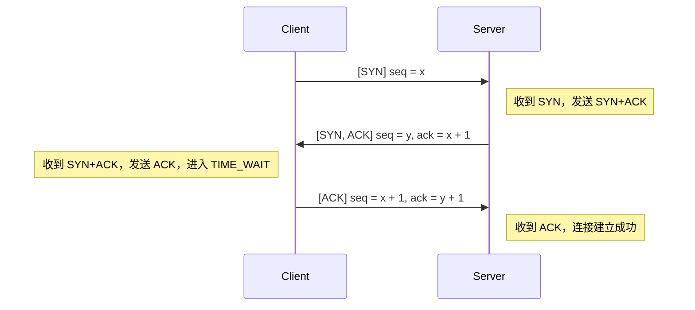

##### 超时重传机制

为保证连接可靠建立，引入超时重传机制：

- **客户端：**
  - 在发送第一次握手（`SYN`）后，启动定时器，等待服务器的 `SYN+ACK` 报文。
  - 若在超时时间（如 500ms）内未收到预期报文，则重传 `SYN` 报文。
  - 最大重传次数限制，超过则连接建立失败。
  - 在发送第三次握手（`ACK`）后，进入 `TIME_WAIT` 状态，等待 **2 \* MSL**，以防止 `ACK` 丢失导致服务器重复发送 `SYN+ACK`。
- **服务器：**
  - 在发送第二次握手（`SYN+ACK`）后，启动定时器，等待客户端的 `ACK` 报文。
  - 若在超时时间内未收到 `ACK`，则重传 `SYN+ACK` 报文，直到达到最大重传次数。

##### 三次握手流程图

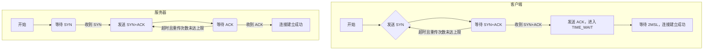

#### 2. 可靠数据传输（包含超时重传和停等机制）

在不可靠的 UDP 信道上，需要通过实现可靠的数据传输协议来确保文件的完整传输。我基于滑动窗口机制的 Go-Back-N 协议设计了以下协议，该设计支持累积确认、发送缓冲区和接收缓冲区。（主要参考 GBN 的有限状态机，在“四、状态机图”处可以看到）

##### 传输过程描述

1. **文件名与文件信息传输**

  **客户端：**

  发送一个包含 `FILE_NAME` 标志的报文，`seqNum = n`，数据段包含文件名和文件大小。等待服务器对该报文的确认（ACK）。

  **服务器：**

  接收文件名报文，提取文件名和文件大小。回复一个累积确认的 `ACK` 报文，`ackNum = n + 1`，表示成功接收。

2. **文件数据传输（采用滑动窗口的 Go-Back-N 协议）**

  **客户端：**

  - 将文件按 MAX_MSG_SIZE 分块，序列号 `seqNum` 依次递增。
  - 维护一个发送窗口（大小为 windowSize），以及发送缓冲区（sendBuffer）。
  - 连续发送窗口内的数据报文，并将其存入发送缓冲区。
  - 启动定时器 timerStart，用于超时重传检测。
  - 若收到服务器的累积确认 `ACK`，更新发送窗口的基序号 base，并从发送缓冲区中移除已确认的报文。
  - 如果未在超时时间内收到 `ACK`，触发超时重传，将窗口内未确认的所有报文重新发送。

  **服务器：**

  - 维护期望收到的序列号 base。
  - 接收数据报文，进行校验和验证。
  - 如果收到的报文序列号与 base 匹配：将数据存入接收缓冲区；base 增加，表示期望下一个序列号；发送累积确认 `ACK`，`ackNum = base`。
  - 如果收到的报文序列号小于 base，表示该报文已被接收并确认，重新发送当前的 `ACK`。
  - 如果收到的报文序列号大于 base，表示有报文丢失，丢弃该报文，重新发送当前的 `ACK`。

##### 数据传输时序图

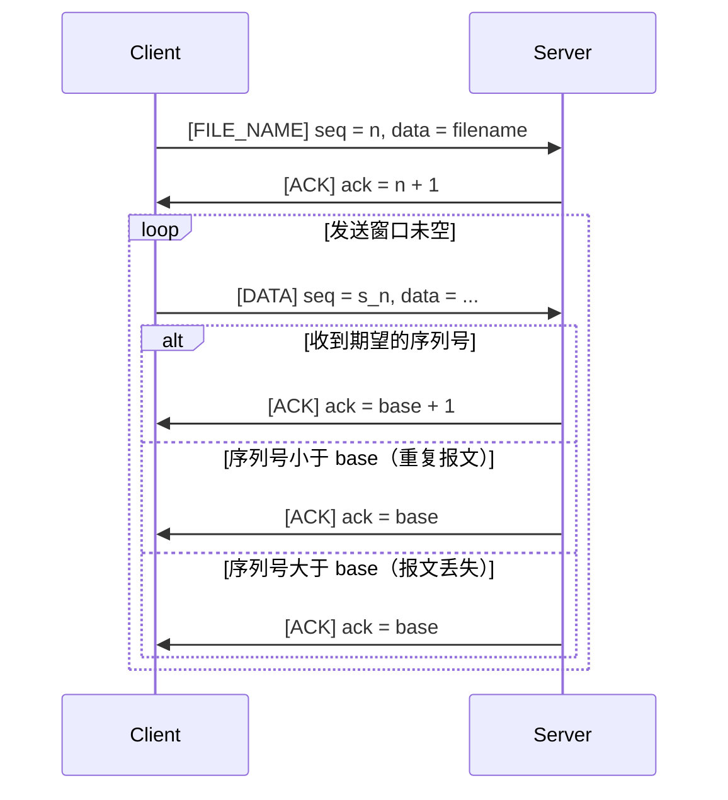

##### 超时重传机制

**客户端：**

- 对于发送窗口内的第一个报文，启动定时器 timerStart。
- 如果在超时时间内未收到相应的 `ACK`，触发超时重传，将窗口内未被确认的所有报文重新发送。
- 重传后，重新启动定时器。

##### 流量控制

- **发送窗口机制：**

	发送窗口大小 windowSize 控制了客户端在未收到确认的情况下可以连续发送的报文数量。当 nextSeq < base + windowSize 时，客户端可以继续发送新的报文。

- **累积确认：**

	服务器通过发送累计的 `ACK` 报文，告知客户端已成功接收的最大连续序列号。客户端收到 `ACK` 后，可以滑动发送窗口，并从发送缓冲区中移除已确认的报文。

##### 差错控制

**校验和检查：**

每个数据报文都包含校验和，用于检测传输过程中是否发生位错误。服务器在接收报文时进行校验和验证，如有错误则丢弃该报文，不发送 `ACK`。

##### 数据传输流程图

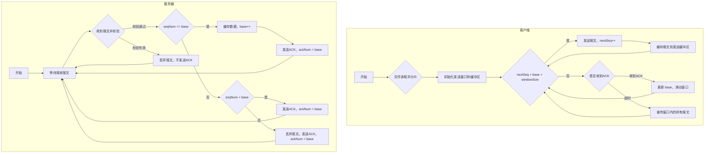

#### 3. 连接断开：四次挥手（包含超时重传）（和 3-1 基本相同，可以跳过）

连接断开采用类似 TCP 的四次挥手机制，双方依次发送和确认关闭连接的请求。

##### 流程描述

1. **第一次挥手：** 客户端发送带有 `FIN` 标志的报文，序列号 `seqNum = u`，表示请求关闭连接。
2. **第二次挥手：** 服务器收到后，发送带有 `ACK` 标志的确认报文，确认号为 `ackNum = u + 1`。
3. **第三次挥手：** 服务器发送带有 `FIN` 标志的报文，序列号 `seqNum = v`，表示准备关闭连接。
4. **第四次挥手：** 客户端收到后，发送带有 `ACK` 标志的确认报文，`seqNum = u + 1`，`ackNum = v + 1`。
5. **等待确认（客户端）：** 客户端在发送完最后的 ACK 报文后，重新进入 `TIME_WAIT` 状态，等待 **2 \* MSL**，以确保服务器成功接收到 `ACK`。
6. **连接关闭：** 服务器收到 `ACK` 后，直接关闭连接；客户端在等待超时后，关闭连接。

##### 时序图

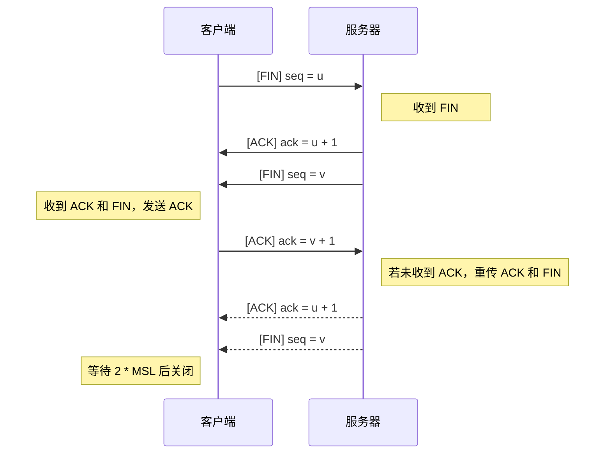

##### 超时重传机制

- **客户端：**
  - 在发送第一次挥手（`FIN`）后，启动定时器，等待服务器的 `ACK` 和 `FIN` 报文。
  - 若在超时时间内未收到预期报文，则重传 `FIN` 报文，重新等待两个报文，直到达到最大重传次数。
  - 如果只收到 `ACK` 未收到 `FIN`，超时后也重传 `FIN`
  - 收到两个报文后，发送最后的 `ACK` 报文，进入 `TIME_WAIT` 状态，等待 **2 \* MSL**。
  - 若在 `TIME_WAIT` 状态时，再次收到服务器的 `ACK + FIN` 报文，重新发送 `ACK`。
- **服务器：**
  - 在收到客户端的 `FIN` 后，依次发送 `ACK` 和 `FIN` 报文。
  - 发送后，启动定时器，等待客户端的最后 `ACK`。
  - 若在超时时间内未收到 `ACK`，则重传 `ACK` 和 `FIN` 报文，直到达到最大重传次数。
  - 收到客户端的 `ACK` 后，直接关闭连接。


##### 四次挥手流程图

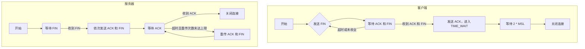

### （四）状态机图

#### 1. 客户端状态机

采用 GBN 的发送方拓展有限状态机。具体流程如下图：


#### 2. 服务器端状态机

同样采用接收方拓展的有限状态机。具体流程如下图：


### （五）限制和约束

1. **数据包大小限制：**

   **最大数据段大小：** MAX_MSG_SIZE 为 10000 字节，防止数据包过大导致丢失。

2. **序列号和确认号：**

   每次发送或接收数据包，seqNum 和 ackNum 必须严格按照协议递增，确保数据有序可靠传输。

### （六）总结

通过采用基于滑动窗口的 Go-Back-N 协议，结合累积确认、发送缓冲区和接收缓冲区，实现了可靠的文件传输。在该协议中，客户端能够高效地发送多个数据报文，而服务器则通过累积确认的方式提高了确认效率。当出现丢包或错误时，客户端能够及时进行超时重传，确保数据的完整传输。

## 四、程序设计

------

### （一）程序简介

在实验 3-1 的基础上，本次实验将停等机制改为基于滑动窗口的流量控制机制，发送窗口大于 1，接收窗口为 1，支持累积确认。通过自定义的数据包结构和错误检测与恢复机制，确保数据能够在丢包、延迟等不可靠网络环境下高效且完整地传输。实验中还自行设置了丢包和延时，进行了包括超时重传机制在内的多种测试。

### （二）程序模块与功能

本次实验的实现主要包含三个核心文件：**Message.h**、**Client.cpp**、**Server.cpp**。各文件的功能与关键实现如下：

#### Message.h

这是本实验的核心头文件，定义了消息传输协议的核心部分，包括消息结构、常量定义和辅助函数。接下来结合代码详细说明，**这里同样只重点说明改动部分：**

##### 模拟丢包（和 3-1 基本相同，可以跳过）

自行模拟网络环境中的丢包和延时，便于测试 UDP 通信的可靠性和重传机制。

```c++
constexpr double PACKET_LOSS_RATE = 0.05; // 丢包率（0.0 - 1.0）
constexpr int DELAY_TIME = 10;           // 延时时间（毫秒）
```

##### 常量定义（和 3-1 基本相同，可以跳过）

```c++
constexpr int MAX_WAIT_TIME = 50;        // 超时时间（毫秒）
constexpr int MAX_SEND_TIMES = 10;        // 最大重传次数
constexpr int MAX_FILE_SIZE = 100000000;  // 最大文件大小（字节）
constexpr int MAX_MSG_SIZE = 10000;       // 最大数据段大小
```

##### 网络配置常量（和 3-1 基本相同，可以跳过）

```c++
constexpr const char* routerIP = "127.0.0.1";  // 路由器 IP 地址
constexpr const char* clientIP = "127.0.0.1";  // 客户端 IP 地址
constexpr const char* serverIP = "127.0.0.1";  // 服务器 IP 地址
constexpr int routerPORT = 66666;              // 路由器端口
constexpr int clientPORT = 77777;              // 客户端端口
```

##### 标志位定义（和 3-1 基本相同，可以跳过）

通过 **Flag** 结构定义常见标志位，用于控制连接建立与数据传输过程：

```c++
struct Flag {
    static constexpr uint16_t SYN = 0x1;        // 0001,建立连接
    static constexpr uint16_t ACK = 0x2;        // 0010,确认接收
    static constexpr uint16_t FIN = 0x4;        // 0100,关闭连接
    static constexpr uint16_t FILE_NAME = 0x8;  // 1000,文件名
};
```

##### Message 类（和 3-1 基本相同，可以跳过）

Message 类负责封装网络传输的报文格式，包括头部字段和数据段。**同样没有变化，直接上代码。**

```c++
class Message {
public:
    // 头部（共28字节）
    uint32_t srcIP{ 0 };     // 源IP(4字节)
    uint32_t destIP{ 0 };    // 目的IP(4字节)
    uint16_t srcPort{ 0 };   // 源端口(2字节)
    uint16_t destPort{ 0 };  // 目的端口(2字节)
    uint32_t seqNum{ 0 };    // 序号(4字节)
    uint32_t ackNum{ 0 };    // 确认号(4字节)
    uint32_t length{ 0 };    // 数据段长度(4字节)
    uint16_t flags{ 0 };     // 标志位(2字节)
    uint16_t checkNum{ 0 };  // 校验和(2字节)
    uint8_t data[MAX_MSG_SIZE]{ 0 };  // 数据段
    Message() = default;
    // 标志位管理
    bool is_SYN() const { return flags & Flag::SYN; }
    void set_SYN() { flags |= Flag::SYN; }
    bool is_ACK() const { return flags & Flag::ACK; }
    void set_ACK() { flags |= Flag::ACK; }
    bool is_FIN() const { return flags & Flag::FIN; }
    void set_FIN() { flags |= Flag::FIN; }
    bool is_FILE_NAME() const { return flags & Flag::FILE_NAME; }
    void set_FILE_NAME() { flags |= Flag::FILE_NAME; }
    // 校验和方法
    bool checkSum();
    void setCheckSum();
    // 清理报文
    void clean() {
        srcIP = destIP = srcPort = destPort = seqNum = ackNum = length = flags = checkNum = 0;
        memset(data, 0, sizeof(data));
    }
};
```

##### UDP 类

这里我新定义了一个基类，后面 Client 和 Server 都会继承该类，以此统一简化代码：

- **日志输出**
	通过 `print` 和 `printMessageInfo` 方法，将网络交互中的重要信息（如发送/接收的报文信息、错误提示等）以不同颜色和格式打印到控制台，方便调试与分析。

- **模拟丢包与延时**
	`sendtoWithSimulation` 方法在数据发送时模拟网络丢包和延迟，增强了实验环境的真实性。通过随机数生成器控制丢包率，从而测试重传机制的健壮性。

```c++
class UDP {
public:
    bool isConnected;                   // 是否连接成功
    Message sendMsg;                    // 发送的报文
    Message recvMsg;                    // 接收的报文

    string getErrorMessage(int errorCode);  // 获取系统错误信息
    void print(const string& info, Level level);  // 打印信息
    void printMessageInfo(const Message& msg, const string& prefix, Level level);  // 打印报文信息
    bool sendtoWithSimulation(SOCKET s, const char* buf, int len, int flags, const sockaddr* to, int tolen);  // 发送数据时模拟丢包延时
};
```

#### Client.cpp

这里 Client 继承 UDP 基类，实现了发送文件的核心逻辑。与上次 3-1 相比，主要增加了以下内容：

##### 变量

- `std::atomic<bool> running`：原子布尔变量，表示客户端是否正在运行，常用于线程控制。
- `std::atomic<bool> resend`：原子布尔变量，指示是否需要重传数据包。
- `std::atomic<ULONGLONG> timerStart`：原子变量，记录计时器的起始时间，用于超时控制。
- `uint32_t windowSize`：窗口大小，用于滑动窗口协议，控制流量和拥塞窗口。
- `uint32_t nextSeq`：下一个序列号，指示即将发送的数据包序列号。
- `uint32_t base`：窗口的基序号，窗口内最早发送但未确认的数据包序列号。
- `std::vector<Message> sendBuffer`：发送缓冲区，存储已发送但未确认的消息。
- `std::mutex bufferMtx`：互斥量，保护发送缓冲区的线程安全操作。**由于可能会有多个线程同时对 sendBuffer 读或者写，为了避免竞争，对其操作前后进行加锁**

##### 方法

- `void resendPackets()`：当检测到需要重传时，重传发送窗口内的所有数据包。
- `void printWindowStatus()`：打印当前发送窗口的状态信息，便于调试和监控。

- `static DWORD WINAPI receiveAck(LPVOID pParam)`：静态线程函数，用于接收 ACK 确认报文，支持并发处理。

具体代码设计如下：

```c++
class Client : UDP {
private:
    SOCKET clientSocket;                // 客户端 socket
    SOCKADDR_IN clientAddr;             // 客户端地址
    SOCKADDR_IN routerAddr;             // 路由器地址

    atomic<bool> running;               // 是否正在发送数据
    atomic<bool> resend;                // 是否需要重传标志
    atomic<ULONGLONG> timerStart;       // 计时器起始时间
    uint32_t windowSize;                // 窗口大小
    uint32_t nextSeq;                   // 下一个序列号
    uint32_t base;                      // 窗口基序号
    vector<Message> sendBuffer;         // 发送缓冲区
    mutex bufferMtx;                    // 保护发送缓冲区

    void resendPackets();               // 重传窗口内的所有包
    void printWindowStatus();           // 窗口信息打印函数
    void setMsg(Message& msg);          // 设置报文
    bool sendMessage(Message& msg);     // 实现单个报文发送
public:
    Client() : clientSocket(INVALID_SOCKET), running(false), timerStart(0), resend(false) {
        isConnected = false; nextSeq = 0; base = 0; windowSize = 24;
    }
    ~Client() {
        if (clientSocket != INVALID_SOCKET) {
            closesocket(clientSocket);
            clientSocket = INVALID_SOCKET;
        }
        WSACleanup();
    }
    bool initialize();                  // 初始化客户端
    bool threeWayHandshake();           // 实现三次握手
    void sendFile(const string& filename); // 实现文件传输
    bool fourWayHandwave();             // 实现四次挥手
    void waitExit();                    //等待退出
    void run();                         // 运行客户端

    static DWORD WINAPI receiveAck(LPVOID pParam); // 接收ACK的线程函数
};
```

#### Server.cpp

同样 Server 也继承了 UDP 基类，负责接收文件并实现与客户端的交互逻辑，功能包括：

1. **类设计**：
	- 封装服务器的核心状态（如 Socket、地址信息、连接状态、序列号、窗口大小等）。
	- 使用 **Message** 类表示发送和接收的报文。
2. **功能实现**：
	- **三次握手**：调用 `threeWayHandshake()` 方法与客户端建立可靠连接。
	- **文件接收**：通过 `recvFile()` 方法，基于滑动窗口协议接收文件数据，支持累积确认和超时重传，保证可靠性。
	- **四次挥手**：调用 `fourWayHandwave()` 方法断开连接，确保双方正常关闭连接。
3. **辅助方法**：
	提供日志打印、错误处理、报文设置与发送、打印当前窗口状态、发送 ACK 报文等功能。

```c++
class Server {
private:
    SOCKET serverSocket;//服务器socket
    SOCKADDR_IN serverAddr;//服务器地址
    SOCKADDR_IN routerAddr;//路由器地址
    bool isConnected;//是否连接成功
    int currentSeq;  // 当前序列号
    Message sendMsg;//发送的报文
    Message recvMsg;//接收的报文
    void printMessageInfo(const Message& msg, const string& prefix, Level level);//打印报文信息
    string getErrorMessage(int errorCode);//获取系统错误信息
    void setMsg(Message& sendMsg);//设置报文
    bool recvMessage(Message& recvMsg);//实现单个报文接收
    void sendAck(uint32_t ackNum);//发送ACK报文
    bool sendtoWithSimulation(SOCKET s, const char* buf, int len, int flags, const struct sockaddr* to, int tolen);//发送数据时模拟丢包延时
public:
    Server() : serverSocket(INVALID_SOCKET), isConnected(false), currentSeq(0) {}
    ~Server() {
        if (serverSocket != INVALID_SOCKET) {
            closesocket(serverSocket);
            serverSocket = INVALID_SOCKET;
        }
        WSACleanup();
    }
    void print(const string& info, Level level);//打印信息
    bool initialize();//初始化server
    bool threeWayHandshake();//实现server的三次握手
    void recvFile();//实现文件接收
    bool fourWayHandwave();//实现server的四次挥手
    void run();//运行server
};
```

### （三）核心代码分析

#### 差错检测（和 3-1 基本相同，可以跳过）

在本次实验中，为了确保数据传输的可靠性，我在消息传输过程中实现了差错检测机制。和 3-1 相比，我 **对代码具体逻辑进行了优化**，但总体上一致。具体实现如下：

在 Message.h 文件中，我定义了 Message 类，该类包含了消息头部的各种字段和数据段，并提供了校验和的计算和验证方法。

##### 校验和方法

- checkSum 方法用于验证 Message 结构体的校验和是否正确。

```c++
bool Message::checkSum() {
    uint32_t sum = 0;
    uint16_t* msg = (uint16_t*)this;
    size_t size = sizeof(Message) / 2;
    for (size_t i = 0; i < size; ++i) {
        sum += *msg++;
        sum = (sum & 0xFFFF) + (sum >> 16);
    }
    return (sum & 0xFFFF) == 0xFFFF;
}
```

该方法通过遍历 Message 结构体的每个 16 位单元，计算所有单元的和，并检查最终的和是否为 0xFFFF。如果是，则校验和正确。

- setCheckSum 方法用于计算并设置 Message 结构体的校验和。

```c++
void Message::setCheckSum() {
    checkNum = 0;
    uint32_t sum = 0;
    uint16_t* msg = (uint16_t*)this;
    size_t size = sizeof(Message) / 2;
    for (size_t i = 0; i < size; ++i) {
        sum += *msg++;
        sum = (sum & 0xFFFF) + (sum >> 16);
    }
    checkNum = ~sum;
}
```

同理，该方法通过遍历 Message 结构体的每个 16 位单元，计算所有单元的和，并将最终的和取反后赋值给 checkNum 字段，从而设置校验和。

##### 差错检测的应用

在 `Client.cpp` 和 `Server.cpp` 文件中，我在发送和接收消息时都应用了校验和方法。例如，在客户端发送消息时，我调用 setCheckSum 方法计算并设置校验和：

```c++
void Client::setMsg(Message& sendMsg) {
    ......// 设置消息的其他字段
    sendMsg.setCheckSum(); // 设置校验和
}
```

在服务器接收消息时，我调用 checkSum 方法验证校验和：

```c++
bool Server::recvMessage(Message& msg) {
    ......
    while (true) {
        ......// 接收消息
        if (recvBytes > 0) {
            if (msg.checkSum()) { // 验证校验和
                ......// 处理消息
            } else {
                ......// 校验和错误，丢弃消息
            }
        }
    }
    ......
}
```

#### 建立连接（和 3-1 基本相同，可以跳过）

在本次实验中，客户端和服务器通过三次握手协议建立可靠连接，确保双方都已准备好进行数据传输。和之前 Lab03-01 没有多少改变，只是为了配合滑动窗口把之前的 currentSeq 重命名为 nextSeq。**就像我们前面介绍过的，在握手和挥手过程中出现的超时重传机制无需改动，只需要非阻塞模式+while(true)+recv_from 即可，原因就是它们在等待时候不需要进行发送。所以无需多线程实现这部分**。

##### 客户端（Client.cpp）

客户端的三次握手过程在 `threeWayHandshake` 方法中实现。具体步骤如下：

1. **发送第一次握手（SYN）**：

   客户端首先发送带有 SYN 标志的数据包，表示希望与服务器建立连接。

   ```cpp
   sendMsg.clean();
   sendMsg.set_SYN();
   setMsg(sendMsg);
   printMessageInfo(sendMsg, "发送第一次握手：", SEND);
   sendtoWithSimulation(clientSocket, (char*)&sendMsg, sizeof(sendMsg), 0, (sockaddr*)&routerAddr, AddrLen);
   ```

2. **接收第二次握手（SYN + ACK）**：

   客户端在发送第一次握手后，等待服务器的响应。如果在指定的超时时间内未收到正确的 SYN + ACK 报文，客户端会重新发送第一次握手请求，最多重试 `MAX_SEND_TIMES` 次。

   ```cpp
   for (int retry = 0; retry < MAX_SEND_TIMES; ++retry) {
       clock_t start = clock();
       while (clock() - start < MAX_WAIT_TIME) {
           recvMsg.clean();
           int recvByte = recvfrom(clientSocket, (char*)&recvMsg, sizeof(recvMsg), 0, (sockaddr*)&routerAddr, &AddrLen);
           if (recvByte > 0 && recvMsg.checkSum()) {
               if (recvMsg.is_SYN() && recvMsg.is_ACK() && recvMsg.ackNum == sendMsg.seqNum + 1) {
                   print("接收第二次握手成功", INFO);
                   ......// 连接准备就绪，继续执行后续操作
               } else {
                   print("接收到错误数据", WARN);
               }
           }
       }
       print("接收第二次握手超时，重新发送第一次握手", WARN);
       printMessageInfo(sendMsg, "重新发送第一次握手：", SEND);
       sendtoWithSimulation(clientSocket, (char*)&sendMsg, sizeof(sendMsg), 0, (sockaddr*)&routerAddr, AddrLen);
   }
   ```
   
3. **发送第三次握手（ACK）**：

   当客户端成功接收到带有 SYN + ACK 标志的响应后，客户端发送第三次握手的 ACK 数据包，确认连接建立成功。同时，客户端等待 2MSL 时间，以确保服务器能够接收到确认包。

   ```cpp
   sendMsg.clean();
   sendMsg.set_ACK();
   sendMsg.ackNum = recvMsg.seqNum + 1;
   setMsg(sendMsg);
   printMessageInfo(sendMsg, "发送第三次握手：", SEND);
   sendtoWithSimulation(clientSocket, (char*)&sendMsg, sizeof(sendMsg), 0, (sockaddr*)&routerAddr, AddrLen);
   // 等待确认第三次握手成功
   clock_t confirmStart = clock();
   print("等待 2MSL 的时间", INFO);
   while (clock() - confirmStart < 2 * MAX_WAIT_TIME) {
       recvMsg.clean();
       recvByte = recvfrom(clientSocket, (char*)&recvMsg, sizeof(recvMsg), 0, (sockaddr*)&routerAddr, &AddrLen);
       if (recvByte > 0 && recvMsg.checkSum()) {
           if (recvMsg.is_SYN() && recvMsg.is_ACK()) {
               print("第三次握手可能丢失，重传", WARN);
               sendtoWithSimulation(clientSocket, (char*)&sendMsg, sizeof(sendMsg), 0, (sockaddr*)&routerAddr, AddrLen);
           }
       }
   }
   ```

##### 服务器（Server.cpp）

服务器的三次握手过程在 `run` 和 `threeWayHandshake` 方法中实现。具体步骤如下：

1. **接收第一次握手（SYN）**：

   服务器在接收到客户端发送的第一次握手请求（SYN）后，确认请求并准备建立连接。

   ```cpp
   void Server::run() {
       if (initialize()) {
           while (true) {
               recvMsg.clean();
               int addrLen = sizeof(routerAddr);
               int recvBytes = recvfrom(serverSocket, (char*)&recvMsg, sizeof(recvMsg), 0, (sockaddr*)&routerAddr, &addrLen);
               if (recvBytes > 0) {
                   if (recvMsg.checkSum()) {
                       if (recvMsg.is_SYN()) {
                           // 接收到客户端的第一次握手请求（SYN有效）
                           print("接收第一次握手成功", INFO);
                           if (threeWayHandshake()) {
                               print("三次握手成功", INFO);
                           } else {
                               print("三次握手失败", ERR);
                           }
                       }
                       ......// 其他消息处理
               }
           }
       }
   }
   ```
   
2. **发送第二次握手（SYN + ACK）**：

   服务器接收到客户端的第一次握手请求后，发送带有 SYN 和 ACK 标志的数据包，表示准备好建立连接。

   ```cpp
   sendMsg.clean();
   sendMsg.set_SYN();     // 设置 SYN 标志
   sendMsg.set_ACK();     // 设置 ACK 标志
   sendMsg.ackNum = recvMsg.seqNum + 1; // 设置确认号
   setMsg(sendMsg);       // 设置报文内容
   printMessageInfo(sendMsg, "发送第二次握手：", SEND);
   sendtoWithSimulation(serverSocket, (char*)&sendMsg, sizeof(sendMsg), 0, (sockaddr*)&routerAddr, addrLen); // 发送数据包
   ```

3. **接收第三次握手（ACK）**：

   服务器在接收到客户端的第三次握手（ACK）包后，确认连接建立成功。如果客户端没有正确收到 ACK 或连接超时，服务器会重新发送第二次握手，最多重试 `MAX_SEND_TIMES` 次。

   ```cpp
   for (int retry = 0; retry < MAX_SEND_TIMES; ++retry) {
       clock_t start = clock();
       while (clock() - start < MAX_WAIT_TIME) {
           recvMsg.clean();
           int recvByte = recvfrom(serverSocket, (char*)&recvMsg, sizeof(recvMsg), 0, (sockaddr*)&routerAddr, &addrLen);
           if (recvByte > 0) {
               if (recvMsg.checkSum()) {
                   if (recvMsg.is_ACK() && recvMsg.ackNum == sendMsg.seqNum + 1) {
                       print("接收第三次握手成功", INFO);
                       isConnected = true;
                       return true;  // 连接成功
                   } else {
                       print("[重复接收报文] 服务器收到错误的报文，重新发送第二次握手", WARN);
                       sendtoWithSimulation(serverSocket, (char*)&sendMsg, sizeof(sendMsg), 0, (sockaddr*)&routerAddr, addrLen); // 重新发送
                   }
               } else {
                   print("接收到错误数据", WARN);
               }
           }
       }
       print("接收第三次握手超时，重新发送第二次握手", WARN);
       sendtoWithSimulation(serverSocket, (char*)&sendMsg, sizeof(sendMsg), 0, (sockaddr*)&routerAddr, addrLen); // 重新发送
   }
   ```

通过上述三次握手过程，客户端与服务器成功建立连接，确保双方都已准备好进行后续的数据传输。

#### 断开连接（和 3-1 基本相同，可以跳过）

在本次实验中，客户端和服务器通过四次挥手协议断开连接，确保双方都正确地结束数据传输。和之前 Lab03-01 没有多少改变，只是为了配合滑动窗口把之前的 currentSeq 重命名为 nextSeq。**就像我们前面介绍过的，在握手和挥手过程中出现的超时重传机制无需改动，只需要非阻塞模式+while(true)+recv_from 即可，原因就是它们在等待时候不需要进行发送。所以无需多线程实现这部分**。

##### 客户端（Client.cpp）

客户端的四次挥手过程在 `fourWayHandwave` 方法中实现。具体步骤如下：

1. **发送第一次挥手（FIN）**：

   客户端首先发送一个带有 FIN 标志的数据包，表示自己已完成数据传输，准备关闭连接。

   ```cpp
   sendMsg.clean();
   sendMsg.set_FIN();               // 设置 FIN 标志
   setMsg(sendMsg);                 // 设置报文内容
   printMessageInfo(sendMsg, "发送第一次挥手：", SEND);
   sendtoWithSimulation(clientSocket, (char*)&sendMsg, sizeof(sendMsg), 0, (sockaddr*)&routerAddr, AddrLen); // 发送数据包
   ```

2. **接收第二次挥手（ACK）**：

   客户端在发送第一次挥手后，等待服务器确认收到 FIN 数据包。如果在指定超时时间内没有收到正确的 ACK 响应，客户端会重新发送第一次挥手，最多重试 `MAX_SEND_TIMES` 次。

   ```cpp
   for (int retry = 0; retry < MAX_SEND_TIMES; ++retry) {
       clock_t start = clock();
       while (clock() - start < MAX_WAIT_TIME) {
           recvMsg.clean();
           int recvByte = recvfrom(clientSocket, (char*)&recvMsg, sizeof(recvMsg), 0, (sockaddr*)&routerAddr, &AddrLen);
           if (recvByte > 0 && recvMsg.checkSum()) {
               if (recvMsg.is_ACK() && recvMsg.ackNum == sendMsg.seqNum + 1) {
                   print("接收第二次挥手成功", INFO);
                   ......// 等待第三次挥手（FIN有效）
               } else {
                   print("接收到错误数据", WARN);
               }
           }
       }
       print("接收超时，重新发送第一次挥手", WARN);
       sendtoWithSimulation(clientSocket, (char*)&sendMsg, sizeof(sendMsg), 0, (sockaddr*)&routerAddr, AddrLen);
   }
   ```
   
3. **等待第三次挥手（FIN 有效）**：

   客户端等待服务器发送带有 FIN 标志的第三次挥手数据包，表示服务器也完成了数据传输，准备关闭连接。注意这里如果没有收到，会重发第一次挥手。

   ```cpp
   clock_t waitStart = clock();
   while (clock() - waitStart < MAX_WAIT_TIME) {
       recvMsg.clean();
       int recvByte = recvfrom(clientSocket, (char*)&recvMsg, sizeof(recvMsg), 0, (sockaddr*)&routerAddr, &AddrLen);
       if (recvByte > 0 && recvMsg.checkSum()) {
           if (recvMsg.is_FIN()) {
               print("接收第三次挥手成功", INFO);
               ......// 发送第四次挥手（ACK有效）
           } else {
               print("接收到错误数据", WARN);
           }
       }
   }
   ```

4. **发送第四次挥手（ACK 有效）**：

   客户端在接收到服务器的 FIN 数据包后，发送 ACK 确认报文，表示客户端已成功接收到服务器的关闭请求，并确认关闭连接。

   ```cpp
   sendMsg.clean();
   sendMsg.set_ACK();                     // 设置 ACK 标志
   sendMsg.ackNum = recvMsg.seqNum + 1;   // 设置确认号
   setMsg(sendMsg);                       // 设置报文内容
   printMessageInfo(sendMsg, "发送第四次挥手：", SEND);
   sendtoWithSimulation(clientSocket, (char*)&sendMsg, sizeof(sendMsg), 0, (sockaddr*)&routerAddr, AddrLen); // 发送数据包
   ```
   
5. **等待退出**：

   客户端在发送第四次挥手后，等待 2MSL 时间，以确保服务器能够接收到 ACK 确认并正确关闭连接。

   ```cpp
   void Client::waitExit() {
       print("等待 2MSL 的时间", INFO);
       int addrLen = sizeof(routerAddr);
       auto start = chrono::steady_clock:: now();
       while (chrono:: duration_cast <chrono::milliseconds>(chrono::steady_clock:: now() - start).count() < 2 * MAX_WAIT_TIME) {
           int recvByte = recvfrom(clientSocket, (char *)&recvMsg, sizeof(recvMsg), 0, (sockaddr*)&routerAddr, &addrLen);
           if (recvByte > 0 && recvMsg.checkSum()) {
               // 发送第四次挥手确认包
               sendtoWithSimulation(clientSocket, (char *)&sendMsg, sizeof(sendMsg), 0, (sockaddr*)&routerAddr, addrLen);
           }
       }
   }
   ```

##### 服务器（Server.cpp）

服务器的四次挥手过程在 `run` 和 `fourWayHandwave` 方法中实现。具体步骤如下：

1. **接收第一次挥手（FIN）**：

   服务器在接收到客户端发送的 FIN 数据包后，确认客户端已请求断开连接，并准备开始自己的关闭过程。

   ``` cpp
   void Server:: run() {
       if (initialize()) {
           while (true) {
               recvMsg.clean();
               int addrLen = sizeof(routerAddr);
               int recvBytes = recvfrom(serverSocket, (char *)&recvMsg, sizeof(recvMsg), 0, (sockaddr*)&routerAddr, &addrLen);
               if (recvBytes > 0) {
                   if (recvMsg.checkSum()) {
                       ......// 处理其他消息
                       else if (recvMsg.is_FIN()) {
                           // 接收到客户端的第一次挥手（FIN 有效）
                           print("接收第一次挥手成功", INFO);
                           if (fourWayHandwave()) {
                               print("四次挥手成功", INFO);
                               break;
                           } else {
                               print("四次挥手失败", ERR);
                           }
                       }
                       ......// 处理其他消息
               }
           }
       }
   }
   ```
   
2. **发送第二次挥手（ACK）**：

   服务器在接收到客户端的 FIN 数据包后，发送 ACK 数据包确认客户端的关闭请求。

   ``` cpp
   Message ackMsg;
   ackMsg.set_ACK();                     // 设置 ACK 标志
   ackMsg.ackNum = recvMsg.seqNum + 1;   // 设置确认号
   setMsg(ackMsg);                       // 设置报文内容
   printMessageInfo(ackMsg, "发送第二次挥手：", SEND);
   sendto(serverSocket, (char *)&ackMsg, sizeof(ackMsg), 0, (sockaddr*)&routerAddr, AddrLen); // 发送 ACK
   ```

3. **发送第三次挥手（FIN）**：

   服务器在发送完第二次挥手（ACK）后，准备向客户端发送带有 FIN 标志的第三次挥手数据包，表示自己也完成了数据传输，准备关闭连接。

   ``` cpp
   sendMsg.clean();
   sendMsg.set_FIN();                   // 设置 FIN 标志
   setMsg(sendMsg);                     // 设置报文内容
   printMessageInfo(sendMsg, "发送第三次挥手：", SEND);
   sendtoWithSimulation(serverSocket, (char *)&sendMsg, sizeof(sendMsg), 0, (sockaddr*)&routerAddr, AddrLen); // 发送 FIN
   ```

4. **接收第四次挥手（ACK）**：

   服务器在发送第三次挥手（FIN）后，等待客户端发送 ACK 确认包，表示客户端已成功接收到服务器的关闭请求，并确认关闭连接。

   ``` cpp
   for (int retry = 0; retry < MAX_SEND_TIMES; ++retry) {
       clock_t start = clock();
       while (clock() - start < MAX_WAIT_TIME) {
           recvMsg.clean();
           int recvByte = recvfrom(serverSocket, (char *)&recvMsg, sizeof(recvMsg), 0, (sockaddr*)&routerAddr, &AddrLen);
           if (recvByte > 0) {
               if (recvMsg.checkSum()) {
                   if (recvMsg.is_ACK() && recvMsg.ackNum == sendMsg.seqNum + 1) {
                       print("接收第四次挥手成功", INFO);
                       return true; // 连接关闭成功
                   } else {
                       print("[重复接收报文] 服务器收到客户端的重复报文，重新发送第二、三次挥手", WARN);
                       sendtoWithSimulation(serverSocket, (char *)&ackMsg, sizeof(ackMsg), 0, (sockaddr*)&routerAddr, AddrLen);
                       sendtoWithSimulation(serverSocket, (char *)&sendMsg, sizeof(sendMsg), 0, (sockaddr*)&routerAddr, AddrLen);
                   }
               } else {
                   print("接收到错误数据", ERR);
               }
           }
       }
       print("接收第四次挥手超时，重新发送第二、三次挥手", WARN);
       sendtoWithSimulation(serverSocket, (char *)&ackMsg, sizeof(ackMsg), 0, (sockaddr*)&routerAddr, AddrLen);
       sendtoWithSimulation(serverSocket, (char *)&sendMsg, sizeof(sendMsg), 0, (sockaddr*)&routerAddr, AddrLen);
   }
   ```

通过以上四次挥手过程，客户端和服务器成功断开连接，确保双方都正确地结束了数据传输。

#### 文件传输

在本次实验中，文件传输的实现主要集中在 **客户端的 sendFile函数** 和 **服务器的 recvFile函数**。

##### 整体思路

1. **读取并分割文件**：
	- 客户端打开要传输的文件，读取文件内容到内存缓冲区。
	- 将文件按照固定大小MAX_MSG_SIZE进行分片，计算总的分片数量。
2. **发送文件信息**：
	- 客户端先发送包含文件名和文件大小的特殊报文，使用`FILE_NAME`标志。
	- 服务器接收文件信息，准备接收文件数据。
3. **滑动窗口发送数据**：
	- 客户端使用滑动窗口协议，维护发送窗口大小windowSize、基序号base和下一个序列号nextSeq。
	- 在nextSeq < base + windowSize且`nextSeq < 总分片数`的条件下，不断发送数据包。
	- 每个数据包包含序列号、数据长度和数据内容。
4. **接收ACK并处理重传**：
	- 客户端开启接收ACK的线程，处理服务器发送的ACK报文。
	- 接收到ACK后，更新base，并从发送缓冲区中移除已确认的报文。
	- 如果超过超时时间未收到ACK，触发超时重传，重新发送窗口内的所有未确认报文。
5. **服务器接收数据**：
	- 服务器按照序列号接收数据包，维护接收窗口base。
	- 如果收到的序列号等于base，接收数据并发送`ACK`，然后base加一。
	- 如果收到重复的序列号，发送已有的`ACK`进行确认。
6. **组装并保存文件**：
	- 服务器将接收到的数据按照序列号顺序组装，拼接成完整的文件内容。
	- 文件接收完成后，将数据写入本地文件，完成文件保存。

##### 滑动窗口机制的实现

滑动窗口机制主要通过以下成员变量实现：

- uint32_t windowSize;：窗口大小，表示发送窗口中最多允许未被确认的数据包数量。
- uint32_t base;：发送窗口的基序号，表示已确认的序列号的下一个序列号。
- uint32_t nextSeq;：下一个要发送的数据包的序列号。

###### 发送端（Client）

在客户端的[sendFile](vscode-file://vscode-app/e:/Microsoft VS Code/resources/app/out/vs/code/electron-sandbox/workbench/workbench.html)函数中，实现了发送端的滑动窗口逻辑：

``` c++
while (base < temp + totalPackets) {
    if (resend.load()) {
        resendPackets();
    }
    else if (nextSeq < base + windowSize && nextSeq < temp + totalPackets) {
        // 准备发送新数据包
        // 设置 sendMsg 的内容，包括 seqNum、数据等
        {
            lock_guard <mutex> lock(bufferMtx);
            sendBuffer.push_back(sendMsg);
        }
        // 发送数据包
        sendtoWithSimulation(...);
        // 如果是窗口内的第一个未确认包，启动计时器
        if (nextSeq == base) {
            timerStart.store(GetTickCount64());
        }
        nextSeq++;
    }
}
```

- **条件判断**：
  - nextSeq < base + windowSize：确保未超过发送窗口的上限。
  - nextSeq < temp + totalPackets：确保未超过需要发送的总包数。
- **窗口移动**：
  - 当接收到累积ACK后，base会向前移动，窗口随之滑动。

###### 接收端（Server）

服务器在recvMessage函数中，维护了接收窗口：

``` c++
if (msg.seqNum == base) {
    // 收到期望的数据包，处理并发送 ACK
    base++;
    sendAck(base);
} else if (msg.seqNum < base) {
    // 收到重复的数据包，重新发送 ACK
    sendAck(base);
} else {
    // 收到超出期望的数据包，丢弃并发送当前的 ACK
    sendAck(base);
}
```

- **接收窗口的基序号base**：表示期望收到的下一个序列号。
- **窗口大小**：在这个简化的实现中，接收窗口大小为1，即只接受按序到达的数据包。

##### 发送缓冲区的实现

发送缓冲区用于存储已发送但尚未被确认的数据包，以便在需要重传时可以直接获取数据包进行重发。

- **成员变量**：

	``` c++
	vector <Message> sendBuffer; // 发送缓冲区
	mutex bufferMtx;            // 保护发送缓冲区的互斥锁
	```

- **添加到缓冲区**：

	在发送数据包之前，将其添加到发送缓冲区中：

	``` c++
	{
	    lock_guard <mutex> lock(bufferMtx);
	    sendBuffer.push_back(sendMsg);
	}
	```

- **从缓冲区移除已确认的数据包**：

	在接收到ACK后，移除已被确认的数据包：

	``` c++
	if (! client-> sendBuffer.empty()) {
	    client-> sendBuffer.erase(
	        client-> sendBuffer.begin(),
	        client-> sendBuffer.begin() + (recvMsg.ackNum - client-> sendBuffer.front().seqNum)
	    );
	}
	```

- **重传数据包**：

	当发生超时需要重传时，从发送缓冲区获取需要重传的数据包：

	``` c++
	vector <Message> bufferCopy;
	{
	    lock_guard <mutex> lock(bufferMtx);
	    bufferCopy = sendBuffer; // 复制需要重传的数据包
	}
	for (const auto& msg : bufferCopy) {
	    sendtoWithSimulation(...); // 重传数据包
	}
	```

通过发送缓冲区，客户端能够在发生超时时，快速重传未被确认的数据包，保证数据传输的可靠性。

##### 累积确认的实现

累积确认是指接收方发送的ACK可以确认到某个序列号之前的所有数据包都已正确接收。

###### 接收端（Server）

在服务器的recvMessage函数中，实现了累积确认：

``` c++
if (msg.seqNum == base) {
    // 收到期望的数据包，处理并发送 ACK
    base++;
    sendAck(base);
}
```

- 当接收到期望的序列号时，base加1，并发送`ACK(base)`，表示之前所有序列号小于base的数据包都已收到。

###### 发送ACK

服务器发送ACK报文，告知客户端已收到的数据包序列号：

``` c++
void Server:: sendAck(uint32_t ackNum) {
    sendMsg.clean();
    sendMsg.set_ACK();
    sendMsg.ackNum = ackNum;
    setMsg(sendMsg);
    sendtoWithSimulation(...);
}
```

###### 发送端（Client）处理ACK

客户端在receiveAck线程中处理接收到的ACK：

``` c++
if (recvMsg.ackNum > base) {
    {
        lock_guard <mutex> lock(bufferMtx);
        // 移除已确认的数据包
        if (! sendBuffer.empty()) {
            sendBuffer.erase(
                sendBuffer.begin(),
                sendBuffer.begin() + (recvMsg.ackNum - sendBuffer.front().seqNum)
            );
        }
    }
    base = recvMsg.ackNum; // 更新发送窗口的基序号
    // 重置计时器
    if (base != nextSeq) {
        timerStart.store(GetTickCount64());
    } else {
        timerStart.store(0);
    }
}
```

- 更新base后，发送窗口向前滑动，允许发送更多的数据包。
- 通过累积确认，客户端可以知道哪些数据包已被成功接收，无需等待每个数据包的单独确认，提高了传输效率。

##### 超时重传机制

为了确保可靠性，客户端实现了超时重传机制：

- **计时器**：

	``` c++
	atomic <ULONGLONG> timerStart; // 计时器起始时间
	```

- **启动计时器**：在发送窗口内的第一个未确认的数据包发送后，启动计时器。

	``` c++
	if (nextSeq == base) {
	    timerStart.store(GetTickCount64()); // 启动计时器
	}
	```

- **检查超时**：在receiveAck线程中，定期检查是否发生超时：

	``` c++
	if (timerStart.load() != 0 &&
	    GetTickCount64() - timerStart.load() > MAX_WAIT_TIME) {
	    resend.store(true); // 设置重传标志
	}
	```

- **重传数据包**：当检测到超时后，调用resendPackets()函数，重传发送窗口内的所有未确认数据包。

##### 线程安全和同步

为了确保多线程环境下的数据一致性，代码中使用了互斥锁和原子变量：

- **互斥锁bufferMtx**：保护sendBuffer的访问，防止在发送和接收ACK线程中同时修改。
- **原子变量**：如running、resend、timerStart等，确保多线程环境下的同步性。

##### 性能优化

1. **优化锁的使用**：仅在需要访问共享资源时使用锁，尽量减小锁的粒度，避免在网络I/O操作时持有锁。如在重传数据包时先把发送缓冲区拷贝下来，再传输。
2. **改进 receiveAck函数**：在接收ACK时，仅在需要修改 sendBuffer 时才加锁。
3. **优化 sendFile函数**：在发送数据包时，避免在发送操作中持有锁，仅在修改 sendBuffer时加锁。

#### 日志输出（和 3-1 变化不大，可以跳过）

在本次实验中，客户端和服务器通过日志输出记录了数据包的序列号、确认号、校验和等信息，以及传输时间和吞吐率。

##### 日志输出方法

使用 `print` 方法来输出日志信息，依据日志的严重性级别（INFO、WARN、ERR、RECV、SEND）动态调整输出的颜色：

``` cpp
void Client:: print(const string& info, Level level) {
    HANDLE hConsole = GetStdHandle(STD_OUTPUT_HANDLE);
    CONSOLE_SCREEN_BUFFER_INFO consoleInfo;
    GetConsoleScreenBufferInfo(hConsole, &consoleInfo);
    // 根据日志级别设置控制台颜色
    switch (level) {
        case Level:: INFO:
            SetConsoleTextAttribute(hConsole, 7); // 白色
            break;
        case Level:: WARN:
            SetConsoleTextAttribute(hConsole, 14); // 黄色
            break;
        case Level:: ERR:
            SetConsoleTextAttribute(hConsole, 12); // 红色
            break;
        case Level:: RECV:
            SetConsoleTextAttribute(hConsole, 11); // 青色
            break;
        case Level:: SEND:
            SetConsoleTextAttribute(hConsole, 10); // 绿色
            break;
        default:
            SetConsoleTextAttribute(hConsole, 7); // 默认颜色
            break;
    }
    cout << info << endl;
    SetConsoleTextAttribute(hConsole, 7); // 恢复默认颜色
}
```

该方法通过 `Level` 枚举类型定义不同的日志级别，使输出更加直观、便于区分不同类型的日志。

##### 打印报文信息

客户端在发送或接收每个数据包时，记录相关的报文信息，如序列号、确认号、标志位和校验和：

``` cpp
void Client:: printMessageInfo(const Message& msg, const string& prefix, Level level) {
    ostringstream oss;
    oss << prefix
        << "序列号: " << msg.seqNum
        << ", 确认号: " << msg.ackNum
        << ", 标志位: ";
    if (msg.is_SYN()) oss << "[SYN] ";
    if (msg.is_ACK()) oss << "[ACK] ";
    if (msg.is_FIN()) oss << "[FIN] ";
    if (msg.is_FILE_NAME()) oss << "[FILE_NAME] ";
    oss << ", 校验和: " << msg.checkNum;
    print(oss.str(), level);
}
```

服务端同理，就不再展示。

##### 文件传输统计

客户端在文件传输过程中，除了记录每个数据包的发送情况，还会在传输完成后输出文件传输的统计信息，包括总传输时间和平均吞吐率：

``` cpp
void Client:: sendFile(const string& filename) {
    try {
        ......
        // 发送文件信息：文件名、文件大小
        ......
        if (! sendMessage(sendMsg)) {
            throw runtime_error("文件信息发送失败");
        }
        print("文件信息发送成功", INFO);
        // 发送文件内容
        ......
        for (size_t i = 0; i < totalPackets; ++i) {
            ......
            if (! sendMessage(sendMsg)) {
                throw runtime_error("数据包发送失败");
            }
            print("已发送数据包：" + to_string(i + 1) + "/" + to_string(totalPackets), INFO);
        }
        // 计算传输统计
        auto duration = chrono:: duration_cast <chrono::milliseconds>(chrono::steady_clock:: now() - startTime).count();
        float throughput = duration > 0 ? static_cast <float>(fileSize) / duration : 0.0f;
        print("传输完成:\n 总传输时间: " + to_string(duration) + " ms\n 平均吞吐率: " + to_string(throughput) + " bytes/ms", INFO);
    }
    catch (const exception& e) {
        print("文件传输错误: " + string(e.what()), ERR);
    }
}
```

服务器在接收数据包时，同样会记录相关的日志信息，并在接收文件完成后输出统计数据。此处代码结构与客户端基本一致，就不再展示。

#### 丢包延时模拟（和 3-1 基本相同，可以跳过）

原有的路由器程序通过每隔 nnn 个数据包丢弃一个包来实现丢包机制，能够验证程序的超时重传功能，但无法模拟实际网络环境中因数据包延迟时间不同导致的乱序问题。而且程序也存在许多bug，因此我决定自行模拟丢包延时。

##### 丢包率与延时时间定义

在 `Message.h` 文件中引入以下两个参数，用于控制丢包和延时的模拟：

``` c++
double packetLossRate = 0.1; // 丢包率，取值范围为 0.0 到 1.0
int delayTime = 100;         // 延时时间，单位为毫秒
```

##### 辅助函数模拟丢包和延时

为实现丢包和延时的模拟，我设计了辅助函数 `sendtoWithSimulation`，用于包装标准的 `sendto` 函数。在数据发送过程中，该函数引入了延时模拟和随机丢包逻辑：

``` c++
bool Client:: sendtoWithSimulation(SOCKET s, const char * buf, int len, int flags, const struct sockaddr* to, int tolen) {
    // 模拟延时
    std::this_thread:: sleep_for(std::chrono:: milliseconds(delayTime));
    // 模拟丢包
    static std:: random_device rd;
    static std:: mt19937 gen(rd());
    static std:: uniform_real_distribution <> dis(0.0, 1.0);
    if (dis(gen) >= packetLossRate) {
        sendto(s, buf, len, flags, to, tolen); // 实际发送数据
        return true;
    }
    else {
        print("模拟丢包", WARN);
        return false;
    }
}
```

在客户端和服务器的所有数据发送过程中，将原有的 `sendto` 函数替换为 `sendtoWithSimulation`，实现对每个数据包的丢包和延时模拟

## 五、测试、结果与性能分析

------

### 丢包延时测试

为了测试程序在三次握手、四次挥手以及文件传输过程中对丢包、失序问题的处理能力，将丢包率设置为 30%，延时设置为 100ms、发送窗口大小为28（我是手动编写了丢包与时延模拟、具体代码和3-1相同）：

``` c++
constexpr double PACKET_LOSS_RATE = 0.3; // 丢包率（0.0 - 1.0）
constexpr int DELAY_TIME = 100;           // 延时时间（毫秒）
```

#### 三次握手

测试开始时，客户端和服务端进行三次握手。实验结果如下图所示，握手成功，连接建立无误。

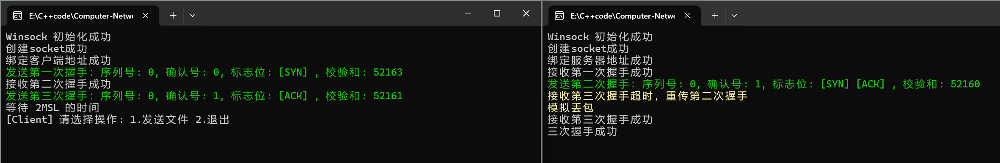

具体分析过程以及其他丢包情况的测试在3-1中已经给出，这里就不再赘述。

#### 文件传输

这里由于丢包率设置过高，为了节省时间，我选择发送1.jpg。

##### 文件信息发送

客户端成功发送了文件名和基本信息，服务端也正确回复了ACK确认。

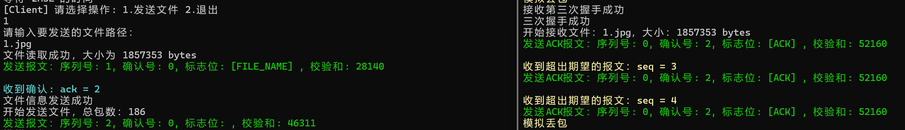

- 客户端发送：**序列号：1**，**确认号：0**，**标志位：[FILE_NAME]**，**校验和：28140**。
- 服务端回复：**序列号：0**，**确认号：2**，**标志位：[ACK]**，**校验和：52160**。

- 客户端收到确认后显示 **"文件信息发送成功"**。

文件信息的序列号、确认号和标志位与协议设计完全一致，传输正确。

##### 文件传输

文件传输过程中也出现了丢包导致的超时重传、重复接收报文。这里我的累积确认机制就发挥了作用。

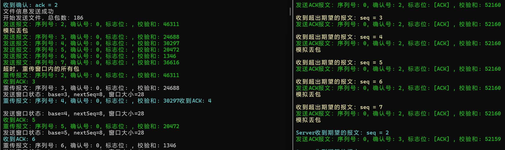

- **客户端**在发送序列号为2的数据包时，数据包丢失。
- 由于采用了滑动窗口机制，**客户端**继续发送后续的数据包。
- 而**服务端**收到了不符合期望的数据包，直接丢弃，并发送上次确认的数据包也就是2
- 之后计时器发挥了作用，触发了超时重传，**客户端**重新发送窗口内的所有数据包。
- 最终，**客户端**收到了确认`ack = 3`，标志着3之前的数据包全部传输完成，**客户端**发送窗口base右移。

同时，也可以发现，由于发送线程和接受线程一起运行，中间的输出信息有点乱，不过是正常的。

##### 传输结果

其他数据包的传输与此类似，就不再展示。直接到最后的传输结果：

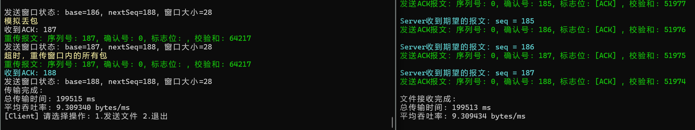

文件传输结束后，客户端和服务端均显示如下统计信息：

- **客户端**：总耗时199515ms，平均吞吐率9.3bytes/ms。
- **服务端**：总耗时199513ms，平均吞吐率9.3bytes/ms。

可以发现，吞吐率比停等协议的还要低几倍，猜测是由于重传时需要发送窗口内的所有已经发送但没被确认的数据包，导致性能下降严重。后面3-3实现拥塞控制后就会好很多。（其实也就只有丢包率过大、延时过大时会这样，后面的性能测试中可以发现在网络好一点时还是GBN效率高一点）

##### 文件检查

传输完成后，查看文件属性

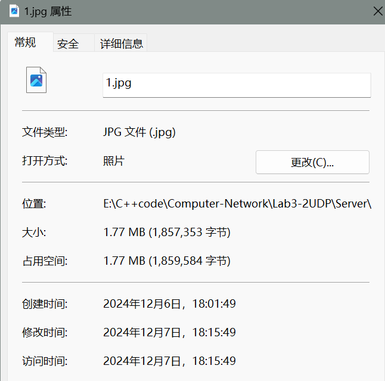

可以看到传输前后文件大小没有发生改变。

打开文件，可以看到文件成功打开，说明数据无误。


#### 四次挥手

测试最后进行了四次挥手，以确保连接能够正确关闭。

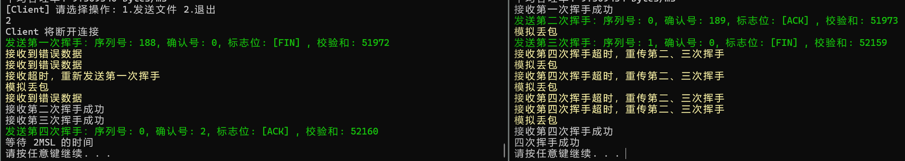

具体的分析过程和丢包测试在3-1中已经给出，就不再赘述。

### 其他测试

除了以上丢包率为 30%、延时为 100ms、传输文件1.jpg的测试，我也对三次握手、四次挥手、文件传输等不同过程、多个不同文件、不同丢包率和延时下的广泛测试，均能正确处理！(不知道花了几天时间……)

### 性能分析

我采用了**5%丢包率**和**10ms的延时**，同时将**超时重传时间设置为50ms**、**发送窗口大小设置为24**。以下是四个测试文件在这一条件下的总传输时间和平均吞吐率的对比结果：

|     文件名     | 大小(KB) | 数据包 | 传输时间(ms) | 吞吐率(bytes/ms) |
| :------------: | :------: | :----: | :----------: | :--------------: |
| helloworld.txt |   1617   |  166   |     3400     |       487        |
|     1.jpg      |   1814   |  186   |     3893     |       477        |
|     2.jpg      |   5761   |  590   |    12075     |       488        |
|     3.jpg      |  11689   |  1197  |    22300     |       537        |

> 以上数据仅对本次实验负责

从表格中可以看出：

- 随着文件大小的增加，总传输时间显著增加，这符合预期，因为更大的文件需要更多的数据包进行传输。
- 吞吐率在不同文件之间有一定的波动，但整体来看，随着文件大小的增加，吞吐率在大文件传输中保持相对稳定，这表明即使在丢包和延迟的环境下，TCP 协议的重传机制仍能有效保障传输效率。

为了更直观地展示这些结果，我绘制了文件大小与传输时间、吞吐率之间的关系图：

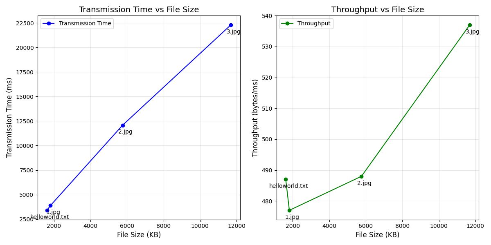

通过上述图表，可以直观地观察到传输时间随着文件大小的增加而线性增长，而吞吐率则相对稳定，尽管存在一定的波动。

（至于不同协议之间的对比，发送窗口大小、丢包率、延时时间等参数对 GBN 性能的影响，这样的测试就等 **3-4 时统一分析**）

## 六、实验反思与总结

------

### 实验挑战

1. **连续文件传输**
	实现多个文件的连续传输需要设计可靠的逻辑，确保在一个文件传输完成后，能够准确无误地启动下一个文件的传输。
2. **线程安全**
	在多线程环境下，确保对共享资源（如发送缓冲区）的操作是线程安全的，避免因数据竞争导致的错误或程序死锁。
3. **线程管理**
	需要正确地启动和终止线程，确保程序结束时所有线程能够安全退出，避免出现僵尸线程或资源泄漏。
4. **累积确认**
	在接收方发送 ACK 时，正确实现累积确认的逻辑，确保滑动窗口能够准确地滑动，提升传输效率。
5. **异常处理**
	在测试过程中我遇到了电脑死机问题 🤣，需要分析可能的死锁或资源冲突原因。
6. **调试复杂性**
	多线程和网络通信的调试较为复杂，尤其是在复现问题和分析日志方面。通过使用调试工具（如 Visual Studio）进行了详细的分析，提升了调试效率。
7. **有限状态机问题**
	发送方的 GBN（Go-Back-N）状态机设计上，先发送报文，再将其加入滑动窗口，导致接收方快速回复 ACK，而发送方尚未将报文加入滑动窗口，从而触发异常。通过调整状态机逻辑，改为先将报文加入滑动窗口再发送，成功解决了该问题。
8. **接收方 ACK 丢失问题**
	如果传输过程中接收方回复的最后一个 ACK 丢失，可能导致发送方无法正确确认已完成的传输。解决方法：服务器端完成文件接收后继续接收数据包，如果不是文件传输请求或者断开连接请求，就表明之前数据包可能丢失，重发上一次发送的数据包。（这个方法充分利用了我 3-1 的代码，即服务端 run 函数不断结束数据包、还有之前为了解决三次握手、四次挥手的丢包问题而添加的 sendMessage、recvMessage 成员变量，我真是个天才。话说回来，sendMessage、recvMessage 这两个变量真是帮我解决了三次握手、四次挥手、文件传输中最后一个数据包丢失的老大难问题）

### 程序不足

尽管取得了一定进展，但程序还存在一些不足之处。例如，初始的大缓冲区设计在传输大文件时占用了过多的内存，影响了性能。此外，重传等待时间采用固定值，没有根据网络条件进行动态调整，这导致了效率低下和不必要的重传。

### 改进措施

针对这些问题，我计划采取以下改进措施。首先，引入最大报文段大小（MSS）协商机制，根据网络状况和需求选择最合适的 MSS 值，以提高传输效率。其次，我将采用分块传输策略，将大文件分割成小块进行传输，减少内存占用，提高大文件传输效率。此外，我还将根据网络的实时状况动态调整重传等待时间，参考前一个消息的往返时延（RTT）。

### 实验收获

通过本次实验，我不仅学习了如何使用多线程来处理并发任务，例如在客户端中使用线程接收 ACK，还掌握了线程同步技术，如互斥锁（mutex）来保护共享资源。同时我也学会了各种异常情况的处理，并深刻认识到了调试和日志记录在程序开发中的重要性，通过日志记录可以有效监控程序运行状态，定位并解决潜在问题。


