<div align='center'>
<b> <font face='微软雅黑' size='6'> 计算机网络课程实验报告 </font> </b>
</div>


<div align='center'>
<b> <font font face='微软雅黑' size='6'> 实验 3-3 </font> </b>
</div>


<div>
<font face='宋体' size='6'>&nbsp;&nbsp;&nbsp;&nbsp; 学 院：网络空间安全学院 </font> <br>
<font face='宋体' size='6'>&nbsp;&nbsp;&nbsp;&nbsp; 专 业：信息安全 </font> <br>
<font face='宋体' size='6'>&nbsp;&nbsp;&nbsp;&nbsp; 学 号：2212998 </font> <br>
<font face='宋体' size='6'>&nbsp;&nbsp;&nbsp;&nbsp; 姓 名：胡博浩 </font> <br>
</div>
## 一、实验要求与功能

------

### （一）实验要求

在实验 3-2 的基础上，选择实现一种拥塞控制算法，也可以是改进的算法，完成给定测试文件的传输。

1. 协议设计：数据包格式，发送端和接收端交互，详细完整
3. 发送缓冲区、接收缓冲区
4. RENO 算法或者自行设计其他拥塞控制算法
5. 日志输出：收到/发送数据包的序号、ACK、校验和等，发送端和接收端的窗口大小等情况，传输时间与吞吐率
6. 测试文件：必须使用助教发的测试文件（1.jpg、2.jpg、3.jpg、helloworld.txt）

**注**：这次接收放的窗口大小还是 1

### （二）自行扩展功能

这次实验基于上次 3-2，除了之前已有的扩展功能，为了配合拥塞控制的实现，还添加了以下功能：

1. **打印锁**：
	- 这次实验中我发现打印信息会混乱，导致无法区分消息类型。因此，我在所有涉及输出的地方添加了锁。
	- 具体更改在模块分析会说明；而为什么 3-2 不会有这个问题会在反思总结说明。

2. **详细输出信息**：
	- 提供详细的错误提示信息，方便排查问题。
	- 输出数据包信息、窗口的改变情况

感谢老师的教导与助教的批阅，辛苦！（在报告中我会注明未改变的地方，可以直接跳过）

## 二、实验环境与说明（和 3-2 基本相同）

------

### （一）环境配置

本实验在 Windows 系统上使用 Visual Studio 进行开发，文件编码为 UTF-8（带 BOM）。实验中通过 C++ 编写了服务器和客户端程序，使用了多种库函数和头文件来实现网络通信、文件操作等功能。

### （二）头文件与库函数

**主要头文件：**

- `<iostream>`：用于标准输入输出操作。
- `<winsock2.h>`：用于 Windows 套接字编程。
- `<ws2tcpip.h>`：提供了 Windows 套接字扩展功能。
- `<string>`：用于字符串操作。
- `<fstream>`：用于文件读写操作。
- `<chrono>`：用于时间操作和计时。
- `<thread>`：用于多线程操作。
- `<vector>`：用于动态数组操作。
- `<sstream>`：用于字符串流操作。
- `<random>`：用于生成随机数。
- `<mutex>`：用于线程间的互斥锁操作。
- `<atomic>`：用于原子操作。

**关键库函数：**

- `WSAStartup`：初始化 Winsock 库。

- `socket`：创建套接字。
- `bind`：绑定套接字到本地地址。
- `sendto`：发送数据到指定地址。
- `recvfrom`：从指定地址接收数据。
- `closesocket`：关闭套接字。
- `WSACleanup`：清理 Winsock 库。
- `inet_pton`：将 IPv4 和 IPv6 地址从文本转换为二进制形式。
- `ioctlsocket`：控制套接字的 I/O 模式。
- `FormatMessageA`：格式化系统错误消息。
- `this_thread::sleep_for`：使当前线程休眠指定时间。
- `CreateThread`：创建一个新的线程。
- `WaitForSingleObject`：等待指定的线程终止。
- `CloseHandle`：关闭线程句柄。

通过这些头文件和库函数，实验实现了客户端与服务器之间的 UDP 通信，包括三次握手、四次挥手以及文件传输等功能。

## 三、协议设计

------

### （一）协议概述

本协议的设计目标是在不可靠的 UDP 信道上实现可靠的文件传输。协议模拟了 TCP 中的连接建立（通过三次握手）和连接断开（通过四次挥手），并且采用了类似 TCP 的重传机制来保证数据的可靠传输。通过自定义的数据包结构和错误检测与恢复机制，确保数据能够在丢包、延迟等不可靠网络环境下高效且完整地传输。

这次实验主要是在实验 3-2 的基础上，实现 RENO 算法来进行拥塞控制。由于接收窗口为 1，这里发送窗口就直接等于拥塞窗口。另外，也继续使用 GBN 协议和累积确认机制，比如快速重传就直接重传窗口中的所有数据包。

虽然这次实验只添加了拥塞控制，但是为了保证协议的完整性，我仍然完整详细说明，但读者 **可以选择直接跳到拥塞控制部分**。

### （二）数据包设计（和 3-2 基本相同）

为了确保在不可靠的网络环境中实现可靠的文件传输，本协议设计了自定义的数据包格式 `Message`，该数据包包含了通信中所需的所有字段，并通过校验和机制确保数据完整性。数据包的具体结构如下：

#### 1. 数据包格式

```cpp
#pragma pack(1) // 设置结构体内存对齐为1字节
class Message {
public:
    uint32_t srcIP{ 0 };       // 源IP地址（4字节）
    uint32_t destIP{ 0 };      // 目的IP地址（4字节）
    uint16_t srcPort{ 0 };     // 源端口（2字节）
    uint16_t destPort{ 0 };    // 目的端口（2字节）
    uint32_t seqNum{ 0 };      // 序列号（4字节）
    uint32_t ackNum{ 0 };      // 确认号（4字节）
    uint32_t length{ 0 };      // 数据长度（4字节）
    uint16_t flags{ 0 };       // 标志位（2字节）
    uint16_t checkNum{ 0 };    // 校验和（2字节）
    uint8_t data[MAX_MSG_SIZE]{ 0 };  // 数据段（最大大小为10000字节）
    // 构造函数
    Message() = default;
    // 标志位操作
    bool is_SYN() const { return flags & Flag::SYN; }
    void set_SYN() { flags |= Flag::SYN; }
    bool is_ACK() const { return flags & Flag::ACK; }
    void set_ACK() { flags |= Flag::ACK; }
    bool is_FIN() const { return flags & Flag::FIN; }
    void set_FIN() { flags |= Flag::FIN; }
    bool is_FILE_NAME() const { return flags & Flag::FILE_NAME; }
    void set_FILE_NAME() { flags |= Flag::FILE_NAME; }
    // 校验和方法
    bool checkSum();
    void setCheckSum();
    // 清理报文
    void clean();
};
#pragma pack() // 恢复默认内存对齐
```

**字段说明：**

- **srcIP** 和 **destIP**：由于实验在本地进行，这两个字段未实际使用，但保留以模拟真实环境。
- **srcPort** 和 **destPort**：源端口和目标端口，用于标识通信双方的端口。
- **seqNum**：序列号，用于保证数据包的有序性。
- **ackNum**：确认号，用于接收方确认数据包的接收。
- **length**：数据段长度，指示有效数据部分的大小。
- **flags**：标志位，指示数据包的类型和控制信息，如连接请求、确认、数据等。
- **checkNum**：校验和，用于确保数据传输过程中的完整性。
- **data**：数据部分，包含实际传输的文件数据或控制信息。

#### 2. 标志位定义

```cpp
struct Flag {
    static constexpr uint16_t SYN = 0x1;        // 建立连接
    static constexpr uint16_t ACK = 0x2;        // 确认接收
    static constexpr uint16_t FIN = 0x4;        // 关闭连接
    static constexpr uint16_t FILE_NAME = 0x8;  // 传输文件名
};
```

### （三）客户端和服务器交互过程

在本次实验中，客户端和服务器通过自定义的协议在不可靠的 UDP 信道上实现可靠的数据传输。主要包括连接建立、数据传输和连接断开三个阶段。为此，引入了滑动窗口机制、发送缓冲区、累积确认以及超时重传等技术。在 3-3 中，新增拥塞控制机制，用于保证网络畅通（为互利共赢举大旗 🚩）

#### 1. 连接建立：三次握手（包含超时重传）（和 3-2 基本相同）

连接建立采用类似 TCP 的三次握手机制，确保双方建立可靠的通信通道。

##### 流程描述

1. **第一次握手：** 客户端发送一个带有 `SYN` 标志位的报文，序列号为 `seqNum = x`。

2. **第二次握手：** 服务器收到后，回复一个带有 `SYN` 和 `ACK` 标志位的报文，序列号为 `seqNum = y`，确认号为 `ackNum = x + 1`。

3. **第三次握手：** 客户端收到后，再发送一个带有 `ACK` 标志位的报文，序列号递增、即 `seqNum = x + 1`，确认号为 `ackNum = y + 1`。

4. **等待确认：** 客户端在发送完第三次握手的 `ACK` 报文后，进入 `TIME_WAIT` 状态，等待 **2 \* MSL**（最大报文段生存时间），以确保服务器成功接收到 `ACK`。

5. **连接建立成功：** 服务器收到第三次握手的 `ACK` 后，认为连接建立成功。

##### 时序图

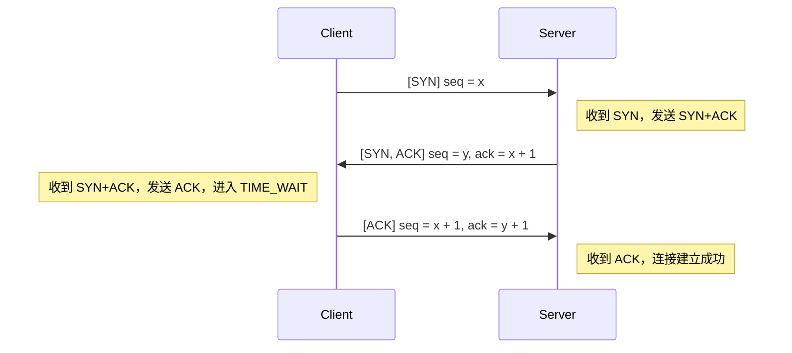

##### 超时重传机制

为保证连接可靠建立，引入超时重传机制：

- **客户端：**
  - 在发送第一次握手（`SYN`）后，启动定时器，等待服务器的 `SYN+ACK` 报文。
  - 若在超时时间（如 500ms）内未收到预期报文，则重传 `SYN` 报文。
  - 最大重传次数限制，超过则连接建立失败。
  - 在发送第三次握手（`ACK`）后，进入 `TIME_WAIT` 状态，等待 **2 \* MSL**，以防止 `ACK` 丢失导致服务器重复发送 `SYN+ACK`。
- **服务器：**
  - 在发送第二次握手（`SYN+ACK`）后，启动定时器，等待客户端的 `ACK` 报文。
  - 若在超时时间内未收到 `ACK`，则重传 `SYN+ACK` 报文，直到达到最大重传次数。

##### 三次握手流程图

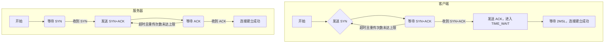

#### 2. 可靠数据传输（新增拥塞控制）

在不可靠的 UDP 信道上，需要通过实现可靠的数据传输协议来确保文件的完整传输。我基于滑动窗口机制的 Go-Back-N 协议设计了以下协议，该设计支持累积确认、发送缓冲区和接收缓冲区。（主要参考 GBN 的有限状态机，在“四、状态机图”处可以看到）。

##### 传输过程描述（和 3-2 基本相同）

1. **文件名与文件信息传输**

  **客户端：**

  发送一个包含 `FILE_NAME` 标志的报文，`seqNum = n`，数据段包含文件名和文件大小。等待服务器对该报文的确认（ACK）。

  **服务器：**

  接收文件名报文，提取文件名和文件大小。回复一个累积确认的 `ACK` 报文，`ackNum = n + 1`，表示成功接收。

2. **文件数据传输（采用滑动窗口的 Go-Back-N 协议）**

  **客户端：**

  - 将文件按 MAX_MSG_SIZE 分块，序列号 `seqNum` 依次递增。
  - 维护一个发送窗口（大小为 windowSize），以及发送缓冲区（sendBuffer）。
  - 连续发送窗口内的数据报文，并将其存入发送缓冲区。
  - 启动定时器 timerStart，用于超时重传检测。
  - 若收到服务器的累积确认 `ACK`，更新发送窗口的基序号 base，并从发送缓冲区中移除已确认的报文。
  - 如果未在超时时间内收到 `ACK`，触发超时重传，将窗口内未确认的所有报文重新发送。

  **服务器：**

  - 维护期望收到的序列号 base。
  - 接收数据报文，进行校验和验证。
  - 如果收到的报文序列号与 base 匹配：将数据存入接收缓冲区；base 增加，表示期望下一个序列号；发送累积确认 `ACK`，`ackNum = base`。
  - 如果收到的报文序列号小于 base，表示该报文已被接收并确认，重新发送当前的 `ACK`。
  - 如果收到的报文序列号大于 base，表示有报文丢失，丢弃该报文，重新发送当前的 `ACK`。

##### 数据传输时序图（和 3-2 基本相同）

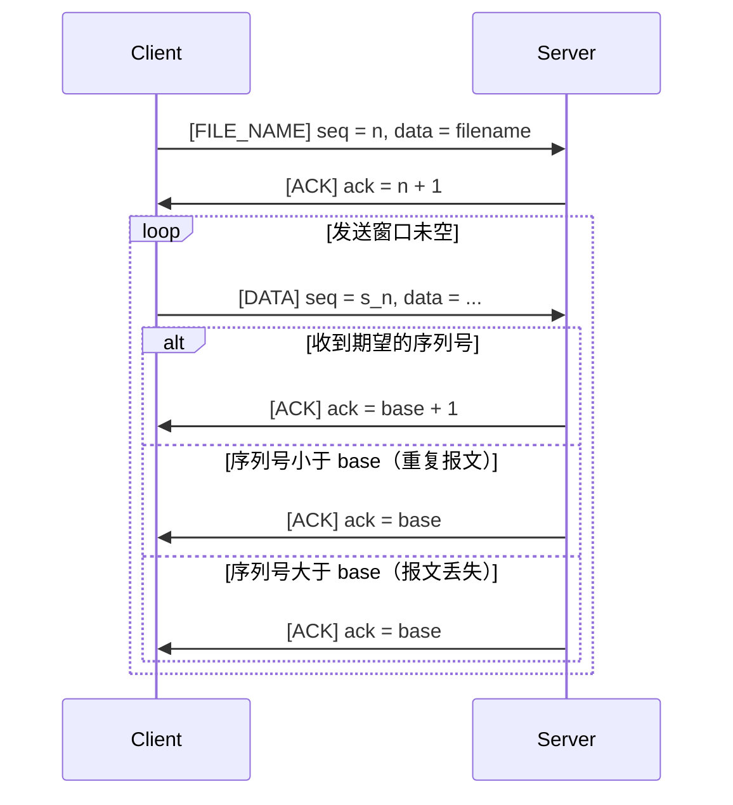

##### 超时重传机制（和 3-2 基本相同）

**客户端：**

- 对于发送窗口内的第一个报文，启动定时器 timerStart。
- 如果在超时时间内未收到相应的 `ACK`，触发超时重传，将窗口内未被确认的所有报文重新发送。
- 重传后，重新启动定时器。

##### 流量控制（和 3-2 基本相同）

- **发送窗口机制：**

	发送窗口大小 windowSize 控制了客户端在未收到确认的情况下可以连续发送的报文数量。当 nextSeq < base + windowSize 时，客户端可以继续发送新的报文。

- **累积确认：**

	服务器通过发送累计的 `ACK` 报文，告知客户端已成功接收的最大连续序列号。客户端收到 `ACK` 后，可以滑动发送窗口，并从发送缓冲区中移除已确认的报文。

##### 拥塞控制（新增）

本次实验我采用的是 Reno 算法，该算法假设所有丢失是由于拥塞造成的，使用丢包来衡量网络拥塞状况。

整个算法大致如下图所示：

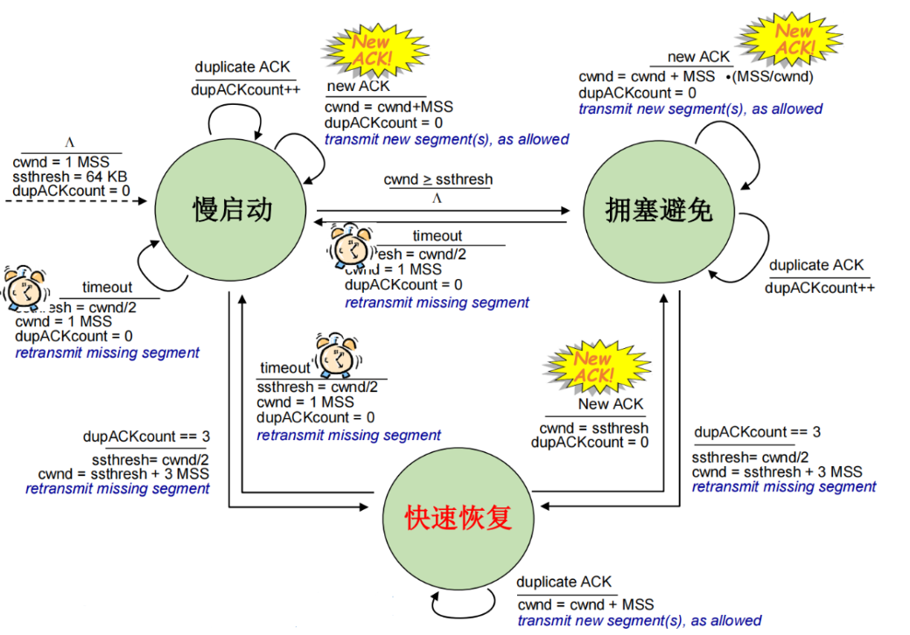

###### 阶段介绍

- 慢启动阶段：初始拥塞窗口为 `cwnd = 1`，每收到一个新的 ACK，cwnd 自增 1。当连接初始建立或超时，则进入慢启动阶段
- 拥塞避免阶段：设置阈值 ssthresh，当拥塞窗口 `cwnd >= ssthresh` 时，则从慢启动阶段进入拥塞避免阶段。拥塞避免阶段中，每轮 RTT，cwnd 增加 1
- 快速恢复阶段：当接收到三次冗余 ACK 时，进入快速恢复阶段。在快速恢复阶段中，每收到一个冗余 ACK，cwnd 增 1。如果出现超时，则进入慢启动阶段；如果接收到新的 ACK，进入拥塞避免阶段

###### 具体设计（为了方便，按照事件的方式说明）

1. 开始阶段：进入慢启动状态, ssthresh = 64, cwnd = 4，收到一个 ack 则 cwnd = cwnd + 1
2. 遇到超时：ssthresh = max(cwnd / 2, 2U), cwnd = 1, 进入慢启动状态，准备重传
3. 遇到三次重复确认 ack：进入快速恢复状态, ssthresh = max(cwnd / 2, 2U), cwnd = threshold + 3，准备重传
4. 收到新、正确的 ack
	- 如果是慢启动状态下，cwnd = cwnd + 1; 如果 cwnd >= ssthresh, 进入拥塞避免状态
	- 如果是拥塞避免状态下，cwnd = cwnd + 1 / cwnd（即一轮增加一）
	- 如果是快速恢复状态下，cwnd = ssthresh, 进入拥塞避免
5. 收到旧 ack（也就是重复的 ack）
	- 如果是非快速恢复状态下，等待三次，然后进入快速恢复状态
	- 如果是快速恢复状态下，cwnd = cwnd + 1

算法的具体实现将在程序设计中详细说明，包括细节和关键点；算法的一些思考和问题将在最后的实验反思与总结处解释。

##### 差错控制（和 3-2 基本相同）

**校验和检查：**

每个数据报文都包含校验和，用于检测传输过程中是否发生位错误。服务器在接收报文时进行校验和验证，如有错误则丢弃该报文，不发送 `ACK`。

##### 数据传输流程图（和 3-2 基本相同）

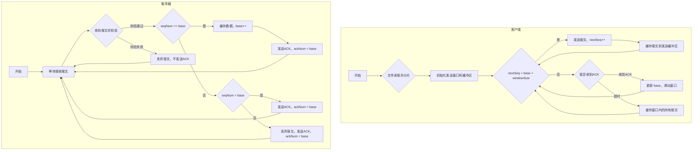

#### 3. 连接断开：四次挥手（包含超时重传）（和 3-2 基本相同）

连接断开采用类似 TCP 的四次挥手机制，双方依次发送和确认关闭连接的请求。

##### 流程描述

1. **第一次挥手：** 客户端发送带有 `FIN` 标志的报文，序列号 `seqNum = u`，表示请求关闭连接。
2. **第二次挥手：** 服务器收到后，发送带有 `ACK` 标志的确认报文，确认号为 `ackNum = u + 1`。
3. **第三次挥手：** 服务器发送带有 `FIN` 标志的报文，序列号 `seqNum = v`，表示准备关闭连接。
4. **第四次挥手：** 客户端收到后，发送带有 `ACK` 标志的确认报文，`seqNum = u + 1`，`ackNum = v + 1`。
5. **等待确认（客户端）：** 客户端在发送完最后的 ACK 报文后，重新进入 `TIME_WAIT` 状态，等待 **2 \* MSL**，以确保服务器成功接收到 `ACK`。
6. **连接关闭：** 服务器收到 `ACK` 后，直接关闭连接；客户端在等待超时后，关闭连接。

##### 时序图

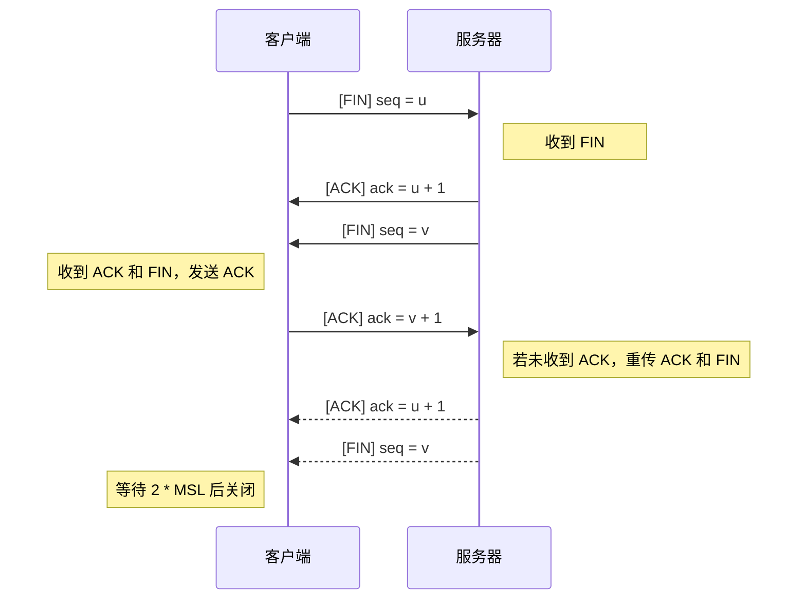

##### 超时重传机制

- **客户端：**
  - 在发送第一次挥手（`FIN`）后，启动定时器，等待服务器的 `ACK` 和 `FIN` 报文。
  - 若在超时时间内未收到预期报文，则重传 `FIN` 报文，重新等待两个报文，直到达到最大重传次数。
  - 如果只收到 `ACK` 未收到 `FIN`，超时后也重传 `FIN`
  - 收到两个报文后，发送最后的 `ACK` 报文，进入 `TIME_WAIT` 状态，等待 **2 \* MSL**。
  - 若在 `TIME_WAIT` 状态时，再次收到服务器的 `ACK + FIN` 报文，重新发送 `ACK`。
- **服务器：**
  - 在收到客户端的 `FIN` 后，依次发送 `ACK` 和 `FIN` 报文。
  - 发送后，启动定时器，等待客户端的最后 `ACK`。
  - 若在超时时间内未收到 `ACK`，则重传 `ACK` 和 `FIN` 报文，直到达到最大重传次数。
  - 收到客户端的 `ACK` 后，直接关闭连接。


##### 四次挥手流程图

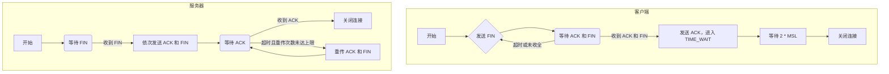

### （四）状态机图（和 3-2 基本相同）

#### 1. 客户端状态机

采用 GBN 的发送方拓展有限状态机。具体流程如下图：


#### 2. 服务器端状态机

同样采用接收方拓展的有限状态机。具体流程如下图：


### （五）限制和约束（和 3-2 基本相同）

1. **数据包大小限制：**

   **最大数据段大小：** MAX_MSG_SIZE 为 10000 字节，防止数据包过大导致丢失。

2. **序列号和确认号：**

   每次发送或接收数据包，seqNum 和 ackNum 必须严格按照协议递增，确保数据有序可靠传输。

## 四、程序设计

------

### （一）程序简介

在实验 3-2 的基础上，本次实验实现 RENO 算法来进行拥塞控制。由于接收窗口为 1，这里发送窗口就直接等于拥塞窗口。另外，也继续使用 GBN 协议和累积确认机制，比如快速重传就直接重传窗口中的所有数据包。实验中还自行设置了丢包和延时，进行了包括快速重传机制在内的多种测试。

### （二）程序模块与功能

本次实验的实现主要包含三个核心文件：**Message.h**、**Client.cpp**、**Server.cpp**。各文件的功能与关键实现如下：

#### Message.h

这是本实验的核心头文件，定义了消息传输协议的核心部分，包括常量定义、消息结构、以及 UDP 基类。这次实验未改动这个文件，不过需要说明一下 UDP 类中的两个打印函数，后面为了保持控制台输出信息正确添加打印锁的时候对其进行了重载。

```c++
void print(const string& info, Level level);  // 打印信息
void printMessageInfo(const Message& msg, const string& prefix, Level level);  // 打印报文信息
bool sendtoWithSimulation(SOCKET s, const char* buf, int len, int flags, const sockaddr* to, int tolen);  // 发送数据时模拟丢包延时
```

另外，模拟丢包与延时也是使用了 `sendtoWithSimulation` 方法，后面直接调用这个函数替代 sendto 即可实现丢包和延时功能。（具体细节在前面的报告中已说明，这里不再赘述）

#### Client.cpp

这次实验只修改了这个文件。与上次 3-2 相比，主要增加了以下内容：

##### 变量

```c++
mutex printMtx;                     // 保护打印

// 拥塞控制相关变量
uint32_t cwnd;                      // 拥塞窗口大小
uint32_t ssthresh;                  // 慢启动阈值
enum CongestionState { SLOW_START, CONGESTION_AVOIDANCE, FAST_RECOVERY };
CongestionState state;              // 拥塞控制状态
uint32_t dupAckCount;               // 重复 ACK 计数
uint32_t newAckNum;                 // 新 ACK 数量
```

增加了以上拥塞控制相关的成员变量，这些变量用于跟踪和控制拥塞窗口的大小以及当前的拥塞控制状态；增加了打印互斥锁，保护输出，确保在多线程环境下打印时不会出现内容交织的情况，保证了输出的完整性和可读性。

##### 方法

增加了线程安全的打印方法（主要是重载 UDP 基类的函数）:

```c++
void print(const string& info, Level level) {
    lock_guard<mutex> lock(printMtx);
    UDP::print(info, level);
}
void printMessageInfo(const Message& msg, const string& prefix, Level level) {
    lock_guard<mutex>lock(printMtx);
    UDP::printMessageInfo(msg, prefix, level);
}
```

最后，Client 类的具体代码设计如下：

```c++
class Client : UDP {
private:
    SOCKET clientSocket;                // 客户端 socket
    SOCKADDR_IN clientAddr;             // 客户端地址
    SOCKADDR_IN routerAddr;             // 路由器地址

    atomic<bool> running;               // 是否正在发送数据
    atomic<bool> resend;                // 是否需要重传标志
    atomic<ULONGLONG> timerStart;       // 计时器起始时间
    uint32_t windowSize;                // 窗口大小（应该等于接收窗口大小，这个实验没用）
    uint32_t nextSeq;                   // 下一个序列号
    uint32_t base;                      // 窗口基序号
    vector<Message> sendBuffer;         // 发送缓冲区
    mutex bufferMtx;                    // 保护发送缓冲区

    mutex printMtx;                     // 保护打印

    // 拥塞控制相关变量
    uint32_t cwnd;                      // 拥塞窗口大小
    uint32_t ssthresh;                  // 慢启动阈值
    enum CongestionState { SLOW_START, CONGESTION_AVOIDANCE, FAST_RECOVERY };
    CongestionState state;              // 拥塞控制状态
    uint32_t dupAckCount;               // 重复 ACK 计数
    uint32_t cwnd_increment;            // 拥塞窗口增量（用于拥塞避免阶段）

    void resendPackets();               // 重传窗口内的所有包
    void printWindowStatus();           // 窗口信息打印函数
    void setMsg(Message& msg);          // 设置报文
    bool sendMessage(Message& msg);     // 实现单个报文发送
public:
    Client() : clientSocket(INVALID_SOCKET), running(false), timerStart(0), resend(false) {
        isConnected = false; nextSeq = 0; base = 0; windowSize = 24;
        cwnd = 4; ssthresh = 64; state = SLOW_START; dupAckCount = 0; cwnd_increment = 0;
    }
    ~Client() {
        if (clientSocket != INVALID_SOCKET) {
            closesocket(clientSocket);
            clientSocket = INVALID_SOCKET;
        }
        WSACleanup();
    }
    bool initialize();                  // 初始化客户端
    bool threeWayHandshake();           // 实现三次握手
    void sendFile(const string& filename); // 实现文件传输
    bool fourWayHandwave();             // 实现四次挥手
    void waitExit();                    //等待退出
    void run();                         // 运行客户端

    static DWORD WINAPI receiveAck(LPVOID pParam); // 接收ACK的线程函数
    void print(const string& info, Level level) {
        lock_guard<mutex> lock(printMtx);
        UDP::print(info, level);
    }
    void printMessageInfo(const Message& msg, const string& prefix, Level level) {
        lock_guard<mutex>lock(printMtx);
        UDP::printMessageInfo(msg, prefix, level);
    }
};
```

#### Server.cpp（和 3-2 基本相同，不再赘述）

### （三）核心代码分析

#### 拥塞控制实现（新增）

接下来，我将结合代码详细说明是如何实现协议的。

##### 代码说明

**1. 初始化阶段**

在 Client 类的初始化过程中，设置了拥塞控制所需的参数：

- cwnd：拥塞窗口大小，初始值为 1。

- ssthresh：慢启动阈值，初始值为 64。

- state：拥塞控制状态，初始为 SLOW_START（慢启动）。

```cpp
cwnd = 1;               // 拥塞窗口初始为1
ssthresh = 64;          // 慢启动阈值初始为64
state = SLOW_START;     // 初始状态为慢启动
```

**2. 数据发送过程**

在发送数据时，根据拥塞窗口 cwnd 和发送基序号 base，确定可以发送的数据包数量。

```cpp
while (nextSeq < base + cwnd && nextSeq < totalPackets) {
    // 发送数据包逻辑
    if (nextSeq == base) {
        timerStart.store(GetTickCount64()); // 开始计时
    }
    nextSeq++;
}
```

- 当 nextSeq < base + cwnd 时，表示发送窗口未满，可以继续发送数据包。

- 当 base == nextSeq 时，表示准备发送窗口中第一个数据包，因此启动计时器。

**3. 接收 ACK 的处理**

在 receiveAck 函数中，根据收到的 ACK，对拥塞控制状态和参数进行调整。

**（1）收到新的 ACK（累积确认，`ackNum > base`）**

```cpp
if (recvMsg.ackNum > base) {
    base = recvMsg.ackNum;     // 更新基序号
    dupAckCount = 0;           // 重置重复ACK计数

    if (state == FAST_RECOVERY) {
        cwnd = ssthresh;       // cwnd设置为ssthresh
        state = CONGESTION_AVOIDANCE; // 转为拥塞避免阶段
    } else if (state == SLOW_START) {
        cwnd += 1;             // cwnd加1（指数增长）
        if (cwnd >= ssthresh) {
            state = CONGESTION_AVOIDANCE; // 进入拥塞避免阶段
            cwnd_increment = 0;
        }
    } else if (state == CONGESTION_AVOIDANCE) {
        cwnd_increment++;
        if (cwnd_increment == cwnd) {
            cwnd += 1;         // cwnd加1（线性增长）
            cwnd_increment = 0;
        }
    }
    // 重置计时器
    if (base != nextSeq) {
        timerStart.store(GetTickCount64());
    } else {
        timerStart.store(0);
    }
}
```

- **慢启动阶段**：cwnd 每收到一个新 ACK 加 1，当 `cwnd >= ssthresh` 时，进入拥塞避免阶段。

- **拥塞避免阶段**：通过 cwnd_increment 计数，实现每个 RTT 增加 1 的线性增长。

- **快速恢复阶段**：收到新 ACK 后，cwnd 设置为 ssthresh，进入拥塞避免阶段。

**（2）收到重复的 ACK（`ackNum == base`）**

```cpp
else {
    if (state == FAST_RECOVERY) {
        cwnd += 1; // cwnd加1
    } else {
        dupAckCount += 1;
        if (dupAckCount == 3) {
            ssthresh = max(cwnd / 2, 2U); // 更新ssthresh
            cwnd = ssthresh + 3;
            state = FAST_RECOVERY;        // 进入快速恢复阶段
            resendPackets();              // 重传丢失的数据包
        }
    }
}
```

- **非快速恢复阶段**：当收到三个重复 ACK，判断为丢包，进入快速恢复阶段，缩减 ssthresh，调整 cwnd，并重传数据。

- **快速恢复阶段**：每收到一个重复 ACK，cwnd 加 1，继续发送新数据。

**4. 超时处理**

当检测到数据包发送超时时，进行以下操作：

```cpp
if (timerStart.load() != 0 && GetTickCount64() - timerStart.load() > MAX_WAIT_TIME) {
    ssthresh = max(cwnd / 2, 2U); // 更新ssthresh
    cwnd = 1;                     // 重置cwnd为1
    state = SLOW_START;           // 回到慢启动阶段
    dupAckCount = 0;
    resendPackets();              // 重传未确认的数据包
}
```

- **超时重传**：认为网络发生拥塞，缩小 ssthresh，重置 cwnd，回到慢启动阶段，重新开始拥塞控制。

**5. 重传机制**

提供了 resendPackets 函数，重传发送窗口内的所有未确认数据包。

```cpp
void Client::resendPackets() {
    // 复制发送缓冲区中的未确认数据包
    for (const auto& msg : sendBuffer) {
        sendtoWithSimulation(clientSocket, (char*)&msg, sizeof(msg), 0, (sockaddr*)&routerAddr, sizeof(SOCKADDR_IN));
    }
    timerStart.store(GetTickCount64()); // 重置计时器
    resend.store(false);
}
```

- 在超时或收到三个重复 ACK 时调用，确保数据可靠传输。

**6. 窗口状态打印**

通过 printWindowStatus 函数，实时输出拥塞窗口 cwnd、慢启动阈值 ssthresh、基序号 base 和下一个序号 nextSeq

，便于调试和观察算法运行。

```cpp
void Client::printWindowStatus() {
    print("拥塞窗口状态：cwnd=" + to_string(cwnd) + ", ssthresh=" + to_string(ssthresh) + ", base=" + to_string(base) + ", nextSeq=" + to_string(nextSeq), INFO);
}
```

##### 状态转换总结

- **慢启动（SLOW_START）**：
	- 初始阶段，cwnd 每收到一个新 ACK 加 1，呈指数增长。
	- 当 cwnd >= ssthresh，转换到拥塞避免阶段。

- **拥塞避免（CONGESTION_AVOIDANCE）**：
	- cwnd 每经过一个 RTT 加 1，呈线性增长。
	- 持续发送数据，直到发生丢包或超时。

- **快速恢复（FAST_RECOVERY）**：
	- 当收到三个重复 ACK 时进入，认为出现了网络拥塞但通路未完全断开。
	- 缩减 ssthresh，调整 cwnd，快速重传丢失的数据包。
	- 收到新 ACK 后，进入拥塞避免阶段。

##### 细节与关键点

**如何实现拥塞状态中的一轮增加一**：

一开始我直接加上窗口大小分之一，但是这样由于窗口大小设置的是整数，取倒数就表示整除，而根据整除的性质就变为 0 了。所以窗口大小一直不会改变……

后面我选择在类中添加一个新的变量（相当于全局变量）记录收到的新 ACK 数，在收到新 ACK 时该变量加一，循环往复。直到该变量等于窗口大小，让窗口大小加一，重置该变量。

因此该变量表示这一轮数据包发生了多少个，每发完一轮数据包，让窗口大小加一，表示开始发送下一轮的数据包。通过这个全局变量就可以解决这个问题。

（注意这里一定要是全局变量）

**重传时阻塞发送线程**

这次实验添加了快速重传，所以现在有超时重传和快速重传两种机制。出于统一重传的考虑，我改为把重传部分放在接收线程中。

所以，重传时我将会阻塞发送线程，确保发送数据包同一时间只有一个线程；另外，如果重传，也说明网络状况不太好，如果仍然发送新的数据包会导致网络更加差，因此出于拥塞控制的目的，也得把发送线程暂停。

#### 打印锁保护输出（新增）

这次实验由于可能发生发送线程和接收线程同时输出的情况，所以需要添加打印锁保护输出的正确性。

##### 为什么 3-2 不需要，3-3 需要？

在 3-2 中，重传机制也即超时重传，我是放在发送线程中的，也就是在发送数据包前检查是否需要重传（通过检查共享资源 resend 变量），而打印数据包我设计的是只有发送的时候打印、而接收的时候不打印。所以就导致可能发生冲突的发送部分同一时间只有发送线程，因此不需要锁保证输出；

而 3-3 不同，这次实验添加了快速重传，所以现在有超时重传和快速重传两种机制。出于统一重传的考虑，我改为把重传部分放在接收线程中；所以就可能发送这种情况，接收线程重传数据包，而发送线程刚刚检查完 resend 变量，也在发送数据包（虽然概率较低，但是在高并发的情况下是可以发生的），因此就可能造成输出混乱，就需要添加打印锁。

##### 实现细节

**添加打印锁以保护输出：**

- **新增成员变量**：

	```c++
	mutex printMtx;  // 保护打印
	```

- **修改打印函数：** 在涉及打印输出的函数中，增加了锁机制：

	```c++
	void print(const string& info, Level level) {
	    lock_guard<mutex> lock(printMtx);
	    // 打印信息的代码
	}
	void printMessageInfo(const Message& msg, const string& prefix, Level level) {
	    lock_guard<mutex>lock(printMtx);
	    UDP::printMessageInfo(msg, prefix, level);
	}
	```

	多亏了我在 3-2 中已经把涉及打印输出的部分全部统一起来，并添加到 UDP 基类中。这里我就只需要重载基类的相关函数即可，简直不要太简单。（这就是模块化、结构化的好处，后续维护扩展起来不要太轻松，虽然好像一般也不会像计网一样对一个代码反复更改……）

这样可以确保在多线程环境下打印时不会出现内容交织的情况，保证了输出的完整性和可读性。

#### 日志输出（和 3-2 基本相同）

在本次实验中，客户端和服务器通过日志输出记录了数据包的序列号、确认号、校验和等信息，以及传输时间和吞吐率。

##### 日志输出方法

使用 `print` 方法来输出日志信息，依据日志的严重性级别（INFO、WARN、ERR、RECV、SEND）动态调整输出的颜色：

``` cpp
void Client:: print(const string& info, Level level) {
    HANDLE hConsole = GetStdHandle(STD_OUTPUT_HANDLE);
    CONSOLE_SCREEN_BUFFER_INFO consoleInfo;
    GetConsoleScreenBufferInfo(hConsole, &consoleInfo);
    // 根据日志级别设置控制台颜色
    switch (level) {
        case Level:: INFO:
            SetConsoleTextAttribute(hConsole, 7); // 白色
            break;
        case Level:: WARN:
            SetConsoleTextAttribute(hConsole, 14); // 黄色
            break;
        case Level:: ERR:
            SetConsoleTextAttribute(hConsole, 12); // 红色
            break;
        case Level:: RECV:
            SetConsoleTextAttribute(hConsole, 11); // 青色
            break;
        case Level:: SEND:
            SetConsoleTextAttribute(hConsole, 10); // 绿色
            break;
        default:
            SetConsoleTextAttribute(hConsole, 7); // 默认颜色
            break;
    }
    cout << info << endl;
    SetConsoleTextAttribute(hConsole, 7); // 恢复默认颜色
}
```

该方法通过 `Level` 枚举类型定义不同的日志级别，使输出更加直观、便于区分不同类型的日志。

##### 打印报文信息

客户端在发送或接收每个数据包时，记录相关的报文信息，如序列号、确认号、标志位和校验和：

``` cpp
void Client:: printMessageInfo(const Message& msg, const string& prefix, Level level) {
    ostringstream oss;
    oss << prefix
        << "序列号: " << msg.seqNum
        << ", 确认号: " << msg.ackNum
        << ", 标志位: ";
    if (msg.is_SYN()) oss << "[SYN] ";
    if (msg.is_ACK()) oss << "[ACK] ";
    if (msg.is_FIN()) oss << "[FIN] ";
    if (msg.is_FILE_NAME()) oss << "[FILE_NAME] ";
    oss << ", 校验和: " << msg.checkNum;
    print(oss.str(), level);
}
```

服务端同理，就不再展示。

##### 文件传输统计

客户端在文件传输过程中，除了记录每个数据包的发送情况，还会在传输完成后输出文件传输的统计信息，包括总传输时间和平均吞吐率：

``` cpp
void Client:: sendFile(const string& filename) {
    try {
        ......
        // 发送文件信息：文件名、文件大小
        ......
        if (! sendMessage(sendMsg)) {
            throw runtime_error("文件信息发送失败");
        }
        print("文件信息发送成功", INFO);
        // 发送文件内容
        ......
        for (size_t i = 0; i < totalPackets; ++i) {
            ......
            if (! sendMessage(sendMsg)) {
                throw runtime_error("数据包发送失败");
            }
            print("已发送数据包：" + to_string(i + 1) + "/" + to_string(totalPackets), INFO);
        }
        // 计算传输统计
        auto duration = chrono:: duration_cast <chrono::milliseconds>(chrono::steady_clock:: now() - startTime).count();
        float throughput = duration > 0 ? static_cast <float>(fileSize) / duration : 0.0f;
        print("传输完成:\n 总传输时间: " + to_string(duration) + " ms\n 平均吞吐率: " + to_string(throughput) + " bytes/ms", INFO);
    }
    catch (const exception& e) {
        print("文件传输错误: " + string(e.what()), ERR);
    }
}
```

服务器在接收数据包时，同样会记录相关的日志信息，并在接收文件完成后输出统计数据。此处代码结构与客户端基本一致，就不再展示。

#### 丢包延时模拟（和 3-2 基本相同）

原有的路由器程序通过每隔 nnn 个数据包丢弃一个包来实现丢包机制，能够验证程序的超时重传功能，但无法模拟实际网络环境中因数据包延迟时间不同导致的乱序问题。而且程序也存在许多bug，因此我决定自行模拟丢包延时。

##### 丢包率与延时时间定义

在 `Message.h` 文件中引入以下两个参数，用于控制丢包和延时的模拟：

``` c++
double packetLossRate = 0.1; // 丢包率，取值范围为 0.0 到 1.0
int delayTime = 100;         // 延时时间，单位为毫秒
```

##### 辅助函数模拟丢包和延时

为实现丢包和延时的模拟，我设计了辅助函数 `sendtoWithSimulation`，用于包装标准的 `sendto` 函数。在数据发送过程中，该函数引入了延时模拟和随机丢包逻辑：

``` c++
bool Client:: sendtoWithSimulation(SOCKET s, const char * buf, int len, int flags, const struct sockaddr* to, int tolen) {
    // 模拟延时
    std::this_thread:: sleep_for(std::chrono:: milliseconds(delayTime));
    // 模拟丢包
    static std:: random_device rd;
    static std:: mt19937 gen(rd());
    static std:: uniform_real_distribution <> dis(0.0, 1.0);
    if (dis(gen) >= packetLossRate) {
        sendto(s, buf, len, flags, to, tolen); // 实际发送数据
        return true;
    }
    else {
        print("模拟丢包", WARN);
        return false;
    }
}
```

在客户端和服务器的所有数据发送过程中，将原有的 `sendto` 函数替换为 `sendtoWithSimulation`，实现对每个数据包的丢包和延时模拟

## 五、测试、结果与性能分析

------

### 丢包延时测试

为了测试程序在三次握手、四次挥手以及文件传输过程中对丢包、失序问题的处理能力，将丢包率设置为 30%，延时设置为 100ms、超时重传时间为1000ms（我是手动编写了丢包与时延模拟、具体代码和3-2相同）：

``` c++
constexpr double PACKET_LOSS_RATE = 0.3; // 丢包率（0.0 - 1.0）
constexpr int DELAY_TIME = 100;           // 延时时间（毫秒）
```

#### 三次握手

测试开始时，客户端和服务端进行三次握手。实验结果如下图所示，握手成功，连接建立无误。


具体分析过程以及其他丢包情况的测试在3-1中已经给出，这里就不再赘述。

#### 文件传输

这里由于丢包率设置过高，为了节省时间，我选择发送1.jpg。

##### 文件信息发送

客户端成功发送了文件名和基本信息，服务端也正确回复了ACK确认。（这里还是采用3-2的机制，没有加入拥塞控制）

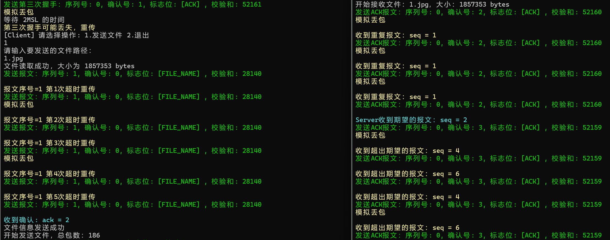

- 客户端发送：**序列号：1**，**确认号：0**，**标志位：[FILE_NAME]**，**校验和：28140**。
- 服务端回复：**序列号：0**，**确认号：2**，**标志位：[ACK]**，**校验和：52160**。

- 客户端收到确认后显示 **"文件信息发送成功"**。

文件信息的序列号、确认号和标志位与协议设计完全一致，传输正确。

可以看到由于丢包率过高，出现了多次超时重传，Client丢包2次、Server丢包3次，所以Client在第5次重传的时候才正确收到了ack，开始发送文件。

##### 文件传输

文件传输过程中也出现了丢包导致的重传、重复接收报文。这里我的累积确认、和拥塞控制机制就发挥了作用。

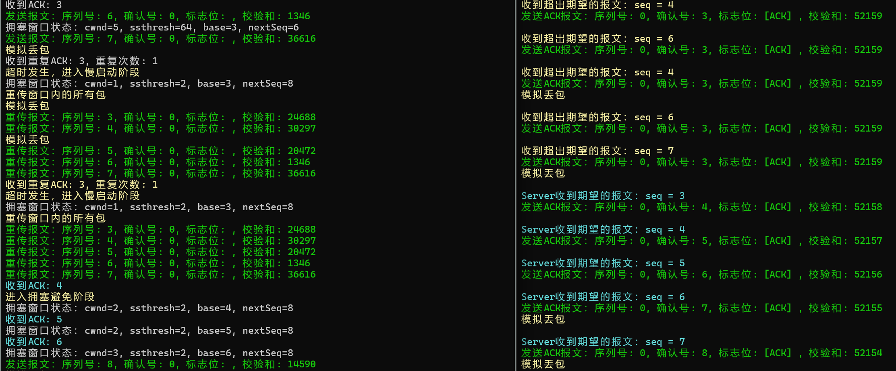

从日志中可以看出，刚开始处于慢启动状态，因此收到一个新的ACK就会使cwnd加1。所以左边拥塞窗口cwnd=5，ssthresh=64（我设计的协议初始值cwnd=4、ssthresh=64）；

然后由于丢包率过高，多次发生超时重传、而不是快速重传，直接在慢启动状态进入慢启动状态，cwnd=1，ssthresh=2（我协议设计的ssthresh最小是2）；

之后好不容易cwnd=ssthresh进入拥塞避免状态。可以看到接收到2个新的ACK（刚好等于cwnd）才让cwnd加1；

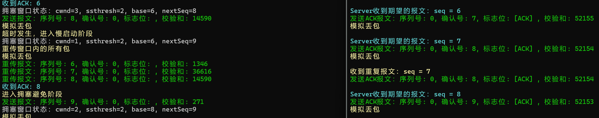

之后由于丢包率过高，也是没有意外地触发超时重传。从日志中可以看到，无论是哪个阶段触发超时，都会使cwnd=1，ssthresh=max（cwnd/2，2U）。

##### 传输结果

其他数据包的传输与此类似，就不再展示。直接到最后的传输结果：

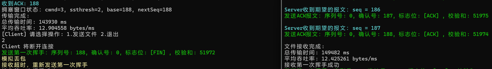

文件传输结束后，客户端和服务端均显示如下统计信息：

- **客户端**：总耗时143930ms，平均吞吐率12.9bytes/ms。
- **服务端**：总耗时149482ms，平均吞吐率12.4bytes/ms。

可以发现，吞吐率比3-1的停等协议和3-2的GBN都要高，也是符合逻辑的：停等协议一次只能发送一个数据包，是会比3-3的慢；而GBN由于没有实现拥塞控制，导致窗口过大，每次丢包都会需要发送窗口内的所有已经发送但没被确认的数据包，导致性能下降严重。（仔细分析也可以知道，丢包率过大时3-3的窗口比较小，而3-2GBN的很大，所以3-3吞吐率高；而丢包率小时，由于3-3的添加了三次丢包快速重传，所以吞吐率也比3-2的高）

##### 文件检查

传输完成后，查看文件属性

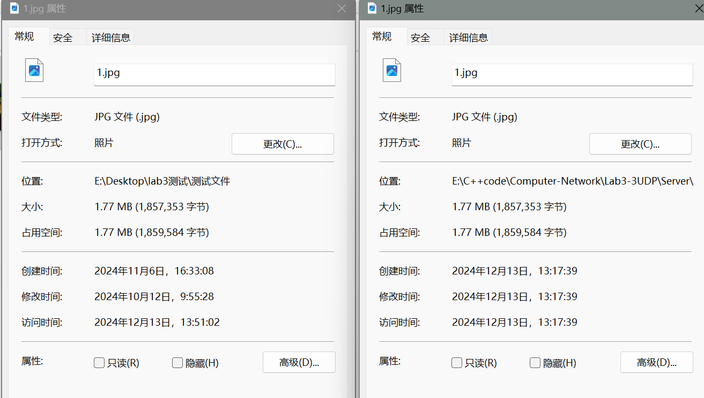

可以看到传输前后文件大小没有发生改变。

打开文件，可以看到文件成功打开，说明数据无误。


#### 四次挥手

测试最后进行了四次挥手，以确保连接能够正确关闭。

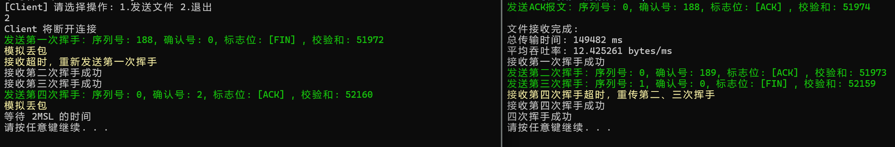

具体的分析过程和丢包测试在3-1中已经给出，就不再赘述。

### 其他测试

除了以上丢包率为 30%、延时为 100ms、传输文件1.jpg的测试，我也对三次握手、四次挥手、文件传输等不同过程、多个不同文件、不同丢包率和延时下的广泛测试，均能正确处理！！！

### 性能分析

我采用了**5%丢包率**和**10ms的延时**，同时将**超时重传时间设置为50ms**。以下是四个测试文件在这一条件下的总传输时间和平均吞吐率的对比结果：

|     文件名     | 大小(KB) | 数据包 | 传输时间(ms) | 吞吐率(bytes/ms) |
| :------------: | :------: | :----: | :----------: | :--------------: |
| helloworld.txt |   1617   |  166   |     3206     |       516        |
|     1.jpg      |   1814   |  186   |     3949     |       470        |
|     2.jpg      |   5761   |  590   |    11649     |       506        |
|     3.jpg      |  11689   |  1197  |    23454     |       510        |

> 以上数据仅对本次实验负责

从表格中可以看出：

- 随着文件大小的增加，总传输时间显著增加，这符合预期，因为更大的文件需要更多的数据包进行传输。
- 吞吐率在不同文件之间有一定的波动，但整体来看，随着文件大小的增加，吞吐率在大文件传输中保持相对稳定，这表明即使在丢包和延迟的环境下，TCP 协议的重传机制仍能有效保障传输效率。

为了更直观地展示这些结果，我绘制了文件大小与传输时间、吞吐率之间的关系图：

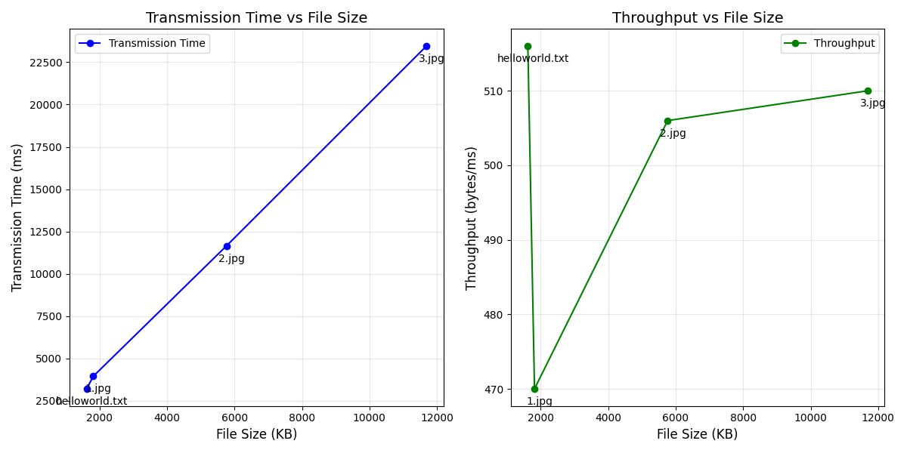

通过上述图表，可以直观地观察到传输时间随着文件大小的增加而线性增长，而吞吐率则相对稳定，尽管存在一定的波动。

（至于不同协议之间的对比，发送窗口大小、丢包率、延时时间等参数对 GBN 性能的影响，这样的测试就等 **3-4 时统一分析**）

## 六、实验反思与总结

------

### 实验挑战

本次实验涉及多线程的设计，由于线程的输出顺序不确定，可能导致输出顺序错乱，并且在缓冲区操作和计时方面也可能出现问题。为了应对这些挑战，我们引入了互斥锁（mutex）来保护共享资源，确保在访问这些资源时，不同线程不会产生冲突，从而解决了上述问题。

#### 多线程与网络通信调试

多线程和网络通信的调试本身就较为复杂，尤其是在复现问题和分析日志方面。为了提高调试效率，使用了 Visual Studio 等调试工具，进行了详细的分析，帮助更好地理解程序行为，特别是在并发操作中的异常和错误。

#### 拥塞控制中的“窗口大小增加”实现

在实现拥塞控制时，遇到一个问题：刚开始直接使用窗口大小的倒数来增加窗口大小。然而，由于窗口大小是整数，取倒数时会进行整除操作，导致结果为 0，最终窗口大小无法发生变化。因此，改进方案是引入一个额外的全局变量，用来记录收到的 ACK（确认应答）数量。

具体来说，每收到一个新的 ACK，变量加一。这个变量会在达到窗口大小时触发窗口的增大，随后将该变量重置为 0，进入下一轮的拥塞控制。这样，窗口的大小就能在每一轮数据包发送结束后根据 ACK 的数量进行增长。

**注意：** 这个变量需要是全局的，才能保证在每轮的发送过程中正确跟踪收到的 ACK 数量。

#### 重传机制与发送线程阻塞

本次实验引入了快速重传机制，在此之前仅使用超时重传机制。为了简化设计和保持重传的统一，我将重传逻辑集中放在了接收线程中。这样，如果发生重传，发送线程会被阻塞，确保同一时刻只有一个线程在进行数据包发送操作。

此外，重传本身通常意味着网络状况不佳。如果继续发送新的数据包，可能会加重网络负担，导致更严重的拥塞。因此，为了避免这个问题，在重传时暂停发送线程，以减少不必要的网络负载。

#### 打印锁保护输出

由于发送线程和接收线程可能会同时进行输出操作，因此需要添加打印锁来保证输出的正确性。否则，两个线程的输出可能会交错，导致打印内容不清晰，难以理解。

##### 为什么 3-2 不需要打印锁，而 3-3 需要？

在实验的 3-2 部分，重传机制仅包括超时重传，且该机制是在发送线程中进行的。在发送数据包之前，程序会检查是否需要进行重传（通过共享变量 `resend`）。打印操作仅在发送数据包时发生，而接收线程并不进行打印，因此，在这种情况下，发送线程已经是唯一的输出线程，不需要额外的锁来保护输出。

然而，在 3-3 中，除了超时重传外，还增加了快速重传机制。为了统一重传的逻辑，重传操作现在放到了接收线程中。如果在此时，接收线程进行快速重传，而发送线程又刚好检查完 `resend` 变量并准备发送数据包，可能会发生并发访问输出的情况。这时，两个线程同时操作共享的打印资源，导致输出混乱。因此，需要使用打印锁来确保输出的顺序和准确性。

### 程序不足

尽管取得了一定进展，但程序还存在一些不足之处。例如，初始的大缓冲区设计在传输大文件时占用了过多的内存，影响了性能。此外，重传等待时间采用固定值，没有根据网络条件进行动态调整，这导致了效率低下和不必要的重传。

### 改进措施

针对这些问题，我计划采取以下改进措施。首先，引入最大报文段大小（MSS）协商机制，根据网络状况和需求选择最合适的 MSS 值，以提高传输效率。其次，我将采用分块传输策略，将大文件分割成小块进行传输，减少内存占用，提高大文件传输效率。此外，我还将根据网络的实时状况动态调整重传等待时间，参考前一个消息的往返时延（RTT）。

### 实验收获

通过实现拥塞控制算法，我对 TCP 的流量控制和拥塞控制机制有了更直观的理解。特别是如何通过调整窗口大小来控制数据发送速率、如何使用 ACK 来确认数据包的接收等方面。这次实验中，我不仅学会了如何实现简单的窗口大小增加算法，还掌握了如何通过全局变量来有效地跟踪 ACK 的数量，并根据其动态调整窗口大小。

由于发送和接收线程可能同时进行输出操作，导致输出可能发生冲突和错乱。在这一点上，我深刻体会到了多线程输出时的挑战。通过引入打印锁来保护输出的顺序性，我学会了如何在并发编程中处理共享资源的输出问题，这也是并发编程中的一个常见难题。

