<div align='center'>
<b> <font face='微软雅黑' size='6'> 计算机网络课程实验报告 </font> </b>
</div>


<div align='center'>
<b> <font font face='微软雅黑' size='6'> 实验 3-4：性能对比实验 </font> </b>
</div>


<div>
<font face='宋体' size='6'>&nbsp;&nbsp;&nbsp;&nbsp; 学 院：网络空间安全学院 </font> <br>
<font face='宋体' size='6'>&nbsp;&nbsp;&nbsp;&nbsp; 专 业：信息安全 </font> <br>
<font face='宋体' size='6'>&nbsp;&nbsp;&nbsp;&nbsp; 学 号：2212998 </font> <br>
<font face='宋体' size='6'>&nbsp;&nbsp;&nbsp;&nbsp; 姓 名：胡博浩 </font> <br>
</div>
## 一、实验要求

------

基于给定的实验测试环境，通过改变延时和丢包率，完成下面 3 组性能对比实验：

（1）**停等机制与滑动窗口机制** 性能对比；

（2）滑动窗口机制中不同窗口大小对性能的影响；

（3）有拥塞控制和无拥塞控制的性能比较。

➢ 控制变量法：对比时要控制 **单一变量**（算法、窗口大小、延时、丢包率） 

➢ Router：可能会有较大延时，**传输速率不作为评分依据**，也可自行设计 

➢ 延时、丢包率对比设置：要有梯度（例如 30ms,50ms, …；5%，10%，…） 

➢ 测试文件：必须使用助教发的测试文件（1.jpg、2.jpg、3.jpg、helloworld.txt） 

➢ 性能测试指标：时延、吞吐率，要给出 **图、表** 并进行分析

感谢老师的教导与助教的批阅，辛苦！

## 二、实验环境

------

本次实验基于前面三次实验完成，在 Windows 系统上使用 Visual Studio 进行测试，文件编码为 UTF-8（带 BOM）。

实验所用程序为 `3-1`、`3-2` 和 `3-3` 所写，每次传输数据包大小为 10000 字节，超时等待时间全部设置为 500ms，在实验过程中有根据情况进行修改，具体可见实验过程。

## 三、丢包延时模拟说明

------

**由于我没有经过给定的路由器，而是自己实现的延时与丢包**，因此有必要进行介绍和说明。

### 为什么要自行模拟

原有的路由器程序通过每隔 n 个数据包丢弃一个包来实现丢包机制，能够验证程序的超时重传功能，但无法模拟实际网络环境中因数据包延迟时间不同导致的乱序问题。而且程序也存在许多 bug，因此我决定自行模拟丢包延时。

### 具体实现

#### 丢包率与延时时间定义

在 `Message.h` 文件中引入以下两个参数，用于控制丢包和延时的模拟：

``` c++
double packetLossRate = 0.1; // 丢包率，取值范围为 0.0 到 1.0
int delayTime = 100;         // 延时时间，单位为毫秒
```

#### 辅助函数模拟丢包和延时

为实现丢包和延时的模拟，我设计了辅助函数 `sendtoWithSimulation`，用于包装标准的 `sendto` 函数。在数据发送过程中，该函数引入了延时模拟和随机丢包逻辑：

``` c++
bool Client:: sendtoWithSimulation(SOCKET s, const char * buf, int len, int flags, const struct sockaddr* to, int tolen) {
    // 模拟延时
    std::this_thread:: sleep_for(std::chrono:: milliseconds(delayTime));
    // 模拟丢包
    static std:: random_device rd;
    static std:: mt19937 gen(rd());
    static std:: uniform_real_distribution <> dis(0.0, 1.0);
    if (dis(gen) >= packetLossRate) {
        sendto(s, buf, len, flags, to, tolen); // 实际发送数据
        return true;
    }
    else {
        print("模拟丢包", WARN);
        return false;
    }
}
```

在客户端和服务器的所有数据发送过程中，将原有的 `sendto` 函数替换为 `sendtoWithSimulation`，实现对每个数据包的丢包和延时模拟。

## 四、前期准备

------

> 这里面涉及到的具体细节是以3-1为例进行展示，而其他程序就不再赘述

（1）因为这次实验主要是进行性能对比，而不是验证程序的正确性，所以我关闭了大量的日志输出，仅输出每次传输的结果即传输时间和吞吐率，避免过多的 I/O 操作影响传输性能。

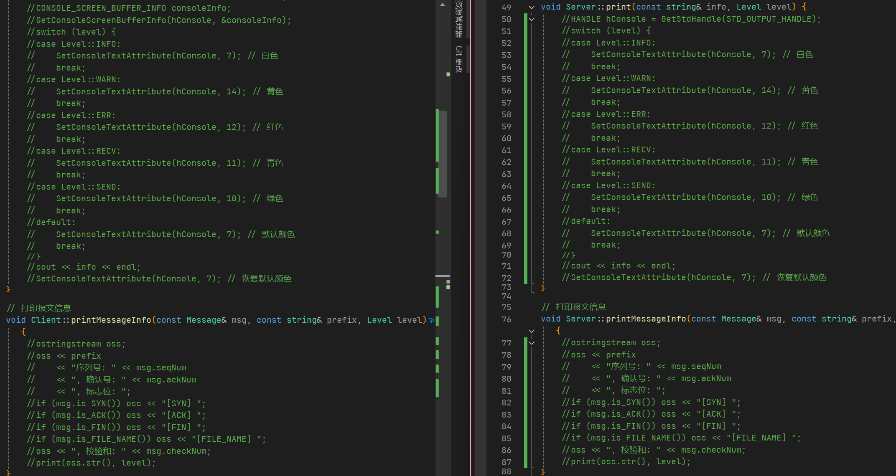

如图所示，由于我已经把所有输出操作进行了统一处理，所以这里只要将输出的这两个函数全部注释掉即可。

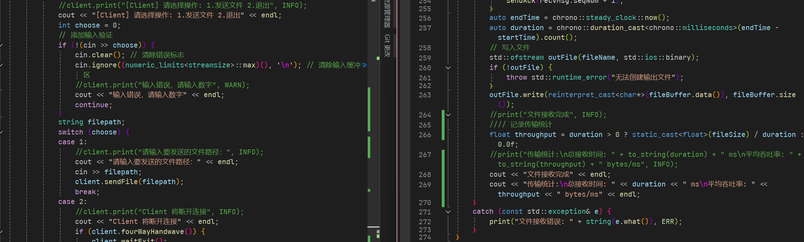

而有关传输结果的、以及最开始用户操作和文件路径选择的地方，又重新替换为了cout输出、内容不变。

（2）同时为了方便对不同的参数进行调整测试，我把相关参数的设置改为用户输入、而不是之前的宏定义，这样就可以不用反复编译程序、直接使用exe程序就行了。

首先把这些参数取消常量修饰，转为变量

``` c++
double packetLossRate = 0.05; // 丢包率，取值范围为 0.0 到 1.0
int delayTime = 100;         // 延时时间，单位为毫秒
int MAX_WAIT_TIME = 500;        // 超时时间（毫秒）
```

然后在main函数前面添加参数的输入即可，非常简单：

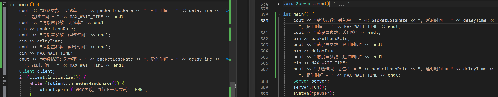

（3）修改后结果

经过这样修改后，输出变得简洁，而且能够快速更改参数而不必反复编译程序，大大节省了我的寿命😎。

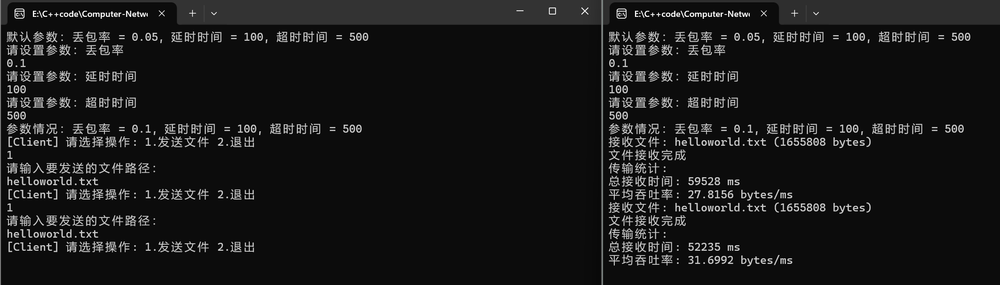

(4)程序整理

我把所有的程序打包为release版本，然后放在同一个文件夹下，这样我就可以很方便的进行对比测试：

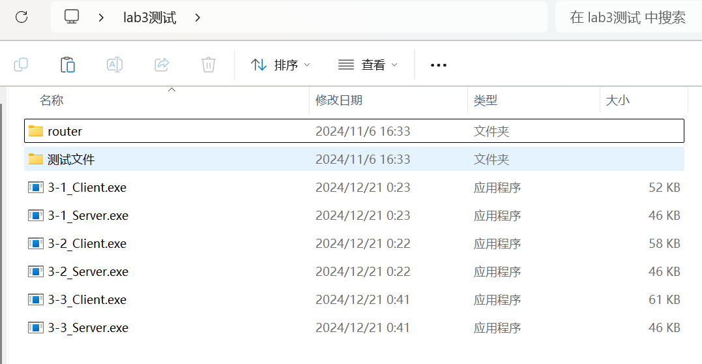

接下来就可以正式开始做实验了！

## 五、进行测试

------

本次实验主要使用**控制变量法**完成性能对比测试，具体标准如下：

- **传输文件**：`3.jpg`，文件大小为**11968994**字节。（选择大一点的文件，以减少实验波动）
- **性能测试指标**：时延与吞吐率
- **超时重传时间**（RTO）： 如果没有特殊说明，就是为`500ms`
- **单个数据包数据大小上限**：10000字节
- **实验涉及到的参数**：延时、丢包率、发送窗口大小
- **网络环境模拟**：自行设计，上面有具体分析。（这里是**同时改变Client和Server的延时和吞吐率**，以求模拟真实）

本次实验的数据均为**五次测试后取平均值**，能够避免一些偶然因素导致的数据误差。

实验中丢包率的单位为百分比，吞吐率的单位为Byte/ms，时延的单位为ms。

## 六、结果对比与分析

------

> 这里为了避免报告冗长，就不给出相应的结果截图，而是直接给出测试后取的平均值的数据。

### （一）停等机制与滑动窗口机制性能对比

因为窗口大小不是主要关心的变量，所以只要设定一个合适值即可，我设定**发送窗口的大小固定为16**。为了控制变量，我分为两种情况进行对比分析。

#### 1. 延时固定为0，只改变丢包率

|            丢包率            |  2%   |  5%   |  10%   |  20%   |
| :--------------------------: | :---: | :---: | :----: | :----: |
|   **停等机制传输时间(ms)**   | 32594 | 67210 | 142405 | 338018 |
| **停等机制吞吐率(bytes/ms)** |  367  |  178  |   84   |   35   |
|   **滑动窗口传输时间(ms)**   | 27843 | 48984 | 81461  | 158276 |
| **滑动窗口吞吐率(bytes/ms)** |  430  |  244  |  147   |   76   |

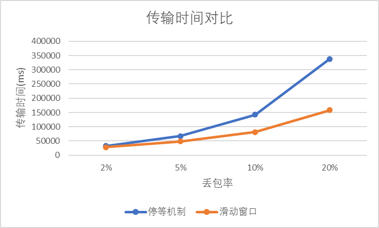

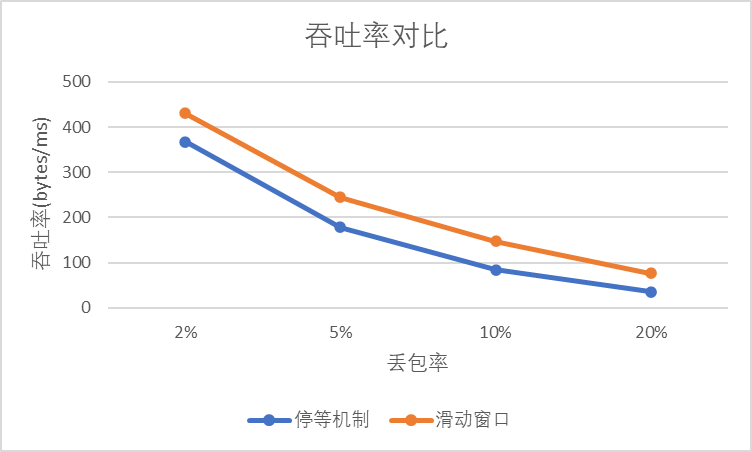

（1）数据分析：

- 随着丢包率的增加，停等机制和滑动窗口机制的传输时间都显著增加，吞吐率都显著降低。

- 无论丢包率多少（2%~20%），滑动窗口机制的传输时间和吞吐率都优于停等机制

（2）原因分析：

* **停等机制**: 由于每次发送一个数据包后都必须等待确认才能发送下一个数据包，因此丢包会导致传输时间显著增加。同时，由于发送速率较慢，丢包率对吞吐率的影响也较大。
* **滑动窗口机制**: 滑动窗口机制允许多个数据包同时传输，因此可以更好地利用网络带宽，提高吞吐率。

（3）补充说明：

这里并没有出现在高丢包率下、停等机制的性能略好于滑动窗口机制的情况，究其原因可能是我在 3-2 的实验中对代码的效率进行了优化改进，而 3-1 中没有。

#### 2. 丢包率固定为 2%，只改变延时

|           延时(ms)           |   0   |  10   |   50   |  100   |
| :--------------------------: | :---: | :---: | :----: | :----: |
|   **停等机制传输时间(ms)**   | 32594 | 63454 | 180433 | 287616 |
| **停等机制吞吐率(bytes/ms)** |  367  |  189  |   66   |   42   |
|   **滑动窗口传输时间(ms)**   | 27843 | 31826 | 101229 | 147211 |
| **滑动窗口吞吐率(bytes/ms)** |  430  |  376  |  118   |   81   |

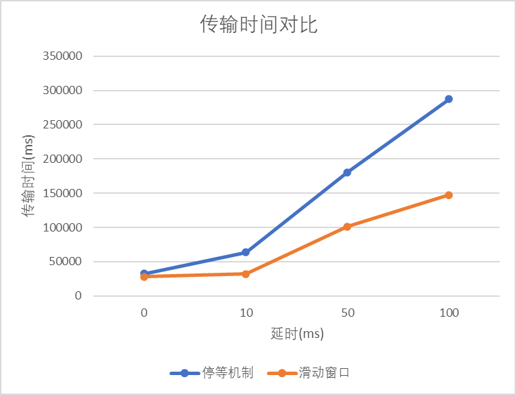

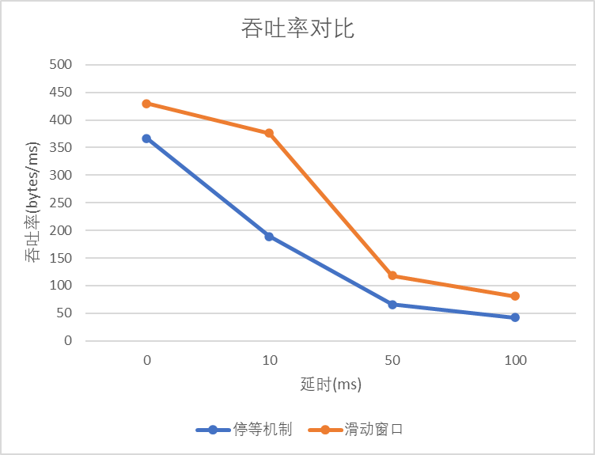

（1）数据分析：

- 随着延时的增加，停等机制和滑动窗口机制的传输时间都显著增加，吞吐率都显著降低。

- 无论延时（0~100ms）多少，滑动窗口机制的传输时间和吞吐率都优于停等机制

（2）原因分析：

* **停等机制**: 延时会导致等待确认的时间增加，从而增加传输时间。同时，由于发送速率较慢，延时对吞吐率的影响也较大。
* **滑动窗口机制**: 延时会导致数据包到达接收方的顺序发生改变，从而增加接收方的处理时间。同时，由于需要等待确认数据包，延时会降低发送窗口的利用率，进而降低吞吐率。

（3）补充说明：

滑动窗口机制的性能受窗口大小的影响较大，在后面的实验中也可以看到。

### （二）滑动窗口机制中不同窗口大小对性能的影响

由于在不同的网络状况下（丢包率和延时），不同窗口大小造成的影响也不同。所以我将分为两种情况进行实验。

#### 1. 网络好：延时固定为 10ms，丢包率固定为 2%，只改变窗口大小

|       窗口大小       |   1   |   4   |   8   |  16   |  32   |
| :------------------: | :---: | :---: | :---: | :---: | :---: |
|   **传输时间(ms)**   | 70957 | 34471 | 30251 | 31826 | 34404 |
| **吞吐率(bytes/ms)** |  169  |  347  |  396  |  376  |  348  |

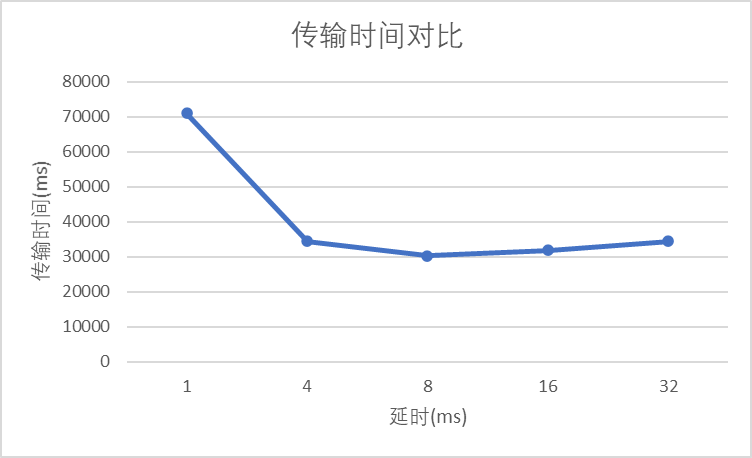

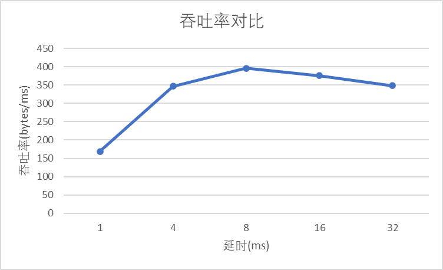

（1）数据分析：

- 随着窗口大小的增加，传输时间先下降后上升，吞吐率先上升后下降。

- 在窗口大小为 8 时，传输时间和吞吐率都达到最佳值。
- 窗口大小过大或过小都会导致传输性能下降。

（2）原因分析：

* **窗口过小**: 发送方发送数据包的速率较慢，无法充分利用网络带宽，导致传输效率低下；另外，当窗口较小时，无法激发快速重传机制，使得性能较低。
* **窗口过大**: 一个窗口内可能就会同时触发多次数据包的丢失和重传，这样不仅无法继续降低耗时，反而会因为频繁的重传操作而大大增加总耗时。

（3）补充说明：

在网络环境较好的情况下 (低延时、低丢包率)，滑动窗口机制需要选择合适的窗口大小才能达到最佳性能。

#### 2. 网络差：延时固定为 100ms，丢包率固定为 10%，只改变窗口大小

|       窗口大小       |   1    |   4    |   8    |   16   |   32   |
| :------------------: | :----: | :----: | :----: | :----: | :----: |
|   **传输时间(ms)**   | 448358 | 223906 | 255154 | 251090 | 231685 |
| **吞吐率(bytes/ms)** |   27   |   53   |   47   |   48   |   52   |

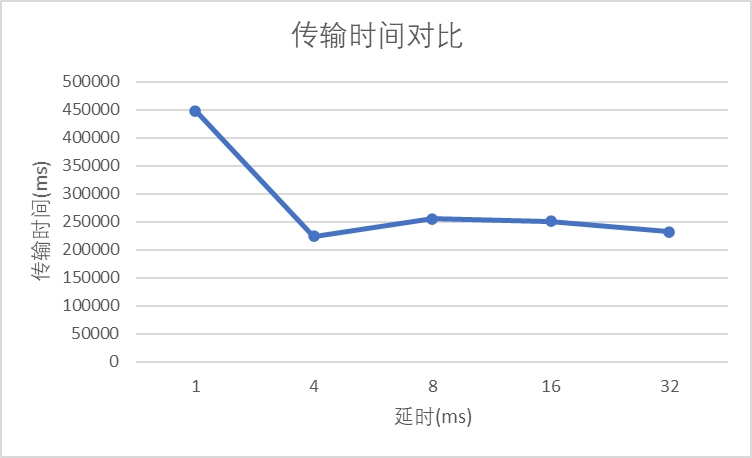

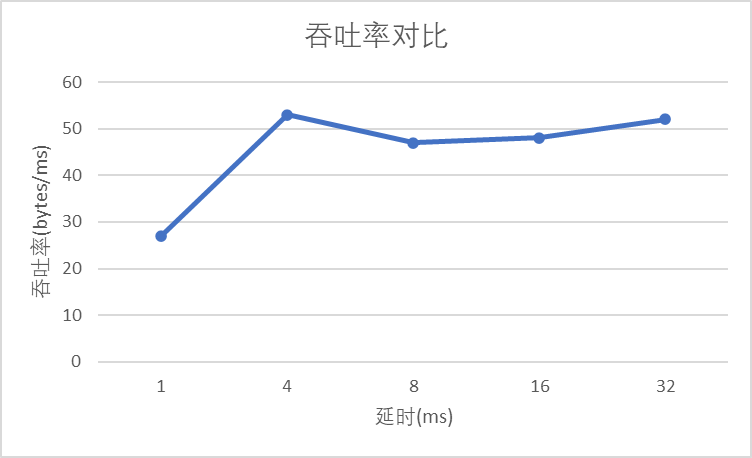

（1）数据分析：

- 随着窗口大小的增加，传输时间先下降后趋于稳定，吞吐率先上升后趋于稳定。

- 在窗口大小为 4 时，传输时间和吞吐率都达到最佳值。（峰值前移）

（2）原因分析：

* **网络环境差**: 延时和丢包率都较高，导致数据包丢失和重传的概率增加，从而增加传输时间和降低吞吐率。
* **窗口过大**: 一个窗口内可能就会同时触发多次数据包的丢失和重传，这样不仅无法继续降低耗时，反而会因为频繁的重传操作而大大增加总耗时。

（3）补充说明：

滑动窗口机制在恶劣的网络环境中并不适用，需要考虑实现拥塞控制。

### （三）有拥塞控制和无拥塞控制的性能比较

> GBN 发送窗口为 16，Reno 慢启动阈值设置为 64

#### 1. 延时固定为 0，只改变丢包率

|             丢包率             |  2%   |  5%   |  10%  |  20%   |
| :----------------------------: | :---: | :---: | :---: | :----: |
|   **无拥塞控制传输时间(ms)**   | 27843 | 48984 | 81461 | 158276 |
| **无拥塞控制吞吐率(bytes/ms)** |  430  |  244  |  147  |   76   |
|   **有拥塞控制传输时间(ms)**   | 3879  | 9540  | 39680 | 143295 |
| **有拥塞控制吞吐率(bytes/ms)** | 3086  | 1255  |  302  |   84   |

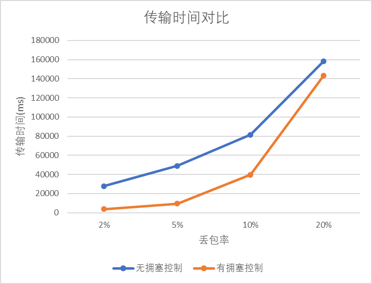

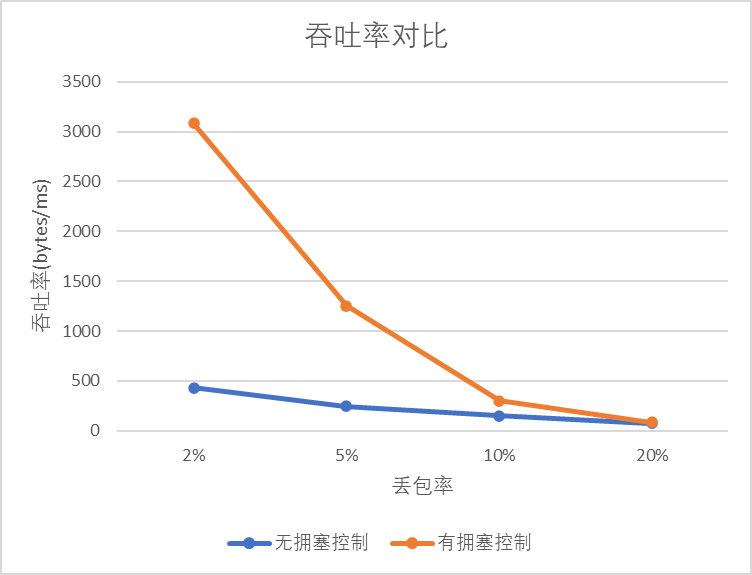

（1）数据分析：

- 随着丢包率的增加，有拥塞控制和无拥塞控制的传输时间都显著增加，吞吐率都显著降低。

- 在低丢包率 (2%) 下，有拥塞控制的传输时间和吞吐率显著优于无拥塞控制。
- 随着丢包率的增加，有拥塞控制的性能下降更快，最终在高丢包率 (20%) 下，有拥塞控制的性能几乎等于无拥塞控制。

（2）原因分析：

拥塞窗口机制的工作原理是通过减小窗口大小来应对网络拥塞，以避免发生网络崩溃或过多丢包。在丢包率较低的情况下，拥塞窗口能够适应网络状态，防止过多的数 据包进入网络。但随着丢包率的增加，客户端会很快进入快速重传阶段，并且由于丢包事件的发生，拥塞窗口会迅速减小。这种动态调整会导致客户端在传输过程中频繁进入拥塞控制的减小阶段，每次丢包后，拥塞窗口都要大幅度缩小，直到进入平稳状态。

更重要的是，随着丢包率持续增加，拥塞窗口的收敛值会更低，通过实验发现，实验中通常会收敛到一 个 10 到 20 的范围。这意味着，尽管拥塞窗口机制旨在优化流量控制，但由于频繁的窗口调整和丢包， 最终的传输效率往往低于没有拥塞控制的滑动窗口机制。滑动窗口机制通常更平稳，不会因为丢包过多 而导致频繁的调整，因此在高丢包率下的性能可能会更好。

总的来说，**拥塞窗口机制的引入并未能在高丢包率下有效地提高传输性能，反而由于频繁的窗口减小和快速重传，它导致了传输时长的增加。** 因此，在一些高丢包的场景下，简单的滑动窗口机制可能会比拥塞窗口机制表现得更好。

（3）补充说明：

根据我在 3-3 的实验中得出的结论，3-3 的拥塞控制中添加了 **三次超时快速重传**，而 3-2 的 GBN 中只有超时重传，导致 **如果超时重传时间设置的较大，实现了拥塞控制的 3-3 性能反而要优于无拥塞控制的 3-2**。

#### 2. 丢包率固定为 2%，只改变延时

|            延时(ms)            |   0   |  10   |   50   |  100   |
| :----------------------------: | :---: | :---: | :----: | :----: |
|   **无拥塞控制传输时间(ms)**   | 27843 | 31826 | 101229 | 147211 |
| **无拥塞控制吞吐率(bytes/ms)** |  430  |  376  |  118   |   81   |
|   **有拥塞控制传输时间(ms)**   | 3879  | 20367 | 85649  | 140378 |
| **有拥塞控制吞吐率(bytes/ms)** | 3086  |  588  |  140   |   85   |

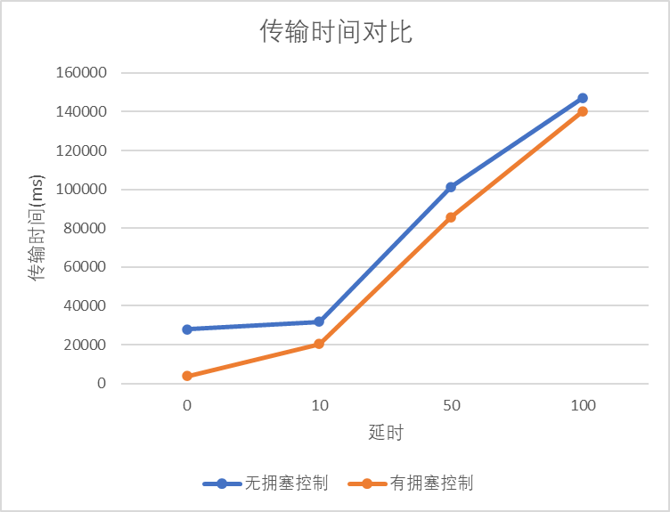

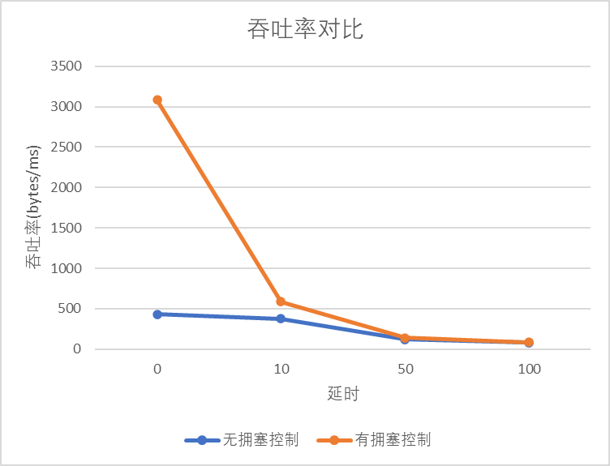

（1）数据分析：

- 随着延时的增加，有拥塞控制和无拥塞控制的传输时间都显著增加，吞吐率都显著降低。

- 在低延时 (0ms) 下，有拥塞控制的传输时间和吞吐率显著优于无拥塞控制。
- 随着延时的增加，有拥塞控制的性能下降更快，最终在高延时 (100ms) 下，有拥塞控制的性能几乎等于无拥塞控制。

（2）原因分析：

首先拥塞控制可以使得窗口岁网络的情况而逐渐变化，当网络好的时候会变的更大；但网络不好时，由于频繁缩小窗口导致窗口较小，甚至小于无拥控的窗口设定值，导致受时延的影响较大；当网络情况更差，拥控机制可能使窗口从几百降至 1，并进入重传，使得重传代价迅速增大。

（3）补充说明：

根据我在 3-3 的实验中得出的结论，3-3 的拥塞控制中添加了 **三次超时快速重传**，而 3-2 的 GBN 中只有超时重传，导致 **如果超时重传时间设置的较大，实现了拥塞控制的 3-3 性能反而要优于无拥塞控制的 3-2**。

### 七、实验反思与总结

------

#### （一）实验总结

综合本次实验的结果和分析，得出以下结论：

- **滑动窗口机制优于停等机制**：基于滑动窗口的文件传输机制在大多数情况下表现出优于停等机制的性能，特别是在较低丢包率和较小延迟的网络环境下。
- **滑动窗口机制的窗口大小对性能影响较大**：当窗口过小时，滑动窗口机制的性能接近于停等机制，丧失了滑动窗口的优势。当窗口增大时，性能整体提升，但在一定程度上会受到网络带宽、文件读取等因素的制约，最终趋于动态平衡，性能提升的效果逐渐减小。
- **拥塞控制的作用**：启用拥塞控制的滑动窗口机制通常表现出更好的性能，主要是因为它通过快速重传减少了等待时间。然而，在网络条件逐渐恶化的情况下，拥塞控制的机制性能下降更快，最终可能与没有拥塞控制的机制相当。
- **协议选择需依据网络条件**：选择合适的传输协议应根据网络的实际状况进行调整，适合的机制才是最有效的。

#### （二）与理论预期的偏差

在实验过程中，发现了一些与理论预期不完全一致的情况。例如，当丢包率或时延较高时，支持累计确认的滑动窗口协议的性能并未显著降低，且在某些情况下表现与停等协议相近，甚至更好。

经过反思，我总结了以下可能的原因：

1. **实际测试的巧合**：由于某些测试场景下的高延迟和丢包率较高，一次实验的时间开销较大，且测试次数有限，这可能导致了实验结果的巧合性，从而未能体现理论中的某些预期情况。
2. **实现的差异**：理论分析通常没有充分考虑实际实现中的差异。例如，实际的网络状况、协议的实现细节以及环境中的噪声等因素可能会导致理论与实际测试结果的偏差。

#### （三）协议适用性与局限性分析

- **停等协议的适用性**：停等协议在低丢包率和低延时的网络环境下表现出可接受的性能，适用于可靠性要求较低或网络条件较好的场景。然而，在高丢包率或高延时的情况下，停等协议的性能会显著下降，不适合对高效率和高可靠性有较高要求的场景。
- **GBN 协议的局限性**：GBN 协议在低丢包率和低延时的网络中表现较好，但在高丢包或高延迟的网络环境中，性能受到了显著影响，尤其是在高丢包的情况下，由于需要重传整个窗口内的所有数据包，导致效率大幅下降。
- **窗口大小对性能的影响**：实验表明，不同窗口大小对 GBN 的性能有显著影响。在网络条件良好的情况下，较大的窗口能够提高数据传输效率，但在网络拥塞时，过大的窗口反而可能导致性能下降。
- **协议选择的重要性**：本次实验进一步证明了在不同网络环境下选择合适协议的重要性。根据网络的延时、丢包率等特性，合理选择传输协议能够显著提高数据传输的效率和可靠性。

