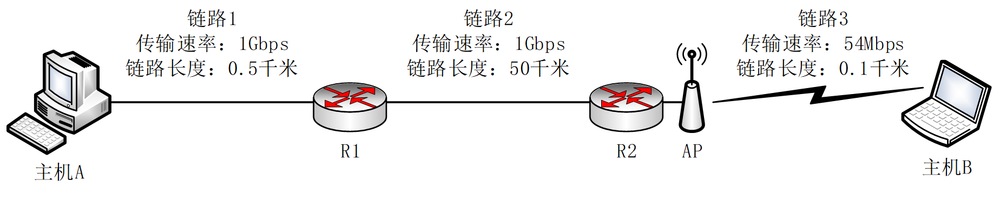
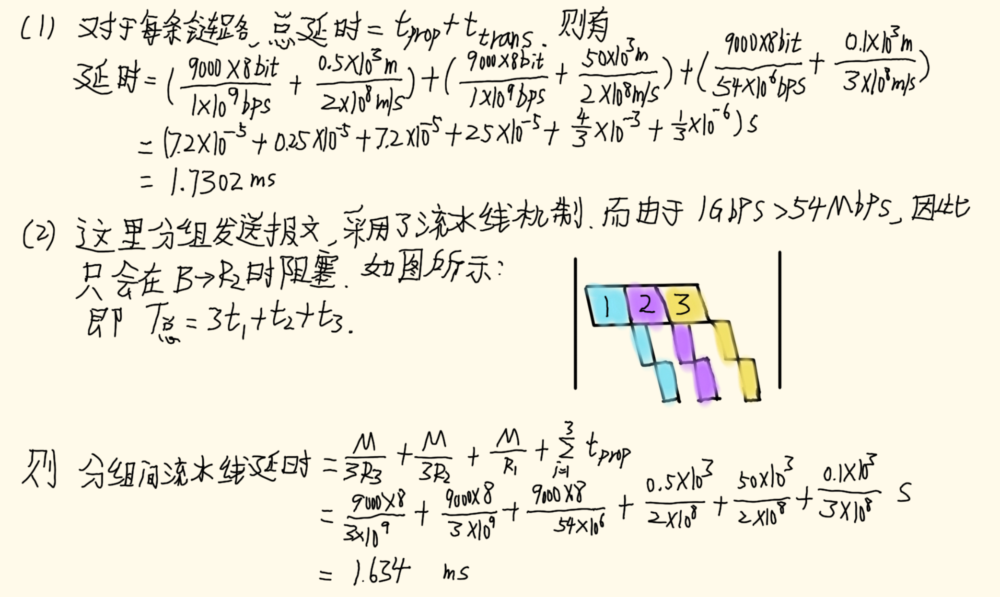
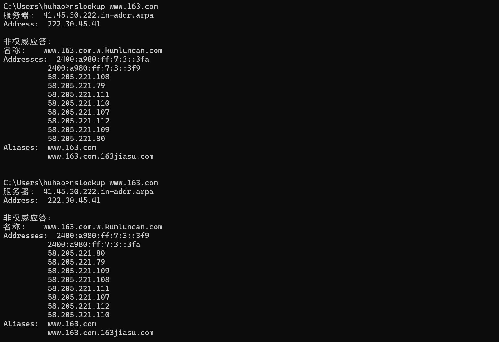
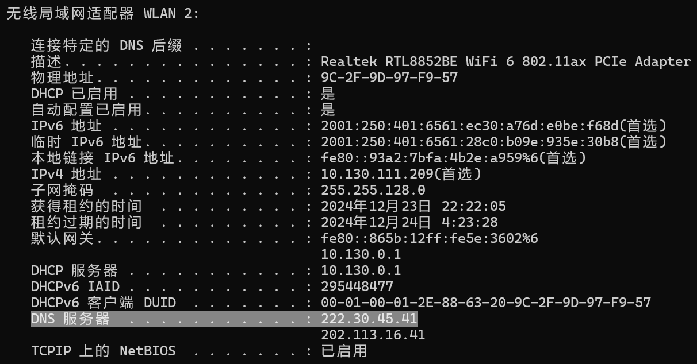
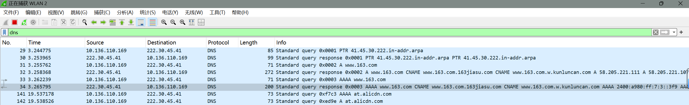
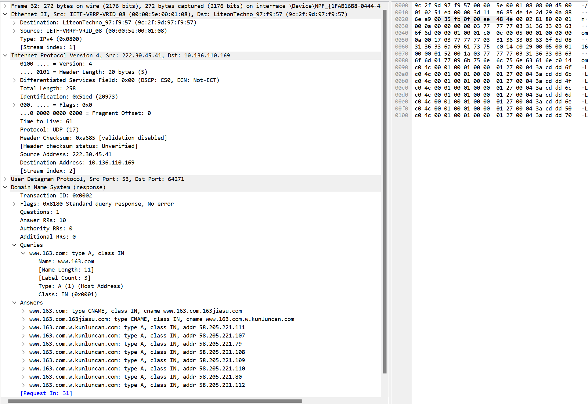

<div align='center'>
<b> <font face='微软雅黑' size='6'> 计算机网络课程作业 </font> </b>
</div>


<div align='center'>
<b> <font font face='微软雅黑' size='6'> 作业-1 </font> </b>
</div>


<div>
<font face='宋体' size='6'>&nbsp;&nbsp;&nbsp;&nbsp; 学 院：网络空间安全学院 </font> <br>
<font face='宋体' size='6'>&nbsp;&nbsp;&nbsp;&nbsp; 专 业：信息安全 </font> <br>
<font face='宋体' size='6'>&nbsp;&nbsp;&nbsp;&nbsp; 学 号：2212998 </font> <br>
<font face='宋体' size='6'>&nbsp;&nbsp;&nbsp;&nbsp; 姓 名：胡博浩 </font> <br>
</div>
## 习题 1-1

---

### 题目

> 网络的结构如下图所示，主机 A 与主机 B 之间通过 3 段链路和 2 台路由器（R1 与 R2）连接，每条链路的长度和传输速率在图中标出，R1 与 R2 采用存储转发机制，主机 B 向主机 A 发送一个长度为 9000 字节的报文。设电磁波在有线链路与无线链路中的传播速度分别为 $$2×10^8$$ 米/秒与 $$3×10^8$$ 米/秒，忽略 R2 与 AP 之间连接使用的链路，忽略报文在 R1 与 R2 的路由决策与排队的延时。
>
> 
>
> 请回答以下 3 个问题：
>
> （1）如果采用报文交换模式，请计算报文传输的最小端到端延时（从主机 B 传输报文第一位开始，到主机 A 接收到报文最后一位所用的时间）（20 分）
>
> （2）如果将报文平均分成 3 个分组依次传输，请计算完成报文传输的最小端到端延时（忽略报文封装成分组的开销）（20 分）
>
> （3）如果考虑报文在路由器中的路由决策与排队过程，那么端到端延时不确定性的来源及影响最大的因素（10 分）

### 解答



（3）

**不确定性来源**:

- **路由决策时间**: 路由器对分组的查表处理时间存在波动。
- **排队延时**: 当链路上流量较大时，分组可能在路由器中排队，造成不确定性。
- **传输错误重传**: 数据可能因传输错误而被重发，增加延时。
- **动态网络状态**: 链路拥塞或路由变化会引入额外延迟。

**影响最大的因素**：**排队延时**： 在高负载网络中，排队延时通常是影响端到端延时的主要因素。

## 习题 1-2

### 题目

> 通过 Windows 命令行模式下的 nslookup 命令查询 www.163.com，同时打开 Wireshark 软件捕获上述 nslookup 相关的 DNS 报文。
>
> 请回答以下 3 个问题：
>
> （1）提供 nslookup 查询结果截图，并对查询结果进行全面分析（20 分）
>
> （2）提供 Wireshark 捕获结果截图（仅过滤出 DNS 报文），并说明每条 DNS 报文的用途（20 分）
>
> （3）提供某个 DNS 报文详细信息截图，说明 DNS 服务使用哪种传输层协议，以及哪些措施可提高 DNS 服务可靠性（10 分）

### 解答

#### 问题一

首先我们要理解 nslookup 命令，它是 Windows 操作系统中用于查询 DNS (域名系统) 的工具，主要通过 DNS 服务器查询域名与 IP 地址的映射关系。

我们可以使用如下命令查询 www.163.com：

```css
nslookup www.163.com
```

经过多次执行此查询命令后，所获取的返回结果基本一致，详情如下：



下面对查询结果进行解释：

- **服务器信息**：

  ```css
  服务器:  41.45.30.222.in-addr.arpa
  Address:  222.30.45.41
  ```

  - 这里显示的是负责查询的 DNS 服务器地址。`41.45.30.222.in-addr.arpa` 是一个反向 DNS 解析域名，通常这类地址用于进行逆向查找，即通过 IP 地址查询对应的域名。
  - 服务器的实际 IP 地址是 `222.30.45.41`，表示查询过程中使用了一个外部 DNS 服务器，这可能是一个本地配置的 DNS 服务器，或者是一个 ISP 提供的 DNS 服务。


我们可以使用以下命令进行验证：

```css
ipconfig -all
```

这里我们只需要看本地连接的那个，如图所示：



可以发现 `222.30.45.41` 正是本机配置的 DNS 服务器！！！

- **非权威应答**：

  ```css
  非权威应答:
  名称:    www.163.com.w.kunluncan.com
  ```

  - 非权威应答意味着该 DNS 服务器没有 `www.163.com` 的权威信息，而是通过向其他 DNS 服务器查询并转发的结果。通常这是一个缓存的结果或通过递归查询得到的响应。
  - `www.163.com.w.kunluncan.com` 可能是一个缓存的别名或者是一个中间解析结果，这通常与 DNS 缓存或者 DNS 解析链有关。

- **返回的 IP 地址**：

  ```css
  Addresses:
      2400:a980:ff:7:3:: 3fa
      2400:a980:ff:7:3:: 3f9
      58.205.221.108
      58.205.221.79
      58.205.221.111
      58.205.221.110
      58.205.221.107
      58.205.221.112
      58.205.221.109
      58.205.221.80
  ```

  - **IPv6 地址**：`2400:a980:ff:7:3:: 3fa ` 和 ` 2400:a980:ff:7:3:: 3f9 ` 是 ` www.163.com` 域名的 IPv6 地址。这表明该域名支持 IPv6 协议，可以通过 IPv6 网络访问。
  - **IPv4 地址**：`58.205.221.108` 等一系列地址是 `www.163.com` 的 IPv4 地址。这些 IP 地址属于 `58.205.221.0/24` 段，通常是 163.com 服务器的地址范围，表示 `www.163.com` 在该段 IP 范围内的多个服务器。

- **别名信息**：

  ```css
  Aliases:  www.163.com
            www.163.com.163jiasu.com
  ```

  该域名有两个别名：`www.163.com` 和 `www.163.com.163jiasu.com`。这里的别名指的是 DNS 中的 CNAME 记录。CNAME 记录是 DNS 中的一种资源记录，它将一个域名（也称为正向查找）映射到另一个域名。这种映射允许 DNS 系统将一个域名的请求重定向到另一个域名，而不需要改变原始请求。注意，CNAME 记录只能指向另一个域名，而不能直接指向 IP 地址。此外，一个域名只能有一个 CNAME 记录，如果设置了 CNAME 记录，就不能再为该域名设置 A 记录（用于将域名指向 IPv4 地址）或 AAAA 记录（用于将域名指向 IPv6 地址）。

**总结**：

- **非权威应答**：本次查询返回的 DNS 响应是非权威应答，表明当前 DNS 服务器不是负责 `www.163.com` 域名的权威 DNS 服务器，而是通过递归查询或缓存返回的结果。
- **IPv6 支持**：`www.163.com` 具有 IPv6 地址，表示其服务器支持并可以通过 IPv6 网络访问。
- **多个 IP 地址**：返回了多个 IPv4 和 IPv6 地址，这通常是因为 `www.163.com` 的服务器采用了负载均衡技术，通过多个 IP 地址分担访问负载。
- **别名**：`www.163.com` 有一个 CNAME 记录，指向 `www.163.com.163jiasu.com`，这通常是为了进行流量优化，可能与某个加速服务（如 CDN）相关。

#### 问题二

这里打开 wireshark，设置如下过滤器：

```css
dns
```

然后重新输入 nslookup 命令，结果如下：



下面我对每条 DNS 报文的用途进行分析：

**报文 29**:

- **源地址**: `10.136.110.169`
- **目的地址**: `222.30.45.41`
- **信息**: **标准查询 (Standard query) PTR 41.45.30.222.in-addr.arpa**
- **用途分析**: 这是一个反向 DNS 查询请求，目的是通过 IP 地址 `222.30.45.41` 查找对应的主机名。查询的类型是 PTR（Pointer）记录，通常用于将 IP 地址映射回主机名。此查询可能是通过 DNS 服务器确认发起查询的来源 IP 的域名。

**报文 30**:

- **源地址**: `222.30.45.41`
- **目的地址**: `10.136.110.169`
- **信息**: **标准查询响应 (Standard query response) PTR 41.45.30.222.in-addr.arpa PTR 41.45.30.222.in-addr.arpa**
- **用途分析**: 这是对前一条反向查询的响应，返回了一个 PTR 记录，指明 `222.30.45.41` 的域名为 `41.45.30.222.in-addr.arpa`。这表明 DNS 服务器返回了正确的解析结果。

**报文 31**:

- **源地址**: `10.136.110.169`
- **目的地址**: `222.30.45.41`
- **信息**: **标准查询 (Standard query) A [www.163.com](http://www.163.com)**
- **用途分析**: 这是一个针对 `www.163.com` 域名的标准 DNS 查询，请求其对应的 IPv4 地址。查询的类型是 A（Address）记录，目的是通过 DNS 服务器获得 `www.163.com` 的 IPv4 地址。

**报文 32**:

- **源地址**: `222.30.45.41`
- **目的地址**: `10.136.110.169`
- **信息**: **标准查询响应 (Standard query response) A [www.163.com](http://www.163.com)**
- 用途分析: 这是对前一条 DNS 查询（A 记录查询）的响应。返回了多个 A 记录（IPv4 地址）和 CNAME（别名）记录：
	- **A 记录**：返回了多个 IP 地址，如 `58.205.221.111`, `58.205.221.107` 等，表示 `www.163.com` 域名对应多个服务器 IP 地址。
	- **CNAME 记录**：显示了 `www.163.com` 的别名，分别为 `www.163.com.163jiasu.com` 和 `www.163.com.w.kunluncan.com`。这表示 `www.163.com` 可能通过 CNAME 重定向到其他域名，可能是负载均衡或内容分发网络（CDN）的一部分。

**报文 33**:

- **源地址**: `10.136.110.169`
- **目的地址**: `222.30.45.41`
- **信息**: **标准查询 (Standard query) AAAA [www.163.com](http://www.163.com)**
- **用途分析**: 这是一个针对 `www.163.com` 域名的查询，请求其对应的 IPv6 地址。查询的类型是 AAAA（IPv6 地址）记录，目的是通过 DNS 服务器获取 `www.163.com` 的 IPv6 地址。

**报文 34**:

- **源地址**: `222.30.45.41`
- **目的地址**: `10.136.110.169`
- **信息**: **标准查询响应 (Standard query response) AAAA [www.163.com](http://www.163.com)**
- **用途分析**: 这是对前一条 DNS 查询（AAAA 记录查询）的响应。返回了多个 AAAA 记录，表示 `www.163.com` 对应的 IPv6 地址为 `2400:a980:ff:7:3:: 3f9 ` 和 ` 2400:a980:ff:7:3:: 3fa `。这表明 ` www.163.com` 服务器支持 IPv6，并提供了相应的 IPv6 地址。

**总结**：

1. **报文 29 & 30**: 反向 DNS 查询和响应，目的是通过 IP 地址 `222.30.45.41` 查询主机名。
2. **报文 31 & 32**: 对 `www.163.com` 的 IPv4 地址（A 记录）查询及响应，返回了多个 IPv4 地址和 CNAME 记录。
3. **报文 33 & 34**: 对 `www.163.com` 的 IPv6 地址（AAAA 记录）查询及响应，返回了多个 IPv6 地址，表明 `www.163.com` 支持 IPv6 连接。

#### 问题三

由于报文 32 包含多个 A 记录，并且显示了 `www.163.com` 的 CNAME 记录，因此我将对其进行探讨。

以下展示的是报文 32 的详细信息截图：



**报文分析**：

1. **UDP 层**：

- **源端口**：53（标准的 DNS 服务器端口）。
- **目标端口**：64271，这是客户端为接收 DNS 响应而使用的端口。
- **UDP 数据长度**：230 字节，包含实际的 DNS 响应。

2. **DNS 响应层**：

- **Transaction ID**：`0x0002`，这是查询和响应之间的唯一标识符，用于配对请求和响应。
- **Flags**：
	- **Response**：`1`，表示这是响应报文。
	- **Opcode**：`0`（标准查询）。
	- **Authoritative**：`0`，服务器不具备该域名的权威性（即不是权威 DNS 服务器）。
	- **Recursion Available**：`1`，表示 DNS 服务器支持递归查询。
	- **Reply Code**：`0`，表示没有错误（`No Error`）。
- **Queries**：
	- **查询名称**：`www.163.com`，查询类型为 **A 记录**（即请求该域名的 IP 地址）。
	- **查询类型**：`A`，表示请求获取主机地址（IPv4 地址）。
	- **查询类**：`IN`（Internet，即互联网类）。
- **Answers**：
	- **CNAME 记录**：`www.163.com` 是别名，指向 `www.163.com.163jiasu.com`。
	- **CNAME 记录**：`www.163.com.163jiasu.com` 是别名，指向 `www.163.com.w.kunluncan.com`。
	- **A 记录**：`www.163.com.w.kunluncan.com` 的 IP 地址为 `58.205.221.111`、`58.205.221.107`、`58.205.221.79` 等多个地址。

**DNS 使用的传输层协议**

在上述报文的 `Internet Protocol` 部分，我们可以看到该 DNS 响应使用了 **UDP** 协议 (协议号 17)。并且该 DNS 报文的 **源端口** 是 53（标准的 DNS 端口），而 **目标端口** 是 64271，这是客户端发送查询时的动态端口。

实际上，DNS 通常使用 **UDP** 协议进行通信，而非 TCP，原因包括：

1. **低延迟：** UDP 是一个无连接的协议，相比于 TCP 协议，UDP 减少了握手、连接建立和连接管理的开销。对于 DNS 这种需要快速响应的服务，UDP 的无连接特性能提供更低的延迟，确保 DNS 响应能尽快到达客户端。
2. **高效性：** DNS 查询和响应的消息体积通常较小（一般不超过 512 字节），UDP 适合处理这些小数据包，而无需像 TCP 那样进行复杂的连接管理。这样的简洁性使得 UDP 成为 DNS 查询的理想选择。
3. **快速响应：** 因为没有连接的建立和管理，UDP 可以高效地支持大量的并发查询，特别是在 DNS 服务器需要快速响应全球范围内的查询时，UDP 能够显著减少延迟和拥塞。

**提高 DNS 服务可靠性的措施**

虽然 UDP 协议提供了高效的传输，但由于其不保证可靠性，DNS 服务通常需要采用额外的措施来提高可用性和可靠性。以下是一些常见的措施：

1. **冗余与多级 DNS 服务器**：
	
	- **冗余配置**：为了避免单点故障，DNS 服务通常会配置多个 DNS 服务器。如果一个 DNS 服务器无法响应，客户端可以查询其他服务器，保证 DNS 查询的可用性。
	
	- **多级 DNS 结构**：通过多级 DNS 服务器结构，DNS 查询可能首先到达本地 DNS 缓存服务器，再向上层的权威 DNS 服务器发起请求。这样可以减少中心化的负载并提高查询效率。
2. **DNS 缓存**：
	
	DNS 响应可以被客户端或中间 DNS 服务器缓存一定时间，这样即使上游 DNS 服务器暂时无法访问，缓存的记录依然可以用于解析域名。
3. **负载均衡**：
	
	通过 **多个 A 记录** 配置，DNS 可以将同一个域名映射到多个 IP 地址。这些 IP 地址通常指向不同的数据中心或服务器，从而实现负载均衡。
4. **DNSSEC（DNS 安全扩展）**：
	
	DNS 安全扩展 (DNSSEC) 通过提供数字签名，保证 DNS 响应的完整性和真实性。这样可以防止 DNS 篡改和中间人攻击，提高 DNS 服务的安全性和可靠性。
5. **TCP 回退机制**：
	
	虽然 DNS 默认使用 UDP 协议，但当查询响应的消息过大（超过 512 字节）时，DNS 会回退到使用 TCP 协议传输数据。TCP 能够保证数据传输的可靠性和完整性。
6. **Anycast 技术**：
	
	**Anycast** 是一种网络路由技术，它允许多个物理服务器使用相同的 IP 地址，客户端的 DNS 查询会自动路由到距离其最近的服务器。这种技术提高了 DNS 服务的响应速度，减少了网络延迟，并且增加了 DNS 服务的可用性。如果某个 DNS 服务器出现故障，流量会自动转到其他节点，避免服务中断。

**总结**

- **传输层协议**：DNS 服务主要使用 **UDP 协议**，因为它具有低延迟和高效性，适合快速查询和响应。然而，由于 UDP 不提供可靠性，DNS 服务需要采取其他措施确保其可用性和稳定性。

- **提高 DNS 服务可靠性的方法**：主要包括冗余配置、DNS 缓存、负载均衡、DNSSEC 安全扩展、TCP 回退机制和 Anycast 技术等。这些措施有助于提高 DNS 服务的容错性、可用性和响应速度，确保 DNS 查询在不同网络环境下始终能够顺利完成。

