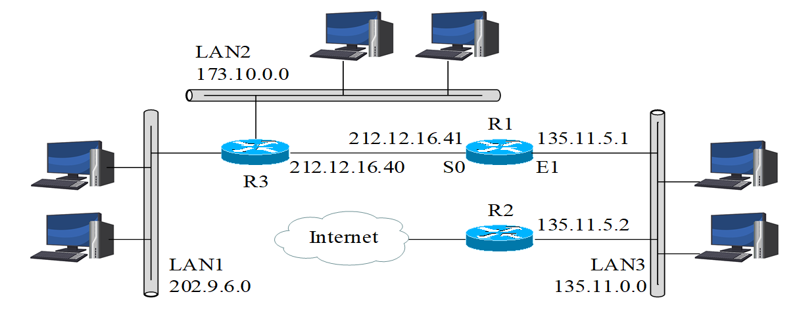
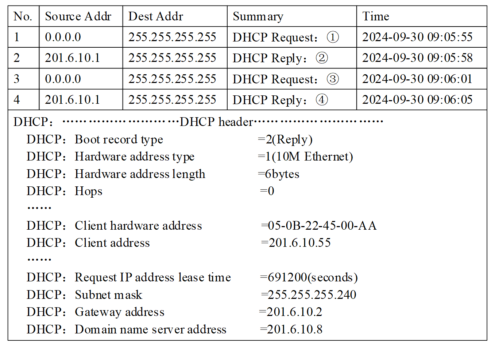

<b>  计算机网络课程作业  </b>

<b>  作业-2  </b>

&nbsp;&nbsp;&nbsp;&nbsp; 学 院：网络空间安全学院   
&nbsp;&nbsp;&nbsp;&nbsp; 专 业：信息安全   
&nbsp;&nbsp;&nbsp;&nbsp; 学 号：2212998   
&nbsp;&nbsp;&nbsp;&nbsp; 姓 名：胡博浩   

## 习题 2-1

---

### 题目

> 互联网络的结构如下图所示。其中，LAN1、LAN2 与 LAN3 是局域网，R1、R2 与 R3 是路由器，R2 接入 Internet。图中出现的地址均为标准分类的 IPv4 地址，没有进一步将其划分子网。
>
> 
>
> 请回答以下 3 个问题：
>
> （1）根据已知条件构造 R1 的路由表（包含目的网络、下一跳地址与转发端口），要求写出构造过程（40 分）
>
> （2）如果 R1 收到一个目的地址为 130.19.237.5 的 IP 分组，那么 R1 将选择哪个端口作为下一跳的转发端口，要求写出判断过程（5 分）
>
> （3）R1 能否收到目的地址为 127.1.1.1 的 IP 分组，要求说明原因（5 分）

### 解答

#### 问题一

IPv4 地址根据其前几位的二进制值被划分为 A 类、B 类和 C 类地址，每种类型有固定的默认子网掩码：

| **分类** | **起始范围（十进制）**    | **默认子网掩码**    |
| -------- | ------------------------- | ------------------- |
| A 类     | 1.0.0.0 - 126.0.0.0       | 255.0.0.0 (/8)      |
| B 类     | 128.0.0.0 - 191.255.0.0   | 255.255.0.0 (/16)   |
| C 类     | 192.0.0.0 - 223.255.255.0 | 255.255.255.0 (/24) |

根据图中的信息和标准分类规则，我们可以为各网络分配默认子网掩码（没有进行额外的子网划分）：

1. **LAN1 网络：`202.9.6.0`**

	属于 **C 类地址**，默认子网掩码为 **255.255.255.0 (/24)**。

2. **LAN2 网络：`173.10.0.0`**

	属于 **B 类地址**，默认子网掩码为 **255.255.0.0 (/16)**。

3. **LAN3 网络：`135.11.0.0`**

	属于 **B 类地址**，默认子网掩码为 **255.255.0.0 (/16)**。

4. **R1 和 R3 直连的地址：`212.12.16.40`**

	属于 **C 类地址**，默认子网掩码为 **255.255.255.0 (/24)**。

R1 的路由表需要包括以下字段：**目的网络、下一跳地址、转发端口**。以下为详细的构造过程：

1. **直连网络**
	R1 的接口直接连接到以下网络：
	- **LAN3**：R1 的 E1 接口直接连接到 LAN3，网络 `135.11.0.0/16` 是直连网络，转发端口为 **E1**。
	- **R3（S0 接口）**：R1 的 S0 接口直接连接到 R3，`212.12.16.0/24` 是直连网络，转发端口为 **S0**。
2. **通过 R3（下一跳为 `212.12.16.40`）可达的网络**
	从拓扑可以看出，LAN1 和 LAN2 的流量需要通过 R3 转发：
	- **LAN1 网络（202.9.6.0/24）**：R3 转发，下一跳为 `212.12.16.40`，转发端口为 **S0**。
	- **LAN2 网络（173.10.0.0/16）**：R3 转发，下一跳为 `212.12.16.40`，转发端口为 **S0**。
3. **通过 R2 接入 Internet（默认路由）**
	R1 将未知目的网络的分组通过 R2 转发至 Internet，默认路由配置如下：
	- **默认路由（0.0.0.0/0）**：R2 转发，下一跳为 `135.11.5.2`，转发端口为 **E1**。

根据以上分析，R1 的完整路由表如下：

| **目的网络**     | **下一跳地址** | **转发端口** |
| ---------------- | -------------- | ------------ |
| `135.11.0.0/16`  | 直接转发       | `E1`         |
| `212.12.16.0/24` | 直接转发       | `S0`         |
| `202.9.6.0/24`   | `212.12.16.40` | `S0`         |
| `173.10.0.0/16`  | `212.12.16.40` | `S0`         |
| `0.0.0.0/0`      | `135.11.5.2`   | `E1`         |

#### 问题二

R1 查询路由表时会根据最长前缀匹配原则，依次匹配路由表中的网络：

- **212.12.16.0/24**：目的地址 `130.19.237.5` 不在此范围（范围为 `212.12.16.0 ~ 212.12.16.255`）。
- **202.9.6.0/24** ：目的地址不在此范围（范围为 `202.9.6.0 ~ 202.9.6.255`）。
- **135.11.0.0/16** 和 **173.10.0.0/16**：目的地址均不在这些范围。

因此，`130.19.237.5` 无法匹配具体目的网络。

未匹配到具体网络时，路由器会选择默认路由（`0.0.0.0/0`）。默认路由的下一跳地址为 **`135.11.5.2`**，转发端口为 **E1**。

综上所述，R1 将选择 **E1 接口** 作为转发端口，将分组转发到下一跳地址 `135.11.5.2`。

#### 问题三

根据 IPv4 地址标准分类，`127.0.0.0/8` 是保留的 **回环地址**，用于主机内部通信。回环地址的分组不会通过网络进行传输，它仅用于主机本地的 IP 通信（如测试本地 TCP/IP 协议栈）。如果某台主机发送目的地址为 `127.1.1.1` 的分组，分组不会进入网络，因此 R1 不可能收到该分组。

因此，R1 **无法收到** 目的地址为 `127.1.1.1` 的 IP 分组，，因为回环地址分组只在本地主机上有效，不会通过网络传输。

## 习题 2-2

### 题目

> WireShark 捕获的 DHCP 交互过程如下图所示。其中，第 4 个 DHCP 报文包括详细解析结果。
>
> 
>
> 请回答以下 4 个问题：
>
> （1）图中 ①~④ 位置的 DHCP 请求或响应的正式名称（20 分）
>
> （2）DHCP 服务器的 IP 地址，DHCP 报文传输采用单播还是广播模式（10 分）
>
> （3）主机通过 DHCP 服务器获得的 IP 地址与租用期长度（10 分）
>
> （4）主机从 DHCP 服务器获得 DNS 服务器与默认路由器的 IP 地址（10 分）

### 解答

#### 问题一

在 DHCP 协议中，主机通过 **DORA（Discover、Offer、Request、ACK）** 流程与服务器完成 IP 地址分配。根据图中捕获的报文，①~④ 的正式名称如下：

**① DHCP Discover：**

- 主机广播此报文，主动发现网络中的 DHCP 服务器。
- 这是 DHCP 客户端向网络中的 DHCP 服务器发送的第一个请求。

**② DHCP Offer：**

- DHCP 服务器响应 Discover 请求，向主机提供一个可用的 IP 地址及配置信息。
- 服务器通过该报文向客户端“提议”租用某个 IP 地址。

**③ DHCP Request：**

- 主机选择一个 DHCP 服务器（如果有多个），明确请求指定的 IP 地址及相关配置信息。
- 该报文用于主机向 DHCP 服务器发送租用请求。

**④ DHCP ACK：**

- DHCP 服务器确认分配的 IP 地址并提供最终的配置信息（如网关、DNS 等）。
- ACK 是 DHCP 服务器对主机租用请求的应答，标志整个分配过程完成。

#### 问题二

1. **DHCP 服务器的 IP 地址：**
	根据第 4 个报文的详细解析结果，`Source address` 字段中显示 DHCP 服务器的 IP 地址为：
	**`201.6.10.1`**。

2. **DHCP 报文传输模式：**
	在整个 DORA 流程中，DHCP 报文传输主要采用以下两种模式：

	- **广播模式（Broadcast）：**
		在 `Discover` 和 `Request` 阶段，主机尚未拥有 IP 地址，使用目标地址 `255.255.255.255` 进行广播。
	- **单播模式（Unicast）：**
		在 `Offer` 和 `ACK` 阶段，DHCP 服务器通常采用单播模式回复请求。

	从捕获的报文看，第 4 个报文（ACK）使用了广播，说明在此场景下 ACK 是广播发送。

#### 问题三

仔细查看第 4 个 DHCP 报文的详细解析结果。

1. **主机获得的 IP 地址：**
	根据第 4 个报文的 `Client address` 字段，主机通过 DHCP 服务器分配到的 IP 地址为：
	**`201.6.10.55`**。
2. **租用期长度：**
	根据解析结果中的 `Request IP address lease time` 字段，DHCP 服务器为该 IP 地址分配的租用期长度为：
	**691200 秒**（即 8 天）。
	这意味着主机可以使用该 IP 地址 8 天，超过租用期后需要重新申请续约。

#### 问题四

继续查看第 4 个 DHCP 报文的详细解析结果。

1. **DNS 服务器的 IP 地址：**
	根据第 4 个报文的 `Domain name server address` 字段，主机通过 DHCP 获得的 DNS 服务器的 IP 地址为：
	**`201.6.10.8`**。
2. **默认路由器的 IP 地址：**
	根据第 4 个报文的 `Gateway address` 字段，主机通过 DHCP 获得的默认路由器（网关）的 IP 地址为：
	**`201.6.10.2`**。
